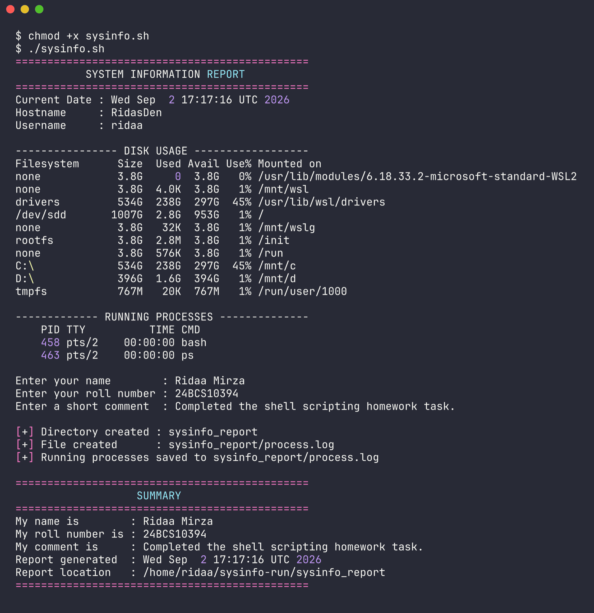
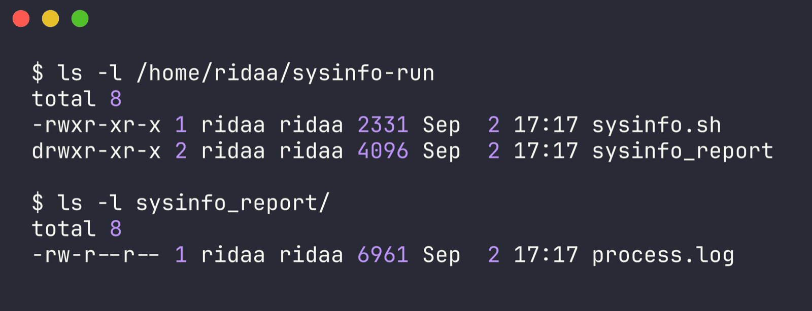
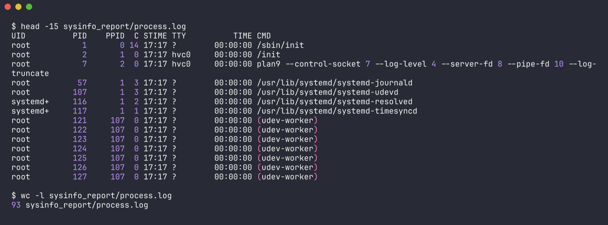

# Session 3 - Shell Scripting

Name: Ridaa Mirza
Enrollment No: 24BCS10394

Script: [sysinfo.sh](sysinfo.sh)
Raw output from running it: [run-output.txt](run-output.txt)

Ran on Ubuntu 24.04.1 LTS.

## Task - System information script

What it needs to do and where I did it in sysinfo.sh:

- print the current date -> `current_date=$(date)` then echo
- print the hostname -> `host_name=$(hostname)`
- print the username -> `user_name=$(whoami)`
- print disk usage -> `df -h`
- print running processes -> `ps`
- use variables -> current_date, host_name, user_name, report_dir, process_file, name, roll_no, comment
- take user input with `read -p` -> three read -p prompts
- create a directory with mkdir -> `mkdir -p "$report_dir"`
- create a file with touch -> `touch "$process_file"`
- store processes in the file with `>` -> `ps -ef > "$process_file"`

## How to run

```bash
chmod +x sysinfo.sh
./sysinfo.sh
```

It asks for your name, roll number and a comment, then writes a report folder containing process.log.

## Output from running it

```
==============================================
           SYSTEM INFORMATION REPORT
==============================================
Current Date : Wed Sep  2 17:17:16 UTC 2026
Hostname     : RidasDen
Username     : ridaa

---------------- DISK USAGE ------------------
Filesystem      Size  Used Avail Use% Mounted on
none            3.8G     0  3.8G   0% /usr/lib/modules/6.18.33.2-microsoft-standard-WSL2
none            3.8G  4.0K  3.8G   1% /mnt/wsl
drivers         534G  238G  297G  45% /usr/lib/wsl/drivers
/dev/sdd       1007G  2.8G  953G   1% /
none            3.8G   32K  3.8G   1% /mnt/wslg
rootfs          3.8G  2.8M  3.8G   1% /init
none            3.8G  576K  3.8G   1% /run
C:\             534G  238G  297G  45% /mnt/c
D:\             396G  1.6G  394G   1% /mnt/d
tmpfs           767M   20K  767M   1% /run/user/1000

------------- RUNNING PROCESSES --------------
    PID TTY          TIME CMD
    458 pts/2    00:00:00 bash
    463 pts/2    00:00:00 ps

Enter your name        : Ridaa Mirza
Enter your roll number : 24BCS10394
Enter a short comment  : Completed the shell scripting homework task.

[+] Directory created : sysinfo_report
[+] File created      : sysinfo_report/process.log
[+] Running processes saved to sysinfo_report/process.log

==============================================
                   SUMMARY
==============================================
My name is        : Ridaa Mirza
My roll number is : 24BCS10394
My comment is     : Completed the shell scripting homework task.
Report generated  : Wed Sep  2 17:17:16 UTC 2026
Report location   : /home/ridaa/sysinfo-run/sysinfo_report
==============================================
```



Checking that mkdir and touch actually worked:

```
$ ls -l /home/ridaa/sysinfo-run
total 8
-rwxr-xr-x 1 ridaa ridaa 2331 Sep  2 17:17 sysinfo.sh
drwxr-xr-x 2 ridaa ridaa 4096 Sep  2 17:17 sysinfo_report

$ ls -l sysinfo_report/
total 8
-rw-r--r-- 1 ridaa ridaa 6961 Sep  2 17:17 process.log
```



Both sysinfo_report/ and process.log got created by the script, as expected.

Checking that the `>` redirection actually caught the process list:

```
$ head -15 sysinfo_report/process.log
UID          PID    PPID  C STIME TTY          TIME CMD
root           1       0 14 17:17 ?        00:00:00 /sbin/init
root           2       1  0 17:17 hvc0     00:00:00 /init
root           7       2  0 17:17 hvc0     00:00:00 plan9 --control-socket 7 --log-level 4 --server-fd 8
root          57       1  3 17:17 ?        00:00:00 /usr/lib/systemd/systemd-journald
root         107       1  3 17:17 ?        00:00:00 /usr/lib/systemd/systemd-udevd
systemd+     116       1  2 17:17 ?        00:00:00 /usr/lib/systemd/systemd-resolved
systemd+     117       1  1 17:17 ?        00:00:00 /usr/lib/systemd/systemd-timesyncd
root         121     107  0 17:17 ?        00:00:00 (udev-worker)
root         122     107  0 17:17 ?        00:00:00 (udev-worker)

$ wc -l sysinfo_report/process.log
93 sysinfo_report/process.log
```



93 lines got written into the file by `ps -ef > "$process_file"`.

## Commands used and what they do here

| Command | Purpose in this script |
|---|---|
| `date` | current date and time |
| `hostname` | machine name |
| `whoami` | current effective username |
| `df -h` | disk usage, -h for human readable sizes |
| `ps` | processes in the current shell |
| `ps -ef` | every process, full format, written to the log |
| `read -p` | prompt for and read user input |
| `mkdir -p` | create directory, -p avoids an error if it already exists |
| `touch` | create the empty log file |
| `>` | redirect stdout into the file, overwriting |
| `$(...)` | command substitution, capture output into a variable |
| `echo` | print text and variable values |

One thing that tripped me up while writing this: storing a command's output needs `$(...)`.

```bash
current_date=$(date)     # correct, runs date and stores the result
echo $current_date

hostname_wrong=$hostname # wrong, $hostname is just an undefined variable, prints nothing
```

Just writing `$hostname` or `$whoami` prints nothing, because those are command names, not variables. You have to actually call them with `$(hostname)` and `$(whoami)`.
