# Session 5 - Git / GitHub

Name: Ridaa Mirza
Enrollment No: 24BCS10394

Every command below was actually run, not made up. Full transcript: [commands-output.txt](commands-output.txt).

## Task 1 - git commit -a -m vs git commit -m

| | `git commit -m "msg"` | `git commit -a -m "msg"` |
|---|---|---|
| Commits staged changes | yes | yes |
| Auto-stages modified tracked files | no | yes |
| Auto-stages deleted tracked files | no | yes |
| Auto-stages new untracked files | no | no |
| Needs git add first | yes | only for new files |

-a is basically shorthand for "run git add -u first". The important limitation: it only touches files git already knows about. A brand new file is invisible to -a and still needs an explicit git add.

Starting point - one tracked file modified, one new untracked file:

```
$ git status --short
 M app.txt
?? untracked.txt
```

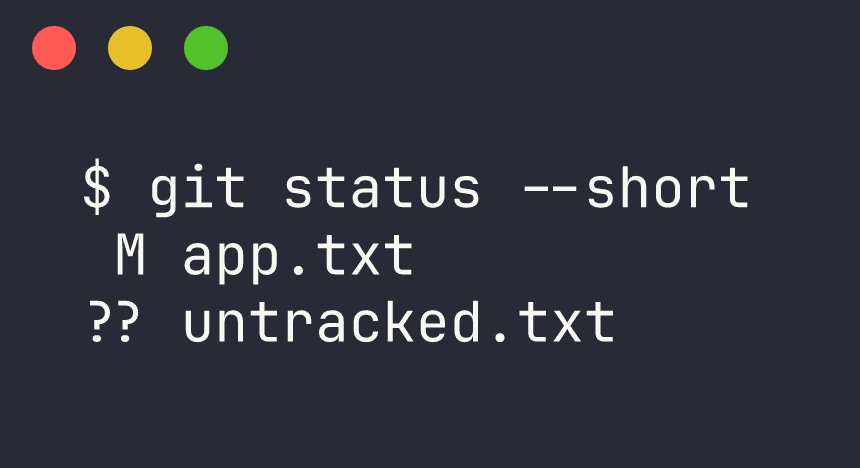

Attempt 1, plain git commit -m with nothing staged:

```
$ git commit -m "try without -a"
On branch main
Changes not staged for commit:
  (use "git add <file>..." to update what will be committed)
  (use "git restore <file>..." to discard changes in working directory)
	modified:   app.txt

Untracked files:
  (use "git add <file>..." to include in what will be committed)
	untracked.txt

no changes added to commit (use "git add" and/or "git commit -a")
```

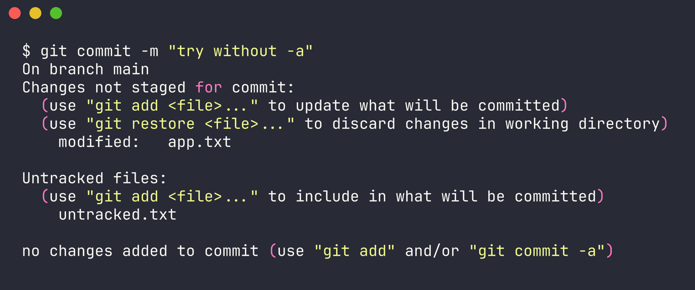

Nothing got committed since the modification was never staged.

Attempt 2, git commit -a -m:

```
$ git commit -a -m "Update app.txt using commit -a -m"
[main 6d4d5d7] Update app.txt using commit -a -m
 1 file changed, 1 insertion(+), 1 deletion(-)
```

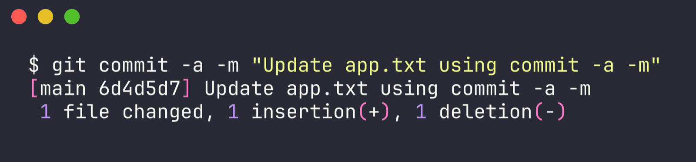

That worked, -a staged the modified tracked file on its own.

But checking what got left behind:

```
$ git status --short
?? untracked.txt
```

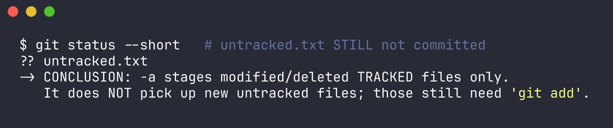

untracked.txt is still sitting there uncommitted. That's the actual difference, and why you can't just assume -a is the same as git add . - it quietly skips anything new.

So basically: use -a as a shortcut when you're only editing files that already exist in the repo. The moment you add new files, you still need git add for those. Assuming -a caught everything is a good way to push a build missing a file.

## Task 2 - Git cherry-pick

Step 1, some commits on main:

```
$ git log --oneline
de7cce5 main: commit number 4
0be5196 main: commit number 3
4d6f3c1 main: commit number 2
6d4d5d7 Update app.txt using commit -a -m
3093bd9 Initial commit: add app.txt
```

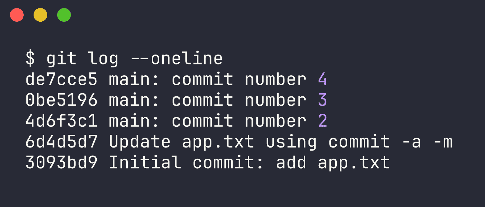

Five commits on main.

Step 2, new branch with its own commits:

```
$ git checkout -b feature
Switched to a new branch 'feature'
```

Three commits on feature, each adding a file:

```
$ git log --oneline
4fc8caf feature: add beta.txt
58158ad feature: add bugfix.txt (THIS ONE WILL BE CHERRY-PICKED)
db98737 feature: add alpha.txt
de7cce5 main: commit number 4
0be5196 main: commit number 3
4d6f3c1 main: commit number 2
6d4d5d7 Update app.txt using commit -a -m
3093bd9 Initial commit: add app.txt
```

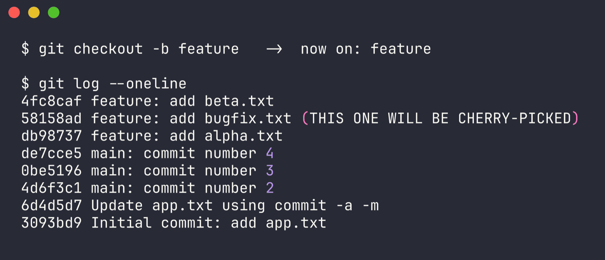

Step 3, find the one I actually want:

```
$ git log --oneline --grep=bugfix
58158ad feature: add bugfix.txt (THIS ONE WILL BE CHERRY-PICKED)
```

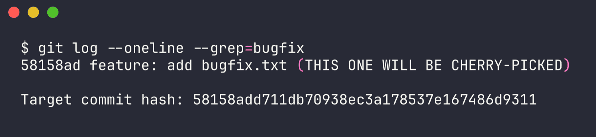

Target commit: 58158add711db70938ec3a178537e167486d9311

The idea is to bring only this bugfix over to main, and leave alpha.txt and beta.txt behind on feature - which is exactly the situation cherry-pick is for.

Step 4, cherry-pick it onto main:

```
$ git checkout main
Switched to branch 'main'

$ ls    # before cherry-pick
app.txt

$ git cherry-pick 58158add711db70938ec3a178537e167486d9311
[main efd1e37] feature: add bugfix.txt (THIS ONE WILL BE CHERRY-PICKED)
 Date: Wed Sep 2 17:18:30 2026 +0000
 1 file changed, 1 insertion(+)
 create mode 100644 bugfix.txt
```

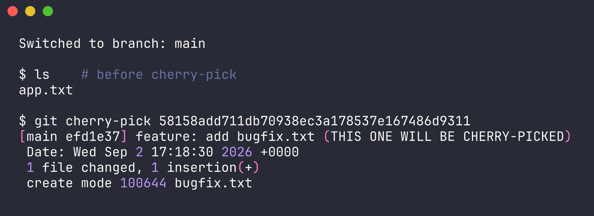

Step 5, confirm it landed on main:

```
$ ls    # after cherry-pick
app.txt
bugfix.txt

$ cat bugfix.txt
BUGFIX applied
```

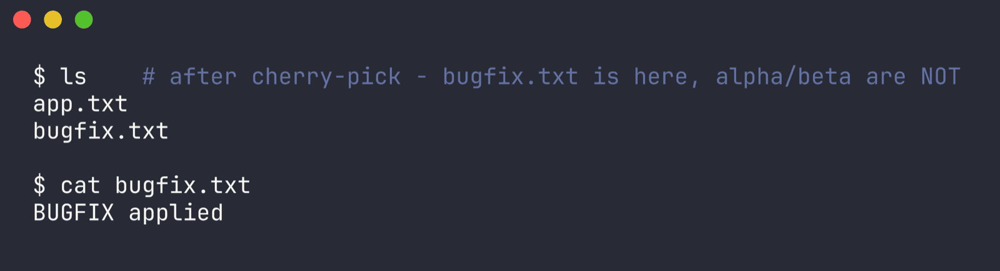

bugfix.txt is now on main. alpha.txt and beta.txt are not - only the one commit I picked came across.

```
$ git log --oneline
efd1e37 feature: add bugfix.txt (THIS ONE WILL BE CHERRY-PICKED)
de7cce5 main: commit number 4
0be5196 main: commit number 3
4d6f3c1 main: commit number 2
6d4d5d7 Update app.txt using commit -a -m
3093bd9 Initial commit: add app.txt
```

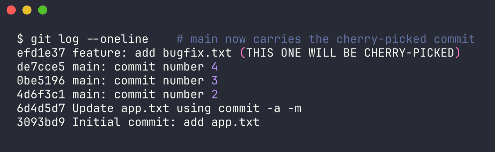

Step 6, the branch graph, this is the interesting part:

```
$ git log --oneline --all --graph
* 4fc8caf feature: add beta.txt
* 58158ad feature: add bugfix.txt (THIS ONE WILL BE CHERRY-PICKED)
* db98737 feature: add alpha.txt
| * efd1e37 feature: add bugfix.txt (THIS ONE WILL BE CHERRY-PICKED)
|/
* de7cce5 main: commit number 4
* 0be5196 main: commit number 3
* 4d6f3c1 main: commit number 2
* 6d4d5d7 Update app.txt using commit -a -m
* 3093bd9 Initial commit: add app.txt
```

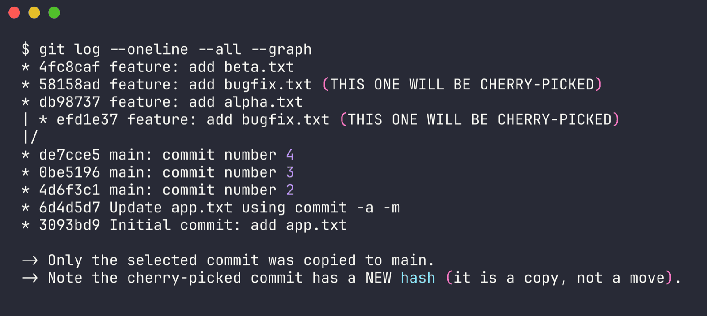

Same commit message shows up twice, on two different branches, with two different hashes:

- 58158ad, the original, still sitting on feature
- efd1e37, the copy, now on main

So cherry-pick copies a commit, it doesn't move it. Git takes the diff from the commit you picked and replays it on top of wherever you currently are, then makes a brand new commit object with its own hash - because a commit's hash depends on its parent too, and the parent is different now.

Some things that follow from that:

- the original commit is untouched on the source branch, cherry-pick doesn't delete anything
- if you later merge feature into main, git might show the change as already applied, or you could get conflicts if the copy was edited afterward - cherry-picking and then merging the same work is a classic way to confuse yourself
- if it doesn't apply cleanly, cherry-pick stops and makes you resolve conflicts, then you run git cherry-pick --continue (or --abort to bail out)

When you'd actually use this: pulling one urgent fix out of a dev branch straight into production, without dragging in whatever else is half-finished on that branch - which is basically what this exercise was simulating.

Some other cherry-pick options worth knowing:

| Command | Purpose |
|---|---|
| `git cherry-pick <hash>` | copy one commit |
| `git cherry-pick <h1> <h2>` | copy several specific commits |
| `git cherry-pick A..B` | copy a range (excluding A) |
| `git cherry-pick A^..B` | copy a range (including A) |
| `git cherry-pick -n <hash>` | apply the changes but don't commit |
| `git cherry-pick -x <hash>` | record the source hash in the message |
| `git cherry-pick --continue` | resume after resolving conflicts |
| `git cherry-pick --abort` | cancel and go back to before |
