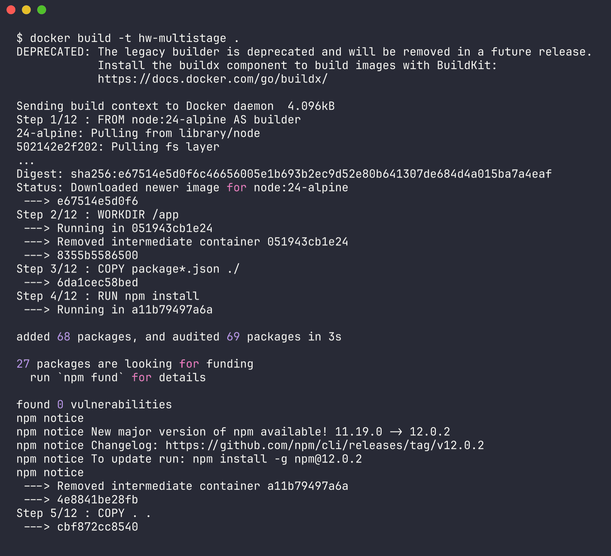
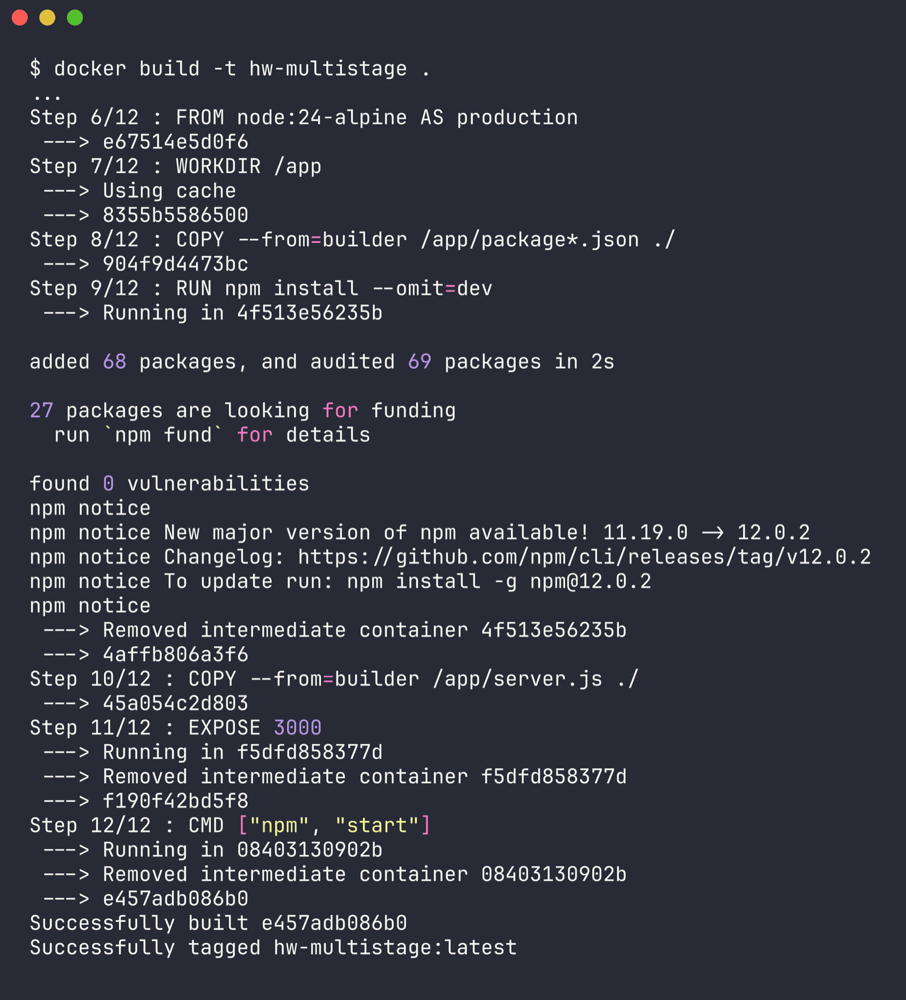
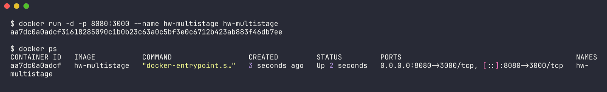
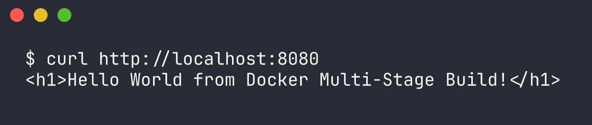
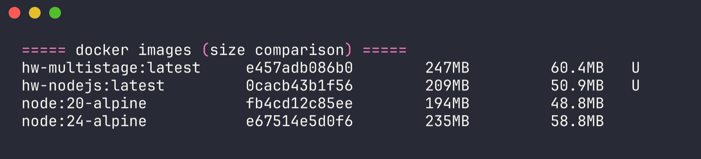

# Session 6-7 - Docker Multi-Stage Build

Name: Ridaa Mirza
Enrollment No: 24BCS10394

## Task 1 - Run the multi-stage Dockerfile

### Source

The multi-stage app comes from the course repo:

```bash
git clone https://github.com/Nency-Ravaliya/devops-heros.git
cd devops-heros/session6-7-docker/multi-stage-dockerfile
```

I vendored a copy here under [app/](app/) so this folder works on its own:

```
06-multi-stage/app/
├── Dockerfile
├── package.json
└── server.js
```

### The Dockerfile

```dockerfile
FROM node:24-alpine AS builder
WORKDIR /app
COPY package*.json ./
RUN npm install
COPY . .

FROM node:24-alpine AS production
WORKDIR /app
COPY --from=builder /app/package*.json ./
RUN npm install --omit=dev
COPY --from=builder /app/server.js ./
EXPOSE 3000
CMD ["npm", "start"]
```

### Important - it listens on 3000, not 8080

server.js hardcodes `const PORT = 3000`, and the Dockerfile says EXPOSE 3000. But the assignment wants it reachable on port 8080.

Both get satisfied through the port mapping, not by changing any code:

```
-p 8080:3000
   |     \-- container port (what the app actually listens on)
   \-------- host port (what the assignment asks for)
```

Running it with -p 8080:8080 would just fail, since nothing inside the container is listening on 8080.

### Build and run

```bash
cd app

# build
docker build -t multistage-hello .

# run, host 8080 mapped to container 3000
docker run -d -p 8080:3000 --name multistage-app multistage-hello

# check it's up
docker ps

# hit it
curl http://localhost:8080
```









Then open http://localhost:8080 in a browser.

### Expected result

```html
<h1>Hello World from Docker Multi-Stage Build!</h1>
```

Expected docker ps output:

```
CONTAINER ID   IMAGE               COMMAND         STATUS         PORTS                                       NAMES
<id>           multistage-hello    "npm start"     Up X seconds   0.0.0.0:8080->3000/tcp, [::]:8080->3000/tcp  multistage-app
```

That PORTS column showing 0.0.0.0:8080->3000/tcp is basically the proof the assignment is asking for.

### Actually ran it

I installed Docker afterward and actually built and ran this. Real output:

```
CONTAINER ID   IMAGE           COMMAND                  CREATED         STATUS         PORTS                                         NAMES
aa7dc0a0adcf   hw-multistage   "docker-entrypoint.s…"   3 seconds ago   Up 2 seconds   0.0.0.0:8080->3000/tcp, [::]:8080->3000/tcp   hw-multistage

$ curl http://localhost:8080
<h1>Hello World from Docker Multi-Stage Build!</h1>
```



Matches what was expected above. Full build/run log is in [docker-run-logs/06-output.txt](../docker-run-logs/06-output.txt).

## What a multi-stage build actually is

A multi-stage Dockerfile just has more than one FROM. Each FROM starts a totally fresh stage with its own filesystem. COPY --from=<stage> pulls specific files forward from an earlier stage, and everything else from that stage gets thrown away.

The problem it fixes: building software usually needs compilers and dev dependencies, but running it doesn't. Without multi-stage builds all of that ends up in production too, making the image bigger and giving it a bigger attack surface than it needs.

### Sizes in practice

| Approach | Typical size |
|---|---|
| single-stage Node build (with dev dependencies) | ~1.1 GB |
| multi-stage, production dependencies only | ~180 MB |
| multi-stage compiled to a static binary on scratch | ~15 MB |

### What this specific Dockerfile gains

Stage 1 runs a full npm install including devDependencies. Stage 2 starts over clean, installs with --omit=dev, and only copies server.js across. The devDependencies exist during the build but never end up in the final image.

### Why this is worth doing

1. smaller images, faster to push/pull/deploy
2. better security, no compilers or build tools sitting in production to be exploited
3. no leaked secrets, anything used at build time stays in the discarded stage
4. one file, build and runtime defined together, no separate build script needed

### Some other multi-stage tricks

```dockerfile
# name your stages
FROM node:20 AS builder

# copy from a named stage
COPY --from=builder /app/dist ./dist

# copy from an external image without building it
COPY --from=nginx:alpine /etc/nginx/nginx.conf ./

# build only up to one stage
# docker build --target builder -t myapp:build .
```

## Task 3 - Deploy at least 3 application types

Did six app types (Node.js, Python, Java, Apache, React, Nginx) over in [../05-docker-apps/](../05-docker-apps/), more than the 3 the assignment asked for.

The three actually named in the assignment:

| Type | Folder | Build | Run |
|---|---|---|---|
| Node.js | [../05-docker-apps/nodejs-app/](../05-docker-apps/nodejs-app/) | `docker build -t hello-node .` | `docker run -d -p 3000:3000 hello-node` |
| Python | [../05-docker-apps/python-app/](../05-docker-apps/python-app/) | `docker build -t hello-python .` | `docker run -d -p 5000:5000 hello-python` |
| Java | [../05-docker-apps/java-app/](../05-docker-apps/java-app/) | `docker build -t hello-java .` | `docker run -d -p 8000:8000 hello-java` |

java-app and React-app are both multi-stage builds themselves, so the technique from Task 1 shows up there too.

## Still missing

Browser screenshot at http://localhost:8080 - no GUI browser available where I ran this, so that one is still open. The docker ps output showing the port mapping is now in [screenshots/03-run-and-ps.png](screenshots/03-run-and-ps.png). The command output that would go with them is already captured in [docker-run-logs/06-output.txt](../docker-run-logs/06-output.txt), including a docker images comparison.
