# Session 8 - Docker Networking & Volumes

Name: Ridaa Mirza
Enrollment No: 24BCS10394

## Task 1 - Docker container networking

Goal: 3 containers (frontend, backend, database), 3 networks, with the backend attached to two of them, then check connectivity between them.

### Topology

```
   frontend-net                      backend-net
  +--------------+                 +--------------+
  |  frontend    |                 |   database   |
  |  (nginx)     |                 |   (mysql)    |
  +------+-------+                 +-------+------+
         |                                 |
         +--------+             +----------+
                  |             |
              +---+-------------+---+
              |      backend        |   <- on BOTH networks
              |      (alpine)       |
              +---------------------+

   isolated-net  -- created, deliberately not connected to anything
```

Backend is the only container touching both networks, so it's the only path between frontend and database. Frontend can't reach database directly - that's the whole point of the exercise.

### Step 1 - create the three networks

```bash
docker network create frontend-net
docker network create backend-net
docker network create isolated-net

docker network ls
```

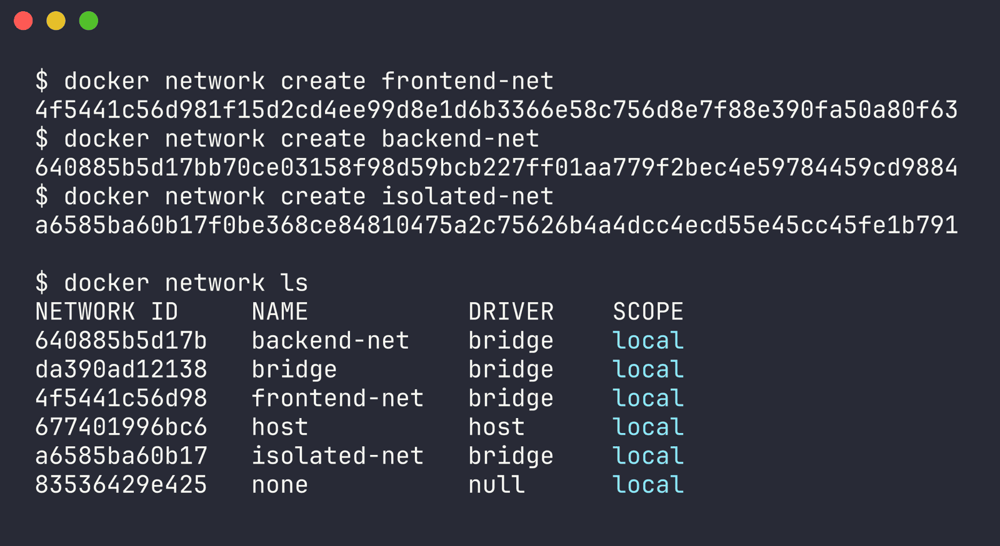

### Step 2 - create the containers

```bash
# frontend on frontend-net
docker run -d --name frontend --network frontend-net nginx:alpine

# database on backend-net
docker run -d --name database --network backend-net \
  -e MYSQL_ROOT_PASSWORD=rootpass \
  -e MYSQL_DATABASE=testdb \
  mysql:8.0

# backend on frontend-net first
docker run -d --name backend --network frontend-net alpine:latest sleep infinity
```

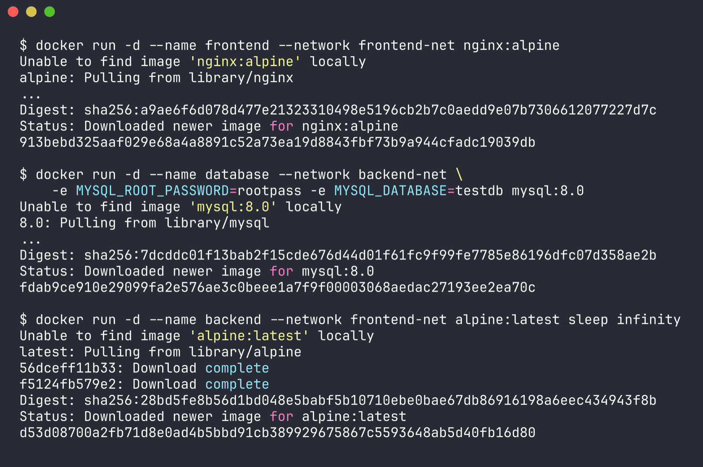

### Step 3 - attach backend to the second network

docker run only lets you pick one network up front. Extra ones get attached after the fact:

```bash
docker network connect backend-net backend
```

Check it's actually on both:

```bash
docker inspect backend -f '{{range $k, $v := .NetworkSettings.Networks}}{{$k}} {{end}}'
# expected: backend-net frontend-net
```

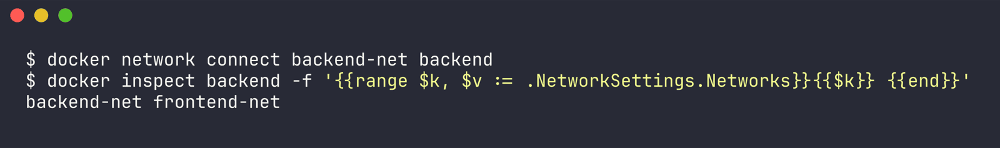

### Step 4 - check connectivity

Docker has an embedded DNS that resolves container names automatically as long as they're on a user-defined network together.

```bash
# install ping inside the alpine backend
docker exec backend apk add --no-cache iputils bind-tools

# backend -> frontend  (both on frontend-net)  should work
docker exec backend ping -c 3 frontend

# backend -> database  (both on backend-net)   should work
docker exec backend ping -c 3 database

# frontend -> database (no shared network)     should fail
docker exec frontend ping -c 3 database
# expected: ping: bad address 'database'

# frontend -> backend  (both on frontend-net)  should work
docker exec frontend ping -c 3 backend
```

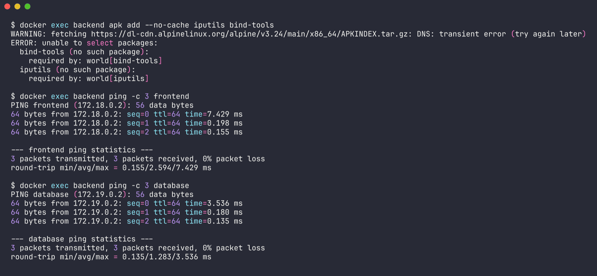

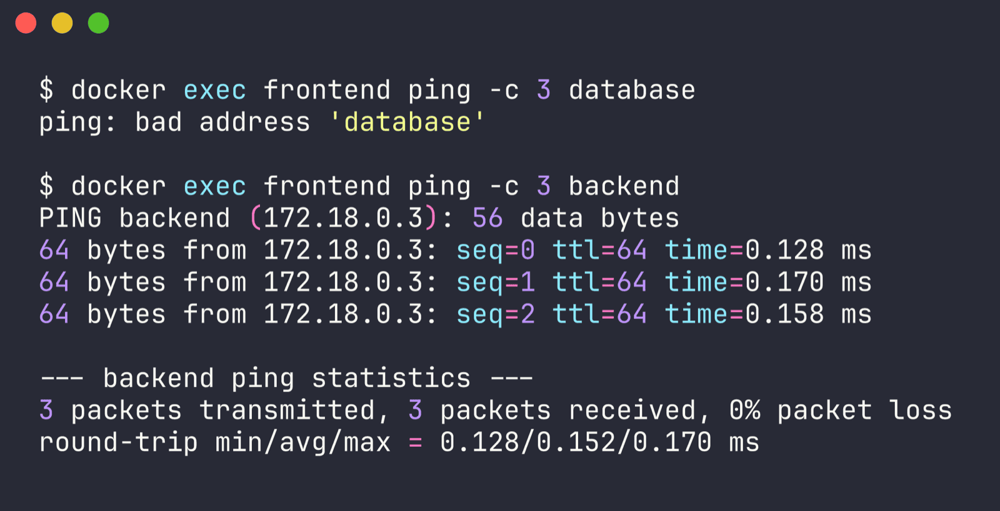

Also checked the actual database port from backend:

```bash
docker exec backend nc -zv database 3306
```

And which containers sit on which network:

```bash
docker network inspect frontend-net -f '{{range .Containers}}{{.Name}} {{end}}'
# expected: backend frontend

docker network inspect backend-net -f '{{range .Containers}}{{.Name}} {{end}}'
# expected: backend database
```

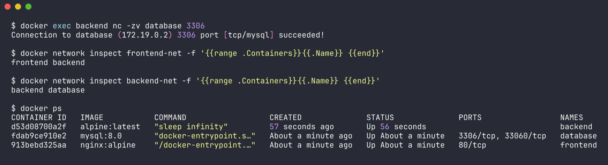

### Expected results

| From | To | Result | Why |
|---|---|---|---|
| backend | frontend | success | share frontend-net |
| backend | database | success | share backend-net |
| frontend | backend | success | share frontend-net |
| frontend | database | fails, bad address | no shared network |

The failure is the important bit - name resolution doesn't even succeed, because Docker's embedded DNS only resolves names within the networks the calling container is actually on.

### Compose version

Same topology written declaratively in [docker-compose.yml](docker-compose.yml):

```bash
docker compose up -d
docker compose ps
docker compose down
```

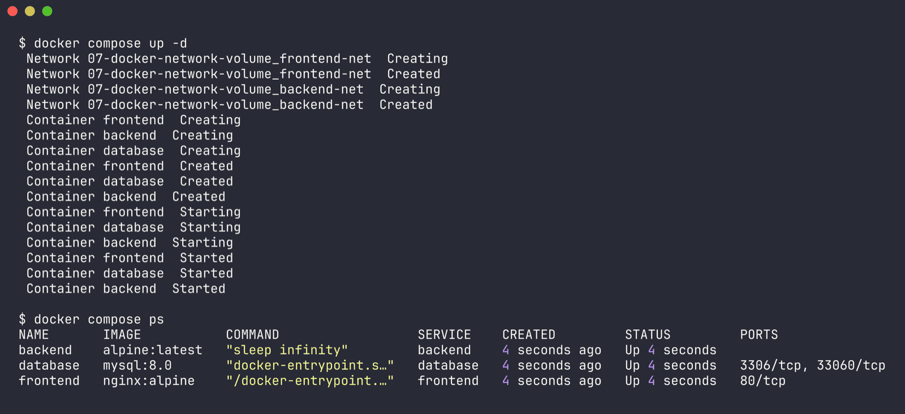

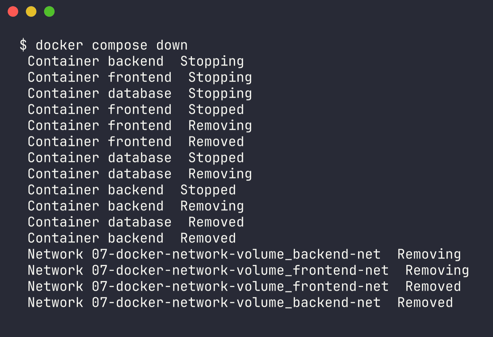

### Cleanup

```bash
docker rm -f frontend backend database
docker network rm frontend-net backend-net isolated-net
```

### Actually ran this

Installed Docker afterward and ran the whole thing for real. All four results matched the table above exactly:

```
$ docker exec backend ping -c 3 frontend
PING frontend (172.18.0.2): 56 data bytes
64 bytes from 172.18.0.2: seq=0 ttl=64 time=7.429 ms
...
3 packets transmitted, 3 packets received, 0% packet loss

$ docker exec backend ping -c 3 database
PING database (172.19.0.2): 56 data bytes
64 bytes from 172.19.0.2: seq=0 ttl=64 time=3.536 ms
...
3 packets transmitted, 3 packets received, 0% packet loss

$ docker exec frontend ping -c 3 database
ping: bad address 'database'

$ docker exec frontend ping -c 3 backend
PING backend (172.18.0.3): 56 data bytes
...
3 packets transmitted, 3 packets received, 0% packet loss

$ docker exec backend nc -zv database 3306
Connection to database (172.19.0.2) 3306 port [tcp/mysql] succeeded!
```

network inspect confirmed frontend-net has [frontend, backend] and backend-net has [backend, database], and `docker compose up -d` / `docker compose ps` / `docker compose down` all worked and produced the same topology. Full log: [docker-run-logs/07-task1-output.txt](../docker-run-logs/07-task1-output.txt) and [docker-run-logs/07-compose-output.txt](../docker-run-logs/07-compose-output.txt).

## Task 2 - Host network

Goal: run Apache2 on the host network and reach it on port 80.

```bash
# pull the apache image
docker pull httpd:2.4

# run with the host network - no -p flag at all
docker run -d --name apache-host --network host httpd:2.4

# check it
docker ps
curl http://localhost:80
```

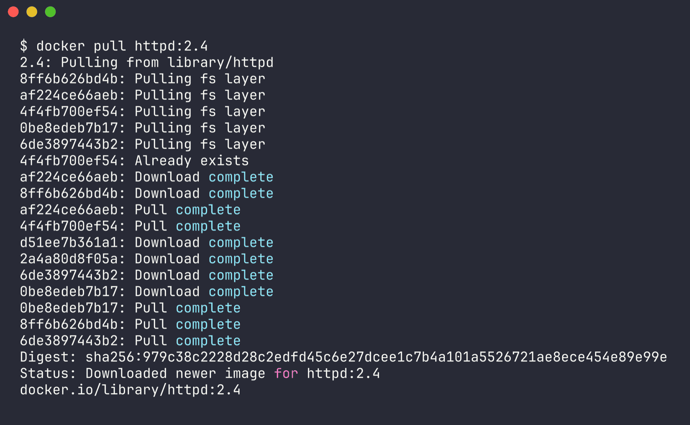

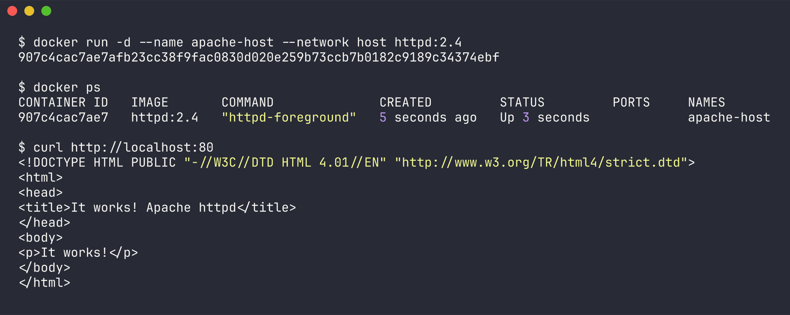

Then open http://localhost - should show the Apache default page ("It works!").

### What the host network actually does

With --network host, the container shares the host's network namespace instead of getting its own. No virtual interface, no NAT, no port mapping.

What that means in practice:

- -p 80:80 does nothing here, isn't even used. The container just binds host port 80 directly.
- since there's no NAT layer, throughput is a bit higher and latency a bit lower
- port conflicts are now a real thing - if the host already has something on 80, the container just fails to start
- the container loses network isolation and can see all the host's interfaces
- Linux only. On Docker Desktop for Windows/macOS the daemon runs inside a VM, so --network host binds to the VM's network, not the actual Windows/Mac host - it doesn't work as documented there.

Confirming the shared namespace:

```bash
# container sees exactly the host's interfaces
docker exec apache-host ip addr show

# apache shows up bound on the host itself
sudo ss -tulnp | grep :80
```

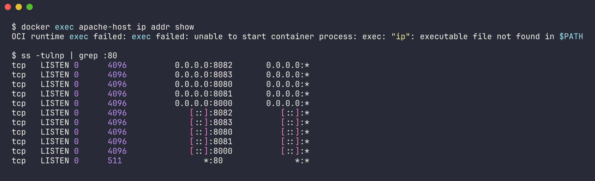

### Bridge vs host

| | Bridge (default) | Host |
|---|---|---|
| Network namespace | own, isolated | shared with host |
| IP address | private (e.g. 172.17.0.2) | the host's IP |
| Port publishing | needs -p | not applicable |
| Performance | slight NAT overhead | native |
| Isolation | good | none |
| Port conflicts | avoidable via mapping | possible |
| Platform | all | Linux only |

### Cleanup

```bash
docker rm -f apache-host
```

### Actually ran this

```
$ docker run -d --name apache-host --network host httpd:2.4
907c4cac7ae7...

$ curl http://localhost:80
<html><head><title>It works! Apache httpd</title></head><body><p>It works!</p></body></html>

$ ss -tulnp | grep :80
tcp   LISTEN 0      511                 *:80               *:*
```

Bound straight to *:80 with no docker-proxy in front of it, which is what host networking is supposed to do. Couldn't run `docker exec apache-host ip addr show` since the httpd Debian image doesn't have iproute2 installed - minor, not a big deal. Full log: [docker-run-logs/07-task2-output.txt](../docker-run-logs/07-task2-output.txt).

## Task 3 - Bind mount

Goal: bind mount a local folder into Nginx and show edits show up live without restarting anything.

The folder is [bind-mount/](bind-mount/), with [index.html](bind-mount/index.html) containing "Hello students".

### Step 1 - the local file

```html
<h1>Hello students</h1>
```

### Step 2 - mount it into Nginx

```bash
cd 07-docker-network-volume

docker run -d --name nginx-bind \
  -p 8090:80 \
  -v "$(pwd)/bind-mount":/usr/share/nginx/html \
  nginx:alpine
```

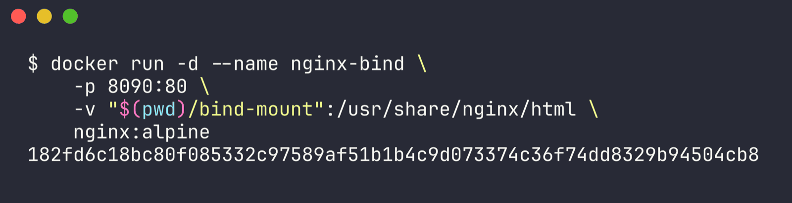

On Windows PowerShell:

```powershell
docker run -d --name nginx-bind -p 8090:80 -v "${PWD}\bind-mount:/usr/share/nginx/html" nginx:alpine
```

The -v syntax is hostPath:containerPath. The host path has to be absolute - if it's relative, Docker treats it as a named volume instead, which is an easy mistake to make.

### Step 3 - verify

```bash
curl http://localhost:8090
```

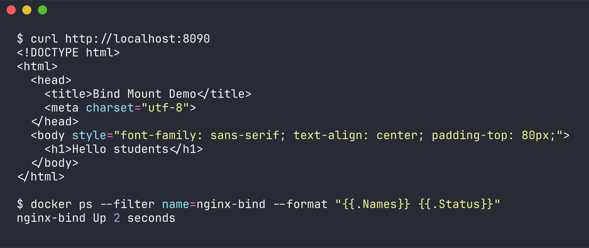

Expected: `<h1>Hello students</h1>` - or open http://localhost:8090 in a browser.

### Step 4 - edit the file and check it updates live

```bash
# edit the file on the HOST
echo '<h1>Hello students - UPDATED without restarting!</h1>' > bind-mount/index.html

# hit it again WITHOUT touching the container
curl http://localhost:8090
```

The new content shows up right away. Confirm the container was never restarted:

```bash
docker ps --filter name=nginx-bind --format "{{.Names}} {{.Status}}"
# status should still show the original uptime, no restart
```

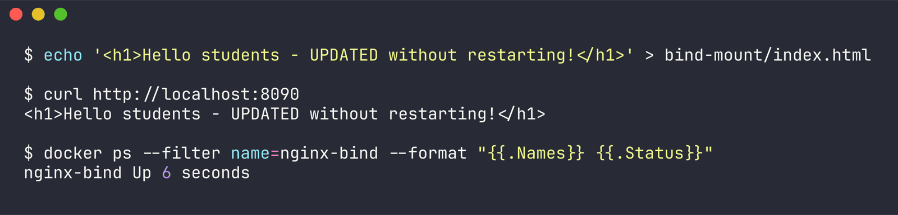

### What's actually happening

A bind mount maps a host folder directly into the container's filesystem. Nothing gets copied, both sides are literally reading and writing the same inodes on disk. That's why the edit shows up instantly - Nginx reads the file fresh off disk on every request, and the file it's reading is the host file.

This is also basically how hot-reload works in dev setups - mount your source folder in, and whatever you edit on the host shows up inside the container immediately.

### Bind mount vs named volume

| | Bind mount | Named volume |
|---|---|---|
| Syntax | -v /host/path:/container/path | -v myvolume:/container/path |
| Location | any host path you pick | managed by Docker (/var/lib/docker/volumes) |
| Created by | has to already exist | Docker creates it |
| Host access | direct, normal file access | through Docker |
| Portability | tied to how this host is laid out | portable |
| Best for | dev, config files, source code | production data, databases |
| Backup | normal filesystem tools | docker volume commands |

```bash
# named volume for comparison
docker volume create web-content
docker run -d --name nginx-vol -p 8091:80 -v web-content:/usr/share/nginx/html nginx:alpine
docker volume inspect web-content
```

### Cleanup

```bash
docker rm -f nginx-bind
git checkout bind-mount/index.html   # restore "Hello students"
```

### Actually ran this

```
$ curl http://localhost:8090
<h1>Hello students</h1>

$ docker ps --filter name=nginx-bind --format "{{.Names}} {{.Status}}"
nginx-bind Up 2 seconds

# edited bind-mount/index.html on the host

$ curl http://localhost:8090
<h1>Hello students - UPDATED without restarting!</h1>

$ docker ps --filter name=nginx-bind --format "{{.Names}} {{.Status}}"
nginx-bind Up 6 seconds
```

Uptime just kept climbing (2s -> 6s), never reset, so the container really wasn't restarted. Restored bind-mount/index.html back to "Hello students" with git checkout afterward. Full log: [docker-run-logs/07-task3-output.txt](../docker-run-logs/07-task3-output.txt).

## Task 4 - Overlay networks (research)

### What an overlay network is

An overlay network spans multiple Docker hosts, so containers on different physical machines can talk to each other like they're on the same LAN, even if the hosts are in totally different racks or data centers.

Bridge networks only work within a single host. Overlay networks are what you reach for once a cluster grows past one machine.

### How it works

1. VXLAN encapsulation - container traffic gets wrapped inside UDP packets (default port 4789) and sent over the physical network. The receiving host unwraps it and hands it to the right container. From the containers' point of view they're just on one flat layer-2 network, they never see any of this happening.

2. A distributed control plane - Docker Swarm keeps a shared store (using Raft consensus) of which container lives on which host, with what IP and MAC. That's how a host knows where to actually send a packet meant for a container it doesn't own.

3. Built-in service discovery - every overlay network has its own embedded DNS server, so container/service names resolve across the whole cluster, and an app can just connect to "database" without caring which node it's actually on.

4. Load balancing via VIP - a Swarm service gets a virtual IP, and traffic to that VIP gets spread across all its replicas by IPVS in the kernel, wherever those replicas happen to be running.

### Ports needed between hosts

| Port | Protocol | Purpose |
|---|---|---|
| 2377 | TCP | cluster management (managers only) |
| 7946 | TCP + UDP | node-to-node control plane gossip |
| 4789 | UDP | VXLAN data plane |

If port 4789 is blocked somewhere, that's the classic "overlay network exists but containers can't actually reach each other" problem.

### Setting one up

```bash
# on the manager node
docker swarm init --advertise-addr <MANAGER-IP>

# on each worker
docker swarm join --token <TOKEN> <MANAGER-IP>:2377

# create an attachable overlay network
docker network create -d overlay --attachable my-overlay

# deploy a service across the cluster
docker service create --name web --network my-overlay --replicas 3 nginx:alpine

docker service ls
docker service ps web
docker network inspect my-overlay
```

--attachable matters here - without it, only Swarm services can join the network, standalone containers started with docker run can't.

### Use cases

- multi-host container clusters - the core use case, a Swarm cluster needs this
- microservices spread across nodes - services can address each other by name regardless of where they're actually placed
- high availability - replicas on different hosts stay on one logical network, so one node going down doesn't split the app
- encrypted traffic between hosts - `docker network create -d overlay --opt encrypted` turns on IPsec on the data plane, useful when hosts talk to each other over an untrusted network
- scaling out - add a node to the Swarm and it just joins the existing overlay, no reconfiguring needed

### Driver comparison

| Driver | Scope | Use case |
|---|---|---|
| bridge | single host | default, containers on one machine |
| host | single host | drop network isolation for performance |
| overlay | multi-host | Swarm clusters, distributed apps |
| macvlan | single host | give a container a real MAC on the physical LAN |
| ipvlan | single host | like macvlan but shares the host's MAC |
| none | single host | networking fully disabled |

### Overlay vs Kubernetes

This isn't just a Docker Swarm thing either - Kubernetes CNI plugins like Flannel, Calico, Weave solve the exact same multi-host problem the same basic way, and most of them use VXLAN too. Understanding Docker overlay networking carries over pretty directly to understanding Kubernetes pod networking.

Reference: https://docs.docker.com/engine/network/drivers/

## Still missing

Task 4 is research only and is done. For tasks 1-3, everything above was actually run and the output is captured in [docker-run-logs/](../docker-run-logs/) - what's still missing is just the actual browser screenshots (before/after for the bind mount, the Apache page, etc), since there's no GUI browser in the environment I used to run these.
