# Session 9 - Kubernetes Fundamentals

Name: Ridaa Mirza
Enrollment No: 24BCS10394

Everything here was run on my Mac (Apple Silicon, `Darwin arm64`) against a single-node Minikube cluster using the Docker driver. All my own objects live in the `s09` namespace. The raw terminal output for every step is saved in [outputs/](outputs/) - the snippets below are copied straight out of those files, they stand in for screenshots.

Folder layout:

```
08-kubernetes-basics/
  README.md
  manifests/
    00-namespace.yaml            # s09 namespace
    01-pod.yaml                  # bare nginx Pod
    02-replicaset.yaml           # nginx ReplicaSet, 3 replicas
    03-deployment.yaml           # nginx Deployment "web", 2 replicas
    04-service.yaml              # ClusterIP Service for "web"
    05-bootcamp-deployment.yaml  # kubernetes-bootcamp Deployment (tutorial app)
    06-bootcamp-service.yaml     # NodePort Service for the bootcamp app
    07-curl-client.yaml          # helper pod I exec into to curl services from inside the cluster
  outputs/
    01-install-versions.txt
    02-cluster-status.txt
    03-architecture.txt
    04-basic-objects.txt
    05-image-arch-check.txt  05a-create-deployment.txt  05b-explore-app.txt  05c-expose-service.txt
    05d-scale.txt  05e-rolling-update.txt  05f-cleanup.txt
    first-run/  second-run/      # earlier attempts, kept because they show real problems I hit
```

## Task 1 - Install and configure Minikube

Minikube needs two things: a driver to run the "node" in (I used Docker) and `kubectl` to talk to the cluster.

### macOS (what I actually used)

Docker Desktop was already installed, so it was just Homebrew:

```bash
brew install minikube          # pulls in kubernetes-cli (kubectl) as well
brew install kubernetes-cli    # only needed if kubectl isn't there already

minikube start --driver=docker
minikube addons enable metrics-server
minikube addons enable ingress
```

(Without brew you can grab the binary directly: `curl -LO https://github.com/kubernetes/minikube/releases/latest/download/minikube-darwin-arm64` then `sudo install minikube-darwin-arm64 /usr/local/bin/minikube`. Use `-amd64` on Intel Macs.)

### Ubuntu / WSL2

I didn't run this part, it's from the official docs - on WSL2 you need Docker Desktop with WSL integration turned on, or Docker Engine installed inside the distro.

```bash
# docker engine (skip on WSL if Docker Desktop integration is on)
sudo apt-get update && sudo apt-get install -y docker.io curl
sudo usermod -aG docker $USER && newgrp docker

# kubectl
curl -LO "https://dl.k8s.io/release/$(curl -Ls https://dl.k8s.io/release/stable.txt)/bin/linux/amd64/kubectl"
sudo install -o root -g root -m 0755 kubectl /usr/local/bin/kubectl

# minikube
curl -LO https://github.com/kubernetes/minikube/releases/latest/download/minikube-linux-amd64
sudo install minikube-linux-amd64 /usr/local/bin/minikube && rm minikube-linux-amd64

minikube start --driver=docker
```

> TODO (run on your machine): the Ubuntu/WSL steps above weren't executed here, only the macOS install was.

### Checking the install

Full output: [outputs/01-install-versions.txt](outputs/01-install-versions.txt)

```
$ minikube version
minikube version: v1.39.0
commit: 7a9f6a841470a207de8cf4bafcccee0969d8ba10

$ minikube status
minikube
type: Control Plane
host: Running
kubelet: Running
apiserver: Running
kubeconfig: Configured

$ kubectl version
Client Version: v1.37.1
Kustomize Version: v5.8.1
Server Version: v1.37.0

$ brew list --versions kubernetes-cli minikube
kubernetes-cli 1.37.1
minikube 1.39.0

$ kubectl config get-contexts
CURRENT   NAME       CLUSTER    AUTHINFO   NAMESPACE
*         minikube   minikube   minikube   default
```

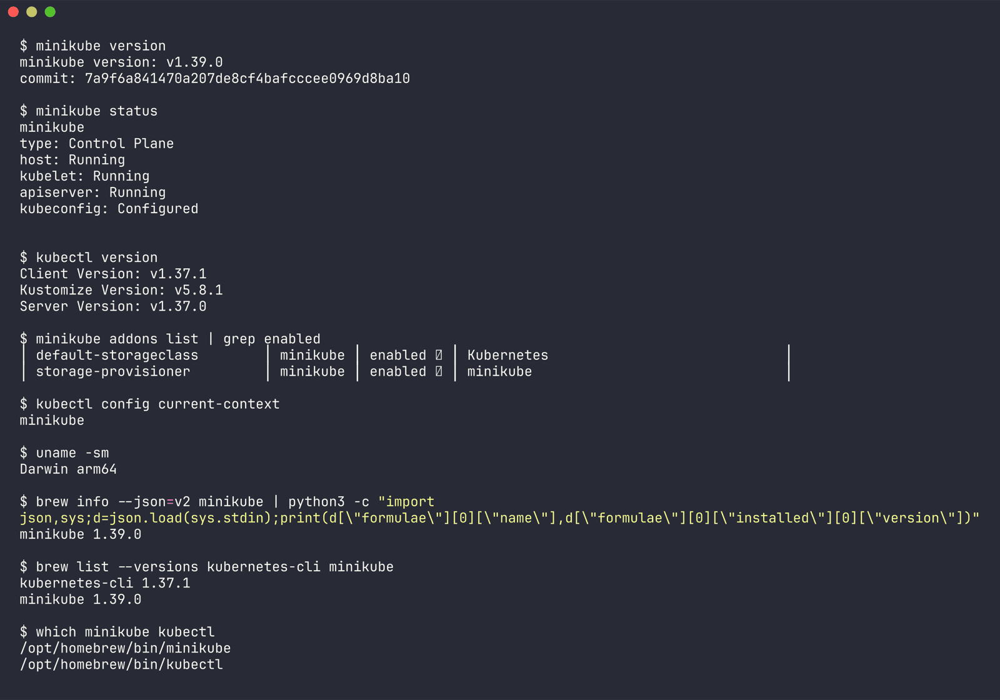

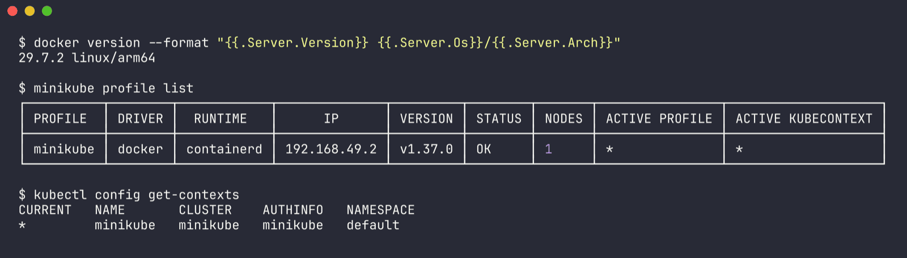

`minikube profile list` showed driver `docker`, runtime `containerd`, node IP `192.168.49.2`, Kubernetes `v1.37.0`. So the container runtime inside the node is containerd, not Docker - Docker is only used to host the node container itself.

## Task 2 - Verify cluster status

Full output: [outputs/02-cluster-status.txt](outputs/02-cluster-status.txt)

```bash
kubectl cluster-info
kubectl get nodes -o wide
kubectl get pods -A
kubectl get componentstatuses
kubectl get --raw='/readyz?verbose'
kubectl get --raw='/livez'
```

```
$ kubectl cluster-info
Kubernetes control plane is running at https://127.0.0.1:52640
CoreDNS is running at https://127.0.0.1:52640/api/v1/namespaces/kube-system/services/kube-dns:dns/proxy

$ kubectl get nodes -o wide
NAME       STATUS   ROLES           AGE     VERSION   INTERNAL-IP    EXTERNAL-IP   OS-IMAGE                         KERNEL-VERSION            CONTAINER-RUNTIME
minikube   Ready    control-plane   3m13s   v1.37.0   192.168.49.2   <none>        Debian GNU/Linux 12 (bookworm)   7.0.12-linuxkit (arm64)   containerd://2.3.4

$ kubectl get componentstatuses
Warning: v1 ComponentStatus is deprecated in v1.19+
NAME                 STATUS    MESSAGE   ERROR
scheduler            Healthy   ok
controller-manager   Healthy   ok
etcd-0               Healthy   ok

$ kubectl get --raw='/readyz?verbose'
[+]ping ok
[+]log ok
[+]etcd ok
[+]etcd-readiness ok
[+]informer-sync ok
...
[+]shutdown ok
readyz check passed

$ kubectl get --raw='/livez'
ok
```

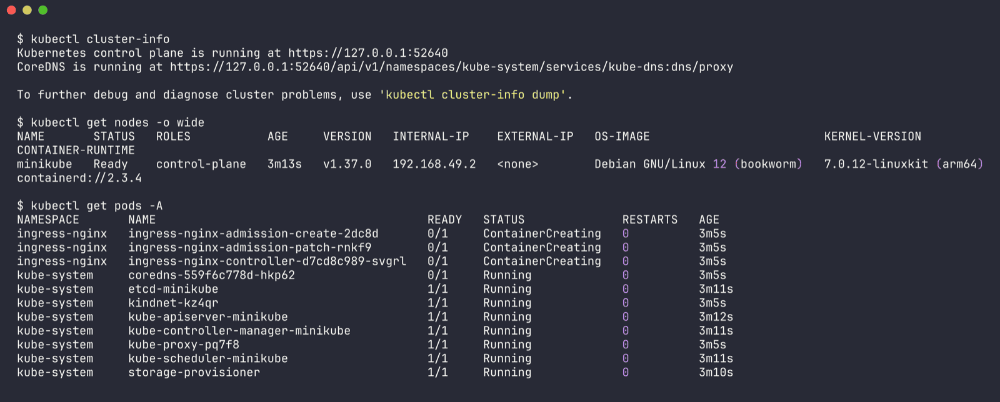

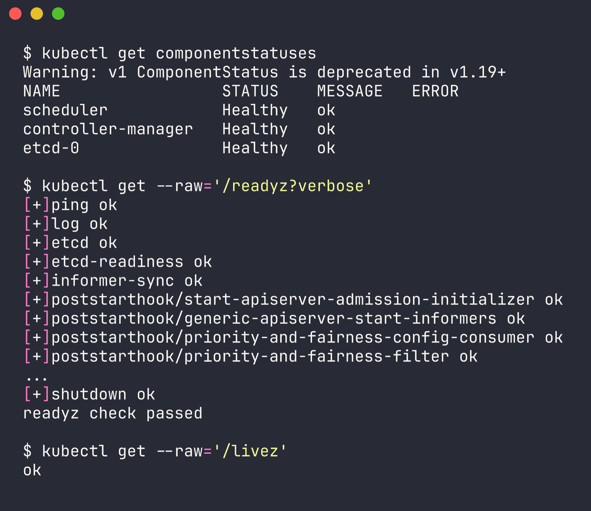

What I saw:
- The API server is on `127.0.0.1:52640` - that's Docker forwarding a random host port into the minikube container, which is why NodePorts aren't reachable directly from the Mac (more on that in Task 5).
- One node, and it's both the control plane and the worker.
- `componentstatuses` still works but prints a deprecation warning. `/readyz?verbose` is the modern way and actually lists every individual check (etcd, informers, RBAC bootstrap etc).

The first `kubectl get pods -A` I took was right after the cluster came up, so CoreDNS was still `0/1` and the ingress-nginx pods were `ContainerCreating`. I re-ran it later once everything settled:

```
$ kubectl get pods -A | grep -E "NAMESPACE|kube-system|ingress-nginx"
NAMESPACE       NAME                                       READY   STATUS      RESTARTS      AGE
ingress-nginx   ingress-nginx-admission-create-2dc8d       0/1     Completed   0             46m
ingress-nginx   ingress-nginx-admission-patch-rnkf9        0/1     Completed   2 (42m ago)   46m
ingress-nginx   ingress-nginx-controller-d7cd8c989-svgrl   1/1     Running     0             46m
kube-system     coredns-559f6c778d-hkp62                   1/1     Running     0             46m
kube-system     etcd-minikube                              1/1     Running     0             46m
kube-system     kindnet-kz4qr                              1/1     Running     0             46m
kube-system     kube-apiserver-minikube                    1/1     Running     0             46m
kube-system     kube-controller-manager-minikube           1/1     Running     0             46m
kube-system     kube-proxy-pq7f8                           1/1     Running     0             46m
kube-system     kube-scheduler-minikube                    1/1     Running     0             46m
kube-system     metrics-server-768f9f6999-pnkqq            1/1     Running     0             23m
kube-system     storage-provisioner                        1/1     Running     0             46m

$ kubectl top node
NAME       CPU(cores)   CPU(%)   MEMORY(bytes)   MEMORY(%)
minikube   2665m        17%      2382Mi          30%
```

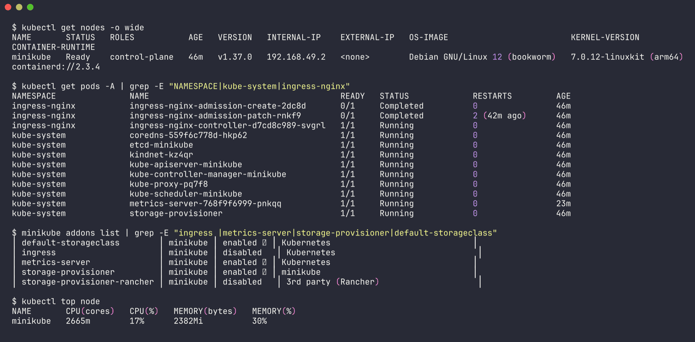

(The `admission-create`/`admission-patch` pods are one-shot Jobs, so `Completed` is the healthy state for them.)

## Task 3 - Kubernetes architecture

Full output: [outputs/03-architecture.txt](outputs/03-architecture.txt)

```
                        +--------------------- CONTROL PLANE ----------------------+
   kubectl  ---HTTPS--> |  kube-apiserver  <-------->  etcd (key-value store,      |
   (me)                 |    ^    ^    ^              the whole cluster state)     |
                        |    |    |    |                                           |
                        |    |    |    +-- kube-scheduler   (picks a node for      |
                        |    |    |                          each new pod)         |
                        |    |    +------- kube-controller-manager (reconcile      |
                        |    |              loops: ReplicaSet, Deployment, Node,   |
                        |    |              EndpointSlice, Namespace ...)          |
                        |    +------------ cloud-controller-manager (LBs, routes,  |
                        |                   node info from AWS/GCP/Azure - NOT     |
                        |                   present on minikube)                   |
                        +-----------------------------^----------------------------+
                                                      | watch / report status
                        +--------------------- WORKER NODE ------------------------+
                        |  kubelet  --CRI-->  container runtime (containerd)       |
                        |     |                   |-- pod -- pod -- pod           |
                        |  kube-proxy (iptables rules so Service IPs -> pod IPs)   |
                        |  CNI plugin (kindnet here, gives every pod an IP)        |
                        +----------------------------------------------------------+
           On minikube both boxes are the same machine: the "minikube" container.
```

### Control plane

| Component | What it does | Where I saw it |
|---|---|---|
| kube-apiserver | Front door for everything. kubectl, the scheduler, controllers and kubelets all talk only to the API server, never to each other directly. Validates and stores objects in etcd. | `kube-apiserver-minikube` pod |
| etcd | Distributed key-value store holding the entire cluster state (every Pod, Service, Secret...). Only the API server talks to it. | `etcd-minikube` pod, image `registry.k8s.io/etcd:3.7.0-0` |
| kube-scheduler | Watches for pods with no node assigned and picks one based on resources, taints, affinity etc. | `kube-scheduler-minikube`; the `Scheduled ... default-scheduler` event on every pod in Task 4 |
| kube-controller-manager | Runs all the built-in control loops: "desired state says 3 replicas, I see 2, make one more". | `kube-controller-manager-minikube`; the `ScalingReplicaSet ... deployment-controller` events in Task 5 |
| cloud-controller-manager | Glue to a cloud provider (creates load balancers, sets node addresses). | Not running - minikube isn't on a cloud, so there's nothing to see. On EKS/GKE/AKS it's managed for you. |

### Node components

| Component | What it does | Where I saw it |
|---|---|---|
| kubelet | Agent on every node. Gets pod specs from the API server and makes the runtime actually run them, reports status back. It's a systemd service, not a pod. | `minikube ssh -- systemctl is-active kubelet` -> `active` |
| kube-proxy | Programs iptables/IPVS rules so traffic to a Service ClusterIP gets sent to one of the backing pods. Runs as a DaemonSet. | `kube-proxy-pq7f8`, DaemonSet `kube-proxy` |
| Container runtime | Actually pulls images and runs containers (via CRI). | `containerd://2.3.4` in `get nodes -o wide`; `crictl ps` inside the node |

Commands that backed this up:

```
$ kubectl get pods -n kube-system -o custom-columns=NAME:.metadata.name,IMAGE:.spec.containers[0].image
NAME                               IMAGE
coredns-559f6c778d-hkp62           registry.k8s.io/coredns/coredns:v1.14.6
etcd-minikube                      registry.k8s.io/etcd:3.7.0-0
kindnet-kz4qr                      docker.io/kindest/kindnetd:v20260820-69b56db7
kube-apiserver-minikube            registry.k8s.io/kube-apiserver:v1.37.0
kube-controller-manager-minikube   registry.k8s.io/kube-controller-manager:v1.37.0
kube-proxy-pq7f8                   registry.k8s.io/kube-proxy:v1.37.0
kube-scheduler-minikube            registry.k8s.io/kube-scheduler:v1.37.0
storage-provisioner                gcr.io/k8s-minikube/storage-provisioner:v5

$ minikube ssh -- 'ls /etc/kubernetes/manifests'
etcd.yaml	     kube-controller-manager.yaml
kube-apiserver.yaml  kube-scheduler.yaml

$ minikube ssh -- 'systemctl is-active kubelet'
active

$ kubectl get ds -n kube-system
NAME         DESIRED   CURRENT   READY   UP-TO-DATE   AVAILABLE   NODE SELECTOR            AGE
kindnet      1         1         1       1            1           <none>                   3m11s
kube-proxy   1         1         1       1            1           kubernetes.io/os=linux   3m12s

$ minikube ssh -- sudo crictl ps
CONTAINER       IMAGE           CREATED          STATE     NAME                      ...
a9bd4d8d971ac   fbccbf70a429f   16 seconds ago   Running   coredns                   ...
5178c3773c625   550b682d81d41   3 minutes ago    Running   kube-proxy                ...
ea1108df2de9f   6003d52023b9d   3 minutes ago    Running   kube-apiserver            ...
095b81fa6608c   384eabc4fe526   3 minutes ago    Running   kube-scheduler            ...
3483024633aaf   c2e426bbd1cd6   3 minutes ago    Running   etcd                      ...
ca5eb5be18388   b1ad0e33c9012   3 minutes ago    Running   kube-controller-manager   ...
```

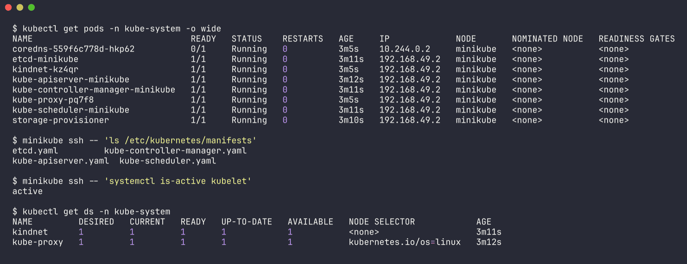

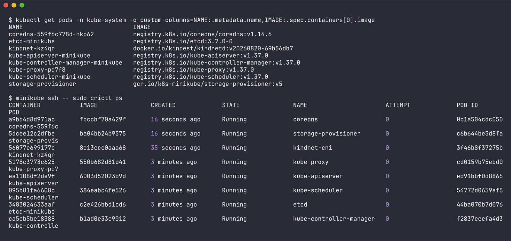

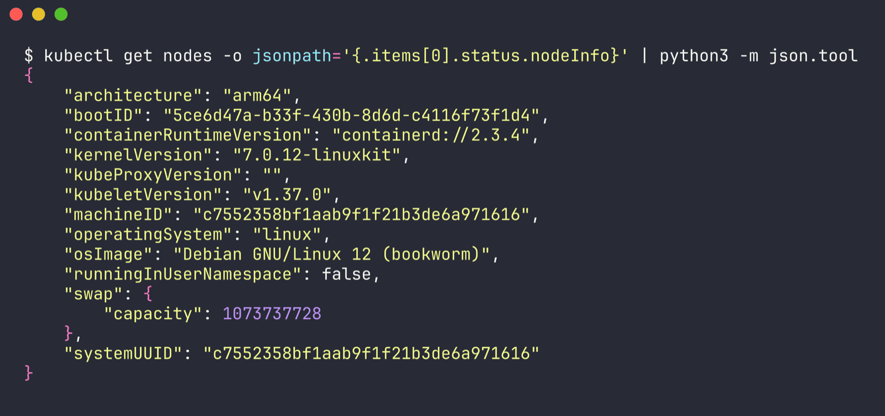

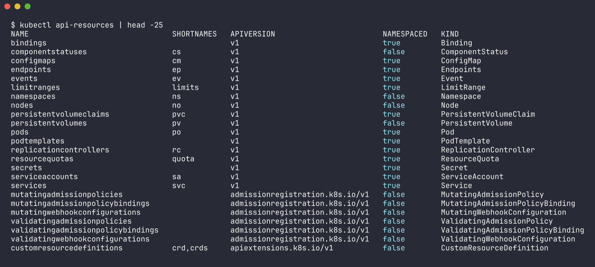

The interesting bit: the four control plane components are **static pods**. Their YAML sits in `/etc/kubernetes/manifests` on the node and the kubelet starts them directly, without going through the scheduler (which makes sense, the scheduler can't schedule itself before it exists). That's why they're all named `<component>-minikube`. kube-proxy and kindnet on the other hand are normal DaemonSets, one pod per node. Extra add-ons on top of the core: CoreDNS (cluster DNS, so `web-svc.s09.svc.cluster.local` resolves), kindnet (CNI), storage-provisioner, metrics-server.

## Task 4 - Basic objects and commands

Full output: [outputs/04-basic-objects.txt](outputs/04-basic-objects.txt). YAML in [manifests/](manifests/).

### Namespace

```bash
kubectl apply -f manifests/00-namespace.yaml
kubectl get ns s09 --show-labels
```

```
NAME   STATUS   AGE   LABELS
s09    Active   39m   kubernetes.io/metadata.name=s09,owner=ridaa,session=9
```

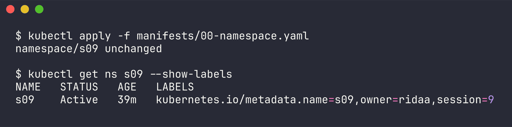

### Pod

Smallest deployable unit - one or more containers sharing an IP and volumes. A bare pod has nothing watching it, if it dies it's gone.

```bash
kubectl apply -f manifests/01-pod.yaml
kubectl wait --for=condition=Ready pod/nginx-pod -n s09 --timeout=300s
kubectl get pod nginx-pod -n s09 -o wide
kubectl describe pod nginx-pod -n s09
```

```
NAME        READY   STATUS    RESTARTS   AGE   IP            NODE       NOMINATED NODE   READINESS GATES
nginx-pod   1/1     Running   0          1s    10.244.0.20   minikube   <none>           <none>

Events:
  Type    Reason     Age   From               Message
  ----    ------     ----  ----               -------
  Normal  Scheduled  1s    default-scheduler  Successfully assigned s09/nginx-pod to minikube
  Normal  Pulled     0s    kubelet            spec.containers{nginx}: Container image "nginx:1.27-alpine" already present on machine ...
  Normal  Created    0s    kubelet            spec.containers{nginx}: Container created
  Normal  Started    0s    kubelet            spec.containers{nginx}: Container started
```

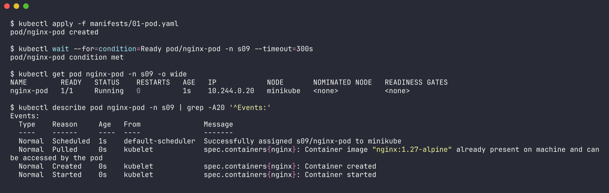

The events show the architecture from Task 3 in action: the scheduler assigns the node, then the kubelet pulls/creates/starts the container.

### ReplicaSet

Keeps N copies of a pod template running. Tested the self-healing by deleting one:

```bash
kubectl apply -f manifests/02-replicaset.yaml
kubectl delete pod nginx-rs-fcs6g -n s09 --wait=false
kubectl get pods -n s09 -l app=nginx-rs
```

```
NAME             READY   STATUS              RESTARTS   AGE
nginx-rs-fcs6g   1/1     Terminating         0          1s
nginx-rs-n86dr   1/1     Running             0          1s
nginx-rs-ndlw8   1/1     Running             0          1s
nginx-rs-v4qxp   0/1     ContainerCreating   0          0s     <- replacement created instantly

# a few seconds later
pod/nginx-rs-n86dr   1/1     Running   0          5s
pod/nginx-rs-ndlw8   1/1     Running   0          5s
pod/nginx-rs-v4qxp   1/1     Running   0          4s
```

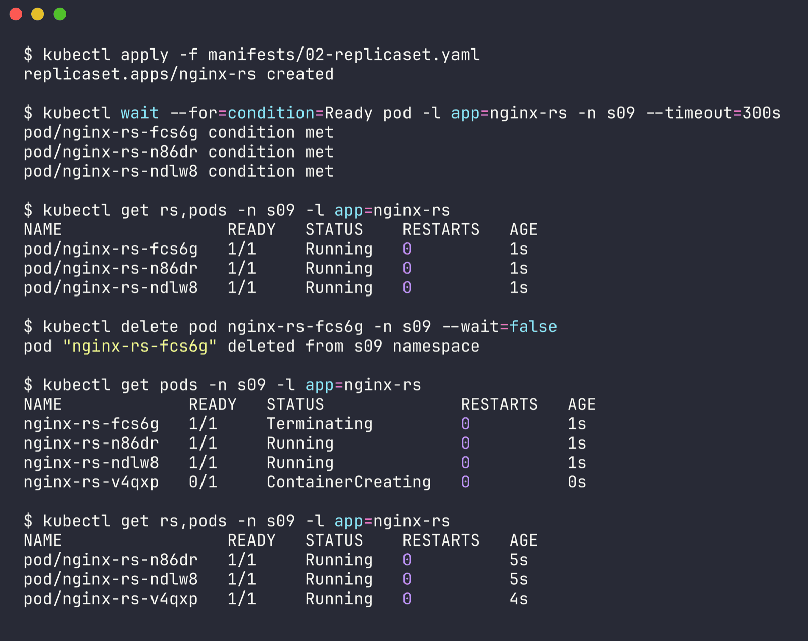

### Deployment

Manages ReplicaSets for you and adds rolling updates and rollback. You almost never create a ReplicaSet by hand - you create a Deployment and it makes one.

```bash
kubectl apply -f manifests/03-deployment.yaml
kubectl rollout status deployment/web -n s09
kubectl get deploy,rs,pods -n s09 -l app=web --show-labels
```

```
NAME                  READY   UP-TO-DATE   AVAILABLE   AGE   LABELS
deployment.apps/web   2/2     2            2           0s    app=web

NAME                             DESIRED   CURRENT   READY   AGE   LABELS
replicaset.apps/web-5c6f4bf8d6   2         2         2       0s    app=web,pod-template-hash=5c6f4bf8d6

NAME                       READY   STATUS    RESTARTS   AGE   LABELS
pod/web-5c6f4bf8d6-7mpjf   1/1     Running   0          0s    app=web,pod-template-hash=5c6f4bf8d6
pod/web-5c6f4bf8d6-c5c6v   1/1     Running   0          0s    app=web,pod-template-hash=5c6f4bf8d6
```

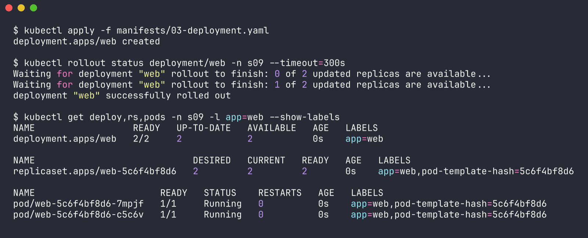

Deployment `web` -> ReplicaSet `web-5c6f4bf8d6` -> pods `web-5c6f4bf8d6-xxxxx`. The hash is from the pod template, so when the template changes you get a new ReplicaSet (this is what makes rolling updates work in Task 5).

### Service

Pods come and go and their IPs change; a Service gives a stable virtual IP + DNS name and load-balances across whatever pods match its selector.

```bash
kubectl apply -f manifests/04-service.yaml
kubectl get svc web-svc -n s09
kubectl get endpointslices -n s09 -l kubernetes.io/service-name=web-svc
kubectl exec -n s09 curl-client -- sh -c 'curl -s http://web-svc.s09.svc.cluster.local | grep -i title'
kubectl exec -n s09 curl-client -- nslookup web-svc.s09.svc.cluster.local
```

```
NAME      TYPE        CLUSTER-IP      EXTERNAL-IP   PORT(S)   AGE
web-svc   ClusterIP   10.102.250.21   <none>        80/TCP    1s

NAME            ADDRESSTYPE   PORTS   ENDPOINTS                 AGE
web-svc-wd8kq   IPv4          80      10.244.0.31,10.244.0.32   1s

$ until kubectl exec -n s09 curl-client -- curl -s -o /dev/null http://web-svc.s09.svc.cluster.local; do echo 'not reachable yet, retrying'; sleep 3; done
command terminated with exit code 7
not reachable yet, retrying

$ kubectl exec -n s09 curl-client -- sh -c 'curl -s http://web-svc.s09.svc.cluster.local | grep -i title'
<title>Welcome to nginx!</title>

$ kubectl exec -n s09 curl-client -- nslookup web-svc.s09.svc.cluster.local
Server:		10.96.0.10
Name:	web-svc.s09.svc.cluster.local
Address: 10.102.250.21
```

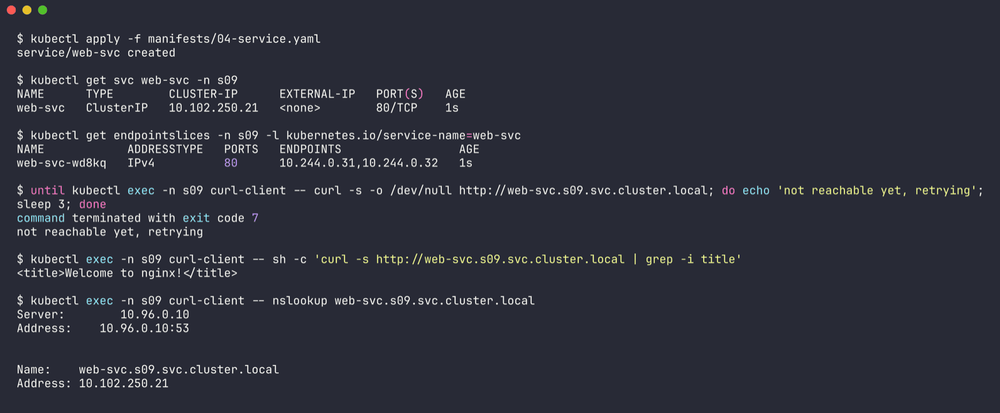

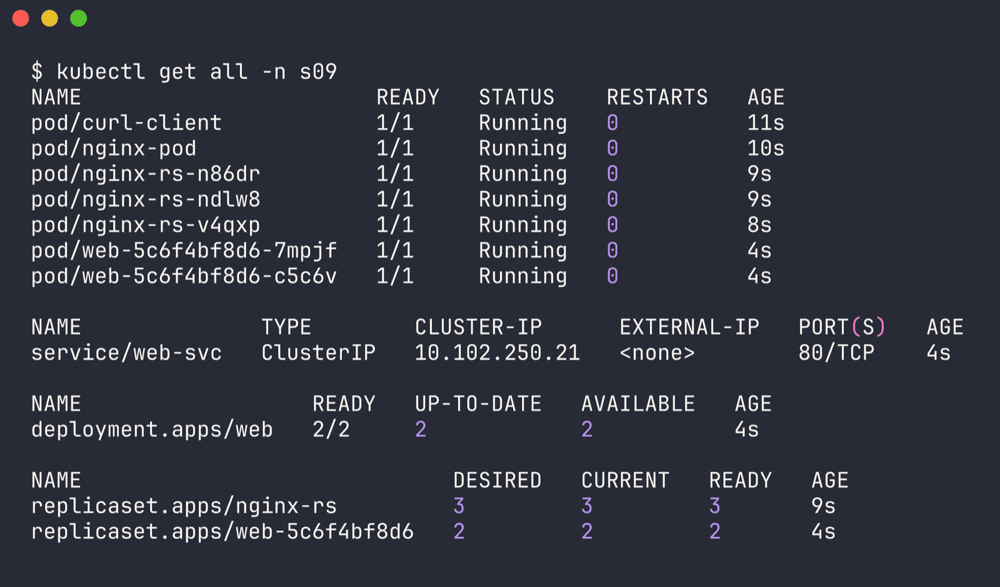

The endpoint IPs are exactly the two `web` pods. The first curl right after creating the Service got exit code 7 (connection refused) - kube-proxy hadn't written the iptables rules yet. On a busy node that takes a couple of seconds, so I put a retry loop in front of it. DNS resolves to the ClusterIP via CoreDNS (`10.96.0.10`).

`curl-client` ([manifests/07-curl-client.yaml](manifests/07-curl-client.yaml)) is just a `curlimages/curl` pod running `sleep 3600` that I exec into. I tried `kubectl run tmp --rm -i ...` first but the output kept getting lost because the container finished before kubectl attached (see [outputs/first-run/](outputs/first-run/)).

### Cheat sheet

| Object | What it's for | Create | Inspect | Short name |
|---|---|---|---|---|
| Namespace | Virtual cluster / folder for objects | `kubectl create ns s09` | `kubectl get ns` | `ns` |
| Pod | One or more containers, one IP | `kubectl run nginx --image=nginx -n s09` | `kubectl get po -o wide`, `describe po`, `logs`, `exec -it` | `po` |
| ReplicaSet | Keep N identical pods alive | `kubectl apply -f rs.yaml` | `kubectl get rs` | `rs` |
| Deployment | ReplicaSets + rolling update + rollback | `kubectl create deployment web --image=nginx --replicas=2` | `kubectl get deploy`, `rollout status/history` | `deploy` |
| Service | Stable IP/DNS + load balancing to pods | `kubectl expose deploy web --port=80 --type=ClusterIP` | `kubectl get svc`, `get endpointslices` | `svc` |

Everyday commands:

```bash
kubectl get all -n s09                       # everything in a namespace
kubectl get pods -A                          # every namespace
kubectl config set-context --current --namespace=s09   # stop typing -n
kubectl describe <kind>/<name>               # details + events (first place to look when stuck)
kubectl logs <pod> [-f] [-c container]       # container stdout
kubectl exec -it <pod> -- sh                 # shell inside a container
kubectl apply -f file.yaml / kubectl delete -f file.yaml
kubectl explain deployment.spec.strategy     # built-in docs for any field
kubectl api-resources                        # every kind + short names
kubectl get pod <pod> -o yaml                # full live object
kubectl scale deploy/<name> --replicas=N
kubectl set image deploy/<name> <container>=<image>
kubectl rollout status|history|undo deploy/<name>
kubectl port-forward svc/<name> 8080:80      # reach a service from the laptop
```

## Task 5 - Kubernetes Basics tutorial (hands-on)

Followed the six modules from https://kubernetes.io/docs/tutorials/kubernetes-basics/ but on my own minikube and inside `s09`.

One thing I had to check first: `gcr.io/google-samples/kubernetes-bootcamp:v1` is an **amd64-only** image and my node is arm64:

([outputs/05-image-arch-check.txt](outputs/05-image-arch-check.txt))

```
$ minikube ssh -- sudo crictl inspecti gcr.io/google-samples/kubernetes-bootcamp:v1 | grep -i -m1 architecture
      "architecture": "amd64",

$ kubectl get node minikube -o jsonpath={.status.nodeInfo.architecture}
arm64

$ kubectl run archtest -n s09 --image=gcr.io/google-samples/kubernetes-bootcamp:v1 --image-pull-policy=IfNotPresent --restart=Never
$ kubectl logs archtest -n s09
Kubernetes Bootcamp App Started At: 2026-10-07T11:36:50.146Z | Running On:  archtest
```

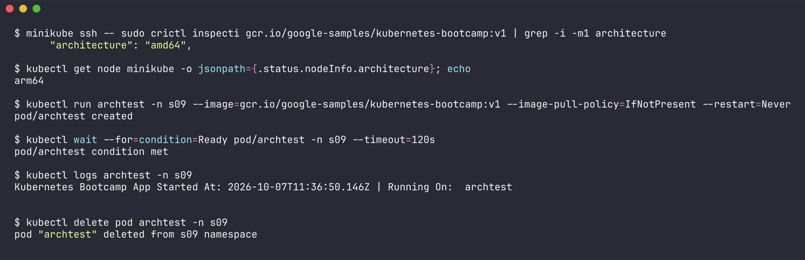

The throwaway pod worked anyway (Docker Desktop emulates amd64), so I kept the real tutorial image instead of falling back to nginx. For v2 the tutorial uses `docker.io/jocatalin/kubernetes-bootcamp:v2`.

### Module 2 - create a Deployment

[outputs/05a-create-deployment.txt](outputs/05a-create-deployment.txt)

The tutorial does `kubectl create deployment kubernetes-bootcamp --image=...`. I generated the YAML with `--dry-run=client -o yaml`, added a port, resource limits and the namespace, and saved it as [manifests/05-bootcamp-deployment.yaml](manifests/05-bootcamp-deployment.yaml).

```bash
kubectl create deployment kubernetes-bootcamp --image=gcr.io/google-samples/kubernetes-bootcamp:v1 -n s09 --dry-run=client -o yaml
kubectl apply -f manifests/05-bootcamp-deployment.yaml
kubectl rollout status deployment/kubernetes-bootcamp -n s09
kubectl annotate deployment/kubernetes-bootcamp -n s09 kubernetes.io/change-cause='initial v1 deploy'
kubectl get deployments -n s09
```

```
deployment.apps/kubernetes-bootcamp created
Waiting for deployment "kubernetes-bootcamp" rollout to finish: 0 of 1 updated replicas are available...
deployment "kubernetes-bootcamp" successfully rolled out

NAME                  READY   UP-TO-DATE   AVAILABLE   AGE
kubernetes-bootcamp   1/1     1            1           1s
```

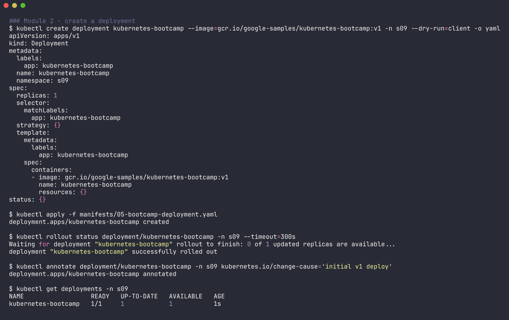

(The `change-cause` annotation is what shows up in `rollout history` later - the old `--record` flag is deprecated.)

### Module 3 - explore the app (pods, logs, exec)

[outputs/05b-explore-app.txt](outputs/05b-explore-app.txt)

```bash
kubectl get pods -n s09 -l app=kubernetes-bootcamp -o wide
kubectl describe pod $POD -n s09
kubectl logs $POD -n s09
kubectl exec $POD -n s09 -- env
kubectl exec $POD -n s09 -- sh -c 'ls; head -20 server.js'
kubectl exec $POD -n s09 -- curl -s http://localhost:8080
kubectl port-forward -n s09 pod/$POD 18080:8080 &   curl -s http://localhost:18080
```

```
NAME                                   READY   STATUS    RESTARTS   AGE   IP             NODE
kubernetes-bootcamp-7f55cc94d7-4ptq7   1/1     Running   0          9s    10.244.0.33   minikube

Controlled By:  ReplicaSet/kubernetes-bootcamp-7f55cc94d7
    Image:          gcr.io/google-samples/kubernetes-bootcamp:v1
    Port:           8080/TCP

$ kubectl logs kubernetes-bootcamp-7f55cc94d7-4ptq7 -n s09
Kubernetes Bootcamp App Started At: 2026-10-07T11:31:14.084Z | Running On:  kubernetes-bootcamp-7f55cc94d7-4ptq7

$ kubectl exec kubernetes-bootcamp-7f55cc94d7-4ptq7 -n s09 -- env
HOSTNAME=kubernetes-bootcamp-7f55cc94d7-4ptq7
NODE_VERSION=6.3.1
...

$ kubectl exec ... -- sh -c 'ls; head -20 server.js'
...
  response.write("Hello Kubernetes bootcamp! | Running on: ");
  response.write(host);
  response.end(" | v=1\n");
...

$ kubectl exec kubernetes-bootcamp-7f55cc94d7-4ptq7 -n s09 -- curl -s http://localhost:8080
Hello Kubernetes bootcamp! | Running on: kubernetes-bootcamp-7f55cc94d7-4ptq7 | v=1

$ kubectl logs kubernetes-bootcamp-7f55cc94d7-4ptq7 -n s09      # again, after the curl
Kubernetes Bootcamp App Started At: 2026-10-07T11:31:14.084Z | Running On:  kubernetes-bootcamp-7f55cc94d7-4ptq7
Running On: kubernetes-bootcamp-7f55cc94d7-4ptq7 | Total Requests: 1 | App Uptime: 7.406 seconds | Log Time: 2026-10-07T11:31:21.491Z

$ curl -s http://localhost:18080        # via kubectl port-forward from my Mac
Hello Kubernetes bootcamp! | Running on: kubernetes-bootcamp-7f55cc94d7-4ptq7 | v=1
```

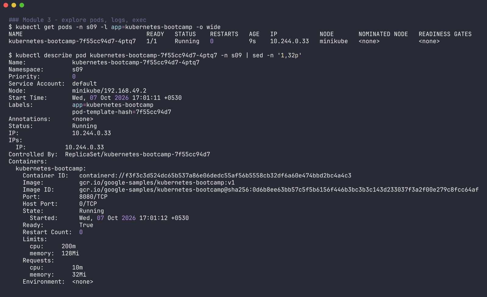

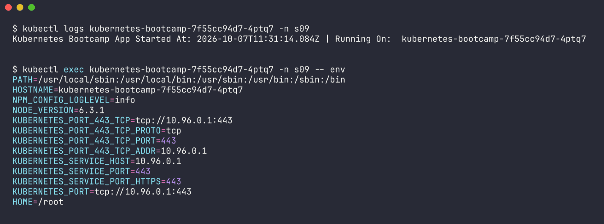

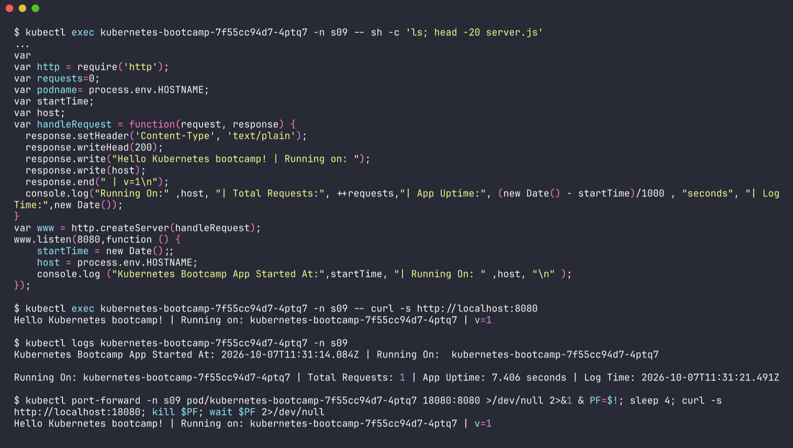

It's a tiny Node.js server that replies with the pod's hostname and its version - handy because later you can see which pod and which version answered. Each request also writes a log line, which is why the second `kubectl logs` shows `Total Requests: 1`.

The tutorial uses `kubectl proxy` + the API path to hit the pod; `kubectl port-forward` does the same job more simply.

### Module 4 - expose it with a Service (+ labels)

[outputs/05c-expose-service.txt](outputs/05c-expose-service.txt), manifest [manifests/06-bootcamp-service.yaml](manifests/06-bootcamp-service.yaml) (same as `kubectl expose deployment/kubernetes-bootcamp --type=NodePort --port 8080`).

```bash
kubectl apply -f manifests/06-bootcamp-service.yaml
kubectl get services -n s09
kubectl describe services/kubernetes-bootcamp -n s09
```

```
NAME                  TYPE       CLUSTER-IP      EXTERNAL-IP   PORT(S)          AGE
kubernetes-bootcamp   NodePort   10.101.89.187   <none>        8080:30530/TCP   0s

Selector:                 app=kubernetes-bootcamp
Type:                     NodePort
NodePort:                 <unset>  30530/TCP
Endpoints:                10.244.0.33:8080
```

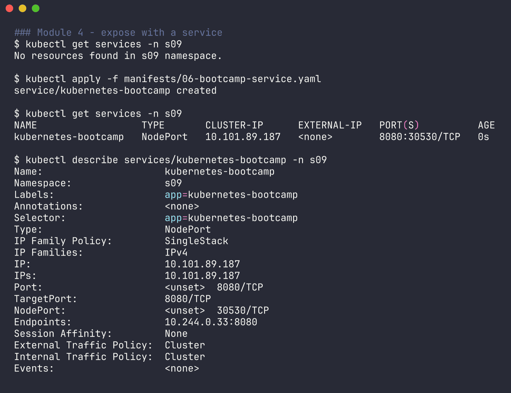

The NodePort (`30530`) is picked at random from 30000-32767 - it was different on each of my runs.

Reaching it three ways:

```
# 1. ClusterIP / DNS name from inside the cluster
$ kubectl exec -n s09 curl-client -- curl -s http://kubernetes-bootcamp.s09.svc.cluster.local:8080
Hello Kubernetes bootcamp! | Running on: kubernetes-bootcamp-7f55cc94d7-4ptq7 | v=1

# 2. NodeIP:NodePort (what the tutorial does with `curl $(minikube ip):$NODE_PORT`)
$ kubectl exec -n s09 curl-client -- curl -s http://192.168.49.2:30530
Hello Kubernetes bootcamp! | Running on: kubernetes-bootcamp-7f55cc94d7-4ptq7 | v=1

# 3. from my Mac via port-forward
$ kubectl port-forward -n s09 svc/kubernetes-bootcamp 18081:8080 & curl -s http://localhost:18081
Hello Kubernetes bootcamp! | Running on: kubernetes-bootcamp-7f55cc94d7-4ptq7 | v=1
```

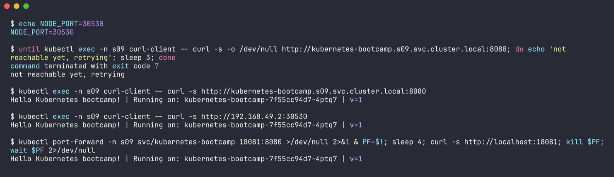

On macOS with the Docker driver, `192.168.49.2` only exists inside Docker's VM, so `curl $(minikube ip):30530` from the Mac terminal just hangs. That's why I curl the NodePort from a pod, or use port-forward / `minikube service kubernetes-bootcamp -n s09 --url` (which opens a tunnel). On Linux the NodePort works directly from the host.

Labels part of the module:

```
$ kubectl label pods kubernetes-bootcamp-7f55cc94d7-4ptq7 -n s09 version=v1
pod/kubernetes-bootcamp-7f55cc94d7-4ptq7 labeled

$ kubectl get pods -n s09 -l version=v1
NAME                                   READY   STATUS    RESTARTS   AGE
kubernetes-bootcamp-7f55cc94d7-4ptq7   1/1     Running   0          22s
```

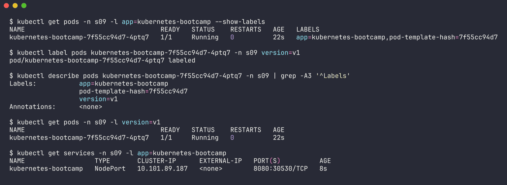

Labels are how everything is wired together - the Service finds its pods with `selector: app=kubernetes-bootcamp`, the Deployment finds its ReplicaSet the same way.

### Module 5 - scale up and down

[outputs/05d-scale.txt](outputs/05d-scale.txt)

```bash
kubectl scale deployments/kubernetes-bootcamp --replicas=4 -n s09
kubectl get pods -n s09 -l app=kubernetes-bootcamp -o wide
kubectl get endpointslices -n s09 -l kubernetes.io/service-name=kubernetes-bootcamp
for i in $(seq 1 8); do kubectl exec -n s09 curl-client -- curl -s http://kubernetes-bootcamp.s09.svc.cluster.local:8080; done
kubectl scale deployments/kubernetes-bootcamp --replicas=2 -n s09
```

```
NAME                  READY   UP-TO-DATE   AVAILABLE   AGE
kubernetes-bootcamp   4/4     4            4           ...

NAME                             DESIRED   CURRENT   READY
kubernetes-bootcamp-7f55cc94d7   4         4         4

# 8 requests through the Service:
Hello Kubernetes bootcamp! | Running on: kubernetes-bootcamp-7f55cc94d7-whj8t | v=1
Hello Kubernetes bootcamp! | Running on: kubernetes-bootcamp-7f55cc94d7-whj8t | v=1
Hello Kubernetes bootcamp! | Running on: kubernetes-bootcamp-7f55cc94d7-f4srw | v=1
Hello Kubernetes bootcamp! | Running on: kubernetes-bootcamp-7f55cc94d7-4ptq7 | v=1
...

# after scaling back to 2
NAME                  READY   UP-TO-DATE   AVAILABLE
kubernetes-bootcamp   2/2     2            2

Events:
  Normal  ScalingReplicaSet  ...  deployment-controller  Scaled up replica set kubernetes-bootcamp-7f55cc94d7 from 0 to 1
  Normal  ScalingReplicaSet  ...  deployment-controller  Scaled up replica set kubernetes-bootcamp-7f55cc94d7 from 1 to 4
  Normal  ScalingReplicaSet  ...  deployment-controller  Scaled down replica set kubernetes-bootcamp-7f55cc94d7 from 4 to 2
```

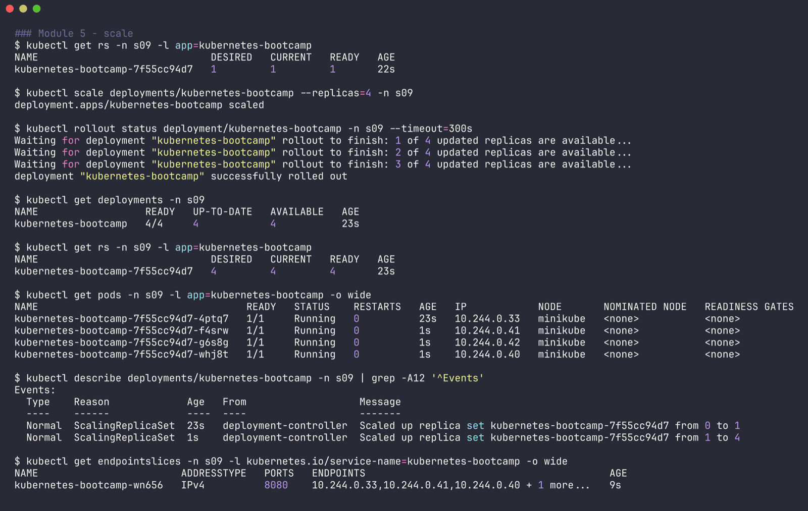

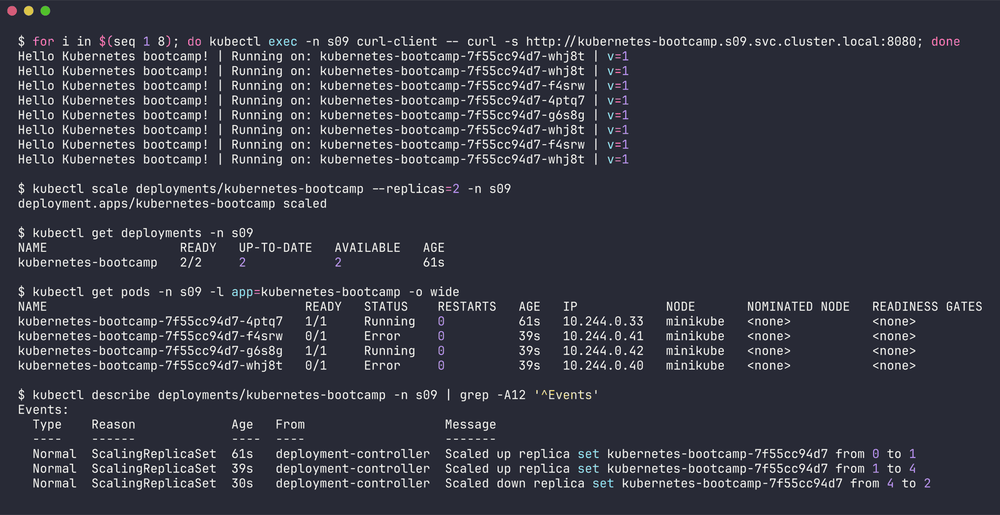

Different pod names answering = the Service is load-balancing. It's random (iptables mode), not strict round-robin, so the same pod sometimes answers twice in a row. Scaling just changes the ReplicaSet's desired count - same ReplicaSet hash the whole time.

### Module 6 - rolling update and rollback

[outputs/05e-rolling-update.txt](outputs/05e-rolling-update.txt)

**Update v1 -> v2:**

```bash
kubectl set image deployments/kubernetes-bootcamp kubernetes-bootcamp=docker.io/jocatalin/kubernetes-bootcamp:v2 -n s09
kubectl annotate deployment/kubernetes-bootcamp -n s09 kubernetes.io/change-cause='update to v2' --overwrite
kubectl rollout status deployments/kubernetes-bootcamp -n s09
kubectl get rs -n s09 -l app=kubernetes-bootcamp
```

```
NAME                             DESIRED   CURRENT   READY   AGE
kubernetes-bootcamp-55587bb4dd   2         2         2       32s     <- new (v2)
kubernetes-bootcamp-7f55cc94d7   0         0         0       93s     <- old (v1), kept at 0 for rollback

    Image:          docker.io/jocatalin/kubernetes-bootcamp:v2
    Image:          docker.io/jocatalin/kubernetes-bootcamp:v2

Hello Kubernetes bootcamp! | Running on: kubernetes-bootcamp-55587bb4dd-lk92j | v=2
Hello Kubernetes bootcamp! | Running on: kubernetes-bootcamp-55587bb4dd-w2k6v | v=2

REVISION  CHANGE-CAUSE
1         initial v1 deploy
2         update to v2
```

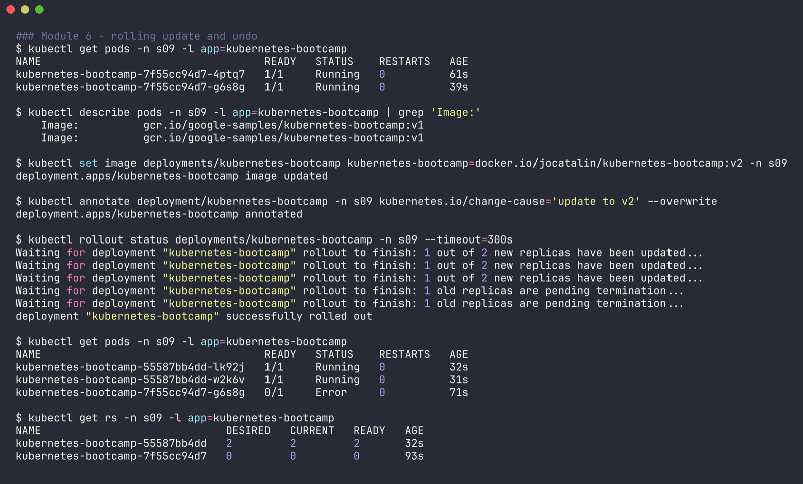

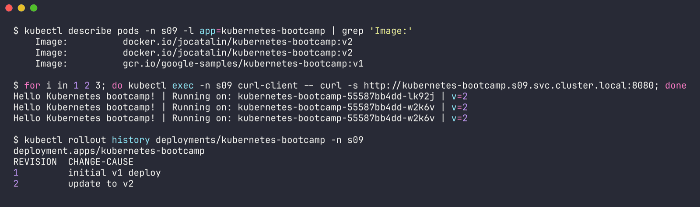

The Deployment created a new ReplicaSet and moved pods across gradually (new one up, old one down), so the Service always had something to answer with. The old ReplicaSet isn't deleted, just scaled to 0.

**Bad update (image tag that doesn't exist), then undo** - this is the tutorial's v10 step:

```bash
kubectl set image deployments/kubernetes-bootcamp kubernetes-bootcamp=gcr.io/google-samples/kubernetes-bootcamp:v10 -n s09
kubectl get pods -n s09 -l app=kubernetes-bootcamp
kubectl rollout undo deployments/kubernetes-bootcamp -n s09
```

```
$ kubectl rollout status deployments/kubernetes-bootcamp -n s09 --timeout=10s
error: timed out waiting for the condition

NAME                  READY   UP-TO-DATE   AVAILABLE
kubernetes-bootcamp   2/2     1            2

NAME                                   READY   STATUS         RESTARTS   AGE
kubernetes-bootcamp-55587bb4dd-lk92j   1/1     Running        0          49s
kubernetes-bootcamp-55587bb4dd-w2k6v   1/1     Running        0          48s
kubernetes-bootcamp-9ccdddfbc-mjnh4    0/1     ErrImagePull   0          16s

Warning   Failed   pod/kubernetes-bootcamp-9ccdddfbc-mjnh4   Failed to pull image "gcr.io/google-samples/kubernetes-bootcamp:v10": ... not found

# app still up during the broken rollout:
Hello Kubernetes bootcamp! | Running on: kubernetes-bootcamp-55587bb4dd-w2k6v | v=2

$ kubectl rollout undo deployments/kubernetes-bootcamp -n s09
deployment.apps/kubernetes-bootcamp rolled back

NAME                                   READY   STATUS    RESTARTS   AGE
kubernetes-bootcamp-55587bb4dd-lk92j   1/1     Running   0          52s
kubernetes-bootcamp-55587bb4dd-w2k6v   1/1     Running   0          51s

REVISION  CHANGE-CAUSE
1         initial v1 deploy
3         broken v10
4         update to v2
```

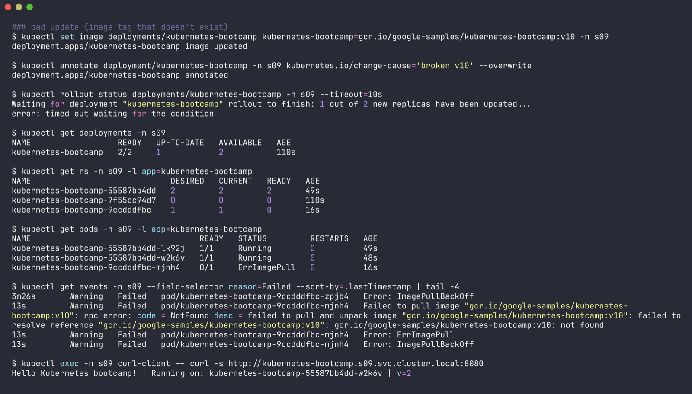

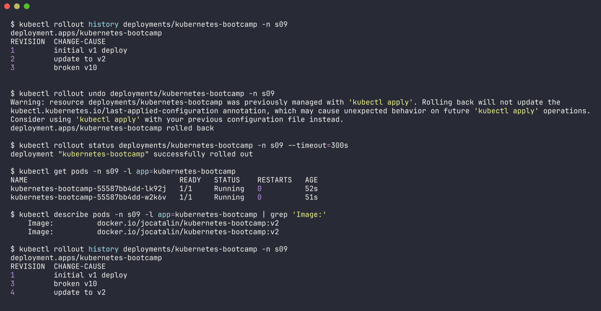

This was the most useful part for me. Because my manifest uses `maxUnavailable` defaults (25%, rounds down to 0 with 2 replicas) the Deployment never killed a working v2 pod while the v10 pod was stuck in `ErrImagePull`, so the app never went down. `rollout undo` just re-activated the v2 ReplicaSet - and notice revision 2 became revision 4 (undo is recorded as a new revision, not a jump back).

**Undo all the way back to v1:**

```
$ kubectl rollout undo deployments/kubernetes-bootcamp --to-revision=1 -n s09
deployment.apps/kubernetes-bootcamp rolled back

    Image:          gcr.io/google-samples/kubernetes-bootcamp:v1
    Image:          gcr.io/google-samples/kubernetes-bootcamp:v1

Hello Kubernetes bootcamp! | Running on: kubernetes-bootcamp-7f55cc94d7-wz8v9 | v=1
Hello Kubernetes bootcamp! | Running on: kubernetes-bootcamp-7f55cc94d7-jt52c | v=1

REVISION  CHANGE-CAUSE
3         broken v10
4         update to v2
5         initial v1 deploy
```

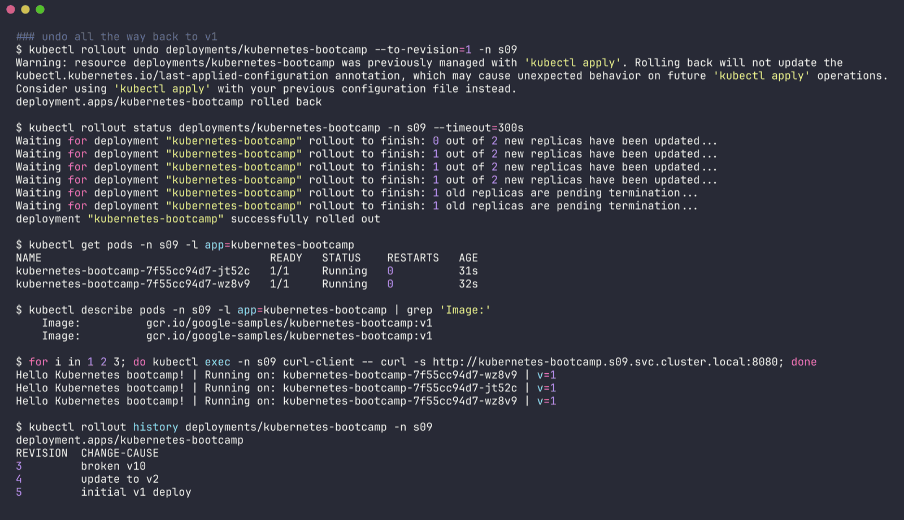

Back to the original ReplicaSet hash `7f55cc94d7`. `rollout undo` also prints a warning that the `last-applied-configuration` from my `kubectl apply` no longer matches - fair point, in real life you'd fix the YAML in git and re-apply rather than undo by hand.

### Cleanup

[outputs/05f-cleanup.txt](outputs/05f-cleanup.txt)

```
$ kubectl delete service kubernetes-bootcamp -n s09
$ kubectl delete deployment kubernetes-bootcamp -n s09
$ kubectl delete pod curl-client -n s09
$ kubectl get all -n s09
No resources found in s09 namespace.
```

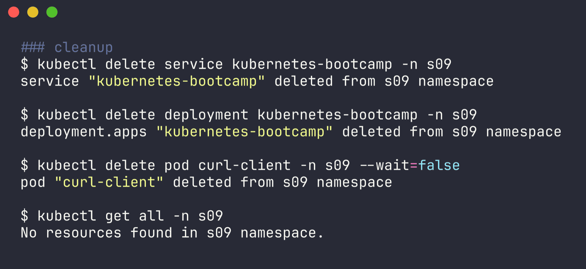

The Task 4 nginx objects were deleted too (`kubectl delete -f manifests/01-pod.yaml -f ... -f manifests/04-service.yaml`). I left the empty `s09` namespace in place.

## Problems I hit

- **Slow image pulls / stuck pods.** On my first attempt ([outputs/first-run/04-basic-objects-first-attempt.txt](outputs/first-run/04-basic-objects-first-attempt.txt)) the minikube node was very busy (it was using swap, `free -m` showed ~800 MB of 1 GB swap used) and pods sat in `ContainerCreating` on `Pulling image "nginx:1.27-alpine"` for over 3 minutes; some got stuck in `Terminating` afterwards and I had to `kubectl delete pod ... --force --grace-period=0` them. Fix: pull images once (`minikube ssh -- sudo crictl pull ...`) and set `imagePullPolicy: IfNotPresent` in the manifests.
- **`kubectl run --rm -i` losing output.** The curl pod exited before kubectl attached, so I got `pod "tmp-curl" deleted` with no response body. Switched to a long-running `curl-client` pod and `kubectl exec`.
- **Service not reachable for the first second or two.** curl exit code 7 right after creating a Service, works a moment later - kube-proxy lag. Added a retry loop.
- **zsh globbing.** `kubectl get pods -o custom-columns=...containers[0].image` fails in zsh with `no matches found` because of the `[0]` - needs quotes.
- **Quoting the change-cause annotation** - in the [second run](outputs/second-run/05e-rolling-update.txt) my script lost the quotes around `'update to v2'` and kubectl tried to treat `to` as a resource name (`error: all resources must be specified before annotation changes: to`). Fixed for the final run.

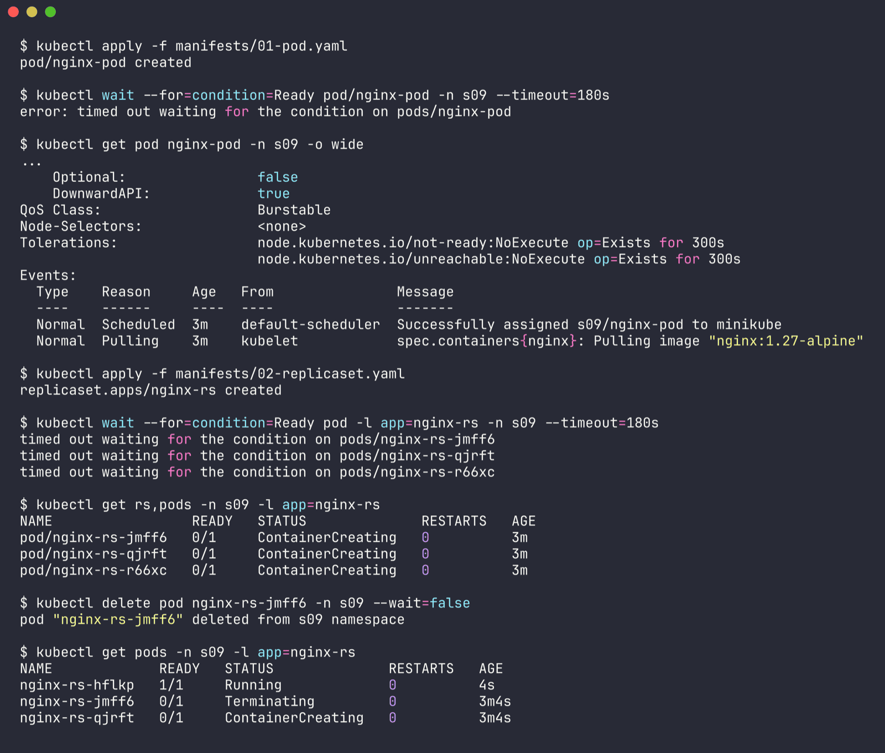

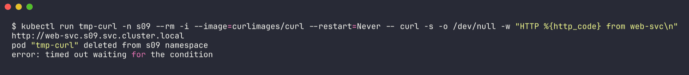

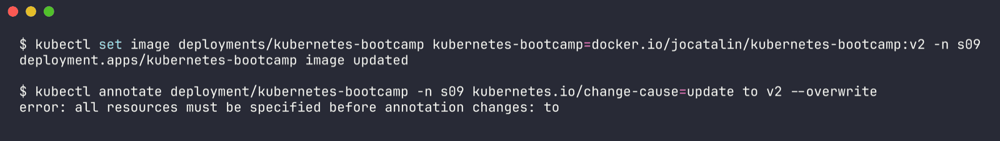
