# Session 10 - Pods, ReplicaSets & Deployments

Name: Ridaa Mirza
Enrollment No: 24BCS10394

Two parts this time. Task 1 is the four deployment strategies (rolling update, blue-green, canary, recreate), each in its own folder with its own namespace. Task 2 is the pod lifecycle lab, where I applied one small pod YAML per lifecycle situation and watched what Kubernetes did with it.

Everything ran on a local minikube cluster (docker driver on macOS, Kubernetes v1.37.0, single node). The raw terminal output for every step is saved in `outputs/`. The blocks below are copied from those files.

```
09-k8s-deployments-pod-lifecycle/
├── 01-rolling-update/   deployment.yaml, service.yaml        (ns: s10-rolling)
├── 02-blue-green/       deployment-blue.yaml, deployment-green.yaml, service.yaml   (ns: s10-bluegreen)
├── 03-canary/           deployment-stable.yaml, deployment-canary.yaml, service.yaml (ns: s10-canary)
├── 04-recreate/         deployment.yaml, service.yaml        (ns: s10-recreate)
├── pod-lifecycle/       01-running.yaml ... 12-termination.yaml (ns: s10-lifecycle)
└── outputs/             raw command output for everything below
```

### Setup

```bash
for n in rolling bluegreen canary recreate lifecycle; do kubectl create ns s10-$n; done

# a long-running curl pod in each strategy namespace, used to hit the Services from inside the cluster
for ns in s10-rolling s10-bluegreen s10-canary s10-recreate; do
  kubectl run client -n $ns --image=curlimages/curl:latest --image-pull-policy=IfNotPresent \
    --restart=Never --command -- sleep 7200
done
```

I'm on macOS with the docker driver, so NodePorts aren't reachable from the host. That's why all the Services are plain `ClusterIP` and I tested them with `kubectl exec client -- curl ...` from inside the cluster.

A note on images. My first try used `nginx:1.25-alpine`, and those pods sat in `ContainerCreating` for over 10 minutes. The node was shared with other workloads, and the kubelet pulls images one at a time, so my pull was stuck in the queue. I switched to images that were already cached on the node: `nginx:1.27-alpine` → `nginx:1.28-alpine` for the version bump, and `busybox:latest` (with `imagePullPolicy: IfNotPresent`) running `httpd` as a tiny "echo" web server for blue-green and canary. The strategy mechanics are the same either way.

---

## Task 1 - Deployment strategies

### 01 - Rolling Update

Files: `01-rolling-update/deployment.yaml`, `01-rolling-update/service.yaml`

The important part of the Deployment:

```yaml
spec:
  replicas: 4
  strategy:
    type: RollingUpdate
    rollingUpdate:
      maxSurge: 1        # at most 4+1 = 5 pods during the update
      maxUnavailable: 0  # never fewer than 4 ready pods
  template:
    spec:
      containers:
        - name: web
          image: nginx:1.27-alpine
          readinessProbe:
            httpGet: { path: /, port: 80 }
```

#### Step 1 - deploy v1

```bash
kubectl apply -f 01-rolling-update/
kubectl annotate deployment/app-rolling -n s10-rolling kubernetes.io/change-cause="v1: nginx:1.27-alpine"
kubectl rollout status deployment/app-rolling -n s10-rolling
kubectl get deploy,rs,pods -n s10-rolling -l app=app-rolling -o wide
kubectl exec -n s10-rolling client -- curl -sI http://app-rolling-service | grep -i ^server
```

```
deployment "app-rolling" successfully rolled out

NAME                                     DESIRED   CURRENT   READY   AGE   CONTAINERS   IMAGES
replicaset.apps/app-rolling-65d78b447c   4         4         4       6s    web          nginx:1.27-alpine

Server: nginx/1.27.5
```

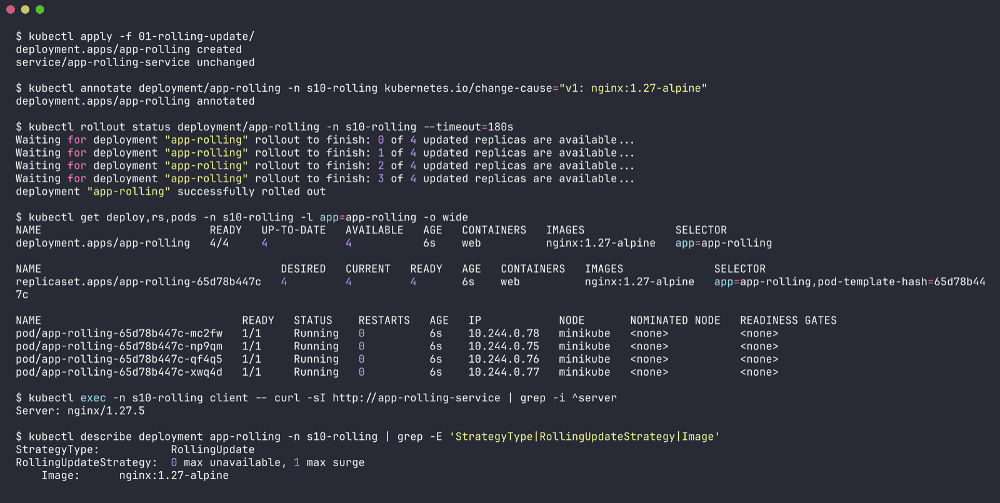

#### Step 2 - update the image while watching pods

I started `kubectl get pods -w` in the background, then changed the image:

```bash
kubectl get pods -n s10-rolling -l app=app-rolling -w --output-watch-events > outputs/01-rolling-watch.txt &
kubectl set image deployment/app-rolling web=nginx:1.28-alpine -n s10-rolling
kubectl annotate deployment/app-rolling -n s10-rolling kubernetes.io/change-cause='v2: nginx:1.28-alpine' --overwrite
kubectl get rs,pods -n s10-rolling -l app=app-rolling
kubectl rollout status deployment/app-rolling -n s10-rolling
```

Right after `set image`, there were two ReplicaSets. The old one still had all 4 pods and the new one had 1 surge pod:

```
NAME                                     DESIRED   CURRENT   READY   AGE
replicaset.apps/app-rolling-65d78b447c   4         4         4       19s
replicaset.apps/app-rolling-6b8f47864    1         1         0       0s

NAME                               READY   STATUS              RESTARTS   AGE
pod/app-rolling-65d78b447c-mc2fw   1/1     Running             0          19s
pod/app-rolling-65d78b447c-np9qm   1/1     Running             0          19s
pod/app-rolling-65d78b447c-qf4q5   1/1     Running             0          19s
pod/app-rolling-65d78b447c-xwq4d   1/1     Running             0          19s
pod/app-rolling-6b8f47864-7b72v    0/1     ContainerCreating   0          0s
```

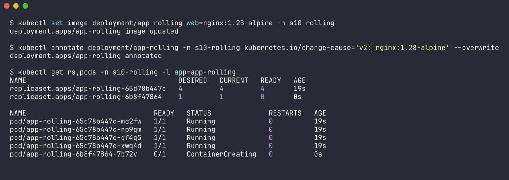

Rollout status:

```
Waiting for deployment "app-rolling" rollout to finish: 1 out of 4 new replicas have been updated...
Waiting for deployment "app-rolling" rollout to finish: 2 out of 4 new replicas have been updated...
Waiting for deployment "app-rolling" rollout to finish: 3 out of 4 new replicas have been updated...
Waiting for deployment "app-rolling" rollout to finish: 1 old replicas are pending termination...
deployment "app-rolling" successfully rolled out
```

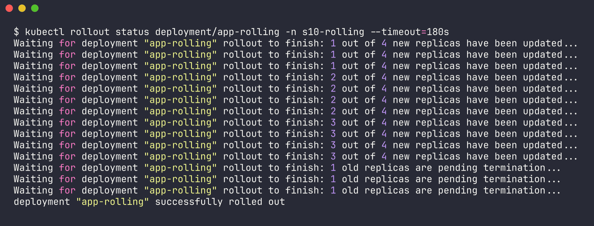

Watch output, trimmed. The full version is in `outputs/01-rolling-watch.txt`:

```
EVENT      NAME                           READY   STATUS              RESTARTS   AGE
ADDED      app-rolling-6b8f47864-7b72v    0/1     Pending             0          0s
MODIFIED   app-rolling-6b8f47864-7b72v    0/1     ContainerCreating   0          0s
MODIFIED   app-rolling-6b8f47864-7b72v    0/1     Running             0          1s
MODIFIED   app-rolling-6b8f47864-7b72v    1/1     Running             0          6s   <- new pod passes readiness
MODIFIED   app-rolling-65d78b447c-np9qm   1/1     Terminating         0          25s  <- only THEN one old pod goes
ADDED      app-rolling-6b8f47864-c4tl4    0/1     Pending             0          0s
...
MODIFIED   app-rolling-6b8f47864-c4tl4    1/1     Running             0          6s
MODIFIED   app-rolling-65d78b447c-mc2fw   1/1     Terminating         0          31s
ADDED      app-rolling-6b8f47864-w7wzw    0/1     Pending             0          0s
...
DELETED    app-rolling-65d78b447c-xwq4d   0/1     Completed           0          44s
```

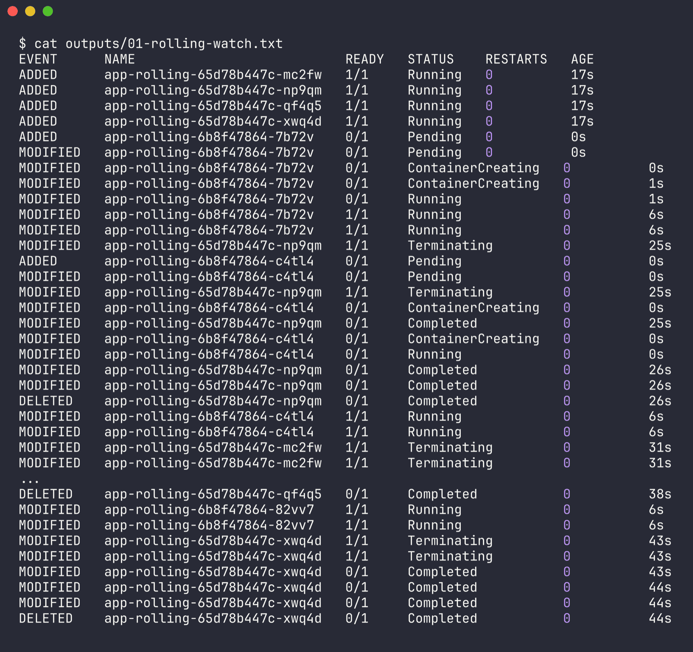

The Deployment events show the same thing one step at a time:

```
Scaled up replica set app-rolling-6b8f47864 from 0 to 1
Scaled down replica set app-rolling-65d78b447c from 4 to 3
Scaled up replica set app-rolling-6b8f47864 from 1 to 2
Scaled down replica set app-rolling-65d78b447c from 3 to 2
Scaled up replica set app-rolling-6b8f47864 from 2 to 3
Scaled down replica set app-rolling-65d78b447c from 2 to 1
Scaled up replica set app-rolling-6b8f47864 from 3 to 4
Scaled down replica set app-rolling-65d78b447c from 1 to 0
```

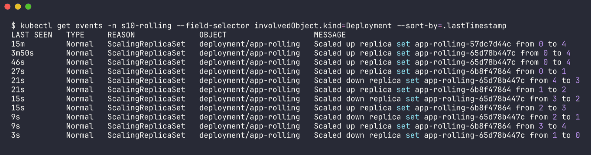

After the rollout:

```
NAME                     DESIRED   CURRENT   READY   AGE   CONTAINERS   IMAGES
app-rolling-65d78b447c   0         0         0       46s   web          nginx:1.27-alpine
app-rolling-6b8f47864    4         4         4       27s   web          nginx:1.28-alpine

Server: nginx/1.28.3

REVISION  CHANGE-CAUSE
1         v1: nginx:1.27-alpine
2         v2: nginx:1.28-alpine
```

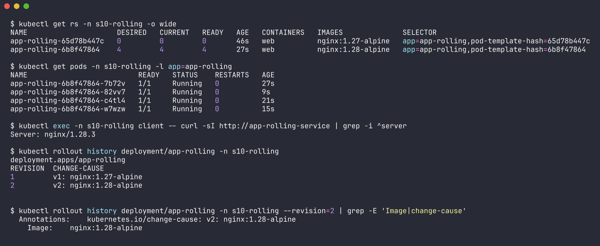

(The events list also has an older line, `Scaled up replica set app-rolling-57dc7d44c from 0 to 4`. That's from my first attempt with `nginx:1.25-alpine`, which got stuck on the image pull.)

#### Step 3 - rollback

```bash
kubectl rollout undo deployment/app-rolling -n s10-rolling
kubectl rollout status deployment/app-rolling -n s10-rolling
kubectl get rs -n s10-rolling -o wide
kubectl rollout history deployment/app-rolling -n s10-rolling
```

```
deployment.apps/app-rolling rolled back
deployment "app-rolling" successfully rolled out

NAME                     DESIRED   CURRENT   READY   AGE   CONTAINERS   IMAGES
app-rolling-65d78b447c   4         4         4       79s   web          nginx:1.27-alpine
app-rolling-6b8f47864    0         0         0       60s   web          nginx:1.28-alpine

Server: nginx/1.27.5

REVISION  CHANGE-CAUSE
2         v2: nginx:1.28-alpine
3         v1: nginx:1.27-alpine
```

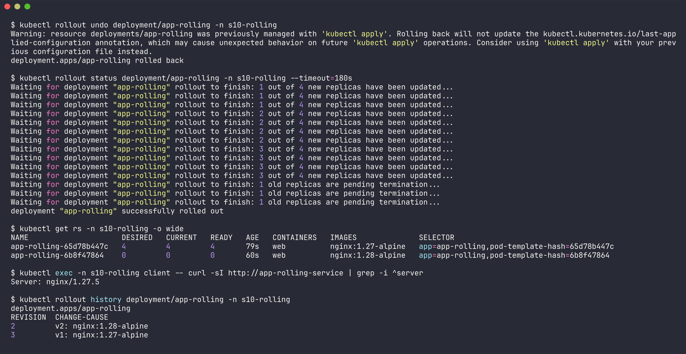

Then I went forward again with `kubectl rollout undo ... --to-revision=2`, which left history at revisions `3` (v1) and `4` (v2) and the Deployment back on `nginx:1.28-alpine`.

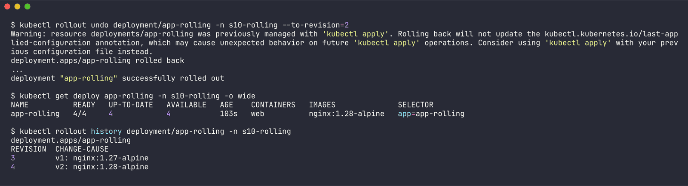

What I observed:
- With `maxSurge: 1, maxUnavailable: 0`, the pod count went 4 → 5 → 4 → 5 → ... and the number of ready pods never dropped below 4. An old pod was only terminated after its replacement passed the readiness probe, which is why the readiness probe matters here.
- Rolling back doesn't create a new ReplicaSet. Kubernetes scaled the old ReplicaSet (`65d78b447c`, same pod-template-hash) back up to 4. That's why the old ReplicaSets are kept around at 0 replicas (`revisionHistoryLimit`).
- On rollback, the revision number moves. Revision 1 became revision 3, because the history is ordered by "last time this template was live", not by when it was created.
- kubectl warns that `rollout undo` doesn't update the `last-applied-configuration` annotation. So if I `kubectl apply` the YAML file later, it goes back to whatever the file says. In real life you'd fix the file in git and re-apply instead.

### 02 - Blue-Green

Files: `02-blue-green/deployment-blue.yaml`, `deployment-green.yaml`, `service.yaml`

There are two full Deployments (3 replicas each) that differ in the `slot` label and the text they return. One Service selects `app=myapp, slot=<colour>`, and switching traffic just means changing that one label in the selector.

```yaml
# service.yaml
spec:
  selector:
    app: myapp
    slot: blue      # <- the switch
  ports:
    - port: 80
      targetPort: 5678
```

```bash
kubectl apply -f 02-blue-green/
kubectl get deploy,pods -n s10-bluegreen -L slot,version
kubectl get svc myapp-service -n s10-bluegreen -o wide
kubectl get endpointslices -n s10-bluegreen -l kubernetes.io/service-name=myapp-service
kubectl exec -n s10-bluegreen client -- sh -c 'for i in 1 2 3 4 5 6; do curl -s http://myapp-service; done'
```

Before the switch:

```
pod/app-blue-7886c94dd6-8pf64    1/1     Running   0          7s     blue    v1
pod/app-blue-7886c94dd6-ftvkr    1/1     Running   0          7s     blue    v1
pod/app-blue-7886c94dd6-js4pm    1/1     Running   0          7s     blue    v1
pod/app-green-57d8bc4476-7mc4t   1/1     Running   0          7s     green   v2
pod/app-green-57d8bc4476-nn64b   1/1     Running   0          7s     green   v2
pod/app-green-57d8bc4476-t726d   1/1     Running   0          7s     green   v2

myapp-service   ClusterIP   10.102.239.40   <none>   80/TCP   8s   app=myapp,slot=blue
myapp-service-2pwbw   IPv4   5678   10.244.0.106,10.244.0.108,10.244.0.109

Hello from BLUE (v1)
Hello from BLUE (v1)
Hello from BLUE (v1)
Hello from BLUE (v1)
Hello from BLUE (v1)
Hello from BLUE (v1)
```

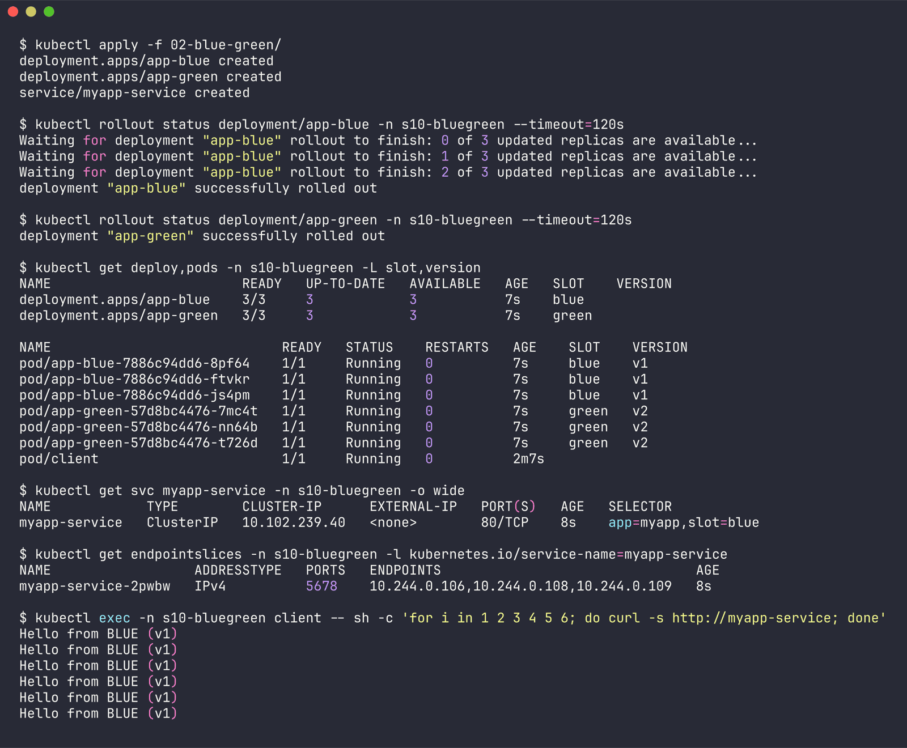

The switch:

```bash
kubectl patch service myapp-service -n s10-bluegreen \
  -p '{"spec":{"selector":{"app":"myapp","slot":"green"}}}'
```

```
service/myapp-service patched

myapp-service   ClusterIP   10.102.239.40   <none>   80/TCP   10s   app=myapp,slot=green
myapp-service-2pwbw   IPv4   5678   10.244.0.107,10.244.0.110,10.244.0.111

Hello from GREEN (v2)
Hello from GREEN (v2)
Hello from GREEN (v2)
Hello from GREEN (v2)
Hello from GREEN (v2)
Hello from GREEN (v2)
```

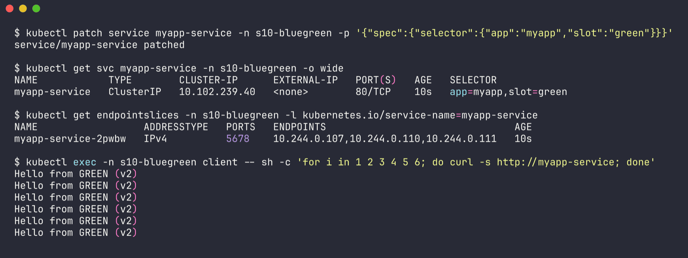

I also flipped it back to blue (`-p '{"spec":{"selector":{"slot":"blue"}}}'`) and all 6 requests said `Hello from BLUE (v1)` again. Then I flipped to green once more, and once green was confirmed I scaled blue down to 0 with `kubectl scale deployment app-blue --replicas=0`.

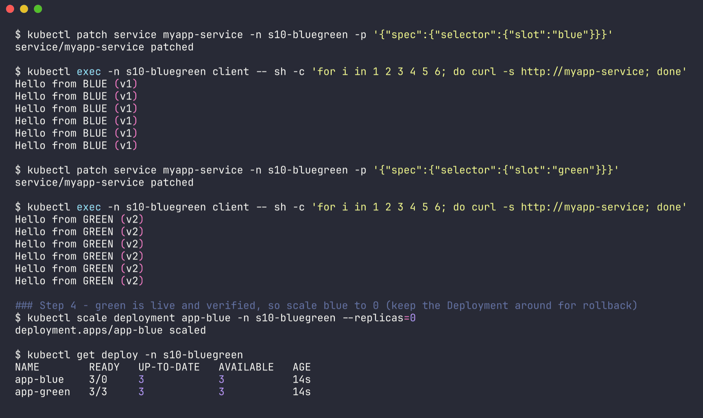

What I observed:
- The ClusterIP (`10.102.239.40`) didn't change at all. Only the endpoint IPs behind it changed, from blue's three pod IPs to green's. Clients never notice anything except the response.
- The cut-over is all-or-nothing and instant. There was no request where blue and green were mixed.
- Rollback is the same one-line patch in reverse, which is the main selling point. The cost is that you're running 2x the pods while both colours are up.
- A merge patch on `spec.selector` merges keys, so patching just `slot` was enough. `app: myapp` stayed in the selector.

### 03 - Canary

Files: `03-canary/deployment-stable.yaml` (4 replicas, `track: stable`), `deployment-canary.yaml` (1 replica, `track: canary`), `service.yaml`

The Service only selects the shared label, so it picks up both tracks:

```yaml
spec:
  selector:
    app: myapp-canary     # stable AND canary pods both have this
```

With 4 stable pods and 1 canary pod, that's 5 endpoints, so roughly 1/5 = 20% of requests should hit the canary.

```bash
kubectl apply -f 03-canary/
kubectl get pods -n s10-canary -l app=myapp-canary -L track,version
kubectl describe endpointslice -n s10-canary -l kubernetes.io/service-name=myapp-canary-service | grep -E 'Addresses|Ready|TargetRef'
kubectl exec -n s10-canary client -- sh -c 'for i in $(seq 1 40); do curl -s http://myapp-canary-service; done' | sort | uniq -c
```

```
NAME                          READY   STATUS    RESTARTS   AGE   TRACK    VERSION
app-canary-95b9fdd57-mrmff    1/1     Running   0          22s   canary   v2
app-stable-68fd96966f-282ch   1/1     Running   0          22s   stable   v1
app-stable-68fd96966f-cpkb9   1/1     Running   0          22s   stable   v1
app-stable-68fd96966f-gxt98   1/1     Running   0          22s   stable   v1
app-stable-68fd96966f-zs7q7   1/1     Running   0          22s   stable   v1

    TargetRef:  Pod/app-stable-68fd96966f-gxt98
    TargetRef:  Pod/app-stable-68fd96966f-282ch
    TargetRef:  Pod/app-stable-68fd96966f-cpkb9
    TargetRef:  Pod/app-stable-68fd96966f-zs7q7
    TargetRef:  Pod/app-canary-95b9fdd57-mrmff      <- 5 ready endpoints, 1 is canary
```

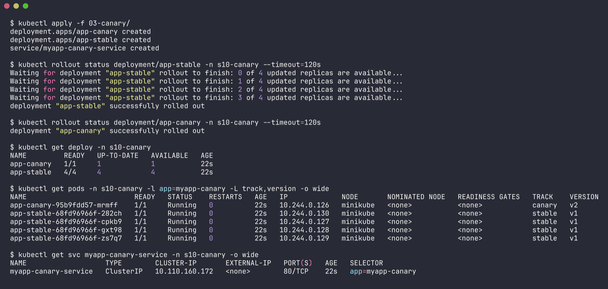

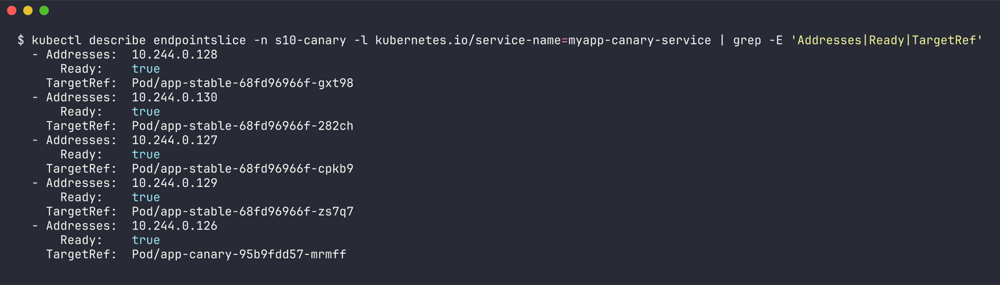

Counting the responses (three runs of 40, then one of 200):

```
   5 CANARY v2
  35 STABLE v1

   5 CANARY v2
  35 STABLE v1

   4 CANARY v2
  36 STABLE v1

  31 CANARY v2      <- 200 requests: 15.5% canary
 169 STABLE v1
```

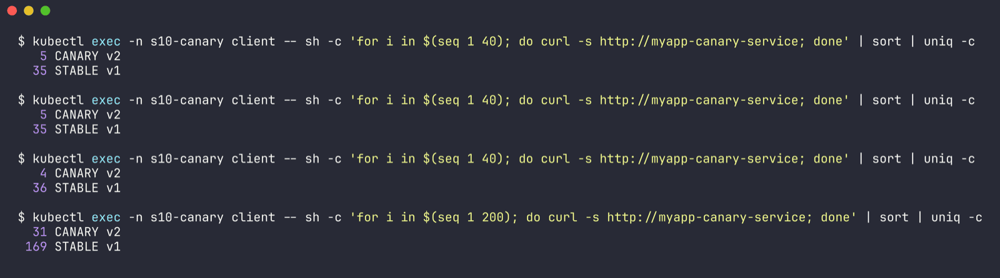

Then I moved the split along like a real canary would:

```bash
# 50/50
kubectl scale deployment app-canary -n s10-canary --replicas=2
kubectl scale deployment app-stable -n s10-canary --replicas=2
#   -> 16 CANARY v2 / 24 STABLE v1

# full promotion
kubectl scale deployment app-canary -n s10-canary --replicas=4
kubectl scale deployment app-stable -n s10-canary --replicas=0
#   -> 40 CANARY v2
```

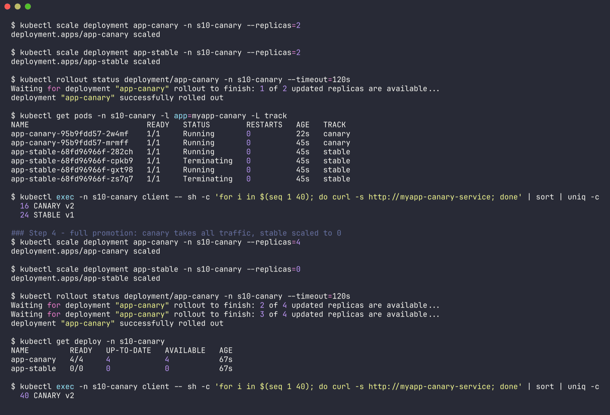

What I observed:
- The traffic split is just the ratio of pod counts. It isn't exact, because kube-proxy (iptables mode) picks an endpoint at random for each new connection. 40 requests is a small sample: I got 10-12.5% per run and 15.5% over 200 requests, against an expected 20%. The more requests you send, the closer it gets.
- My first attempt is in `outputs/03-canary-first-attempt.txt`. I curled right after `rollout status` returned, and two runs of 40 came back 40/40 stable. The next run of 200 showed 30 canary. My guess is the canary endpoint hadn't been programmed into kube-proxy's rules yet. In the clean run I waited ~15s after the rollout first.
- The downside of doing a canary with plain Deployments is that you can't say "send exactly 5%" without running 19 stable pods. For precise percentages you'd need an ingress or service mesh with weighted routing.

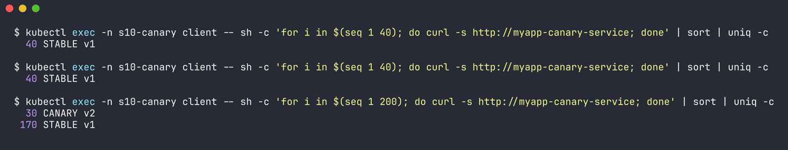

### 04 - Recreate

Files: `04-recreate/deployment.yaml`, `04-recreate/service.yaml`

```yaml
spec:
  replicas: 3
  strategy:
    type: Recreate
```

```bash
kubectl apply -f 04-recreate/
kubectl describe deployment app-recreate -n s10-recreate | grep -E 'StrategyType|Image'
```

```
StrategyType:       Recreate
    Image:      nginx:1.27-alpine
```

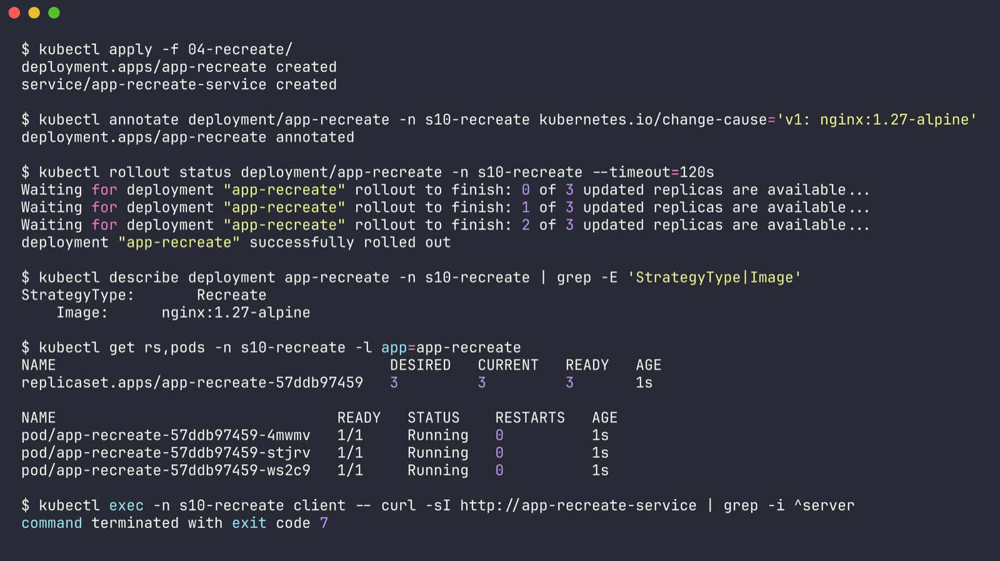

For the update, I ran a pod watch and a request loop (curl every 0.5s from the client pod) in the background:

```bash
kubectl get pods -n s10-recreate -l app=app-recreate -w --output-watch-events > outputs/04-recreate-watch.txt &
kubectl exec -n s10-recreate client -- sh -c 'for i in $(seq 1 60); do printf "%s " "$(date +%T)"; \
  curl -s -m1 -o /dev/null -w "%{http_code}\n" http://app-recreate-service || echo; sleep 0.5; done' \
  > outputs/04-recreate-probe.txt &
kubectl set image deployment/app-recreate web=nginx:1.28-alpine -n s10-recreate
kubectl get rs,pods -n s10-recreate -l app=app-recreate
```

Immediately after `set image`, the old ReplicaSet was already at 0 desired, all 3 pods were Terminating, and there was no new pod yet:

```
NAME                                      DESIRED   CURRENT   READY   AGE
replicaset.apps/app-recreate-57ddb97459   0         0         0       3s

NAME                                READY   STATUS        RESTARTS   AGE
pod/app-recreate-57ddb97459-4mwmv   1/1     Terminating   0          3s
pod/app-recreate-57ddb97459-stjrv   1/1     Terminating   0          3s
pod/app-recreate-57ddb97459-ws2c9   1/1     Terminating   0          3s
```

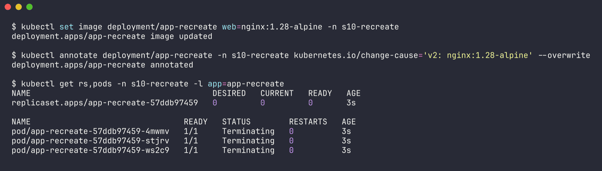

The watch shows the order clearly. All three old pods go Terminating, then their containers stop (`Completed`), and only after that are the new pods created:

```
EVENT      NAME                            READY   STATUS              RESTARTS   AGE
ADDED      app-recreate-57ddb97459-4mwmv   1/1     Running             0          1s
ADDED      app-recreate-57ddb97459-stjrv   1/1     Running             0          1s
ADDED      app-recreate-57ddb97459-ws2c9   1/1     Running             0          1s
MODIFIED   app-recreate-57ddb97459-stjrv   1/1     Terminating         0          3s
MODIFIED   app-recreate-57ddb97459-4mwmv   1/1     Terminating         0          3s
MODIFIED   app-recreate-57ddb97459-ws2c9   1/1     Terminating         0          3s
MODIFIED   app-recreate-57ddb97459-stjrv   0/1     Completed           0          4s
MODIFIED   app-recreate-57ddb97459-ws2c9   0/1     Completed           0          4s
MODIFIED   app-recreate-57ddb97459-4mwmv   0/1     Completed           0          4s
ADDED      app-recreate-5f6f4f877b-28dmd   0/1     Pending             0          0s   <- new pods only now
ADDED      app-recreate-5f6f4f877b-6h9sx   0/1     Pending             0          0s
ADDED      app-recreate-5f6f4f877b-7f49x   0/1     Pending             0          0s
MODIFIED   app-recreate-5f6f4f877b-28dmd   0/1     ContainerCreating   0          0s
...
MODIFIED   app-recreate-5f6f4f877b-28dmd   1/1     Running             0          0s
MODIFIED   app-recreate-5f6f4f877b-6h9sx   1/1     Running             0          0s
MODIFIED   app-recreate-5f6f4f877b-7f49x   1/1     Running             0          0s
```

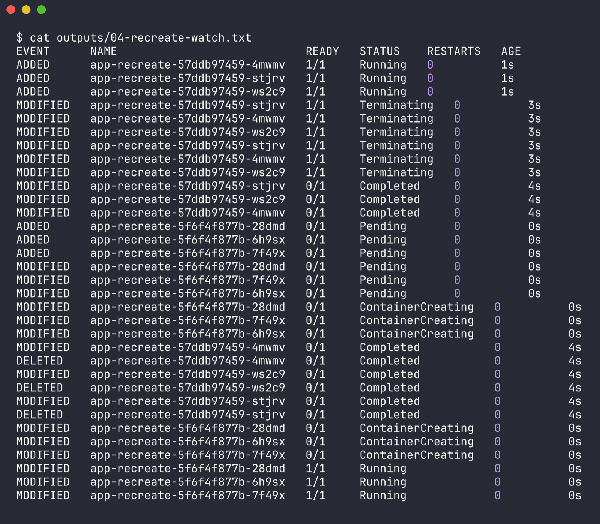

The request loop caught the downtime window, where `000` means the connection failed:

```
11:11:33 200
11:11:33 200
11:11:34 200
11:11:34 000     <- old pods gone, new ones not up yet
11:11:35 000
11:11:36 200     <- v2 serving
11:11:37 200
```

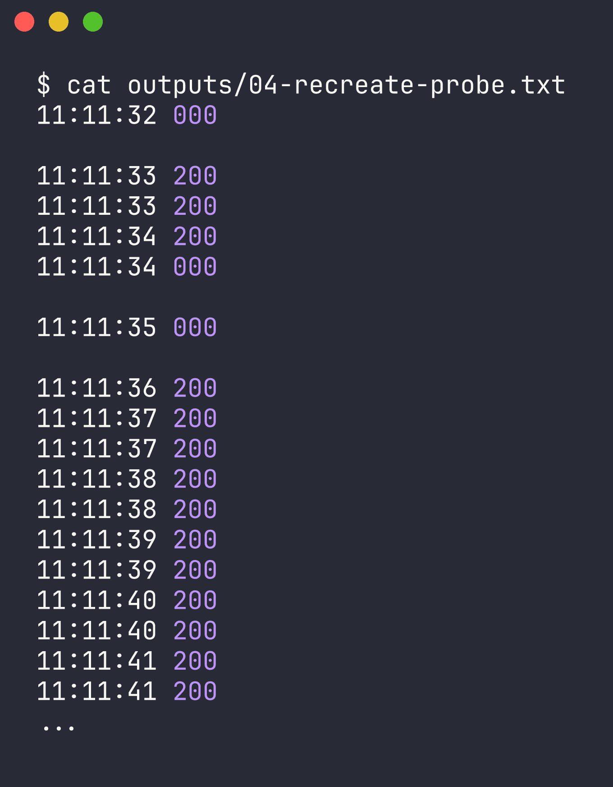

Deployment events and the result:

```
Scaled up replica set app-recreate-57ddb97459 from 0 to 3
Scaled down replica set app-recreate-57ddb97459 from 3 to 0
Scaled up replica set app-recreate-5f6f4f877b from 0 to 3

Server: nginx/1.28.3
```

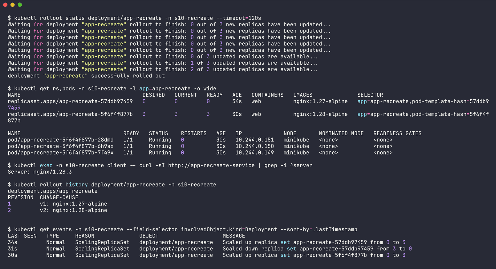

What I observed:
- Recreate does exactly what it says. It scales the old ReplicaSet straight to 0, waits for those pods to actually stop, and then scales the new one 0 → 3. At no point were v1 and v2 running together.
- The cost is real downtime. Even with a tiny nginx image that was already cached, there was a gap of about 2 seconds with failed requests. With a slow-starting app it would be much longer.
- When you'd use it: when two versions can't run side by side. For example, a DB schema migration that the old version can't handle, or an app that holds an exclusive lock or a ReadWriteOnce volume.
- Side note: the very first `curl -sI` right after the v1 rollout failed with exit code 7 (connection refused). This Deployment has no readiness probe, so the pods counted as "available" the moment the container started, a bit before the Service actually routed to them. That's another reason the rolling-update Deployment has a readiness probe.

### Strategy comparison

| Strategy | Old + new running together? | Downtime | Extra resources | Rollback |
|---|---|---|---|---|
| Rolling Update | yes, briefly (mixed versions) | none (with maxUnavailable 0 + readiness) | +maxSurge pods | `kubectl rollout undo` (gradual) |
| Blue-Green | both deployed, only one gets traffic | none | 2x pods | patch selector back (instant) |
| Canary | yes, on purpose, split by pod ratio | none | +canary pods | scale canary to 0 |
| Recreate | never | yes (~2s here) | none | another full recreate |

---

## Task 2 - Pod lifecycle

The YAMLs are copied from the instructor repo into `pod-lifecycle/`. They mostly worked as they were. The only change was the images: `busybox:1.36` → `busybox:latest` + `imagePullPolicy: IfNotPresent`, and `nginx:1.27` → `nginx:1.27-alpine`, for the same image-pull-queue reason explained in Setup. Everything ran in namespace `s10-lifecycle`.

The general loop for each file was:

```bash
kubectl apply -n s10-lifecycle -f pod-lifecycle/<file>.yaml
kubectl get pod <name> -n s10-lifecycle -w --output-watch-events   # in the background
kubectl get pod <name> -n s10-lifecycle
kubectl describe pod <name> -n s10-lifecycle
kubectl logs <name> -n s10-lifecycle
```

Raw output: `outputs/pod-lifecycle-01-02.txt`, `pod-lifecycle-03-06.txt`, `pod-lifecycle-07-11.txt`, `pod-lifecycle-12.txt`, `pod-lifecycle-followup.txt`, and one `outputs/watch-<pod>.txt` per pod.

The official pod **phases** are just five: `Pending`, `Running`, `Succeeded`, `Failed`, `Unknown`. The STATUS column in `kubectl get pods` shows extra words like `Completed`, `Error`, `CrashLoopBackOff`, `ContainerCreating`, `Init:0/1`, `Terminating`. Those come from container states and reasons, not phases. This table, taken from the follow-up a few minutes in, shows the difference:

```bash
kubectl get pods -n s10-lifecycle -o 'custom-columns=NAME:.metadata.name,PHASE:.status.phase,RESTARTS:.status.containerStatuses[0].restartCount'
```

```
NAME                        PHASE       RESTARTS
lifecycle-crashloop         Running     4         <- STATUS column said "Error"/"CrashLoopBackOff"
lifecycle-failed            Failed      0         <- STATUS "Error"
lifecycle-image-error       Pending     0
lifecycle-init              Running     0
lifecycle-liveness          Running     1
lifecycle-multi-container   Running     0
lifecycle-pending           Pending     <none>    <- never scheduled, so no container status at all
lifecycle-readiness         Running     0
lifecycle-running           Running     0
lifecycle-startup           Running     0
lifecycle-succeeded         Succeeded   0         <- STATUS "Completed"
```

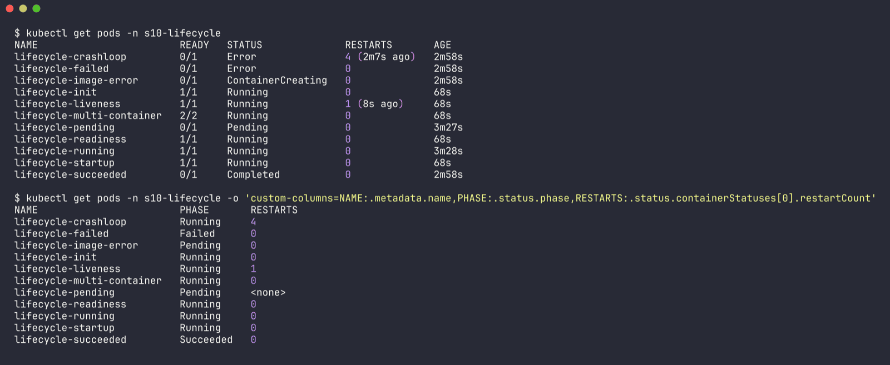

### 01-running.yaml - Running

A plain nginx pod.

```
NAME                READY   STATUS    RESTARTS   AGE   IP             NODE
lifecycle-running   1/1     Running   0          0s    10.244.0.152   minikube

phase: Running
state: {"running":{"startedAt":"2026-10-07T11:12:32Z"}}

Conditions:
  Type                        Status
  PodReadyToStartContainers   True
  Initialized                 True
  Ready                       True
  ContainersReady             True
  PodScheduled                True
QoS Class:                   BestEffort
Events:
  Normal  Scheduled  0s  default-scheduler  Successfully assigned s10-lifecycle/lifecycle-running to minikube
  Normal  Pulled     0s  kubelet  Container image "nginx:1.27-alpine" already present on machine ...
  Normal  Created    0s  kubelet  Container created
  Normal  Started    0s  kubelet  Container started
```

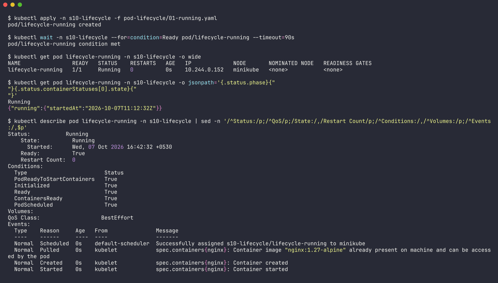

What I observed: this is the happy path. Scheduled → Pulled → Created → Started, and all five conditions are True. QoS is `BestEffort` because the container has no requests or limits.

### 02-pending.yaml - Pending (unschedulable)

This pod requests `cpu: 1, memory: 9Gi`.

```
NAME                READY   STATUS    RESTARTS   AGE   IP       NODE
lifecycle-pending   0/1     Pending   0          10s   <none>   <none>

Status:           Pending
    Requests:
      cpu:        1
      memory:     9Gi
Conditions:
  Type           Status
  PodScheduled   False
Events:
  Warning  FailedScheduling  10s  default-scheduler  0/1 nodes are available: 1 Insufficient memory.
           preemption: 0/1 nodes are available: 1 Preemption is not helpful for scheduling.

$ kubectl describe node minikube | grep -A8 '^Allocatable' | grep -E 'cpu|memory'
  cpu:                15
  memory:             8123872Ki     (~7.75 GiB < 9Gi)
```

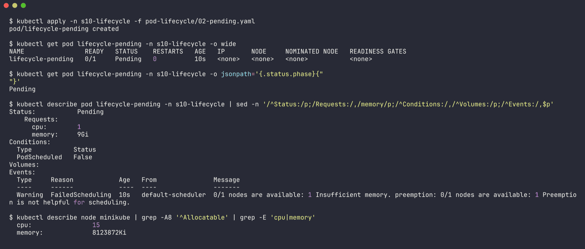

What I observed: the node only has ~7.75Gi allocatable, so the scheduler can't place a 9Gi request anywhere. The pod has no node and no IP, and only one condition (`PodScheduled False`). It just stays Pending forever. The scheduler keeps retrying, but nothing will change unless a bigger node joins or the request is lowered. CPU was fine (1 of 15), so memory was the only problem.

### 03-succeeded.yaml - Succeeded

busybox runs `echo; sleep 5; exit 0` with `restartPolicy: Never`.

```
watch:
ADDED      lifecycle-succeeded   0/1     ContainerCreating   0          0s
MODIFIED   lifecycle-succeeded   1/1     Running             0          0s
MODIFIED   lifecycle-succeeded   0/1     Completed           0          5s

$ kubectl logs lifecycle-succeeded
Task started
Task completed successfully

Status:           Succeeded
    State:          Terminated
      Reason:       Completed
      Exit Code:    0
      Started:      Wed, 07 Oct 2026 16:43:02 +0530
      Finished:     Wed, 07 Oct 2026 16:43:07 +0530
    Restart Count:  0
```

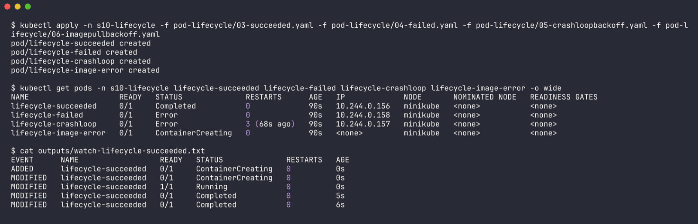

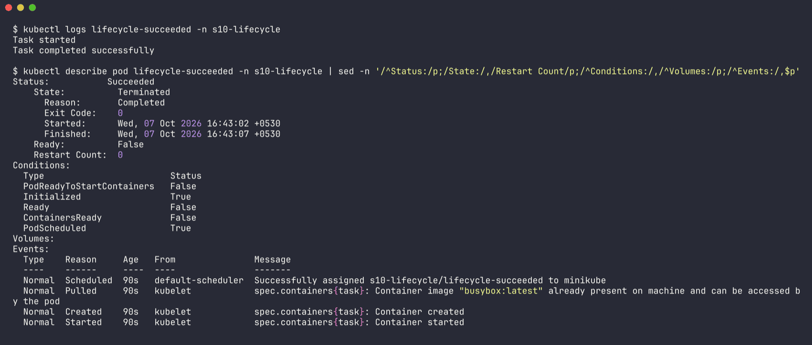

What I observed: Running for exactly 5 seconds, then exit code 0. Every container exited 0 and the restartPolicy is Never, so the pod phase becomes `Succeeded` (STATUS column shows `Completed`). The pod object stays around so you can still read its logs. This is basically what a Job pod looks like.

### 04-failed.yaml - Failed

Same thing, but with `exit 1`.

```
watch:
MODIFIED   lifecycle-failed   1/1     Running   0          0s
MODIFIED   lifecycle-failed   0/1     Error     0          5s

$ kubectl logs lifecycle-failed
Task started
Task failed

Status:           Failed
    State:          Terminated
      Reason:       Error
      Exit Code:    1
    Restart Count:  0
```

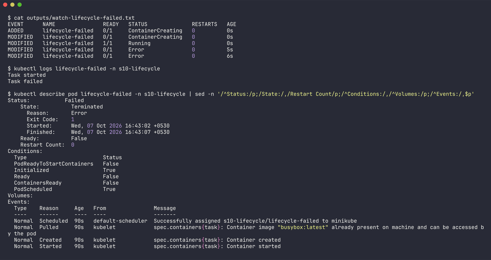

What I observed: a non-zero exit with `restartPolicy: Never` puts the pod in phase `Failed` (STATUS `Error`). The kubelet doesn't try again. With `restartPolicy: OnFailure` it would have restarted the container instead.

### 05-crashloopbackoff.yaml - CrashLoopBackOff

Same failing command, but with the default `restartPolicy: Always`.

```
watch:
MODIFIED   lifecycle-crashloop   1/1     Running             0             0s
MODIFIED   lifecycle-crashloop   0/1     Error               0             3s
MODIFIED   lifecycle-crashloop   1/1     Running             1 (0s ago)    3s
MODIFIED   lifecycle-crashloop   0/1     Error               1 (4s ago)    7s
MODIFIED   lifecycle-crashloop   0/1     CrashLoopBackOff    1 (13s ago)   19s
MODIFIED   lifecycle-crashloop   1/1     Running             2 (13s ago)   19s
MODIFIED   lifecycle-crashloop   0/1     Error               2 (16s ago)   22s
MODIFIED   lifecycle-crashloop   0/1     CrashLoopBackOff    2 (26s ago)   48s
MODIFIED   lifecycle-crashloop   1/1     Running             3 (26s ago)   48s
MODIFIED   lifecycle-crashloop   0/1     Error               3 (29s ago)   51s

$ kubectl logs lifecycle-crashloop
Application started
Application crashed

    State:          Terminated
      Reason:       Error
      Exit Code:    1
    Last State:     Terminated
      Reason:       Error
      Exit Code:    1
    Restart Count:  4
Events:
  Normal   Started    78s (x5 over 2m59s)  kubelet  Container started
  Warning  BackOff    74s (x4 over 2m52s)  kubelet  Back-off restarting failed container crashing-app in pod lifecycle-crashloop_...
```

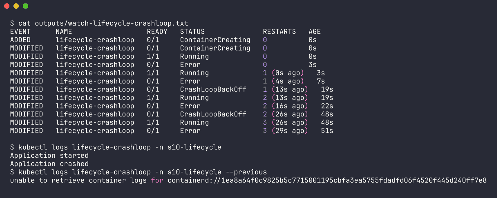

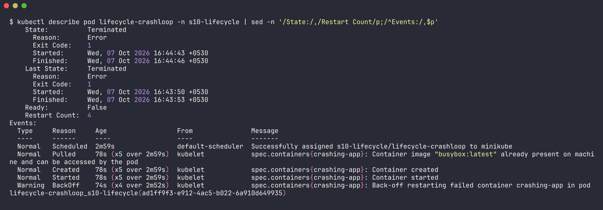

What I observed:
- The pod phase stays `Running` (see the phase table above). CrashLoopBackOff isn't a phase. It's the kubelet waiting before the next restart.
- The wait between restarts grows: the restarts happened at roughly 3s, 19s and 48s, and then it waited longer still. That's the exponential back-off (10s, 20s, 40s ... capped at 5 min).
- `Last State` keeps the previous crash's exit code, which is the first thing to check when debugging. `kubectl logs --previous` is normally how you get the crashed run's output. Here it returned `unable to retrieve container logs for containerd://...` (the old container had already been cleaned up on this busy node), so I used plain `kubectl logs`, which showed the last terminated run.

### 06-imagepullbackoff.yaml - image pull error

The image `jakwehrgkaejw:kahsdfgkhj` doesn't exist.

```
Status:           Pending
    Image:          jakwehrgkaejw:kahsdfgkhj
    State:          Waiting
      Reason:       ContainerCreating
Events:
  Normal  Scheduled  2m59s  default-scheduler  Successfully assigned s10-lifecycle/lifecycle-image-error to minikube
  Normal  Pulling    2m59s  kubelet            Pulling image "jakwehrgkaejw:kahsdfgkhj"
```

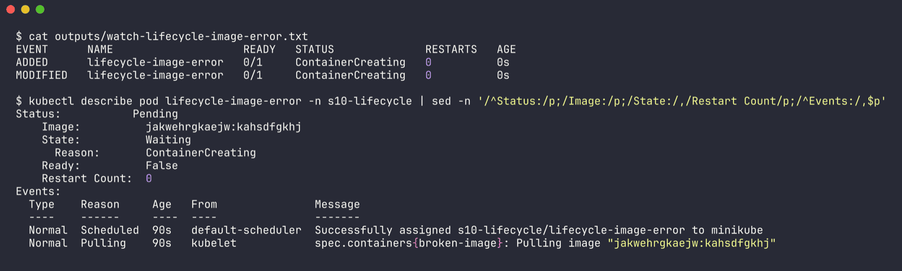

To confirm what the registry says about this image, I ran the pull directly on the node:

```
$ minikube ssh -- sudo crictl pull docker.io/library/jakwehrgkaejw:kahsdfgkhj
... failed to resolve reference "docker.io/library/jakwehrgkaejw:kahsdfgkhj": pull access denied,
repository does not exist or may require authorization: server message: insufficient_scope: authorization failed
```

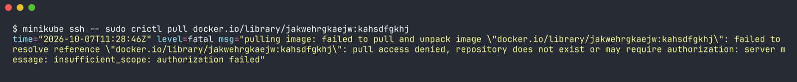

After roughly 15 minutes the kubelet worked through its pull queue and actually tried this pull (`outputs/pod-lifecycle-06-later.txt`):

```
NAME                    READY   STATUS         RESTARTS   AGE
lifecycle-image-error   0/1     ErrImagePull   0          15m

Status:           Pending
    State:          Waiting
      Reason:       ErrImagePull
    Restart Count:  0
Events:
  Normal   Pulling    21s (x3 over 15m)  kubelet  Pulling image "jakwehrgkaejw:kahsdfgkhj"
  Warning  Failed     17s (x3 over 91s)  kubelet  Failed to pull image "jakwehrgkaejw:kahsdfgkhj": ... pull access denied,
                                                   repository does not exist or may require authorization ...
  Warning  Failed     17s (x3 over 91s)  kubelet  Error: ErrImagePull
  Normal   BackOff    3s (x3 over 90s)   kubelet  Back-off pulling image "jakwehrgkaejw:kahsdfgkhj"
  Warning  Failed     3s (x3 over 90s)   kubelet  Error: ImagePullBackOff
```

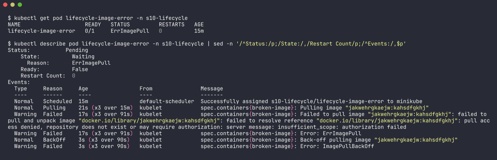

What I observed: the pod is scheduled fine, but the phase is stuck at `Pending` because the container can't be created without an image. A short name like `jakwehrgkaejw` gets expanded to `docker.io/library/jakwehrgkaejw`, and Docker Hub answers "pull access denied / repository does not exist". The kubelet reports that as `ErrImagePull`, then backs off and retries, showing `ImagePullBackOff`, with the same growing back-off as CrashLoopBackOff. On this shared node the kubelet's pull queue was busy with other workloads' images, so it took a long time before the kubelet even got to this pull. That's why the pod sat at "Pulling" for minutes first.

### 07-readiness.yaml - readiness probe

nginx with `readinessProbe: httpGet / :80, initialDelaySeconds: 5, periodSeconds: 5`.

```
watch:
MODIFIED   lifecycle-readiness   0/1     Running             0          0s
MODIFIED   lifecycle-readiness   1/1     Running             0          6s

at 4s:  lifecycle-readiness   0/1   Running   0   4s
at 20s: lifecycle-readiness   1/1   Running   0   20s

    Readiness:      http-get http://:80/ delay=5s timeout=1s period=5s successThreshold=1 failureThreshold=3
Conditions:
  Ready                       True
  ContainersReady             True
```

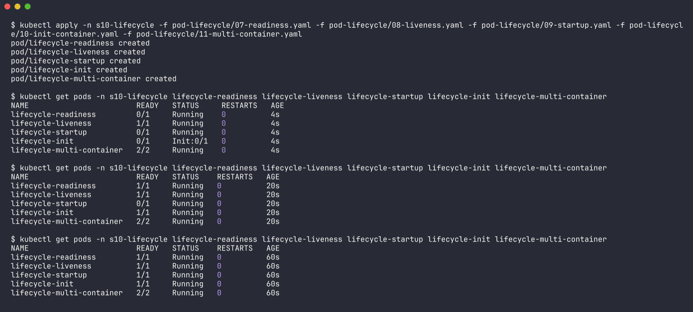

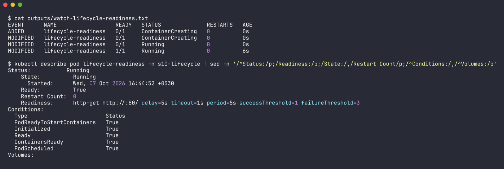

What I observed: the container was `Running` right away, but READY stayed `0/1` for about 6 seconds until the first probe ran (after the 5s initial delay) and passed. A pod that isn't ready gets left out of Service endpoints but is **not** restarted. Readiness only controls traffic. This is exactly what kept the rolling update in Task 1 safe.

### 08-liveness.yaml - liveness probe

The app creates `/tmp/healthy`, deletes it after 20s, then sleeps. The liveness probe is `test -f /tmp/healthy`, every 5s, failureThreshold 2.

```
watch:
MODIFIED   lifecycle-liveness   1/1     Running   0            0s
MODIFIED   lifecycle-liveness   1/1     Running   1 (0s ago)   60s

$ kubectl logs lifecycle-liveness --previous
App started
Health file removed

    State:          Running
      Started:      Wed, 07 Oct 2026 16:45:52 +0530
    Last State:     Terminated
      Reason:       Error
      Exit Code:    137
      Started:      Wed, 07 Oct 2026 16:44:52 +0530
      Finished:     Wed, 07 Oct 2026 16:45:52 +0530
    Restart Count:  1
    Liveness:       exec [sh -c test -f /tmp/healthy] delay=5s timeout=1s period=5s successThreshold=1 failureThreshold=2
Events:
  Warning  Unhealthy  39s (x2 over 44s)  kubelet  Liveness probe failed:
  Normal   Killing    39s                kubelet  Container app failed liveness probe, will be restarted
  Normal   Started    9s (x2 over 69s)   kubelet  Container started
```

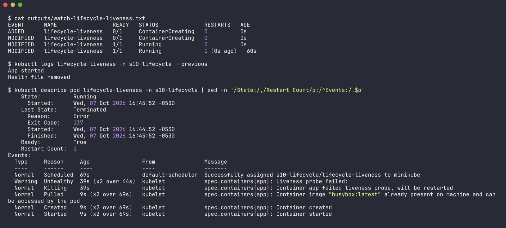

What I observed:
- At ~20s the file was removed. The probe failed twice (2 x 5s = failureThreshold), and at ~30s the kubelet decided to kill the container.
- The restart didn't actually happen until **60s**. The container is `sh -c ...` running as PID 1, and it doesn't handle SIGTERM, so it ignored the kill signal. The kubelet waited the default 30s `terminationGracePeriodSeconds` and then sent SIGKILL. That's why the exit code is **137** (128 + 9 = SIGKILL) and the Last State runs from 16:44:52 to 16:45:52.
- Unlike readiness, liveness failure restarts the container (restart count 1). The pod object and IP stay the same.

### 09-startup.yaml - startup probe

The app takes 30s to "start" (`sleep 30; touch /tmp/started`). The startup probe is `test -f /tmp/started`, periodSeconds 5, failureThreshold 10, so it allows up to 50s.

```
watch:
MODIFIED   lifecycle-startup   0/1     Running   0          0s
MODIFIED   lifecycle-startup   1/1     Running   0          35s

$ kubectl logs lifecycle-startup
Application starting...
Application started

    Restart Count:  0
    Startup:        exec [sh -c test -f /tmp/started] delay=0s timeout=1s period=5s successThreshold=1 failureThreshold=10
Events:
  Warning  Unhealthy  30s (x6 over 55s)  kubelet  Startup probe failed:
```

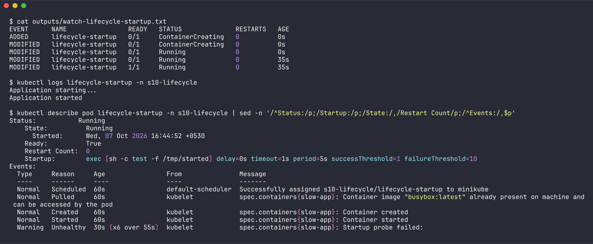

What I observed: the startup probe failed 6 times (`x6`) while the app was "booting", but that's still under the threshold of 10, so nothing was killed. At ~35s it passed and the pod went `1/1` with **0 restarts**. While a startup probe is still running, liveness and readiness probes are paused. That's the point: a slow starter gets a generous boot window without loosening the liveness probe that runs afterwards. If startup had taken more than 50s, the container would have been restarted.

### 10-init-container.yaml - init container

The init container `setup` (busybox, `sleep 10`) has to finish before the `app` (nginx) container starts.

```
watch:
ADDED      lifecycle-init   0/1     Init:0/1          0          0s
MODIFIED   lifecycle-init   0/1     PodInitializing   0          11s
MODIFIED   lifecycle-init   1/1     Running           0          11s

$ kubectl logs lifecycle-init -c setup
Init container running
Init complete

Init Containers:
  setup:
    State:          Terminated
      Reason:       Completed
      Exit Code:    0
      Started:      Wed, 07 Oct 2026 16:44:52 +0530
      Finished:     Wed, 07 Oct 2026 16:45:02 +0530
Events:
  Normal  Started    60s  kubelet  spec.initContainers{setup}: Container started
  Normal  Pulled     49s  kubelet  spec.containers{app}: Container image "nginx:1.27-alpine" already present ...
  Normal  Started    49s  kubelet  spec.containers{app}: Container started
```

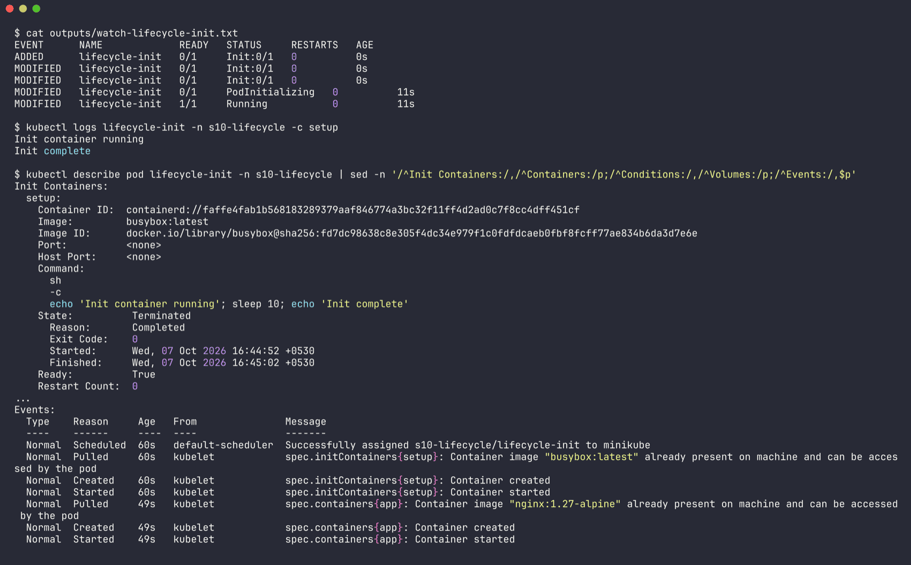

What I observed: STATUS showed `Init:0/1` for the 10 seconds the init container was running, then `PodInitializing`, then `Running`. The events show the gap: the init container started at 60s ago, and the app container wasn't even pulled or created until 49s ago, after init exited 0. The init container keeps its `Terminated / Completed` state on the pod, and you can still read its logs with `-c setup`. If it had failed, the pod would have shown `Init:Error` / `Init:CrashLoopBackOff` and nginx would never have started.

### 11-multi-container.yaml - multi-container pod

nginx `app` plus a busybox `sidecar` that logs every 10s.

```
lifecycle-multi-container   2/2     Running   0          4s

$ kubectl get pod lifecycle-multi-container -o jsonpath='{range .status.containerStatuses[*]}...'
app  ready=true  {"running":{"startedAt":"2026-10-07T11:14:52Z"}}
sidecar  ready=true  {"running":{"startedAt":"2026-10-07T11:14:52Z"}}

$ kubectl logs lifecycle-multi-container -c sidecar
Sidecar is running
Sidecar is running
...

$ kubectl exec lifecycle-multi-container -c sidecar -- wget -qO- http://localhost:80 | head -4
<!DOCTYPE html>
<html>
<head>
<title>Welcome to nginx!</title>
```

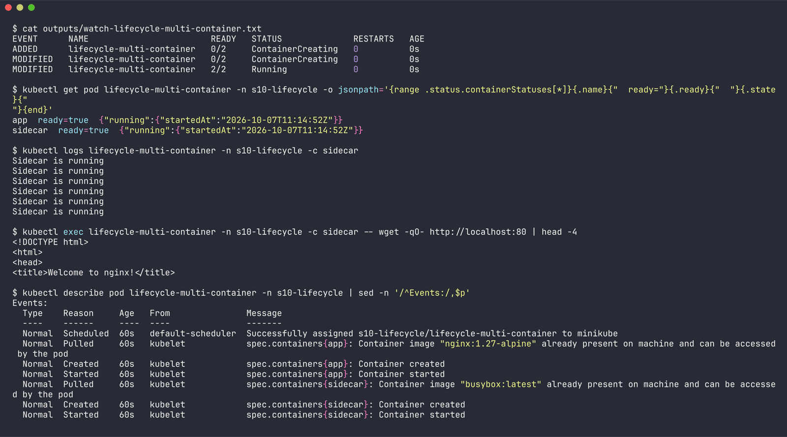

What I observed: READY is `2/2`, counted per container. Both containers started together, unlike init containers. The interesting bit is the last command: running inside the **sidecar**, `localhost:80` reaches **nginx** in the other container. That shows both containers share one network namespace (same pod IP, same localhost). Logs and exec need `-c <container>` to pick which one.

### 12-termination.yaml - graceful termination

The container traps SIGTERM, "cleans up" for 10s, and exits 0. `terminationGracePeriodSeconds: 20`.

```bash
kubectl logs -f lifecycle-termination --timestamps > outputs/lifecycle-termination-logs.txt &
date +%T; kubectl delete pod lifecycle-termination -n s10-lifecycle; date +%T
```

```
16:46:13
pod "lifecycle-termination" deleted from s10-lifecycle namespace
16:46:26

logs:
2026-10-07T11:16:11.809215013Z Application running
2026-10-07T11:16:15.813241959Z SIGTERM received; cleaning up...
2026-10-07T11:16:25.818793714Z Cleanup complete

watch:
ADDED      lifecycle-termination   1/1     Running       0          0s
MODIFIED   lifecycle-termination   1/1     Terminating   0          2s
MODIFIED   lifecycle-termination   0/1     Completed     0          14s
DELETED    lifecycle-termination   0/1     Completed     0          15s
```

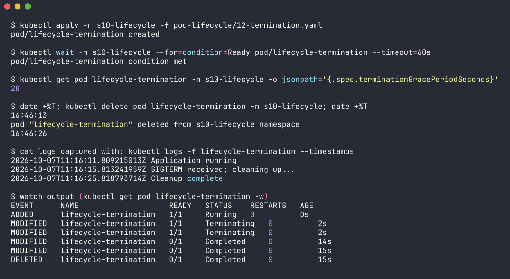

What I observed:
- `kubectl delete` blocked for about 13 seconds (16:46:13 → 16:46:26), not instantly and not the full 20s. Kubernetes sent SIGTERM, the app ran its cleanup and exited on its own, and the pod was removed as soon as it did.
- The SIGTERM message shows up ~2s after the delete, not immediately. The shell's main loop is `sleep 2`, and `sh` only runs the trap once the current foreground `sleep` finishes. That's a small but real gotcha for signal handling in shell entrypoints.
- Cleanup (10s) fit inside the 20s grace period, so it exited cleanly (`Completed`, exit 0). If cleanup had taken longer than 20s, the kubelet would have SIGKILLed it, like the liveness pod in 08 (exit 137).
- During `Terminating`, the pod is removed from Service endpoints. That's how the rolling/recreate updates drain old pods.

---

## Cleanup

```bash
kubectl delete ns s10-rolling s10-bluegreen s10-canary s10-recreate s10-lifecycle
```
