# Session 11 - Kubernetes Networking & Services

Name: Ridaa Mirza
Enrollment No: 24BCS10394

Pods die and come back with new IPs all the time, so nothing should ever talk to a pod IP directly. A Service gives a group of pods one stable name + one stable virtual IP, and kube-proxy spreads traffic across whichever pods currently match the selector. This session was about the five ways to set that up, and the DNS layer (CoreDNS) that makes the names work.

Everything here was run on a local minikube cluster (docker driver, on a Mac, k8s v1.37.0, one node). All my stuff lives in namespace `s11`, plus `s11-other` for the cross-namespace DNS demo. Raw output of every command is saved under [outputs/](outputs/) - the snippets below are copied from those files.

## Layout

```
10-k8s-services/
├── 00-namespace/        namespaces s11 + s11-other, dnsutils client pod
├── 01-clusterip/        Deployment (3 nginx) + ClusterIP service
├── 02-nodeport/         Deployment (2 nginx) + NodePort service (30180)
├── 03-loadbalancer/     Deployment (3 nginx) + LoadBalancer service
├── 04-externalname/     ExternalName service -> example.com
├── 05-headless/         StatefulSet (web-0..2) + headless service
├── comparison/          Task 2 - Deployment vs RS vs DS vs STS, RS vs Service
├── fqdn/                Task 3 - FQDN + service/pod DNS (+ s11-other app)
├── coredns/             Task 4 - CoreDNS + DNS troubleshooting
└── outputs/             raw command output for everything
```

| Task | Where |
|---|---|
| 1 - all 5 service types | this file, below |
| 2 - controller / service comparisons | [comparison/README.md](comparison/README.md) |
| 3 - FQDN | [fqdn/README.md](fqdn/README.md) |
| 4 - CoreDNS | [coredns/README.md](coredns/README.md) |

## Setup

```bash
kubectl apply -f 00-namespace/            # run twice the first time - the pod needs the namespace to exist first
kubectl apply -f 01-clusterip/ -f 02-nodeport/ -f 03-loadbalancer/ -f 04-externalname/ -f 05-headless/ -f fqdn/
kubectl get pods -n s11 -o wide
```

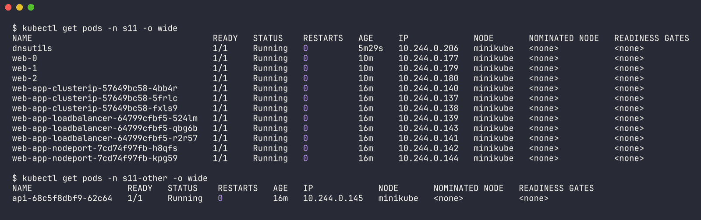

The `dnsutils` pod is my test client for everything - `curlimages/curl` has curl, busybox `nslookup` and `getent`. I first tried `nicolaka/netshoot` but on a shared cluster with lots of parallel pulls it just sat in `ContainerCreating`, so I switched to an image already cached on the node and set `imagePullPolicy: IfNotPresent`.

```
$ kubectl get svc -n s11 -o wide
NAME                       TYPE           CLUSTER-IP       EXTERNAL-IP   PORT(S)        AGE   SELECTOR
external-api-service       ExternalName   <none>           example.com   <none>         35m   <none>
web-service-clusterip      ClusterIP      10.102.27.133    <none>        8080/TCP       35m   app=web-clusterip
web-service-headless       ClusterIP      None             <none>        80/TCP         35m   app=web-headless
web-service-loadbalancer   LoadBalancer   10.106.211.24    <pending>     80:30981/TCP   35m   app=web-loadbalancer
web-service-nodeport       NodePort       10.100.143.134   <none>        80:30180/TCP   35m   app=web-nodeport
```

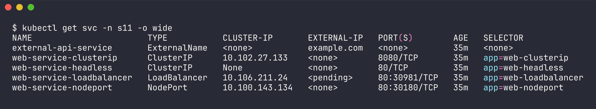

That one table already shows the differences: ExternalName has no ClusterIP at all, headless has `None`, NodePort/LoadBalancer add a `:3xxxx` node port, and LoadBalancer waits for an external IP. Full listing: [outputs/00-overview.txt](outputs/00-overview.txt).

### port vs targetPort vs nodePort

Quick reminder for myself because I kept mixing them up:

- `port` - the port on the Service's ClusterIP (what clients connect to). I used 8080 for the ClusterIP one on purpose so it's obviously different.
- `targetPort` - the containerPort on the pod (nginx = 80).
- `nodePort` - port opened on every node's IP, 30000-32767. Only for NodePort/LoadBalancer.

---

## Task 1 - The five Service types

### 1. ClusterIP (default) - [01-clusterip/](01-clusterip/)

Internal-only virtual IP. Only reachable from inside the cluster.

```yaml
spec:
  type: ClusterIP
  selector:
    app: web-clusterip
  ports:
    - name: http
      port: 8080
      targetPort: 80
```

```bash
kubectl get svc,endpoints -n s11 web-service-clusterip -o wide
kubectl describe svc web-service-clusterip -n s11
kubectl -n s11 exec dnsutils -- curl -s http://web-service-clusterip:8080
```

```
$ kubectl get svc,endpoints -n s11 web-service-clusterip -o wide
NAME                            TYPE        CLUSTER-IP      EXTERNAL-IP   PORT(S)    AGE   SELECTOR
service/web-service-clusterip   ClusterIP   10.102.27.133   <none>        8080/TCP   35m   app=web-clusterip

NAME                              ENDPOINTS                                         AGE
endpoints/web-service-clusterip   10.244.0.137:80,10.244.0.138:80,10.244.0.140:80   35m

$ kubectl describe svc web-service-clusterip -n s11
...
Type:                     ClusterIP
IP:                       10.102.27.133
Port:                     http  8080/TCP
TargetPort:               80/TCP
Endpoints:                10.244.0.137:80,10.244.0.138:80,10.244.0.140:80
Session Affinity:         None

$ kubectl -n s11 exec dnsutils -- curl -s -o /dev/null -w 'HTTP %{http_code}\n' http://web-service-clusterip:8080
HTTP 200

$ kubectl -n s11 exec dnsutils -- curl -s http://web-service-clusterip.s11.svc.cluster.local:8080 | grep -i title
<title>Welcome to nginx!</title>

$ kubectl -n s11 exec dnsutils -- nslookup web-service-clusterip.s11.svc.cluster.local
Server:		10.96.0.10
Name:	web-service-clusterip.s11.svc.cluster.local
Address: 10.102.27.133
```

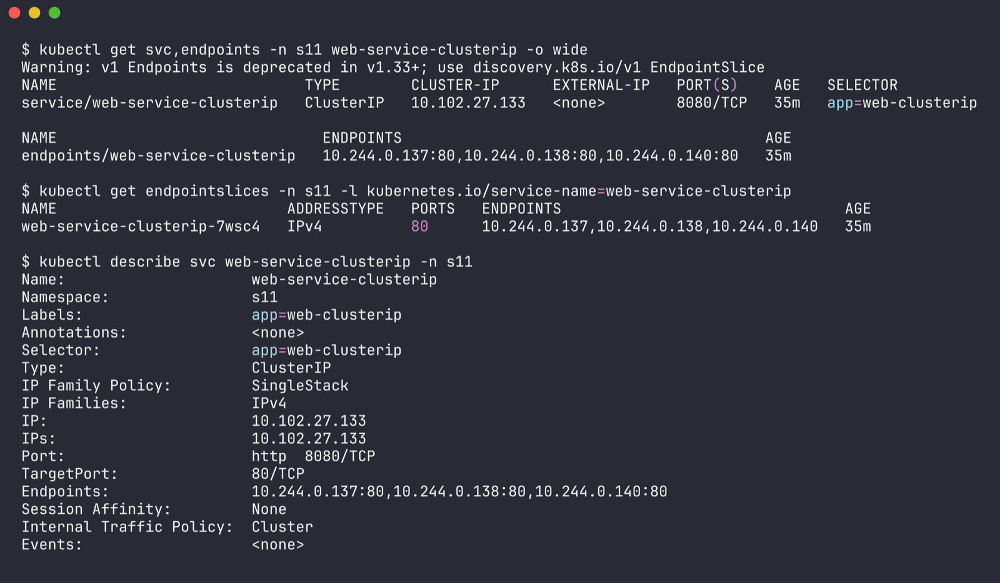

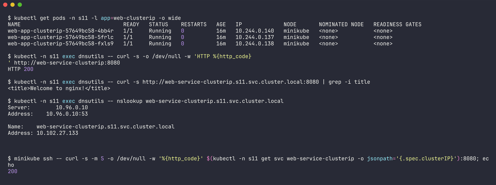

The three endpoint IPs are exactly the three pod IPs from `kubectl get pods -l app=web-clusterip -o wide`. Note `kubectl` now warns that v1 `Endpoints` is deprecated in favour of `EndpointSlice` - same data:

```
$ kubectl get endpointslices -n s11 -l kubernetes.io/service-name=web-service-clusterip
NAME                          ADDRESSTYPE   PORTS   ENDPOINTS                                AGE
web-service-clusterip-7wsc4   IPv4          80      10.244.0.137,10.244.0.138,10.244.0.140   35m
```

Load balancing check - fired 12 requests through the service, then counted `GET /` lines in each nginx pod's log (the totals include 3 earlier test requests, so 15):

```
pod/web-app-clusterip-57649bc58-4bb4r 5
pod/web-app-clusterip-57649bc58-5frlc 3
pod/web-app-clusterip-57649bc58-fxls9 7
```

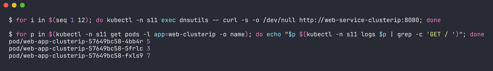

Spread across all three, not round-robin exactly - kube-proxy's iptables mode picks randomly (more on that in [comparison/](comparison/README.md#how-traffic-actually-reaches-a-pod)).

And from my Mac it's not reachable at all, which is the point of ClusterIP:

```
$ curl -s -m 5 http://10.102.27.133:8080 || echo 'curl failed (exit '$?')'
curl failed (exit 28)
```

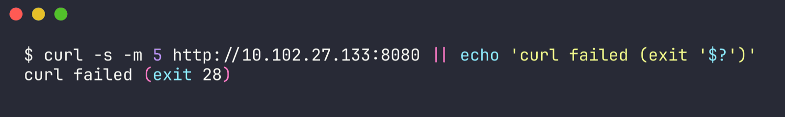

(From the minikube node itself it does work - `minikube ssh -- curl ... 10.102.27.133:8080` gave `200`, because the node has kube-proxy's iptables rules.) Full output: [outputs/01-clusterip.txt](outputs/01-clusterip.txt).

### 2. NodePort - [02-nodeport/](02-nodeport/)

Opens a fixed port (I picked 30180) on every node's IP, and forwards it to the service.

```yaml
spec:
  type: NodePort
  ports:
    - port: 80
      targetPort: 80
      nodePort: 30180
```

```
$ kubectl get svc,endpoints -n s11 web-service-nodeport -o wide
NAME                           TYPE       CLUSTER-IP       EXTERNAL-IP   PORT(S)        AGE   SELECTOR
service/web-service-nodeport   NodePort   10.100.143.134   <none>        80:30180/TCP   36m   app=web-nodeport

NAME                             ENDPOINTS                         AGE
endpoints/web-service-nodeport   10.244.0.142:80,10.244.0.144:80   36m

$ kubectl describe svc web-service-nodeport -n s11
...
Type:                     NodePort
IP:                       10.100.143.134
Port:                     http  80/TCP
TargetPort:               80/TCP
NodePort:                 http  30180/TCP
Endpoints:                10.244.0.142:80,10.244.0.144:80
External Traffic Policy:  Cluster
```

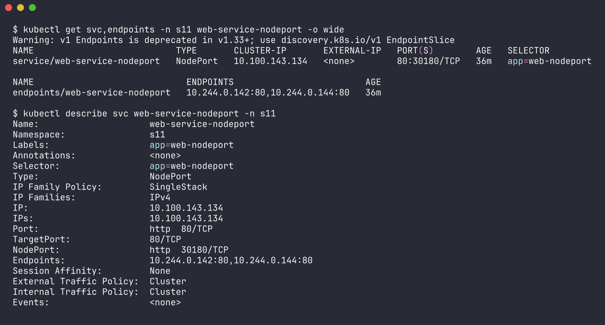

Testing it. On macOS with the docker driver, the node IP (`192.168.49.2`) lives inside Docker Desktop's VM network so my Mac can't hit it directly - so I tested from the node and from a pod:

```
$ minikube ip
192.168.49.2

$ minikube ssh -- curl -s -o /dev/null -w '%{http_code}' http://192.168.49.2:30180
200

$ minikube ssh -- curl -s http://192.168.49.2:30180 | grep -i title
<title>Welcome to nginx!</title>

$ kubectl -n s11 exec dnsutils -- curl -s -o /dev/null -w '%{http_code}' http://192.168.49.2:30180
200

$ curl -s -m 5 http://192.168.49.2:30180 || echo 'curl failed (exit '$?')'     # from the Mac
curl failed (exit 28)
```

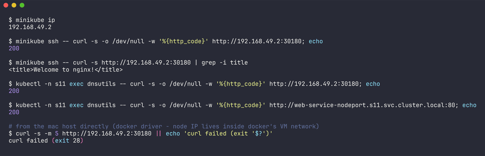

A NodePort service still gets a ClusterIP too, so `web-service-nodeport.s11.svc.cluster.local:80` also returned 200 from inside. On a real Linux box / VM driver the `nodeIP:30180` would work straight from the host.

> TODO (run on your machine): `minikube service web-service-nodeport -n s11 --url` opens a tunnel from the Mac to the node port, if you want to see it in a browser.

Full output: [outputs/02-nodeport.txt](outputs/02-nodeport.txt).

### 3. LoadBalancer - [03-loadbalancer/](03-loadbalancer/)

On a cloud (EKS/GKE/AKS) this makes the cloud controller provision a real load balancer with a public IP. Minikube has no cloud controller, so:

```
$ kubectl get svc,endpoints -n s11 web-service-loadbalancer -o wide
NAME                               TYPE           CLUSTER-IP      EXTERNAL-IP   PORT(S)        AGE   SELECTOR
service/web-service-loadbalancer   LoadBalancer   10.106.211.24   <pending>     80:30981/TCP   36m   app=web-loadbalancer

NAME                                 ENDPOINTS                                         AGE
endpoints/web-service-loadbalancer   10.244.0.139:80,10.244.0.141:80,10.244.0.143:80   36m

$ kubectl get svc web-service-loadbalancer -n s11 -o jsonpath='{.status}'
{"loadBalancer":{}}
```

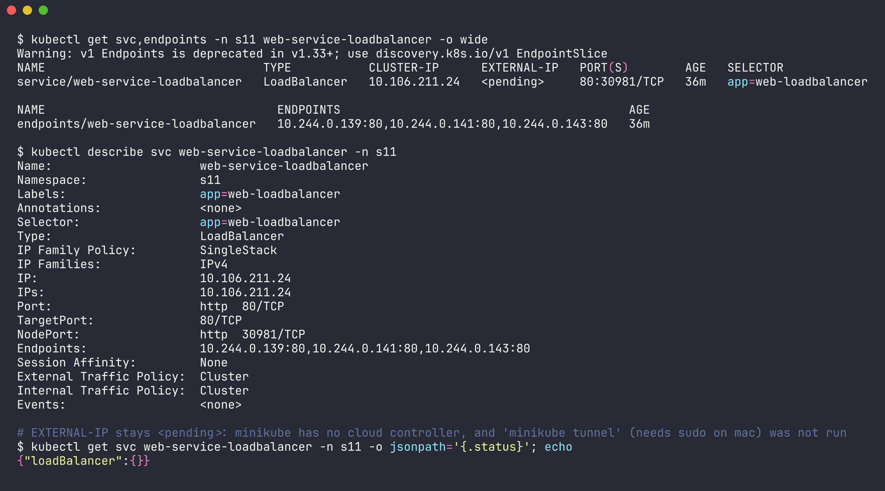

`EXTERNAL-IP` sits at `<pending>` forever and `.status.loadBalancer` is empty - nothing is there to fill it in. But notice it also got a NodePort (30981, auto-assigned) and a ClusterIP. A LoadBalancer service is literally ClusterIP + NodePort + "please ask the cloud for an LB pointing at that NodePort". So the lower layers work:

```
$ minikube ssh -- curl -s -o /dev/null -w '%{http_code}' http://192.168.49.2:30981
200

$ kubectl -n s11 exec dnsutils -- curl -s -o /dev/null -w '%{http_code}' http://10.106.211.24:80
200

$ kubectl -n s11 exec dnsutils -- curl -s http://web-service-loadbalancer | grep -i title
<title>Welcome to nginx!</title>
```

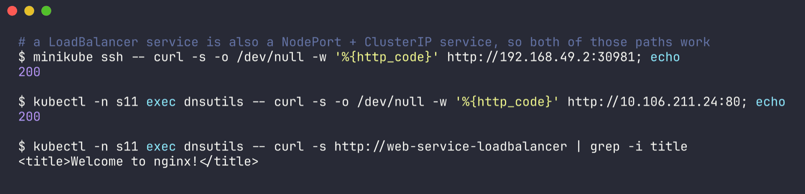

> TODO (run on your machine): in a second terminal run `minikube tunnel` (asks for sudo on macOS, so I didn't run it here). It acts as the "cloud controller" and the service gets an `EXTERNAL-IP` (127.0.0.1 on the docker driver). Then `kubectl get svc -n s11 web-service-loadbalancer` shows the IP and `curl http://127.0.0.1` returns the nginx page.

Full output: [outputs/03-loadbalancer.txt](outputs/03-loadbalancer.txt).

### 4. ExternalName - [04-externalname/](04-externalname/)

No selector, no pods, no ClusterIP, no endpoints. It's purely a DNS alias - CoreDNS answers with a CNAME to whatever `externalName` says. Useful for pointing an in-cluster name at an RDS endpoint or third-party API so apps don't hardcode it.

```yaml
spec:
  type: ExternalName
  externalName: example.com
```

```
$ kubectl get svc,endpoints -n s11 external-api-service -o wide
NAME                   TYPE           CLUSTER-IP   EXTERNAL-IP   PORT(S)   AGE   SELECTOR
external-api-service   ExternalName   <none>       example.com   <none>    36m   <none>
Error from server (NotFound): endpoints "external-api-service" not found

$ kubectl describe svc external-api-service -n s11
Type:              ExternalName
IP:
External Name:     example.com

$ kubectl -n s11 exec dnsutils -- nslookup -type=CNAME external-api-service.s11.svc.cluster.local
Server:		10.96.0.10
Address:	10.96.0.10:53

external-api-service.s11.svc.cluster.local	canonical name = example.com

$ kubectl -n s11 exec dnsutils -- nslookup external-api-service.s11.svc.cluster.local
external-api-service.s11.svc.cluster.local	canonical name = example.com
Name:	example.com
Address: 104.20.23.154
Name:	example.com
Address: 172.66.147.243
```

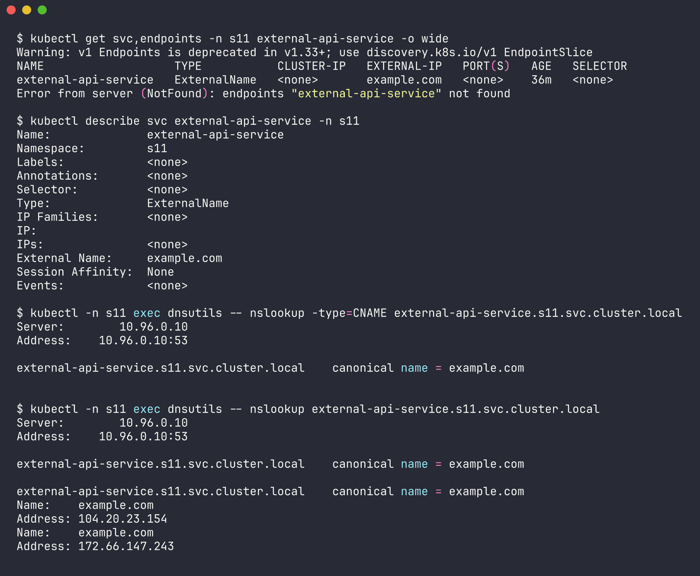

The `endpoints ... not found` error is expected - there are no endpoints to have. The CNAME is the whole service.

```
$ kubectl -n s11 exec dnsutils -- curl -s -m 10 -o /dev/null -w '%{http_code}' -H 'Host: example.com' http://external-api-service
200
```

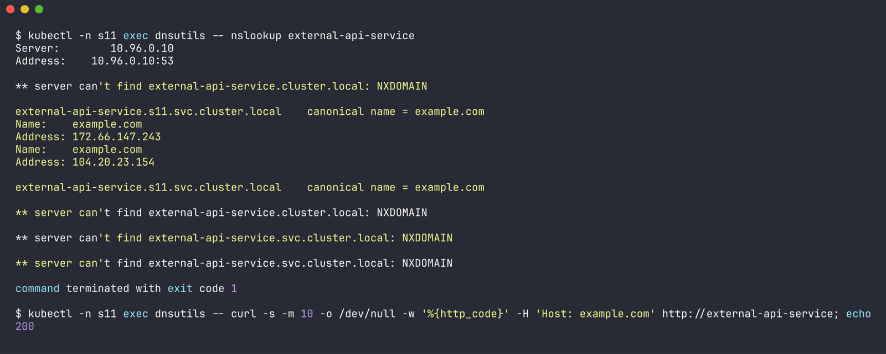

I had to pass `-H 'Host: example.com'` - otherwise curl sends `Host: external-api-service` and a real website/CDN doesn't recognise it. That's the classic ExternalName gotcha: it only rewrites DNS, not HTTP Host headers or TLS SNI, so it works best for things like databases, not HTTPS sites. Full output: [outputs/04-externalname.txt](outputs/04-externalname.txt).

### 5. Headless (with a StatefulSet) - [05-headless/](05-headless/)

`clusterIP: None` means no virtual IP and no kube-proxy load balancing. DNS returns the pod IPs directly, and with a StatefulSet each pod also gets its own stable DNS name. This is how databases do leader/replica discovery (`mysql-0` is the primary, etc).

```yaml
# service
spec:
  clusterIP: None
  selector:
    app: web-headless
---
# statefulset
spec:
  serviceName: web-service-headless   # this links the pods to the headless service's DNS
  replicas: 3
```

```
$ kubectl get pods -n s11 -l app=web-headless -o wide
NAME    READY   STATUS    RESTARTS   AGE   IP             NODE
web-0   1/1     Running   0          11m   10.244.0.177   minikube
web-1   1/1     Running   0          11m   10.244.0.179   minikube
web-2   1/1     Running   0          11m   10.244.0.180   minikube

$ kubectl get svc,endpoints -n s11 web-service-headless -o wide
NAME                           TYPE        CLUSTER-IP   EXTERNAL-IP   PORT(S)   AGE   SELECTOR
service/web-service-headless   ClusterIP   None         <none>        80/TCP    36m   app=web-headless

NAME                             ENDPOINTS                                         AGE
endpoints/web-service-headless   10.244.0.177:80,10.244.0.179:80,10.244.0.180:80   36m
```

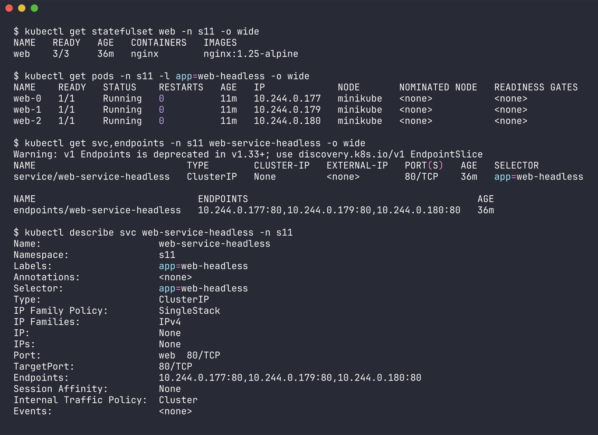

The service name resolves to **all three pod IPs**, versus the ClusterIP service which gives back one virtual IP:

```
$ kubectl -n s11 exec dnsutils -- nslookup web-service-headless.s11.svc.cluster.local
Server:		10.96.0.10
Name:	web-service-headless.s11.svc.cluster.local
Address: 10.244.0.179
Name:	web-service-headless.s11.svc.cluster.local
Address: 10.244.0.177
Name:	web-service-headless.s11.svc.cluster.local
Address: 10.244.0.180

$ kubectl -n s11 exec dnsutils -- nslookup web-service-clusterip.s11.svc.cluster.local
Name:	web-service-clusterip.s11.svc.cluster.local
Address: 10.102.27.133
```

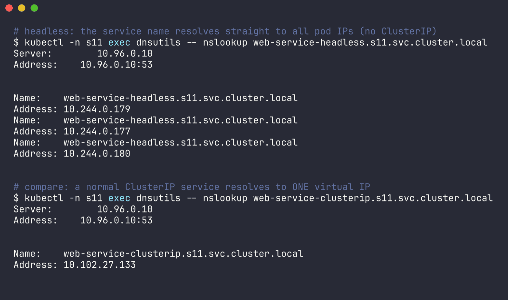

Per-pod DNS names, format `<pod>.<service>.<ns>.svc.cluster.local`:

```
$ kubectl -n s11 exec dnsutils -- nslookup web-0.web-service-headless.s11.svc.cluster.local
Name:	web-0.web-service-headless.s11.svc.cluster.local
Address: 10.244.0.177

$ kubectl -n s11 exec dnsutils -- nslookup web-1.web-service-headless.s11.svc.cluster.local
Name:	web-1.web-service-headless.s11.svc.cluster.local
Address: 10.244.0.179

$ kubectl -n s11 exec dnsutils -- nslookup web-2.web-service-headless.s11.svc.cluster.local
Name:	web-2.web-service-headless.s11.svc.cluster.local
Address: 10.244.0.180

$ kubectl exec -n s11 web-0 -- hostname -f
web-0.web-service-headless.s11.svc.cluster.local
```

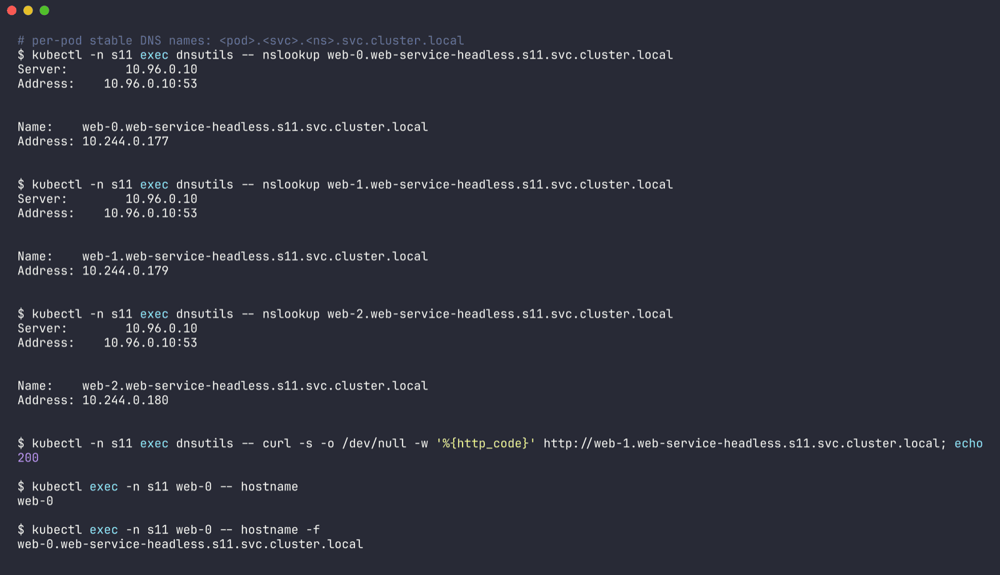

Then the interesting part - deleted `web-1`:

```
$ kubectl delete pod web-1 -n s11
pod "web-1" deleted from s11 namespace

$ kubectl get pods -n s11 -l app=web-headless -o wide
NAME    READY   STATUS    RESTARTS   AGE   IP             NODE
web-0   1/1     Running   0          11m   10.244.0.177   minikube
web-1   1/1     Running   0          1s    10.244.0.242   minikube
web-2   1/1     Running   0          11m   10.244.0.180   minikube

$ kubectl -n s11 exec dnsutils -- nslookup web-1.web-service-headless.s11.svc.cluster.local
Name:	web-1.web-service-headless.s11.svc.cluster.local
Address: 10.244.0.242
```

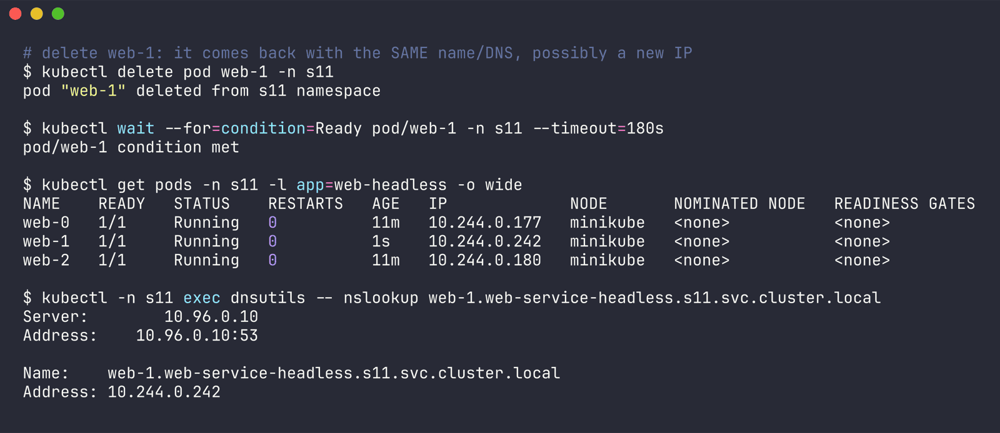

It came back with the **same name** `web-1` but a **new IP** (.179 -> .242), and the DNS record followed it. So anything that addresses `web-1.web-service-headless` keeps working - the stable identity is the name, not the IP. Full output: [outputs/05-headless.txt](outputs/05-headless.txt).

### Summary table

| Type | ClusterIP | Reachable from | DNS answer | When I'd use it |
|---|---|---|---|---|
| ClusterIP | yes | inside cluster only | one virtual IP | backend APIs, DBs, anything internal |
| NodePort | yes | + `<nodeIP>:30000-32767` | one virtual IP | dev/testing, bare-metal, behind your own LB |
| LoadBalancer | yes | + cloud LB external IP (`<pending>` here) | one virtual IP | exposing a service publicly on a cloud |
| ExternalName | no | n/a (DNS only) | CNAME to external host | alias for an external DB/API |
| Headless | `None` | inside cluster, straight to pods | every pod IP + per-pod names | StatefulSets, client-side LB, peer discovery |

---

## Tasks 2-4

- [comparison/README.md](comparison/README.md) - Deployment vs ReplicaSet, Deployment vs DaemonSet vs StatefulSet, ReplicaSet vs Service (with the real iptables chain for my ClusterIP)
- [fqdn/README.md](fqdn/README.md) - FQDNs, service + pod DNS, cross-namespace lookups between `s11` and `s11-other`, resolv.conf
- [coredns/README.md](coredns/README.md) - CoreDNS, the Corefile plugin by plugin, ndots seen in the actual query log, troubleshooting steps

## Cleanup

```bash
kubectl delete namespace s11 s11-other
```

Deleting the namespaces takes everything in them with it (deployments, statefulset, services, client pod).

## What I took away

- A Service is basically a label query + a stable IP/name. If the selector matches nothing, the service still exists and DNS still resolves, it just has no endpoints - most "service not working" problems are that.
- LoadBalancer and NodePort are built on top of ClusterIP, they don't replace it. Seeing `80:30981/TCP` on a LoadBalancer service made that click.
- ExternalName and headless are the odd ones out - neither gets a virtual IP and neither goes through kube-proxy. They're pure DNS tricks.
- StatefulSet + headless gives pods identities that survive restarts. The IP still changes, the name doesn't.
