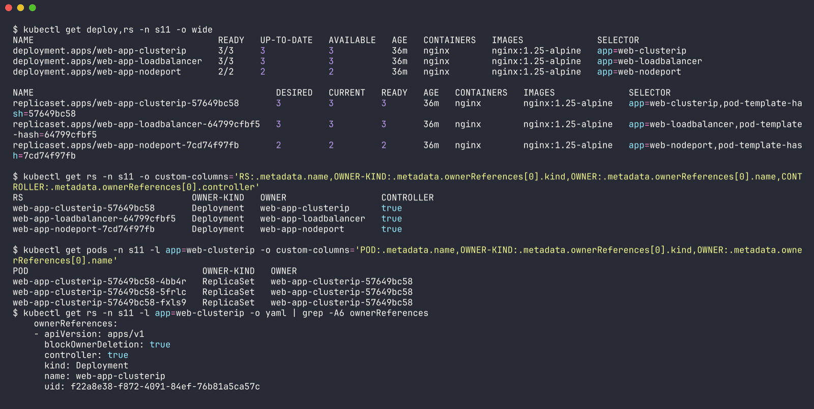
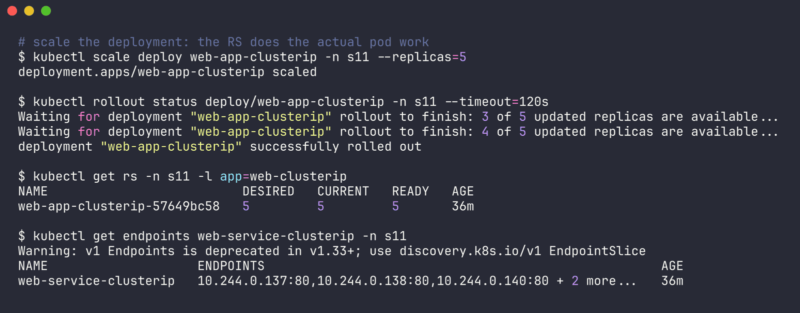
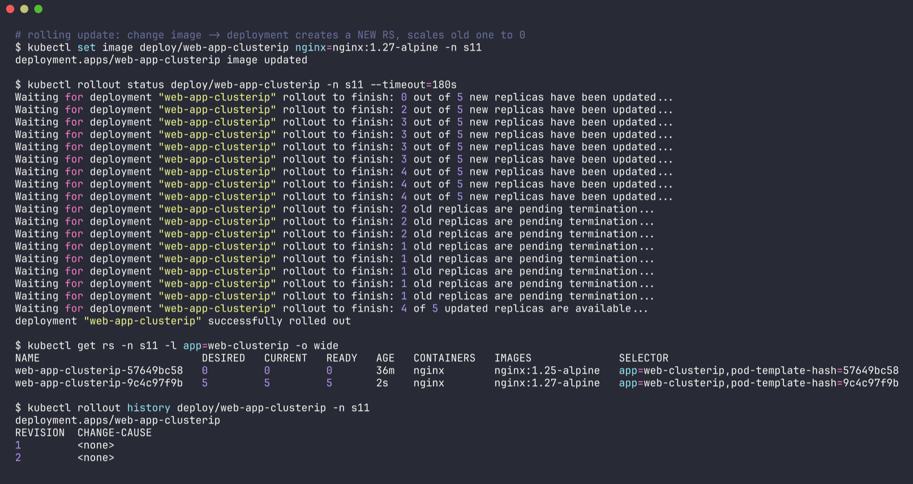
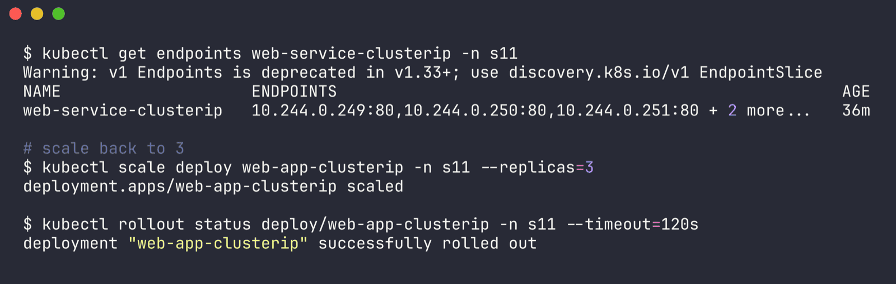
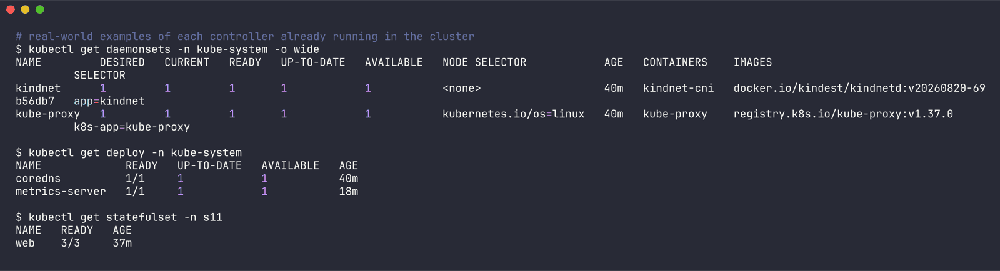
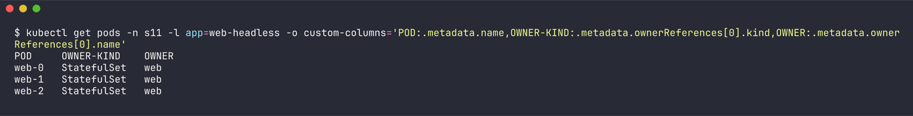
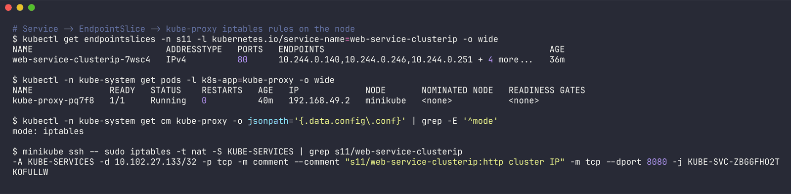
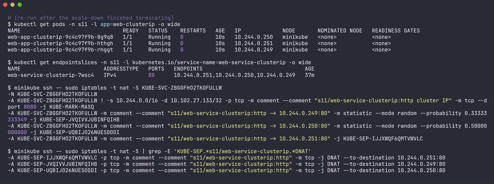
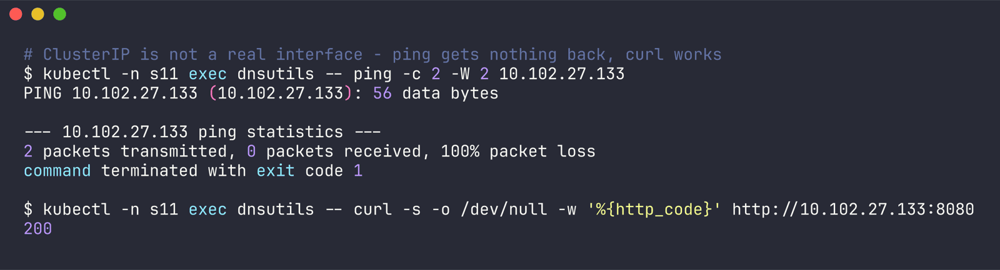

# Session 11 - Task 2: Controller and Service Comparisons

Name: Ridaa Mirza
Enrollment No: 24BCS10394

Three comparisons. Where possible I backed the theory with what was actually running in my `s11` namespace (the deployments and statefulset from Task 1). Raw output: [../outputs/task2-comparison.txt](../outputs/task2-comparison.txt).

## Part A - Deployment vs ReplicaSet

### The relationship, from the cluster itself

Every Deployment creates a ReplicaSet, and the ReplicaSet creates the pods. You can see the chain through `ownerReferences`:

```
$ kubectl get deploy,rs -n s11 -o wide
NAME                                   READY   UP-TO-DATE   AVAILABLE   AGE   CONTAINERS   IMAGES              SELECTOR
deployment.apps/web-app-clusterip      3/3     3            3           36m   nginx        nginx:1.25-alpine   app=web-clusterip
deployment.apps/web-app-loadbalancer   3/3     3            3           36m   nginx        nginx:1.25-alpine   app=web-loadbalancer
deployment.apps/web-app-nodeport       2/2     2            2           36m   nginx        nginx:1.25-alpine   app=web-nodeport

NAME                                              DESIRED   CURRENT   READY   AGE   CONTAINERS   IMAGES              SELECTOR
replicaset.apps/web-app-clusterip-57649bc58       3         3         3       36m   nginx        nginx:1.25-alpine   app=web-clusterip,pod-template-hash=57649bc58
replicaset.apps/web-app-loadbalancer-64799cfbf5   3         3         3       36m   nginx        nginx:1.25-alpine   app=web-loadbalancer,pod-template-hash=64799cfbf5
replicaset.apps/web-app-nodeport-7cd74f97fb       2         2         2       36m   nginx        nginx:1.25-alpine   app=web-nodeport,pod-template-hash=7cd74f97fb

$ kubectl get rs -n s11 -o custom-columns='RS:.metadata.name,OWNER-KIND:.metadata.ownerReferences[0].kind,OWNER:.metadata.ownerReferences[0].name,CONTROLLER:.metadata.ownerReferences[0].controller'
RS                                OWNER-KIND   OWNER                  CONTROLLER
web-app-clusterip-57649bc58       Deployment   web-app-clusterip      true
web-app-loadbalancer-64799cfbf5   Deployment   web-app-loadbalancer   true
web-app-nodeport-7cd74f97fb       Deployment   web-app-nodeport       true

$ kubectl get pods -n s11 -l app=web-clusterip -o custom-columns='POD:.metadata.name,OWNER-KIND:.metadata.ownerReferences[0].kind,OWNER:.metadata.ownerReferences[0].name'
POD                                 OWNER-KIND   OWNER
web-app-clusterip-57649bc58-4bb4r   ReplicaSet   web-app-clusterip-57649bc58
web-app-clusterip-57649bc58-5frlc   ReplicaSet   web-app-clusterip-57649bc58
web-app-clusterip-57649bc58-fxls9   ReplicaSet   web-app-clusterip-57649bc58

$ kubectl get rs -n s11 -l app=web-clusterip -o yaml | grep -A6 ownerReferences
    ownerReferences:
    - apiVersion: apps/v1
      blockOwnerDeletion: true
      controller: true
      kind: Deployment
      name: web-app-clusterip
      uid: f22a8e38-f872-4091-84ef-76b81a5ca57c
```



So it's `Deployment -> ReplicaSet -> Pod`. The naming gives it away too: pod name = RS name + random suffix, RS name = deployment name + `pod-template-hash`. That hash is also added as a label to the RS selector so two ReplicaSets of the same deployment never fight over each other's pods.

### Scaling - deployment changes the number, RS does the work

```
$ kubectl scale deploy web-app-clusterip -n s11 --replicas=5
deployment.apps/web-app-clusterip scaled

$ kubectl get rs -n s11 -l app=web-clusterip
NAME                          DESIRED   CURRENT   READY   AGE
web-app-clusterip-57649bc58   5         5         5       36m
```



Same RS, desired went 3 -> 5. No new ReplicaSet for a pure scale.

### Rolling update - this is where they differ

```
$ kubectl set image deploy/web-app-clusterip nginx=nginx:1.27-alpine -n s11
deployment.apps/web-app-clusterip image updated

$ kubectl rollout status deploy/web-app-clusterip -n s11 --timeout=180s
Waiting for deployment "web-app-clusterip" rollout to finish: 0 out of 5 new replicas have been updated...
Waiting for deployment "web-app-clusterip" rollout to finish: 2 out of 5 new replicas have been updated...
...
Waiting for deployment "web-app-clusterip" rollout to finish: 2 old replicas are pending termination...
Waiting for deployment "web-app-clusterip" rollout to finish: 1 old replicas are pending termination...
deployment "web-app-clusterip" successfully rolled out

$ kubectl get rs -n s11 -l app=web-clusterip -o wide
NAME                          DESIRED   CURRENT   READY   AGE   CONTAINERS   IMAGES              SELECTOR
web-app-clusterip-57649bc58   0         0         0       36m   nginx        nginx:1.25-alpine   app=web-clusterip,pod-template-hash=57649bc58
web-app-clusterip-9c4c97f9b   5         5         5       2s    nginx        nginx:1.27-alpine   app=web-clusterip,pod-template-hash=9c4c97f9b

$ kubectl rollout history deploy/web-app-clusterip -n s11
REVISION  CHANGE-CAUSE
1         <none>
2         <none>
```



The deployment made a **second** ReplicaSet with the new template, scaled it up while scaling the old one down, and kept the old RS around at 0 replicas. That kept-around RS is what `kubectl rollout undo` scales back up. A bare ReplicaSet can't do any of this - if you edit its pod template, existing pods are left alone; only newly created pods pick up the change.

The Service didn't care at all - its endpoints just switched to the new pod IPs because they carry the same `app=web-clusterip` label:

```
$ kubectl get endpoints web-service-clusterip -n s11
NAME                    ENDPOINTS                                                     AGE
web-service-clusterip   10.244.0.249:80,10.244.0.250:80,10.244.0.251:80 + 2 more...   36m
```



(Scaled it back to 3 afterwards.)

### Comparison

| | ReplicaSet | Deployment |
|---|---|---|
| Purpose | keep N identical pods running | manage an app's rollout lifecycle on top of ReplicaSets |
| Pod management | directly creates/deletes pods to match `replicas` | never touches pods directly - manages ReplicaSets, which manage pods |
| Scaling | `replicas` field, yes | yes, passes the number down to the current RS |
| Rolling updates | no - template edits only affect pods created later | yes - new RS per template change, `maxSurge`/`maxUnavailable`, pause/resume |
| Rollback | no | yes, `kubectl rollout undo` (old RS kept, `revisionHistoryLimit` default 10) |
| Relationship | owned by a Deployment (ownerReferences) | owns 1..n ReplicaSets |
| Use directly? | almost never | yes, the normal way to run stateless apps |

---

## Part B - Deployment vs DaemonSet vs StatefulSet

Real examples already on my cluster: CoreDNS is a Deployment, kube-proxy is a DaemonSet (one per node), and my `web` from Task 1 is a StatefulSet.

```
$ kubectl get daemonsets -n kube-system -o wide
NAME         DESIRED   CURRENT   READY   UP-TO-DATE   AVAILABLE   NODE SELECTOR            AGE   CONTAINERS    IMAGES                                          SELECTOR
kindnet      1         1         1       1            1           <none>                   40m   kindnet-cni   docker.io/kindest/kindnetd:v20260820-69b56db7   app=kindnet
kube-proxy   1         1         1       1            1           kubernetes.io/os=linux   40m   kube-proxy    registry.k8s.io/kube-proxy:v1.37.0              k8s-app=kube-proxy

$ kubectl get deploy -n kube-system
NAME             READY   UP-TO-DATE   AVAILABLE   AGE
coredns          1/1     1            1           40m
metrics-server   1/1     1            1           18m

$ kubectl get statefulset -n s11
NAME   READY   AGE
web    3/3     37m
```



DESIRED is 1 for the DaemonSets because minikube has one node - add a node and they'd go to 2 on their own, no `replicas` field involved.

StatefulSet pods have predictable names and are owned directly by the StatefulSet, no ReplicaSet in between:

```
$ kubectl get pods -n s11 -l app=web-headless -o custom-columns='POD:.metadata.name,OWNER-KIND:.metadata.ownerReferences[0].kind,OWNER:.metadata.ownerReferences[0].name'
POD     OWNER-KIND    OWNER
web-0   StatefulSet   web
web-1   StatefulSet   web
web-2   StatefulSet   web
```



| | Deployment | DaemonSet | StatefulSet |
|---|---|---|---|
| Use case | stateless apps: web servers, APIs, workers | one agent per node: log shippers, monitoring, CNI, kube-proxy | stateful apps: databases, Kafka, ZooKeeper, Elasticsearch |
| Pod creation | via ReplicaSet, all at once, random names (`web-app-...-4bb4r`) | one pod per (matching) node, created when a node joins | one at a time in order 0,1,2..., each waits for the previous to be Ready |
| Pod identity | interchangeable, new name every restart | tied to a node | stable ordinal name (`web-1` stays `web-1` after restart) |
| Scaling | `replicas`, any order | not by replicas - scales with node count (nodeSelector/affinity/tolerations) | `replicas`, scale-down removes highest ordinal first |
| Updates | RollingUpdate / Recreate | RollingUpdate / OnDelete, node by node | RollingUpdate in reverse ordinal order, `partition` for canaries, or OnDelete |
| Networking | behind a normal ClusterIP service, any pod can answer | often `hostNetwork`/`hostPort`, or a service; reached per node | needs a headless service (`serviceName`) - gives each pod `web-0.svc.ns.svc.cluster.local` |
| Storage | usually none, or one shared PVC | usually hostPath (node's logs, `/var/run`) | `volumeClaimTemplates` - each pod gets its own PVC that follows it across restarts |
| Examples | nginx frontend, CoreDNS, my `web-app-clusterip` | kube-proxy, kindnet, Fluent Bit, node-exporter, Datadog agent | MySQL/Postgres replicas, Kafka, my `web` StatefulSet |

What I actually saw in Task 1 that matches the table: deleting `web-1` brought back a pod still named `web-1`, with a new IP but the same DNS name. Deleting a Deployment pod would just give a new random name.

---

## Part C - ReplicaSet vs Service

These don't overlap at all, which confused me at first because both use a label selector.

| | ReplicaSet | Service |
|---|---|---|
| Job | **how many** pods exist - creates/replaces them | **how to reach** those pods - stable IP + DNS name + load balancing |
| Selector used for | counting which pods it owns | building the endpoint list |
| Creates pods? | yes | never |
| Stable address? | no - pods get new IPs | yes - ClusterIP and DNS name don't change for the life of the service |
| Load balancing | no | yes (kube-proxy) |
| Cares about readiness? | only to report READY count | yes - unready pods are removed from endpoints |

### Why a Service is needed

The ReplicaSet keeps 3 pods alive, but every replacement pod comes with a new IP. During the rolling update above, all 5 pod IPs changed (`.137/.138/.140...` -> `.249/.250/.251...`). Any client holding a pod IP would have broken. The service IP `10.102.27.133` and name `web-service-clusterip` stayed the same the whole time.

### How traffic actually reaches a pod

```
client pod
   |  DNS: web-service-clusterip.s11.svc.cluster.local -> 10.102.27.133   (CoreDNS)
   v
10.102.27.133:8080   (ClusterIP - a virtual IP, nothing actually listens on it)
   |  iptables nat rules on the node, written by kube-proxy
   v
KUBE-SERVICES -> KUBE-SVC-xxxx -> random pick -> KUBE-SEP-yyyy -> DNAT to podIP:80
   ^
   |  kube-proxy watches EndpointSlices
EndpointSlice  <- EndpointSlice controller watches pods matching the selector (+ readiness)
```

Here's that chain for real, for my ClusterIP service with 3 pods:

```
$ kubectl get endpointslices -n s11 -l kubernetes.io/service-name=web-service-clusterip -o wide
NAME                          ADDRESSTYPE   PORTS   ENDPOINTS                                AGE
web-service-clusterip-7wsc4   IPv4          80      10.244.0.251,10.244.0.250,10.244.0.249   37m

$ kubectl -n kube-system get cm kube-proxy -o jsonpath='{.data.config\.conf}' | grep -E '^mode'
mode: iptables

$ minikube ssh -- sudo iptables -t nat -S KUBE-SERVICES | grep s11/web-service-clusterip
-A KUBE-SERVICES -d 10.102.27.133/32 -p tcp -m comment --comment "s11/web-service-clusterip:http cluster IP" -m tcp --dport 8080 -j KUBE-SVC-ZBGGFHO2TKOFULLW

$ minikube ssh -- sudo iptables -t nat -S KUBE-SVC-ZBGGFHO2TKOFULLW
-N KUBE-SVC-ZBGGFHO2TKOFULLW
-A KUBE-SVC-ZBGGFHO2TKOFULLW ! -s 10.244.0.0/16 -d 10.102.27.133/32 -p tcp -m comment --comment "s11/web-service-clusterip:http cluster IP" -m tcp --dport 8080 -j KUBE-MARK-MASQ
-A KUBE-SVC-ZBGGFHO2TKOFULLW -m comment --comment "s11/web-service-clusterip:http -> 10.244.0.249:80" -m statistic --mode random --probability 0.33333333349 -j KUBE-SEP-JVQIVVJUBINFQIHB
-A KUBE-SVC-ZBGGFHO2TKOFULLW -m comment --comment "s11/web-service-clusterip:http -> 10.244.0.250:80" -m statistic --mode random --probability 0.50000000000 -j KUBE-SEP-UQBIJO26NUESDDDI
-A KUBE-SVC-ZBGGFHO2TKOFULLW -m comment --comment "s11/web-service-clusterip:http -> 10.244.0.251:80" -j KUBE-SEP-IJJXWQF6QMTVWVLC

$ minikube ssh -- sudo iptables -t nat -S | grep -E 'KUBE-SEP.*s11/web-service-clusterip.*DNAT'
-A KUBE-SEP-IJJXWQF6QMTVWVLC -p tcp -m comment --comment "s11/web-service-clusterip:http" -m tcp -j DNAT --to-destination 10.244.0.251:80
-A KUBE-SEP-JVQIVVJUBINFQIHB -p tcp -m comment --comment "s11/web-service-clusterip:http" -m tcp -j DNAT --to-destination 10.244.0.249:80
-A KUBE-SEP-UQBIJO26NUESDDDI -p tcp -m comment --comment "s11/web-service-clusterip:http" -m tcp -j DNAT --to-destination 10.244.0.250:80
```





Things I noticed reading these:

- The probabilities are 1/3, then 1/2 of the rest, then "everything left" - that works out to an equal 1/3 chance per pod. That's why my load-balancing test in Task 1 gave 5/3/7 rather than a perfect 5/5/5 - it's random, not round-robin.
- `targetPort: 80` shows up as the DNAT destination port, while `port: 8080` is only on the ClusterIP match.
- `KUBE-MARK-MASQ` for traffic coming from outside the pod CIDR (e.g. from the node) so the reply comes back the same way.
- The ClusterIP never appears on any interface. It only exists as an iptables match for TCP port 8080, so ICMP has nothing to hit - checked it:

```
$ kubectl -n s11 exec dnsutils -- ping -c 2 -W 2 10.102.27.133
PING 10.102.27.133 (10.102.27.133): 56 data bytes

--- 10.102.27.133 ping statistics ---
2 packets transmitted, 0 packets received, 100% packet loss

$ kubectl -n s11 exec dnsutils -- curl -s -o /dev/null -w '%{http_code}' http://10.102.27.133:8080
200
```



- The DNAT targets are exactly the IPs in the EndpointSlice. When the rollout changed the pods, kube-proxy rewrote these chains.
