# Session 11 - Task 4: CoreDNS

Name: Ridaa Mirza
Enrollment No: 24BCS10394

Raw output for everything here: [../outputs/task4-coredns.txt](../outputs/task4-coredns.txt). The only thing I created for this task is [broken-selector-svc.yaml](broken-selector-svc.yaml) (troubleshooting demo, deleted afterwards). I only *read* kube-system - didn't change the CoreDNS config since the cluster is shared.

## What is CoreDNS

CoreDNS is a DNS server written in Go, made of plugins chained together. It's the default cluster DNS in Kubernetes since v1.13 (it replaced kube-dns, which is why the Service and labels are still called `kube-dns`). It runs as a normal Deployment in `kube-system`, behind a ClusterIP service:

```
$ kubectl -n kube-system get deploy coredns -o wide
NAME      READY   UP-TO-DATE   AVAILABLE   AGE   CONTAINERS   IMAGES                                    SELECTOR
coredns   1/1     1            1           41m   coredns      registry.k8s.io/coredns/coredns:v1.14.6   k8s-app=kube-dns

$ kubectl -n kube-system get pods -l k8s-app=kube-dns -o wide
NAME                       READY   STATUS    RESTARTS   AGE   IP           NODE       NOMINATED NODE   READINESS GATES
coredns-559f6c778d-hkp62   1/1     Running   0          41m   10.244.0.2   minikube   <none>           <none>

$ kubectl -n kube-system get svc kube-dns -o wide
NAME       TYPE        CLUSTER-IP   EXTERNAL-IP   PORT(S)                  AGE   SELECTOR
kube-dns   ClusterIP   10.96.0.10   <none>        53/UDP,53/TCP,9153/TCP   41m   k8s-app=kube-dns
```

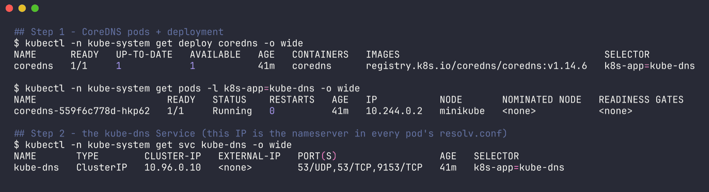

`10.96.0.10` is the `nameserver` in every pod's resolv.conf. (Minikube runs 1 replica; real clusters usually run 2+.)

## Why Kubernetes uses it

- **Service discovery by name** - pods and services come and go with new IPs, so apps need names. CoreDNS's `kubernetes` plugin watches the API server (Services, EndpointSlices, Pods) and answers from that in-memory view, so records update within seconds of a change. I saw that in Task 1 - `web-1` got a new IP and its DNS name followed straight away.
- **It's just DNS** - apps don't need any Kubernetes client library, a normal `gethostbyname()` works.
- **Pluggable** - caching, forwarding to upstream, metrics, health checks, rewrites, stub domains are all plugins in one config file.
- **Lightweight and runs as a regular workload** - scale it like any Deployment.

## Service discovery - what it serves

From the Task 1/3 tests, CoreDNS gave back:

| Query | Answer |
|---|---|
| `web-service-clusterip.s11.svc.cluster.local` | A `10.102.27.133` (ClusterIP) |
| `web-service-headless.s11.svc.cluster.local` | A x3 - every pod IP |
| `web-0.web-service-headless.s11.svc.cluster.local` | A `10.244.0.177` (one pod) |
| `external-api-service.s11.svc.cluster.local` | CNAME `example.com` |
| `_http._tcp.web-service-clusterip.s11.svc.cluster.local` | SRV `0 100 8080 ...` |
| `10-244-0-206.s11.pod.cluster.local` | A `10.244.0.206` |
| `example.com` | forwarded upstream -> `104.20.23.154`, `172.66.147.243` |

## How a query is resolved

```
app calls getaddrinfo("example.com")
   |
   |  /etc/resolv.conf:
   |    search s11.svc.cluster.local svc.cluster.local cluster.local
   |    nameserver 10.96.0.10
   |    options ndots:5
   |
   |  "example.com" has 1 dot, 1 < 5  -> try search suffixes FIRST
   v
1. example.com.s11.svc.cluster.local.   -> CoreDNS kubernetes plugin -> NXDOMAIN
2. example.com.svc.cluster.local.       -> NXDOMAIN
3. example.com.cluster.local.           -> NXDOMAIN
4. example.com.                         -> not cluster.local -> forward plugin -> upstream -> answer
```

### ndots:5, seen in the actual CoreDNS log

This cluster's Corefile has the `log` plugin on, so every query is logged. I did a lookup from `dnsutils` (pod IP 10.244.0.206) and grepped the CoreDNS log for that IP:

```
$ kubectl -n s11 exec dnsutils -- getent hosts example.com
104.20.23.154     example.com  example.com

$ kubectl -n kube-system logs -l k8s-app=kube-dns --tail=400 | grep '10.244.0.206:' | grep 'example.com' | grep -v 'external-api' | tail -8
[INFO] 10.244.0.206:52529 - 16681 "AAAA IN example.com.s11.svc.cluster.local. udp 51 false 512" NXDOMAIN qr,aa,rd 144 0.000154292s
[INFO] 10.244.0.206:36267 - 9936 "AAAA IN example.com.svc.cluster.local. udp 47 false 512" NXDOMAIN qr,aa,rd 140 0.000098708s
[INFO] 10.244.0.206:57391 - 28206 "AAAA IN example.com.cluster.local. udp 43 false 512" NXDOMAIN qr,aa,rd 136 0.000062917s
[INFO] 10.244.0.206:49800 - 54345 "AAAA IN example.com. udp 29 false 512" NOERROR qr,rd,ra 29 0.002250417s
[INFO] 10.244.0.206:55879 - 58126 "A IN example.com.s11.svc.cluster.local. udp 51 false 512" NXDOMAIN qr,aa,rd 144 0.000112584s
[INFO] 10.244.0.206:41159 - 43695 "A IN example.com.svc.cluster.local. udp 47 false 512" NXDOMAIN qr,aa,rd 140 0.000151167s
[INFO] 10.244.0.206:44697 - 40721 "A IN example.com.cluster.local. udp 43 false 512" NXDOMAIN qr,aa,rd 136 0.000043167s
[INFO] 10.244.0.206:39740 - 47235 "A IN example.com. udp 29 false 512" NOERROR qr,aa,rd,ra 83 0.000087917s
```

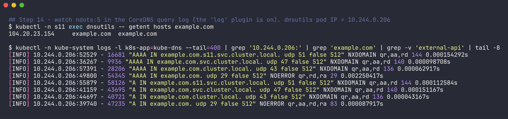

Exactly the 4 steps above - **8 queries** (A + AAAA x 4) for one external name, 6 of them wasted NXDOMAINs. `aa` flag = CoreDNS answered authoritatively (its own `cluster.local` zone); `ra` on the last = it recursed/forwarded.

Same thing with a trailing dot (absolute name):

```
$ kubectl -n s11 exec dnsutils -- getent hosts example.org.
104.20.26.136     example.org  example.org example.org.

$ kubectl -n kube-system logs -l k8s-app=kube-dns --tail=400 | grep '10.244.0.206:' | grep 'example.org' | tail -4
[INFO] 10.244.0.206:59211 - 4877 "AAAA IN example.org. udp 29 false 512" NOERROR qr,rd,ra 29 0.00143025s
[INFO] 10.244.0.206:56734 - 44051 "A IN example.org. udp 29 false 512" NOERROR qr,rd,ra 83 0.162497375s
```

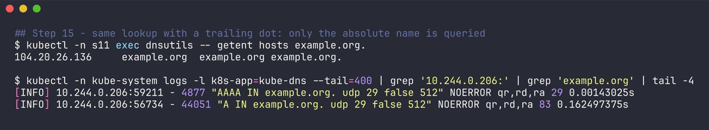

Just 2 queries. And a short in-cluster name hits on the very first suffix:

```
$ kubectl -n s11 exec dnsutils -- getent hosts web-service-headless
10.244.0.177      web-service-headless.s11.svc.cluster.local  web-service-headless.s11.svc.cluster.local web-service-headless

$ kubectl -n kube-system logs -l k8s-app=kube-dns --tail=400 | grep '10.244.0.206:' | grep 'web-service-headless' | tail -4
[INFO] 10.244.0.206:48928 - 33603 "AAAA IN web-service-headless.s11.svc.cluster.local. udp 60 false 512" NOERROR qr,aa,rd 153 0.000119708s
[INFO] 10.244.0.206:55035 - 11678 "A IN web-service-headless.s11.svc.cluster.local. udp 60 false 512" NOERROR qr,aa,rd 234 0.0001975s
...
```

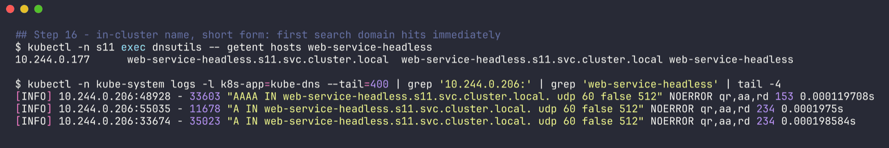

So **why ndots:5?** It's tuned for the in-cluster case: a name like `api-service.s11-other.svc` (3 dots) still gets the search list applied, so all the partial forms work. The cost is extra queries for external names. Fixes if that matters: use a trailing dot / full FQDN, or lower it per pod with `dnsConfig.options: [{name: ndots, value: "2"}]`.

Also visible in the general log: another lab's pod was looking up `yatri-backend-service.s13.svc.cluster.local` - already a full name, but with only 4 dots, so it got expanded to `...svc.cluster.local.s13.svc.cluster.local` first. Same ndots effect.

## CoreDNS config - the Corefile, plugin by plugin

```
$ kubectl -n kube-system get configmap coredns -o yaml
apiVersion: v1
data:
  Corefile: |
    .:53 {
        log
        errors
        health {
           lameduck 5s
        }
        ready
        kubernetes cluster.local in-addr.arpa ip6.arpa {
           pods insecure
           fallthrough in-addr.arpa ip6.arpa
           ttl 30
        }
        prometheus :9153
        hosts {
           192.168.65.254 host.minikube.internal
           fallthrough
        }
        forward . /etc/resolv.conf {
           max_concurrent 1000
        }
        cache 30 {
           disable success cluster.local
           disable denial cluster.local
        }
        loop
        reload
        loadbalance
    }
kind: ConfigMap
metadata:
  name: coredns
  namespace: kube-system
```

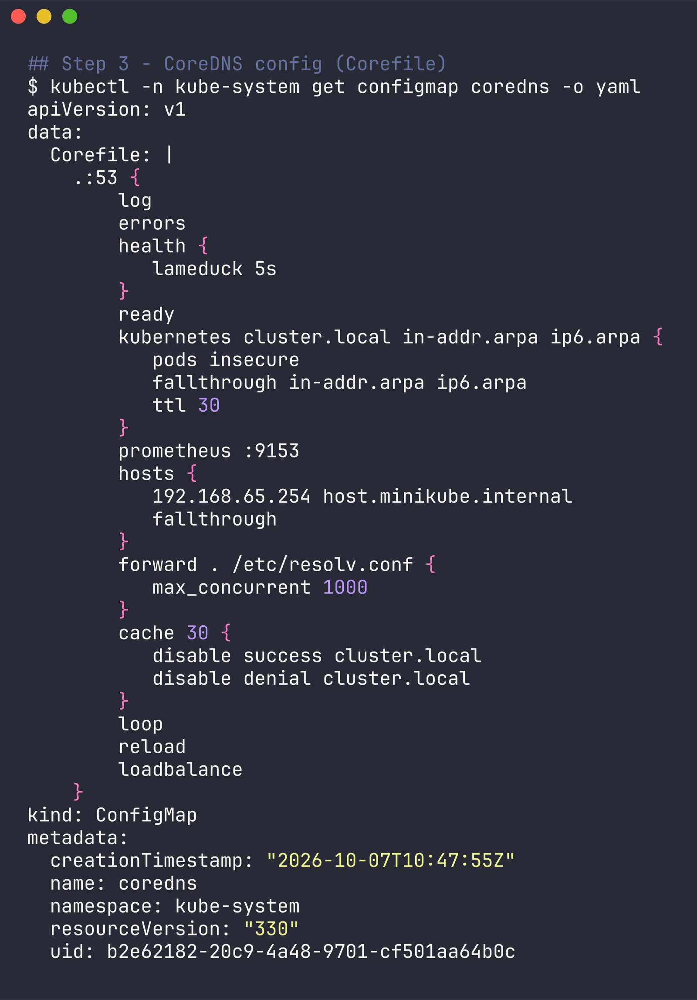

| Line | What it does |
|---|---|
| `.:53 { ... }` | one server block: serve the root zone `.` (i.e. every name) on port 53 |
| `log` | log every query to stdout - that's what made the ndots demo above possible. Not in the upstream kubeadm default, it's on here |
| `errors` | log errors to stdout |
| `health { lameduck 5s }` | `:8080/health` for the liveness probe; on shutdown keep answering for 5s so in-flight queries finish |
| `ready` | `:8181/ready` for the readiness probe - only 200 once plugins (e.g. kubernetes) have synced |
| `kubernetes cluster.local in-addr.arpa ip6.arpa` | the core of it: answer for `cluster.local` and reverse (PTR) lookups from the API server's Services/EndpointSlices/Pods |
| `  pods insecure` | serve `a-b-c-d.ns.pod.cluster.local` records without checking a pod with that IP exists (kube-dns compatible mode) |
| `  fallthrough in-addr.arpa ip6.arpa` | for reverse lookups that aren't cluster IPs, pass on to the next plugin instead of NXDOMAIN |
| `  ttl 30` | records are cached by clients for 30s |
| `prometheus :9153` | metrics at `:9153/metrics` (why the kube-dns service has port 9153) |
| `hosts { ... fallthrough }` | static hosts entries - minikube adds `host.minikube.internal` pointing at the Mac host; otherwise fall through |
| `forward . /etc/resolv.conf` | anything not answered above goes to the upstream servers from the CoreDNS pod's resolv.conf (= the node's DNS) |
| `  max_concurrent 1000` | cap on in-flight upstream queries |
| `cache 30` | cache answers up to 30s... |
| `  disable success/denial cluster.local` | ...but **not** for `cluster.local`, so in-cluster records are always fresh (they're served from memory anyway) |
| `loop` | detect forwarding loops (e.g. upstream points back at CoreDNS) and crash instead of spinning - common gotcha with systemd-resolved's 127.0.0.53 |
| `reload` | watch the Corefile and reload on change (takes a minute or two after editing the ConfigMap) |
| `loadbalance` | shuffle the order of A records in each answer - round-robin for headless services |

Order in the file doesn't decide execution order - CoreDNS has a fixed plugin order compiled in (`plugin.cfg`). For these plugins a query roughly goes `errors -> log -> loadbalance -> cache -> hosts -> kubernetes -> loop -> forward`; `cache` and `loadbalance` sit in front so they can serve from cache or shuffle the answer on its way back out.

The node's upstream that `forward` uses:

```
$ minikube ssh -- cat /etc/resolv.conf
# Generated by Docker Engine.
...
nameserver 192.168.65.254
options ndots:0
```

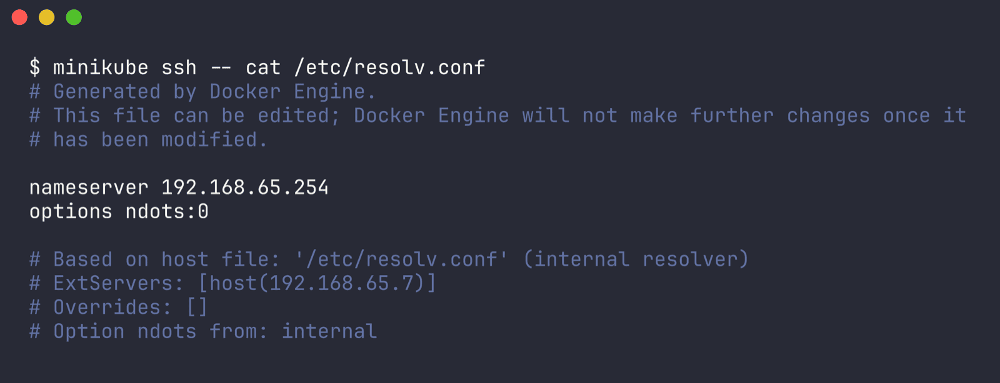

Docker Desktop's internal resolver, which then goes to my Mac's DNS.

Health/ready/metrics endpoints all respond:

```
$ kubectl -n s11 exec dnsutils -- curl -s -w ' (HTTP %{http_code})\n' http://10.244.0.2:8080/health
OK (HTTP 200)

$ kubectl -n s11 exec dnsutils -- curl -s -w ' (HTTP %{http_code})\n' http://10.244.0.2:8181/ready
OK (HTTP 200)

$ kubectl -n s11 exec dnsutils -- curl -s http://10.244.0.2:9153/metrics | grep -E '^coredns_dns_requests_total' | head -5
coredns_dns_requests_total{family="1",proto="udp",server="dns://:53",type="A",view="",zone="."} 28398
coredns_dns_requests_total{family="1",proto="udp",server="dns://:53",type="AAAA",view="",zone="."} 28378
coredns_dns_requests_total{family="1",proto="udp",server="dns://:53",type="CNAME",view="",zone="."} 1
coredns_dns_requests_total{family="1",proto="udp",server="dns://:53",type="SRV",view="",zone="."} 1
coredns_dns_requests_total{family="1",proto="udp",server="dns://:53",type="other",view="",zone="."} 1
```

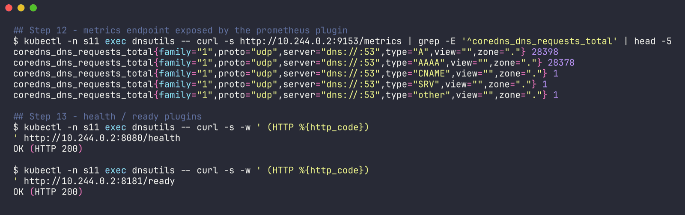

The single CNAME and SRV are probably my own `-type=CNAME` / `-type=SRV` lookups. ~28k A and ~28k AAAA in 40 minutes - that's the whole shared cluster, and AAAA roughly equal to A because every lookup asks for both.

## Troubleshooting DNS - step by step

The order I'd go in, each with what I got on this cluster.

**1. Is CoreDNS running?**

```bash
kubectl -n kube-system get pods -l k8s-app=kube-dns -o wide
kubectl -n kube-system get deploy coredns
```

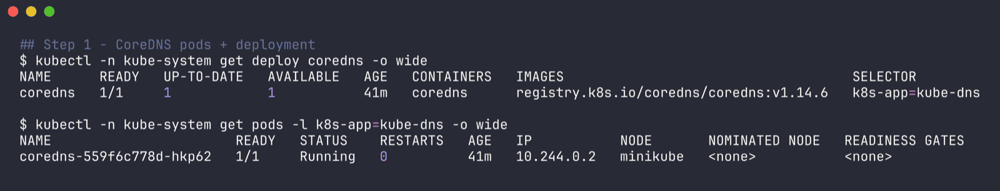

Got `1/1 Running`, 0 restarts. If it's CrashLoopBackOff, check logs for `Loop ... detected` (the `loop` plugin).

**2. Does the kube-dns Service have endpoints?**

```
$ kubectl -n kube-system get endpointslices -l kubernetes.io/service-name=kube-dns
NAME             ADDRESSTYPE   PORTS        ENDPOINTS    AGE
kube-dns-4n9jm   IPv4          53,53,9153   10.244.0.2   41m
```

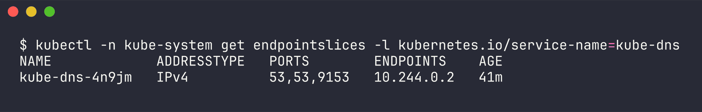

Endpoint = the CoreDNS pod IP. Empty here would mean CoreDNS isn't Ready.

**3. Check CoreDNS logs**

```bash
kubectl -n kube-system logs -l k8s-app=kube-dns --tail=20
```

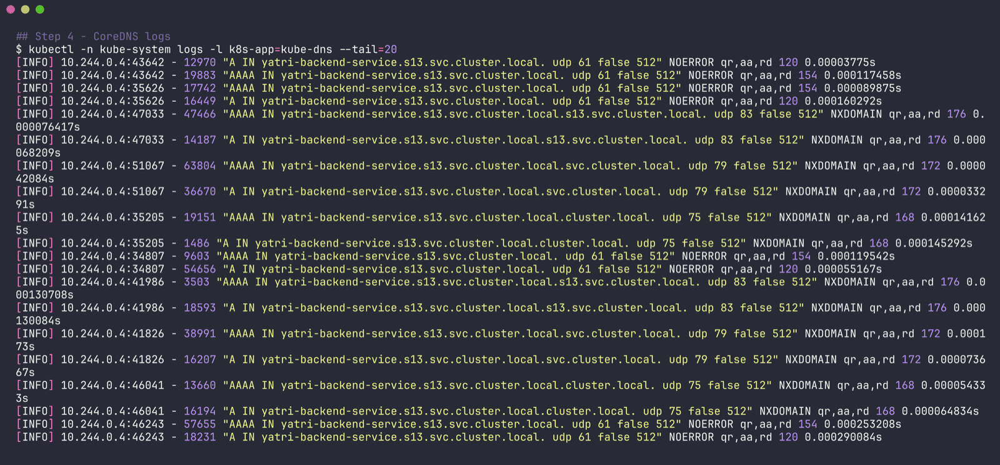

Here it's full of `[INFO]` query lines from the `log` plugin (sample in the raw file). Look for `[ERROR]` lines - upstream timeouts, `i/o timeout` to the API server, etc.

**4. Use a debug pod and check its resolv.conf**

```
$ kubectl -n s11 exec dnsutils -- cat /etc/resolv.conf
search s11.svc.cluster.local svc.cluster.local cluster.local
nameserver 10.96.0.10
options ndots:5
```

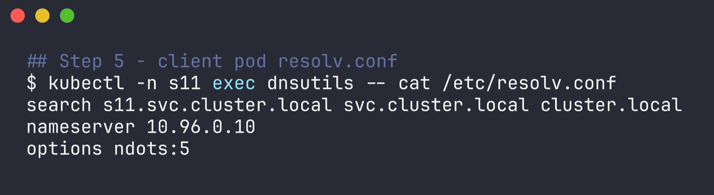

nameserver must match the kube-dns ClusterIP; first search entry must be the pod's namespace. A pod with `dnsPolicy: Default` or `hostNetwork: true` (without `ClusterFirstWithHostNet`) won't have these.

(Common one-liner if you don't have a client pod: `kubectl run -it --rm dnsutils --image=registry.k8s.io/e2e-test-images/jessie-dnsutils:1.3 --restart=Never -- nslookup kubernetes.default`.)

**5. The standard test - `kubernetes.default`**

```
$ kubectl -n s11 exec dnsutils -- getent hosts kubernetes.default
10.96.0.1         kubernetes.default.svc.cluster.local  kubernetes.default.svc.cluster.local kubernetes.default
```

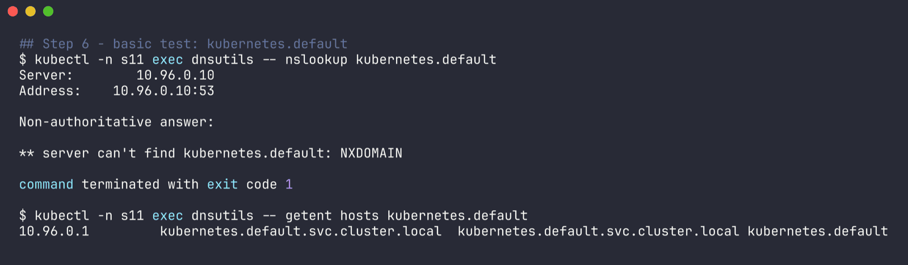

If this resolves, cluster DNS works. Gotcha I hit: busybox `nslookup kubernetes.default` (no FQDN) actually returned `NXDOMAIN` here because of busybox's own search handling, while `getent` and curl were fine. Use the FQDN with busybox, or a resolver that behaves like your app.

**6. Bypass the Service - query the CoreDNS pod directly**

```
$ kubectl -n s11 exec dnsutils -- nslookup kubernetes.default.svc.cluster.local 10.244.0.2
Server:		10.244.0.2
Address:	10.244.0.2:53

Name:	kubernetes.default.svc.cluster.local
Address: 10.96.0.1
```

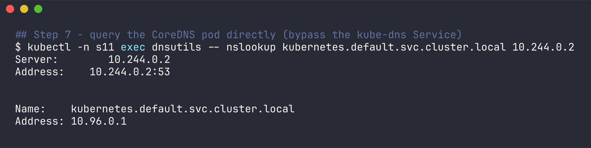

If the pod IP works but `10.96.0.10` doesn't, the problem is kube-proxy / the Service path, not CoreDNS. If neither works, network policy or CNI.

**7. External names (the `forward` path)**

```
$ kubectl -n s11 exec dnsutils -- nslookup example.com
Server:		10.96.0.10
Address:	10.96.0.10:53

Non-authoritative answer:

Non-authoritative answer:
Name:	example.com
Address: 104.20.23.154
Name:	example.com
Address: 172.66.147.243
```

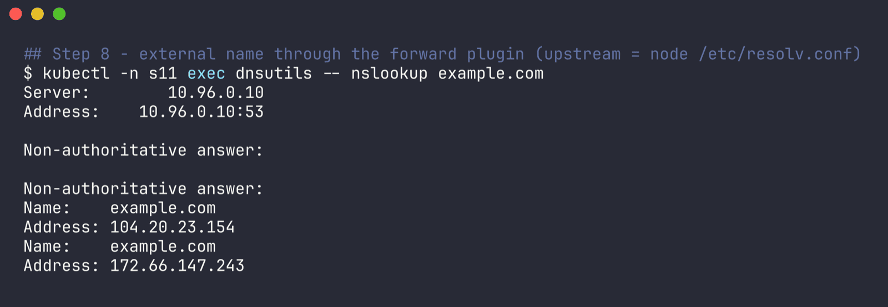

(busybox prints the header once per query type, A and AAAA.) If internal names work but external don't -> check the node's `/etc/resolv.conf` (upstream) and the `forward` line.

**8. NXDOMAIN for a specific service -> check the name/namespace**

```
$ kubectl -n s11 exec dnsutils -- nslookup does-not-exist.s11.svc.cluster.local
** server can't find does-not-exist.s11.svc.cluster.local: NXDOMAIN
```

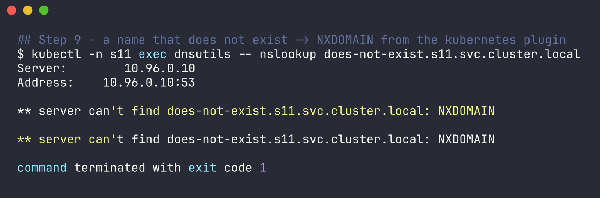

Most of the time it's a typo or the service is in another namespace and a short name was used (Task 3 - `api-service` from `s11` failed for exactly that reason).

**9. "DNS works but the connection fails" - it's not DNS**

Made a service with a typo'd selector ([broken-selector-svc.yaml](broken-selector-svc.yaml)):

```
$ kubectl get endpoints broken-svc -n s11
NAME         ENDPOINTS   AGE
broken-svc   <none>      0s

$ kubectl -n s11 exec dnsutils -- getent hosts broken-svc
10.108.154.5      broken-svc.s11.svc.cluster.local  broken-svc.s11.svc.cluster.local broken-svc

$ kubectl -n s11 exec dnsutils -- curl -s -m 5 http://broken-svc || echo 'curl failed (exit '$?')'
command terminated with exit code 7
curl failed (exit 7)

$ kubectl get svc broken-svc -n s11 -o jsonpath='{.spec.selector}'
{"app":"web-clusterlp"}

$ kubectl get pods -n s11 -l app=web-clusterlp
No resources found in s11 namespace.

$ kubectl delete -f ../coredns/broken-selector-svc.yaml
service "broken-svc" deleted from s11 namespace
```

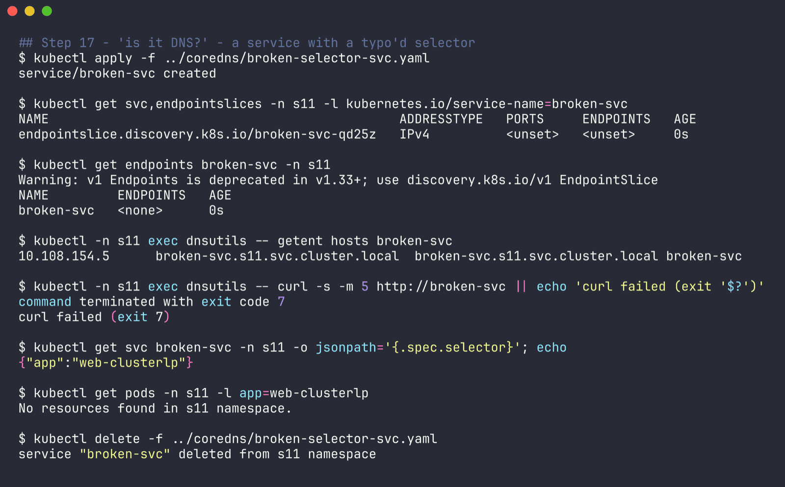

DNS resolved fine (a ClusterIP service always gets a record), but curl exit 7 = connection refused, because there's nothing behind it: `ENDPOINTS <none>`. The selector says `web-clusterlp` instead of `web-clusterip`. So: resolves + refuses -> check endpoints/selector/readiness; doesn't resolve -> DNS.

### Checklist

| Symptom | Look at |
|---|---|
| nothing resolves, even `kubernetes.default` | CoreDNS pods, kube-dns endpoints, pod's resolv.conf, network policy to kube-system:53 |
| works via CoreDNS pod IP, not via 10.96.0.10 | kube-proxy |
| internal OK, external fails | `forward` upstream, node resolv.conf |
| one service NXDOMAIN | name/namespace typo, short name across namespaces |
| resolves but connection refused/timeout | service endpoints (selector, readiness, targetPort) - not DNS |
| slow lookups for external names | ndots:5 expansion - use FQDN with trailing dot or lower ndots |
| CoreDNS CrashLoopBackOff with "Loop detected" | upstream resolv.conf pointing back at a local stub (127.0.0.53) |
