# Session 11 - Task 3: FQDN and Kubernetes DNS

Name: Ridaa Mirza
Enrollment No: 24BCS10394

Setup for this part: the Task 1 stuff in namespace `s11`, plus a tiny nginx app `api` with service `api-service` in a second namespace `s11-other` ([other-ns.yaml](other-ns.yaml)) so I could test lookups across namespaces. All tests run from the `dnsutils` pod in `s11` unless noted. Raw output: [../outputs/task3-fqdn.txt](../outputs/task3-fqdn.txt).

```
$ kubectl get svc -n s11-other -o wide
NAME          TYPE        CLUSTER-IP      EXTERNAL-IP   PORT(S)   AGE   SELECTOR
api-service   ClusterIP   10.98.251.133   <none>        80/TCP    37m   app=api
```

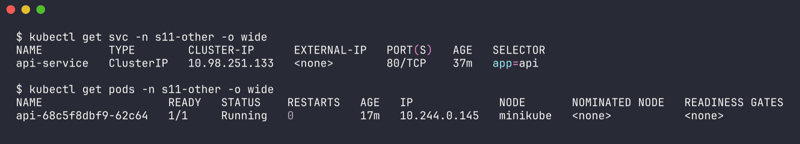

## What is an FQDN

A Fully Qualified Domain Name is the complete name of a host, all the way up to the DNS root, so it's unambiguous no matter where you ask from. `www.example.com.` is fully qualified - the trailing dot is technically the root, and it tells the resolver "don't append anything to this". `www` on its own is a relative name and the resolver has to guess the rest using the search list.

In Kubernetes the cluster has its own private DNS zone, `cluster.local` by default, and every service gets an FQDN inside it.

## Kubernetes service DNS - the naming convention

```
<service-name>.<namespace>.svc.<cluster-domain>
web-service-clusterip.s11.svc.cluster.local
```

| Part | Example | Meaning |
|---|---|---|
| service name | `web-service-clusterip` | `metadata.name` of the Service |
| namespace | `s11` | where the Service lives |
| `svc` | `svc` | fixed - says "this is a service record" (vs `pod`) |
| cluster domain | `cluster.local` | set in kubelet `clusterDomain` and CoreDNS `kubernetes` plugin |

What each kind of service returns:

| Service type | A record for `<svc>.<ns>.svc.cluster.local` |
|---|---|
| ClusterIP / NodePort / LoadBalancer | the single ClusterIP |
| Headless (`clusterIP: None`) | all ready pod IPs |
| ExternalName | a CNAME to `externalName` |

Plus SRV records for named ports, `_<port-name>._<proto>.<svc>.<ns>.svc.cluster.local` - which tell you the port too:

```
$ kubectl -n s11 exec dnsutils -- nslookup -type=SRV _http._tcp.web-service-clusterip.s11.svc.cluster.local
Server:		10.96.0.10
Address:	10.96.0.10:53

_http._tcp.web-service-clusterip.s11.svc.cluster.local	service = 0 100 8080 web-service-clusterip.s11.svc.cluster.local
```

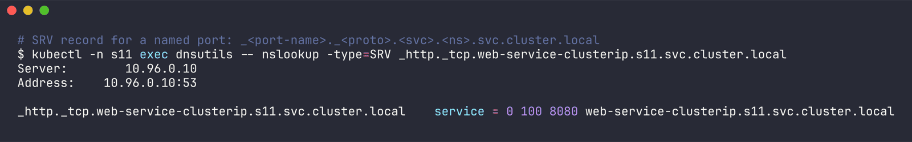

`8080` there is my service `port`, which a client would otherwise have to just know.

## /etc/resolv.conf inside a pod

This file is what makes short names work. kubelet writes it into every pod (with the default `dnsPolicy: ClusterFirst`):

```
$ kubectl -n s11 exec dnsutils -- cat /etc/resolv.conf
search s11.svc.cluster.local svc.cluster.local cluster.local
nameserver 10.96.0.10
options ndots:5

$ kubectl -n s11-other exec deploy/api -- cat /etc/resolv.conf
search s11-other.svc.cluster.local svc.cluster.local cluster.local
nameserver 10.96.0.10
options ndots:5
```

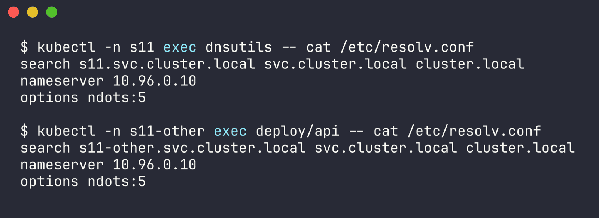

- `nameserver 10.96.0.10` - the ClusterIP of the `kube-dns` service in kube-system, which fronts CoreDNS.
- `search ...` - suffixes tried in order for a non-qualified name. **The first entry is the pod's own namespace**, which is the only difference between the two files above. That one line is why short names only work inside your own namespace.
- `ndots:5` - if the name has fewer than 5 dots, try the search suffixes first before trying the name as-is. More on this in [../coredns/README.md](../coredns/README.md#how-a-query-is-resolved).

## Namespace-based DNS - real lookups

I used `getent hosts` for these because it goes through the libc resolver - exactly what curl or any app uses - so it follows resolv.conf search + ndots the same way an app would. (Busybox `nslookup` does its own odd search-list handling - e.g. `nslookup api-service.s11-other` returned NXDOMAIN even though curl to the same name worked. Both outputs are in the raw file. Lesson: test with the same resolver your app uses.)

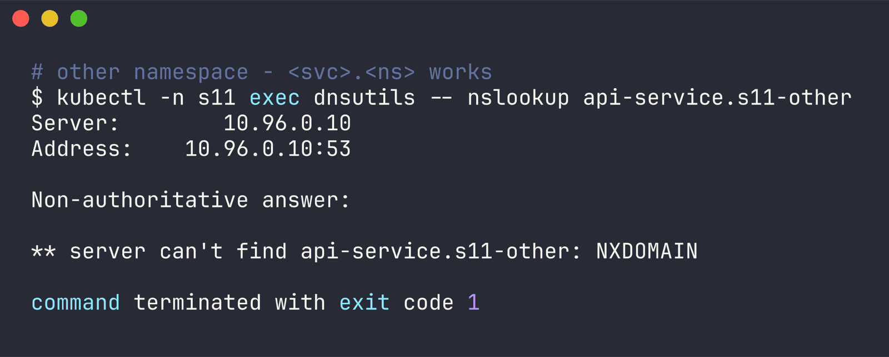

### Same namespace - short name works

```
$ kubectl -n s11 exec dnsutils -- getent hosts web-service-clusterip
10.102.27.133     web-service-clusterip.s11.svc.cluster.local  web-service-clusterip.s11.svc.cluster.local web-service-clusterip
```

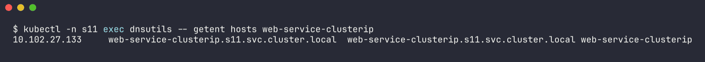

`web-service-clusterip` + first search suffix `s11.svc.cluster.local` = hit.

### Other namespace - short name fails

```
$ kubectl -n s11 exec dnsutils -- getent hosts api-service || echo 'not found (exit '$?')'
command terminated with exit code 2
not found (exit 2)

$ kubectl -n s11 exec dnsutils -- curl -s -m 5 -o /dev/null -w '%{http_code}' http://api-service
000command terminated with exit code 6
```

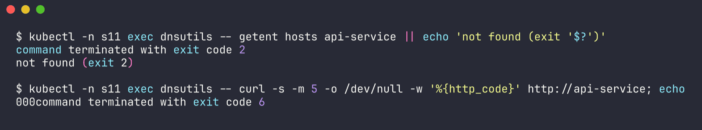

curl exit 6 = "couldn't resolve host". The resolver tried `api-service.s11.svc.cluster.local`, `api-service.svc.cluster.local`, `api-service.cluster.local` and plain `api-service` - none exist, because the service is in `s11-other`.

### Other namespace - add the namespace

```
$ kubectl -n s11 exec dnsutils -- getent hosts api-service.s11-other
10.98.251.133     api-service.s11-other.svc.cluster.local  api-service.s11-other.svc.cluster.local api-service.s11-other

$ kubectl -n s11 exec dnsutils -- getent hosts api-service.s11-other.svc
10.98.251.133     api-service.s11-other.svc.cluster.local  api-service.s11-other.svc.cluster.local api-service.s11-other.svc

$ kubectl -n s11 exec dnsutils -- getent hosts api-service.s11-other.svc.cluster.local
10.98.251.133     api-service.s11-other.svc.cluster.local  api-service.s11-other.svc.cluster.local

$ kubectl -n s11 exec dnsutils -- nslookup api-service.s11-other.svc.cluster.local.
Server:		10.96.0.10
Address:	10.96.0.10:53

Name:	api-service.s11-other.svc.cluster.local
Address: 10.98.251.133

$ kubectl -n s11 exec dnsutils -- curl -s -m 5 -o /dev/null -w '%{http_code}' http://api-service.s11-other
200

$ kubectl -n s11 exec dnsutils -- curl -s -m 5 -o /dev/null -w '%{http_code}' http://api-service.s11-other.svc.cluster.local
200
```

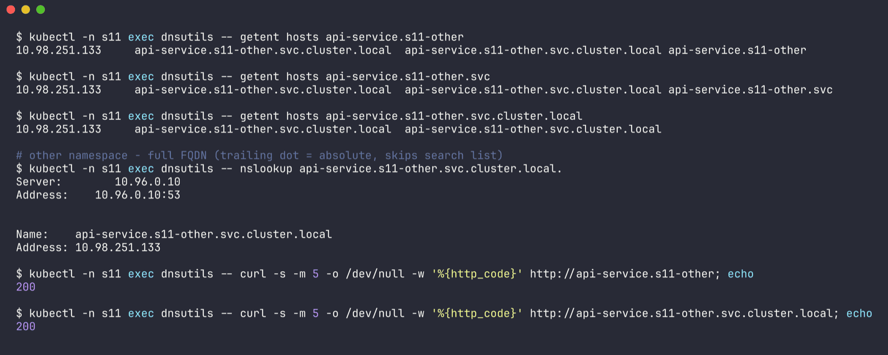

`api-service.s11-other` works because the second search suffix `svc.cluster.local` completes it. Namespaces are not a network boundary here - DNS (and traffic) work across them by default; you'd need NetworkPolicies to block it.

### Reverse direction - from s11-other into s11

```
$ kubectl -n s11-other exec deploy/api -- nslookup web-service-clusterip.s11.svc.cluster.local
Server:		10.96.0.10
Address:	10.96.0.10:53

Name:	web-service-clusterip.s11.svc.cluster.local
Address: 10.102.27.133

$ kubectl -n s11-other exec deploy/api -- curl -s -o /dev/null -w '%{http_code}' http://web-service-clusterip.s11:8080
200
```

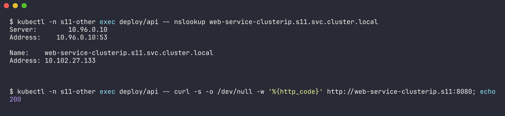

### Summary of which names work from where

| Name used | from a pod in `s11` | from a pod in `s11-other` |
|---|---|---|
| `web-service-clusterip` | works | fails |
| `api-service` | fails (exit 2 / curl exit 6) | works (own namespace) |
| `api-service.s11-other` | works | works |
| `web-service-clusterip.s11` | works | works (curl 200) |
| `<svc>.<ns>.svc.cluster.local` | works | works |

## Pod DNS

Pods get records too, two flavours:

**1. IP-based pod records** - `<pod-ip-with-dashes>.<ns>.pod.cluster.local`. Not very useful since you need the IP anyway, but it exists (CoreDNS has `pods insecure`):

```
$ kubectl -n s11 exec dnsutils -- nslookup 10-244-0-206.s11.pod.cluster.local
Server:		10.96.0.10
Address:	10.96.0.10:53

Name:	10-244-0-206.s11.pod.cluster.local
Address: 10.244.0.206
```

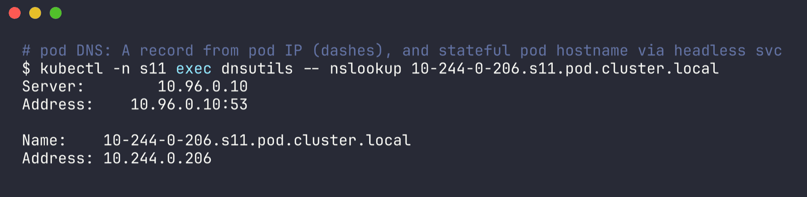

(10.244.0.206 is the dnsutils pod's own IP.)

**2. Hostname + subdomain records** - `<hostname>.<subdomain>.<ns>.svc.cluster.local`. A StatefulSet sets `hostname` = pod name and `subdomain` = `serviceName` automatically, and the headless service publishes them. This is the one that matters:

```
$ kubectl -n s11 exec dnsutils -- nslookup web-0.web-service-headless.s11.svc.cluster.local
Name:	web-0.web-service-headless.s11.svc.cluster.local
Address: 10.244.0.177

$ kubectl -n s11 exec dnsutils -- getent hosts web-0.web-service-headless
10.244.0.177      web-0.web-service-headless.s11.svc.cluster.local  web-0.web-service-headless.s11.svc.cluster.local web-0.web-service-headless
```

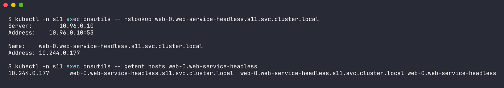

## Pod-to-service communication - examples

How an app config would reference these, from what I tested:

```yaml
# frontend in s11 talking to a backend in s11
BACKEND_URL: http://web-service-clusterip:8080

# anything in s11 talking to the api in s11-other
API_URL: http://api-service.s11-other

# a replica that must always talk to the primary of a StatefulSet
PRIMARY_HOST: web-0.web-service-headless.s11.svc.cluster.local

# the Kubernetes API itself, from any namespace
$ kubectl -n s11 exec dnsutils -- getent hosts kubernetes.default
10.96.0.1         kubernetes.default.svc.cluster.local  kubernetes.default.svc.cluster.local kubernetes.default
```

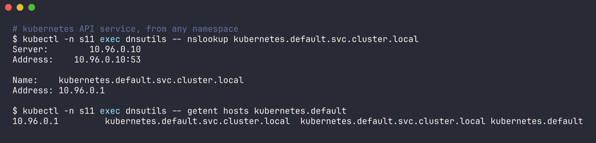

My rule of thumb after this: short name within the same namespace, `<svc>.<ns>` across namespaces, and the full `...svc.cluster.local` (ideally with a trailing dot) in anything performance-sensitive or shared between teams, because it skips the search-list guessing - see the ndots log in the CoreDNS task.
