# Session 12 - Ingress, ConfigMaps & Secrets

Name: Ridaa Mirza
Enrollment No: 24BCS10394

Everything here ran on a local minikube cluster (docker driver on macOS, containerd runtime, `ingress` + `metrics-server` addons, Kubernetes v1.37.0). I kept all my stuff in a namespace called `s12`, and the broken-on-purpose things in `s12-trouble`, so cleanup is just deleting two namespaces. I based the layout on the instructor's `session-12-ingress-configmaps-secrets` folder (`01-configmap`, `02-secret`, `03-ingress`, `04-full-demo`, `troubleshooting`).

Since I can't paste screenshots into a markdown file, every command's real output is saved in `outputs/*.txt` and the important bits are pasted below.

## Folder layout

```
11-k8s-ingress-configmap-secret/
├── 00-namespace.yaml                 # s12 + s12-trouble
├── 01-configmap/
│   ├── app-config.yaml               # declarative ConfigMap
│   ├── nginx-extra.conf              # file used with --from-file
│   └── configmap-demo-pod.yaml       # env + envFrom + volume mount in one pod
├── 02-secret/
│   ├── db-secret.yaml                # Secret with stringData (fake values)
│   └── secret-demo-pod.yaml          # Secret as env + as volume
├── 03-ingress/
│   ├── apps.yaml                     # app1 + app2 (Deployment, Service, ConfigMap'd nginx conf)
│   ├── ingress-path.yaml             # path-based (/app1, /app2) + rewrite example
│   └── ingress-host.yaml             # host-based (app1.s12.local, app2.s12.local)
├── ingress-vs-controller/README.md   # Task 4
├── troubleshooting/                  # Task 5 - 5 scenarios, each with broken + fixed yaml
│   └── README.md
└── outputs/                          # raw command output for everything below
```

## Setup

```bash
kubectl config current-context        # minikube
kubectl apply -f 00-namespace.yaml
```

```
namespace/s12 created
namespace/s12-trouble created
```

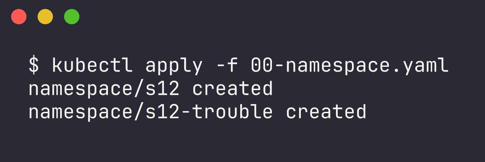

Small note: the minikube node pulls images one at a time (`serializeImagePulls: true`), and while I was working one big image download was holding up the whole queue (the ingress-nginx controller pod itself sat in `ContainerCreating` for ~35 minutes). So my demo pods use images that were already on the node (`busybox:latest`, `nginx:1.27-alpine`) with `imagePullPolicy: IfNotPresent`.

---

## Task 1 - ConfigMaps

A ConfigMap is just a bag of non-sensitive key/value pairs (or whole files) that lives in the cluster, so the same image can run with different settings in dev/staging/prod without rebuilding.

### Step 1 - create ConfigMaps three different ways

**a) Declarative YAML** - `01-configmap/app-config.yaml`. It has simple keys (for env vars) and one multi-line key `app.properties` (for mounting as a file):

```yaml
apiVersion: v1
kind: ConfigMap
metadata:
  name: app-config
  namespace: s12
data:
  APP_ENV: "staging"
  LOG_LEVEL: "INFO"
  APP_PORT: "8080"
  FEATURE_DARK_MODE: "true"
  app.properties: |
    app.name=s12-demo
    app.greeting=Hello from a ConfigMap
    cache.ttl.seconds=60
```

**b) Imperative `--from-literal`** and **c) imperative `--from-file`**:

```bash
kubectl apply -f 01-configmap/app-config.yaml

kubectl -n s12 create configmap cli-config \
  --from-literal=DB_HOST=postgres.s12.svc.cluster.local \
  --from-literal=DB_PORT=5432 \
  --from-literal=CACHE_ENABLED=true

kubectl -n s12 create configmap nginx-extra --from-file=01-configmap/nginx-extra.conf

kubectl -n s12 get configmaps
```

```
configmap/app-config created
configmap/cli-config created
configmap/nginx-extra created

NAME               DATA   AGE
app-config         5      0s
cli-config         3      0s
kube-root-ca.crt   1      0s
nginx-extra        1      0s
```

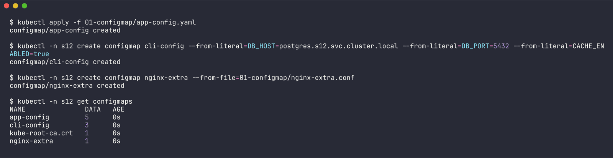

With `--from-file` the **file name becomes the key** and the file content becomes the value:

```bash
kubectl -n s12 get configmap nginx-extra -o yaml
```

```yaml
apiVersion: v1
data:
  nginx-extra.conf: |
    # sample file loaded with: kubectl create configmap ... --from-file
    server_tokens off;
    client_max_body_size 2m;
kind: ConfigMap
```

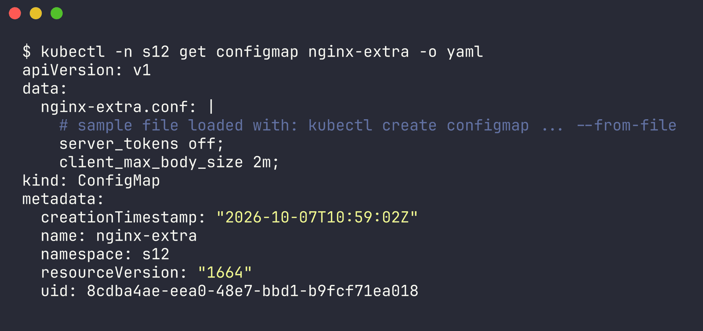

(`kube-root-ca.crt` is auto-created in every namespace, not mine.) Full `describe` output is in `outputs/task1-configmap-create.txt`.

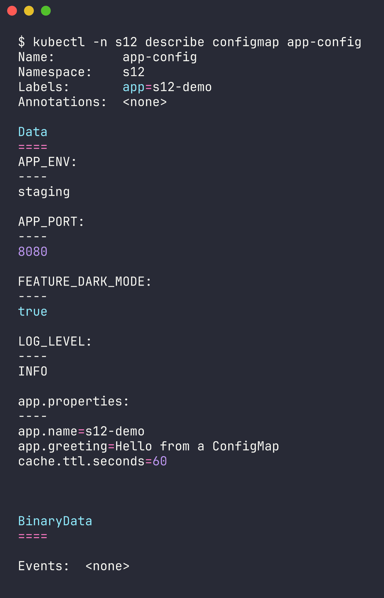

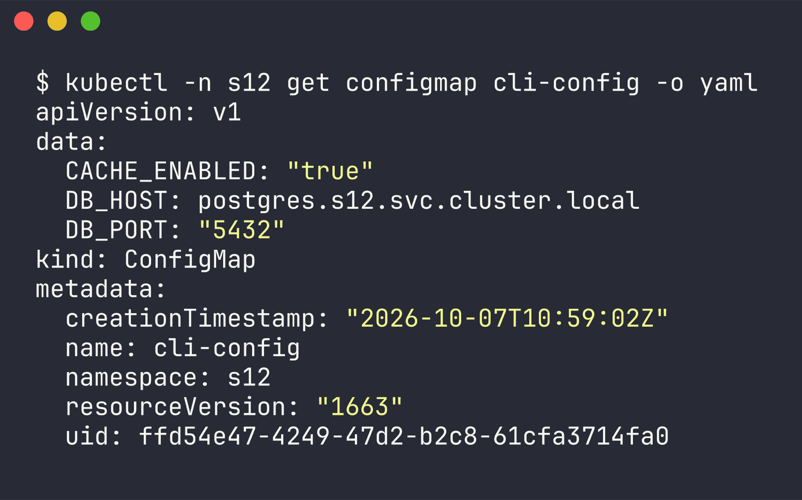

### Step 2 - inject into a pod three ways

`01-configmap/configmap-demo-pod.yaml` uses all three in one busybox pod:

```yaml
      env:
        - name: MY_LOG_LEVEL            # 1. single key, renamed
          valueFrom:
            configMapKeyRef:
              name: app-config
              key: LOG_LEVEL
      envFrom:
        - configMapRef:                 # 2. every key -> env var
            name: cli-config
      volumeMounts:
        - name: config-vol              # 3. every key -> a file
          mountPath: /etc/app
        - name: nginx-vol
          mountPath: /etc/nginx-extra
  volumes:
    - name: config-vol
      configMap:
        name: app-config
    - name: nginx-vol
      configMap:
        name: nginx-extra
```

### Step 3 - verify inside the container

```bash
kubectl apply -f 01-configmap/configmap-demo-pod.yaml
kubectl -n s12 wait --for=condition=Ready pod/cm-demo
kubectl -n s12 exec cm-demo -- env | sort | grep -E 'MY_LOG_LEVEL|DB_HOST|DB_PORT|CACHE_ENABLED'
```

```
CACHE_ENABLED=true
DB_HOST=postgres.s12.svc.cluster.local
DB_PORT=5432
MY_LOG_LEVEL=INFO
```

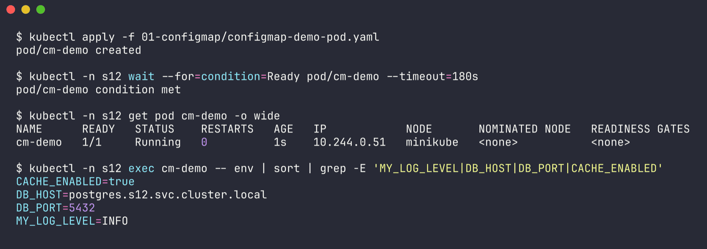

`MY_LOG_LEVEL` came from `env` + `configMapKeyRef`, the other three came in all at once via `envFrom`.

```bash
kubectl -n s12 exec cm-demo -- ls -la /etc/app
kubectl -n s12 exec cm-demo -- cat /etc/app/app.properties
kubectl -n s12 exec cm-demo -- cat /etc/nginx-extra/nginx-extra.conf
```

```
drwxr-xr-x    2 root     root          4096 Oct  7 11:04 ..2026_10_07_11_04_24.2894288849
lrwxrwxrwx    1 root     root            32 Oct  7 11:04 ..data -> ..2026_10_07_11_04_24.2894288849
lrwxrwxrwx    1 root     root            14 Oct  7 11:04 APP_ENV -> ..data/APP_ENV
lrwxrwxrwx    1 root     root            15 Oct  7 11:04 APP_PORT -> ..data/APP_PORT
lrwxrwxrwx    1 root     root            24 Oct  7 11:04 FEATURE_DARK_MODE -> ..data/FEATURE_DARK_MODE
lrwxrwxrwx    1 root     root            16 Oct  7 11:04 LOG_LEVEL -> ..data/LOG_LEVEL
lrwxrwxrwx    1 root     root            21 Oct  7 11:04 app.properties -> ..data/app.properties

app.name=s12-demo
app.greeting=Hello from a ConfigMap
cache.ttl.seconds=60

# sample file loaded with: kubectl create configmap ... --from-file
server_tokens off;
client_max_body_size 2m;
```

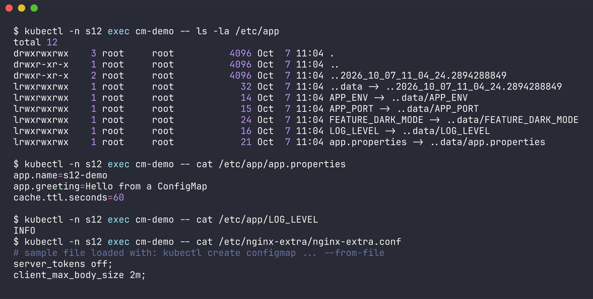

Interesting detail: each key is a **symlink** into `..data`, which itself is a symlink to a timestamped folder. That's how the kubelet can swap all files atomically when the ConfigMap changes - which is exactly the next step. Raw output: `outputs/task1-configmap-consume.txt`.

### Step 4 - update the ConfigMap: volume follows, env doesn't

```bash
kubectl -n s12 exec cm-demo -- cat /etc/app/LOG_LEVEL        # INFO
kubectl -n s12 exec cm-demo -- printenv MY_LOG_LEVEL         # INFO

kubectl -n s12 patch configmap app-config --type merge -p '{"data":{"LOG_LEVEL":"DEBUG"}}'
```

Then I polled the mounted file roughly every 10 seconds:

```
configmap/app-config patched
t=10s  /etc/app/LOG_LEVEL=INFO
t=20s  /etc/app/LOG_LEVEL=INFO
...
t=90s  /etc/app/LOG_LEVEL=INFO
t=100s  /etc/app/LOG_LEVEL=DEBUG
```

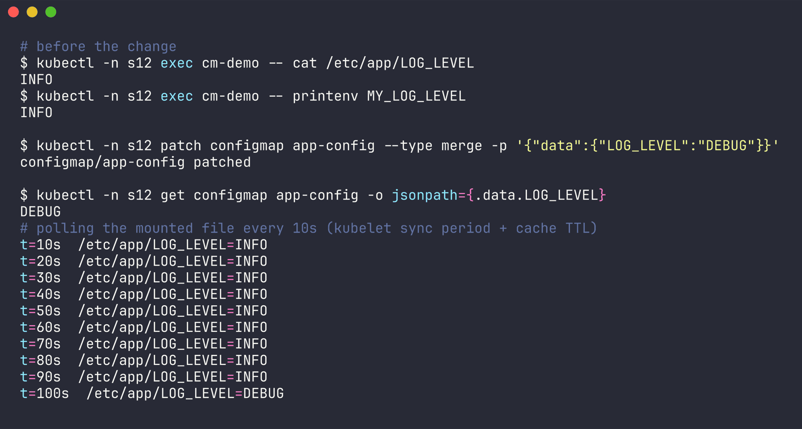

After the update:

```bash
kubectl -n s12 exec cm-demo -- cat /etc/app/LOG_LEVEL
kubectl -n s12 exec cm-demo -- printenv MY_LOG_LEVEL
```

```
DEBUG          <- mounted file updated on its own (no restart)
INFO           <- env var is still the OLD value
```

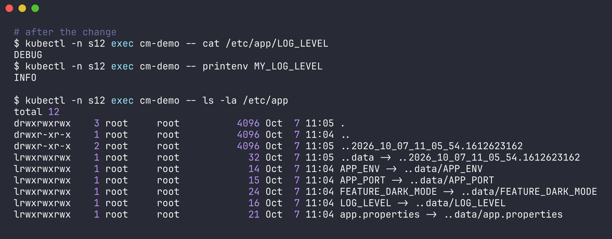

And `ls -la /etc/app` now shows `..data -> ..2026_10_07_11_05_54.1612623162` - a new timestamped folder, the symlink got swapped.

The env var only changes when the container is recreated:

```bash
kubectl -n s12 delete pod cm-demo
kubectl apply -f 01-configmap/configmap-demo-pod.yaml
kubectl -n s12 exec cm-demo -- printenv MY_LOG_LEVEL
```

```
DEBUG
```

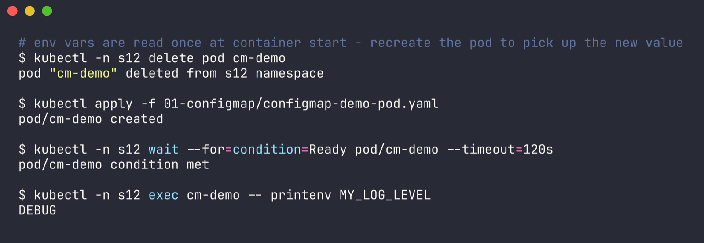

Raw output: `outputs/task1-configmap-update.txt`.

**Observations**

- Env vars (`env` / `envFrom`) are copied into the process **once, at container start**. Changing the ConfigMap later does nothing to a running container. With a Deployment you'd do `kubectl rollout restart deployment/<name>`.
- Volume-mounted ConfigMaps **are** updated in place, but not instantly - the kubelet only re-syncs periodically (sync period + its cache TTL). On my run it took somewhere around a minute and a half.
- Even when the file updates, the app still has to re-read it. nginx for example needs a reload.
- Exception I read about: if you mount with `subPath`, the file never updates.

---

## Task 2 - Secrets

Secrets look almost exactly like ConfigMaps, but they're meant for sensitive data: Kubernetes stores values base64-encoded, can keep them off disk on the node (tmpfs), and you can lock them down separately with RBAC.

### Step 1 - create a Secret (YAML with `stringData`) and one imperatively

`02-secret/db-secret.yaml` - all values are fake on purpose:

```yaml
apiVersion: v1
kind: Secret
metadata:
  name: db-secret
  namespace: s12
type: Opaque
stringData:
  DB_USER: "demo_user"
  DB_PASSWORD: "demo-password-not-real"
  DB_NAME: "s12_demo_db"
```

`stringData` lets me write plain text and the API server base64-encodes it into `.data` for me (the instructor's version uses `data:` with values encoded by hand via `echo -n ... | base64` - same result, just more room for mistakes, see troubleshooting scenario 3 and 4).

```bash
kubectl apply -f 02-secret/db-secret.yaml
kubectl -n s12 create secret generic api-secret \
  --from-literal=API_KEY=demo-api-key-not-real \
  --from-literal=API_TOKEN=demo-token-12345
kubectl -n s12 get secrets
kubectl -n s12 describe secret db-secret
```

```
secret/db-secret created
secret/api-secret created

NAME         TYPE     DATA   AGE
api-secret   Opaque   2      0s
db-secret    Opaque   3      0s

Name:         db-secret
Namespace:    s12
Type:  Opaque

Data
====
DB_NAME:      11 bytes
DB_PASSWORD:  22 bytes
DB_USER:      9 bytes
```

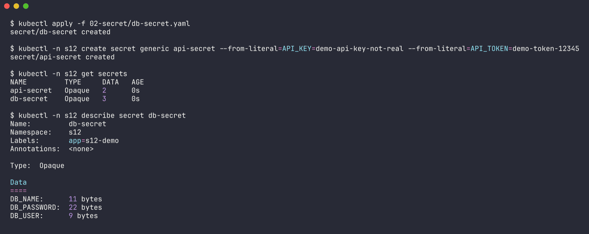

`describe` only shows sizes, not the values. But `-o yaml` shows the stored form:

```bash
kubectl -n s12 get secret db-secret -o yaml
```

```yaml
apiVersion: v1
data:
  DB_NAME: czEyX2RlbW9fZGI=
  DB_PASSWORD: ZGVtby1wYXNzd29yZC1ub3QtcmVhbA==
  DB_USER: ZGVtb191c2Vy
kind: Secret
metadata:
  annotations:
    kubectl.kubernetes.io/last-applied-configuration: |
      {"apiVersion":"v1","kind":"Secret","metadata":{...},"stringData":{"DB_NAME":"s12_demo_db","DB_PASSWORD":"demo-password-not-real","DB_USER":"demo_user"},"type":"Opaque"}
```

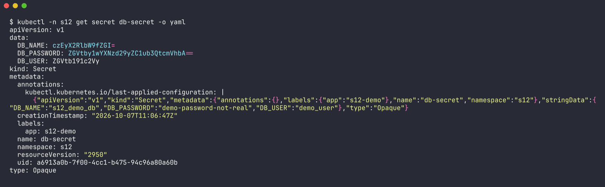

Something I didn't expect: because I used `kubectl apply` with `stringData`, the **plain-text password is sitting in the `last-applied-configuration` annotation**. So anyone who can read the Secret object doesn't even need to decode anything. Good reason to create secrets with `kubectl create secret` / server-side apply / a secrets tool instead of `kubectl apply`-ing a stringData file.

### Step 2 - decode with base64

```bash
kubectl -n s12 get secret db-secret -o jsonpath='{.data.DB_PASSWORD}'; echo
kubectl -n s12 get secret db-secret -o jsonpath='{.data.DB_PASSWORD}' | base64 --decode; echo
kubectl -n s12 get secret api-secret -o go-template='{{range $k,$v := .data}}{{$k}}={{$v | base64decode}}{{"\n"}}{{end}}'
echo -n 'demo-password-not-real' | base64
```

```
ZGVtby1wYXNzd29yZC1ub3QtcmVhbA==
demo-password-not-real
API_KEY=demo-api-key-not-real
API_TOKEN=demo-token-12345
ZGVtby1wYXNzd29yZC1ub3QtcmVhbA==
```

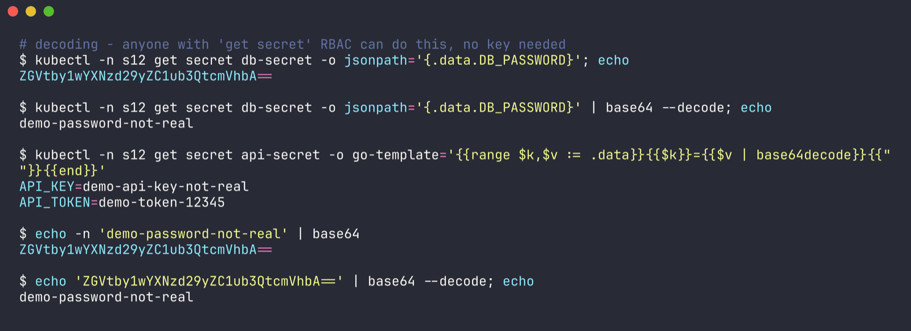

No key, no password, nothing - one pipe to `base64 --decode` and it's plain text. Raw output: `outputs/task2-secret-create.txt`.

### Step 3 - inject as env vars and as a volume, verify inside the container

`02-secret/secret-demo-pod.yaml`:

```yaml
      env:
        - name: DB_USER
          valueFrom:
            secretKeyRef: { name: db-secret, key: DB_USER }
        - name: DB_PASSWORD
          valueFrom:
            secretKeyRef: { name: db-secret, key: DB_PASSWORD }
      volumeMounts:
        - name: api-creds
          mountPath: /etc/secrets
          readOnly: true
  volumes:
    - name: api-creds
      secret:
        secretName: api-secret
        defaultMode: 0400
```

```bash
kubectl apply -f 02-secret/secret-demo-pod.yaml
kubectl -n s12 exec secret-demo -- env | grep '^DB_'
kubectl -n s12 exec secret-demo -- ls -laL /etc/secrets
kubectl -n s12 exec secret-demo -- cat /etc/secrets/API_KEY
kubectl -n s12 exec secret-demo -- mount | grep /etc/secrets
```

```
DB_PASSWORD=demo-password-not-real
DB_USER=demo_user

-r--------    1 root     root            21 Oct  7 11:06 API_KEY
-r--------    1 root     root            16 Oct  7 11:06 API_TOKEN

demo-api-key-not-real

tmpfs on /etc/secrets type tmpfs (ro,relatime,size=32768k,noswap)
```

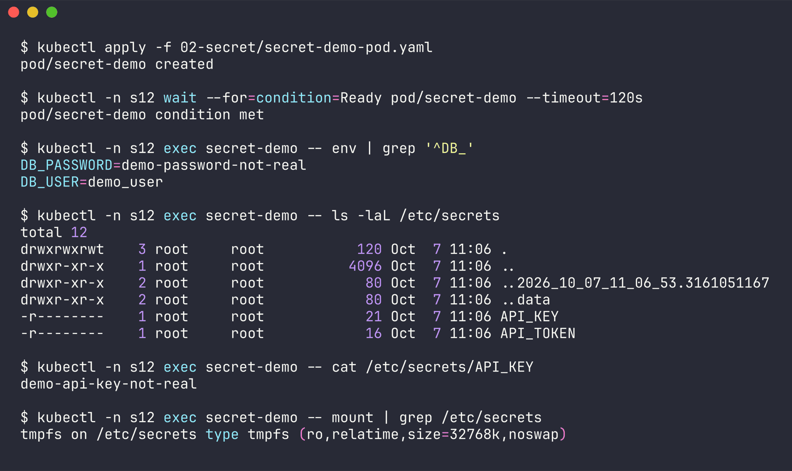

**Observations**

- Inside the container the values are already decoded - the app never sees base64.
- The secret volume is a **tmpfs** (RAM), read-only, and `defaultMode: 0400` made the files owner-read-only. ConfigMap volumes were a normal disk dir with 644-style perms.
- Same update rules as ConfigMaps: mounted secret files refresh, env vars don't.
- I'd prefer the volume over env vars for real secrets: env vars leak more easily (crash dumps, `/proc/<pid>/environ`, child processes, debug endpoints that print the environment).

Raw output: `outputs/task2-secret-consume.txt`.

### Why Secrets should NOT be committed to Git

1. **base64 is encoding, not encryption.** It's reversible by anyone with no key - I just did it above in one command. A Secret YAML in a repo is basically the password in plain text with one extra step.
2. **Git history is forever.** Deleting the file in the next commit doesn't help; it's still in every clone, fork, CI cache and backup. Getting it out means rewriting history (`git filter-repo` / BFG) and force-pushing - and you still have to assume it leaked and **rotate the credential**.
3. **Repos get shared way more widely than prod access.** Every contributor, CI system, and anyone who ever gets read access (or a public mirror by accident) gets the credentials. Bots actively scan GitHub for leaked keys within minutes.
4. **Even inside the cluster, Secrets aren't encrypted by default.** They're stored in etcd as base64. You need to turn on **encryption at rest** (an `EncryptionConfiguration` on the API server with `aescbc`/`secretbox` or better a KMS provider) so an etcd backup or disk snapshot doesn't expose everything. Plus RBAC so only the right service accounts can `get` secrets.

What to do instead:

| Option | Idea |
|--------|------|
| `.gitignore` + create at deploy time | Keep `*secret*.yaml` / `.env` out of the repo; CI or the operator runs `kubectl create secret ... --from-literal` with values from a secure store (CI secret variables) |
| **Sealed Secrets** (Bitnami) | You encrypt with the cluster's public key (`kubeseal`), commit the `SealedSecret`; only the controller in the cluster can decrypt it |
| **SOPS** (+ age / PGP / cloud KMS) | Encrypts just the values inside the YAML so the file is safe to commit; decrypted at deploy time (works with Flux / ArgoCD / helm-secrets) |
| **External Secrets Operator** | Commit only a pointer (`ExternalSecret`); the operator pulls the real value from AWS Secrets Manager / GCP Secret Manager / Azure Key Vault / Vault and creates the Secret |
| **HashiCorp Vault** | Central secret store with audit logs, leases, dynamic short-lived credentials; inject via the Vault Agent sidecar or CSI driver |
| Secrets Store CSI Driver | Mount secrets from a cloud vault straight into the pod as files without storing them in etcd at all |

Plus: pre-commit secret scanners (gitleaks, trufflehog, GitHub push protection) to catch mistakes before they're pushed.

In this repo every value is an obviously fake demo value (`demo-password-not-real`), so it's fine to commit as a teaching example.

---

## Task 3 - Ingress (path-based + host-based routing)

Based on the instructor's `03-ingress/path-based.yml` and `04-full-demo/ingress.yaml`. Instead of the frontend/backend pair from the demo I used two tiny nginx apps whose responses say **which app and which pod answered, plus the Host and URI they actually received** - that makes it obvious from a single curl whether routing (and rewriting) worked.

### Step 1 - two apps + Services

`03-ingress/apps.yaml` creates, for each of `app1` (blue) and `app2` (green): a ConfigMap with an nginx `default.conf` (yes, ConfigMaps again - mounted at `/etc/nginx/conf.d`), a Deployment with 2 replicas, and a ClusterIP Service on port 80. The nginx config is basically:

```nginx
location / {
  default_type text/plain;
  return 200 "Hello from app1 (blue)\npod=$hostname host=$host uri=$request_uri\n";
}
```

```bash
kubectl apply -f 03-ingress/apps.yaml
kubectl -n s12 rollout status deploy/app1
kubectl -n s12 rollout status deploy/app2
kubectl -n s12 get deploy,pods -l 'app in (app1,app2)' -o wide
kubectl -n s12 get endpoints app1-svc app2-svc
```

```
deployment.apps/app1   2/2     2            2           6s    web          nginx:1.27-alpine   app=app1
deployment.apps/app2   2/2     2            2           6s    web          nginx:1.27-alpine   app=app2

pod/app1-55d65ddfc8-fp4m7   1/1     Running   0          6s    10.244.0.85
pod/app1-55d65ddfc8-klr2v   1/1     Running   0          6s    10.244.0.84
pod/app2-865dc465b4-7fzg9   1/1     Running   0          6s    10.244.0.87
pod/app2-865dc465b4-q57jf   1/1     Running   0          6s    10.244.0.86

NAME       ENDPOINTS                       AGE
app1-svc   10.244.0.84:80,10.244.0.85:80   6s
app2-svc   10.244.0.86:80,10.244.0.87:80   6s
```

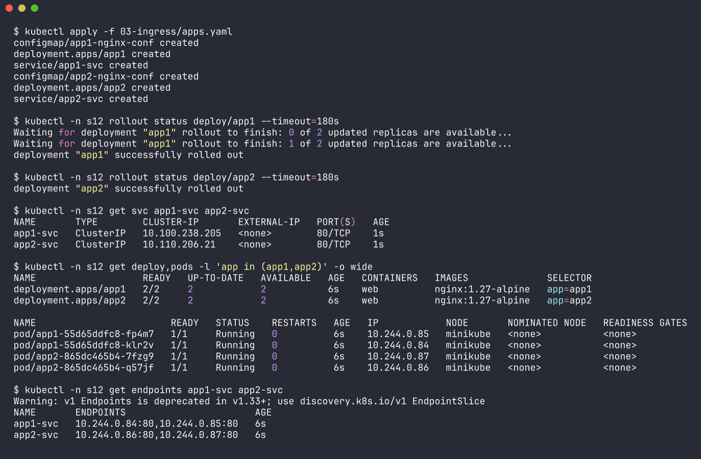

Raw: `outputs/task3-apps.txt`.

### Step 2 - the Ingress resources

**Path-based** (`03-ingress/ingress-path.yaml`) - one host, the path picks the app:

```yaml
spec:
  ingressClassName: nginx
  rules:
    - host: app.s12.local
      http:
        paths:
          - path: /app1
            pathType: Prefix
            backend:
              service: { name: app1-svc, port: { number: 80 } }
          - path: /app2
            pathType: Prefix
            backend:
              service: { name: app2-svc, port: { number: 80 } }
```

The same file also has a **rewrite** Ingress copied from the instructor's `04-full-demo` pattern - `api.s12.local`, `path: /api(/|$)(.*)` with `nginx.ingress.kubernetes.io/rewrite-target: /$2`, pointing at `app2-svc`.

**Host-based** (`03-ingress/ingress-host.yaml`) - the Host header picks the app:

```yaml
  rules:
    - host: app1.s12.local
      http:
        paths:
          - path: /
            pathType: Prefix
            backend:
              service: { name: app1-svc, port: { number: 80 } }
    - host: app2.s12.local
      http:
        paths:
          - path: /
            pathType: Prefix
            backend:
              service: { name: app2-svc, port: { number: 80 } }
```

```bash
kubectl apply -f 03-ingress/ingress-path.yaml
kubectl apply -f 03-ingress/ingress-host.yaml
kubectl -n s12 get ingress
```

```
ingress.networking.k8s.io/s12-path-ingress created
ingress.networking.k8s.io/s12-rewrite-ingress created
ingress.networking.k8s.io/s12-host-ingress created

NAME                  CLASS   HOSTS                           ADDRESS        PORTS   AGE
s12-host-ingress      nginx   app1.s12.local,app2.s12.local   192.168.49.2   80      45s
s12-path-ingress      nginx   app.s12.local                   192.168.49.2   80      46s
s12-rewrite-ingress   nginx   api.s12.local                   192.168.49.2   80      46s
```

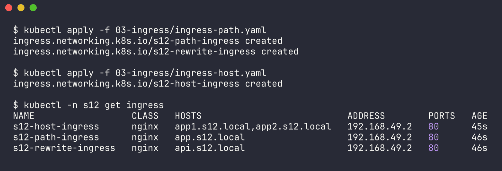

### Step 3 - describe the Ingress

```bash
kubectl -n s12 describe ingress s12-path-ingress
```

```
Name:             s12-path-ingress
Namespace:        s12
Address:          192.168.49.2
Ingress Class:    nginx
Default backend:  <default>
Rules:
  Host           Path  Backends
  ----           ----  --------
  app.s12.local
                 /app1   app1-svc:80 (10.244.0.85:80,10.244.0.84:80)
                 /app2   app2-svc:80 (10.244.0.86:80,10.244.0.87:80)
Annotations:     nginx.ingress.kubernetes.io/ssl-redirect: false
Events:
  Type    Reason  Age               From                      Message
  ----    ------  ----              ----                      -------
  Normal  Sync    0s (x2 over 46s)  nginx-ingress-controller  Scheduled for sync
```

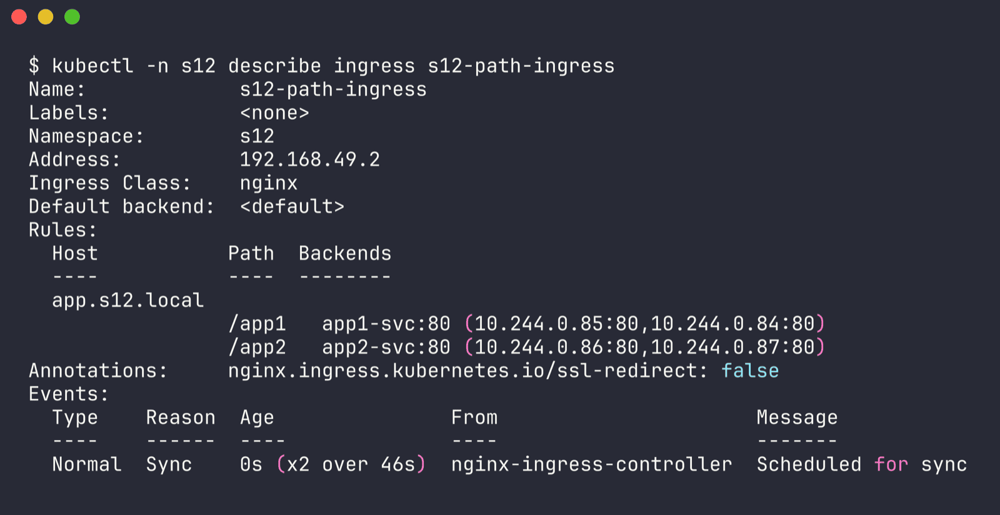

```bash
kubectl -n s12 describe ingress s12-host-ingress
```

```
Rules:
  Host            Path  Backends
  ----            ----  --------
  app1.s12.local
                  /   app1-svc:80 (10.244.0.85:80,10.244.0.84:80)
  app2.s12.local
                  /   app2-svc:80 (10.244.0.86:80,10.244.0.87:80)
```

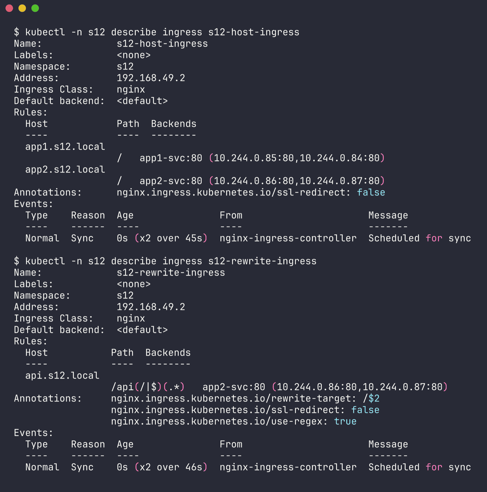

The pod IPs in brackets are the important bit - it means the Ingress -> Service -> pods chain resolved. (Troubleshooting scenario 5 shows what it looks like when it doesn't: `()`.) Full output: `outputs/task3-ingress-apply.txt`.

### Step 4 - access through the Ingress

On macOS with the docker driver, the minikube IP (`192.168.49.2`) lives inside Docker's VM and isn't reachable from the Mac, so I port-forwarded the controller's Service and sent the right `Host` header with curl:

```bash
kubectl -n ingress-nginx port-forward svc/ingress-nginx-controller 18120:80 &
```

(Alternatives: `minikube tunnel` and then add `127.0.0.1 app.s12.local app1.s12.local app2.s12.local` to `/etc/hosts` so a browser works; on Linux, put `$(minikube ip)` in `/etc/hosts` instead. I didn't want to touch `/etc/hosts`, so I stuck with Host headers / `curl --resolve`.)

**Path-based:**

```bash
curl -s -H 'Host: app.s12.local' localhost:18120/app1
curl -s -H 'Host: app.s12.local' localhost:18120/app2
curl -s -H 'Host: app.s12.local' localhost:18120/app1/orders/42
```

```
Hello from app1 (blue)
pod=app1-55d65ddfc8-fp4m7 host=app.s12.local uri=/app1

Hello from app2 (green)
pod=app2-865dc465b4-q57jf host=app.s12.local uri=/app2

Hello from app1 (blue)
pod=app1-55d65ddfc8-fp4m7 host=app.s12.local uri=/app1/orders/42
```

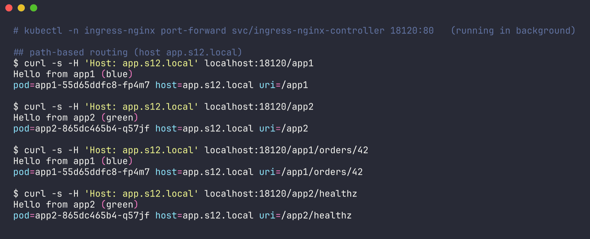

Paths with no rule:

```bash
curl -s -i -H 'Host: app.s12.local' localhost:18120/      | head -1
curl -s -i -H 'Host: app.s12.local' localhost:18120/app3  | head -1
curl -s -i -H 'Host: app.s12.local' localhost:18120/app1x | head -1
```

```
HTTP/1.1 404 Not Found
HTTP/1.1 404 Not Found
HTTP/1.1 404 Not Found
```

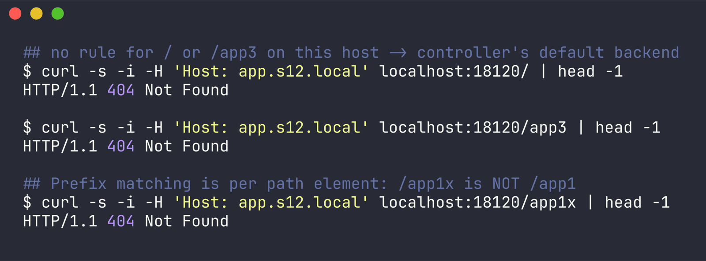

`/app1x` is a nice one: `pathType: Prefix` matches whole path **elements**, so `/app1` matches `/app1` and `/app1/...` but not `/app1x`.

**Host-based:**

```bash
curl -s -H 'Host: app1.s12.local' localhost:18120/
curl -s -H 'Host: app2.s12.local' localhost:18120/
curl -s -H 'Host: app1.s12.local' localhost:18120/anything/here
curl -s -i -H 'Host: nope.s12.local' localhost:18120/ | head -1
```

```
Hello from app1 (blue)
pod=app1-55d65ddfc8-fp4m7 host=app1.s12.local uri=/

Hello from app2 (green)
pod=app2-865dc465b4-q57jf host=app2.s12.local uri=/

Hello from app1 (blue)
pod=app1-55d65ddfc8-klr2v host=app1.s12.local uri=/anything/here

HTTP/1.1 404 Not Found
```

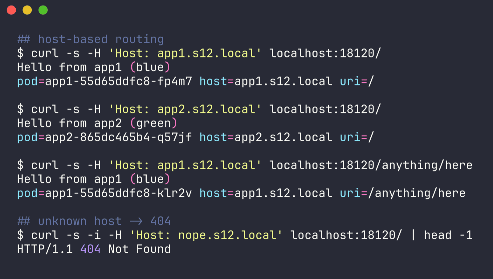

Same port, same IP - only the Host header changed, and a different app answered. An unknown host falls through to the controller's default backend (404).

**Rewrite** (`api.s12.local`):

```bash
curl -s -H 'Host: api.s12.local' localhost:18120/api/users
curl -s -H 'Host: api.s12.local' localhost:18120/api
```

```
Hello from app2 (green)
pod=app2-865dc465b4-q57jf host=api.s12.local uri=/users

Hello from app2 (green)
pod=app2-865dc465b4-7fzg9 host=api.s12.local uri=/
```

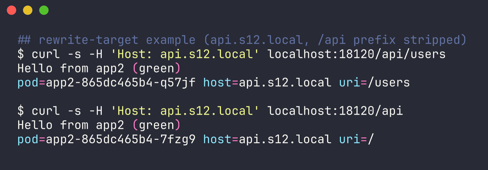

Compare with the path-based Ingress above: there app1 received `uri=/app1` (prefix kept), here the pod received `/users` - the `/api` prefix was stripped by `rewrite-target: /$2`. That's why the instructor's backend under `/api` needs the rewrite: most apps don't know they're mounted under a prefix.

**Load balancing** across the 2 replicas:

```bash
for i in 1 2 3 4 5 6; do curl -s -H 'Host: app1.s12.local' localhost:18120/ | sed -n 2p; done
```

```
pod=app1-55d65ddfc8-klr2v host=app1.s12.local uri=/
pod=app1-55d65ddfc8-fp4m7 host=app1.s12.local uri=/
pod=app1-55d65ddfc8-klr2v host=app1.s12.local uri=/
pod=app1-55d65ddfc8-klr2v host=app1.s12.local uri=/
pod=app1-55d65ddfc8-klr2v host=app1.s12.local uri=/
pod=app1-55d65ddfc8-fp4m7 host=app1.s12.local uri=/
```

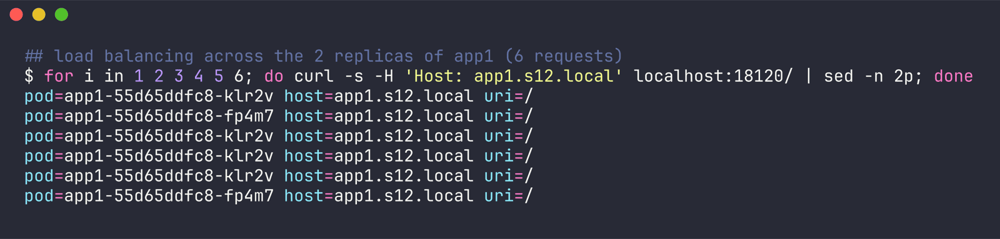

**`--resolve` instead of a Host header** (this is what an `/etc/hosts` entry does for you):

```bash
curl -s --resolve app2.s12.local:18120:127.0.0.1 http://app2.s12.local:18120/
```

```
Hello from app2 (green)
pod=app2-865dc465b4-q57jf host=app2.s12.local uri=/
```

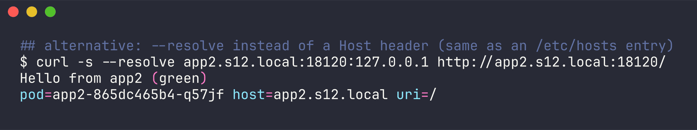

Raw: `outputs/task3-ingress-curl.txt`.

**From inside the cluster** too (no port-forward, just the controller's Service DNS name):

```bash
kubectl -n s12 run curl-test --rm -i --restart=Never --image=curlimages/curl:latest --command -- sh -c \
  'curl -s -H "Host: app.s12.local" http://ingress-nginx-controller.ingress-nginx.svc/app1;
   curl -s -H "Host: app2.s12.local" http://ingress-nginx-controller.ingress-nginx.svc/'
```

```
Hello from app1 (blue)
pod=app1-55d65ddfc8-fp4m7 host=app.s12.local uri=/app1
Hello from app2 (green)
pod=app2-865dc465b4-7fzg9 host=app2.s12.local uri=/
```

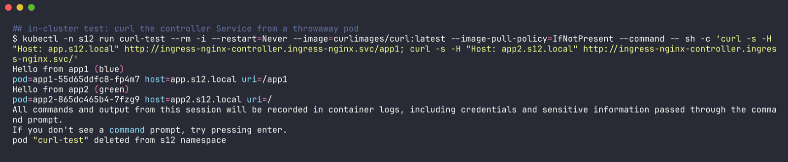

And the controller's access log shows which upstream Service and pod IP each request went to:

```
10.244.0.225 - - [07/Oct/2026:11:27:07 +0000] "GET /app1 HTTP/1.1" 200 78 "-" "curl/8.22.0" 81 0.000 [s12-app1-svc-80] [] 10.244.0.85:80 78 0.000 200 dfae...
10.244.0.225 - - [07/Oct/2026:11:27:07 +0000] "GET / HTTP/1.1" 200 76 "-" "curl/8.22.0" 78 0.000 [s12-app2-svc-80] [] 10.244.0.87:80 76 0.000 200 c0e4...
```

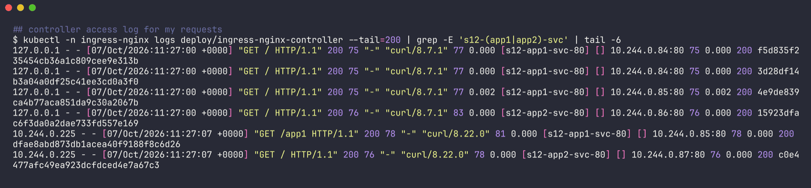

Raw: `outputs/task3-ingress-incluster.txt`.

**Observations**

- Path-based = one hostname, many apps under different URL prefixes. Host-based = one IP/LB, many hostnames. Real setups mix both (like the instructor's TLS example: `portal.campus.local` vs `api.campus.local/api`).
- Without a rewrite, the backend sees the full original path - the app must actually serve `/app1/...` or use the rewrite annotation.
- Requests go controller -> pod IP directly (look at the access log upstream `10.244.0.85:80`); ingress-nginx reads EndpointSlices itself rather than going through the Service's ClusterIP.
- I didn't do TLS here; the instructor's `03-ingress/ingress-tls.yaml` shows the `tls:` block with a `kubernetes.io/tls` Secret - which is one more place Secrets get used.

---

## Task 4 - Ingress vs Ingress Controller

Written up separately in [`ingress-vs-controller/README.md`](ingress-vs-controller/README.md), with real `kubectl get ingressclass` / controller pod output from this cluster.

---

## Task 5 - Troubleshooting

Five scenarios in [`troubleshooting/README.md`](troubleshooting/README.md), each with identify -> commands -> root cause -> fix -> before/after output:

1. The instructor's `app/backend-with-config.yaml` deployed into a namespace without its ConfigMap/Secret -> `CreateContainerConfigError`
2. Pod references a ConfigMap key that doesn't exist -> `CreateContainerConfigError`
3. The instructor's `secret-base64-gotcha.md` trailing-newline bug, reproduced for real
4. Secret value double-base64-encoded (`stringData` + hand-encoded value)
5. Ingress pointing at the wrong Service port -> 503

---

## Cleanup

Everything lives in my two namespaces, so cleanup is one command (I left the ingress-nginx addon alone since it's cluster-wide):

```bash
kill %1    # the port-forward
kubectl delete namespace s12 s12-trouble
```

```
namespace "s12" deleted
namespace "s12-trouble" deleted

$ kubectl get ns s12 s12-trouble
Error from server (NotFound): namespaces "s12" not found
Error from server (NotFound): namespaces "s12-trouble" not found
```

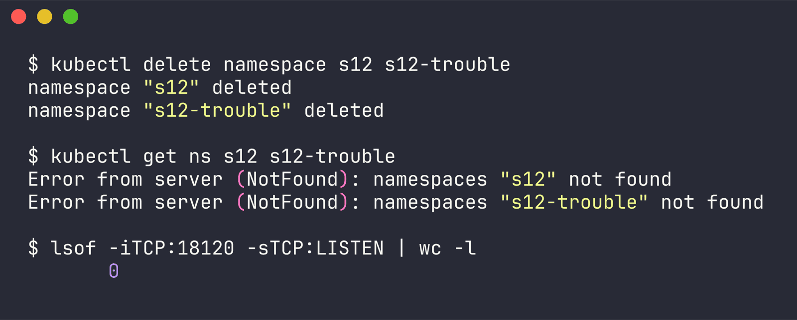

Raw: `outputs/cleanup.txt`. To re-run everything: `kubectl apply -f 00-namespace.yaml` and then follow the tasks in order (the `cli-config`, `nginx-extra` and `api-secret` objects are imperative, so run those `kubectl create` commands too).

## What I learned

- ConfigMap = non-secret config, Secret = sensitive config; both are namespaced and both can be consumed as env vars (read once at start) or volumes (auto-refreshed, but with a delay).
- Secrets are only base64-encoded. The real protection is RBAC + encryption at rest + keeping them out of Git (Sealed Secrets / SOPS / External Secrets / Vault). And `kubectl apply` with `stringData` leaves the plain value in an annotation.
- An Ingress is only a set of rules; the Ingress Controller is the proxy that makes them real. No controller = nothing routes (on minikube it even blocked creating the Ingress because of the admission webhook).
- 404 from ingress = no rule matched; 503 = rule matched but no endpoints behind it.
- Most config bugs show up in `kubectl describe pod` events, but the sneaky ones (newline, double-encoding, buffered logs) only show up when you look at what the container actually received.
