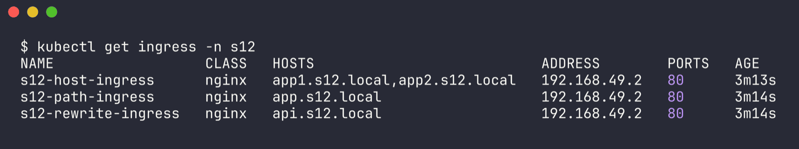
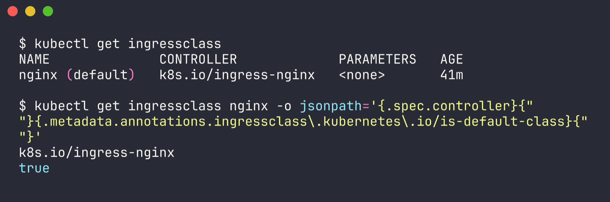
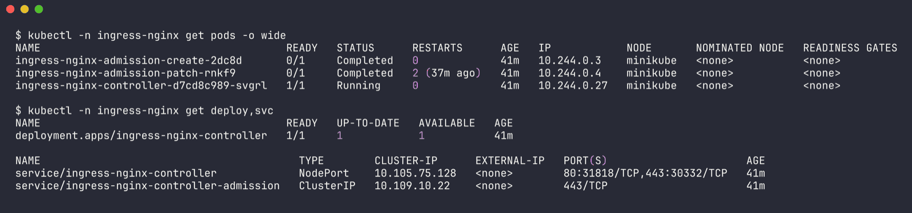
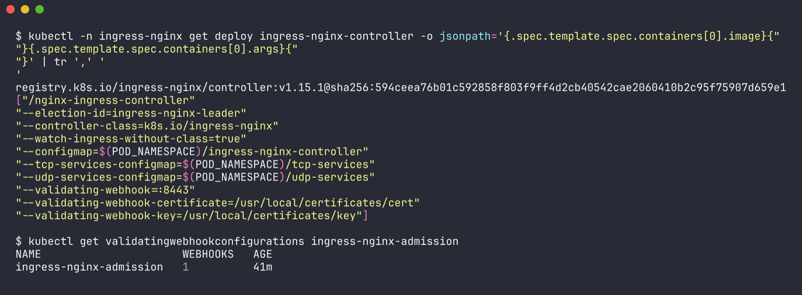
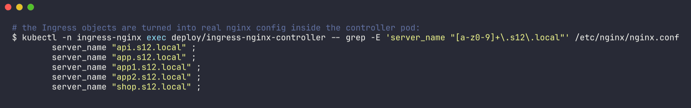
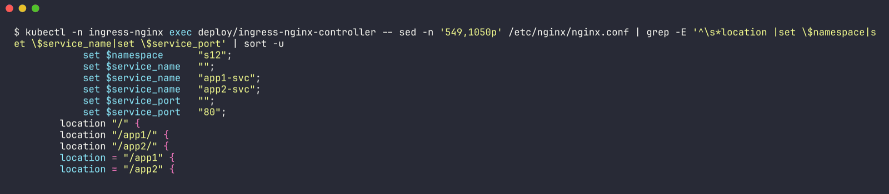
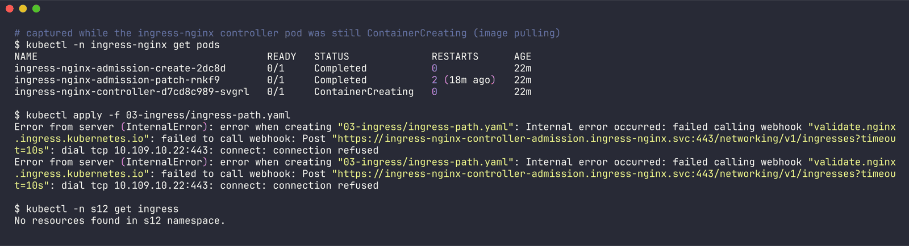
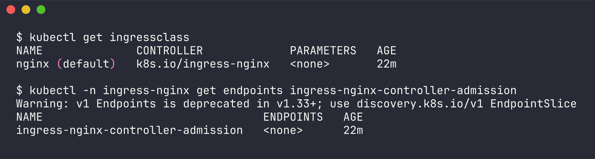

# Ingress vs Ingress Controller

Name: Ridaa Mirza
Enrollment No: 24BCS10394

These two names sound like the same thing, and for the first part of this session I kept mixing them up. Short version: **the Ingress is the rules, the Ingress Controller is the thing that actually follows the rules.** The output below is real, from my minikube cluster (raw: `../outputs/task4-ingressclass-controller.txt` and `../outputs/task4-no-controller.txt`).

## What is an Ingress?

An **Ingress** is a Kubernetes API object (`networking.k8s.io/v1`, kind `Ingress`) - just YAML stored in etcd. It describes **how HTTP/HTTPS traffic from outside the cluster should reach Services inside it**:

- host-based rules (`app1.s12.local` -> `app1-svc`)
- path-based rules (`/app1` -> `app1-svc`, `/app2` -> `app2-svc`)
- TLS (which Secret holds the cert for which host)
- an optional default backend
- `ingressClassName` - which controller should handle it

On its own it does nothing. It doesn't open a port, it doesn't run a process, it doesn't proxy a single packet. It's like a Deployment without a kubelet - just a wish.

Mine, from Task 3:

```bash
kubectl get ingress -n s12
```

```
NAME                  CLASS   HOSTS                           ADDRESS        PORTS   AGE
s12-host-ingress      nginx   app1.s12.local,app2.s12.local   192.168.49.2   80      3m13s
s12-path-ingress      nginx   app.s12.local                   192.168.49.2   80      3m14s
s12-rewrite-ingress   nginx   api.s12.local                   192.168.49.2   80      3m14s
```



The `ADDRESS` column is filled in **by the controller**, not by me - it's the controller announcing "I've picked this one up".

## What is an Ingress Controller?

An **Ingress Controller** is an actual application running in the cluster (normally a Deployment/DaemonSet of reverse-proxy pods plus a Service that exposes them). It:

1. **watches** the API server for Ingress objects (and Services, EndpointSlices, Secrets) whose class it owns,
2. **translates** them into its own proxy config (nginx.conf, Envoy config, HAProxy config, or cloud load balancer API calls),
3. **actually receives the traffic** and proxies it to the pod IPs behind each Service,
4. writes the address back into the Ingress `status`.

Kubernetes itself does **not** ship one - `kube-controller-manager` has no Ingress controller inside. You have to install one. On minikube that's `minikube addons enable ingress`, which installed ingress-nginx into my cluster:

```bash
kubectl get ingressclass
```

```
NAME              CONTROLLER             PARAMETERS   AGE
nginx (default)   k8s.io/ingress-nginx   <none>       41m
```



```bash
kubectl -n ingress-nginx get pods -o wide
kubectl -n ingress-nginx get deploy,svc
```

```
NAME                                       READY   STATUS      RESTARTS      AGE   IP            NODE
ingress-nginx-admission-create-2dc8d       0/1     Completed   0             41m   10.244.0.3    minikube
ingress-nginx-admission-patch-rnkf9        0/1     Completed   2 (37m ago)   41m   10.244.0.4    minikube
ingress-nginx-controller-d7cd8c989-svgrl   1/1     Running     0             41m   10.244.0.27   minikube

NAME                                       READY   UP-TO-DATE   AVAILABLE   AGE
deployment.apps/ingress-nginx-controller   1/1     1            1           41m

NAME                                         TYPE        CLUSTER-IP      EXTERNAL-IP   PORT(S)                      AGE
service/ingress-nginx-controller             NodePort    10.105.75.128   <none>        80:31818/TCP,443:30332/TCP   41m
service/ingress-nginx-controller-admission   ClusterIP   10.109.10.22    <none>        443/TCP                      41m
```



- `ingress-nginx-controller` pod = the real nginx reverse proxy + the Go process that watches the API.
- `admission-create` / `admission-patch` = one-off Jobs that generated the TLS cert for the validating webhook (that's why they're `Completed`).
- `ingress-nginx-controller` Service = the front door. On minikube it's a NodePort; on a cloud cluster it'd be `type: LoadBalancer`.

The controller's args show how it links to the IngressClass:

```
registry.k8s.io/ingress-nginx/controller:v1.15.1@sha256:594c...
"--controller-class=k8s.io/ingress-nginx"       <- matches spec.controller of IngressClass "nginx"
"--watch-ingress-without-class=true"
"--configmap=$(POD_NAMESPACE)/ingress-nginx-controller"
"--validating-webhook=:8443"
```



### Seeing the translation happen

The controller turns my Ingress YAML into actual nginx config inside its pod:

```bash
kubectl -n ingress-nginx exec deploy/ingress-nginx-controller -- grep -E 'server_name "[a-z0-9]+\.s12\.local"' /etc/nginx/nginx.conf
```

```
		server_name "api.s12.local" ;
		server_name "app.s12.local" ;
		server_name "app1.s12.local" ;
		server_name "app2.s12.local" ;
		server_name "shop.s12.local" ;
```



And inside the `app.s12.local` server block (path-based Ingress):

```
			set $namespace      "s12";
			set $service_name   "app1-svc";
			set $service_name   "app2-svc";
			set $service_port   "80";
		location "/" {
		location "/app1/" {
		location "/app2/" {
		location = "/app1" {
		location = "/app2" {
```



So `path: /app1, pathType: Prefix` became two nginx locations (`= /app1` exact and `/app1/` prefix) - which is exactly why `/app1x` returned 404 in Task 3. The `location "/"` is the catch-all that goes to the default backend (empty service name).

### What happens with no working controller

I accidentally got to test this: when I first tried to create my Ingress, the controller pod was still stuck pulling its image (`ContainerCreating`). Result:

```bash
kubectl apply -f 03-ingress/ingress-path.yaml
```

```
Error from server (InternalError): error when creating "03-ingress/ingress-path.yaml": Internal error occurred: failed calling webhook "validate.nginx.ingress.kubernetes.io": failed to call webhook: Post "https://ingress-nginx-controller-admission.ingress-nginx.svc:443/networking/v1/ingresses?timeout=10s": dial tcp 10.109.10.22:443: connect: connection refused
```



```bash
kubectl -n ingress-nginx get endpoints ingress-nginx-controller-admission
```

```
NAME                                 ENDPOINTS   AGE
ingress-nginx-controller-admission   <none>      22m
```



ingress-nginx registers a validating admission webhook, and the webhook is served by the controller pod itself - so with no controller pod, the API server couldn't even validate the Ingress. On a cluster with **no** controller installed at all (no webhook either), the Ingress would be accepted but just sit there with an empty `ADDRESS` forever and nothing would route. Either way: Ingress alone = nothing happens.

## Difference

| | Ingress | Ingress Controller |
|---|---|---|
| What it is | A Kubernetes API **resource** (YAML object) | A running **application** (pods + Service) |
| Kind | `kind: Ingress` (`networking.k8s.io/v1`) | Usually a `Deployment`/`DaemonSet` + `Service` (+ an `IngressClass`) |
| Who writes it | App developers, one per app/team | Platform/cluster admins, usually one or two per cluster |
| Job | Declares routing rules: host, path, TLS, backend Service | Watches Ingresses, generates proxy config, actually serves traffic |
| Built into Kubernetes? | Yes, the API type is built in | **No**, has to be installed (addon, Helm, cloud-managed) |
| Uses resources? | No CPU/memory, it's just data in etcd | Yes, real pods doing L7 proxying |
| Where traffic goes | Nowhere - it never touches a packet | Through it: client -> controller -> pod |
| Analogy | The routing table / rule book | The router / receptionist that reads the rule book |
| Example in my cluster | `s12-path-ingress`, `s12-host-ingress` | `ingress-nginx-controller-d7cd8c989-svgrl` in namespace `ingress-nginx` |
| Linked by | `spec.ingressClassName: nginx` | IngressClass `nginx` with `spec.controller: k8s.io/ingress-nginx` |

## Why do we need both?

- **Separation of concerns.** Developers just write "send `/app1` on `app.s12.local` to `app1-svc`" in a portable, standard format. They don't care whether nginx, Traefik or an AWS ALB implements it.
- **Pluggable implementations.** Kubernetes defines the API but leaves the data plane open, the same way it defines `Service type: LoadBalancer` but lets the cloud provide the LB. You can swap controllers (or run several, picked per Ingress via `ingressClassName`) without rewriting every app's routing.
- **One entry point instead of many LoadBalancers.** Without Ingress, each app needs its own `LoadBalancer` Service (= its own cloud LB, own IP, own bill). With a controller, one LB/IP fronts many hosts and paths, and TLS termination, redirects, rewrites, rate limits etc. happen in one place.
- **Declarative + dynamic.** Because the controller watches the API, adding a new route is just `kubectl apply` - no SSH-ing in to edit nginx.conf and reload. Pods coming and going (scaling, rollouts) are picked up automatically from EndpointSlices.

The rules are useless without something to enforce them, and the proxy has nothing to do without rules - so you always need both.

## Common Ingress Controllers

| Controller | Notes |
|---|---|
| **ingress-nginx** (Kubernetes community) | The one on my minikube (`k8s.io/ingress-nginx`). NGINX-based, configured mostly through `nginx.ingress.kubernetes.io/*` annotations (rewrite-target, ssl-redirect, use-regex...). Very common for on-prem/learning. Note: the community project has announced it is being retired, so new setups are moving to Gateway API implementations. |
| **NGINX Ingress Controller** (F5/NGINX Inc.) | Different project from ingress-nginx despite the name; uses `nginx.org/*` annotations and its own CRDs (VirtualServer). |
| **Traefik** | Default in k3s. Auto-discovers routes, has its own `IngressRoute` CRD, built-in Let's Encrypt, middlewares. |
| **HAProxy Ingress** | HAProxy-based, known for performance and fine-grained load-balancing options. |
| **AWS Load Balancer Controller** (ALB) | On EKS. An Ingress with `ingressClassName: alb` makes it create a real AWS **Application Load Balancer** + target groups. The proxy isn't in the cluster at all - it's AWS infrastructure. |
| **GKE Ingress** (GCE) | Built into GKE; class `gce` creates a Google Cloud HTTP(S) Load Balancer, `gce-internal` for internal LBs. |
| **Azure Application Gateway (AGIC)** | Same idea on AKS with Azure App Gateway. |
| **Contour / Emissary / Istio gateway** | Envoy-based controllers; Istio's ingress gateway if you already run a service mesh. |
| **Kong** | API-gateway style controller with plugins (auth, rate limits). |

The successor API is the **Gateway API** (`GatewayClass` / `Gateway` / `HTTPRoute`), which splits the same idea into more roles (infra owner vs app owner), but the same split applies there: the routes are just objects, and an implementation (controller) still has to be running to make them do anything.
