# Session 12 - Troubleshooting ConfigMaps, Secrets & Ingress

Name: Ridaa Mirza
Enrollment No: 24BCS10394

Everything here ran in its own namespace `s12-trouble` (scenario 5 deploys its own small app there too). Every scenario folder has a `broken.yaml` and a `fixed.yaml` (scenario 1 uses the instructor's file as-is plus fix files), and the raw terminal output for each one is in `../outputs/trouble*.txt`.

The general order I check things in, which worked for all five:

```bash
kubectl get pods                 # STATUS column tells you which family of problem it is
kubectl describe pod <pod>       # Events at the bottom almost always name the exact problem
kubectl logs <pod>               # only useful once the container actually started
kubectl get cm/secret <name> -o yaml   # compare what you referenced with what exists
kubectl exec <pod> -- env / cat / od -c   # see what the app really received
```

| # | Scenario | Symptom | Root cause |
|---|----------|---------|------------|
| 1 | Instructor's `app/backend-with-config.yaml` | `CreateContainerConfigError` | ConfigMap + Secret it references don't exist in that namespace |
| 2 | Missing ConfigMap key | `CreateContainerConfigError` | `configMapKeyRef.key` typo |
| 3 | Instructor's `secret-base64-gotcha.md` | Pod Running, but "password authentication failed" | `echo` without `-n` put a `\n` inside the secret |
| 4 | Double base64 | Pod Running, but WRONGPASS | already-encoded value placed under `stringData` |
| 5 | Ingress -> wrong Service port | HTTP 503 from ingress-nginx | Ingress backend port 8080, Service only exposes 80 |

---

## Scenario 1 - The instructor's `app/backend-with-config.yaml`

Files: `scenario1-instructor-app/backend-with-config.yaml` (copied unchanged from `nency/session-12-ingress-configmaps-secrets/app/`), `scenario1-instructor-app/fix-config-and-secret.yaml`, `scenario1-instructor-app/backend-with-config.fixed.yaml`. Raw output: `../outputs/trouble1-instructor-app.txt`.

This Deployment pulls **all** its config in with `envFrom` (`configMapRef: yatri-app-config` + `secretRef: yatri-db-secret`). I applied it as-is into the fresh `s12-trouble` namespace - the realistic mistake of deploying the app before (or in a different namespace from) its config.

### Identify

```bash
$ kubectl -n s12-trouble get deploy yatri-backend
NAME            READY   UP-TO-DATE   AVAILABLE   AGE
yatri-backend   0/2     2            0           20m

$ kubectl -n s12-trouble get pods -l app=yatri-backend
NAME                             READY   STATUS                       RESTARTS   AGE
yatri-backend-679fbcd789-bpjlw   0/1     CreateContainerConfigError   0          4m33s
yatri-backend-679fbcd789-qq9m9   0/1     CreateContainerConfigError   0          4m33s
```

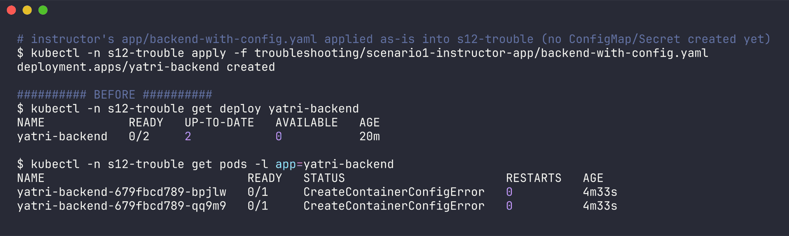

(The 20 minutes is because the whole shared minikube's image pulls were stuck in a queue behind someone else's big image - once the python image actually arrived, the real error showed up.)

### Troubleshooting commands

```bash
$ kubectl -n s12-trouble describe pod yatri-backend-679fbcd789-bpjlw
    Environment Variables from:
      yatri-app-config  ConfigMap  Optional: false
      yatri-db-secret   Secret     Optional: false
...
  Normal   Pulled     30s               kubelet  spec.containers{backend}: Successfully pulled image "python:3.11-alpine3.19" in 3.29s (4m2.556s including waiting). Image size: 22329854 bytes.
  Warning  Failed     6s (x4 over 30s)  kubelet  spec.containers{backend}: Error: configmap "yatri-app-config" not found

$ kubectl -n s12-trouble get configmap,secret
NAME                         DATA   AGE
configmap/kube-root-ca.crt   1      29m
configmap/orders-config      2      20m
configmap/shop-nginx-conf    1      52s

NAME                  TYPE     DATA   AGE
secret/pg-secret      Opaque   1      19m
secret/redis-secret   Opaque   1      18m

$ kubectl get configmap -A --field-selector metadata.name=yatri-app-config
No resources found

$ kubectl -n s12-trouble logs yatri-backend-679fbcd789-bpjlw
Error from server (BadRequest): container "backend" in pod "yatri-backend-679fbcd789-bpjlw" is waiting to start: CreateContainerConfigError
```

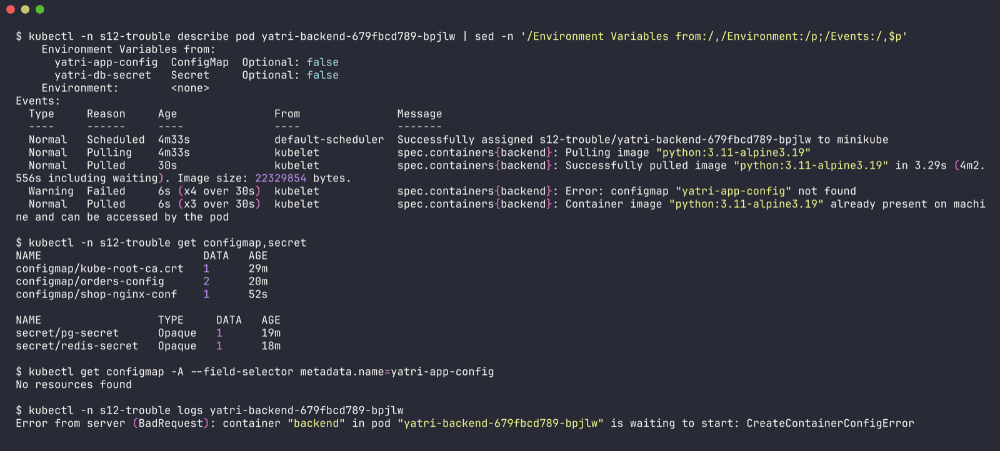

`describe` shows both sources as `Optional: false`, and the event names the first missing one. Only the ConfigMap is mentioned because the kubelet stops at the first error - the Secret is missing too, which you only find by listing what's actually in the namespace.

### Root cause

ConfigMaps and Secrets are **namespaced**. The pod can only reference ones in its own namespace, and both `yatri-app-config` and `yatri-db-secret` didn't exist in `s12-trouble`. Non-optional `envFrom` sources that are missing block container creation.

### Fix

Create both objects in the same namespace (`fix-config-and-secret.yaml` - ConfigMap keys copied from the instructor's `01-configmap/app-config.yaml`, Secret with fake values via `stringData`):

```bash
$ kubectl apply -f scenario1-instructor-app/fix-config-and-secret.yaml
configmap/yatri-app-config created
secret/yatri-db-secret created
```

No restart needed - the kubelet keeps retrying `CreateContainerConfigError` on its own:

```bash
$ kubectl -n s12-trouble rollout status deploy/yatri-backend --timeout=120s
Waiting for deployment "yatri-backend" rollout to finish: 0 of 2 updated replicas are available...
Waiting for deployment "yatri-backend" rollout to finish: 1 of 2 updated replicas are available...
deployment "yatri-backend" successfully rolled out
```

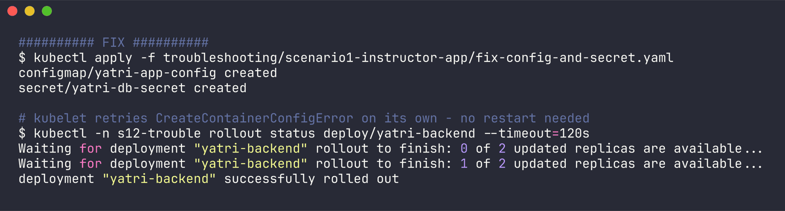

### After

```bash
$ kubectl -n s12-trouble get pods -l app=yatri-backend
NAME                             READY   STATUS    RESTARTS   AGE
yatri-backend-679fbcd789-bpjlw   1/1     Running   0          4m44s
yatri-backend-679fbcd789-qq9m9   1/1     Running   0          4m44s

$ kubectl -n s12-trouble exec deploy/yatri-backend -- env | grep -E 'ENVIRONMENT|LOG_LEVEL|DEFAULT_CURRENCY|POSTGRES_' | sort
DEFAULT_CURRENCY=INR
ENVIRONMENT=production
LOG_LEVEL=INFO
POSTGRES_DB=yatri_production_db
POSTGRES_PASSWORD=demo-password-not-real
POSTGRES_USER=yatri_admin
```

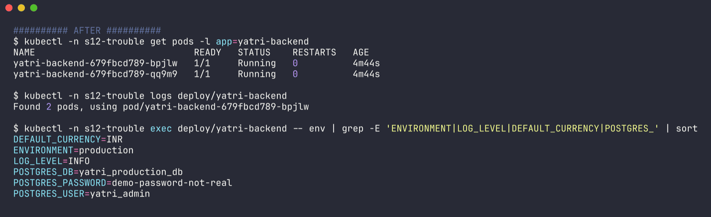

### Bonus bug in the same file: Running, but `kubectl logs` is empty

The app is supposed to print `Running with ENV=... and USER=...`, but:

```bash
$ kubectl -n s12-trouble logs deploy/yatri-backend | wc -c
Found 2 pods, using pod/yatri-backend-679fbcd789-bpjlw
       0

$ kubectl -n s12-trouble exec deploy/yatri-backend -- ps
PID   USER     TIME  COMMAND
    1 root      0:00 python3 -c import os, time; print(f'Running with ENV={os.getenv("ENVIRONMENT")} and USER={os.getenv("POSTGRES_USER")}'); time.sleep(3600)
```

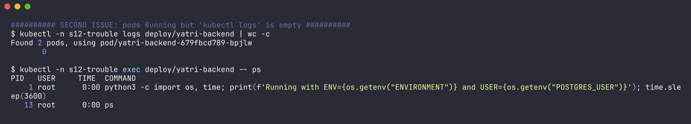

The process is alive, so the print did run. **Root cause:** Python block-buffers stdout when it isn't a terminal (and in a container it's a pipe), so the line sits in the buffer until the process exits - which is after `sleep(3600)`. **Fix** (`backend-with-config.fixed.yaml`):

```diff
+          env:
+            - name: PYTHONUNBUFFERED
+              value: "1"
```

(`python3 -u` or `print(..., flush=True)` would also work.)

```bash
$ kubectl -n s12-trouble apply -f scenario1-instructor-app/backend-with-config.fixed.yaml
deployment.apps/yatri-backend configured

$ kubectl -n s12-trouble logs -l app=yatri-backend --prefix
[pod/yatri-backend-76475cff4b-9jqpx/backend] Running with ENV=production and USER=yatri_admin
[pod/yatri-backend-76475cff4b-l5k4k/backend] Running with ENV=production and USER=yatri_admin
```

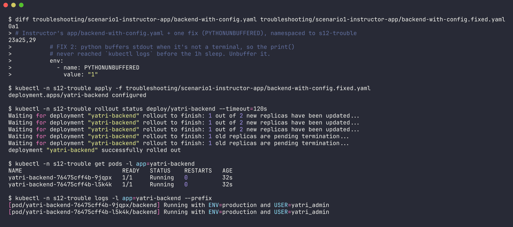

---

## Scenario 2 - Pod references a ConfigMap key that doesn't exist

Files: `scenario2-missing-cm-key/broken.yaml`, `scenario2-missing-cm-key/fixed.yaml`. Raw output: `../outputs/trouble2-missing-cm-key.txt`.

The ConfigMap `orders-config` has `DB_URL`, but the pod asks for `DATABASE_URL`. Classic rename-in-one-place-only bug.

### Identify

```bash
$ kubectl -n s12-trouble get pod orders-api
NAME         READY   STATUS                       RESTARTS   AGE
orders-api   0/1     CreateContainerConfigError   0          15s
```

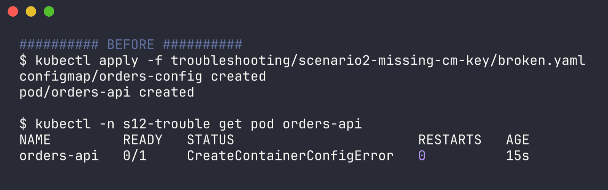

### Troubleshooting commands

```bash
$ kubectl -n s12-trouble describe pod orders-api
    State:          Waiting
      Reason:       CreateContainerConfigError
...
  Normal   Pulled     14s (x2 over 14s)  kubelet  spec.containers{api}: Container image "busybox:latest" already present on machine and can be accessed by the pod
  Warning  Failed     14s (x2 over 14s)  kubelet  spec.containers{api}: Error: couldn't find key DATABASE_URL in ConfigMap s12-trouble/orders-config

$ kubectl -n s12-trouble get configmap orders-config -o jsonpath='{.data}'
{"DB_URL":"postgres://orders-db:5432/orders","LOG_LEVEL":"WARN"}

$ kubectl -n s12-trouble logs orders-api
Error from server (BadRequest): container "api" in pod "orders-api" is waiting to start: CreateContainerConfigError
```

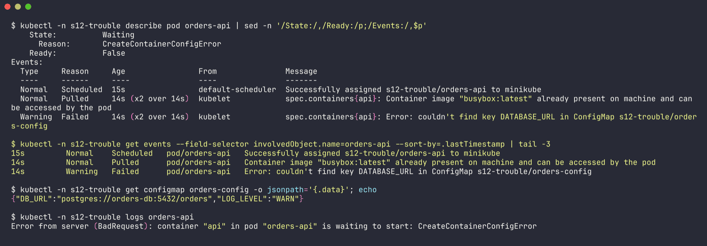

`logs` is useless here because the container never started - the image pulled fine, but the kubelet couldn't build the container's env. The event message names both the key and the ConfigMap, so comparing it with the actual `.data` keys gives it away immediately.

### Root cause

`configMapKeyRef.key: DATABASE_URL` - the key in the ConfigMap is `DB_URL`. A missing key (or a missing ConfigMap) for a non-optional reference blocks container creation.

### Fix

```diff
-              key: DATABASE_URL        # <-- typo: key does not exist
+              key: DB_URL               # <-- fixed
```

Pod `env` is immutable, so I deleted the pod and re-applied. (Other valid fixes: add the `DATABASE_URL` key to the ConfigMap, or mark the reference `optional: true` if the app can cope without it.)

### After

```bash
$ kubectl -n s12-trouble get pod orders-api
NAME         READY   STATUS    RESTARTS   AGE
orders-api   1/1     Running   0          1s

$ kubectl -n s12-trouble logs orders-api
DATABASE_URL=postgres://orders-db:5432/orders
```

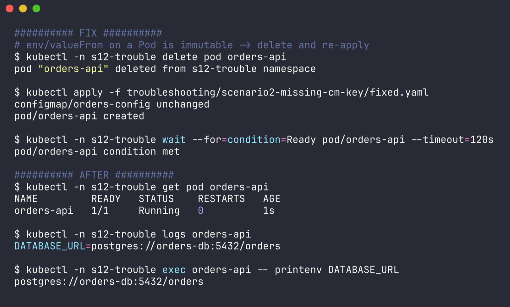

---

## Scenario 3 - The trailing-newline Secret (instructor's `secret-base64-gotcha.md`)

Files: `scenario3-newline-base64/broken.yaml`, `scenario3-newline-base64/fixed.yaml`. Raw output: `../outputs/trouble3-newline-base64.txt`.

I reproduced the instructor's incident for real: the Secret value was generated with `echo "mypassword" | base64` (no `-n`), and a tiny busybox "client" compares the mounted password with what the "database" expects, printing the same kind of FATAL message Postgres would.

### Identify

The nasty part: nothing looks broken at the Kubernetes level.

```bash
$ kubectl -n s12-trouble get pod pg-client
NAME        READY   STATUS    RESTARTS   AGE
pg-client   1/1     Running   0          1s

$ kubectl -n s12-trouble logs pg-client
FATAL: password authentication failed (got 11 bytes)
```

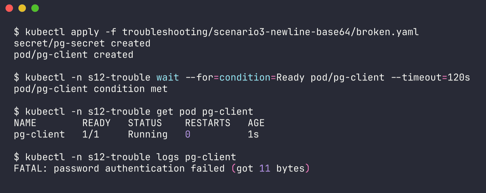

### Troubleshooting commands

```bash
$ echo "mypassword" | xxd
00000000: 6d79 7061 7373 776f 7264 0a              mypassword.

$ echo "mypassword" | base64
bXlwYXNzd29yZAo=
$ echo -n "mypassword" | base64
bXlwYXNzd29yZA==

$ kubectl -n s12-trouble describe secret pg-secret
Data
====
POSTGRES_PASSWORD:  11 bytes          <-- "mypassword" is 10

$ kubectl -n s12-trouble get secret pg-secret -o jsonpath='{.data.POSTGRES_PASSWORD}' | base64 --decode | xxd
00000000: 6d79 7061 7373 776f 7264 0a              mypassword.

$ kubectl -n s12-trouble exec pg-client -- od -c /etc/pg/POSTGRES_PASSWORD
0000000   m   y   p   a   s   s   w   o   r   d  \n
0000013
```

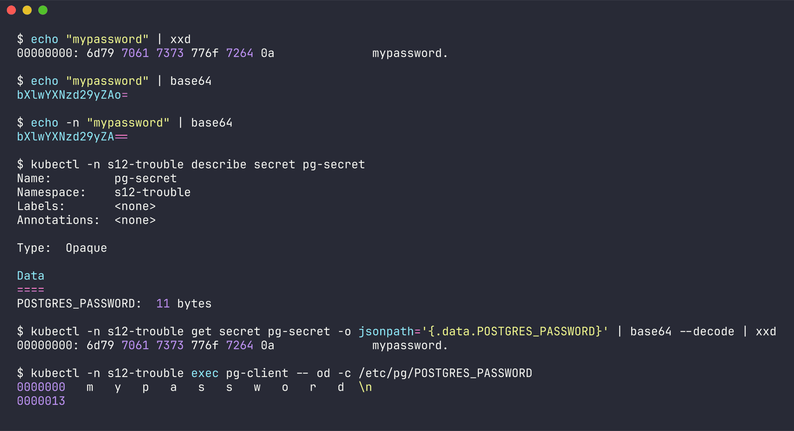

`describe secret` showing **11 bytes** for a 10-character password is the quickest tell. `xxd` / `od -c` then show the `0a` / `\n` at the end. Another hint straight from the instructor note: base64 of a newline-terminated value tends to end in `o=` / `K` instead of a clean `==`.

### Root cause

`echo` appends `\n`. It gets base64-encoded into the Secret, then decoded back into the file/env var, so the app sends `mypassword\n` to the database.

### Fix

```diff
-  POSTGRES_PASSWORD: bXlwYXNzd29yZAo=
+  POSTGRES_PASSWORD: bXlwYXNzd29yZA==
```

i.e. generate with `echo -n` (or `printf '%s'`), or better yet use `stringData:` / `kubectl create secret --from-literal` and let Kubernetes do the encoding. Then restart the pod so the app re-reads it.

### After

```bash
$ kubectl -n s12-trouble describe secret pg-secret
POSTGRES_PASSWORD:  10 bytes

$ kubectl -n s12-trouble exec pg-client -- od -c /etc/pg/POSTGRES_PASSWORD
0000000   m   y   p   a   s   s   w   o   r   d
0000012

$ kubectl -n s12-trouble logs pg-client
auth OK
```

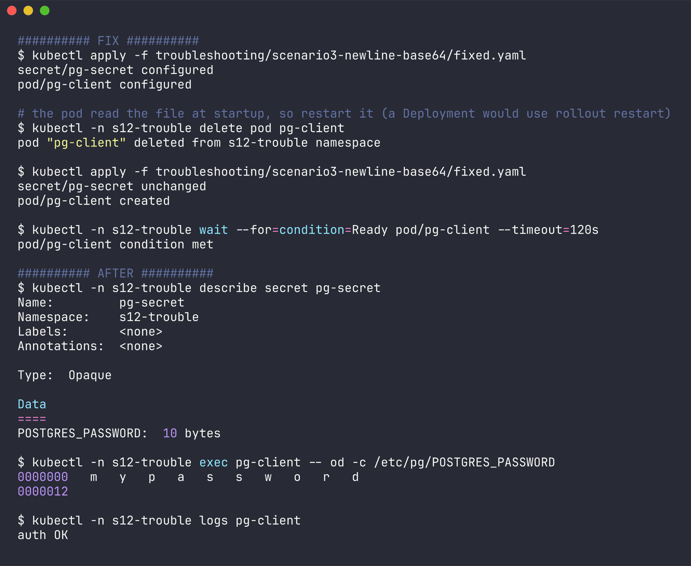

---

## Scenario 4 - Secret value double-base64-encoded

Files: `scenario4-double-base64/broken.yaml`, `scenario4-double-base64/fixed.yaml`. Raw output: `../outputs/trouble4-double-base64.txt`.

Someone knew "Secrets are base64", so they encoded the password by hand... and then put it under `stringData:`, which is the plain-text field. Kubernetes encodes it a second time.

### Identify

Again the pod is perfectly `Running`, the app just can't log in:

```bash
$ kubectl -n s12-trouble logs cache-client
(error) WRONGPASS invalid username-password pair
```

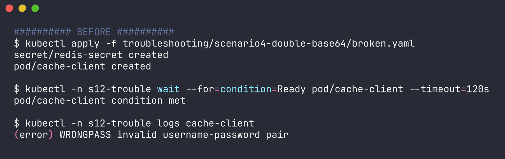

### Troubleshooting commands

```bash
$ kubectl -n s12-trouble exec cache-client -- printenv REDIS_PASSWORD
ZGVtby1yZWRpcy1wYXNzLW5vdC1yZWFs          <-- the app got a base64 string, not a password

$ kubectl -n s12-trouble get secret redis-secret -o jsonpath='{.data.REDIS_PASSWORD}'
WkdWdGJ5MXlaV1JwY3kxd1lYTnpMVzV2ZEMxeVpXRnM=

$ ... | base64 --decode
ZGVtby1yZWRpcy1wYXNzLW5vdC1yZWFs

$ ... | base64 --decode | base64 --decode
demo-redis-pass-not-real                   <-- needed TWO decodes = encoded twice
```

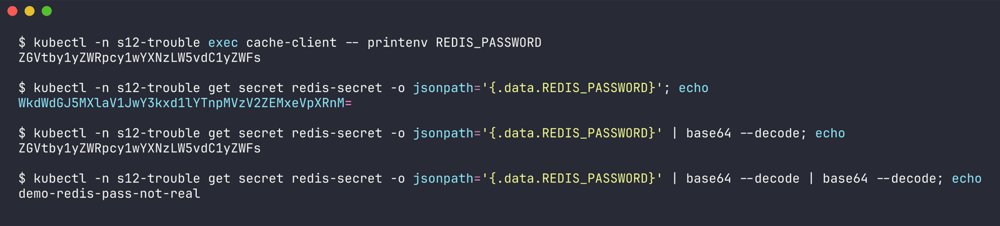

### Root cause

`stringData` values are taken literally and encoded once by the API server. Putting an already-encoded value there means the stored `.data` is base64(base64(password)), and the container receives base64(password).

### Fix

```diff
-  REDIS_PASSWORD: "ZGVtby1yZWRpcy1wYXNzLW5vdC1yZWFs"     # <-- already base64, should be plain text here
+  REDIS_PASSWORD: "demo-redis-pass-not-real"
```

Rule of thumb: `stringData:` = plain text, `data:` = base64 exactly once. Never both on the same value. Restart the pod afterwards (env vars are only read at start).

### After

```bash
$ kubectl -n s12-trouble get secret redis-secret -o jsonpath='{.data.REDIS_PASSWORD}'
ZGVtby1yZWRpcy1wYXNzLW5vdC1yZWFs
$ kubectl -n s12-trouble exec cache-client -- printenv REDIS_PASSWORD
demo-redis-pass-not-real
$ kubectl -n s12-trouble logs cache-client
redis AUTH OK
```

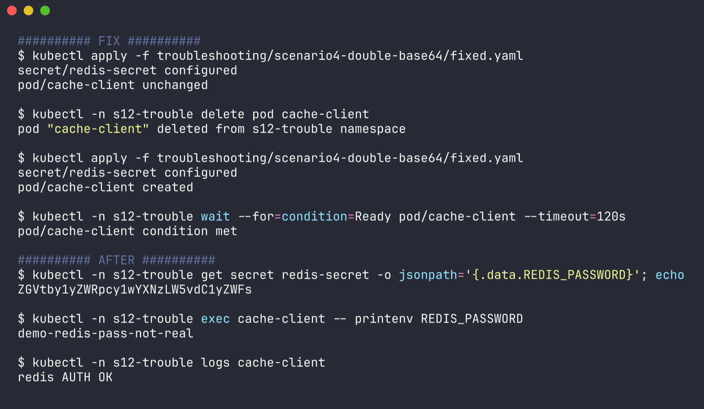

---

## Scenario 5 - Ingress pointing at the wrong Service port -> 503

Files: `scenario5-ingress-wrong-port/app.yaml` (nginx Deployment + `shop-svc` on port 80), `broken.yaml`, `fixed.yaml`. Raw output: `../outputs/trouble5-ingress-wrong-port.txt`.

The Ingress for `shop.s12.local` sends traffic to `shop-svc` port **8080** - someone put "the usual app port" in, but the Service only exposes **80**. Tested through the ingress controller with `kubectl -n ingress-nginx port-forward svc/ingress-nginx-controller 18120:80`.

### Identify

```bash
$ curl -s -i -H 'Host: shop.s12.local' localhost:18120/ | head -1
HTTP/1.1 503 Service Temporarily Unavailable

$ curl -s -H 'Host: shop.s12.local' localhost:18120/
<html>
<head><title>503 Service Temporarily Unavailable</title></head>
<body>
<center><h1>503 Service Temporarily Unavailable</h1></center>
<hr><center>nginx</center>
</body>
</html>
```

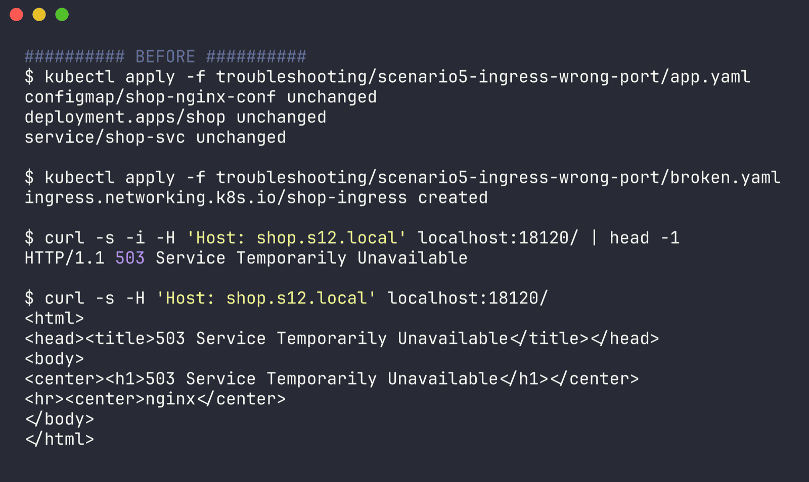

A 503 from the ingress means "I found a matching rule, but there's nothing healthy behind it" (vs. 404 = no rule matched the host/path at all).

### Troubleshooting commands

```bash
$ kubectl -n s12-trouble get pods -l app=shop
NAME                    READY   STATUS    RESTARTS   AGE
shop-855d7875d5-9tfmz   1/1     Running   0          32s          <- the app itself is fine

$ kubectl -n s12-trouble describe ingress shop-ingress
Rules:
  Host            Path  Backends
  ----            ----  --------
  shop.s12.local
                  /   shop-svc:8080 ()                          <- empty endpoint list!

$ kubectl -n s12-trouble get svc shop-svc
NAME       TYPE        CLUSTER-IP       EXTERNAL-IP   PORT(S)   AGE
shop-svc   ClusterIP   10.101.153.148   <none>        80/TCP    32s

$ kubectl -n s12-trouble get endpointslices -l kubernetes.io/service-name=shop-svc
NAME             ADDRESSTYPE   PORTS   ENDPOINTS      AGE
shop-svc-bnlvr   IPv4          80      10.244.0.226   32s

$ kubectl -n ingress-nginx logs deploy/ingress-nginx-controller --tail=300 | grep shop
127.0.0.1 - - [07/Oct/2026:11:27:49 +0000] "GET / HTTP/1.1" 503 190 "-" "curl/8.7.1" 77 0.000 [s12-trouble-shop-svc-8080] [] - - - - 5413d29e78c52d07c5a82eba8287a739
```

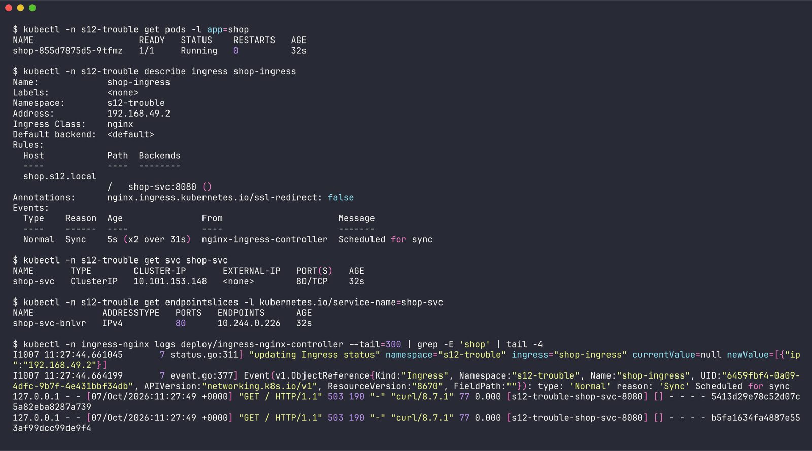

The key clue is in `describe ingress`: `shop-svc:8080 ()` - the parentheses are where the pod IPs normally appear (compare `app1-svc:80 (10.244.0.85:80,10.244.0.84:80)` in Task 3). The Service and its EndpointSlice are fine and have a pod on port 80, and the controller log shows the upstream `[s12-trouble-shop-svc-8080]` with `-` for the upstream address, i.e. it had nowhere to send the request.

### Root cause

`backend.service.port.number` in an Ingress must be a port **of the Service** (`spec.ports[].port`), not the container port and not a guess. `shop-svc` has no port 8080, so the controller has zero endpoints for that backend and answers 503 itself.

### Fix

```diff
-                  number: 8080      # <-- wrong: Service port is 80
+                  number: 80
```

(Using a named port - `port: { name: http }` - avoids this kind of mismatch.)

```bash
$ kubectl apply -f scenario5-ingress-wrong-port/fixed.yaml
ingress.networking.k8s.io/shop-ingress configured
```

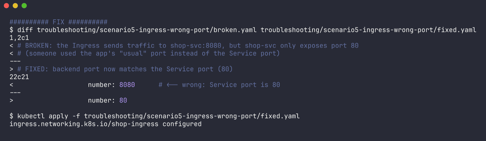

### After

```bash
$ kubectl -n s12-trouble describe ingress shop-ingress
                  /   shop-svc:80 (10.244.0.226:80)

$ curl -s -i -H 'Host: shop.s12.local' localhost:18120/ | head -1
HTTP/1.1 200 OK

$ curl -s -H 'Host: shop.s12.local' localhost:18120/
Hello from shop
pod=shop-855d7875d5-9tfmz uri=/
```

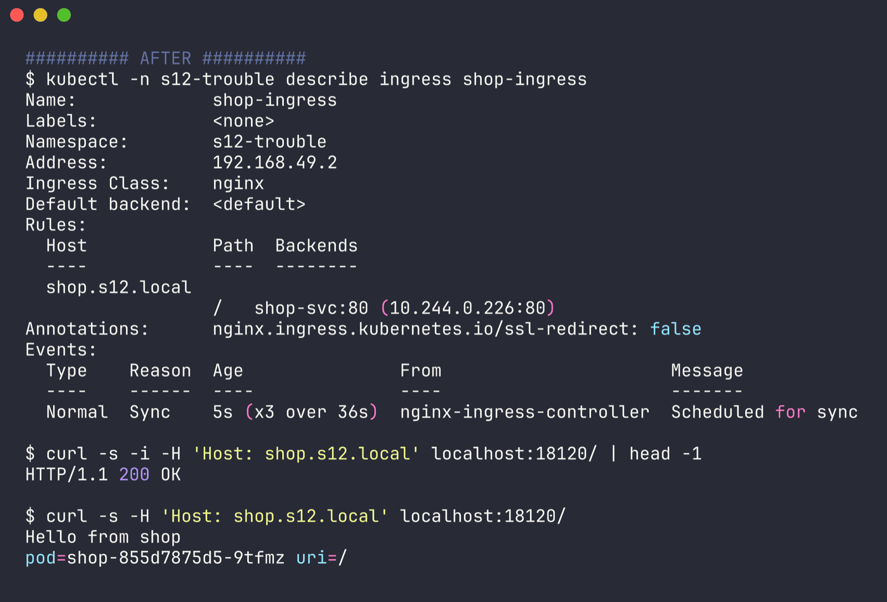

---

## Quick reference I'll keep

| Symptom | First thing to check |
|---|---|
| `CreateContainerConfigError` | `describe pod` events -> missing ConfigMap/Secret or key; check namespace |
| Running but app says auth failed | `describe secret` byte counts, `exec ... od -c` the value - newline / double-encoding |
| Changed ConfigMap, app didn't notice | env var? needs restart. Volume? wait for kubelet sync + app must re-read. `subPath`? never updates |
| Ingress 404 | host/path doesn't match any rule (or wrong `ingressClassName`) |
| Ingress 503 | rule matched but no endpoints: wrong Service name/port, selector mismatch, pods not Ready |
| Ingress apply fails with webhook error | controller pod not running (admission webhook has no endpoints) |
