# Session 13 - Kubernetes Volumes & Storage

Name: Ridaa Mirza
Enrollment No: 24BCS10394

Everything here was run on a local minikube (docker driver, single node, containerd runtime). All my objects live in the `s13` namespace. Raw terminal output for every step is in `outputs/`, I've pasted the important bits below instead of screenshots.

```
01-kubernetes-volumes/
├── namespace.yaml          # s13
├── emptydir-pod.yaml       # 2 containers sharing one emptyDir
├── hostpath-pod.yaml       # folder on the node mounted into a pod
├── pv.yaml                 # static PersistentVolume (Retain)
├── pvc.yaml                # claim that binds to that PV
├── pod-static-pvc.yaml     # pod using the static claim
├── dynamic-pvc.yaml        # claim against the "standard" StorageClass
├── pod-dynamic-pvc.yaml    # pod using the dynamic claim
└── outputs/                # raw command output
```

## Why volumes at all

A container's filesystem is thrown away every time the container restarts. Kubernetes volumes fix that at different levels:

| Type | Lives as long as | Typical use |
| --- | --- | --- |
| `emptyDir` | the pod (survives container restarts, gone when pod is deleted) | scratch space, sharing files between containers in one pod |
| `hostPath` | the node's disk | node agents, log collectors, quick local testing. Ties the pod to that node, not for real apps |
| `PersistentVolume` (PV) | independent of any pod - it's a cluster object | actual app data (DBs, uploads) |
| `PersistentVolumeClaim` (PVC) | until the claim is deleted | the "request" a pod uses to get a PV, so the pod doesn't care where the storage physically is |
| `StorageClass` | cluster object | describes *how* to create PVs on demand (provisioner, reclaim policy, binding mode) -> dynamic provisioning |

The way I think about it: admin (or a provisioner) creates **PVs**, developers create **PVCs**, pods only ever mention the PVC.

## Task 1 - emptyDir shared between two containers

`emptydir-pod.yaml` has a `writer` (busybox) appending a line every 5s into `/shared/index.html`, and a `reader` (nginx) that mounts the **same** emptyDir at `/usr/share/nginx/html` - so nginx ends up serving whatever busybox writes.

```bash
kubectl apply -f namespace.yaml
kubectl apply -f emptydir-pod.yaml
kubectl get pod emptydir-demo -n s13 -o wide
```

```
NAME            READY   STATUS    RESTARTS   AGE   IP            NODE       NOMINATED NODE   READINESS GATES
emptydir-demo   2/2     Running   0          14m   10.244.0.10   minikube   <none>           <none>
```

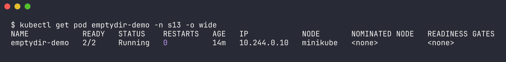

(the 14m age is because the busybox image pull was really slow on the shared cluster)

Reading the writer's file from the **reader** container:

```bash
kubectl exec -n s13 emptydir-demo -c reader -- cat /usr/share/nginx/html/index.html | head -5
```

```
written by writer at Wed Oct  7 11:05:28 UTC 2026
written by writer at Wed Oct  7 11:05:33 UTC 2026
written by writer at Wed Oct  7 11:05:38 UTC 2026
written by writer at Wed Oct  7 11:05:43 UTC 2026
```

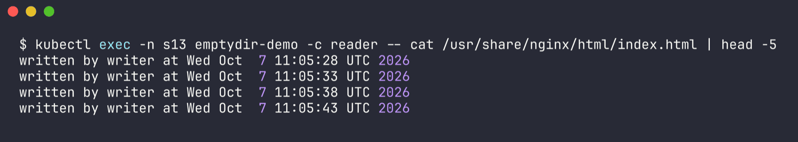

And the other direction - reader writes, writer sees it:

```bash
kubectl exec -n s13 emptydir-demo -c reader -- sh -c 'echo hello-from-reader > /usr/share/nginx/html/from-reader.txt'
kubectl exec -n s13 emptydir-demo -c writer -- cat /shared/from-reader.txt
```

```
hello-from-reader
```

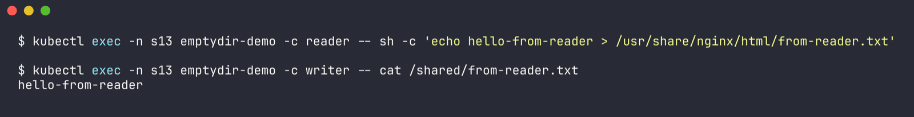

```bash
kubectl exec -n s13 emptydir-demo -c writer -- ls -la /shared
```

```
total 16
drwxrwxrwx    2 root     root          4096 Oct  7 11:05 .
drwxr-xr-x    1 root     root          4096 Oct  7 11:05 ..
-rw-r--r--    1 root     root            18 Oct  7 11:05 from-reader.txt
-rw-r--r--    1 root     root           200 Oct  7 11:05 index.html
```

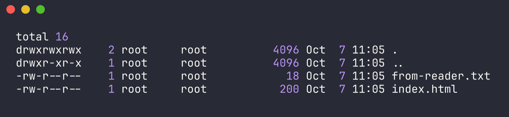

Then I deleted the pod and created it again:

```bash
kubectl delete pod emptydir-demo -n s13
kubectl apply -f emptydir-pod.yaml
kubectl exec -n s13 emptydir-demo -c writer -- ls -la /shared
kubectl exec -n s13 emptydir-demo -c writer -- cat /shared/from-reader.txt
```

```
total 12
drwxrwxrwx    2 root     root          4096 Oct  7 11:06 .
drwxr-xr-x    1 root     root          4096 Oct  7 11:06 ..
-rw-r--r--    1 root     root            50 Oct  7 11:06 index.html

cat: can't open '/shared/from-reader.txt': No such file or directory
command terminated with exit code 1
```

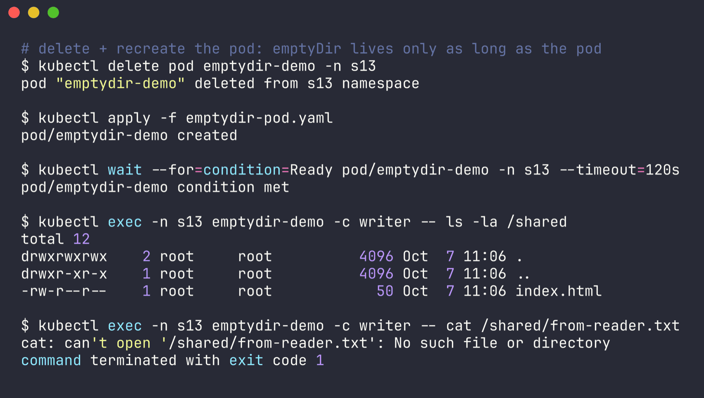

Observation: emptyDir is great for sharing between containers in the *same* pod, but it's tied to the pod's life. New pod = brand new empty directory. Full output: `outputs/01-emptydir.txt`.

## Task 2 - hostPath

`hostpath-pod.yaml` mounts `/tmp/s13-hostpath-data` from the minikube node (`type: DirectoryOrCreate` so the folder gets created if missing).

```bash
kubectl apply -f hostpath-pod.yaml
kubectl exec -n s13 hostpath-demo -- sh -c 'echo "written from pod hostpath-demo" > /data/note.txt'

# the "host" here is the minikube node container, so look inside it
minikube ssh -- 'ls -la /tmp/s13-hostpath-data && cat /tmp/s13-hostpath-data/note.txt'
```

```
total 4
drwxr-xr-x 2 root root  60 Oct  7 11:06 .
drwxrwxrwt 6 root root 160 Oct  7 11:06 ..
-rw-r--r-- 1 root root  31 Oct  7 11:06 note.txt
written from pod hostpath-demo
```

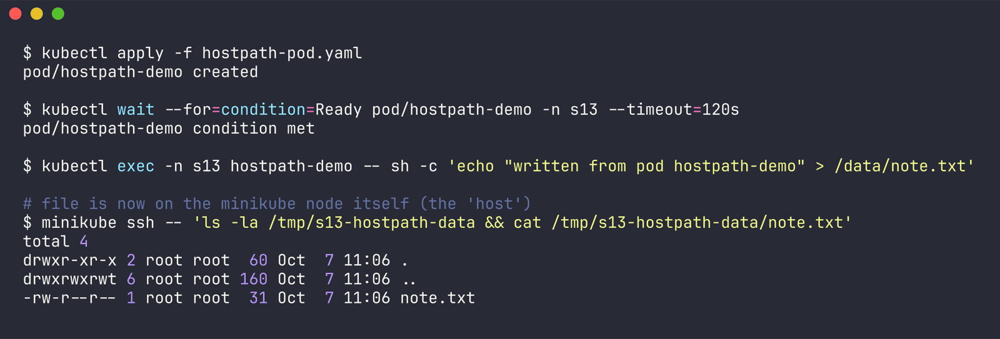

Delete + recreate the pod, file is still there because it's on the node, not in the pod:

```bash
kubectl delete pod hostpath-demo -n s13
kubectl apply -f hostpath-pod.yaml
kubectl exec -n s13 hostpath-demo -- cat /data/note.txt
```

```
written from pod hostpath-demo
```

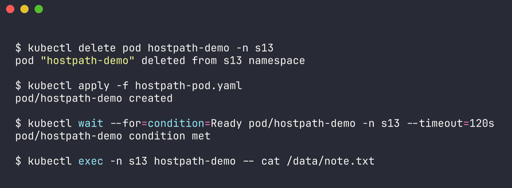

Observation: survives pod deletion, but only works because minikube has one node. On a real multi-node cluster the pod could land on a different node and see an empty folder. Also it gives the pod direct access to the node's filesystem, which is a security risk - that's why it's usually only allowed for system stuff. Full output: `outputs/02-hostpath.txt`.

## Task 3 - Static PersistentVolume + PersistentVolumeClaim

Here I create the PV by hand (`pv.yaml`, 1Gi, `Retain`) and then a PVC asking for 500Mi (`pvc.yaml`).

One gotcha I hit while reading the class files: minikube has a **default** StorageClass (`standard`). A PVC with no `storageClassName` gets the default class and minikube would just dynamically create a new volume instead of using my PV. So both my PV and PVC set `storageClassName: s13-manual` - there's no provisioner for that name, it's only used for matching.

```bash
kubectl apply -f pv.yaml
kubectl get pv s13-student-pv
```

```
NAME             CAPACITY   ACCESS MODES   RECLAIM POLICY   STATUS      CLAIM   STORAGECLASS   VOLUMEATTRIBUTESCLASS   REASON   AGE
s13-student-pv   1Gi        RWO            Retain           Available           s13-manual     <unset>                          0s
```

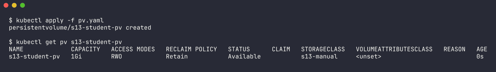

```bash
kubectl apply -f pvc.yaml
kubectl get pvc student-pvc -n s13
kubectl get pv s13-student-pv
```

```
NAME          STATUS   VOLUME           CAPACITY   ACCESS MODES   STORAGECLASS   VOLUMEATTRIBUTESCLASS   AGE
student-pvc   Bound    s13-student-pv   1Gi        RWO            s13-manual     <unset>                 3s

NAME             CAPACITY   ACCESS MODES   RECLAIM POLICY   STATUS   CLAIM             STORAGECLASS   VOLUMEATTRIBUTESCLASS   REASON   AGE
s13-student-pv   1Gi        RWO            Retain           Bound    s13/student-pvc   s13-manual     <unset>                          3s
```

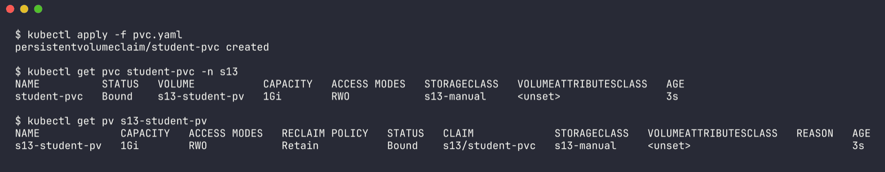

PV went `Available` -> `Bound`. Notice the claim asked for 500Mi but shows 1Gi - a PVC binds to a whole PV, it doesn't slice it.

### Data surviving pod deletion

```bash
kubectl apply -f pod-static-pvc.yaml
kubectl exec -n s13 storage-demo -- sh -c 'echo "Student: Ridaa Mirza (24BCS10394)" > /data/student.txt; date >> /data/student.txt'
kubectl exec -n s13 storage-demo -- cat /data/student.txt
```

```
Student: Ridaa Mirza (24BCS10394)
Wed Oct  7 11:06:35 UTC 2026
```

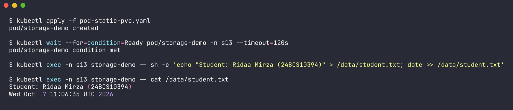

```bash
kubectl delete pod storage-demo -n s13
kubectl get pvc student-pvc -n s13          # still Bound, the claim doesn't care that the pod is gone
kubectl apply -f pod-static-pvc.yaml        # brand new pod
kubectl exec -n s13 storage-demo -- cat /data/student.txt
```

```
NAME          STATUS   VOLUME           CAPACITY   ACCESS MODES   STORAGECLASS   VOLUMEATTRIBUTESCLASS   AGE
student-pvc   Bound    s13-student-pv   1Gi        RWO            s13-manual     <unset>                 5s

Student: Ridaa Mirza (24BCS10394)
Wed Oct  7 11:06:35 UTC 2026
```

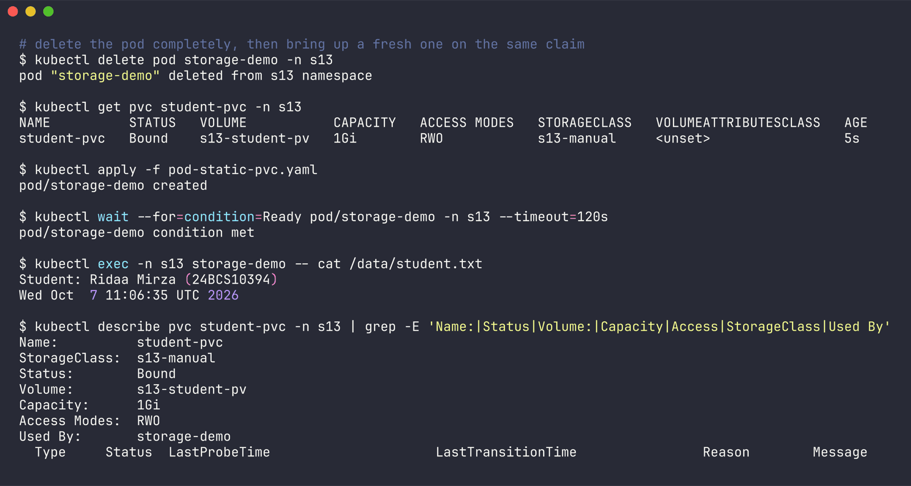

Same timestamp as before, so it's the same file, not a re-write. Full output: `outputs/03-static-pv-pvc.txt`.

### Retain reclaim policy in action

```bash
kubectl delete pod storage-demo -n s13
kubectl delete pvc student-pvc -n s13
kubectl get pv s13-student-pv
minikube ssh -- 'cat /tmp/s13-student-data/student.txt'
```

```
NAME             CAPACITY   ACCESS MODES   RECLAIM POLICY   STATUS     CLAIM             STORAGECLASS   VOLUMEATTRIBUTESCLASS   REASON   AGE
s13-student-pv   1Gi        RWO            Retain           Released   s13/student-pvc   s13-manual     <unset>                          34s

Student: Ridaa Mirza (24BCS10394)
Wed Oct  7 11:06:35 UTC 2026
```

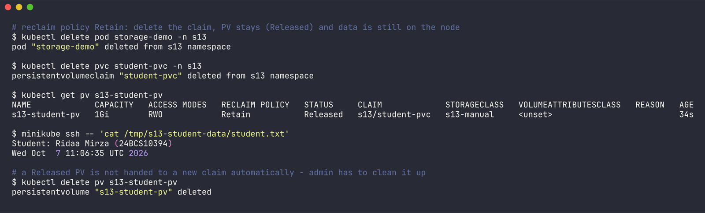

Claim gone, PV is `Released` (not deleted) and the data is still on disk. A `Released` PV isn't reused automatically - an admin has to clean it up / delete it, which I did with `kubectl delete pv s13-student-pv`. Output: `outputs/05-retain-policy.txt`.

## Task 4 - StorageClass & dynamic provisioning

minikube ships with one StorageClass:

```bash
kubectl get storageclass
```

```
NAME                 PROVISIONER                RECLAIMPOLICY   VOLUMEBINDINGMODE   ALLOWVOLUMEEXPANSION   AGE
standard (default)   k8s.io/minikube-hostpath   Delete          Immediate           false                  18m
```

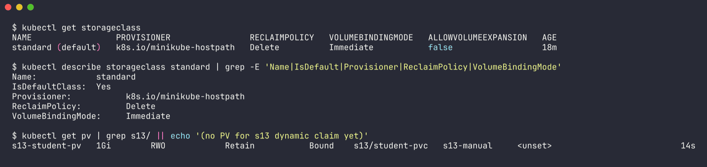

- `PROVISIONER k8s.io/minikube-hostpath` - the thing that actually creates the volume (on cloud this would be EBS / GCE PD / Azure Disk CSI driver)
- `RECLAIMPOLICY Delete` - PV is deleted with the claim
- `VOLUMEBINDINGMODE Immediate` - provision as soon as the PVC exists (the other option `WaitForFirstConsumer` waits for a pod, useful for zone-aware storage)

Now `dynamic-pvc.yaml` - note there's **no** PV file this time:

```bash
kubectl apply -f dynamic-pvc.yaml
kubectl get pvc dynamic-pvc -n s13
```

```
NAME          STATUS   VOLUME                                     CAPACITY   ACCESS MODES   STORAGECLASS   VOLUMEATTRIBUTESCLASS   AGE
dynamic-pvc   Bound    pvc-5096f513-b53e-4299-8c30-6b858702c63b   500Mi      RWO            standard       <unset>                 4s
```

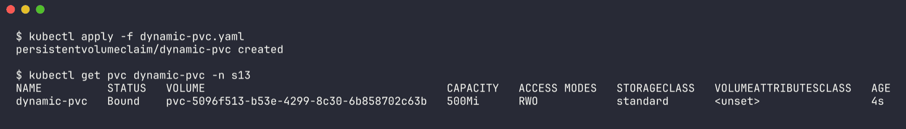

The auto-created PV:

```bash
kubectl get pv pvc-5096f513-b53e-4299-8c30-6b858702c63b
```

```
NAME                                       CAPACITY   ACCESS MODES   RECLAIM POLICY   STATUS   CLAIM             STORAGECLASS   VOLUMEATTRIBUTESCLASS   REASON   AGE
pvc-5096f513-b53e-4299-8c30-6b858702c63b   500Mi      RWO            Delete           Bound    s13/dynamic-pvc   standard       <unset>                          4s
```

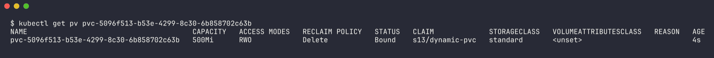

```
/tmp/hostpath-provisioner/s13/dynamic-pvc
{"hostPathProvisionerIdentity":"94ac1bf6-c028-43b0-918b-e4d573f8c78b","pv.kubernetes.io/provisioned-by":"k8s.io/minikube-hostpath"}
```

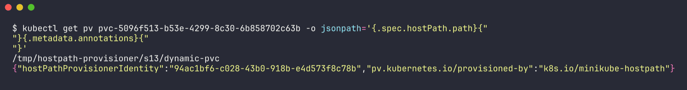

Events on the claim show the provisioner doing the work:

```
REASON                  MESSAGE
ExternalProvisioning    Waiting for a volume to be created either by the external provisioner 'k8s.io/minikube-hostpath' or manually by the system administrator. ...
Provisioning            External provisioner is provisioning volume for claim "s13/dynamic-pvc"
ProvisioningSucceeded   Successfully provisioned volume pvc-5096f513-b53e-4299-8c30-6b858702c63b
```

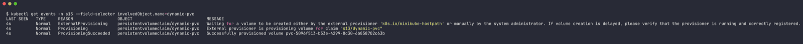

This time the capacity is exactly 500Mi (made to measure), named `pvc-<uid>`, reclaim `Delete` inherited from the class.

Mounted it in a pod and wrote to it:

```bash
kubectl apply -f pod-dynamic-pvc.yaml
kubectl exec -n s13 dynamic-demo -- sh -c 'echo dynamic-volume-works > /data/hello.txt; cat /data/hello.txt; df -h /data'
```

```
dynamic-volume-works
Filesystem      Size  Used Avail Use% Mounted on
/dev/vda1       911G  294G  572G  34% /data
```

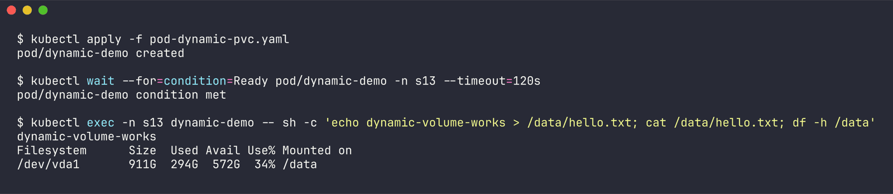

(`df` shows the whole node disk because hostpath provisioner doesn't enforce the 500Mi size - real cloud disks would.)

Then deleted the claim - with `Delete` policy the PV disappears too:

```bash
kubectl delete pod dynamic-demo -n s13
kubectl delete pvc dynamic-pvc -n s13
kubectl get pv pvc-5096f513-b53e-4299-8c30-6b858702c63b
```

```
Error from server (NotFound): persistentvolumes "pvc-5096f513-b53e-4299-8c30-6b858702c63b" not found
```

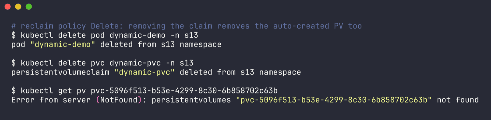

Full output: `outputs/04-dynamic-provisioning.txt`.

## Access modes

| Mode | Short | Meaning |
| --- | --- | --- |
| ReadWriteOnce | RWO | read-write by pods on **one node** (several pods on the same node is fine) |
| ReadOnlyMany | ROX | read-only by many nodes |
| ReadWriteMany | RWX | read-write by many nodes (needs NFS / CephFS / EFS etc.) |
| ReadWriteOncePod | RWOP | read-write by exactly **one pod** in the whole cluster |

The minikube hostpath provisioner only really does RWO. Block storage (EBS, GCE PD) is RWO too; for RWX you need a network filesystem.

## Reclaim policies

| Policy | What happens when the PVC is deleted | Seen in this lab |
| --- | --- | --- |
| Retain | PV stays as `Released`, data kept, admin cleans up manually | yes - `s13-student-pv` went `Released`, file still on node |
| Delete | PV and underlying storage are deleted | yes - dynamic `pvc-5096...` PV was gone right after deleting the claim |
| Recycle | basic `rm -rf` then PV is available again | deprecated, not used anymore |

Static PVs default to `Retain`, dynamically provisioned ones take the StorageClass's policy (usually `Delete`).

## Static vs dynamic, quick summary

| | Static | Dynamic |
| --- | --- | --- |
| Who makes the PV | admin, by hand | provisioner, when the PVC appears |
| Size | whatever the admin made (my 500Mi claim got 1Gi) | exactly what the claim asks |
| Needs StorageClass | no (I used a dummy name only for matching) | yes |
| Scales to many apps | painful | yes, that's the point |

## Cleanup

```bash
kubectl delete pod emptydir-demo hostpath-demo -n s13
minikube ssh -- 'sudo rm -rf /tmp/s13-hostpath-data /tmp/s13-student-data'
```

(PV/PVC/dynamic stuff was already deleted as part of the reclaim policy demos.)
