# Session 13 - Horizontal Pod Autoscaler (HPA)

Name: Ridaa Mirza
Enrollment No: 24BCS10394

Goal: deploy an app with CPU requests, put an HPA (autoscaling/v2) on it, throw load at it with a busybox load generator, and watch CPU % and the pod count go up - and then come back down after the load stops.

Based on the class `hpa/` folder (`hpa-backend.yaml`, `backend-service.yaml`, `load_generator.sh`) and `04-hpa/`. Namespace `s13`, minikube with the metrics-server addon. Raw output in `outputs/`.

```
02-hpa/
├── backend-deployment.yaml   # yatri-backend, 2 replicas, cpu request 50m / limit 200m
├── backend-service.yaml      # ClusterIP yatri-backend-service :80
├── hpa-backend.yaml          # autoscaling/v2, min 2, max 6, 50% CPU
├── load-generator.yaml       # busybox Deployment, wget loop against the service
├── load_generator.sh         # class script (curl loop via port-forward), adapted to my namespace/port
├── watch-hpa.sh              # my helper: snapshot hpa/pods/top/describe every 20s with a timestamp
└── outputs/
```

## How HPA decides

```
desiredReplicas = ceil( currentReplicas * currentCPU% / targetCPU% )
```

`currentCPU%` is **average usage / request** across the pods. That's why the deployment *must* have `resources.requests.cpu` - without it there's nothing to divide by and the HPA just sits at `<unknown>`. metrics-server scrapes kubelets, HPA controller checks every 15s.

Changes I made vs. the class files:
- The class `hpa-backend.yaml` targets a Flask image on port 5000 that isn't in the repo, so `yatri-backend` here is nginx on port 80 (same as `04-hpa`). Service is `80 -> 80`.
- CPU request is `50m`. nginx is really cheap per request, with `100m` I'd need a lot of load generator pods to cross 50% on a shared cluster.
- `maxReplicas: 6` instead of 10 because the minikube is shared with other labs.
- I wrote out `behavior.scaleDown.stabilizationWindowSeconds: 300` - that's the default anyway, just so it's visible in the yaml.

## Step 1 - deploy the app

```bash
kubectl apply -f backend-deployment.yaml -f backend-service.yaml
kubectl rollout status deploy/yatri-backend -n s13
kubectl get deploy,svc,pods -n s13 -l app=yatri-backend
```

```
NAME                            READY   UP-TO-DATE   AVAILABLE   AGE   CONTAINERS   IMAGES       SELECTOR
deployment.apps/yatri-backend   2/2     2            2           1s    backend      nginx:1.27   app=yatri-backend

NAME                            TYPE        CLUSTER-IP      EXTERNAL-IP   PORT(S)   AGE
service/yatri-backend-service   ClusterIP   10.107.15.225   <none>        80/TCP    1s

NAME                                 READY   STATUS    RESTARTS   AGE
pod/yatri-backend-54f8858c86-8dgmt   1/1     Running   0          1s
pod/yatri-backend-54f8858c86-bxtgw   1/1     Running   0          1s
```

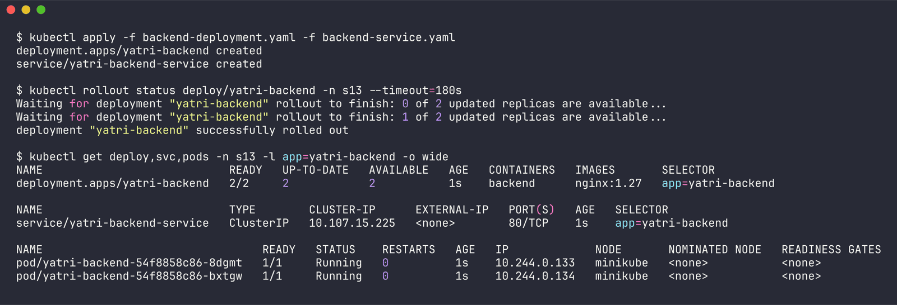

```
{"limits":{"cpu":"200m","memory":"128Mi"},"requests":{"cpu":"50m","memory":"32Mi"}}
```

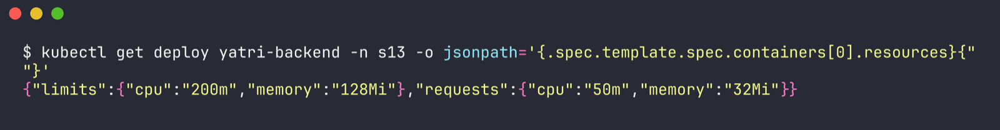

## Step 2 - configure the HPA

`hpa-backend.yaml`:

```yaml
apiVersion: autoscaling/v2
kind: HorizontalPodAutoscaler
metadata:
  name: yatri-backend-hpa
  namespace: s13
spec:
  scaleTargetRef:
    apiVersion: apps/v1
    kind: Deployment
    name: yatri-backend
  minReplicas: 2
  maxReplicas: 6
  metrics:
    - type: Resource
      resource:
        name: cpu
        target:
          type: Utilization
          averageUtilization: 50
  behavior:
    scaleDown:
      stabilizationWindowSeconds: 300
```

(same thing imperatively would be `kubectl autoscale deploy yatri-backend -n s13 --cpu-percent=50 --min=2 --max=6`)

## Step 3 - verify

```bash
kubectl top nodes
kubectl apply -f hpa-backend.yaml
kubectl get hpa yatri-backend-hpa -n s13
kubectl describe hpa yatri-backend-hpa -n s13
```

```
NAME       CPU(cores)   CPU(%)   MEMORY(bytes)   MEMORY(%)
minikube   349m         2%       2638Mi          33%

NAME                REFERENCE                  TARGETS       MINPODS   MAXPODS   REPLICAS   AGE
yatri-backend-hpa   Deployment/yatri-backend   cpu: 2%/50%   2         6         2          0s
```

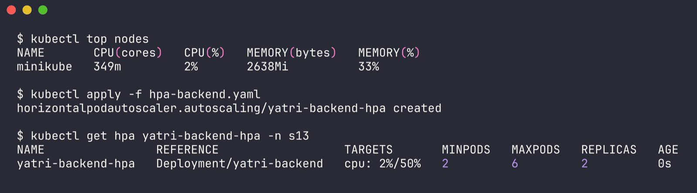

```
Metrics:                                               ( current / target )
  resource cpu on pods  (as a percentage of request):  2% (1m) / 50%
Min replicas:                                          2
Max replicas:                                          6
Behavior:
  Scale Up:
    Stabilization Window: 0 seconds
    Select Policy: Max
    Policies:
      - Type: Pods     Value: 4    Period: 15 seconds
      - Type: Percent  Value: 100  Period: 15 seconds
  Scale Down:
    Stabilization Window: 300 seconds
    Select Policy: Max
    Policies:
      - Type: Percent  Value: 100  Period: 15 seconds
Conditions:
  AbleToScale     True    ScaleDownStabilized  ...
  ScalingActive   True    ValidMetricFound     the HPA was able to successfully calculate a replica count from cpu resource utilization (percentage of request)
  ScalingLimited  False   DesiredWithinRange   the desired count is within the acceptable range
```

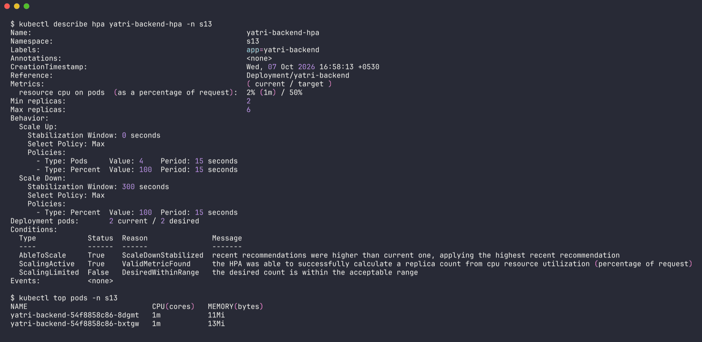

`ScalingActive True / ValidMetricFound` = metrics are flowing. Note the defaults: scale **up** has no stabilization (reacts immediately, up to +4 pods or +100% per 15s), scale **down** waits 300s.

(When I first got the cluster, metrics-server wasn't running yet and `kubectl top` said `error: Metrics API not available` - I enabled the addon with `minikube addons enable metrics-server` and had to wait for the image pull.)

## Step 4 - load generator

`load-generator.yaml` is the in-cluster version of the class `load_generator.sh`: a busybox Deployment, each pod runs 2 parallel `wget` loops against the service DNS name. Being a Deployment means I can turn the load up with `kubectl scale` and stop it with one delete.

```yaml
          command: ["/bin/sh", "-c"]
          args:
            - |
              for i in 1 2; do
                (while true; do wget -q -O- http://yatri-backend-service.s13.svc.cluster.local > /dev/null 2>&1; done) &
              done
              wait
```

To record everything I ran `watch-hpa.sh` in the background, which appends a timestamped block with `kubectl get hpa`, `kubectl get pods`, `kubectl top pods` and the tail of `kubectl describe hpa` every 20s. The whole run (~14 min, 2154 lines) is in `outputs/03-hpa-snapshots.txt`. Event markers (`>>>>`) show where I started / increased / stopped the load.

```bash
./watch-hpa.sh s13 yatri-backend-hpa yatri-backend outputs/03-hpa-snapshots.txt 20 &
kubectl apply -f load-generator.yaml                            # 16:59:06
kubectl scale deploy/load-generator -n s13 --replicas=3         # 17:00:22  increase load
kubectl delete -f load-generator.yaml                           # 17:05:44  stop load
```

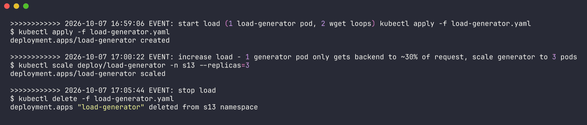

## Step 5 - observe scaling over time

Condensed timeline from the snapshot file (TARGETS + REPLICAS columns of `kubectl get hpa`):

| Time | Event | CPU (avg / target) | Replicas |
| --- | --- | --- | --- |
| 16:58:27 | idle | 2% / 50% | 2 |
| 16:59:06 | **load started** (1 generator pod) | | |
| 16:59:47 | metrics haven't caught up yet | 2% / 50% | 2 |
| 17:00:22 | **load increased** to 3 generator pods | | |
| 17:00:28 | (this reading is from the 1-pod load) | 31% / 50% | 2 |
| 17:01:29 | 3-pod load shows up | 73% / 50% | 2 |
| 17:01:49 | HPA scaled | 73% / 50% | **3** |
| 17:02:29 | still above target | 76% / 50% | 3 |
| 17:03:30 | HPA scaled again | 68% / 50% | **5** |
| 17:04:30 | load now spread over 5 pods | 47% / 50% | 5 |
| 17:05:31 | stable, below target | 42% / 50% | 5 |
| 17:05:44 | **load stopped** | | |
| 17:07:32 | CPU dropping | 14% / 50% | 5 |
| 17:08:33 | idle again | 2% / 50% | 5 (held by stabilization window) |
| 17:11:55 | still waiting | 2% / 50% | 5 |
| 17:12:15 | **scale down** | 2% / 50% | **2** |

Some snapshots in full:

**17:00:28 - one load generator, not enough**

```
NAME                REFERENCE                  TARGETS        MINPODS   MAXPODS   REPLICAS   AGE
yatri-backend-hpa   Deployment/yatri-backend   cpu: 31%/50%   2         6         2          2m15s

$ kubectl top pods -n s13
NAME                              CPU(cores)   MEMORY(bytes)
load-generator-5996bf6749-n6htc   300m         5Mi
yatri-backend-54f8858c86-8dgmt    15m          13Mi
yatri-backend-54f8858c86-bxtgw    16m          15Mi
```

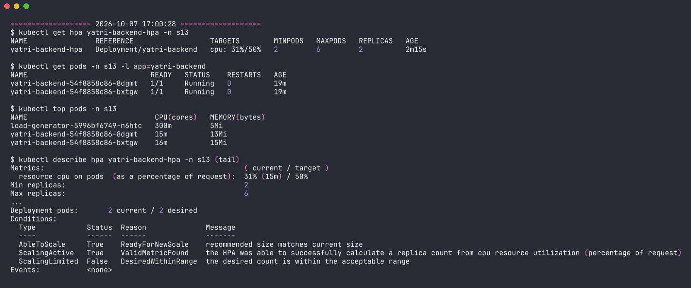

The generator itself is pinned at its 300m CPU limit (spawning a `wget` process per request is expensive), and it only gets nginx to 15m out of 50m = 31%. So I scaled the generator to 3 pods.

**17:01:49 - first scale up 2 -> 3**

```
NAME                REFERENCE                  TARGETS        MINPODS   MAXPODS   REPLICAS   AGE
yatri-backend-hpa   Deployment/yatri-backend   cpu: 73%/50%   2         6         3          3m36s

NAME                             READY   STATUS    RESTARTS   AGE
yatri-backend-54f8858c86-8dgmt   1/1     Running   0          20m
yatri-backend-54f8858c86-bxtgw   1/1     Running   0          20m
yatri-backend-54f8858c86-k9xhb   1/1     Running   0          35s

NAME                              CPU(cores)   MEMORY(bytes)
load-generator-5996bf6749-n6htc   300m         5Mi
load-generator-5996bf6749-vckx6   300m         3Mi
load-generator-5996bf6749-z6jdt   300m         5Mi
yatri-backend-54f8858c86-8dgmt    37m          14Mi
yatri-backend-54f8858c86-bxtgw    36m          15Mi

Metrics:                                               ( current / target )
  resource cpu on pods  (as a percentage of request):  73% (36m) / 50%
Deployment pods:       3 current / 3 desired
Events:
  Normal  SuccessfulRescale  35s   horizontal-pod-autoscaler  New size: 3; reason: cpu resource utilization (percentage of request) above target
```

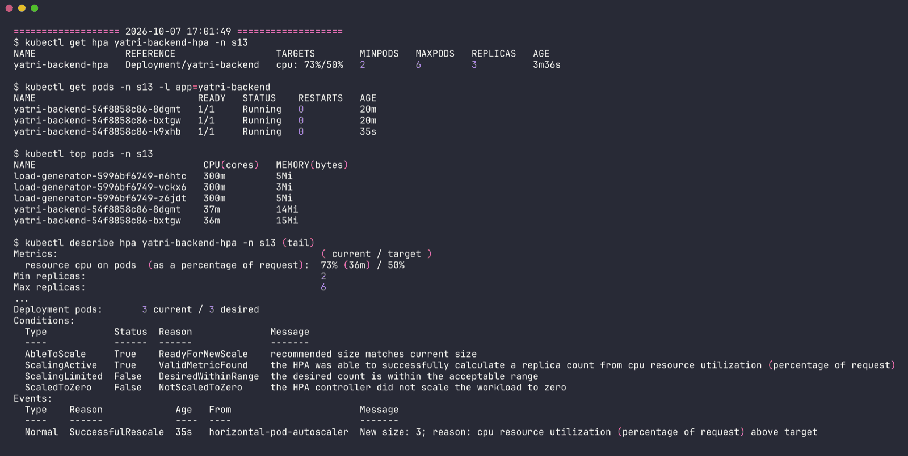

Math check: `ceil(2 * 73 / 50) = ceil(2.92) = 3`. Matches.

**17:03:30 - second scale up 3 -> 5**

```
NAME                REFERENCE                  TARGETS        MINPODS   MAXPODS   REPLICAS   AGE
yatri-backend-hpa   Deployment/yatri-backend   cpu: 68%/50%   2         6         5          5m17s

NAME                             READY   STATUS    RESTARTS   AGE
yatri-backend-54f8858c86-8dgmt   1/1     Running   0          22m
yatri-backend-54f8858c86-97m4p   1/1     Running   0          16s
yatri-backend-54f8858c86-bxtgw   1/1     Running   0          22m
yatri-backend-54f8858c86-k9xhb   1/1     Running   0          2m16s
yatri-backend-54f8858c86-prq57   1/1     Running   0          16s

Events:
  Normal  SuccessfulRescale  2m16s  horizontal-pod-autoscaler  New size: 3; reason: cpu resource utilization (percentage of request) above target
  Normal  SuccessfulRescale  16s    horizontal-pod-autoscaler  New size: 5; reason: cpu resource utilization (percentage of request) above target
```

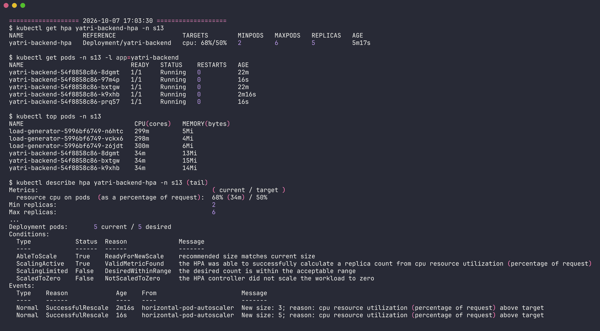

`ceil(3 * 76 / 50) = ceil(4.56) = 5`.

**17:05:31 - load spread out, settled under target**

```
NAME                REFERENCE                  TARGETS        MINPODS   MAXPODS   REPLICAS   AGE
yatri-backend-hpa   Deployment/yatri-backend   cpu: 42%/50%   2         6         5          7m18s

NAME                              CPU(cores)   MEMORY(bytes)
load-generator-5996bf6749-n6htc   299m         4Mi
load-generator-5996bf6749-vckx6   299m         4Mi
load-generator-5996bf6749-z6jdt   300m         5Mi
yatri-backend-54f8858c86-8dgmt    21m          12Mi
yatri-backend-54f8858c86-97m4p    21m          13Mi
yatri-backend-54f8858c86-bxtgw    21m          14Mi
yatri-backend-54f8858c86-k9xhb    22m          13Mi
yatri-backend-54f8858c86-prq57    21m          12Mi
```

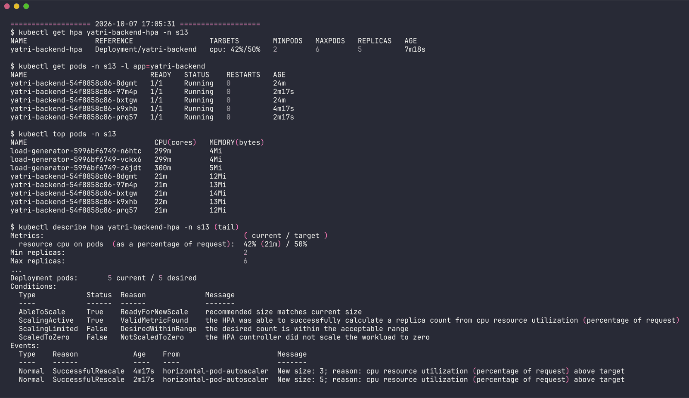

Same total load (~105m) now split 5 ways, so each pod is around 21m = 42%. It never reached `maxReplicas: 6` because `ceil(5 * 42 / 50) = 5`.

## Step 6 - stop the load and watch scale down

```bash
kubectl delete -f load-generator.yaml     # 17:05:44
```

**17:09:13 - CPU is idle, but still 5 pods**

```
NAME                             READY   STATUS    RESTARTS   AGE
yatri-backend-54f8858c86-8dgmt   1/1     Running   0          28m
yatri-backend-54f8858c86-97m4p   1/1     Running   0          5m59s
yatri-backend-54f8858c86-bxtgw   1/1     Running   0          28m
yatri-backend-54f8858c86-k9xhb   1/1     Running   0          7m59s
yatri-backend-54f8858c86-prq57   1/1     Running   0          5m59s

Conditions:
  AbleToScale     True    ScaleDownStabilized  recent recommendations were higher than current one, applying the highest recent recommendation
```

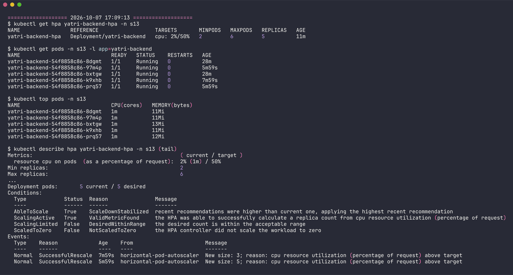

That's the **5-minute scale-down stabilization window**: HPA keeps the highest recommendation from the last 300s. The last "5 replicas" recommendation was while the 42% reading was still showing (~17:07), so the pods are held until ~5 min after that.

**17:12:15 - scaled down 5 -> 2 in one go**

```
NAME                REFERENCE                  TARGETS       MINPODS   MAXPODS   REPLICAS   AGE
yatri-backend-hpa   Deployment/yatri-backend   cpu: 2%/50%   2         6         2          14m

NAME                             READY   STATUS    RESTARTS   AGE
yatri-backend-54f8858c86-8dgmt   1/1     Running   0          31m
yatri-backend-54f8858c86-bxtgw   1/1     Running   0          31m

Events:
  Normal  SuccessfulRescale  11m   horizontal-pod-autoscaler  New size: 3; reason: cpu resource utilization (percentage of request) above target
  Normal  SuccessfulRescale  9m1s  horizontal-pod-autoscaler  New size: 5; reason: cpu resource utilization (percentage of request) above target
  Normal  SuccessfulRescale  16s   horizontal-pod-autoscaler  New size: 2; reason: All metrics below target
```

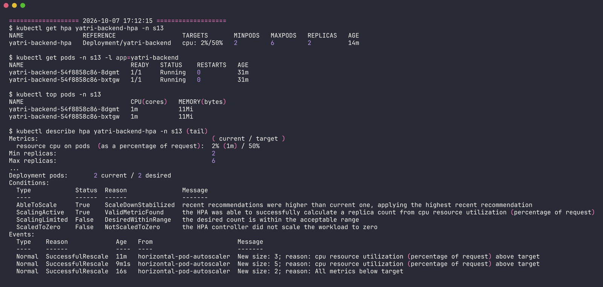

Straight to `minReplicas: 2` (default scale-down policy allows removing 100% per 15s, `minReplicas` is the floor). Deployment events agree:

```
Scaled up replica set yatri-backend-54f8858c86 from 2 to 3
Scaled up replica set yatri-backend-54f8858c86 from 3 to 5
Scaled down replica set yatri-backend-54f8858c86 from 5 to 2
```

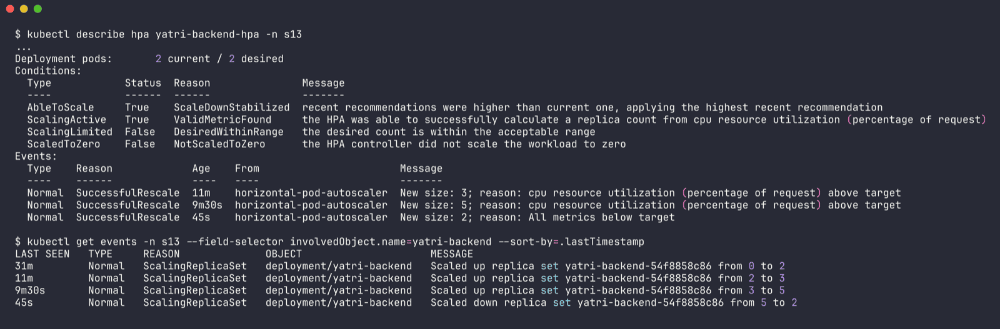

Full output: `outputs/04-after-scaledown.txt`.

## Observations

- Scale up is fast (~1 min after the load showed up in metrics), scale down is deliberately slow (5 min) so a short dip in traffic doesn't kill pods that you'd need again a minute later (flapping).
- There's a lag of 30-60s between starting load and the HPA seeing it - metrics-server scrapes on an interval and reports a windowed average.
- Percent is relative to the **request**, not the limit and not the node. 21m looks tiny but it's 42% of 50m.
- The load generator was the real CPU hog (300m each, at its limit) - nginx serving a static page is cheap. For a CPU-heavy app (like the classic `php-apache` hpa-example) one generator would be enough.

## Cleanup

```bash
kubectl delete -f load-generator.yaml        # already done in step 6
kubectl delete -f hpa-backend.yaml -f backend-service.yaml -f backend-deployment.yaml
```

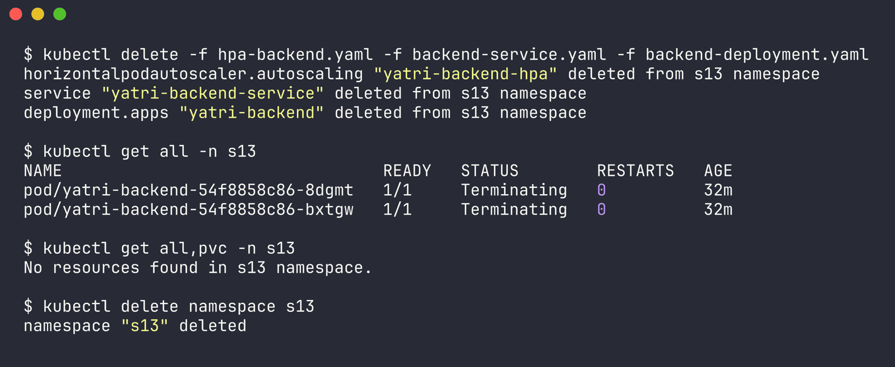

Output in `outputs/05-cleanup.txt`. At the very end (after the volumes and probes labs were also done) the `s13` namespace was empty, so I deleted it: `kubectl delete namespace s13` (`outputs/06-namespace-cleanup.txt`).

## The class script (`load_generator.sh`)

Kept for reference, edited to use namespace `s13` and `/` instead of `/healthz` (nginx doesn't have that path). It runs `curl` loops from the laptop through `kubectl port-forward`. I used the in-cluster Deployment instead because port-forward is a single tunnel through the API server - it becomes the bottleneck and all traffic lands on one pod, so the HPA results would be misleading.
