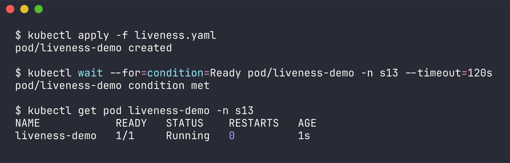
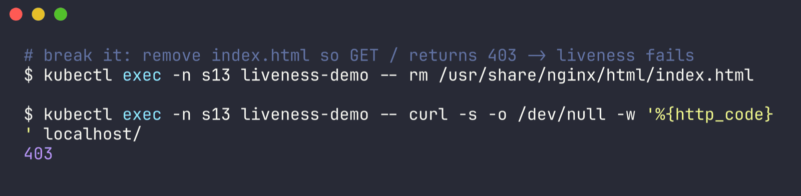
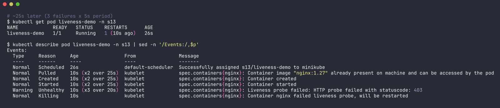
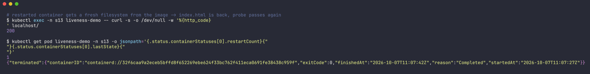
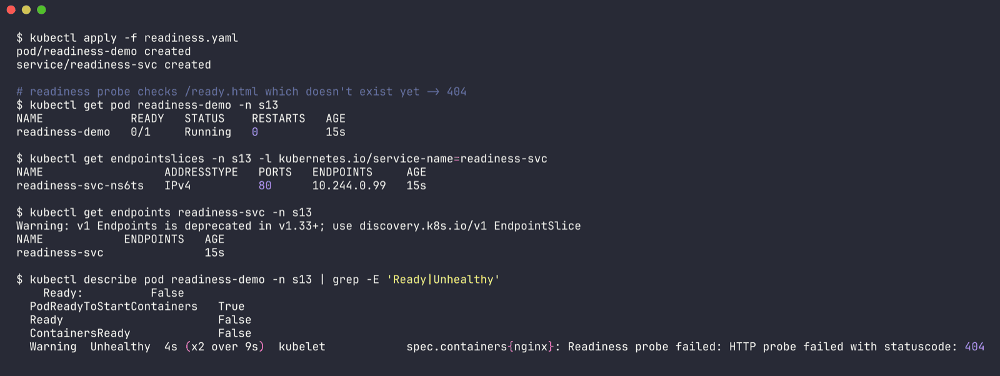
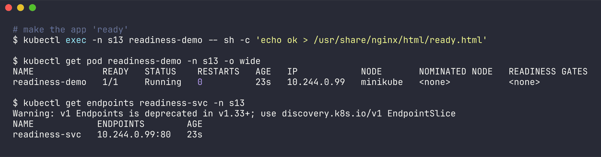
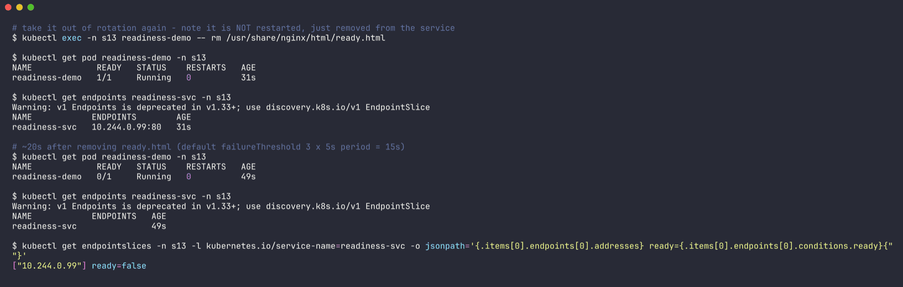
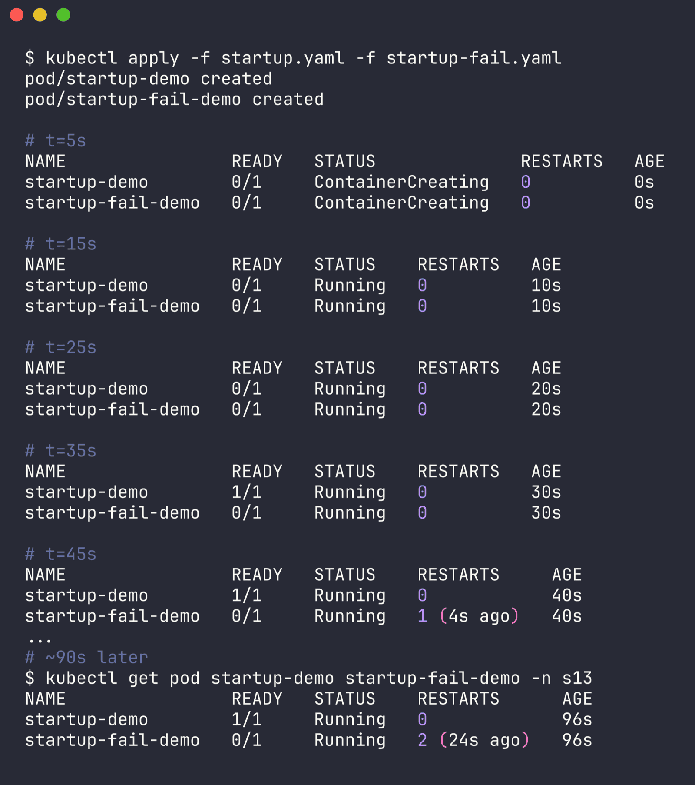
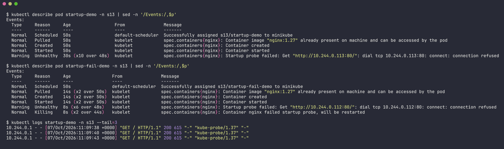

# Session 13 - Health Probes (liveness / readiness / startup)

Name: Ridaa Mirza
Enrollment No: 24BCS10394

Based on the class `05-probes` files. I changed them a little so each probe actually *fails* at some point - otherwise you just see `1/1 Running` and learn nothing. Everything runs in namespace `s13`, raw output in `outputs/`.

| Probe | Question it answers | On failure |
| --- | --- | --- |
| startupProbe | has the app finished booting? | container restarted. Liveness/readiness are **paused** until it passes once |
| readinessProbe | can this pod take traffic right now? | pod marked `0/1`, removed from Service endpoints. **No restart** |
| livenessProbe | is the process still healthy / not stuck? | kubelet kills and restarts the container |

Knobs used: `initialDelaySeconds`, `periodSeconds` (how often), `timeoutSeconds`, `failureThreshold` (how many fails in a row before acting). Rough time-to-act = `periodSeconds x failureThreshold`.

## Task 1 - Liveness probe -> restart

`liveness.yaml`: nginx with an HTTP liveness probe on `/` every 5s, 3 failures allowed.

```bash
kubectl apply -f liveness.yaml
kubectl get pod liveness-demo -n s13
```

```
NAME            READY   STATUS    RESTARTS   AGE
liveness-demo   1/1     Running   0          1s
```



To break it I deleted nginx's `index.html`, so `GET /` returns 403 instead of 200:

```bash
kubectl exec -n s13 liveness-demo -- rm /usr/share/nginx/html/index.html
kubectl exec -n s13 liveness-demo -- curl -s -o /dev/null -w '%{http_code}\n' localhost/
```

```
403
```



~25s later:

```bash
kubectl get pod liveness-demo -n s13
kubectl describe pod liveness-demo -n s13
```

```
NAME            READY   STATUS    RESTARTS      AGE
liveness-demo   1/1     Running   1 (10s ago)   26s

  Warning  Unhealthy  10s (x3 over 20s)  kubelet  spec.containers{nginx}: Liveness probe failed: HTTP probe failed with statuscode: 403
  Normal   Killing    10s                kubelet  spec.containers{nginx}: Container nginx failed liveness probe, will be restarted
```



Exactly 3 failures (`x3`) then the kill. After the restart the container starts from the image again, so `index.html` is back and the probe is happy:

```
200
restartCount: 1
lastState: {"terminated":{"exitCode":0,"reason":"Completed","startedAt":"2026-10-07T11:07:27Z","finishedAt":"2026-10-07T11:07:42Z"}}
```



Self-healing without anyone touching it. Output: `outputs/01-liveness.txt`.

## Task 2 - Readiness probe -> pulled out of the Service

`readiness.yaml` = nginx pod + a Service `readiness-svc`. I pointed the readiness probe at `/ready.html` which **doesn't exist** at first.

```bash
kubectl apply -f readiness.yaml
kubectl get pod readiness-demo -n s13
kubectl get endpoints readiness-svc -n s13
```

```
NAME             READY   STATUS    RESTARTS   AGE
readiness-demo   0/1     Running   0          15s

NAME            ENDPOINTS   AGE
readiness-svc               15s

  Warning  Unhealthy  4s (x2 over 9s)  kubelet  spec.containers{nginx}: Readiness probe failed: HTTP probe failed with statuscode: 404
```



`Running` but `0/1` and the Service has **no endpoints** - no traffic would reach it. Now create the file:

```bash
kubectl exec -n s13 readiness-demo -- sh -c 'echo ok > /usr/share/nginx/html/ready.html'
kubectl get pod readiness-demo -n s13 -o wide
kubectl get endpoints readiness-svc -n s13
```

```
NAME             READY   STATUS    RESTARTS   AGE   IP            NODE
readiness-demo   1/1     Running   0          23s   10.244.0.99   minikube

NAME            ENDPOINTS        AGE
readiness-svc   10.244.0.99:80   23s
```



Then remove it again and wait ~20s (3 failures x 5s):

```bash
kubectl exec -n s13 readiness-demo -- rm /usr/share/nginx/html/ready.html
kubectl get pod readiness-demo -n s13
kubectl get endpoints readiness-svc -n s13
kubectl get endpointslices -n s13 -l kubernetes.io/service-name=readiness-svc -o jsonpath='...'
```

```
NAME             READY   STATUS    RESTARTS   AGE
readiness-demo   0/1     Running   0          49s

NAME            ENDPOINTS   AGE
readiness-svc               49s

["10.244.0.99"] ready=false
```



The key difference from liveness: **RESTARTS stayed 0**. The pod just got taken out of rotation, and the EndpointSlice keeps the address but with `ready=false`. (Side note: `kubectl get endpoints` now prints a deprecation warning on 1.33+, EndpointSlice is the new way.) Output: `outputs/02-readiness.txt`.

## Task 3 - Startup probe for slow apps

To fake a slow boot I made the container `sleep 20` before starting nginx.

- `startup.yaml` - startupProbe allows `30 x 2s = 60s`, so it's fine
- `startup-fail.yaml` - same slow app, but only `3 x 2s = 6s` allowed

```bash
kubectl apply -f startup.yaml -f startup-fail.yaml
# then kubectl get pod every 10s
```

```
# t=15s
startup-demo        0/1     Running   0          10s
startup-fail-demo   0/1     Running   0          10s

# t=35s
startup-demo        1/1     Running   0          30s
startup-fail-demo   0/1     Running   0          30s

# t=45s
startup-demo        1/1     Running   0            40s
startup-fail-demo   0/1     Running   1 (4s ago)   40s

# ~90s later
startup-demo        1/1     Running   0             96s
startup-fail-demo   0/1     Running   2 (24s ago)   96s
```



Events:

```
startup-demo:
  Warning  Unhealthy  30s (x10 over 48s)  kubelet  Startup probe failed: Get "http://10.244.0.113:80/": dial tcp 10.244.0.113:80: connect: connection refused

startup-fail-demo:
  Warning  Unhealthy  8s (x6 over 48s)   kubelet  Startup probe failed: Get "http://10.244.0.112:80/": dial tcp 10.244.0.112:80: connect: connection refused
  Normal   Killing    8s (x2 over 44s)   kubelet  Container nginx failed startup probe, will be restarted
```



`startup-demo` failed its startup probe 10 times while booting but that's within budget, so no restart, and once it passed the liveness/readiness probes took over (nginx logs show `kube-probe/1.37` getting 200s). `startup-fail-demo` never gets a chance - it's killed every ~6s before nginx comes up, so it just loops forever. That's the reason startupProbe exists: without it you'd have to give the liveness probe a huge `initialDelaySeconds`, which also makes it slow to catch real hangs later. Output: `outputs/03-startup.txt`.

## Cleanup

```bash
kubectl delete -f .
```
