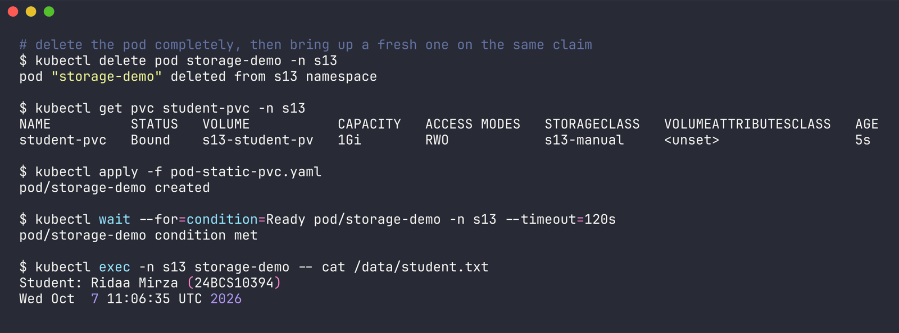
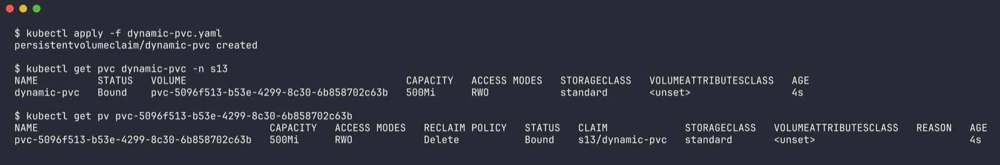
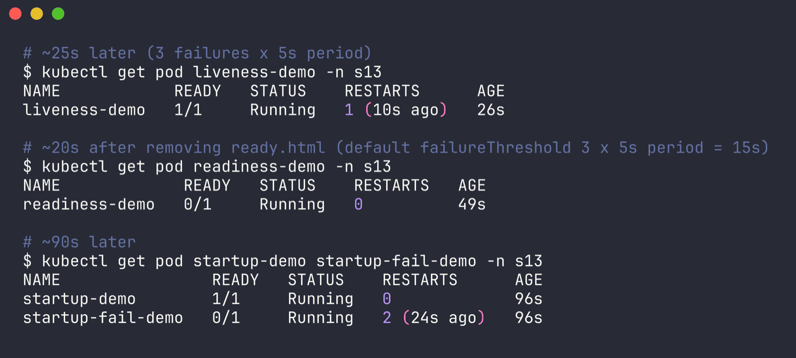

# Session 13 - Storage, HPA & Probes

Name: Ridaa Mirza
Enrollment No: 24BCS10394

This session was about making Kubernetes apps survive real life: keeping data when pods die (volumes / PV / PVC / StorageClass), adding and removing pods automatically when load changes (HPA), and letting the cluster know when a container is actually healthy (probes). Then a mini project that puts all three together.

Everything was run on minikube (docker driver, single node, `standard` StorageClass, metrics-server addon). Instead of screenshots, every task folder has an `outputs/` directory with the raw terminal output, and the READMEs paste the important parts.

## Folders

| Folder | What's in it |
| --- | --- |
| [`01-kubernetes-volumes/`](01-kubernetes-volumes/README.md) | **Task 1** - emptyDir shared by 2 containers, hostPath, static PV + PVC (data surviving pod deletion), dynamic provisioning with the `standard` StorageClass, Retain vs Delete reclaim, access modes table |
| [`02-hpa/`](02-hpa/README.md) | **Task 2** - deployment with CPU requests, autoscaling/v2 HPA, busybox load generator Deployment, 20s timestamped snapshots of hpa/pods/top/describe while scaling 2 -> 3 -> 5 -> back to 2 |
| [`03-probes/`](03-probes/README.md) | liveness (restart count going up), readiness (pod removed from endpoints, no restart), startup (slow boot passing vs. failing) |
| [`mini-project/`](mini-project/README.md) | **Task 3** - production-ish web app: PVC + 2-5 replicas HPA + all three probes, in namespace `s13-production-webapp` |

Namespaces used: `s13` (tasks 1, 2, probes) and `s13-production-webapp` (mini project - renamed from the class `production-webapp`).

## Results at a glance

**Storage** - file written through a PVC, pod deleted, new pod reads the same file:

```
$ kubectl exec -n s13 storage-demo -- cat /data/student.txt
Student: Ridaa Mirza (24BCS10394)
Wed Oct  7 11:06:35 UTC 2026
```



Dynamic PVC got its PV created automatically:

```
NAME          STATUS   VOLUME                                     CAPACITY   ACCESS MODES   STORAGECLASS
dynamic-pvc   Bound    pvc-5096f513-b53e-4299-8c30-6b858702c63b   500Mi      RWO            standard
```



**HPA** - from `02-hpa/outputs/03-hpa-snapshots.txt`:

| Time | CPU / target | Replicas |
| --- | --- | --- |
| 16:58:27 idle | 2% / 50% | 2 |
| 17:01:49 under load | 73% / 50% | 3 |
| 17:03:30 | 68% / 50% | 5 |
| 17:05:31 | 42% / 50% | 5 |
| 17:05:44 load stopped | | |
| 17:09:13 idle, held by 5 min window | 2% / 50% | 5 |
| 17:12:15 | 2% / 50% | 2 |


**Probes**

```
liveness-demo       1/1     Running   1 (10s ago)   26s      <- restarted after 3 failed checks
readiness-demo      0/1     Running   0             49s      <- not restarted, Service has no endpoints
startup-fail-demo   0/1     Running   2 (24s ago)   96s      <- killed before it ever finished booting
```



**Mini project** - see its README: PVC Bound, both pods 1/1 with startup/readiness/liveness passing, data survives pod deletion, HPA scaled 2 -> 3 under load (and 3 -> 4 with the 30% bonus target).

## Things I learned / tripped on

- A PVC with no `storageClassName` on minikube goes to the default `standard` class and gets a *new* dynamic volume, it won't bind your hand-made PV. Used a matching dummy class name (`s13-manual`) on both.
- HPA percentage is against the CPU **request**. No request = `<unknown>` target.
- metrics-server takes a while to come up and reports with a lag, so expect ~1 min before HPA reacts.
- Scale-down waits 5 minutes (stabilization window) on purpose, to avoid flapping.
- Readiness failing doesn't restart anything, liveness does. Mixing them up = either restart loops or traffic going to broken pods.
