# Session 13 - Mini Project: Production-Ready Web App on Kubernetes

Name: Ridaa Mirza
Enrollment No: 24BCS10394

The class mini project: one nginx web app that combines the three things from this session -

1. **Persistence** - a PVC mounted at `/data`, so files outlive pod deletion
2. **Elastic scaling** - an HPA on CPU, 2 to 5 replicas, 50% target
3. **Health checks** - startup, readiness and liveness probes on every pod

I took the class manifests, renamed the namespace from `production-webapp` to **`s13-production-webapp`** (the cluster is shared, all my stuff starts with `s13`), made the PVC's StorageClass explicit, added a load generator Deployment and a 30% HPA for the bonus challenge. Then deployed it, ran every verification task and the 3 bonus challenges. Raw outputs are in `outputs/`.

## Architecture

```text
                           [ Service: web-service ]  ClusterIP :80
                                      |
                +---------------------+---------------------+
                |                     |                     |
          [ Pod: web-app ]      [ Pod: web-app ]      [ Pod: web-app ... up to 5 ]
          startup probe         startup probe         startup probe
          readiness probe       readiness probe       readiness probe
          liveness probe        liveness probe        liveness probe
          cpu req 100m          cpu req 100m          cpu req 100m
                |                     |                     |
                +----------+----------+---------------------+
                           |                       ^
                     mount /data                   | scales Deployment/web-app
                           |                       |
                 [ PVC: web-data 500Mi RWO ]   [ HPA: web-app-hpa  2..5, 50% CPU ]
                           |                       ^
              [ StorageClass: standard ]           | pod CPU metrics
              (k8s.io/minikube-hostpath)    [ metrics-server ]
                           |
                  [ auto-created PV ]
```

## Files

```text
mini-project/
├── namespace.yaml        # s13-production-webapp
├── pvc.yaml              # web-data, 500Mi, RWO, storageClassName: standard
├── deployment.yaml       # web-app: 2 replicas, Recreate, probes, requests/limits, /data mount
├── service.yaml          # web-service ClusterIP :80
├── hpa.yaml              # autoscaling/v2, min 2 / max 5 / 50% CPU
├── hpa-30.yaml           # bonus challenge 1 - same HPA at 30%
├── load-generator.yaml   # 3 busybox pods running wget loops against web-service
├── watch-hpa.sh          # timestamped hpa/pods/top snapshots every 20s
└── outputs/
```

Notes on the deployment (`deployment.yaml`, unchanged from class apart from namespace):
- `strategy: Recreate` - old pods are stopped before new ones start on an update. Makes sense with an RWO volume (on a multi-node cluster a new pod on another node couldn't attach it while the old one still holds it).
- `resources.requests.cpu: 100m` - needed for the HPA percentage.
- startupProbe `30 x 2s` budget, then readiness (`failureThreshold 2`) and liveness (`failureThreshold 3`) every 5s, all `GET /` on port 80.

## Step 1 - Deploy

```bash
kubectl apply -f namespace.yaml
kubectl apply -f pvc.yaml
kubectl get pvc -n s13-production-webapp
kubectl get pv | grep s13-production-webapp
```

```
namespace/s13-production-webapp created
persistentvolumeclaim/web-data created

NAME       STATUS   VOLUME                                     CAPACITY   ACCESS MODES   STORAGECLASS   VOLUMEATTRIBUTESCLASS   AGE
web-data   Bound    pvc-bd177c19-16d3-44b5-9236-b7d7c3b0b048   500Mi      RWO            standard       <unset>                 3s

pvc-bd177c19-16d3-44b5-9236-b7d7c3b0b048   500Mi      RWO            Delete           Bound    s13-production-webapp/web-data   standard       <unset>                          3s
```

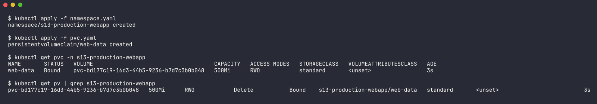

PVC bound straight away (StorageClass binding mode is `Immediate`), PV created by the provisioner.

```bash
kubectl apply -f deployment.yaml
kubectl apply -f service.yaml
kubectl rollout status deploy/web-app -n s13-production-webapp
kubectl get pods -n s13-production-webapp -o wide
```

```
deployment.apps/web-app created
service/web-service created
Waiting for deployment "web-app" rollout to finish: 0 of 2 updated replicas are available...
Waiting for deployment "web-app" rollout to finish: 1 of 2 updated replicas are available...
deployment "web-app" successfully rolled out

NAME                      READY   STATUS    RESTARTS   AGE   IP             NODE
web-app-d45775485-5bqzh   1/1     Running   0          9s    10.244.0.191   minikube
web-app-d45775485-7pwgw   1/1     Running   0          9s    10.244.0.192   minikube
```

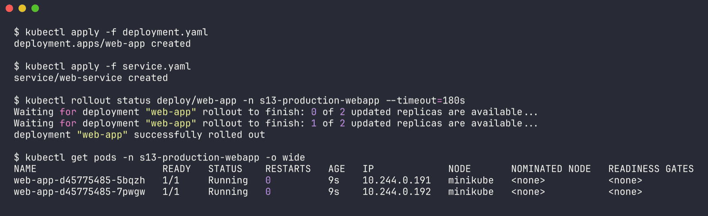

```bash
kubectl apply -f hpa.yaml
kubectl get hpa -n s13-production-webapp
```

```
NAME          REFERENCE            TARGETS              MINPODS   MAXPODS   REPLICAS   AGE
web-app-hpa   Deployment/web-app   cpu: <unknown>/50%   2         5         2          0s
```

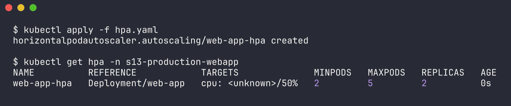

`<unknown>` at first - in my case metrics-server was still pulling its image (that's troubleshooting issue 2 from the class README, live). The HPA events show it:

```
Warning  FailedGetResourceMetric  32m (x21 over 37m)  horizontal-pod-autoscaler  failed to get cpu utilization: unable to get metrics for resource cpu: unable to fetch metrics from resource metrics API: the server is currently unable to handle the request (get pods.metrics.k8s.io)
```

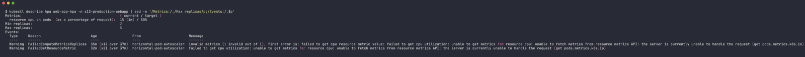

Once metrics-server was up it turned into a real number. Output: `outputs/01-deploy.txt`.

## Step 2 - Verify all the parts

```bash
kubectl get all,pvc -n s13-production-webapp
```

```
NAME                          READY   STATUS    RESTARTS   AGE
pod/web-app-d45775485-7hqhq   1/1     Running   0          13m
pod/web-app-d45775485-rfbx4   1/1     Running   0          13m

NAME                  TYPE        CLUSTER-IP       EXTERNAL-IP   PORT(S)   AGE
service/web-service   ClusterIP   10.101.203.114   <none>        80/TCP    16m

NAME                      READY   UP-TO-DATE   AVAILABLE   AGE
deployment.apps/web-app   2/2     2            2           16m

NAME                                              REFERENCE            TARGETS       MINPODS   MAXPODS   REPLICAS   AGE
horizontalpodautoscaler.autoscaling/web-app-hpa   Deployment/web-app   cpu: 1%/50%   2         5         2          16m

NAME                             STATUS   VOLUME                                     CAPACITY   ACCESS MODES   STORAGECLASS
persistentvolumeclaim/web-data   Bound    pvc-bd177c19-16d3-44b5-9236-b7d7c3b0b048   500Mi      RWO            standard
```

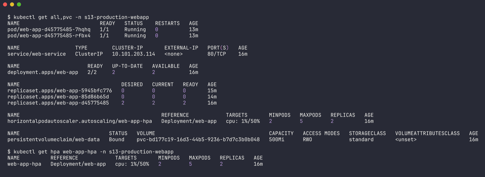

(the extra old ReplicaSets in the raw output are from the bonus challenges, which I ran before this check)

HPA healthy:

```
Metrics:                                               ( current / target )
  resource cpu on pods  (as a percentage of request):  1% (1m) / 50%
Min replicas:                                          2
Max replicas:                                          5
Conditions:
  AbleToScale     True    ReadyForNewScale  recommended size matches current size
  ScalingActive   True    ValidMetricFound  the HPA was able to successfully calculate a replica count from cpu resource utilization (percentage of request)
  ScalingLimited  True    TooFewReplicas    the desired replica count is less than the minimum replica count
```

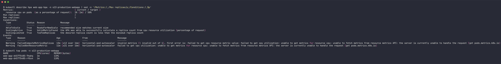

`TooFewReplicas` just means "at idle I'd want 1 pod but minReplicas is 2".

Probes, requests and the volume on a running pod:

```bash
kubectl describe pod web-app-d45775485-7hqhq -n s13-production-webapp
```

```
    Ready:          True
    Restart Count:  0
    Limits:
      cpu:     200m
      memory:  128Mi
    Requests:
      cpu:        100m
      memory:     64Mi
    Liveness:     http-get http://:80/ delay=5s timeout=2s period=5s successThreshold=1 failureThreshold=3
    Readiness:    http-get http://:80/ delay=5s timeout=2s period=5s successThreshold=1 failureThreshold=2
    Startup:      http-get http://:80/ delay=0s timeout=1s period=2s successThreshold=1 failureThreshold=30
      /data from persistent-storage (rw)
  Ready                       True
  ContainersReady             True
```

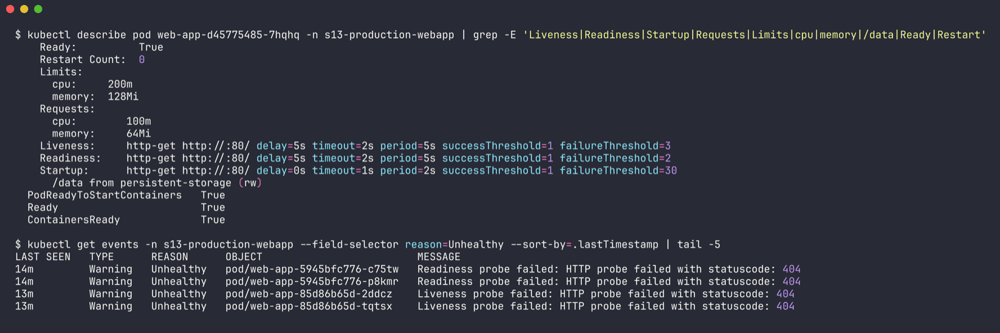

All three probes passing (`Ready True`, `Restart Count 0`). Output: `outputs/04-verify-all.txt`.

## Verification Task 1 - Storage persistence

```bash
POD_NAME=$(kubectl get pods -n s13-production-webapp -l app=web-app -o jsonpath='{.items[0].metadata.name}')
kubectl exec -n s13-production-webapp "$POD_NAME" -- sh -c 'echo "Student: Ridaa Mirza (24BCS10394)" > /data/student.txt'
kubectl exec -n s13-production-webapp "$POD_NAME" -- cat /data/student.txt
```

```
POD_NAME=web-app-d45775485-5bqzh
Student: Ridaa Mirza (24BCS10394)
```

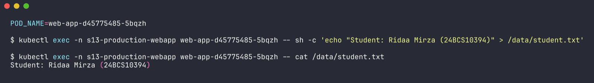

The other replica sees it too (same PVC, both pods on the one minikube node so RWO is fine):

```
$ kubectl exec -n s13-production-webapp web-app-d45775485-7pwgw -- cat /data/student.txt
Student: Ridaa Mirza (24BCS10394)
```

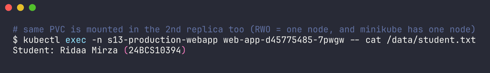

Delete the pod, let the Deployment replace it, read again from the **new** pod:

```bash
kubectl delete pod -n s13-production-webapp "$POD_NAME"
kubectl get pods -n s13-production-webapp
NEW_POD=web-app-d45775485-6m4qb
kubectl exec -n s13-production-webapp "$NEW_POD" -- cat /data/student.txt
```

```
pod "web-app-d45775485-5bqzh" deleted from s13-production-webapp namespace

NAME                      READY   STATUS    RESTARTS   AGE
web-app-d45775485-6m4qb   1/1     Running   0          8s
web-app-d45775485-7pwgw   1/1     Running   0          26s

Student: Ridaa Mirza (24BCS10394)
```

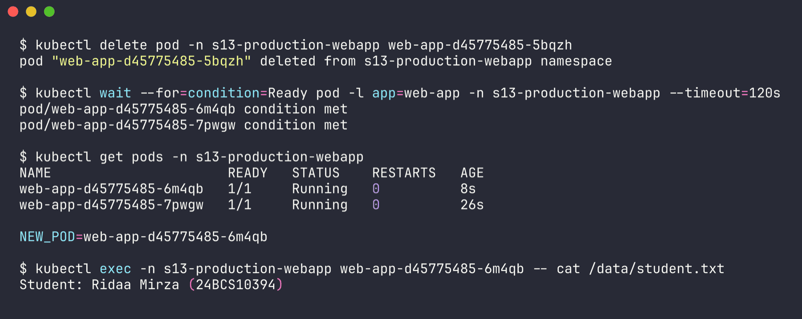

Data survived. It was also still there at the very end after two broken rollouts and a bunch of liveness restarts (bonus 3 below). Output: `outputs/02-storage-persistence.txt`.

## Verification Task 2 - Service

```bash
kubectl port-forward -n s13-production-webapp svc/web-service 18080:80 &
curl -s http://localhost:18080 | head -5
```

(18080 instead of 8080 so it doesn't clash with anything else running locally)

```
<!DOCTYPE html>
<html>
<head>
<title>Welcome to nginx!</title>
<style>

HTTP 200
```

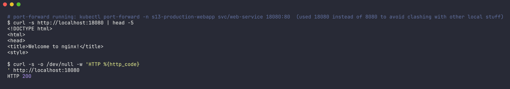

```
NAME                ADDRESSTYPE   PORTS   ENDPOINTS                   AGE
web-service-5g5vp   IPv4          80      10.244.0.192,10.244.0.193   36s
```

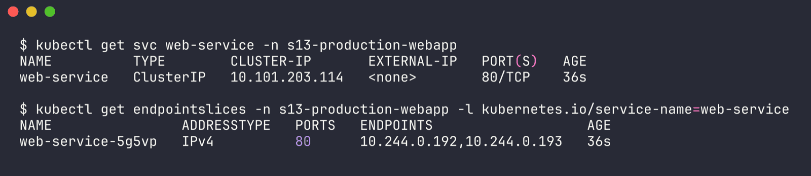

Both pods are behind the service. Output: `outputs/03-service.txt`.

## Verification Task 3 - HPA elastic scaling

The class README uses a one-off `kubectl run load-generator` pod. I made it a Deployment (`load-generator.yaml`) so it's in git and easy to delete. One busybox pod wasn't going to be enough here - in the `02-hpa` lab one generator pod topped out at its 300m limit and only produced ~30m of nginx CPU, and this app's request is 100m - so it runs **3 replicas**.

```bash
./watch-hpa.sh s13-production-webapp web-app-hpa web-app outputs/07-hpa-load-snapshots.txt 20 &
kubectl apply -f load-generator.yaml                 # 17:13:07
```

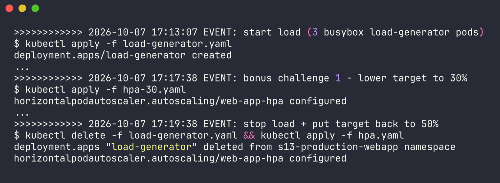

| Time | Event | CPU / target | Replicas |
| --- | --- | --- | --- |
| 17:13:07 | **load started** (3 generator pods) | 1% / 50% | 2 |
| 17:14:47 | | 45% / 50% | 2 |
| 17:15:28 | | 57% / 50% | 2 |
| 17:15:48 | HPA scaled up | 57% / 50% | **3** |
| 17:17:29 | settled | 39% / 50% | 3 |
| 17:17:38 | **bonus 1: target lowered to 30%** | | |
| 17:17:49 | HPA scaled up again | 39% / 30% | **4** |
| 17:19:30 | settled | 30% / 30% | 4 |
| 17:19:38 | **load stopped**, target back to 50% | | |
| 17:21:31 | | 5% / 50% | 4 |
| 17:22:32 | idle | 1% / 50% | 4 |
| 17:25:07 | scale down | 1% / 50% | **3** |
| 17:26:45 | scale down | 1% / 50% | **2** |

Snapshot at the first scale up:

```
=================== 2026-10-07 17:15:48 ===================
NAME          REFERENCE            TARGETS        MINPODS   MAXPODS   REPLICAS   AGE
web-app-hpa   Deployment/web-app   cpu: 57%/50%   2         5         3          26m

NAME                      READY   STATUS    RESTARTS   AGE
web-app-d45775485-7hqhq   1/1     Running   0          23m
web-app-d45775485-9lhzv   1/1     Running   0          31s
web-app-d45775485-rfbx4   1/1     Running   0          23m

NAME                              CPU(cores)   MEMORY(bytes)
load-generator-84c55d9497-dfwg6   300m         5Mi
load-generator-84c55d9497-skfh6   300m         5Mi
load-generator-84c55d9497-twrqw   300m         5Mi
web-app-d45775485-7hqhq           57m          14Mi
web-app-d45775485-rfbx4           57m          14Mi
```

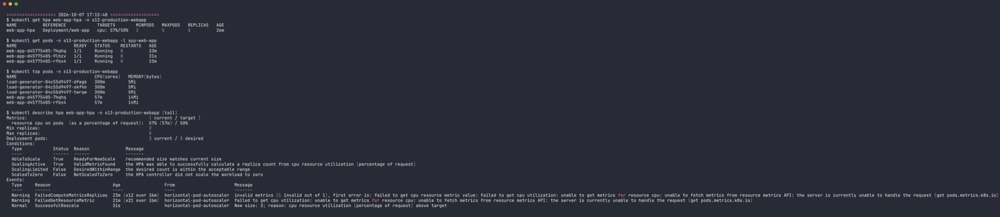

`ceil(2 * 57 / 50) = 3`. With 3 pods sharing the load it dropped to 39%, under 50%, so it stopped there - it didn't need to go to 5.

HPA + Deployment events for the whole run:

```
Normal   SuccessfulRescale   12m    horizontal-pod-autoscaler  New size: 3; reason: cpu resource utilization (percentage of request) above target
Normal   SuccessfulRescale   10m    horizontal-pod-autoscaler  New size: 4; reason: cpu resource utilization (percentage of request) above target
Normal   SuccessfulRescale   3m1s   horizontal-pod-autoscaler  New size: 3; reason: All metrics below target
Normal   SuccessfulRescale   84s    horizontal-pod-autoscaler  New size: 2; reason: All metrics below target

Scaled up replica set web-app-d45775485 from 2 to 3
Scaled up replica set web-app-d45775485 from 3 to 4
Scaled down replica set web-app-d45775485 from 4 to 3
Scaled down replica set web-app-d45775485 from 3 to 2
```

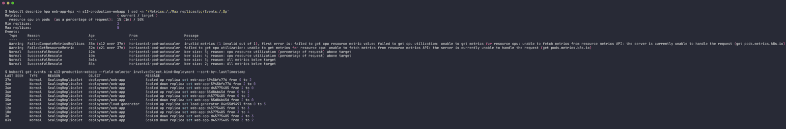

Scale down was in two steps this time, unlike `02-hpa` where it dropped 5 -> 2 at once. Reason: right after I stopped the load the metric still read 30% for ~1.5 min (lag), and at 50% target that's a recommendation of `ceil(4 * 30/50) = 3`. The 5-minute window remembers the highest recommendation: "4" until ~5 min after 17:19:30, then "3" until ~5 min after the last 30% reading (17:21:11). So 4 -> 3 around 17:25, 3 -> 2 around 17:26. Outputs: `outputs/07-hpa-load-snapshots.txt`, `outputs/08-after-scaledown.txt`.

## Bonus challenges

### Challenge 1 - Target tuning (50% -> 30%)

Done during the load test above with `kubectl apply -f hpa-30.yaml`. With the same load it went from 3 replicas (39% vs 50% = fine) to 4 replicas (39% vs 30% = too high, `ceil(3 * 39/30) = 4`) within one HPA sync. Lower target = scales out earlier and keeps more headroom, but costs more pods. Put back to 50% with `kubectl apply -f hpa.yaml`.

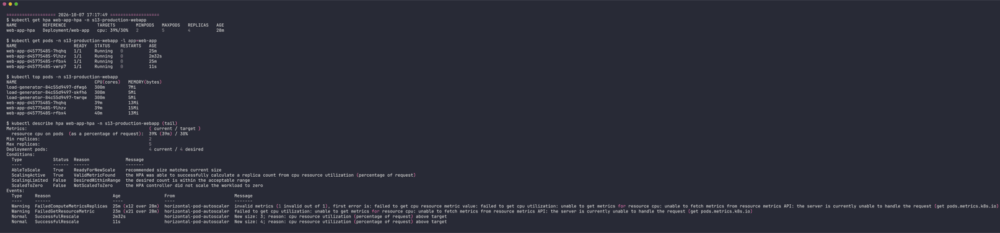

### Challenge 2 - Readiness gating

```bash
kubectl patch deploy web-app -n s13-production-webapp --type=json \
  -p='[{"op":"replace","path":"/spec/template/spec/containers/0/readinessProbe/httpGet/path","value":"/does-not-exist"}]'
kubectl get pods -n s13-production-webapp -l app=web-app
kubectl get endpoints web-service -n s13-production-webapp
```

```
NAME                       READY   STATUS    RESTARTS   AGE
web-app-5945bfc776-c75tw   0/1     Running   0          30s
web-app-5945bfc776-p8kmr   0/1     Running   0          30s

NAME          ENDPOINTS   AGE
web-service               79s

10.244.0.194 ready=false
10.244.0.195 ready=false

Warning  Unhealthy  2s (x5 over 22s)  kubelet  spec.containers{nginx}: Readiness probe failed: HTTP probe failed with statuscode: 404
```

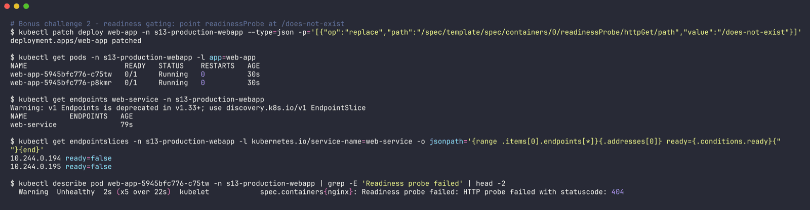

Exactly as the README said: `Running` but `0/1`, endpoints empty, no restarts. And because of `strategy: Recreate` the old good pods were already gone - so a bad readiness path = **full outage**. With RollingUpdate the old pods would have stayed serving while the new ones never became ready. Reverted with `kubectl apply -f deployment.yaml`, endpoints came back (`10.244.0.196:80,10.244.0.197:80`). Output: `outputs/05-bonus-readiness.txt`.

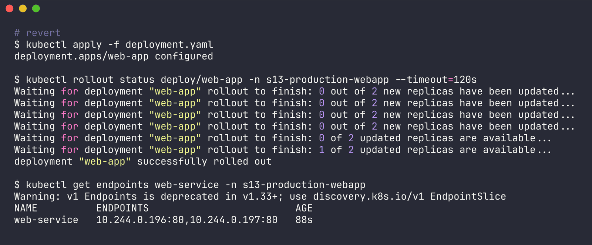

### Challenge 3 - Liveness restart loop

```bash
kubectl patch deploy web-app -n s13-production-webapp --type=json \
  -p='[{"op":"replace","path":"/spec/template/spec/containers/0/livenessProbe/httpGet/path","value":"/crash"}]'
```

```
# 16:51:32
web-app-85d86b65d-2ddcz   0/1     Running   1 (4s ago)    20s
# 16:51:52
web-app-85d86b65d-2ddcz   1/1     Running   2 (9s ago)    40s
# 16:52:12
web-app-85d86b65d-2ddcz   1/1     Running   3 (14s ago)   60s
# 16:52:32
web-app-85d86b65d-2ddcz   0/1     CrashLoopBackOff   3 (19s ago)   80s

Warning  Unhealthy  19s (x12 over 74s)  kubelet  Liveness probe failed: HTTP probe failed with statuscode: 404
Normal   Killing    19s (x4 over 64s)   kubelet  Container nginx failed liveness probe, will be restarted
```

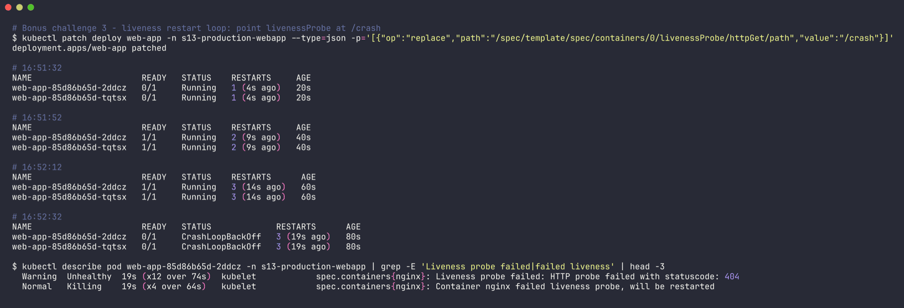

Restart count went up roughly every 15-20s (5s initial delay + 3 failures x 5s), and after a few restarts kubelet starts backing off, so the pod shows `CrashLoopBackOff`. Note the pod flips between `0/1` and `1/1` - readiness (`/`) is fine, it's only liveness (`/crash`) that's wrong, which is a nice illustration that the two are independent. Reverted, and the PVC data was still there:

```
$ kubectl exec -n s13-production-webapp web-app-d45775485-7hqhq -- cat /data/student.txt
Student: Ridaa Mirza (24BCS10394)
```

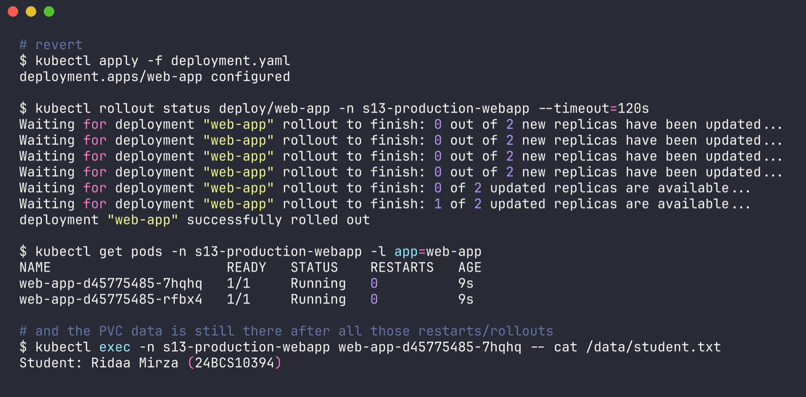

Output: `outputs/06-bonus-liveness.txt`.

## Probe reference

| Probe | Question | On failure | Seen here |
| :--- | :--- | :--- | :--- |
| Startup | has the process finished starting? | restart; other probes wait until it passes | passing on every pod (`Startup: ... failureThreshold=30`) |
| Readiness | can the pod take traffic? | removed from Service endpoints, no restart | bonus 2 - endpoints empty |
| Liveness | is the container alive? | kubelet restarts the container | bonus 3 - restarts -> CrashLoopBackOff |

## Troubleshooting (what I actually hit)

| Symptom | Cause | Fix |
| --- | --- | --- |
| HPA `cpu: <unknown>/50%`, `kubectl top` says `Metrics API not available` | metrics-server not running yet (image still pulling on the shared cluster) | `minikube addons enable metrics-server` and wait until `kubectl top pods` works |
| HPA never scales even under load | load too small vs. the 100m request - nginx is cheap | more load generator replicas (3 here), or lower the target |
| Pods `0/1 Running`, service returns nothing | readiness probe path wrong | fix the path, check `kubectl get endpoints` / endpointslices |
| `CrashLoopBackOff`, restarts climbing | liveness probe path wrong | fix the path, `kubectl describe pod` shows `Liveness probe failed` |
| PVC `Pending` (didn't happen, but checked) | no default StorageClass | `kubectl get sc` should show `standard (default)` |

## Cleanup

```bash
kubectl delete -f load-generator.yaml     # done right after the load test
kubectl delete namespace s13-production-webapp
```

Deleting the namespace deletes the PVC, and since the `standard` class uses reclaim policy `Delete`, the PV should go with it. This time it got stuck as `Released` (the minikube `storage-provisioner` pod had restarted right around then and never picked it up), so after ~2 minutes I removed it by hand:

```
pvc-bd177c19-16d3-44b5-9236-b7d7c3b0b048   500Mi   RWO   Delete   Released   s13-production-webapp/web-data   standard   40m

$ kubectl delete pv pvc-bd177c19-16d3-44b5-9236-b7d7c3b0b048
persistentvolume "pvc-bd177c19-16d3-44b5-9236-b7d7c3b0b048" deleted
```

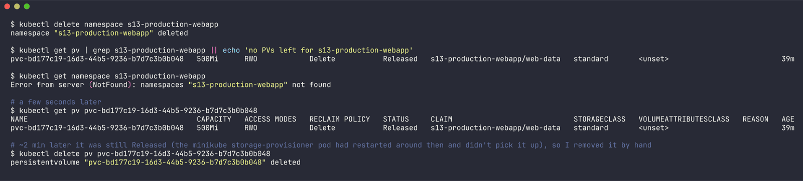

Output: `outputs/09-cleanup.txt`.
