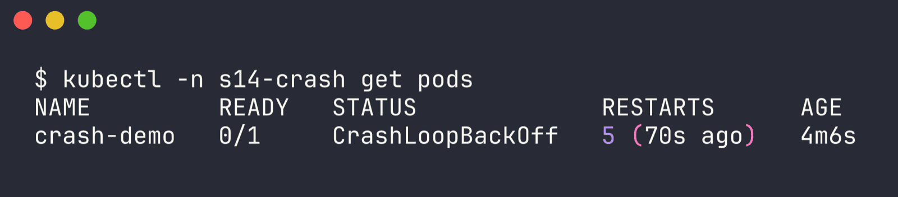
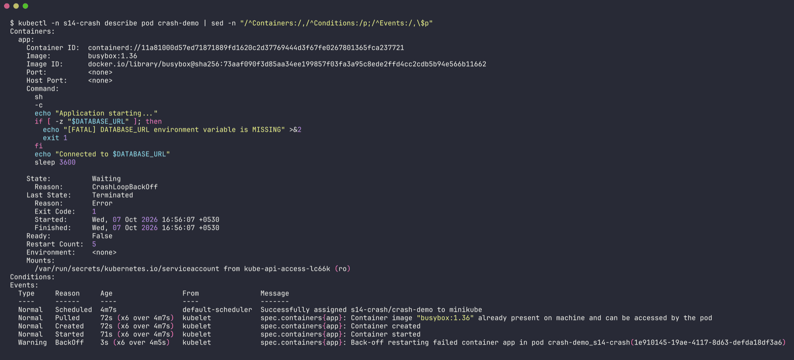
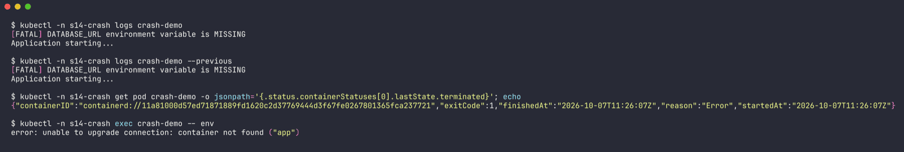
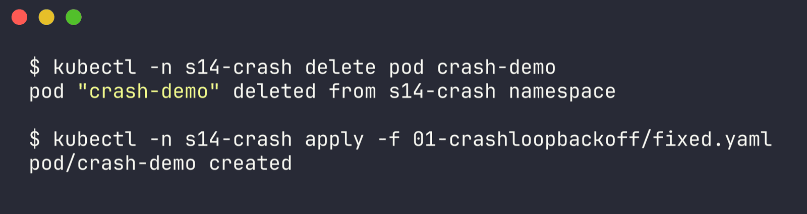
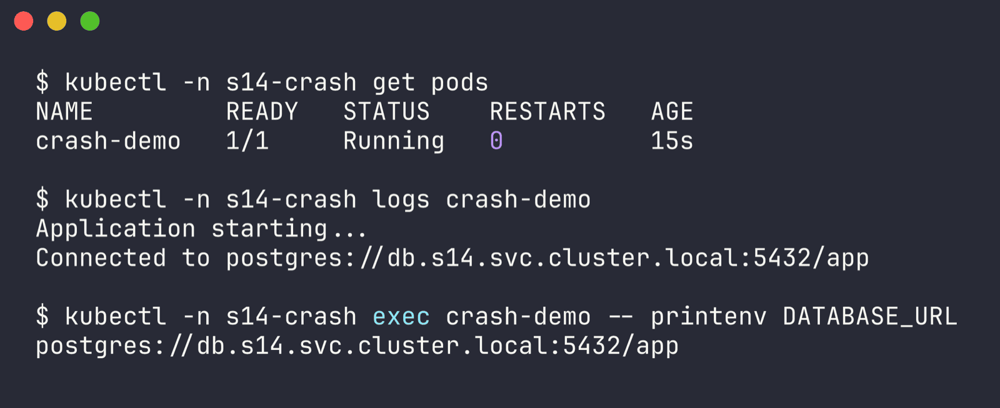

# Issue 1 - CrashLoopBackOff

Namespace: `s14-crash` | files: `broken.yaml`, `fixed.yaml` | raw output: [`../outputs/01-crashloopbackoff.txt`](../outputs/01-crashloopbackoff.txt)

```bash
kubectl create ns s14-crash
kubectl -n s14-crash apply -f broken.yaml
```

## 1. Identify

```bash
$ kubectl -n s14-crash get pods
NAME         READY   STATUS             RESTARTS      AGE
crash-demo   0/1     CrashLoopBackOff   5 (70s ago)   4m6s
```



`0/1` + a restart counter that keeps climbing. The pod gets scheduled and the image pulls fine, it's the process inside that keeps dying.

## 2. Investigate

describe first - `Last State` tells me how the previous run ended:

```bash
$ kubectl -n s14-crash describe pod crash-demo
...
    State:          Waiting
      Reason:       CrashLoopBackOff
    Last State:     Terminated
      Reason:       Error
      Exit Code:    1
      Started:      Wed, 07 Oct 2026 16:56:07 +0530
      Finished:     Wed, 07 Oct 2026 16:56:07 +0530
    Ready:          False
    Restart Count:  5
    Environment:    <none>
...
Events:
  Normal   Pulled     72s (x6 over 4m7s)  kubelet  Container image "busybox:1.36" already present on machine ...
  Normal   Started    71s (x6 over 4m7s)  kubelet  Container started
  Warning  BackOff    3s (x6 over 4m5s)   kubelet  Back-off restarting failed container app in pod crash-demo_s14-crash(...)
```



Exit code 1 (an app error, not 137/OOM), started and finished in the same second, and `Environment: <none>`. Then the logs:

```bash
$ kubectl -n s14-crash logs crash-demo --previous
[FATAL] DATABASE_URL environment variable is MISSING
Application starting...

$ kubectl -n s14-crash get pod crash-demo -o jsonpath='{.status.containerStatuses[0].lastState.terminated}'
{"containerID":"containerd://11a8...","exitCode":1,"finishedAt":"2026-10-07T11:26:07Z","reason":"Error","startedAt":"2026-10-07T11:26:07Z"}

$ kubectl -n s14-crash exec crash-demo -- env
error: unable to upgrade connection: container not found ("app")
```



exec is useless here - there's no running container to exec into most of the time. Logs are the tool for crash loops.

## 3. Root cause

The app checks for `DATABASE_URL` on startup and exits 1 if it isn't set. The pod spec never sets it, so every start fails immediately, kubelet restarts it with an increasing back-off (10s, 20s, 40s ... up to 5 min) and the status shows CrashLoopBackOff.

## 4. Fix

`fixed.yaml` adds the env var:

```yaml
      env:
        - name: DATABASE_URL
          value: "postgres://db.s14.svc.cluster.local:5432/app"
```

Pod env is immutable so it's delete + apply:

```bash
kubectl -n s14-crash delete pod crash-demo
kubectl -n s14-crash apply -f fixed.yaml
```



## 5. Verify

```bash
$ kubectl -n s14-crash get pods
NAME         READY   STATUS    RESTARTS   AGE
crash-demo   1/1     Running   0          15s

$ kubectl -n s14-crash logs crash-demo
Application starting...
Connected to postgres://db.s14.svc.cluster.local:5432/app

$ kubectl -n s14-crash exec crash-demo -- printenv DATABASE_URL
postgres://db.s14.svc.cluster.local:5432/app
```



## 6. Notes

- CrashLoopBackOff is not an error by itself, it's kubelet saying "I keep restarting this and it keeps dying". The real reason is always in `Last State` + logs.
- `--previous` matters once the container has restarted: plain `logs` shows the current attempt, `--previous` shows the one that died. In Task 1 I show them being different.
- Exit code cheat sheet I used: `1` = app error, `137` = SIGKILL (usually OOMKilled, see issue 10), `127` = command not found, `0` + CrashLoopBackOff = the process finished normally but `restartPolicy: Always` keeps restarting it (e.g. a script without a long-running process).
- In a real Deployment I'd put the URL in a ConfigMap/Secret instead of hard-coding it.
