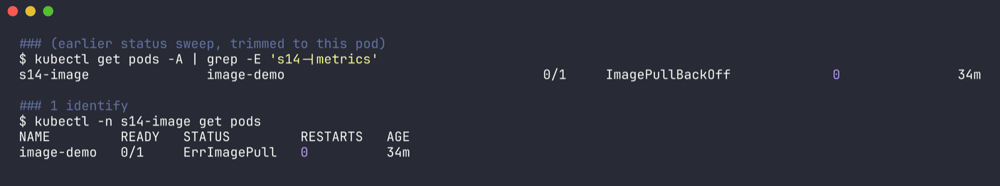
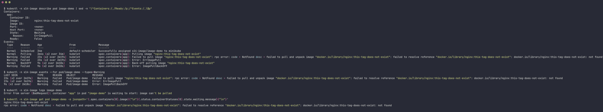
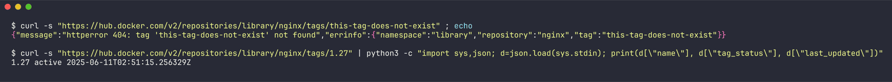
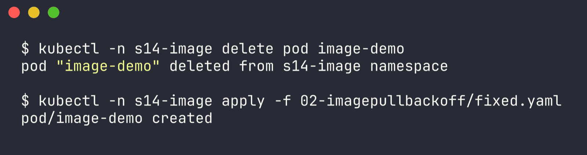
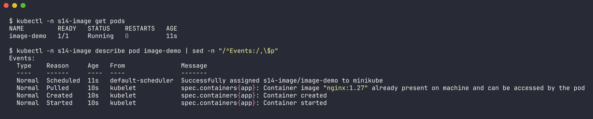

# Issue 2 - ImagePullBackOff (tag doesn't exist)

Namespace: `s14-image` | files: `broken.yaml`, `fixed.yaml` | raw output: [`../outputs/02-imagepullbackoff.txt`](../outputs/02-imagepullbackoff.txt)

```bash
kubectl -n s14-image apply -f broken.yaml   # image: nginx:this-tag-does-not-exist
```

## 1. Identify

```bash
$ kubectl get pods -A | grep -E 's14-|metrics'      # my status sweep across all my namespaces (trimmed)
s14-image               image-demo                                 0/1     ImagePullBackOff             0               34m

$ kubectl -n s14-image get pods                 # a few seconds later, mid-retry
NAME         READY   STATUS         RESTARTS   AGE
image-demo   0/1     ErrImagePull   0          34m
```



The status flips between `ErrImagePull` and `ImagePullBackOff` - same problem, different moment (see issue 3).

## 2. Investigate

```bash
$ kubectl -n s14-image describe pod image-demo
...
    Image:          nginx:this-tag-does-not-exist
    State:          Waiting
      Reason:       ErrImagePull
...
Events:
  Normal   Pulling    2m4s (x2 over 34m)   kubelet  Pulling image "nginx:this-tag-does-not-exist"
  Warning  Failed     23s (x2 over 2m19s)  kubelet  Failed to pull image "nginx:this-tag-does-not-exist": rpc error: code = NotFound desc = failed to pull and unpack image "docker.io/library/nginx:this-tag-does-not-exist": failed to resolve reference "docker.io/library/nginx:this-tag-does-not-exist": docker.io/library/nginx:this-tag-does-not-exist: not found
  Warning  Failed     23s (x2 over 2m19s)  kubelet  Error: ErrImagePull
  Normal   BackOff    9s (x2 over 2m18s)   kubelet  Back-off pulling image "nginx:this-tag-does-not-exist"
  Warning  Failed     9s (x2 over 2m18s)   kubelet  Error: ImagePullBackOff

$ kubectl -n s14-image logs image-demo
Error from server (BadRequest): container "app" in pod "image-demo" is waiting to start: image can't be pulled
```



Logs are empty because the container never existed. The key words are `code = NotFound ... not found`: the registry was reachable and the repo exists (`library/nginx`), it's the tag. Double-checked against Docker Hub from my laptop:

```bash
$ curl -s "https://hub.docker.com/v2/repositories/library/nginx/tags/this-tag-does-not-exist"
{"message":"httperror 404: tag 'this-tag-does-not-exist' not found",...}

$ curl -s ".../library/nginx/tags/1.27" | python3 -c '...'
1.27 active 2025-06-11T02:51:15.256329Z
```



## 3. Root cause

Typo / made-up image tag. `nginx:this-tag-does-not-exist` doesn't exist on Docker Hub, so every pull fails and kubelet backs off between retries.

## 4. Fix

```yaml
      image: nginx:1.27
```

```bash
kubectl -n s14-image delete pod image-demo
kubectl -n s14-image apply -f fixed.yaml
```



(For a Deployment I'd just `kubectl set image deploy/x app=nginx:1.27` and let it roll.)

## 5. Verify

```bash
$ kubectl -n s14-image get pods
NAME         READY   STATUS    RESTARTS   AGE
image-demo   1/1     Running   0          11s

Events:
  Normal  Scheduled  11s  default-scheduler  Successfully assigned s14-image/image-demo to minikube
  Normal  Pulled     10s  kubelet            Container image "nginx:1.27" already present on machine ...
  Normal  Started    10s  kubelet            Container started
```



## 6. Notes

How I tell pull failures apart from the event message:

| message contains | meaning |
| --- | --- |
| `not found` / `manifest unknown` | tag doesn't exist (this issue) |
| `pull access denied, repository does not exist or may require authorization` | repo name wrong, or private repo with no `imagePullSecrets` (seen in the triage gauntlet, scenario 2) |
| `dial tcp: lookup ... no such host` | registry hostname wrong / unreachable (issue 3) |
| `toomanyrequests` | Docker Hub rate limit |

Side note from this run: the cluster was shared and kubelet pulls images one at a time by default, so this pod sat in `ContainerCreating` with a `Pulling` event for a long time before it even got to fail. `ContainerCreating` + `Pulling` for ages = slow pull, not necessarily a broken image.
