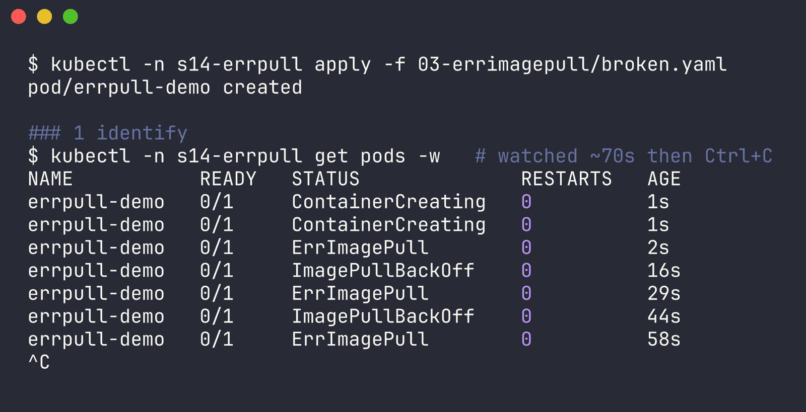
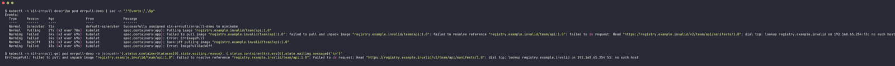
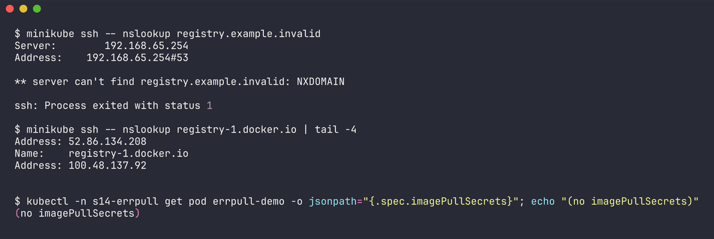
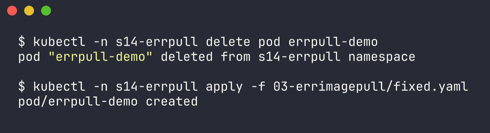
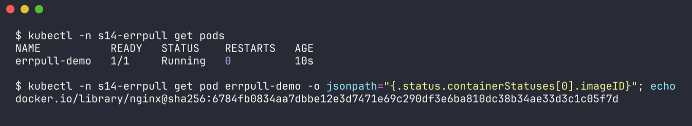

# Issue 3 - ErrImagePull (registry host doesn't exist)

Namespace: `s14-errpull` | files: `broken.yaml`, `fixed.yaml` | raw output: [`../outputs/03-errimagepull.txt`](../outputs/03-errimagepull.txt)

Issue 2 was a bad *tag*. For this one I wanted a different cause, so the image points at a registry hostname that doesn't exist: `registry.example.invalid/team/api:1.0` (like a typo'd private registry URL).

## 1. Identify

I watched it live right after applying, which shows how ErrImagePull and ImagePullBackOff relate:

```bash
$ kubectl -n s14-errpull get pods -w
NAME           READY   STATUS              RESTARTS   AGE
errpull-demo   0/1     ContainerCreating   0          1s
errpull-demo   0/1     ErrImagePull        0          2s
errpull-demo   0/1     ImagePullBackOff    0          16s
errpull-demo   0/1     ErrImagePull        0          29s
errpull-demo   0/1     ImagePullBackOff    0          44s
errpull-demo   0/1     ErrImagePull        0          58s
^C
```



`ErrImagePull` = the pull attempt just failed. `ImagePullBackOff` = kubelet is waiting before the next attempt (the wait grows each time, capped at 5 min). So it cycles between them.

## 2. Investigate

```bash
$ kubectl -n s14-errpull describe pod errpull-demo
Events:
  Normal   Pulling    27s (x3 over 70s)  kubelet  Pulling image "registry.example.invalid/team/api:1.0"
  Warning  Failed     24s (x3 over 69s)  kubelet  Failed to pull image "registry.example.invalid/team/api:1.0": failed to pull and unpack image "registry.example.invalid/team/api:1.0": failed to resolve reference "registry.example.invalid/team/api:1.0": failed to do request: Head "https://registry.example.invalid/v2/team/api/manifests/1.0": dial tcp: lookup registry.example.invalid on 192.168.65.254:53: no such host
  Warning  Failed     24s (x3 over 69s)  kubelet  Error: ErrImagePull
  Normal   BackOff    13s (x3 over 69s)  kubelet  Back-off pulling image "registry.example.invalid/team/api:1.0"
  Warning  Failed     13s (x3 over 69s)  kubelet  Error: ImagePullBackOff
```



`dial tcp: lookup ... no such host` - this one never even reached a registry, it died at DNS. Note it's the *node's* resolver (192.168.65.254, Docker Desktop's DNS), not CoreDNS - image pulls are done by the node's container runtime, not by a pod. So I checked from the node:

```bash
$ minikube ssh -- nslookup registry.example.invalid
Server:		192.168.65.254
Address:	192.168.65.254#53

** server can't find registry.example.invalid: NXDOMAIN

$ minikube ssh -- nslookup registry-1.docker.io | tail -4
Address: 52.86.134.208
Name:	registry-1.docker.io
Address: 100.48.137.92

$ kubectl -n s14-errpull get pod errpull-demo -o jsonpath="{.spec.imagePullSecrets}"; echo "(no imagePullSecrets)"
(no imagePullSecrets)
```



Node DNS is fine for Docker Hub, it just can't resolve the made-up registry.

## 3. Root cause

Wrong registry hostname in the image reference. The node can't resolve `registry.example.invalid`, so containerd can't even start the pull.

## 4. Fix

```yaml
      image: docker.io/library/nginx:1.27
```

```bash
kubectl -n s14-errpull delete pod errpull-demo
kubectl -n s14-errpull apply -f fixed.yaml
```



## 5. Verify

```bash
$ kubectl -n s14-errpull get pods
NAME           READY   STATUS    RESTARTS   AGE
errpull-demo   1/1     Running   0          10s

$ kubectl -n s14-errpull get pod errpull-demo -o jsonpath="{.status.containerStatuses[0].imageID}"
docker.io/library/nginx@sha256:6784fb0834aa7dbbe12e3d7471e69c290df3e6ba810dc38b34ae33d3c1c05f7d
```



## 6. Notes

- ErrImagePull vs ImagePullBackOff isn't two different bugs - it's the same failing pull at two points in the retry loop. Read the `Failed to pull image` event to find which bug it actually is.
- If the registry were real but private, the message would be `401 Unauthorized` / `pull access denied` and the fix would be an `imagePullSecrets` entry (`kubectl create secret docker-registry ...`).
- Pinning the full `docker.io/library/...` path in fixed.yaml makes it obvious which registry is used.
