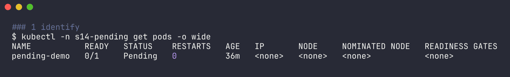
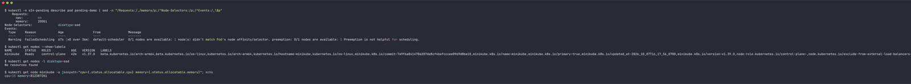
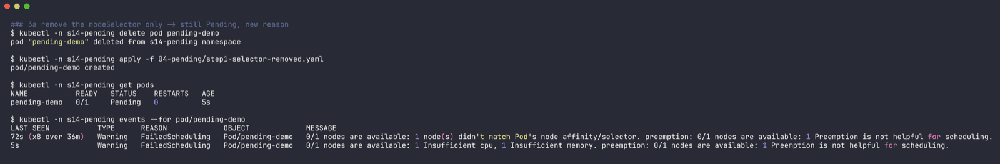
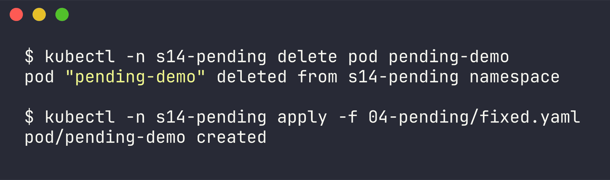
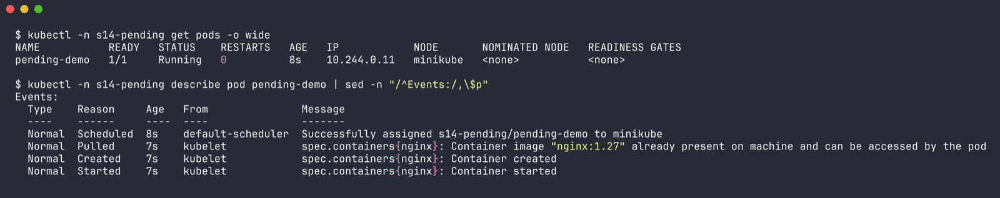

# Issue 4 - Pending

Namespace: `s14-pending` | files: `broken.yaml`, `step1-selector-removed.yaml`, `fixed.yaml` | raw output: [`../outputs/04-pending.txt`](../outputs/04-pending.txt)

The broken pod has two scheduling problems stacked: a `nodeSelector: disktype=ssd` that no node has, and requests of 64 CPU / 200Gi memory.

## 1. Identify

```bash
$ kubectl -n s14-pending get pods -o wide
NAME           READY   STATUS    RESTARTS   AGE   IP       NODE     NOMINATED NODE   READINESS GATES
pending-demo   0/1     Pending   0          36m   <none>   <none>   <none>           <none>
```



No IP, no NODE. Pending with no node means the scheduler never placed it - nothing on the node side (image, volumes) has even started.

## 2. Investigate

```bash
$ kubectl -n s14-pending describe pod pending-demo
    Requests:
      cpu:        64
      memory:     200Gi
Node-Selectors:              disktype=ssd
Events:
  Warning  FailedScheduling  67s (x8 over 36m)  default-scheduler  0/1 nodes are available: 1 node(s) didn't match Pod's node affinity/selector. preemption: 0/1 nodes are available: 1 Preemption is not helpful for scheduling.

$ kubectl get nodes -l disktype=ssd
No resources found

$ kubectl get node minikube -o jsonpath="cpu={.status.allocatable.cpu} memory={.status.allocatable.memory}"
cpu=15 memory=8123872Ki
```



The scheduler only reports the first filter that knocked the node out, so the event only mentions the selector. I removed just the selector to prove there was a second problem behind it:

```bash
$ kubectl -n s14-pending apply -f step1-selector-removed.yaml
$ kubectl -n s14-pending get pods
NAME           READY   STATUS    RESTARTS   AGE
pending-demo   0/1     Pending   0          5s

$ kubectl -n s14-pending events --for pod/pending-demo
5s   Warning   FailedScheduling   Pod/pending-demo   0/1 nodes are available: 1 Insufficient cpu, 1 Insufficient memory. preemption: 0/1 nodes are available: 1 Preemption is not helpful for scheduling.
```



Still Pending, new reason. (Fun detail: the node reports 15 allocatable CPUs even though minikube was started with 4 - with the docker driver the "node" sees the Docker Desktop VM's CPUs.)

## 3. Root cause

1. `nodeSelector: disktype=ssd` - no node carries that label.
2. Requests (64 CPU, 200Gi) are far bigger than the node's allocatable (15 CPU, ~7.7Gi). Requests are what the scheduler reserves, so no node can ever fit it. Preemption can't help either since there's nothing to evict that would free 64 cores.

## 4. Fix

`fixed.yaml`: drop the selector, ask for what nginx actually needs.

```yaml
      resources:
        requests:
          cpu: 100m
          memory: 64Mi
        limits:
          cpu: 250m
          memory: 128Mi
```

```bash
kubectl -n s14-pending delete pod pending-demo
kubectl -n s14-pending apply -f fixed.yaml
```



(The other valid fix for #1 would be labelling a node, `kubectl label node <node> disktype=ssd` - I didn't do that because the cluster is shared and node changes are off-limits.)

## 5. Verify

```bash
$ kubectl -n s14-pending get pods -o wide
NAME           READY   STATUS    RESTARTS   AGE   IP            NODE       NOMINATED NODE   READINESS GATES
pending-demo   1/1     Running   0          8s    10.244.0.11   minikube   <none>           <none>

Events:
  Normal  Scheduled  8s  default-scheduler  Successfully assigned s14-pending/pending-demo to minikube
  Normal  Started    7s  kubelet            Container started
```



## 6. Notes

Other things that keep a pod Pending, all visible in the `FailedScheduling` event:
- `node(s) had untolerated taint` - taints without matching tolerations
- `pod has unbound immediate PersistentVolumeClaims` - PVC with a storageClass that can't provision
- `Too many pods` - node pod limit
- quota: a ResourceQuota rejects the pod at create time instead (it never even shows up as Pending)

`kubectl describe node <node>` -> `Allocated resources` shows how much is already requested, which is what matters for scheduling, not actual usage from `kubectl top`.
