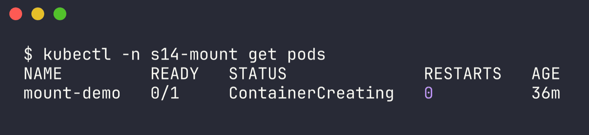
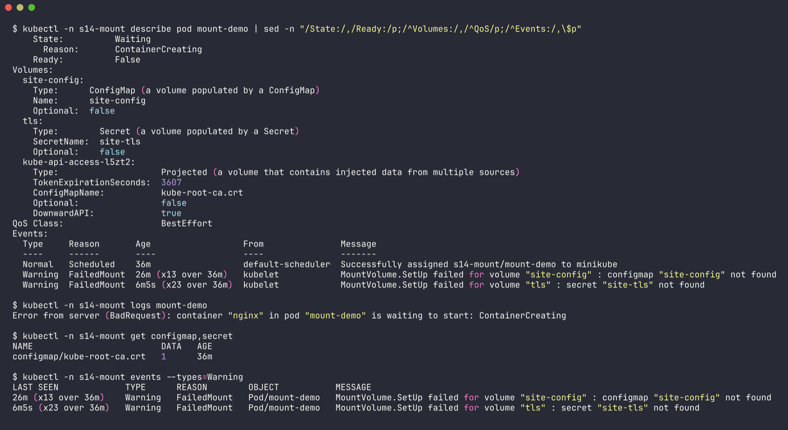
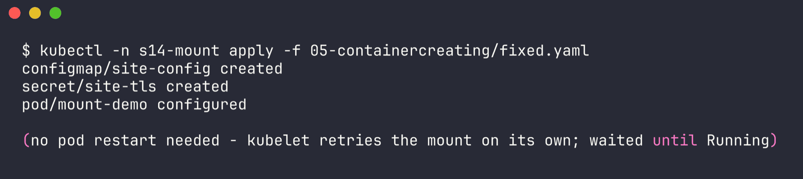
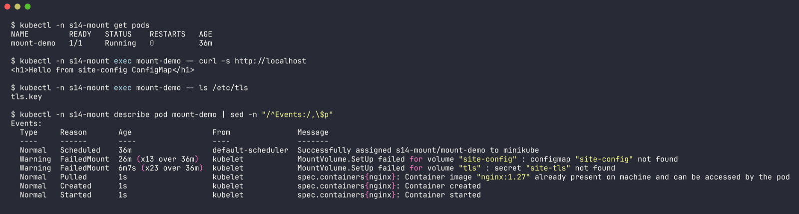

# Issue 5 - stuck in ContainerCreating (missing ConfigMap + Secret volume)

Namespace: `s14-mount` | files: `broken.yaml`, `fixed.yaml` | raw output: [`../outputs/05-containercreating.txt`](../outputs/05-containercreating.txt)

## 1. Identify

```bash
$ kubectl -n s14-mount get pods
NAME         READY   STATUS              RESTARTS   AGE
mount-demo   0/1     ContainerCreating   0          36m
```



ContainerCreating for a few seconds is normal. 36 minutes is not. Unlike Pending, this pod *was* scheduled - kubelet on the node is stuck preparing it.

## 2. Investigate

```bash
$ kubectl -n s14-mount describe pod mount-demo
    State:          Waiting
      Reason:       ContainerCreating
Volumes:
  site-config:
    Type:      ConfigMap (a volume populated by a ConfigMap)
    Name:      site-config
    Optional:  false
  tls:
    Type:        Secret (a volume populated by a Secret)
    SecretName:  site-tls
    Optional:    false
Events:
  Normal   Scheduled    36m                  default-scheduler  Successfully assigned s14-mount/mount-demo to minikube
  Warning  FailedMount  26m (x13 over 36m)   kubelet            MountVolume.SetUp failed for volume "site-config" : configmap "site-config" not found
  Warning  FailedMount  6m5s (x23 over 36m)  kubelet            MountVolume.SetUp failed for volume "tls" : secret "site-tls" not found

$ kubectl -n s14-mount logs mount-demo
Error from server (BadRequest): container "nginx" in pod "mount-demo" is waiting to start: ContainerCreating

$ kubectl -n s14-mount get configmap,secret
NAME                         DATA   AGE
configmap/kube-root-ca.crt   1      36m
```



`FailedMount` on both volumes, and the namespace has neither object (only the auto-created root CA ConfigMap).

## 3. Root cause

The pod mounts ConfigMap `site-config` and Secret `site-tls` as volumes, and neither was created. Both volumes are `Optional: false`, so kubelet refuses to start the container until it can mount them, and keeps retrying.

## 4. Fix

`fixed.yaml` adds the ConfigMap and Secret ahead of the pod:

```bash
$ kubectl -n s14-mount apply -f fixed.yaml
configmap/site-config created
secret/site-tls created
pod/mount-demo configured
```



No pod delete needed here: volumes aren't part of an immutable field change, kubelet is still retrying the mount and just succeeds on its next try.

## 5. Verify

```bash
$ kubectl -n s14-mount get pods
NAME         READY   STATUS    RESTARTS   AGE
mount-demo   1/1     Running   0          36m

$ kubectl -n s14-mount exec mount-demo -- curl -s http://localhost
<h1>Hello from site-config ConfigMap</h1>

$ kubectl -n s14-mount exec mount-demo -- ls /etc/tls
tls.key

Events:
  Warning  FailedMount  6m7s (x23 over 36m)  kubelet  MountVolume.SetUp failed for volume "tls" : secret "site-tls" not found
  Normal   Pulled       1s                   kubelet  Container image "nginx:1.27" already present on machine ...
  Normal   Started      1s                   kubelet  Container started
```



The page nginx serves is now the one from the ConfigMap, so the mount really happened.

## 6. Notes

- Other common ContainerCreating causes: slow/huge image pull (event `Pulling` with nothing after it - I hit this one for real on the shared cluster), CNI not ready (`FailedCreatePodSandBox`), a PVC that's bound but can't attach.
- An *unbound* PVC behaves differently - that keeps the pod in **Pending** (scheduler event), not ContainerCreating.
- Missing ConfigMap used as **env** instead of a volume gives `CreateContainerConfigError` instead - that's issue 9.
- If a volume is genuinely optional, `optional: true` on the configMap/secret volume lets the pod start without it.
