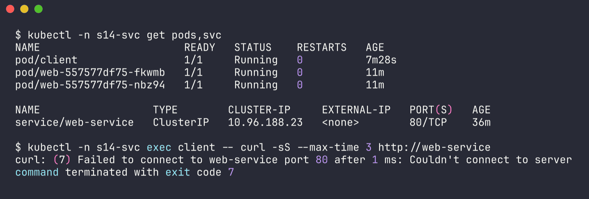
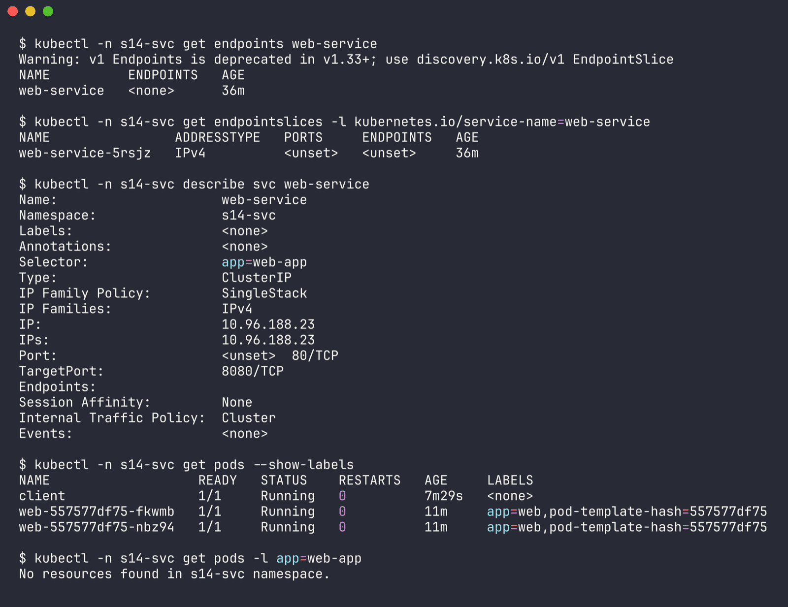
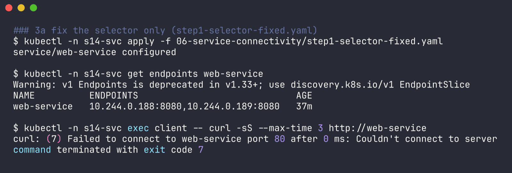
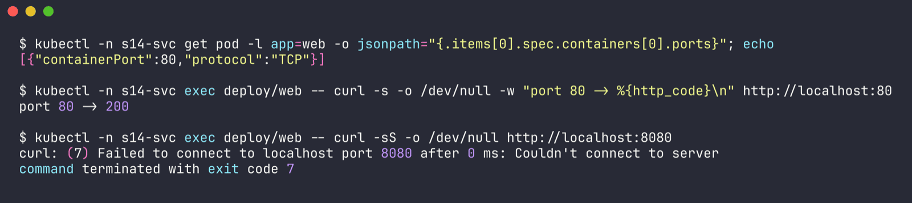
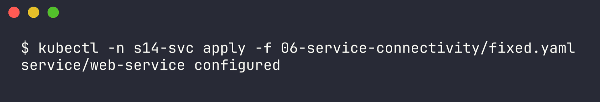
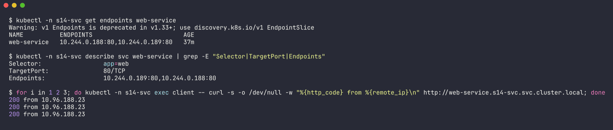

# Issue 6 - Service connectivity (selector mismatch + wrong targetPort)

Namespace: `s14-svc` | files: `app.yaml` (Deployment `web` + `client` pod, same in both cases), `broken.yaml`, `step1-selector-fixed.yaml`, `fixed.yaml` | raw output: [`../outputs/06-service-connectivity.txt`](../outputs/06-service-connectivity.txt)

```bash
kubectl -n s14-svc apply -f app.yaml -f broken.yaml
```

## 1. Identify

Pods are all Running, the Service exists, but nothing gets through:

```bash
$ kubectl -n s14-svc get pods,svc
NAME                       READY   STATUS    RESTARTS   AGE
pod/client                 1/1     Running   0          7m28s
pod/web-557577df75-fkwmb   1/1     Running   0          11m
pod/web-557577df75-nbz94   1/1     Running   0          11m

NAME                  TYPE        CLUSTER-IP     EXTERNAL-IP   PORT(S)   AGE
service/web-service   ClusterIP   10.96.188.23   <none>        80/TCP    36m

$ kubectl -n s14-svc exec client -- curl -sS --max-time 3 http://web-service
curl: (7) Failed to connect to web-service port 80 after 1 ms: Couldn't connect to server
command terminated with exit code 7
```



DNS resolved (it's a connect error, not "could not resolve host"), so the name is fine - the problem is behind the Service.

## 2. Investigate

```bash
$ kubectl -n s14-svc get endpoints web-service
NAME          ENDPOINTS   AGE
web-service   <none>      36m

$ kubectl -n s14-svc describe svc web-service
Selector:                 app=web-app
TargetPort:               8080/TCP
Endpoints:                

$ kubectl -n s14-svc get pods --show-labels
NAME                   READY   STATUS    RESTARTS   AGE     LABELS
web-557577df75-fkwmb   1/1     Running   0          11m     app=web,pod-template-hash=557577df75
web-557577df75-nbz94   1/1     Running   0          11m     app=web,pod-template-hash=557577df75

$ kubectl -n s14-svc get pods -l app=web-app
No resources found in s14-svc namespace.
```



Empty endpoints -> compare selector vs labels -> `app=web-app` vs `app=web`. Running the selector as a label query (`-l app=web-app`) is the quickest proof.

I fixed only the selector first (`step1-selector-fixed.yaml`) to see if that was all:

```bash
$ kubectl -n s14-svc get endpoints web-service
NAME          ENDPOINTS                             AGE
web-service   10.244.0.188:8080,10.244.0.189:8080   37m

$ kubectl -n s14-svc exec client -- curl -sS --max-time 3 http://web-service
curl: (7) Failed to connect to web-service port 80 after 0 ms: Couldn't connect to server
```



Endpoints now exist but they say `:8080`. Check what the container actually listens on:

```bash
$ kubectl -n s14-svc get pod -l app=web -o jsonpath="{.items[0].spec.containers[0].ports}"
[{"containerPort":80,"protocol":"TCP"}]

$ kubectl -n s14-svc exec deploy/web -- curl -s -o /dev/null -w "port 80 -> %{http_code}\n" http://localhost:80
port 80 -> 200

$ kubectl -n s14-svc exec deploy/web -- curl -sS -o /dev/null http://localhost:8080
curl: (7) Failed to connect to localhost port 8080 after 0 ms: Couldn't connect to server
```



## 3. Root cause

Two bugs in the Service:
1. `selector: app: web-app` doesn't match the pod label `app: web`, so the endpoints list is empty and kube-proxy has nowhere to send traffic.
2. `targetPort: 8080` but nginx listens on 80, so even with endpoints the traffic hits a closed port.

## 4. Fix

```yaml
spec:
  selector:
    app: web
  ports:
    - port: 80
      targetPort: 80
```

```bash
kubectl -n s14-svc apply -f fixed.yaml     # Services can be edited in place
```



## 5. Verify

```bash
$ kubectl -n s14-svc get endpoints web-service
NAME          ENDPOINTS                         AGE
web-service   10.244.0.188:80,10.244.0.189:80   37m

$ kubectl -n s14-svc describe svc web-service | grep -E "Selector|TargetPort|Endpoints"
Selector:                 app=web
TargetPort:               80/TCP
Endpoints:                10.244.0.189:80,10.244.0.188:80

$ for i in 1 2 3; do kubectl -n s14-svc exec client -- curl -s -o /dev/null -w "%{http_code} from %{remote_ip}\n" http://web-service.s14-svc.svc.cluster.local; done
200 from 10.96.188.23
200 from 10.96.188.23
200 from 10.96.188.23
```



## 6. Notes

- My service checklist: `get endpoints` (empty? -> selector/readiness) -> `describe svc` (selector, targetPort) -> `get pods --show-labels` -> curl the pod IP / localhost directly to split "service problem" from "app problem".
- Endpoints can also be empty when the labels match but pods are not Ready (failing readiness probe) - they show up under `notReadyAddresses` / `kubectl get endpointslices -o yaml` with `ready: false`.
- Using a named port (`containerPort` with `name: http`, `targetPort: http`) avoids bug #2 when the port changes later.
- `v1 Endpoints is deprecated` warnings in the raw output are just kubectl 1.33+ nudging towards EndpointSlices; `kubectl get endpointslices -l kubernetes.io/service-name=web-service` shows the same info.
