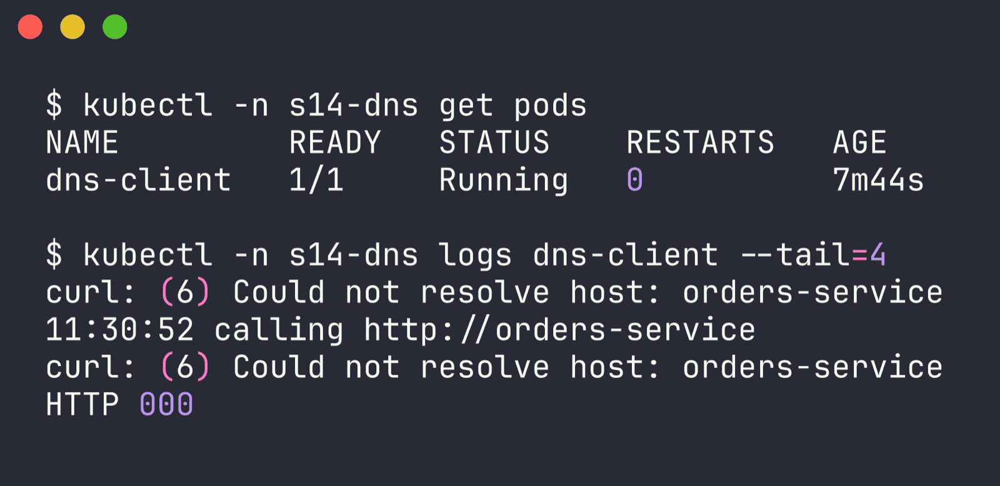
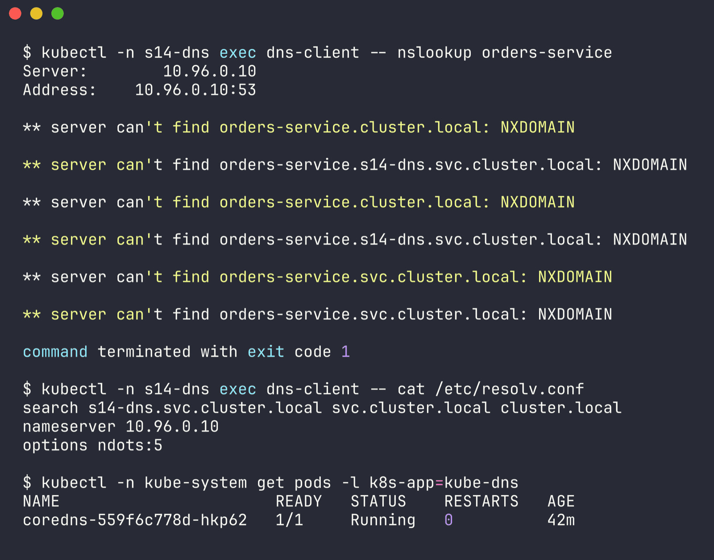
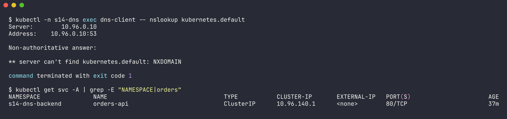
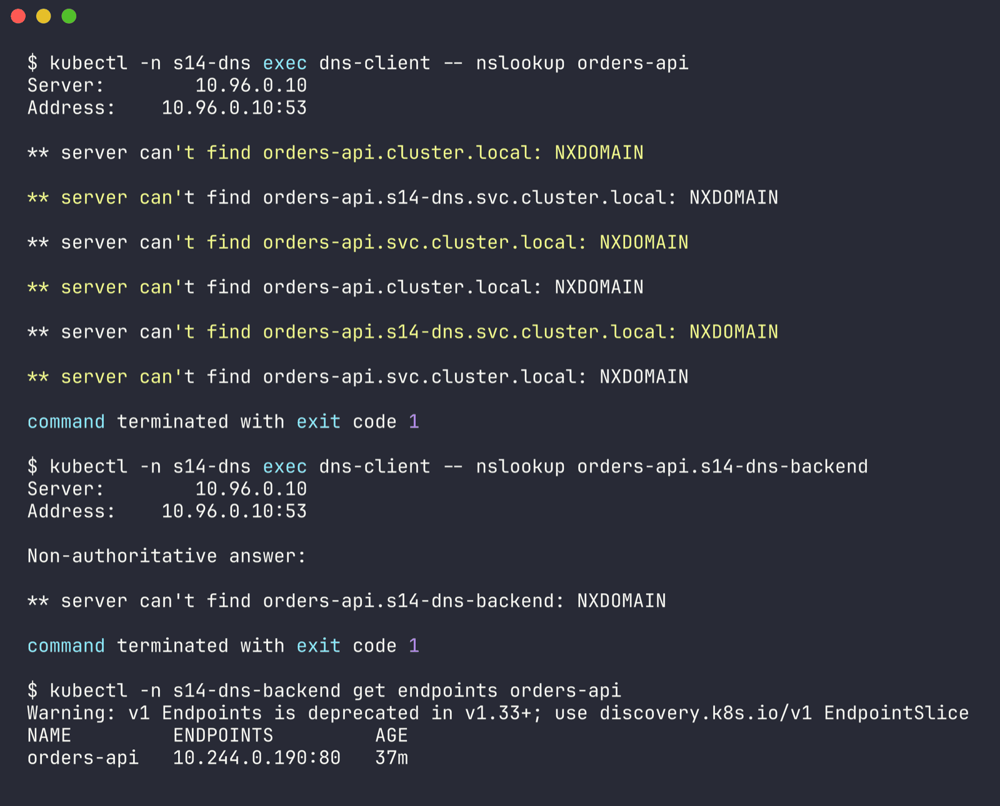
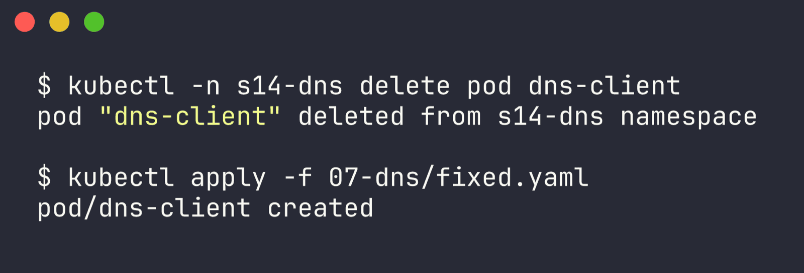
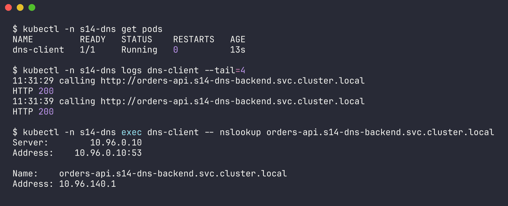
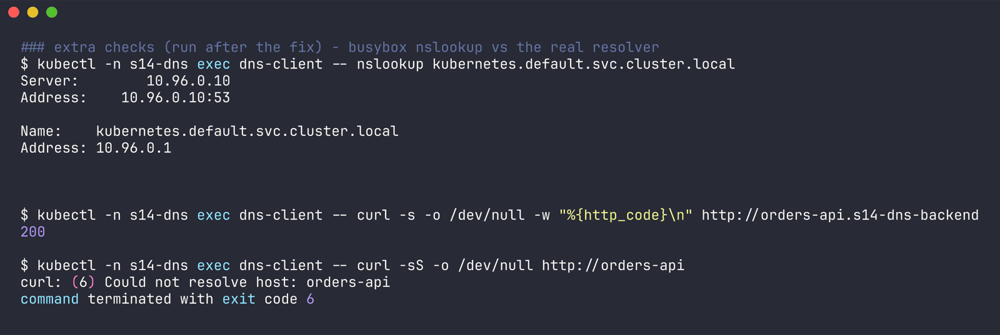

# Issue 7 - DNS (wrong service name + cross-namespace short name)

Namespaces: `s14-dns` (client) and `s14-dns-backend` (backend) | files: `backend.yaml`, `broken.yaml`, `fixed.yaml` | raw output: [`../outputs/07-dns.txt`](../outputs/07-dns.txt)

The backend Service `orders-api` lives in `s14-dns-backend`. The client pod in `s14-dns` calls `http://orders-service` every 10s.

```bash
kubectl create ns s14-dns; kubectl create ns s14-dns-backend
kubectl apply -f backend.yaml -f broken.yaml
```

## 1. Identify

The pod itself is Running (the script swallows the error with `|| true`), so `get pods` looks healthy. The symptom is only in the logs:

```bash
$ kubectl -n s14-dns get pods
NAME         READY   STATUS    RESTARTS   AGE
dns-client   1/1     Running   0          7m44s

$ kubectl -n s14-dns logs dns-client --tail=4
curl: (6) Could not resolve host: orders-service
11:30:52 calling http://orders-service
curl: (6) Could not resolve host: orders-service
HTTP 000
```



## 2. Investigate

First: is it this name, or is DNS broken for everything?

```bash
$ kubectl -n s14-dns exec dns-client -- nslookup orders-service
Server:		10.96.0.10
Address:	10.96.0.10:53

** server can't find orders-service.s14-dns.svc.cluster.local: NXDOMAIN
** server can't find orders-service.svc.cluster.local: NXDOMAIN
** server can't find orders-service.cluster.local: NXDOMAIN
...

$ kubectl -n s14-dns exec dns-client -- cat /etc/resolv.conf
search s14-dns.svc.cluster.local svc.cluster.local cluster.local
nameserver 10.96.0.10
options ndots:5

$ kubectl -n kube-system get pods -l k8s-app=kube-dns
NAME                       READY   STATUS    RESTARTS   AGE
coredns-559f6c778d-hkp62   1/1     Running   0          42m
```



CoreDNS is up and answering (NXDOMAIN is an *answer*; a dead DNS would time out). The resolver tried the name with each search domain - all in the client's own namespace. Find where the service really is:

```bash
$ kubectl get svc -A | grep -E "NAMESPACE|orders"
NAMESPACE               NAME          TYPE        CLUSTER-IP    EXTERNAL-IP   PORT(S)   AGE
s14-dns-backend         orders-api    ClusterIP   10.96.140.1   <none>        80/TCP    37m

$ kubectl -n s14-dns exec dns-client -- nslookup orders-api
** server can't find orders-api.s14-dns.svc.cluster.local: NXDOMAIN
...

$ kubectl -n s14-dns-backend get endpoints orders-api
NAME         ENDPOINTS         AGE
orders-api   10.244.0.190:80   37m
```





So even the *correct* name fails as a short name, because `orders-api` gets expanded to `orders-api.s14-dns.svc.cluster.local` - wrong namespace. The service itself is healthy (it has an endpoint).

## 3. Root cause

Two mistakes in the client's URL:
1. Wrong service name: `orders-service` instead of `orders-api`.
2. Short names only resolve inside the caller's own namespace. The backend is in `s14-dns-backend`, so it needs `orders-api.s14-dns-backend` (or the full `orders-api.s14-dns-backend.svc.cluster.local`).

## 4. Fix

```yaml
      env:
        - name: ORDERS_URL
          value: "http://orders-api.s14-dns-backend.svc.cluster.local"
```

```bash
kubectl -n s14-dns delete pod dns-client
kubectl apply -f fixed.yaml
```



## 5. Verify

```bash
$ kubectl -n s14-dns logs dns-client --tail=4
11:31:29 calling http://orders-api.s14-dns-backend.svc.cluster.local
HTTP 200
11:31:39 calling http://orders-api.s14-dns-backend.svc.cluster.local
HTTP 200

$ kubectl -n s14-dns exec dns-client -- nslookup orders-api.s14-dns-backend.svc.cluster.local
Name:	orders-api.s14-dns-backend.svc.cluster.local
Address: 10.96.140.1
```





## 6. Notes

- A gotcha I hit: the client image's `nslookup` is busybox, and it does **not** apply search domains to names that contain a dot. So `nslookup kubernetes.default` and `nslookup orders-api.s14-dns-backend` both returned NXDOMAIN, while curl (which uses the real libc resolver) worked fine with the same name:

  ```bash
  $ kubectl -n s14-dns exec dns-client -- nslookup kubernetes.default
  ** server can't find kubernetes.default: NXDOMAIN
  $ kubectl -n s14-dns exec dns-client -- nslookup kubernetes.default.svc.cluster.local
  Name:	kubernetes.default.svc.cluster.local
  Address: 10.96.0.1
  $ kubectl -n s14-dns exec dns-client -- curl -s -o /dev/null -w "%{http_code}\n" http://orders-api.s14-dns-backend
  200
  ```
  Lesson: test with the FQDN when using busybox nslookup, or use a proper dnsutils image, so you don't chase a fake DNS problem.
- DNS name format: `<service>.<namespace>.svc.cluster.local`. Pods get `<pod-ip-with-dashes>.<namespace>.pod.cluster.local`.
- If DNS is broken for *everything* (`kubernetes.default.svc.cluster.local` fails too), look at CoreDNS pods/logs (`kubectl -n kube-system logs -l k8s-app=kube-dns`) and the `kube-dns` Service endpoints.
- The `|| true` in the app script hid the failure from Kubernetes completely - the pod looked healthy. A readiness probe that checks the dependency (or not swallowing errors) would have surfaced it.
