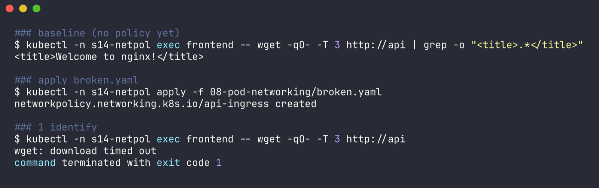
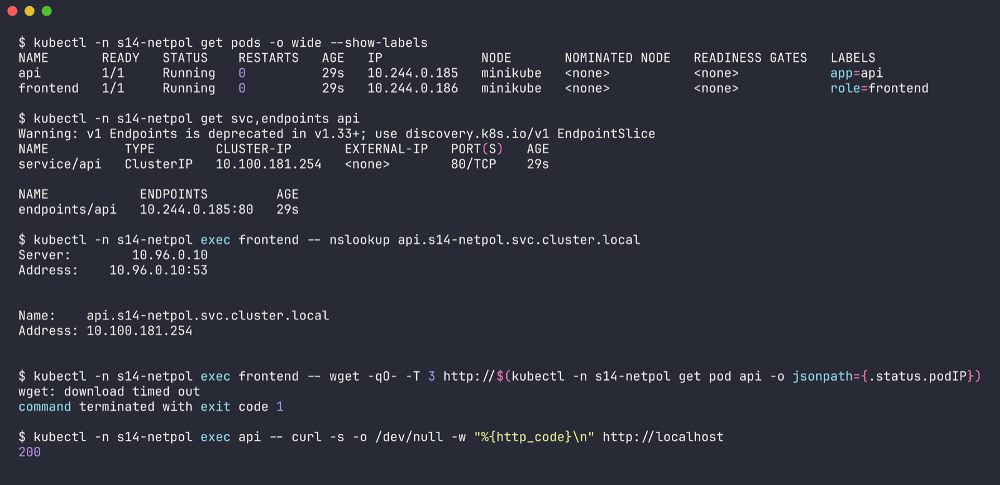
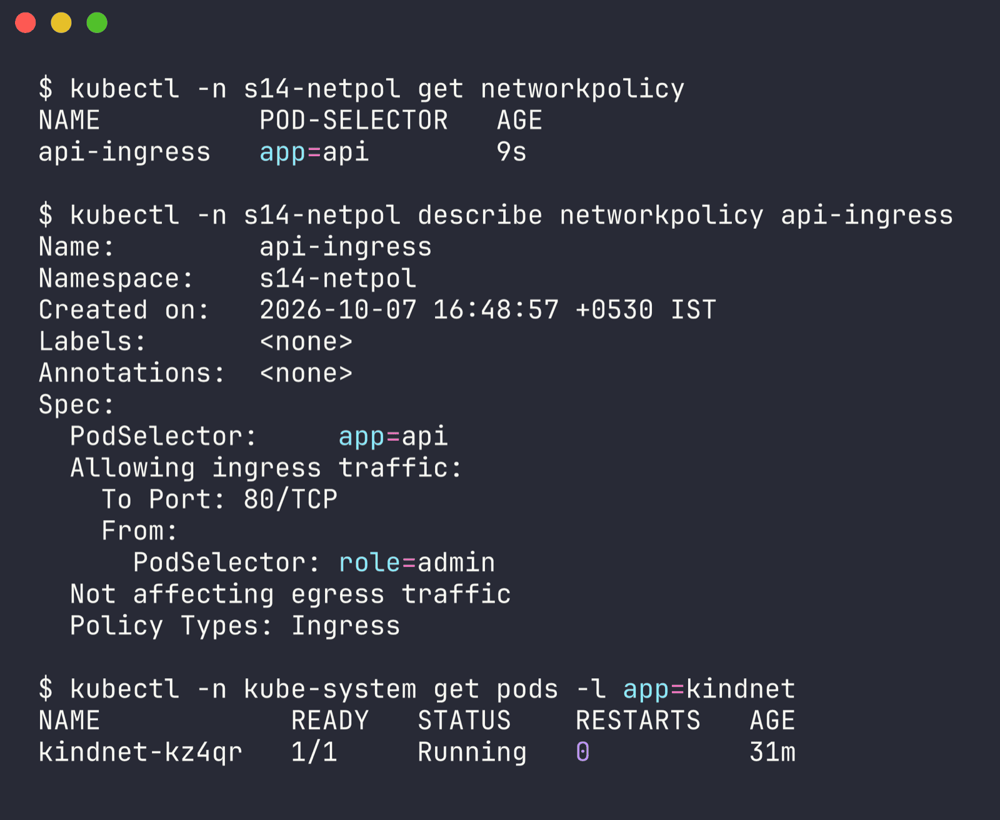
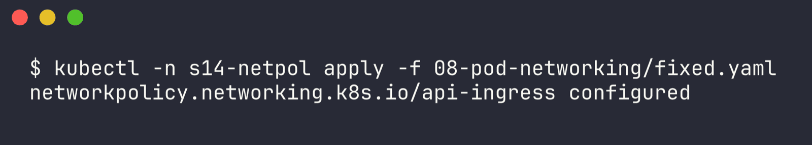
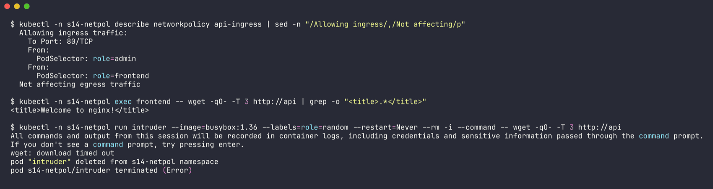

# Issue 8 - Pod networking (NetworkPolicy blocking traffic)

Namespace: `s14-netpol` | files: `app.yaml` (api pod + Service + frontend pod), `broken.yaml`, `fixed.yaml` (both are NetworkPolicies) | raw output: [`../outputs/08-pod-networking.txt`](../outputs/08-pod-networking.txt)

**Does minikube even enforce NetworkPolicy?** I checked before building this. This cluster's CNI is kindnet (`kubectl -n kube-system get pods -l app=kindnet`), and older kindnet versions ignore NetworkPolicy completely. So I ran a quick test first: curl worked, applied a policy, curl timed out. So the kindnet in this minikube version **does** enforce it, and the scenario below is real. (If your minikube doesn't enforce it, the policy is silently ignored and you'd need `minikube start --cni=calico` - worth checking before trusting a policy.)

## 1. Identify

Baseline before the policy, then after someone applied `broken.yaml`:

```bash
$ kubectl -n s14-netpol exec frontend -- wget -qO- -T 3 http://api | grep -o "<title>.*</title>"
<title>Welcome to nginx!</title>

$ kubectl -n s14-netpol apply -f broken.yaml
networkpolicy.networking.k8s.io/api-ingress created

$ kubectl -n s14-netpol exec frontend -- wget -qO- -T 3 http://api
wget: download timed out
command terminated with exit code 1
```



A **timeout** (not "connection refused") is the classic sign that packets are being dropped somewhere, rather than reaching a closed port.

## 2. Investigate

Go layer by layer - pods, service, DNS, direct pod IP, the app itself:

```bash
$ kubectl -n s14-netpol get pods -o wide --show-labels
NAME       READY   STATUS    RESTARTS   AGE   IP             NODE       ...   LABELS
api        1/1     Running   0          29s   10.244.0.185   minikube   ...   app=api
frontend   1/1     Running   0          29s   10.244.0.186   minikube   ...   role=frontend

$ kubectl -n s14-netpol get svc,endpoints api
service/api   ClusterIP   10.100.181.254   <none>   80/TCP   29s
endpoints/api   10.244.0.185:80   29s

$ kubectl -n s14-netpol exec frontend -- nslookup api.s14-netpol.svc.cluster.local
Name:	api.s14-netpol.svc.cluster.local
Address: 10.100.181.254

$ kubectl -n s14-netpol exec frontend -- wget -qO- -T 3 http://10.244.0.185     # straight to the pod IP
wget: download timed out

$ kubectl -n s14-netpol exec api -- curl -s -o /dev/null -w "%{http_code}\n" http://localhost
200
```



So: DNS fine, Service has an endpoint, the app answers locally, but even the raw pod IP times out from another pod. That rules out Service/DNS and points at the network path. Check policies:

```bash
$ kubectl -n s14-netpol get networkpolicy
NAME          POD-SELECTOR   AGE
api-ingress   app=api        9s

$ kubectl -n s14-netpol describe networkpolicy api-ingress
Spec:
  PodSelector:     app=api
  Allowing ingress traffic:
    To Port: 80/TCP
    From:
      PodSelector: role=admin
  Not affecting egress traffic
  Policy Types: Ingress
```



## 3. Root cause

The `api-ingress` NetworkPolicy selects the api pod and only allows ingress from pods labelled `role=admin`. Once *any* ingress policy selects a pod, everything not explicitly allowed is denied. The frontend is `role=frontend`, so its packets are dropped.

## 4. Fix

Add the frontend to the allow list (`fixed.yaml`) instead of deleting the policy - the lock-down was intentional, it just forgot a legit client:

```yaml
  ingress:
    - from:
        - podSelector:
            matchLabels:
              role: admin
        - podSelector:
            matchLabels:
              role: frontend
```

```bash
kubectl -n s14-netpol apply -f fixed.yaml
```



## 5. Verify

```bash
$ kubectl -n s14-netpol describe networkpolicy api-ingress | sed -n "/Allowing ingress/,/Not affecting/p"
  Allowing ingress traffic:
    To Port: 80/TCP
    From:
      PodSelector: role=admin
    From:
      PodSelector: role=frontend
  Not affecting egress traffic

$ kubectl -n s14-netpol exec frontend -- wget -qO- -T 3 http://api | grep -o "<title>.*</title>"
<title>Welcome to nginx!</title>

# and a random pod is still blocked, so the policy still does its job
$ kubectl -n s14-netpol run intruder --image=busybox:1.36 --labels=role=random --restart=Never --rm -i --command -- wget -qO- -T 3 http://api
wget: download timed out
pod "intruder" deleted from s14-netpol namespace
```



## 6. Notes

- Two separate `- podSelector` entries = OR. Putting both labels in one `matchLabels` would mean AND (pod must have both labels) - a very easy mistake.
- If the client is in another namespace you need a `namespaceSelector` too; a plain `podSelector` only matches pods in the policy's own namespace.
- An egress policy on the *client* side can cause the same symptom; also check policies in the client's namespace. A default-deny egress also blocks DNS (UDP 53 to kube-system) - then you'd see name resolution failures instead.
- Timeout vs refused: timeout = dropped (policy, firewall, no route); refused = reached the pod but nothing listens on that port (like issue 6's wrong targetPort).
