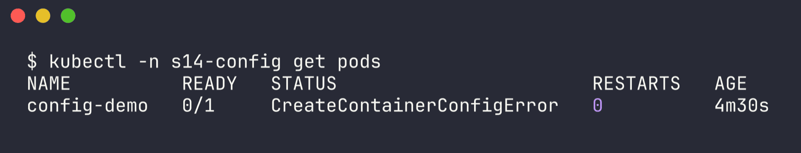
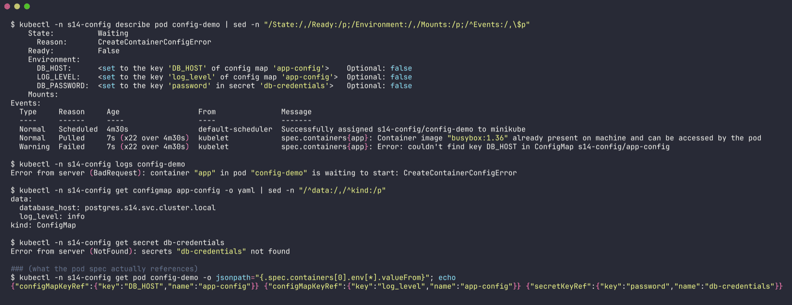
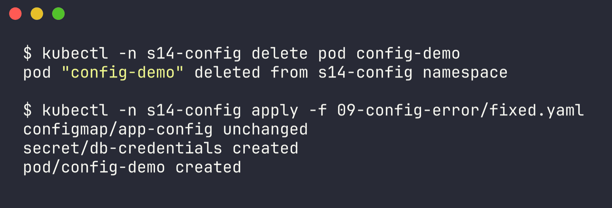
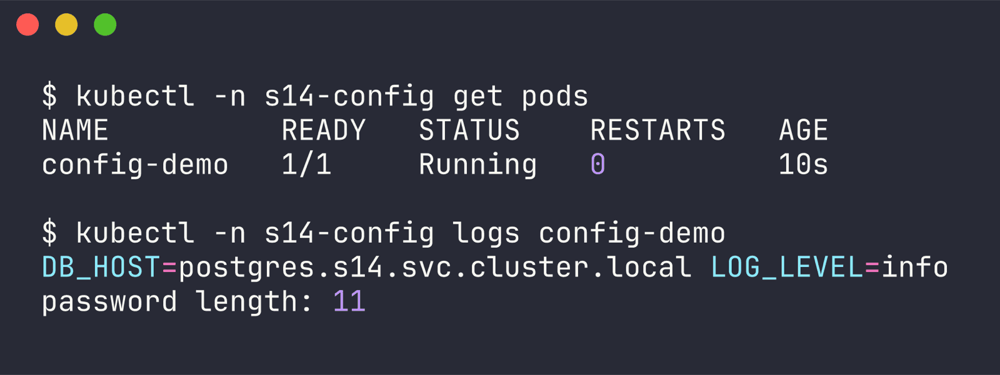

# Issue 9 - Configuration error (CreateContainerConfigError)

Namespace: `s14-config` | files: `broken.yaml`, `fixed.yaml` | raw output: [`../outputs/09-config-error.txt`](../outputs/09-config-error.txt)

The pod reads `DB_HOST` and `LOG_LEVEL` from ConfigMap `app-config` and `DB_PASSWORD` from Secret `db-credentials`.

## 1. Identify

```bash
$ kubectl -n s14-config get pods
NAME          READY   STATUS                       RESTARTS   AGE
config-demo   0/1     CreateContainerConfigError   0          4m30s
```



Restarts stay at 0 - the container never got created, so this isn't a crash.

## 2. Investigate

```bash
$ kubectl -n s14-config describe pod config-demo
    State:          Waiting
      Reason:       CreateContainerConfigError
    Environment:
      DB_HOST:      <set to the key 'DB_HOST' of config map 'app-config'>    Optional: false
      LOG_LEVEL:    <set to the key 'log_level' of config map 'app-config'>  Optional: false
      DB_PASSWORD:  <set to the key 'password' in secret 'db-credentials'>   Optional: false
Events:
  Normal   Scheduled  4m30s                default-scheduler  Successfully assigned s14-config/config-demo to minikube
  Normal   Pulled     7s (x22 over 4m30s)  kubelet            Container image "busybox:1.36" already present on machine ...
  Warning  Failed     7s (x22 over 4m30s)  kubelet            Error: couldn't find key DB_HOST in ConfigMap s14-config/app-config

$ kubectl -n s14-config logs config-demo
Error from server (BadRequest): container "app" in pod "config-demo" is waiting to start: CreateContainerConfigError

$ kubectl -n s14-config get configmap app-config -o yaml
data:
  database_host: postgres.s14.svc.cluster.local
  log_level: info

$ kubectl -n s14-config get secret db-credentials
Error from server (NotFound): secrets "db-credentials" not found
```



The event only names the *first* problem it hits (the `DB_HOST` key). Checking every reference in the `Environment` block by hand turned up a second one: the Secret doesn't exist at all.

## 3. Root cause

1. Key name mismatch: the pod asks for key `DB_HOST`, the ConfigMap has `database_host`. Keys are case-sensitive and exact.
2. Missing Secret: `db-credentials` was never created.

Both references are non-optional, so kubelet can't build the container's environment and won't create it.

## 4. Fix

`fixed.yaml`: reference the real key and create the Secret.

```yaml
        - name: DB_HOST
          valueFrom:
            configMapKeyRef:
              name: app-config
              key: database_host
---
apiVersion: v1
kind: Secret
metadata:
  name: db-credentials
stringData:
  password: "s3cr3t-demo"
```

```bash
$ kubectl -n s14-config delete pod config-demo
$ kubectl -n s14-config apply -f fixed.yaml
configmap/app-config unchanged
secret/db-credentials created
pod/config-demo created
```



## 5. Verify

```bash
$ kubectl -n s14-config get pods
NAME          READY   STATUS    RESTARTS   AGE
config-demo   1/1     Running   0          10s

$ kubectl -n s14-config logs config-demo
DB_HOST=postgres.s14.svc.cluster.local LOG_LEVEL=info
password length: 11
```



(I print the password length instead of the password, didn't want a secret in the logs even for a demo.)

## 6. Notes

- CreateContainerConfigError = bad env/config *reference* (missing ConfigMap, missing Secret, missing key). The volume version of the same mistake gives ContainerCreating + `FailedMount` instead (issue 5).
- If only the Secret had been missing, kubelet would actually keep retrying and start the pod on its own once the Secret appears. For the key name, the pod spec itself is wrong, so it needs delete + re-apply (or a rollout for a Deployment).
- `optional: true` on a `configMapKeyRef`/`secretKeyRef` lets the pod start without that value - only use it if the app really has a default.
- `envFrom: configMapRef` imports all keys at once, but keys that aren't valid env var names (like `database-host` with a dash) get skipped silently - another config trap.
