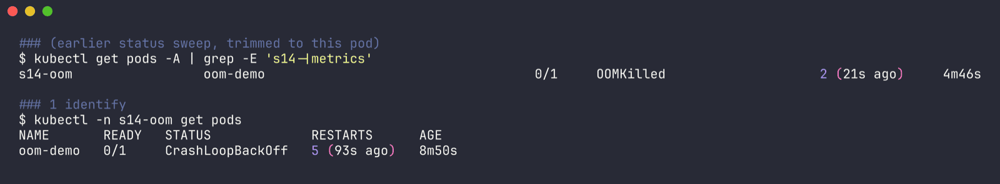
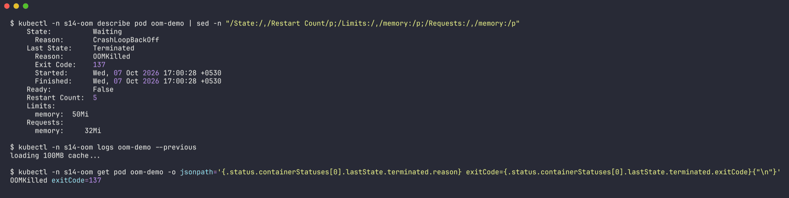
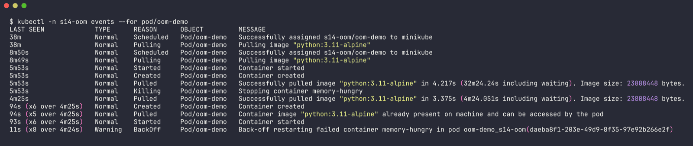
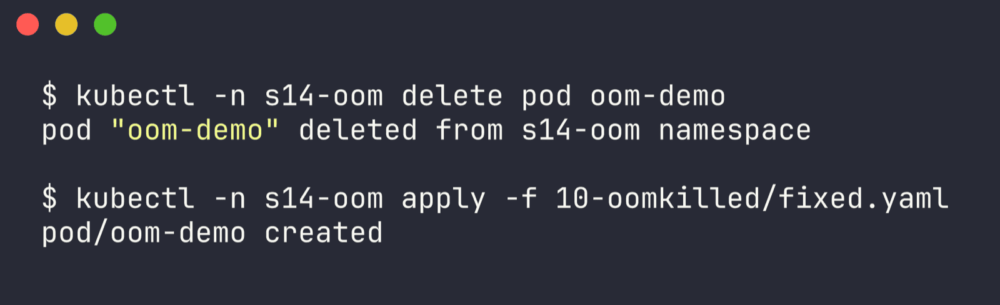
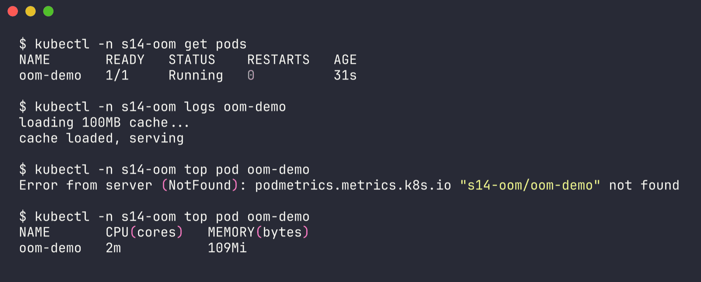

# Issue 10 (bonus) - OOMKilled

Namespace: `s14-oom` | files: `broken.yaml`, `fixed.yaml` | raw output: [`../outputs/10-oomkilled.txt`](../outputs/10-oomkilled.txt)

Not in the required list but it's scenario 5 in the class gauntlet and it's the CrashLoopBackOff that fools people, so I did it separately. Python app loads a ~100MB cache, memory limit is 50Mi.

## 1. Identify

```bash
$ kubectl -n s14-oom get pods
NAME       READY   STATUS             RESTARTS      AGE
oom-demo   0/1     CrashLoopBackOff   5 (93s ago)   8m50s
```



Looks exactly like issue 1. (In an earlier sweep it briefly showed `OOMKilled` in the STATUS column right after a kill - `s14-oom  oom-demo  0/1  OOMKilled  2 (21s ago)` - but most of the time you just see CrashLoopBackOff.)

## 2. Investigate

```bash
$ kubectl -n s14-oom describe pod oom-demo
    State:          Waiting
      Reason:       CrashLoopBackOff
    Last State:     Terminated
      Reason:       OOMKilled
      Exit Code:    137
    Restart Count:  5
    Limits:
      memory:  50Mi
    Requests:
      memory:     32Mi

$ kubectl -n s14-oom logs oom-demo --previous
loading 100MB cache...

$ kubectl -n s14-oom get pod oom-demo -o jsonpath='{.status.containerStatuses[0].lastState.terminated.reason} exitCode={...exitCode}'
OOMKilled exitCode=137
```





`Last State: OOMKilled`, exit 137 (128 + 9 = SIGKILL). The log stops right after "loading 100MB cache..." - it never printed "cache loaded", there's no stack trace because the kernel kills the process, Python never gets to say anything. Events don't help much here - they just show `BackOff`.

## 3. Root cause

The container's working set (~100MB of data + the Python runtime) is bigger than its 50Mi memory limit. When the cgroup hits the limit the kernel OOM killer kills the process, kubelet restarts it, it OOMs again -> CrashLoopBackOff.

## 4. Fix

The real data needs ~100MB, so the limit has to fit it (`fixed.yaml`):

```yaml
      resources:
        requests:
          memory: 128Mi
        limits:
          memory: 192Mi
```

```bash
kubectl -n s14-oom delete pod oom-demo
kubectl -n s14-oom apply -f fixed.yaml
```



(If the usage were a leak, raising the limit only delays the crash - then the fix is in the code. The gauntlet version of this scenario in `../scenarios/scenario-5-oomkilled` is like that, and there I fixed the code to process one chunk at a time.)

## 5. Verify

```bash
$ kubectl -n s14-oom get pods
NAME       READY   STATUS    RESTARTS   AGE
oom-demo   1/1     Running   0          31s

$ kubectl -n s14-oom logs oom-demo
loading 100MB cache...
cache loaded, serving

$ kubectl -n s14-oom top pod oom-demo
NAME       CPU(cores)   MEMORY(bytes)
oom-demo   2m           109Mi
```



`kubectl top` shows 109Mi actually used - more than double the old 50Mi limit, which confirms the diagnosis, and comfortably under the new 192Mi.

## 6. Notes

- Memory is not compressible: going over the CPU limit just throttles, going over the memory limit kills.
- Size limits from real usage (`kubectl top pod`, metrics over time) plus headroom, not guesses.
- Node-level memory pressure is different: then pods get *evicted* (`Status: Failed, Reason: Evicted`) instead of OOMKilled.
