# Session 14 - Kubernetes Troubleshooting

Name: Ridaa Mirza
Enrollment No: 24BCS10394

Everything here was run on a local minikube (v1.37.0, docker driver, containerd runtime, kindnet CNI) that was shared with other work, so every exercise lives in its own namespace: `s14` for Task 1 and `s14-*` for each issue. Raw command output for every step is saved in [`outputs/`](outputs/) - the snippets below are trimmed copies of those files (those are my stand-in for screenshots).

```
13-k8s-troubleshooting/
├── README.md                    <- this file (Task 1 + index)
├── task1-commands/              <- pods used for the kubectl tour
├── 01-crashloopbackoff/         <- Task 2, one folder per issue:
├── 02-imagepullbackoff/            broken.yaml + fixed.yaml + README.md
├── 03-errimagepull/
├── 04-pending/
├── 05-containercreating/
├── 06-service-connectivity/
├── 07-dns/
├── 08-pod-networking/
├── 09-config-error/
├── 10-oomkilled/                <- bonus
├── scenarios/                   <- class triage gauntlet (5 scenarios + triage_all.sh)
├── mini-project/                <- Task 3
└── outputs/                     <- raw output of every command
```

My order of operations for anything broken, which all the issue READMEs follow:

```
get  ->  describe (State / Last State / Events)  ->  logs (--previous)  ->  exec (if running)  ->  test the network path  ->  root cause  ->  fix  ->  verify
```

---

## Task 1 - kubectl troubleshooting commands

Three pods in `task1-commands/`, applied into `s14`:
- `get-demo.yaml` - plain nginx with requests/limits
- `multi-container.yaml` - `logs-demo` with two containers (`app` and `sidecar`), for `-c`
- `restart-demo.yaml` - runs 10s then exits 1, so it keeps restarting and `--previous` has something to show

```bash
kubectl create ns s14
kubectl -n s14 apply -f task1-commands/
```

### kubectl get

> When I use it: always first - what exists, is it Running/Ready, how many restarts.

```bash
$ kubectl -n s14 get pods
NAME           READY   STATUS             RESTARTS      AGE
get-demo       1/1     Running            0             22m
logs-demo      2/2     Running            0             22m
restart-demo   0/1     CrashLoopBackOff   6 (89s ago)   22m

$ kubectl -n s14 get pods --show-labels
NAME           READY   STATUS             RESTARTS      AGE   LABELS
get-demo       1/1     Running            0             22m   app=get-demo
logs-demo      2/2     Running            0             22m   app=logs-demo
restart-demo   0/1     CrashLoopBackOff   6 (90s ago)   22m   app=restart-demo

$ kubectl -n s14 get pods -o custom-columns='NAME:.metadata.name,STATUS:.status.phase,RESTARTS:.status.containerStatuses[*].restartCount'
NAME           STATUS    RESTARTS
get-demo       Running   0
logs-demo      Running   0,0
restart-demo   Running   6

$ kubectl -n s14 get pod restart-demo -o yaml | sed -n '/containerStatuses:/,/started:/p'
  containerStatuses:
  - containerID: containerd://4dd63c28ad24...
    image: docker.io/library/busybox:1.36
    ...
    lastState:
      terminated:
        exitCode: 1
        finishedAt: "2026-10-07T11:12:16Z"
        reason: Error
        startedAt: "2026-10-07T11:12:06Z"
    name: app
    ready: false
    resources: {}
    restartCount: 6
```

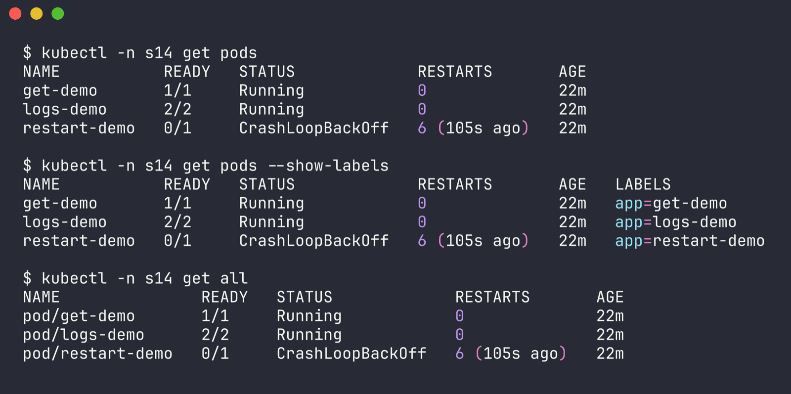

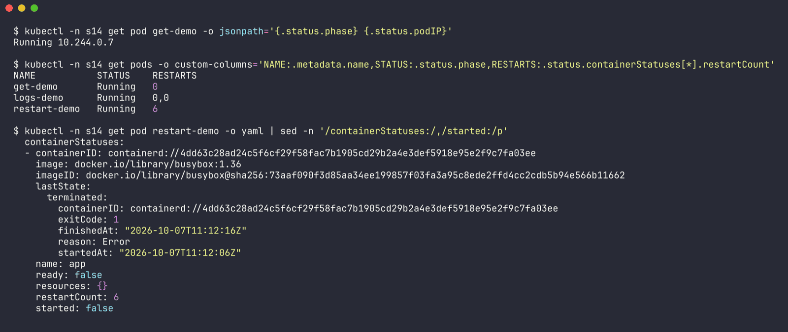

Notice `STATUS` in the default view says `CrashLoopBackOff` while `.status.phase` says `Running` - the STATUS column is kubectl's summary of the container states, the phase is the pod-level field. `-o yaml` / `-o jsonpath` / `custom-columns` let me pull exactly the field I care about.

### kubectl get -o wide

> When I use it: when I need the pod IP or which node it's on (networking, Pending, node-specific problems).

```bash
$ kubectl -n s14 get pods -o wide
NAME           READY   STATUS             RESTARTS      AGE   IP           NODE       NOMINATED NODE   READINESS GATES
get-demo       1/1     Running            0             22m   10.244.0.7   minikube   <none>           <none>
logs-demo      2/2     Running            0             22m   10.244.0.8   minikube   <none>           <none>
restart-demo   0/1     CrashLoopBackOff   6 (89s ago)   22m   10.244.0.9   minikube   <none>           <none>

$ kubectl get nodes -o wide
NAME       STATUS   ROLES           AGE   VERSION   INTERNAL-IP    EXTERNAL-IP   OS-IMAGE                         KERNEL-VERSION            CONTAINER-RUNTIME
minikube   Ready    control-plane   25m   v1.37.0   192.168.49.2   <none>        Debian GNU/Linux 12 (bookworm)   7.0.12-linuxkit (arm64)   containerd://2.3.4
```

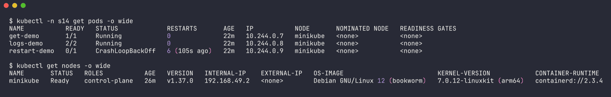

### kubectl describe

> When I use it: second, every time - container State/Last State/exit code, env, volumes, and the Events at the bottom explain *why*.

```bash
$ kubectl -n s14 describe pod restart-demo
...
    State:          Running
      Started:      Wed, 07 Oct 2026 16:47:19 +0530
    Last State:     Terminated
      Reason:       Error
      Exit Code:    1
      Started:      Wed, 07 Oct 2026 16:42:06 +0530
      Finished:     Wed, 07 Oct 2026 16:42:16 +0530
    Ready:          True
    Restart Count:  7
...
Events:
  Type     Reason     Age                 From               Message
  ----     ------     ----                ----               -------
  Normal   Scheduled  25m                 default-scheduler  Successfully assigned s14/restart-demo to minikube
  Normal   Pulling    25m                 kubelet            spec.containers{app}: Pulling image "busybox:1.36"
  Normal   Pulled     12m                 kubelet            spec.containers{app}: Successfully pulled image "busybox:1.36" in 3.802s (13m54.26s including waiting). Image size: 1906887 bytes.
  Warning  BackOff    26s (x13 over 11m)  kubelet            spec.containers{app}: Back-off restarting failed container app in pod restart-demo_s14(...)
  Normal   Started    10s (x8 over 12m)   kubelet            spec.containers{app}: Container started

$ kubectl describe node minikube | grep -A12 "^Allocated resources:"     # trimmed
Allocated resources:
  (Total limits may be over 100 percent, i.e., overcommitted.)
  Resource           Requests      Limits
  --------           --------      ------
  cpu                2440m (16%)   5300m (35%)
  memory             2334Mi (29%)  4430Mi (55%)
```

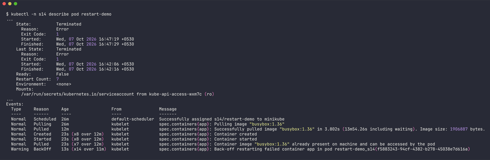

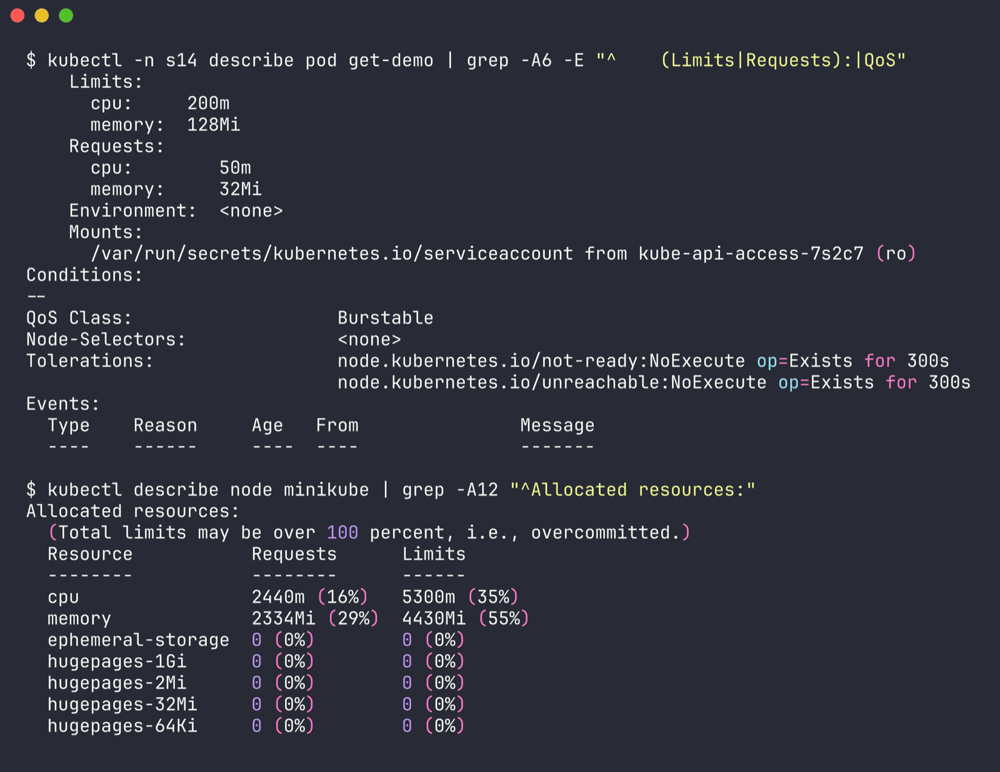

Started 16:42:06, finished 16:42:16 = the 10 seconds the script sleeps, exit 1. The event also caught something real about the shared cluster: "3.8s (13m54s including waiting)" - the pull itself was quick but it sat in kubelet's (serial) image pull queue behind everyone else's pulls for ~14 minutes.

### kubectl logs (plain, -c, --previous, -f)

> When I use it: whenever the container has run at least once - the app's own error messages live here.

```bash
# multi-container pod: kubectl picks the first container and tells you
$ kubectl -n s14 logs logs-demo | head -6
Defaulted container "app" out of: app, sidecar
Application started
Connecting to database...
Database connection successful
11:05:22 Application is healthy

# -c picks the container
$ kubectl -n s14 logs logs-demo -c sidecar --tail=3
11:13:46 [sidecar] shipping logs...
11:13:53 [sidecar] shipping logs...
11:14:00 [sidecar] shipping logs...

$ kubectl -n s14 logs logs-demo --all-containers --prefix --tail=2
[pod/logs-demo/app] 11:13:52 Application is healthy
[pod/logs-demo/app] 11:13:57 Application is healthy
[pod/logs-demo/sidecar] 11:13:53 [sidecar] shipping logs...
[pod/logs-demo/sidecar] 11:14:00 [sidecar] shipping logs...
```

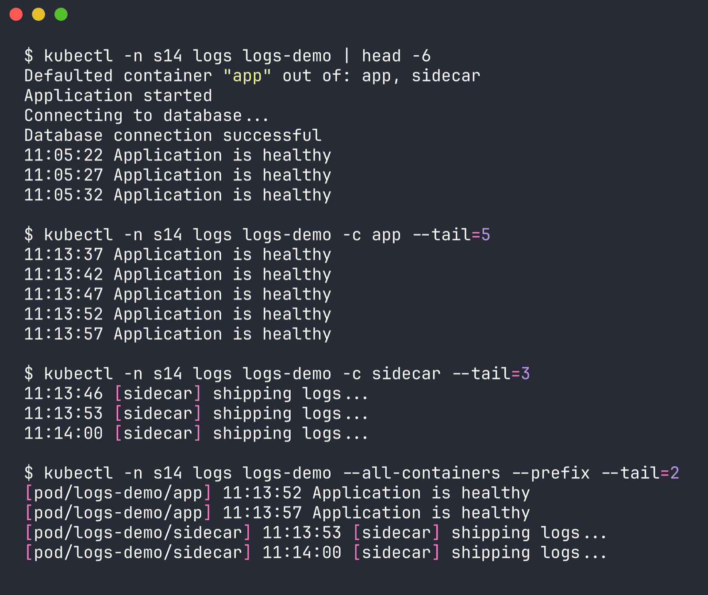

`--previous` vs current, captured while restart-demo's new container was running (raw: `outputs/task1-logs-previous.txt`):

```bash
$ kubectl -n s14 get pod restart-demo
NAME           READY   STATUS    RESTARTS       AGE
restart-demo   1/1     Running   7 (5m4s ago)   25m

$ kubectl -n s14 logs restart-demo               # current attempt, still sleeping
run started at 11:17:19

$ kubectl -n s14 logs restart-demo --previous    # the attempt that died
run started at 11:12:06
simulated failure, exiting with code 1
```

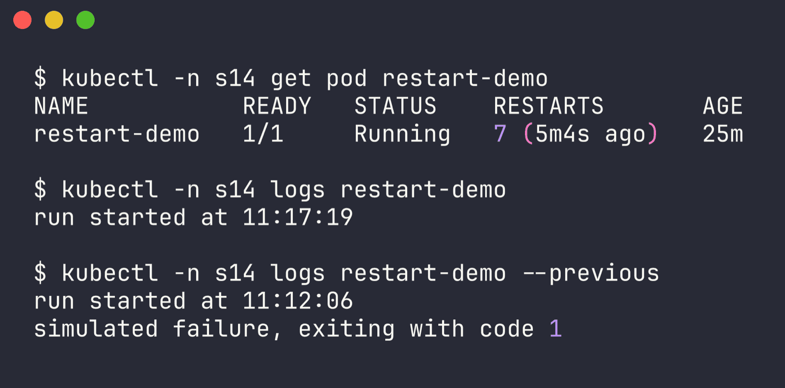

> When I use `--previous`: CrashLoopBackOff / OOMKilled - the interesting output belongs to the container that died, not the new one.

`-f` follows the stream. I let it run ~12s and stopped it with Ctrl+C (macOS doesn't ship `timeout`, and kubectl ignores SIGALRM so the `perl -e 'alarm ...'` trick didn't stop it either - I ran it in the background and sent SIGINT after 12s):

```bash
$ kubectl -n s14 logs -f logs-demo -c app --tail=1
11:16:17 Application is healthy
11:16:22 Application is healthy
11:16:27 Application is healthy
11:16:32 Application is healthy
^C

$ kubectl -n s14 logs logs-demo -c app --since=15s --timestamps
2026-10-07T11:16:22.737559962Z 11:16:22 Application is healthy
2026-10-07T11:16:27.738839506Z 11:16:27 Application is healthy
2026-10-07T11:16:32.740371884Z 11:16:32 Application is healthy
```

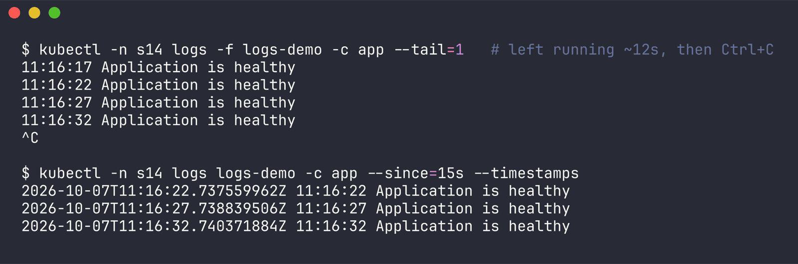

> When I use `-f`: while reproducing a problem live (send a request, watch the log line appear). `--since`/`--tail` keep it from dumping hours of history.

### kubectl exec

> When I use it: container is running but misbehaving - check config, env, DNS, and curl things from inside the cluster network.

```bash
$ kubectl -n s14 exec get-demo -- hostname
get-demo

$ kubectl -n s14 exec get-demo -- cat /etc/resolv.conf
search s14.svc.cluster.local svc.cluster.local cluster.local
nameserver 10.96.0.10
options ndots:5

$ kubectl -n s14 exec get-demo -- curl -s -o /dev/null -w "%{http_code}\n" http://localhost
200

$ kubectl -n s14 exec logs-demo -c sidecar -- ps
PID   USER     TIME  COMMAND
    1 root      0:00 sh -c while true; do   echo "$(date +%T) [sidecar] shipping logs..."   sleep 7 done
  118 root      0:00 ps

# "interactive" shell, fed through stdin so the output could be saved
$ printf "nginx -v\nls /etc/nginx/conf.d\nexit\n" | kubectl -n s14 exec -i get-demo -- bash
nginx version: nginx/1.27.5
default.conf

# the two exec errors I ran into
$ kubectl -n s14 exec logs-demo -c app -- bash
error: Internal error occurred: Internal error occurred: error executing command in container: failed to exec in container: failed to start exec "...": OCI runtime exec failed: exec failed: unable to start container process: exec: "bash": executable file not found in $PATH

$ kubectl -n s14-crash exec crash-demo -- env          # from issue 1, container crash-looping
error: unable to upgrade connection: container not found ("app")
```

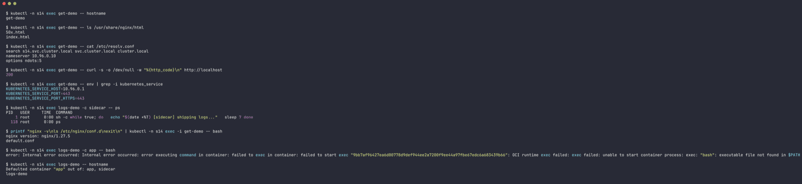

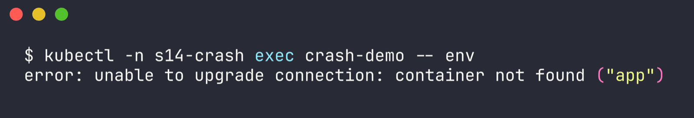

busybox has no `bash` (use `sh`), and you can't exec into a container that isn't running - for those, logs/describe or `kubectl debug` are the way.

### Events (`kubectl events` and `kubectl get events --sort-by`)

> When I use it: to see what the cluster did and in what order (scheduling, pulls, mounts, kills), across the whole namespace or for one object.

```bash
$ kubectl -n s14 events --for pod/restart-demo
LAST SEEN            TYPE      REASON      OBJECT             MESSAGE
26m                  Normal    Scheduled   Pod/restart-demo   Successfully assigned s14/restart-demo to minikube
26m                  Normal    Pulling     Pod/restart-demo   Pulling image "busybox:1.36"
12m                  Normal    Pulled      Pod/restart-demo   Successfully pulled image "busybox:1.36" in 3.802s (13m54.26s including waiting). Image size: 1906887 bytes.
34s (x8 over 12m)    Normal    Created     Pod/restart-demo   Container created
34s (x8 over 12m)    Normal    Started     Pod/restart-demo   Container started
24s (x14 over 12m)   Warning   BackOff     Pod/restart-demo   Back-off restarting failed container app in pod restart-demo_s14(...)

$ kubectl -n s14 events --types=Warning
LAST SEEN            TYPE      REASON    OBJECT             MESSAGE
24s (x14 over 12m)   Warning   BackOff   Pod/restart-demo   Back-off restarting failed container app in pod restart-demo_s14(...)

$ kubectl -n s14 get events --sort-by=.lastTimestamp
LAST SEEN   TYPE      REASON      OBJECT             MESSAGE
26m         Normal    Scheduled   pod/get-demo       Successfully assigned s14/get-demo to minikube
26m         Normal    Pulling     pod/get-demo       Pulling image "nginx:1.27"
...
14m         Normal    Pulled      pod/get-demo       Successfully pulled image "nginx:1.27" in 8m34.064s (11m45.798s including waiting). Image size: 68857691 bytes.
...
24s         Warning   BackOff     pod/restart-demo   Back-off restarting failed container app in pod restart-demo_s14(...)

$ kubectl -n s14 get events --field-selector type=Warning,involvedObject.name=restart-demo
LAST SEEN   TYPE      REASON    OBJECT             MESSAGE
24s         Warning   BackOff   pod/restart-demo   Back-off restarting failed container app in pod restart-demo_s14(...)
```

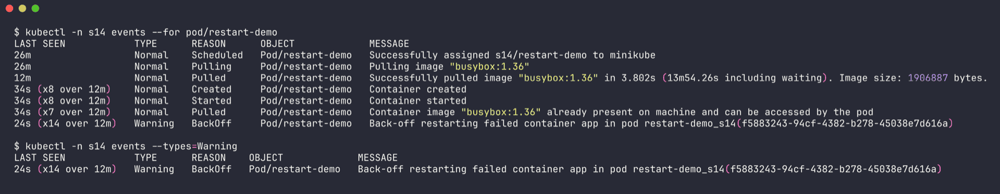

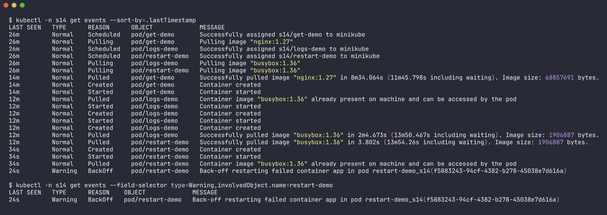

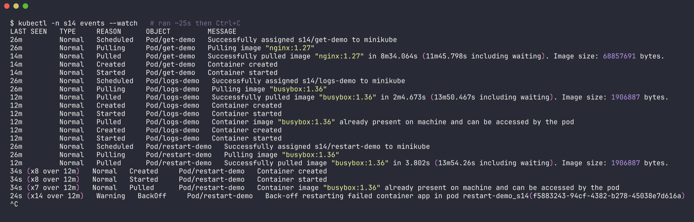

Plain `kubectl get events` is *not* sorted by time, which is why `--sort-by=.lastTimestamp` exists. `kubectl events` (newer command) sorts for you and has `--for` and `--types` built in, so it's what I default to. `kubectl events --watch` streams new events (sample in `outputs/task1-events.txt`). Events only stick around for about an hour by default, so old incidents need logs/monitoring instead.

### kubectl explain

> When I use it: when I'm not sure what a YAML field is called or what it does - the API docs offline, for the exact cluster version.

```bash
$ kubectl explain service.spec.ports.targetPort
KIND:       Service
VERSION:    v1

FIELD: targetPort <IntOrString>

DESCRIPTION:
    Number or name of the port to access on the pods targeted by the service.
    Number must be in the range 1 to 65535. Name must be an IANA_SVC_NAME. If
    this is a string, it will be looked up as a named port in the target Pod's
    container ports. If this is not specified, the value of the 'port' field is
    used (an identity map). ...

$ kubectl explain pod.spec.containers.resources
FIELDS:
  claims	<[]ResourceClaim>
  limits	<map[string]Quantity>
    Limits describes the maximum amount of compute resources allowed. ...
  requests	<map[string]Quantity>
    Requests describes the minimum amount of compute resources required. If
    Requests is omitted for a container, it defaults to Limits if that is
    explicitly specified, otherwise to an implementation-defined value. ...

$ kubectl explain deployment.spec --recursive | head -30
FIELDS:
  minReadySeconds	<integer>
  paused	<boolean>
  progressDeadlineSeconds	<integer>
  replicas	<integer>
  revisionHistoryLimit	<integer>
  selector	<LabelSelector> -required-
    matchExpressions	<[]LabelSelectorRequirement>
    ...
```

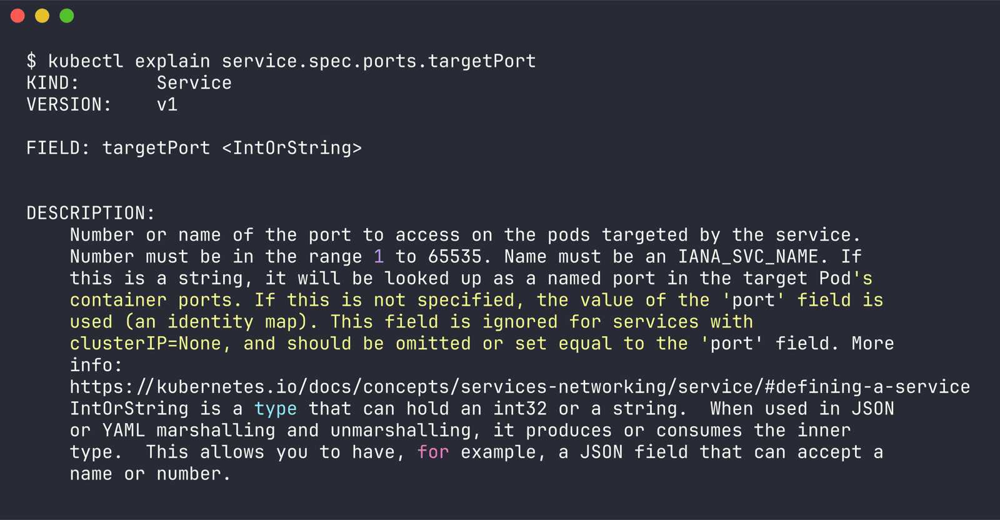

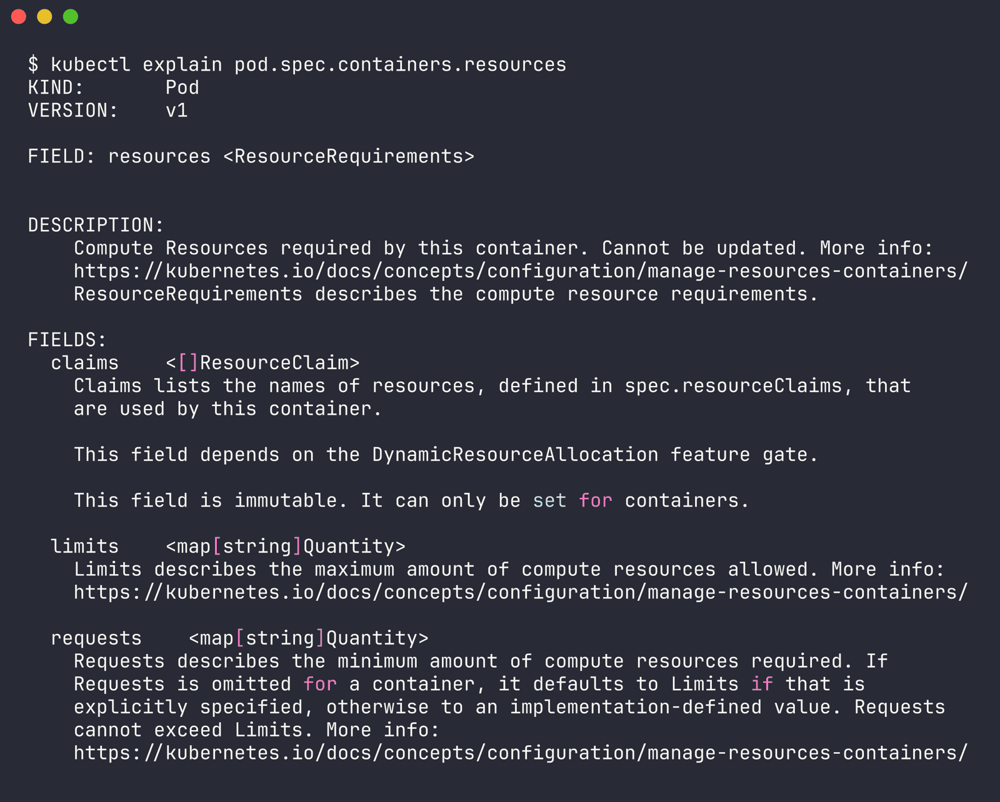

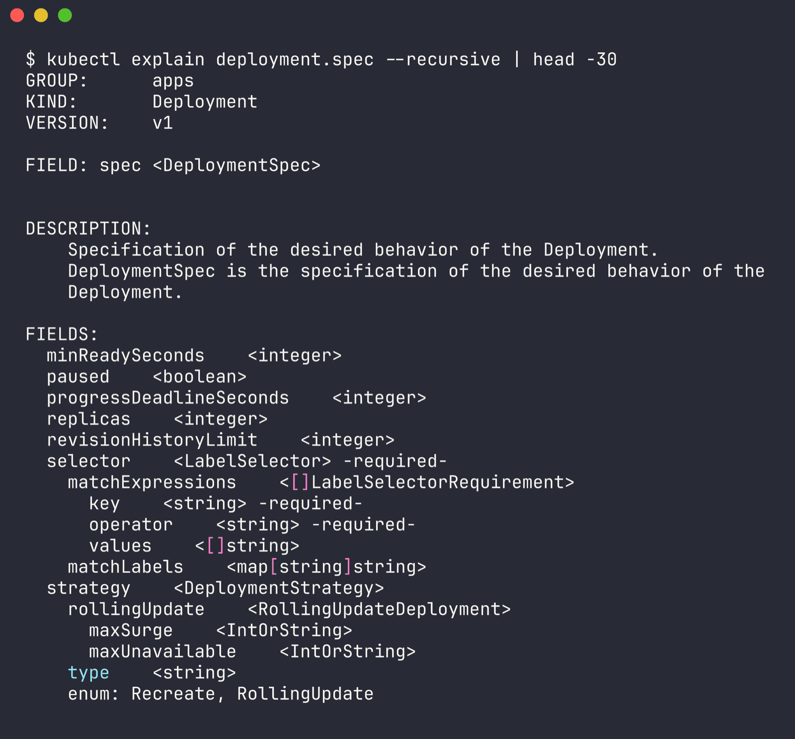

The `targetPort` one is literally the bug from issue 6 - "number or name of the port on the pods", not the Service's port.

### kubectl top

> When I use it: OOMKilled / throttling / Pending-because-of-resources questions - what pods actually use vs what they request.

Needs metrics-server. The addon was enabled but its image was still stuck in the pull queue for the first ~30 minutes (`error: Metrics API not available`); once it came up:

```bash
$ kubectl top nodes
NAME       CPU(cores)   CPU(%)   MEMORY(bytes)   MEMORY(%)
minikube   2653m        17%      2318Mi          29%

$ kubectl -n s14 top pods
NAME        CPU(cores)   MEMORY(bytes)
get-demo    0m           11Mi
logs-demo   1m           0Mi

$ kubectl -n s14 top pod logs-demo --containers
POD         NAME      CPU(cores)   MEMORY(bytes)
logs-demo   app       1m           0Mi
logs-demo   sidecar   1m           0Mi

$ kubectl top pods -A --sort-by=memory | grep -E "NAMESPACE|s14" | head -8
NAMESPACE               NAME                                       CPU(cores)   MEMORY(bytes)
s14-oom                 oom-demo                                   2m           109Mi
s14-mount               mount-demo                                 0m           12Mi
s14-netpol              api                                        0m           11Mi
s14                     get-demo                                   0m           11Mi
...
```

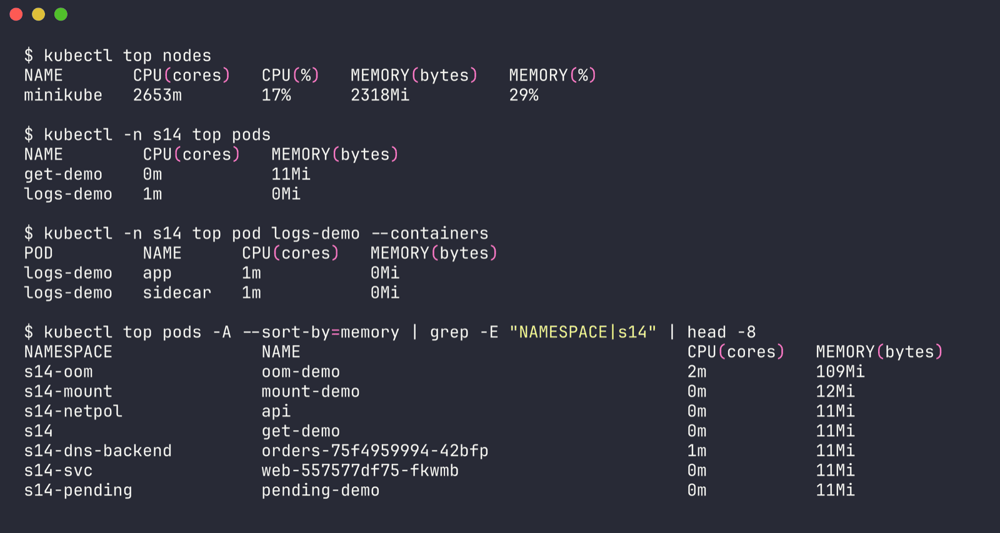

`oom-demo` at 109Mi is the fixed version from issue 10 - the broken one had a 50Mi limit, which is exactly why it kept getting killed.

### Quick reference

| Command | When I use it |
| --- | --- |
| `kubectl get pods` / `-o wide` / `--show-labels` | first look: status, restarts, IP/node, labels for selector checks |
| `kubectl describe pod X` | the "why": Last State, exit code, env, volumes, Events |
| `kubectl logs X [-c C] [--previous] [-f]` | app's own errors; `--previous` for the crashed attempt |
| `kubectl exec X -- cmd` | inspect a *running* container from the inside |
| `kubectl events --for pod/X` / `get events --sort-by=.lastTimestamp` | timeline of what the cluster did |
| `kubectl explain <path>` | look up a field without leaving the terminal |
| `kubectl top pod/node` | actual CPU/memory usage vs limits |

---

## Task 2 - Troubleshooting common issues

Each folder has `broken.yaml`, `fixed.yaml` and a README with the six sections (1 identify, 2 investigate, 3 root cause, 4 fix, 5 verify, 6 notes), all with real output.

| # | Issue | Namespace | Symptom | Root cause | Fix |
| --- | --- | --- | --- | --- | --- |
| 1 | [CrashLoopBackOff](01-crashloopbackoff/) | s14-crash | `0/1 CrashLoopBackOff`, restarts climbing, `Last State: Error, Exit Code 1` | app exits because `DATABASE_URL` env var isn't set (`[FATAL] DATABASE_URL ... MISSING` in logs) | add the env var |
| 2 | [ImagePullBackOff](02-imagepullbackoff/) | s14-image | `ImagePullBackOff`, event `code = NotFound ... not found` | tag `nginx:this-tag-does-not-exist` doesn't exist | `nginx:1.27` |
| 3 | [ErrImagePull](03-errimagepull/) | s14-errpull | `ErrImagePull` <-> `ImagePullBackOff`, event `dial tcp: lookup registry.example.invalid ... no such host` | registry hostname in the image ref doesn't resolve | real registry `docker.io/library/nginx:1.27` |
| 4 | [Pending](04-pending/) | s14-pending | `Pending`, no IP/node, `FailedScheduling: didn't match Pod's node affinity/selector`, then `Insufficient cpu, Insufficient memory` | `nodeSelector disktype=ssd` no node has + requests 64 CPU / 200Gi | drop selector, requests 100m / 64Mi |
| 5 | [ContainerCreating](05-containercreating/) | s14-mount | stuck `ContainerCreating` 36m, `FailedMount: configmap "site-config" not found` / `secret "site-tls" not found` | ConfigMap and Secret mounted as volumes were never created | create them (pod recovers on its own) |
| 6 | [Service connectivity](06-service-connectivity/) | s14-svc | `curl: (7) Couldn't connect`, `ENDPOINTS <none>`, then endpoints on `:8080` | selector `app=web-app` vs label `app=web`; `targetPort 8080` vs containerPort 80 | selector `app: web`, `targetPort: 80` |
| 7 | [DNS](07-dns/) | s14-dns, s14-dns-backend | pod Running but logs `Could not resolve host: orders-service`, NXDOMAIN | wrong service name + short name used across namespaces | `orders-api.s14-dns-backend.svc.cluster.local` |
| 8 | [Pod networking](08-pod-networking/) | s14-netpol | `wget: download timed out` even to the pod IP; DNS, endpoints and app all fine | NetworkPolicy only allows `role=admin` into `app=api` (kindnet here *does* enforce it - tested) | add `role=frontend` to the policy's `from` |
| 9 | [Config error](09-config-error/) | s14-config | `CreateContainerConfigError`, `couldn't find key DB_HOST in ConfigMap` | key is `database_host`, not `DB_HOST`; Secret `db-credentials` missing | reference the right key, create the Secret |
| 10 | [OOMKilled](10-oomkilled/) (bonus) | s14-oom | `CrashLoopBackOff`, `Last State: OOMKilled, Exit Code 137` | ~100MB working set under a 50Mi limit | limit 192Mi (top shows 109Mi used) |

Plus the class [triage gauntlet](scenarios/): all five scenarios deployed with `triage_all.sh` into `s14-triage`, triaged and fixed - details in `scenarios/README.md`.

### Status -> where to look first (what I learned)

| Status | Container ever ran? | First command |
| --- | --- | --- |
| Pending | no (not scheduled) | `describe pod` -> FailedScheduling event |
| ContainerCreating (long) | no | `describe pod` -> FailedMount / Pulling / sandbox events |
| ErrImagePull / ImagePullBackOff | no | `describe pod` -> `Failed to pull image` message |
| CreateContainerConfigError | no | `describe pod` -> `Error: couldn't find key / secret not found` |
| CrashLoopBackOff | yes, repeatedly | `describe` (Last State + exit code), then `logs --previous` |
| Running but not working | yes | `logs`, `exec` + curl/nslookup, `get endpoints`, `get networkpolicy` |

---

## Task 3 - Mini project

Full write-up: [mini-project/README.md](mini-project/README.md).

Short version: the Deployment + Service from the class repo work as given (2 endpoints, HTTP 200). The two bugs were:
1. `project-broken-pod` -> `ErrImagePull`/`ImagePullBackOff` because `nginx:this-tag-does-not-exist` isn't a real tag -> fixed with `nginx:1.27`.
2. Service selector changed to `app=wrong-app` -> Service still has a ClusterIP but `ENDPOINTS <none>` and curl fails -> selector back to `app=troubleshooting-app`, endpoints and HTTP 200 back.

It also answers the 5 pod questions, the troubleshooting table and the 10 README questions from the brief.

---

## Cleanup

```bash
kubectl delete ns s14 s14-crash s14-image s14-errpull s14-pending s14-mount s14-svc s14-dns s14-dns-backend s14-netpol s14-config s14-oom s14-triage s14-mini
```

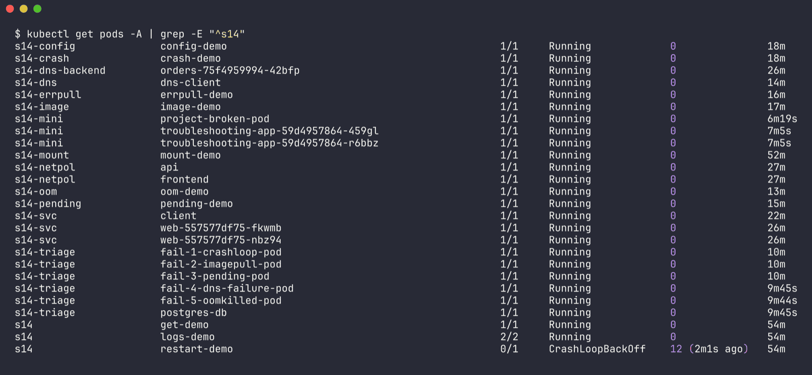

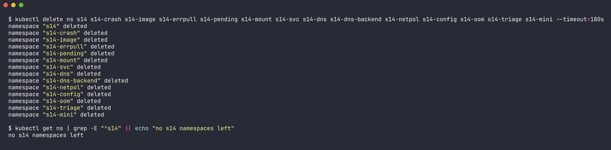

(output in `outputs/cleanup.txt`)

## Things that went sideways (and what they taught me)

- **Slow pulls on a shared cluster.** For the first ~15-30 minutes most of my pods sat in `ContainerCreating` with only a `Pulling` event. kubelet pulls images one at a time by default, and other workloads on the same node were pulling too - the events literally say "in 3.8s (13m54s including waiting)". Even after busybox was on the node, pods that had already queued a pull stayed stuck behind it; recreating them made them start instantly with "already present on machine". Pods stuck in `Terminating` while their pull was queued needed `--grace-period=0 --force` (only my own namespaces).
- **`logs --previous` isn't always there.** On the fast-restarting gauntlet pods it returned `unable to retrieve container logs`. `describe` -> Last State always had the exit reason.
- **busybox `nslookup` lies about dotted short names** (issue 7) - always test the FQDN.
- **NetworkPolicy enforcement depends on the CNI** - I tested it before trusting it (issue 8).
