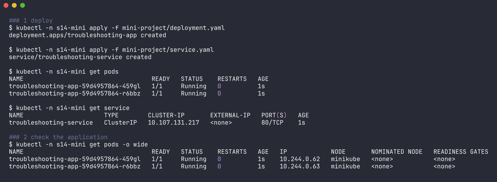
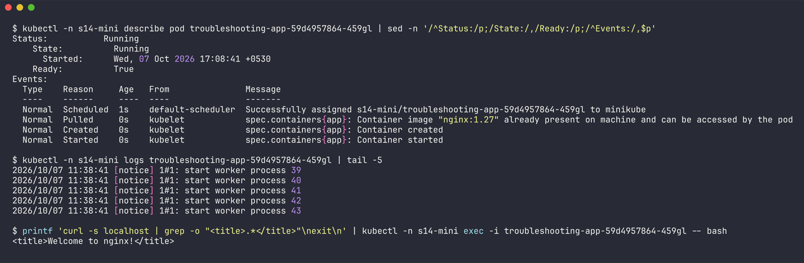
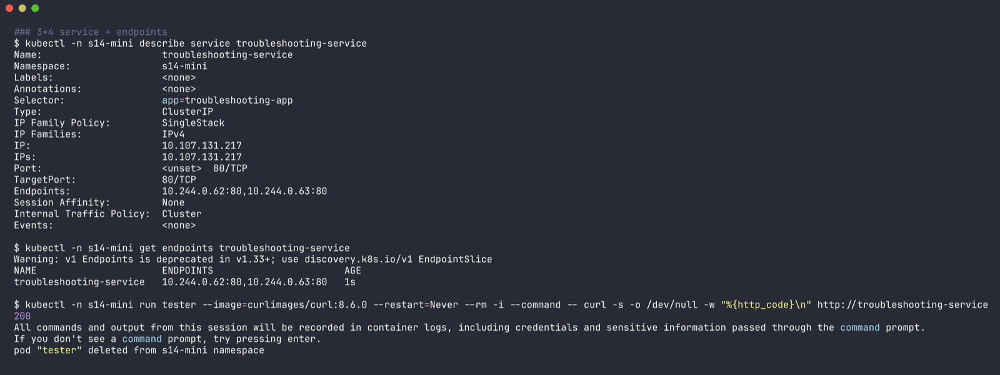
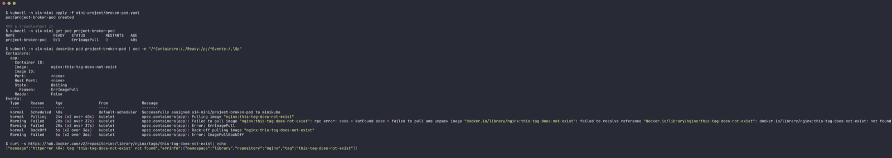
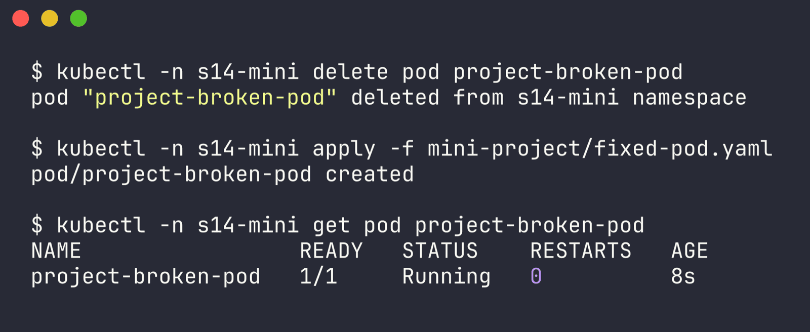
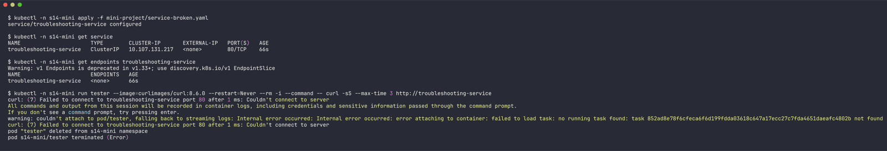
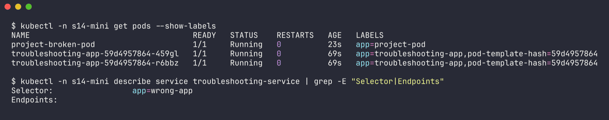
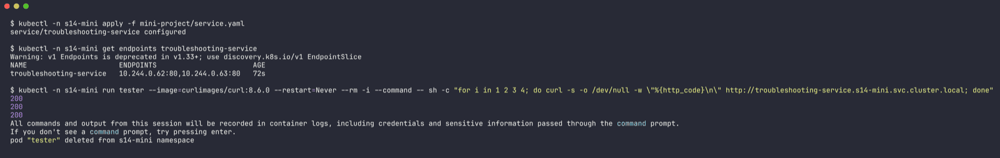
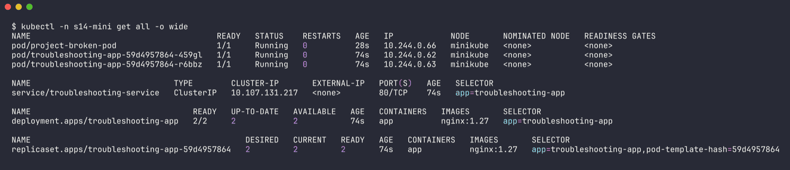

# Task 3 - Mini Project: Kubernetes Troubleshooting Challenge

Name: Ridaa Mirza
Enrollment No: 24BCS10394

Namespace: `s14-mini` | raw output: [`../outputs/mini-project.txt`](../outputs/mini-project.txt)

Files:
- `deployment.yaml`, `service.yaml`, `broken-pod.yaml` - from the class repo, unchanged
- `fixed-pod.yaml` - my fix for the broken pod
- `service-broken.yaml` - the README's "change the selector to wrong-app" challenge, saved as a file so it's reproducible

## Problem statement

A simple nginx app (Deployment with 2 replicas + ClusterIP Service). The team says "something is wrong". Two problems to find:
1. a standalone pod `project-broken-pod` that never starts
2. the Service stops sending traffic to the app after a selector change

Rule from the brief: no touching the YAML until I've found the cause with `get` / `describe` / events.

## Step 1-4: deploy and check the healthy baseline

```bash
$ kubectl -n s14-mini apply -f deployment.yaml
deployment.apps/troubleshooting-app created
$ kubectl -n s14-mini apply -f service.yaml
service/troubleshooting-service created

$ kubectl -n s14-mini get pods -o wide
NAME                                   READY   STATUS    RESTARTS   AGE   IP            NODE
troubleshooting-app-59d4957864-459gl   1/1     Running   0          1s    10.244.0.62   minikube
troubleshooting-app-59d4957864-r6bbz   1/1     Running   0          1s    10.244.0.63   minikube

$ kubectl -n s14-mini logs troubleshooting-app-59d4957864-459gl | tail -2
2026/10/07 11:38:41 [notice] 1#1: start worker process 42
2026/10/07 11:38:41 [notice] 1#1: start worker process 43

# inside the container with bash, like the brief says
$ printf 'curl -s localhost | grep -o "<title>.*</title>"\nexit\n' | kubectl -n s14-mini exec -i troubleshooting-app-59d4957864-459gl -- bash
<title>Welcome to nginx!</title>

$ kubectl -n s14-mini describe service troubleshooting-service
Selector:                 app=troubleshooting-app
TargetPort:               80/TCP
Endpoints:                10.244.0.62:80,10.244.0.63:80

$ kubectl -n s14-mini get endpoints troubleshooting-service
NAME                      ENDPOINTS                       AGE
troubleshooting-service   10.244.0.62:80,10.244.0.63:80   1s

$ kubectl -n s14-mini run tester --image=curlimages/curl:8.6.0 --restart=Never --rm -i --command -- curl -s -o /dev/null -w "%{http_code}\n" http://troubleshooting-service
200
```







Baseline is healthy: selector matches, targetPort matches containerPort 80, two endpoints, HTTP 200 through the Service. (I ran `exec` non-interactively by piping commands into `bash`, so the output could be saved; `kubectl exec -it ... -- bash` is the same thing interactively.)

## Bug 1 - the broken pod

### Investigation

```bash
$ kubectl -n s14-mini apply -f broken-pod.yaml
pod/project-broken-pod created

$ kubectl -n s14-mini get pod project-broken-pod
NAME                 READY   STATUS         RESTARTS   AGE
project-broken-pod   0/1     ErrImagePull   0          40s

$ kubectl -n s14-mini describe pod project-broken-pod
Containers:
  app:
    Image:          nginx:this-tag-does-not-exist
    State:          Waiting
      Reason:       ErrImagePull
Events:
  Normal   Scheduled  40s                default-scheduler  Successfully assigned s14-mini/project-broken-pod to minikube
  Normal   Pulling    24s (x2 over 40s)  kubelet            Pulling image "nginx:this-tag-does-not-exist"
  Warning  Failed     20s (x2 over 37s)  kubelet            Failed to pull image "nginx:this-tag-does-not-exist": rpc error: code = NotFound desc = failed to pull and unpack image "docker.io/library/nginx:this-tag-does-not-exist": failed to resolve reference "docker.io/library/nginx:this-tag-does-not-exist": docker.io/library/nginx:this-tag-does-not-exist: not found
  Warning  Failed     20s (x2 over 37s)  kubelet            Error: ErrImagePull
  Normal   BackOff    6s (x2 over 36s)   kubelet            Back-off pulling image "nginx:this-tag-does-not-exist"
  Warning  Failed     6s (x2 over 36s)   kubelet            Error: ImagePullBackOff

$ curl -s https://hub.docker.com/v2/repositories/library/nginx/tags/this-tag-does-not-exist
{"message":"httperror 404: tag 'this-tag-does-not-exist' not found",...}
```



### Answers (section 7 of the brief)

**Question 1:** What is the Pod status?
*Answer:* `ErrImagePull`, alternating with `ImagePullBackOff` between retries. `READY 0/1`, 0 restarts (the container never existed, so nothing to restart).

**Question 2:** What is the actual error?
*Answer:* `Failed to pull image "nginx:this-tag-does-not-exist": rpc error: code = NotFound ... docker.io/library/nginx:this-tag-does-not-exist: not found`

**Question 3:** Which command helped you find the reason?
*Answer:* `kubectl describe pod project-broken-pod` - specifically the Events section. `get` only gave the status; `logs` has nothing because no container ran.

**Question 4:** What is wrong with the image?
*Answer:* The repository (`library/nginx`) is fine and the registry is reachable, but the tag `this-tag-does-not-exist` doesn't exist. Docker Hub's API confirms it with a 404.

**Question 5:** How would you fix it?
*Answer:* Use a real tag, `nginx:1.27` (same as the Deployment). `image` is one of the few pod fields you *can* change in place (`kubectl set image pod/project-broken-pod app=nginx:1.27`), but I did delete + apply so the running pod matches the fixed file exactly:

```bash
$ kubectl -n s14-mini delete pod project-broken-pod
$ kubectl -n s14-mini apply -f fixed-pod.yaml
pod/project-broken-pod created

$ kubectl -n s14-mini get pod project-broken-pod
NAME                 READY   STATUS    RESTARTS   AGE
project-broken-pod   1/1     Running   0          8s
```



## Bug 2 - Service selector mismatch

### Investigation

```bash
$ kubectl -n s14-mini apply -f service-broken.yaml       # selector: app: wrong-app
service/troubleshooting-service configured

$ kubectl -n s14-mini get service
NAME                      TYPE        CLUSTER-IP       EXTERNAL-IP   PORT(S)   AGE
troubleshooting-service   ClusterIP   10.107.131.217   <none>        80/TCP    66s

$ kubectl -n s14-mini get endpoints troubleshooting-service
NAME                      ENDPOINTS   AGE
troubleshooting-service   <none>      66s

$ kubectl -n s14-mini run tester ... -- curl -sS --max-time 3 http://troubleshooting-service
curl: (7) Failed to connect to troubleshooting-service port 80 after 1 ms: Couldn't connect to server
```



`get service` looks totally normal - the Service object exists and has a ClusterIP. Only endpoints show the problem.

```bash
$ kubectl -n s14-mini get pods --show-labels
NAME                                   READY   STATUS    RESTARTS   AGE   LABELS
project-broken-pod                     1/1     Running   0          23s   app=project-pod
troubleshooting-app-59d4957864-459gl   1/1     Running   0          69s   app=troubleshooting-app,pod-template-hash=59d4957864
troubleshooting-app-59d4957864-r6bbz   1/1     Running   0          69s   app=troubleshooting-app,pod-template-hash=59d4957864

$ kubectl -n s14-mini describe service troubleshooting-service | grep -E "Selector|Endpoints"
Selector:                 app=wrong-app
Endpoints:                
```



### Root cause

Service selector `app=wrong-app`, pod label `app=troubleshooting-app`. No pod matches, so the endpoint controller builds an empty list and the ClusterIP has nowhere to forward to.

### Fix + verify

Put the selector back (`service.yaml`):

```bash
$ kubectl -n s14-mini apply -f service.yaml
service/troubleshooting-service configured

$ kubectl -n s14-mini get endpoints troubleshooting-service
NAME                      ENDPOINTS                       AGE
troubleshooting-service   10.244.0.62:80,10.244.0.63:80   72s

$ kubectl -n s14-mini run tester ... -- sh -c "for i in 1 2 3 4; do curl -s -o /dev/null -w \"%{http_code}\n\" http://troubleshooting-service.s14-mini.svc.cluster.local; done"
200
200
200
```



(4 requests, 3 lines: the first line was lost while `kubectl run -i` was still attaching - the raw output file has the attach warning.)

### Final state - matches the target architecture

```bash
$ kubectl -n s14-mini get all -o wide
NAME                                       READY   STATUS    RESTARTS   AGE   IP
pod/project-broken-pod                     1/1     Running   0          28s   10.244.0.66
pod/troubleshooting-app-59d4957864-459gl   1/1     Running   0          74s   10.244.0.62
pod/troubleshooting-app-59d4957864-r6bbz   1/1     Running   0          74s   10.244.0.63

NAME                              TYPE        CLUSTER-IP       PORT(S)   SELECTOR
service/troubleshooting-service   ClusterIP   10.107.131.217   80/TCP    app=troubleshooting-app

NAME                                  READY   UP-TO-DATE   AVAILABLE   IMAGES       SELECTOR
deployment.apps/troubleshooting-app   2/2     2            2           nginx:1.27   app=troubleshooting-app
```



Service -> selector `app=troubleshooting-app` -> 2 nginx pods. The fixed standalone pod has its own label (`app=project-pod`) so it does *not* get pulled into the Service by accident.

## Before / after

| | Before | After |
| --- | --- | --- |
| project-broken-pod | `0/1 ErrImagePull` / `ImagePullBackOff`, image `nginx:this-tag-does-not-exist` | `1/1 Running`, image `nginx:1.27` |
| Service selector | `app=wrong-app` | `app=troubleshooting-app` |
| Service endpoints | `<none>` | `10.244.0.62:80,10.244.0.63:80` |
| curl through Service | `curl: (7) Couldn't connect to server` | `200` |

## Troubleshooting table (section 11)

| Problem | What I Saw | Command I Used | Root Cause | Fix |
| :--- | :--- | :--- | :--- | :--- |
| **Broken Pod** | `0/1 ErrImagePull`, 0 restarts, no logs | `kubectl get pod`, `kubectl describe pod` (Events) | container can't be created because its image can't be pulled | delete + apply `fixed-pod.yaml` |
| **Service Problem** | Service exists with ClusterIP but `ENDPOINTS <none>`, curl `Couldn't connect` | `kubectl get endpoints`, `kubectl describe service`, `kubectl get pods --show-labels` | selector `app=wrong-app` matches no pod label | selector back to `app=troubleshooting-app` |
| **Image Problem** | `Failed to pull image ... code = NotFound ... not found` | `kubectl describe pod`, Docker Hub tags API | tag `this-tag-does-not-exist` doesn't exist for `nginx` | `image: nginx:1.27` |

## Other things I noticed while reviewing the project files

These aren't breaking anything right now but I'd flag them in a review:
- The Deployment has no readiness probe, so a pod becomes a Service endpoint as soon as the container starts, before nginx is actually serving. A `readinessProbe` with `httpGet: / port 80` fixes that.
- No resource requests/limits on the Deployment - fine on minikube, but the scheduler can't make good decisions and one pod could eat the node (see issue 4 / issue 10 in Task 2).
- `broken-pod.yaml` has no labels at all, which makes it hard to select (`-l`) and easy to forget. My fixed version labels it.
- In the class repo's `09-service-dns-troubleshooting/service.yaml` the "working" Service has `selector: app: web-ahsgdf` while the Deployment's pods are `app: web`, so it has no endpoints either - same bug as this project. My Task 2 issue 6 covers that case.

## README questions (section 12)

1. **What does `kubectl get` tell us?** The current state at a glance: which objects exist, their status, ready count, restarts, age. With `-o wide` also IPs and nodes. It tells me *what* is wrong, not *why*.
2. **Difference between `get` and `describe`?** `get` is a one-line summary per object. `describe` is the detailed view of one object - container state, last state + exit code, env, volumes, conditions and the events for that object. Most of my "why" answers came from describe's Events.
3. **Why do we use `kubectl logs`?** To see what the application itself printed to stdout/stderr. That's where app-level errors live (missing env var, stack traces). It's empty when the container never started, so it's useless for image/scheduling problems.
4. **When would you use `kubectl exec`?** When the container is running but behaving wrong - check config files, env vars, DNS (`nslookup`, `/etc/resolv.conf`), and curl other services or localhost from inside the cluster network. It can't help with crashed or never-started containers.
5. **What does `CrashLoopBackOff` mean?** The container starts, exits, gets restarted, exits again, and kubelet waits longer and longer between restarts. The reason is in `Last State` (exit code / OOMKilled) and in `logs --previous`.
6. **What does `ImagePullBackOff` mean?** The node failed to pull the image (wrong tag/repo/registry, missing credentials, rate limit) and kubelet is waiting before retrying. `ErrImagePull` is the same failure at the moment of the attempt.
7. **Why can a Pod remain `Pending`?** The scheduler can't find a node: not enough CPU/memory for the *requests*, nodeSelector/affinity nothing matches, taints without tolerations, or an unbound PVC. The `FailedScheduling` event says which.
8. **Why can a Service have no endpoints?** Selector doesn't match any pod labels (this project), pods exist but aren't Ready, the pods are in a different namespace than the Service, or there are no pods at all (deployment scaled to 0 / crashing).
9. **Relationship between Service selector and Pod labels?** The selector is a label query. The endpoint controller continuously finds Ready pods in the same namespace whose labels match the selector and puts their IP:targetPort into the Service's endpoints. Change a label or the selector and the endpoints update immediately.
10. **What is Kubernetes DNS?** CoreDNS running in kube-system behind the `kube-dns` Service (10.96.0.10 here). Every pod's `/etc/resolv.conf` points at it, and every Service gets a name `<svc>.<namespace>.svc.cluster.local` resolving to its ClusterIP. Short names only work inside the same namespace thanks to the search list.
