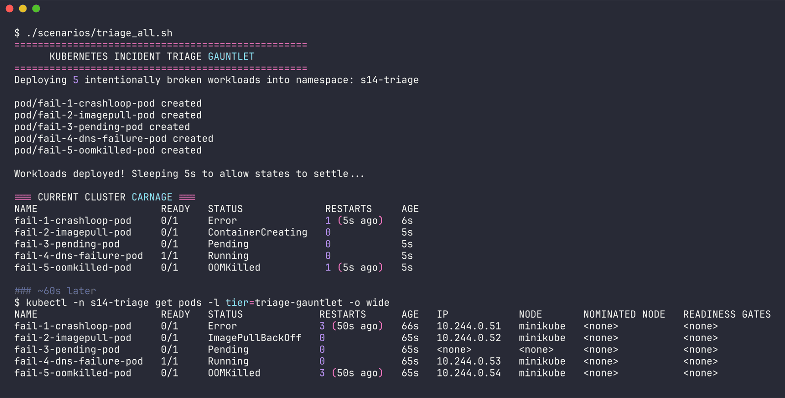
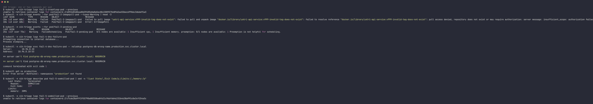
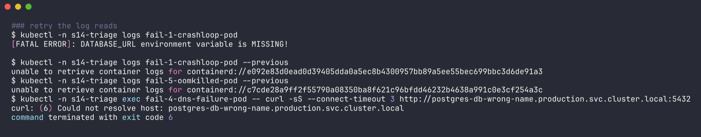
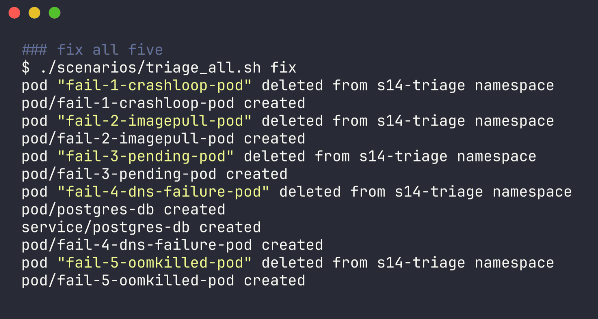
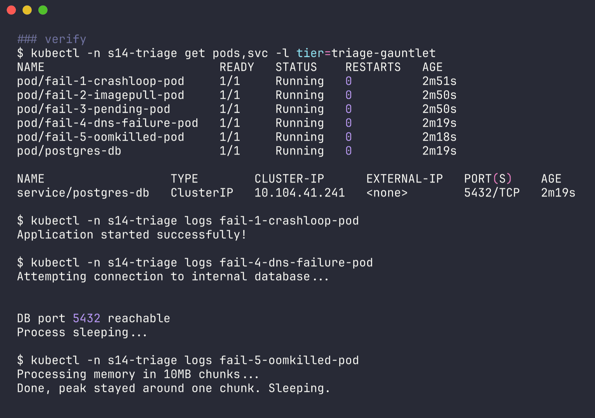

# Triage Gauntlet (class scenarios 1-5)

Raw output: [`../outputs/scenarios-triage.txt`](../outputs/scenarios-triage.txt)

These are the five `broken.yaml` files from the class repo, unchanged. I added a `fixed.yaml` to each and changed `triage_all.sh` so it:
- deploys into its own namespace (`NS`, default `s14-triage`) instead of `default`, since the cluster is shared
- has `fix` and `clean` modes (`./triage_all.sh fix` deletes each broken pod and applies its fixed.yaml)

## Deploy

```bash
$ ./scenarios/triage_all.sh
Deploying 5 intentionally broken workloads into namespace: s14-triage
...
=== CURRENT CLUSTER CARNAGE ===
NAME                     READY   STATUS              RESTARTS     AGE
fail-1-crashloop-pod     0/1     Error               1 (5s ago)   6s
fail-2-imagepull-pod     0/1     ContainerCreating   0            5s
fail-3-pending-pod       0/1     Pending             0            5s
fail-4-dns-failure-pod   1/1     Running             0            5s
fail-5-oomkilled-pod     0/1     OOMKilled           1 (5s ago)   5s

# ~60s later
$ kubectl -n s14-triage get pods -l tier=triage-gauntlet -o wide
NAME                     READY   STATUS             RESTARTS      AGE   IP            NODE
fail-1-crashloop-pod     0/1     Error              3 (50s ago)   66s   10.244.0.51   minikube
fail-2-imagepull-pod     0/1     ImagePullBackOff   0             65s   10.244.0.52   minikube
fail-3-pending-pod       0/1     Pending            0             65s   <none>        <none>
fail-4-dns-failure-pod   1/1     Running            0             65s   10.244.0.53   minikube
fail-5-oomkilled-pod     0/1     OOMKilled          3 (50s ago)   65s   10.244.0.54   minikube
```



## Triage (one or two commands each)

| Pod | Command that gave it away | What it said | Root cause | Fix in fixed.yaml |
| --- | --- | --- | --- | --- |
| fail-1-crashloop | `kubectl logs fail-1-crashloop-pod` | `[FATAL ERROR]: DATABASE_URL environment variable is MISSING!` | required env var not set | add `DATABASE_URL` env; also added `time.sleep` - without it a "fixed" script exits 0 and still restart-loops under `restartPolicy: Always` |
| fail-2-imagepull | `kubectl events --for pod/fail-2-imagepull-pod --types=Warning` | `pull access denied, repository does not exist or may require authorization` | `yatri-api-service` isn't a public Docker Hub repo (resolves to `docker.io/library/yatri-api-service`) | real image `nginx:1.27` (or push the image + add `imagePullSecrets`) |
| fail-3-pending | `kubectl events --for pod/fail-3-pending-pod` | `0/1 nodes are available: 1 Insufficient cpu, 1 Insufficient memory` | requests 500 CPU / 1000Gi | requests 100m / 64Mi |
| fail-4-dns-failure | `kubectl logs` showed nothing (`curl -s ... \|\| true` hides it), so `kubectl exec ... curl -sS ...` | `curl: (6) Could not resolve host: postgres-db-wrong-name.production.svc.cluster.local`; `kubectl get ns production` -> NotFound | wrong service name and a namespace that doesn't exist | stand-in `postgres-db` pod + Service in the same namespace, client uses `postgres-db.s14-triage.svc.cluster.local` |
| fail-5-oomkilled | `kubectl describe pod` | `Last State: Terminated, Reason: OOMKilled, Exit Code: 137`, `Limits: memory: 20Mi` | holds 100 x 10MB chunks in a list under a 20Mi limit | process one chunk at a time (`del chunk`) + 64Mi limit for the Python runtime itself |





Two things that tripped me up here:
- `kubectl logs --previous` on the crashloop and OOM pods returned `unable to retrieve container logs for containerd://...` on this run. Both pods were restarting every few seconds; plain `kubectl logs` (current attempt) still had the fatal line, and `describe` still had `Last State`. So don't rely on `--previous` alone.
- Scenario 4 is the sneaky one: the pod is `1/1 Running`, so `get pods` says everything is fine. Only re-running the request without `-s` shows the real error.

## Fix + verify

```bash
$ ./scenarios/triage_all.sh fix
pod "fail-1-crashloop-pod" deleted from s14-triage namespace
pod/fail-1-crashloop-pod created
...
pod/postgres-db created
service/postgres-db created
pod/fail-4-dns-failure-pod created
...

$ kubectl -n s14-triage get pods,svc -l tier=triage-gauntlet
NAME                         READY   STATUS    RESTARTS   AGE
pod/fail-1-crashloop-pod     1/1     Running   0          2m51s
pod/fail-2-imagepull-pod     1/1     Running   0          2m50s
pod/fail-3-pending-pod       1/1     Running   0          2m50s
pod/fail-4-dns-failure-pod   1/1     Running   0          2m19s
pod/fail-5-oomkilled-pod     1/1     Running   0          2m18s
pod/postgres-db              1/1     Running   0          2m19s

NAME                  TYPE        CLUSTER-IP      EXTERNAL-IP   PORT(S)    AGE
service/postgres-db   ClusterIP   10.104.41.241   <none>        5432/TCP   2m19s

$ kubectl -n s14-triage logs fail-1-crashloop-pod
Application started successfully!

$ kubectl -n s14-triage logs fail-4-dns-failure-pod
Attempting connection to internal database...
DB port 5432 reachable
Process sleeping...

$ kubectl -n s14-triage logs fail-5-oomkilled-pod
Processing memory in 10MB chunks...
Done, peak stayed around one chunk. Sleeping.
```





All five green.
