# Session 15 - Helm

Name: Ridaa Mirza
Enrollment No: 24BCS10394

Helm is basically "apt for Kubernetes". Instead of keeping five YAML files per environment and editing them by hand, you write one chart (templates + defaults) and feed it different values. Every install/upgrade becomes a numbered revision, which is what makes one-command rollback possible.

Three words that kept coming up:

- **Chart** - the package (templates + `values.yaml` + `Chart.yaml`). The recipe.
- **Release** - one installed copy of a chart in a namespace. The cooked meal.
- **Revision** - every install / upgrade / rollback of a release bumps this number. Helm stores each one as a Secret (`sh.helm.release.v1.<name>.v<N>`) in the release namespace.

### Setup

- minikube (docker driver, macOS), Kubernetes v1.37.0, containerd runtime
- Helm **v4.3.0** (the instructor notes are written for Helm 3 - differences I actually hit are listed at the end)
- the cluster was shared with other students' labs, so everything I did lives in my own namespaces: `s15` (rollback flow), `s15-cmd` (command walkthrough), `s15-notes` (mini project). Every command has `-n`.

```bash
$ helm version
version.BuildInfo{Version:"v4.3.0", GitCommit:"bec5b06ed841fe5269972d864d5177944fd5970f", GitTreeState:"clean", GoVersion:"go1.27.1", KubeClientVersion:"v1.37"}
```

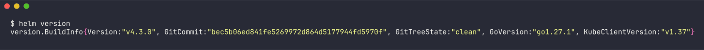

All raw command output is saved in [`outputs/`](outputs/) (and [`mini-project/outputs/`](mini-project/outputs/)) - the snippets below are cut from those files, nothing is typed by hand.

### Folder layout

```
14-helm/
  README.md                 <- this file (Task 1 + Task 2 + chart explanation)
  my-web-chart/             <- my own chart (helm create + customised)
    Chart.yaml
    values.yaml
    .helmignore
    templates/
      _helpers.tpl
      configmap.yaml        <- the HTML page, built from values
      deployment.yaml
      service.yaml
      serviceaccount.yaml
      ingress.yaml          <- off by default (ingress.enabled=false)
      NOTES.txt
      tests/test-connection.yaml
  values-v2.yaml            <- upgrade values for revision 2
  values-v3-broken.yaml     <- deliberately broken image tag for revision 3
  outputs/                  <- raw outputs for Task 1 and Task 2
  mini-project/             <- Task 3 (notes-chart), has its own README
```

---

## My chart - my-web-chart

I started from `helm create` and then cut it down / changed it so that a version change is actually visible from the outside:

- removed `hpa.yaml` and `httproute.yaml` (not needed here, less noise)
- added `templates/configmap.yaml` - it renders an `index.html` from `.Values.page.*` and the Deployment mounts it over `/usr/share/nginx/html`. So `curl` tells you exactly which values are live.
- Deployment has a `checksum/config` annotation = sha256 of the rendered ConfigMap. Change the page, the hash changes, the pod template changes, Kubernetes does a rolling update. Without this, nginx would keep running and only the mounted file would change (slowly) - see the gotcha in Task 2.
- `service.type` can be `ClusterIP` / `NodePort` / `LoadBalancer`, and `service.nodePort` is only rendered when type is NodePort.
- custom `NOTES.txt` that prints the release, image, replicas and page version after every install/upgrade.

Main knobs in `values.yaml`:

```yaml
replicaCount: 2

image:
  repository: nginx
  pullPolicy: IfNotPresent
  tag: ""            # empty -> falls back to .Chart.AppVersion (1.27-alpine)

page:
  version: "v1"
  title: "Ridaa's Helm Web App"
  message: "Hello from revision v1 - deployed with Helm"
  color: "#2b6cb0"
  owner: "Ridaa Mirza (24BCS10394)"
  features:
    - "Deployment + Service + ConfigMap"
    - "Values-driven replicas, image and service type"

service:
  type: ClusterIP    # ClusterIP | NodePort | LoadBalancer
  port: 80
  nodePort: ""

ingress:
  enabled: false
```

The ConfigMap template (uses values, `include`, `if` and `range` all in one place):

```yaml
apiVersion: v1
kind: ConfigMap
metadata:
  name: {{ include "my-web-chart.fullname" . }}-html
  labels:
    {{- include "my-web-chart.labels" . | nindent 4 }}
data:
  index.html: |
    ...
      <p id="message">{{ .Values.page.message }}</p>
      <p>page version: <b>{{ .Values.page.version }}</b></p>
      <p>release: {{ .Release.Name }} | revision: {{ .Release.Revision }} | chart: {{ include "my-web-chart.chart" . }}</p>
      {{- if .Values.page.features }}
      <ul>
      {{- range .Values.page.features }}
        <li>{{ . }}</li>
      {{- end }}
      </ul>
      {{- end }}
```

---

## Task 1 - Helm commands, one by one

For the "live" commands I installed my chart as release `cmd-demo` in namespace `s15-cmd`. (The full upgrade/rollback story is Task 2, on a separate release.)

### helm create

Scaffolds a new chart directory with a working nginx example.

```bash
$ helm create my-web-chart
Creating my-web-chart
```

What it generated ([outputs/01-helm-create.txt](outputs/01-helm-create.txt)):

```
my-web-chart/.helmignore
my-web-chart/Chart.yaml
my-web-chart/charts
my-web-chart/templates/NOTES.txt
my-web-chart/templates/_helpers.tpl
my-web-chart/templates/deployment.yaml
my-web-chart/templates/hpa.yaml
my-web-chart/templates/httproute.yaml
my-web-chart/templates/ingress.yaml
my-web-chart/templates/service.yaml
my-web-chart/templates/serviceaccount.yaml
my-web-chart/templates/tests/test-connection.yaml
my-web-chart/values.yaml
```

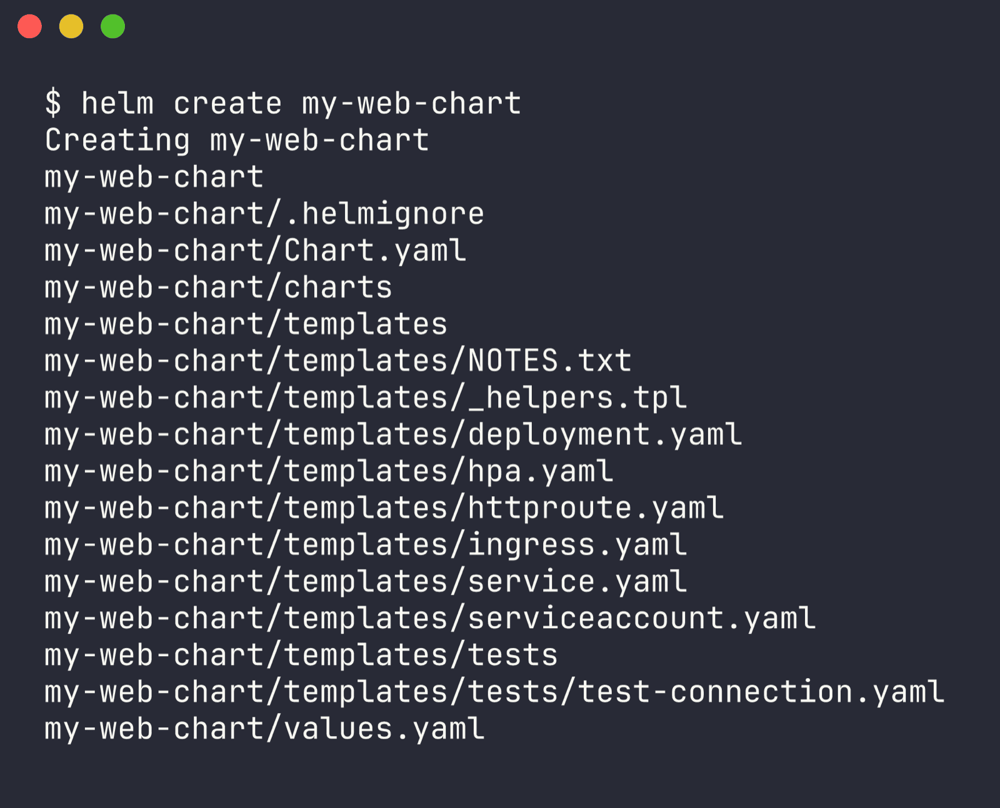

Observation: Helm 4's scaffold also includes `httproute.yaml` (Gateway API), which the Helm 3 version in the class notes doesn't have.

### helm lint

Static check of the chart - YAML validity, template parse errors, required fields in Chart.yaml.

```bash
$ helm lint ./my-web-chart
==> Linting ./my-web-chart
[INFO] Chart.yaml: icon is recommended

1 chart(s) linted, 0 chart(s) failed

$ helm lint ./my-web-chart -f values-v2.yaml --strict
==> Linting ./my-web-chart
[INFO] Chart.yaml: icon is recommended

1 chart(s) linted, 0 chart(s) failed
```

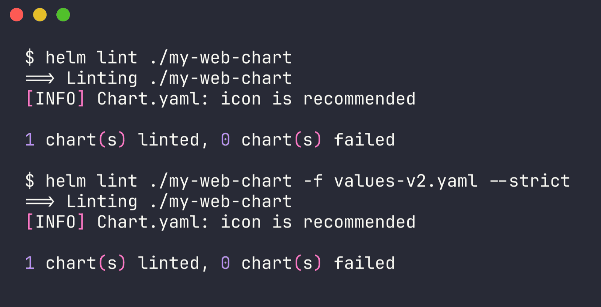

To see it actually catch something, I copied the chart to a scratch folder and deleted one `}` in deployment.yaml ([outputs/02b-helm-lint-broken.txt](outputs/02b-helm-lint-broken.txt)):

```bash
$ helm lint ./broken-chart   # copy of my-web-chart with a missing "}" in deployment.yaml
==> Linting ./broken-chart
[INFO] Chart.yaml: icon is recommended
[ERROR] templates/: parse error at (my-web-chart/templates/deployment.yaml:8): unexpected "}" in operand

Error: 1 chart(s) linted, 1 chart(s) failed
exit code: 1
```

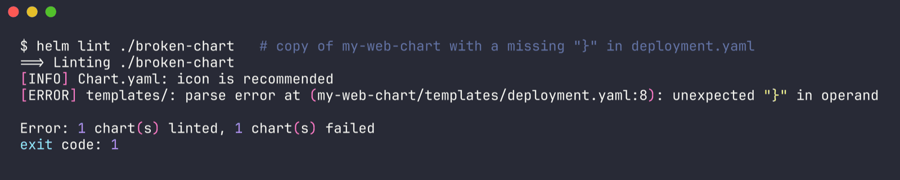

Non-zero exit code, so it works as a CI gate.

### helm template

Renders the templates to plain YAML locally. No cluster involved - great for "what will this actually produce".

```bash
$ helm template web ./my-web-chart -n s15
---
# Source: my-web-chart/templates/configmap.yaml
apiVersion: v1
kind: ConfigMap
metadata:
  name: web-my-web-chart-html
...
      <p id="message">Hello from revision v1 - deployed with Helm</p>
      <p>page version: <b>v1</b></p>
      <p>release: web | revision: 1 | chart: my-web-chart-0.1.0</p>
...
# Source: my-web-chart/templates/deployment.yaml
...
spec:
  replicas: 2
...
      annotations:
        # changes whenever the ConfigMap content changes -> forces a rolling update
        checksum/config: 28b1a357e25b776f25ba035199a978fed947e066aad86edad045bec0d928c4b8
...
          image: "nginx:1.27-alpine"
```

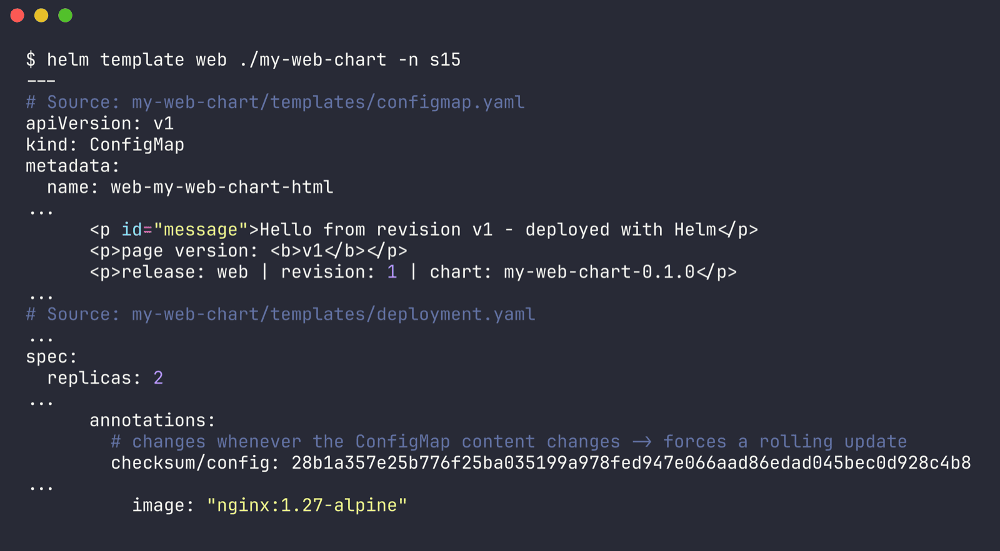

Full output: [outputs/03-helm-template.txt](outputs/03-helm-template.txt). Note `image.tag` was empty so it fell back to `appVersion` from Chart.yaml.

Overriding values on the fly ([outputs/04-helm-template-overrides.txt](outputs/04-helm-template-overrides.txt)):

```bash
$ helm template web ./my-web-chart --set replicaCount=5 --set service.type=NodePort --set service.nodePort=30915 --set ingress.enabled=true | grep -E "replicas:|type:|nodePort:|kind:"
kind: ServiceAccount
kind: ConfigMap
kind: Service
  type: NodePort
      nodePort: 30915
kind: Deployment
  replicas: 5
kind: Ingress
kind: Pod
```

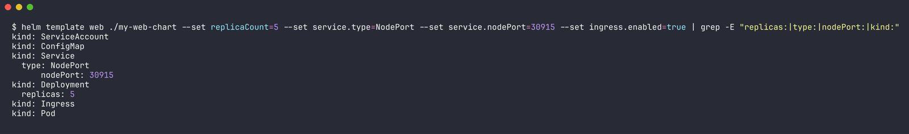

`ingress.enabled=true` made an Ingress object appear (the `{{- if .Values.ingress.enabled }}` block), NodePort made the `nodePort:` line appear. And turning the features list off removes the `<ul>` completely:

```bash
$ helm template web ./my-web-chart --set page.features=null --show-only templates/configmap.yaml | grep -c "<li>"
0
```

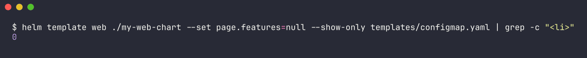

### helm install --dry-run

Same as install, but nothing is persisted. In Helm 4 `--dry-run` needs a mode: `client` (no cluster) or `server` (validated against the API server).

```bash
$ helm install web ./my-web-chart -n s15 --create-namespace --dry-run=server | head -40
NAME: web
LAST DEPLOYED: Wed Oct  7 16:21:07 2026
NAMESPACE: s15
STATUS: pending-install
REVISION: 1
DESCRIPTION: Dry run complete
HOOKS:
---
# Source: my-web-chart/templates/tests/test-connection.yaml
...
MANIFEST:
---
# Source: my-web-chart/templates/serviceaccount.yaml
...
```

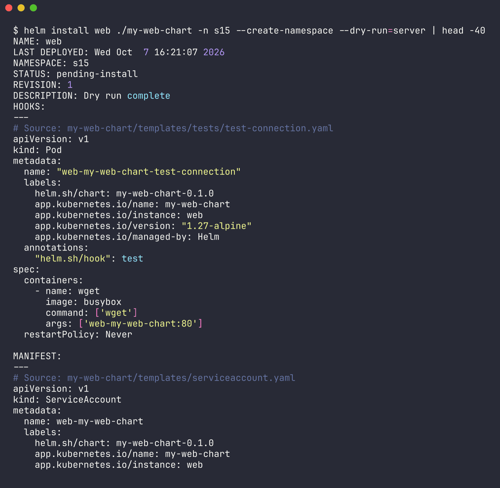

### helm install

Renders the chart and creates the objects in the cluster as revision 1.

```bash
$ helm install cmd-demo ./my-web-chart -n s15-cmd --create-namespace --wait --timeout 180s
Error: INSTALLATION FAILED: resource Deployment/s15-cmd/cmd-demo-my-web-chart not ready. status: InProgress, message: Available: 0/2
context deadline exceeded
```

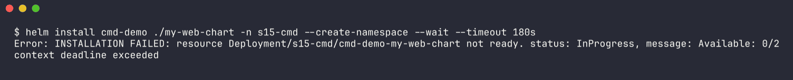

This was a real failure, not on purpose: the cluster had just started and a dozen other labs were pulling images at the same time, so `nginx:1.27-alpine` took longer than my 180s `--wait`. Helm marked the release `failed`, but the objects were still created and the pods kept pulling:

```bash
$ helm list -n s15-cmd
NAME    	NAMESPACE	REVISION	UPDATED                             	STATUS	CHART             	APP VERSION
cmd-demo	s15-cmd  	1       	2026-10-07 16:21:20.009413 +0530 IST	failed	my-web-chart-0.1.0	1.27-alpine

$ kubectl get all,cm -n s15-cmd
NAME                                         READY   STATUS              RESTARTS   AGE
pod/cmd-demo-my-web-chart-5958b646fd-9k4dn   0/1     ContainerCreating   0          3m
pod/cmd-demo-my-web-chart-5958b646fd-vps9f   0/1     ContainerCreating   0          3m
...
```

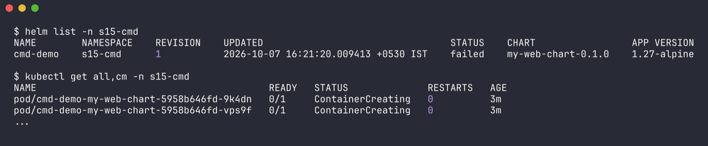

Once the image arrived the pods went Running, and a plain `helm upgrade` with the same chart moved the release to `deployed` ([outputs/06b-status-after-pull.txt](outputs/06b-status-after-pull.txt)):

```bash
$ helm upgrade cmd-demo ./my-web-chart -n s15-cmd --wait --timeout 180s
Release "cmd-demo" has been upgraded. Happy Helming!
NAME: cmd-demo
LAST DEPLOYED: Wed Oct  7 16:34:43 2026
NAMESPACE: s15-cmd
STATUS: deployed
REVISION: 2
DESCRIPTION: Upgrade complete
NOTES:
my-web-chart is installed.

  Release:   cmd-demo (revision 2)
  Namespace: s15-cmd
  Image:     nginx:1.27-alpine
  Replicas:  2
  Page:      v1 - "Hello from revision v1 - deployed with Helm"

Get the application URL by running these commands:
  kubectl --namespace s15-cmd port-forward svc/cmd-demo-my-web-chart 8080:80
  curl http://127.0.0.1:8080
```

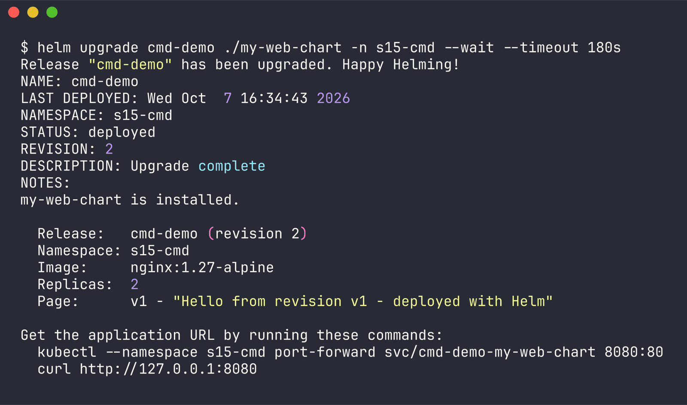

Lesson: `--wait` only decides what Helm *reports*; it doesn't undo anything unless you also pass `--rollback-on-failure`.

### helm list

Lists releases in a namespace (`-A` for all namespaces).

```bash
$ helm list -n s15-cmd
NAME    	NAMESPACE	REVISION	UPDATED                             	STATUS  	CHART             	APP VERSION
cmd-demo	s15-cmd  	2       	2026-10-07 16:34:43.898839 +0530 IST	deployed	my-web-chart-0.1.0	1.27-alpine
```

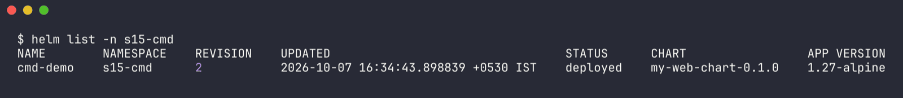

### helm status

Shows the current state of a release: revision, status, description, the resources it owns (Helm 4 prints these by default), and the NOTES ([outputs/07-helm-status.txt](outputs/07-helm-status.txt)).

```bash
$ helm status cmd-demo -n s15-cmd
NAME: cmd-demo
LAST DEPLOYED: Wed Oct  7 16:34:43 2026
NAMESPACE: s15-cmd
STATUS: deployed
REVISION: 2
DESCRIPTION: Upgrade complete
RESOURCES:
==> v1/Pod(related)
NAME                                     READY   STATUS    RESTARTS   AGE
cmd-demo-my-web-chart-7569f966fb-lbmrc   1/1     Running   0          8s
cmd-demo-my-web-chart-7569f966fb-z5hqs   1/1     Running   0          7s

==> v1/ServiceAccount
NAME                    AGE
cmd-demo-my-web-chart   13m

==> v1/ConfigMap
NAME                         DATA   AGE
cmd-demo-my-web-chart-html   1      13m

==> v1/Service
NAME                    TYPE        CLUSTER-IP      EXTERNAL-IP   PORT(S)   AGE
cmd-demo-my-web-chart   ClusterIP   10.107.10.219   <none>        80/TCP    13m

==> v1/Deployment
NAME                    READY   UP-TO-DATE   AVAILABLE   AGE
cmd-demo-my-web-chart   2/2     2            2           13m
...
```

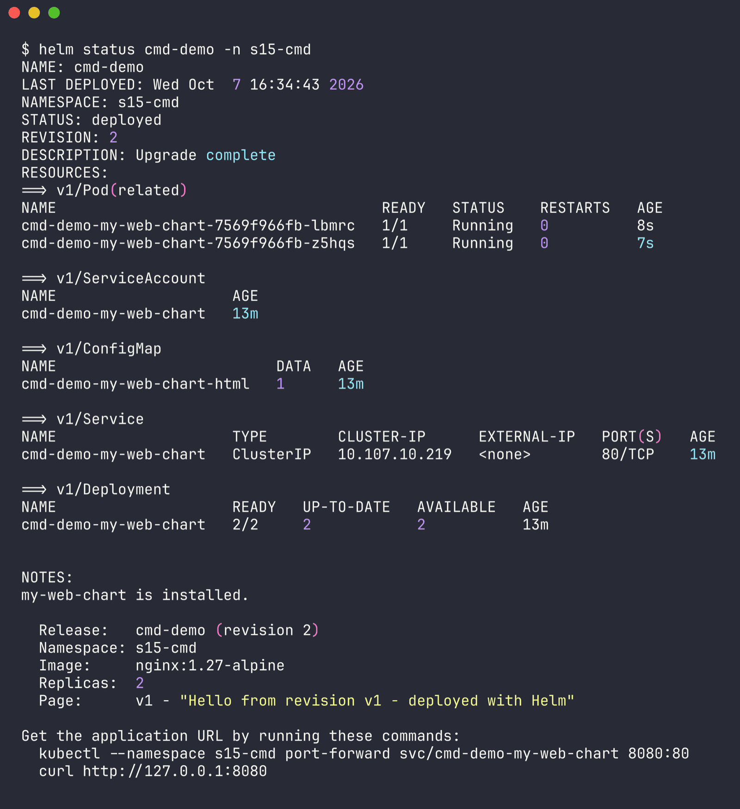

### helm get values

Values used by the release. Without `--all` it only shows what *I* supplied; with `--all` it shows the full merged result.

```bash
$ helm get values cmd-demo -n s15-cmd
USER-SUPPLIED VALUES:
null

$ helm get values cmd-demo -n s15-cmd --all
COMPUTED VALUES:
affinity: {}
fullnameOverride: ""
image:
  pullPolicy: IfNotPresent
  repository: nginx
  tag: ""
...
page:
  color: '#2b6cb0'
...
```

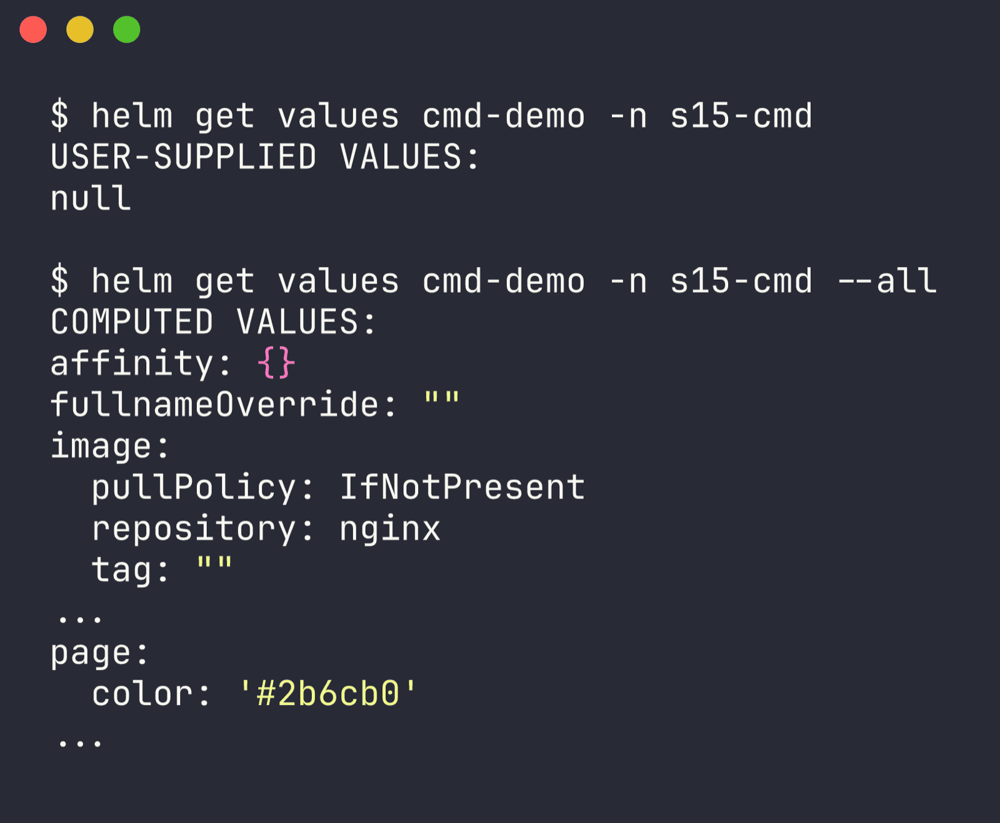

### helm get manifest

The exact rendered YAML that Helm applied for this revision ([outputs/09-helm-get-manifest.txt](outputs/09-helm-get-manifest.txt)).

```bash
$ helm get manifest cmd-demo -n s15-cmd
---
# Source: my-web-chart/templates/serviceaccount.yaml
apiVersion: v1
kind: ServiceAccount
metadata:
  name: cmd-demo-my-web-chart
  labels:
    helm.sh/chart: my-web-chart-0.1.0
    app.kubernetes.io/name: my-web-chart
    app.kubernetes.io/instance: cmd-demo
    app.kubernetes.io/version: "1.27-alpine"
    app.kubernetes.io/managed-by: Helm
...
```

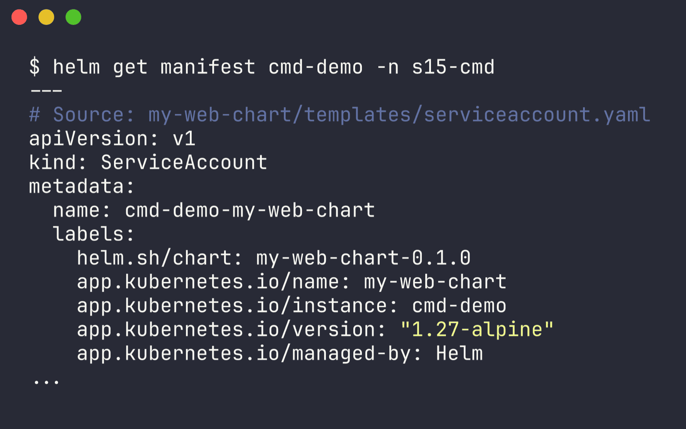

### helm get notes

Re-prints the rendered NOTES.txt.

```bash
$ helm get notes cmd-demo -n s15-cmd
NOTES:
my-web-chart is installed.

  Release:   cmd-demo (revision 2)
  Namespace: s15-cmd
  Image:     nginx:1.27-alpine
  Replicas:  2
  Page:      v1 - "Hello from revision v1 - deployed with Helm"
...
```

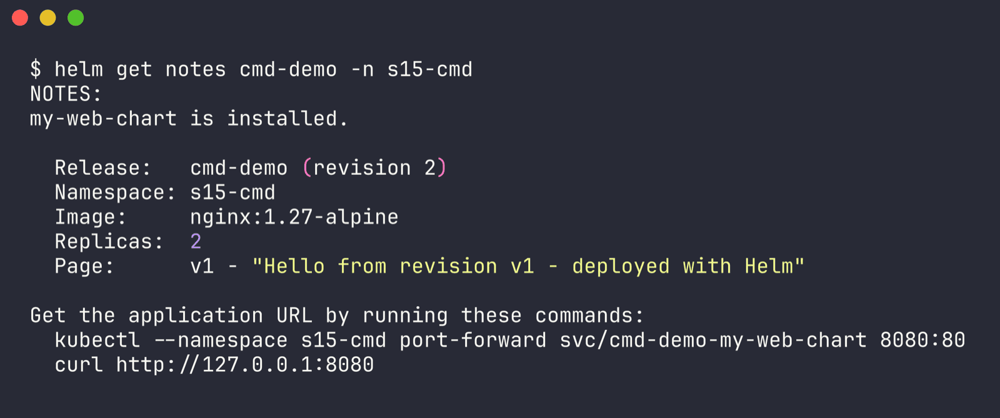

### helm get all

Everything at once: metadata, user values, computed values, hooks, manifest, notes (238 lines here - [outputs/11-helm-get-all.txt](outputs/11-helm-get-all.txt)).

```bash
$ helm get all cmd-demo -n s15-cmd
NAME: cmd-demo
LAST DEPLOYED: Wed Oct  7 16:34:43 2026
NAMESPACE: s15-cmd
STATUS: deployed
REVISION: 2
CHART: my-web-chart
VERSION: 0.1.0
APP_VERSION: 1.27-alpine
DESCRIPTION: Upgrade complete
USER-SUPPLIED VALUES:
null

COMPUTED VALUES:
...
HOOKS:
...
MANIFEST:
...
NOTES:
...
```

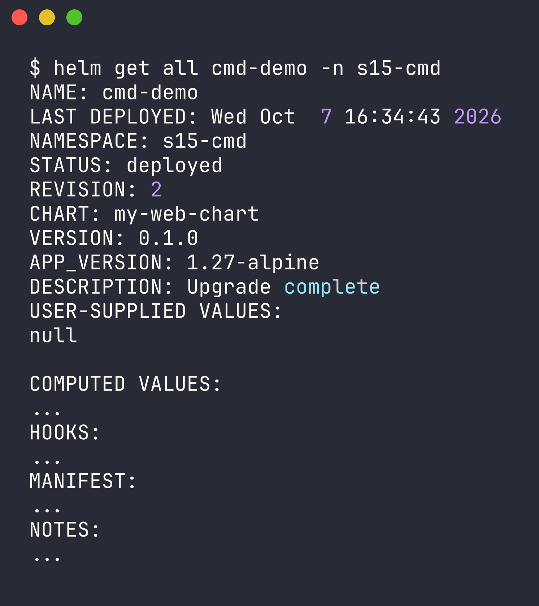

Bonus `helm get metadata` - note the `APPLY_METHOD: server-side apply` line, that's new in Helm 4:

```bash
$ helm get metadata cmd-demo -n s15-cmd
NAME: cmd-demo
CHART: my-web-chart
VERSION: 0.1.0
APP_VERSION: 1.27-alpine
ANNOTATIONS: 
LABELS: modifiedAt=1791370460,name=cmd-demo,owner=helm,status=deployed,version=2
DEPENDENCIES: 
NAMESPACE: s15-cmd
REVISION: 2
STATUS: deployed
DEPLOYED_AT: 2026-10-07T16:34:43+05:30
APPLY_METHOD: server-side apply
```

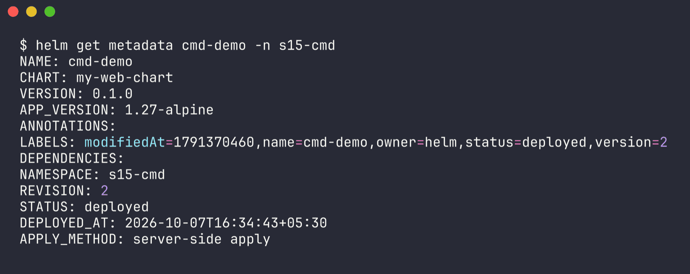

### helm upgrade

Applies a new chart version and/or new values as the next revision. `--reuse-values` keeps the previous revision's values and only merges in the new `--set`s ([outputs/12-upgrade-history-rollback.txt](outputs/12-upgrade-history-rollback.txt)).

```bash
$ helm upgrade cmd-demo ./my-web-chart -n s15-cmd --reuse-values --set replicaCount=3 --set page.message="scaled via --set" --wait --timeout 180s
Release "cmd-demo" has been upgraded. Happy Helming!
NAME: cmd-demo
LAST DEPLOYED: Wed Oct  7 16:34:57 2026
NAMESPACE: s15-cmd
STATUS: deployed
REVISION: 3
DESCRIPTION: Upgrade complete
NOTES:
...
  Replicas:  3
  Page:      v1 - "scaled via --set"

$ helm get values cmd-demo -n s15-cmd
USER-SUPPLIED VALUES:
page:
  message: scaled via --set
replicaCount: 3

$ kubectl get deploy -n s15-cmd
NAME                    READY   UP-TO-DATE   AVAILABLE   AGE
cmd-demo-my-web-chart   3/3     3            3           13m
```

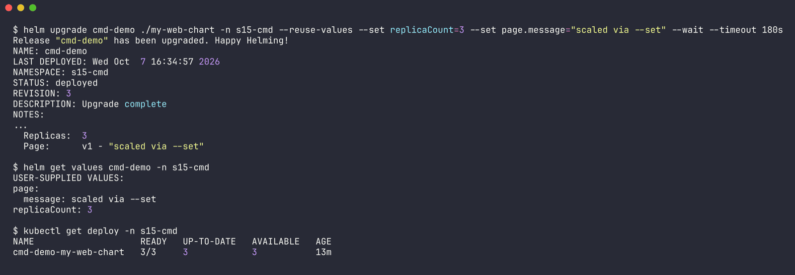

### helm history

All revisions of a release, with status and description.

```bash
$ helm history cmd-demo -n s15-cmd
REVISION	UPDATED                 	STATUS    	CHART             	APP VERSION	DESCRIPTION
1       	Wed Oct  7 16:21:20 2026	superseded	my-web-chart-0.1.0	1.27-alpine	Release "cmd-demo" failed: resource Deployment/s15-cmd/cmd-demo-my-web-chart not ready. status: InProgress, message: Available: ...
2       	Wed Oct  7 16:34:43 2026	superseded	my-web-chart-0.1.0	1.27-alpine	Upgrade complete
3       	Wed Oct  7 16:34:57 2026	deployed  	my-web-chart-0.1.0	1.27-alpine	Upgrade complete
```

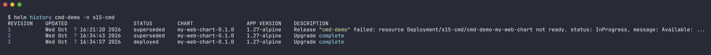

The failed install from earlier is still there as revision 1 - history never forgets.

### helm rollback

Re-applies an older revision's stored manifest **as a new revision**.

```bash
$ helm rollback cmd-demo 2 -n s15-cmd --wait --timeout 180s
Rollback was a success! Happy Helming!

$ helm history cmd-demo -n s15-cmd
REVISION	UPDATED                 	STATUS    	CHART             	APP VERSION	DESCRIPTION
...
3       	Wed Oct  7 16:34:57 2026	superseded	my-web-chart-0.1.0	1.27-alpine	Upgrade complete
4       	Wed Oct  7 16:35:01 2026	deployed  	my-web-chart-0.1.0	1.27-alpine	Rollback to 2

$ kubectl get deploy -n s15-cmd
NAME                    READY   UP-TO-DATE   AVAILABLE   AGE
cmd-demo-my-web-chart   2/2     2            2           13m
```

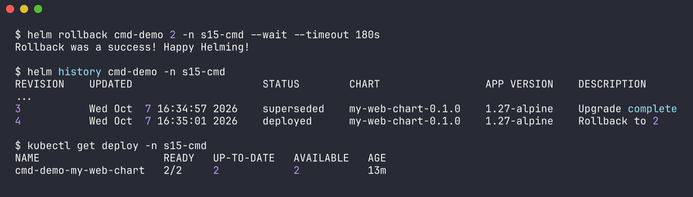

Back to 2 replicas. And where all of this lives - one Secret per revision:

```bash
$ kubectl get secrets -n s15-cmd -l owner=helm
NAME                             TYPE                 DATA   AGE
sh.helm.release.v1.cmd-demo.v1   helm.sh/release.v1   1      13m
sh.helm.release.v1.cmd-demo.v2   helm.sh/release.v1   1      29s
sh.helm.release.v1.cmd-demo.v3   helm.sh/release.v1   1      16s
sh.helm.release.v1.cmd-demo.v4   helm.sh/release.v1   1      12s
```

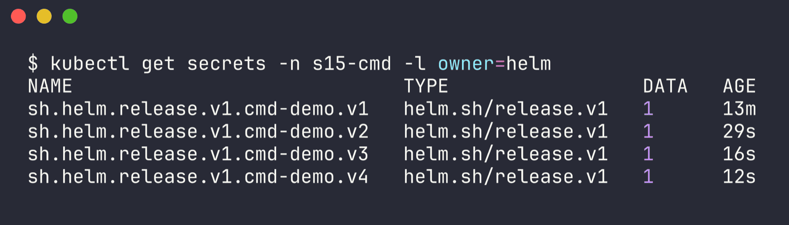

### helm test

Runs the pods annotated `helm.sh/hook: test` (the chart's `tests/test-connection.yaml`, a busybox `wget` against the Service). First attempt timed out because busybox was still being pulled on the busy cluster ([outputs/13-helm-test.txt](outputs/13-helm-test.txt)); second run ([outputs/13b-helm-test-retry.txt](outputs/13b-helm-test-retry.txt)):

```bash
$ helm test cmd-demo -n s15-cmd --timeout 180s --logs
...
TEST SUITE:     cmd-demo-my-web-chart-test-connection
Last Started:   Wed Oct  7 16:56:31 2026
Last Completed: Wed Oct  7 16:57:51 2026
Phase:          Succeeded

POD LOGS: cmd-demo-my-web-chart-test-connection (wget)
Connecting to cmd-demo-my-web-chart:80 (10.107.10.219:80)
saving to 'index.html'
index.html           100% |********************************|   521  0:00:00 ETA
'index.html' saved
```

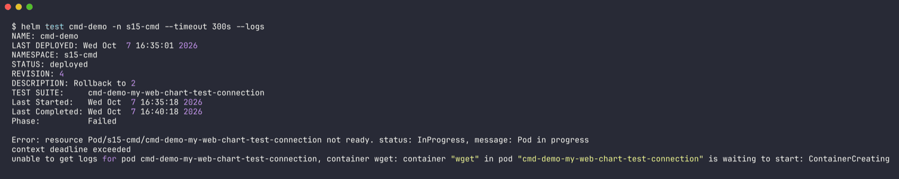

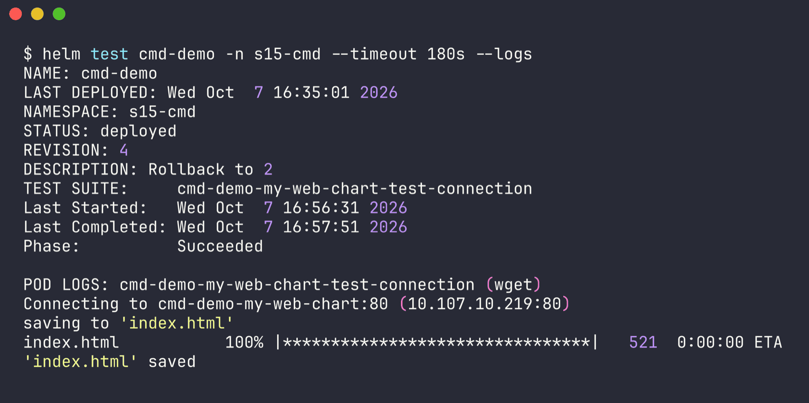

### helm uninstall

Deletes everything the release created. With `--keep-history` the release record stays around (status `uninstalled`) so you could still look at its history ([outputs/17-helm-uninstall.txt](outputs/17-helm-uninstall.txt)).

```bash
$ helm uninstall cmd-demo -n s15-cmd --keep-history
release "cmd-demo" uninstalled

$ helm list -n s15-cmd
NAME    	NAMESPACE	REVISION	UPDATED                             	STATUS     	CHART             	APP VERSION
cmd-demo	s15-cmd  	4       	2026-10-07 16:35:01.422181 +0530 IST	uninstalled	my-web-chart-0.1.0	1.27-alpine

$ helm history cmd-demo -n s15-cmd
REVISION	UPDATED                 	STATUS     	CHART             	APP VERSION	DESCRIPTION
1       	Wed Oct  7 16:21:20 2026	superseded 	my-web-chart-0.1.0	1.27-alpine	Release "cmd-demo" failed: ...
2       	Wed Oct  7 16:34:43 2026	superseded 	my-web-chart-0.1.0	1.27-alpine	Upgrade complete
3       	Wed Oct  7 16:34:57 2026	superseded 	my-web-chart-0.1.0	1.27-alpine	Upgrade complete
4       	Wed Oct  7 16:35:01 2026	uninstalled	my-web-chart-0.1.0	1.27-alpine	Uninstallation complete

$ helm uninstall cmd-demo -n s15-cmd
release "cmd-demo" uninstalled

$ kubectl get all,cm,secret -n s15-cmd
NAME                                         READY   STATUS        RESTARTS   AGE
pod/cmd-demo-my-web-chart-7569f966fb-qz2cz   1/1     Terminating   0          25m
pod/cmd-demo-my-web-chart-7569f966fb-vpd5l   1/1     Terminating   0          25m
pod/cmd-demo-my-web-chart-test-connection    0/1     Completed     0          4m7s

NAME                         DATA   AGE
configmap/kube-root-ca.crt   1      39m
```

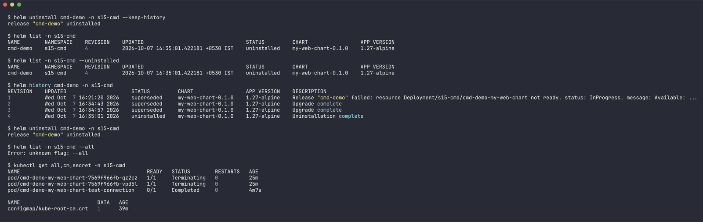

Second uninstall removed the kept history too (the helm Secrets are gone). Gotcha: the **test pod is a hook**, not part of the release manifest, so uninstall leaves it behind - I deleted it with kubectl.

### helm repo add / list / update / remove

Chart repositories are just an HTTP server with an `index.yaml`. ([outputs/14-helm-repo.txt](outputs/14-helm-repo.txt), [outputs/15-helm-search.txt](outputs/15-helm-search.txt), [outputs/18-helm-repo-remove.txt](outputs/18-helm-repo-remove.txt))

```bash
$ helm repo list
no repositories to show

$ helm repo add bitnami https://charts.bitnami.com/bitnami
Error: looks like "https://charts.bitnami.com/bitnami" is not a valid chart repository or cannot be reached: context deadline exceeded (Client.Timeout or context cancellation while reading body)

$ helm repo add podinfo https://stefanprodan.github.io/podinfo
"podinfo" has been added to your repositories

$ helm repo add ingress-nginx https://kubernetes.github.io/ingress-nginx
"ingress-nginx" has been added to your repositories

$ helm repo list
NAME         	URL
podinfo      	https://stefanprodan.github.io/podinfo
ingress-nginx	https://kubernetes.github.io/ingress-nginx

$ helm repo update
Hang tight while we grab the latest from your chart repositories...
...Successfully got an update from the "podinfo" chart repository
...Successfully got an update from the "ingress-nginx" chart repository
Update Complete. ⎈Happy Helming!⎈

$ helm repo remove ingress-nginx
"ingress-nginx" has been removed from your repositories

$ helm repo list
NAME   	URL
podinfo	https://stefanprodan.github.io/podinfo
```

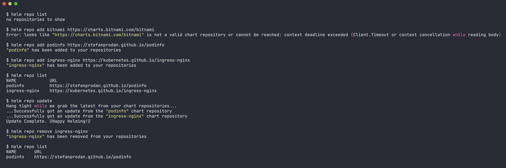

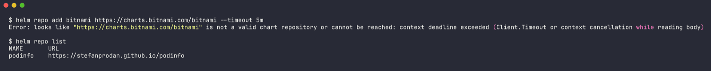

About bitnami: the classic `index.yaml` is huge and my network was saturated by the other labs' image pulls, so `repo add` timed out twice (even with `--timeout 5m`, [outputs/14b-helm-repo-bitnami-retry.txt](outputs/14b-helm-repo-bitnami-retry.txt)). Bitnami publishes its charts as OCI artifacts now anyway, and that worked straight away without adding any repo ([outputs/16-helm-oci-bitnami.txt](outputs/16-helm-oci-bitnami.txt)):

```bash
$ helm show chart oci://registry-1.docker.io/bitnamicharts/nginx
Pulled: registry-1.docker.io/bitnamicharts/nginx:25.2.1
Digest: sha256:db7231dda6fab9ff10448e80ecaf1186917e6edffb10e9943dc56c77931e709f
...
apiVersion: v2
appVersion: 1.31.6
...
name: nginx
...
version: 25.2.1
```

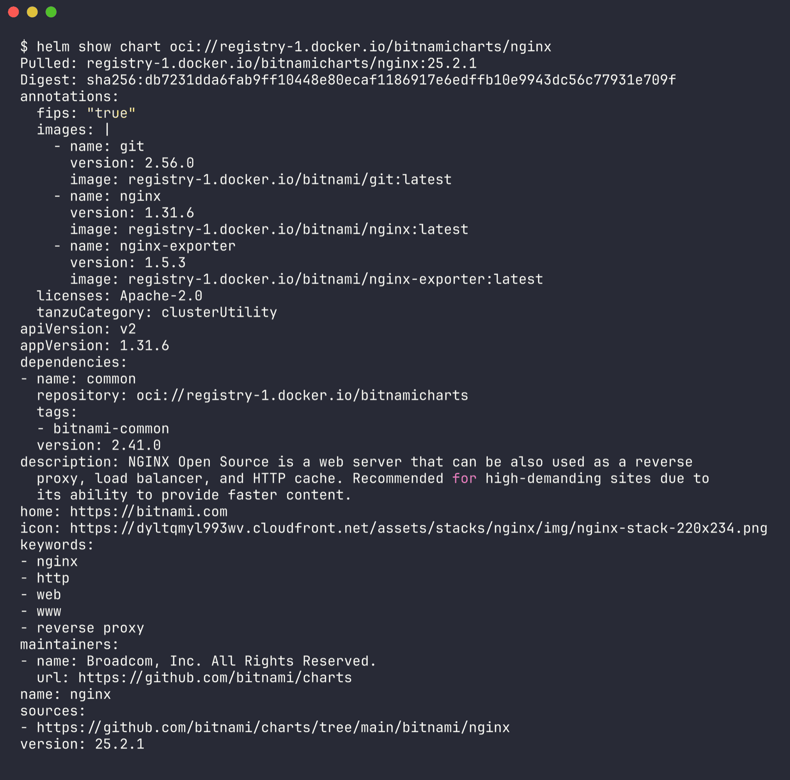

### helm search repo / hub

`search repo` searches the repos you added (local cache from `repo update`). `search hub` searches Artifact Hub online.

```bash
$ helm search repo podinfo
NAME           	CHART VERSION	APP VERSION	DESCRIPTION
podinfo/podinfo	6.15.0       	6.15.0     	Podinfo Helm chart for Kubernetes

$ helm search repo podinfo --versions
NAME           	CHART VERSION	APP VERSION	DESCRIPTION
podinfo/podinfo	6.15.0       	6.15.0     	Podinfo Helm chart for Kubernetes
podinfo/podinfo	6.14.1       	6.14.1     	Podinfo Helm chart for Kubernetes
podinfo/podinfo	6.14.0       	6.14.0     	Podinfo Helm chart for Kubernetes
...

$ helm search hub nginx --max-col-width 50
URL                                               	CHART VERSION  	APP VERSION	DESCRIPTION
https://artifacthub.io/packages/helm/cloudpirat...	0.16.12        	1.31.6     	Nginx is a high-performance HTTP server and rev...
https://artifacthub.io/packages/helm/quench-ngi...	0.0.15         	1.30.5     	High-performance web server, reverse proxy, and...
https://artifacthub.io/packages/helm/krakazyabr...	1.0.0          	1.19.0     	Nginx Helm chart for Kubernetes
https://artifacthub.io/packages/helm/dhinesh/nginx	25.2.1         	1.31.6     	NGINX Open Source is a web server that can be a...
https://artifacthub.io/packages/helm/bitnami/nginx	25.2.1         	1.31.6     	NGINX Open Source is a web server that can be a...
...
```

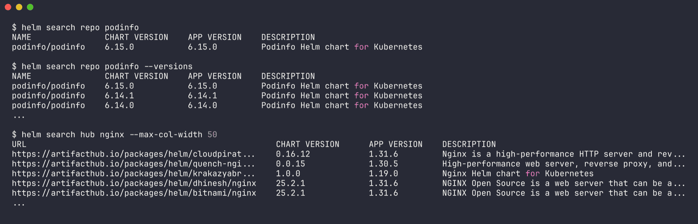

At the very end I removed `podinfo` as well so I didn't leave anything in the shared helm config ([outputs/25-final-cleanup.txt](outputs/25-final-cleanup.txt)).

### Quick reference

| Command | What it does |
|---|---|
| `helm create <dir>` | scaffold a new chart |
| `helm lint <chart>` | static checks, non-zero exit on errors |
| `helm template <rel> <chart>` | render YAML locally, no cluster |
| `helm install <rel> <chart> --dry-run=server` | full install simulation against the API server |
| `helm install <rel> <chart>` | create release, revision 1 |
| `helm list [-A]` | list releases |
| `helm status <rel>` | state + resources + notes |
| `helm get values/manifest/notes/hooks/metadata/all <rel>` | inspect what a revision contains (`--revision N` for older ones) |
| `helm upgrade <rel> <chart> [-f/--set/--reuse-values]` | new revision with new chart/values |
| `helm history <rel>` | all revisions |
| `helm rollback <rel> <N>` | re-apply revision N as a new revision |
| `helm test <rel>` | run test hook pods |
| `helm uninstall <rel> [--keep-history]` | delete release |
| `helm repo add/list/update/remove` | manage chart repositories |
| `helm search repo/hub <term>` | find charts locally / on Artifact Hub |

---

## Task 2 - Rollback workflow

Release `web` in namespace `s15`. Values files:

- revision 1 - defaults (`values.yaml`): nginx 1.27-alpine, 2 replicas, page "v1"
- revision 2 - `values-v2.yaml`: nginx 1.28-alpine, 3 replicas, page "v2", green colour
- revision 3 - `values-v2.yaml` + `values-v3-broken.yaml`: image tag `9.99-does-not-exist`, page "v3"
- then `helm rollback web 2`

```
 install v1 ──> verify ──> upgrade v2 ──> verify ──> upgrade v3 (broken) ──> verify ──> rollback 2 ──> verify
  rev 1                     rev 2                     rev 3                               rev 4 = copy of rev 2
```

Every "verify" step is the same small script: `kubectl get deploy,pods`, then `kubectl port-forward svc/web-my-web-chart 18515:80` + `curl` (grep the message / version / revision lines + nginx `Server` header), then `helm history`.

### Stage 1 - install v1

[outputs/20-rollback-stage1-install-v1.txt](outputs/20-rollback-stage1-install-v1.txt)

```bash
$ helm install web ./my-web-chart -n s15 --create-namespace --wait --timeout 300s
NAME: web
LAST DEPLOYED: Wed Oct  7 16:55:33 2026
NAMESPACE: s15
STATUS: deployed
REVISION: 1
DESCRIPTION: Install complete
...
$ kubectl get deploy,pods -n s15 -o wide
NAME               READY   UP-TO-DATE   AVAILABLE   AGE   CONTAINERS     IMAGES              SELECTOR
web-my-web-chart   2/2     2            2           11s   my-web-chart   nginx:1.27-alpine   app.kubernetes.io/instance=web,app.kubernetes.io/name=my-web-chart
NAME                               STATUS    READY   IMAGE               WAITING
web-my-web-chart-6bd988499-nfc2f   Running   true    nginx:1.27-alpine   <none>
web-my-web-chart-6bd988499-zrpbq   Running   true    nginx:1.27-alpine   <none>

$ curl -s http://127.0.0.1:18515 | grep -E 'message|version|revision'
  <p id="message">Hello from revision v1 - deployed with Helm</p>
  <p>page version: <b>v1</b></p>
  <p>release: web | revision: 1 | chart: my-web-chart-0.1.0</p>
$ curl -sI http://127.0.0.1:18515 | grep -i server
Server: nginx/1.27.5

$ helm history web -n s15
REVISION	UPDATED                 	STATUS  	CHART             	APP VERSION	DESCRIPTION
1       	Wed Oct  7 16:55:33 2026	deployed	my-web-chart-0.1.0	1.27-alpine	Install complete
```

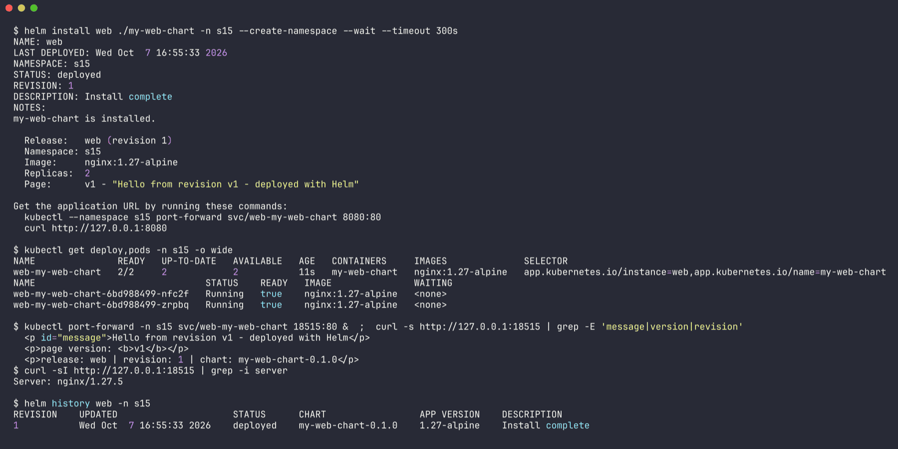

### Stage 2 - upgrade to v2

[outputs/21-rollback-stage2-upgrade-v2.txt](outputs/21-rollback-stage2-upgrade-v2.txt)

```bash
$ helm upgrade web ./my-web-chart -n s15 -f values-v2.yaml --wait --timeout 300s
Release "web" has been upgraded. Happy Helming!
NAME: web
LAST DEPLOYED: Wed Oct  7 16:55:52 2026
NAMESPACE: s15
STATUS: deployed
REVISION: 2
DESCRIPTION: Upgrade complete
NOTES:
my-web-chart is installed.

  Release:   web (revision 2)
  Namespace: s15
  Image:     nginx:1.28-alpine
  Replicas:  3
  Page:      v2 - "Hello from revision v2 - upgraded with helm upgrade"
...
$ kubectl get deploy,pods -n s15 -o wide
NAME               READY   UP-TO-DATE   AVAILABLE   AGE   CONTAINERS     IMAGES              SELECTOR
web-my-web-chart   3/3     3            3           23s   my-web-chart   nginx:1.28-alpine   ...
NAME                                STATUS    READY   IMAGE               WAITING
web-my-web-chart-6bd988499-c86km    Running   true    nginx:1.27-alpine   <none>
web-my-web-chart-6bd988499-nfc2f    Running   true    nginx:1.27-alpine   <none>
web-my-web-chart-75ffc88b54-5cmz6   Running   true    nginx:1.28-alpine   <none>
web-my-web-chart-75ffc88b54-fj85f   Running   true    nginx:1.28-alpine   <none>
web-my-web-chart-75ffc88b54-ghpbq   Running   true    nginx:1.28-alpine   <none>

$ curl -s http://127.0.0.1:18515 | grep -E 'message|version|revision'
  <p id="message">Hello from revision v2 - upgraded with helm upgrade</p>
  <p>page version: <b>v2</b></p>
  <p>release: web | revision: 2 | chart: my-web-chart-0.1.0</p>
$ curl -sI http://127.0.0.1:18515 | grep -i server
Server: nginx/1.28.3

$ helm history web -n s15
REVISION	UPDATED                 	STATUS    	CHART             	APP VERSION	DESCRIPTION
1       	Wed Oct  7 16:55:33 2026	superseded	my-web-chart-0.1.0	1.27-alpine	Install complete
2       	Wed Oct  7 16:55:52 2026	deployed  	my-web-chart-0.1.0	1.27-alpine	Upgrade complete
```

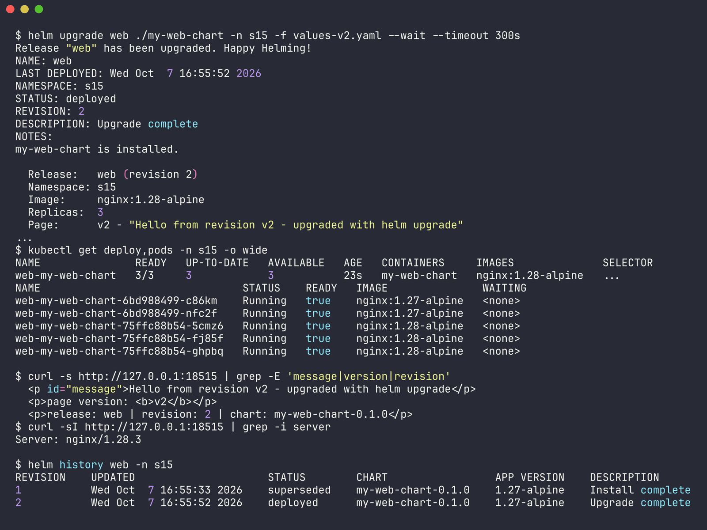

The two `1.27-alpine` pods in the list are the old ReplicaSet still shutting down - the deployment itself is already 3/3 on 1.28. Also: the `APP VERSION` column still says 1.27-alpine because it comes from `Chart.yaml`, not from the image I overrode.

In-cluster check too, from a throwaway busybox pod hitting the Service DNS name:

```bash
$ kubectl run wget-check -n s15 --image=busybox:1.36 --rm -i --restart=Never -- wget -qO- http://web-my-web-chart.s15.svc.cluster.local | grep message
  <p id="message">Hello from revision v2 - upgraded with helm upgrade</p>
```

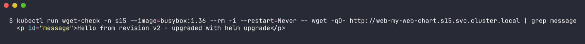

### Stage 3 - upgrade to v3 (deliberately broken)

No `--wait` this time, which is exactly how people get burned ([outputs/22-rollback-stage3-upgrade-v3-broken.txt](outputs/22-rollback-stage3-upgrade-v3-broken.txt)):

```bash
$ helm upgrade web ./my-web-chart -n s15 -f values-v2.yaml -f values-v3-broken.yaml
Release "web" has been upgraded. Happy Helming!
NAME: web
LAST DEPLOYED: Wed Oct  7 16:56:08 2026
NAMESPACE: s15
STATUS: deployed
REVISION: 3
DESCRIPTION: Upgrade complete
NOTES:
...
  Image:     nginx:9.99-does-not-exist
...
```

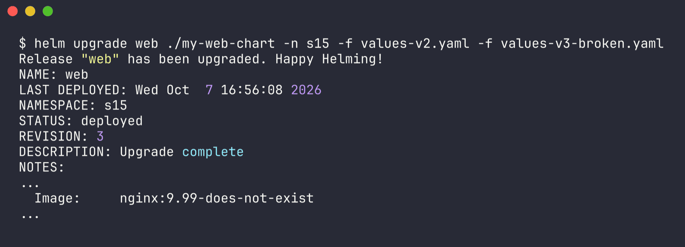

Helm says `deployed` and "Happy Helming" - it only checked that the API server accepted the objects. A couple of minutes later ([outputs/22b-rollback-stage3-after-wait.txt](outputs/22b-rollback-stage3-after-wait.txt)):

```bash
$ kubectl get deploy,pods -n s15 -o wide
NAME               READY   UP-TO-DATE   AVAILABLE   AGE     CONTAINERS     IMAGES                      SELECTOR
web-my-web-chart   3/3     1            3           2m18s   my-web-chart   nginx:9.99-does-not-exist   ...
NAME                                STATUS    READY   IMAGE                       WAITING
web-my-web-chart-75ffc88b54-5cmz6   Running   true    nginx:1.28-alpine           <none>
web-my-web-chart-75ffc88b54-fj85f   Running   true    nginx:1.28-alpine           <none>
web-my-web-chart-75ffc88b54-ghpbq   Running   true    nginx:1.28-alpine           <none>
web-my-web-chart-7fc58cb99-bfm92    Pending   false   nginx:9.99-does-not-exist   ErrImagePull

$ kubectl describe pod -n s15 -l pod-template-hash=7fc58cb99 | tail -8
...
  Warning  Failed     5s    kubelet            spec.containers{my-web-chart}: Failed to pull image "nginx:9.99-does-not-exist": rpc error: code = NotFound desc = failed to pull and unpack image "docker.io/library/nginx:9.99-does-not-exist": failed to resolve reference "docker.io/library/nginx:9.99-does-not-exist": docker.io/library/nginx:9.99-does-not-exist: not found
  Warning  Failed     5s    kubelet            spec.containers{my-web-chart}: Error: ErrImagePull
  Normal   BackOff    4s    kubelet            spec.containers{my-web-chart}: Back-off pulling image "nginx:9.99-does-not-exist"
  Warning  Failed     4s    kubelet            spec.containers{my-web-chart}: Error: ImagePullBackOff

$ curl -s http://127.0.0.1:18515 | grep -E 'message|version|revision'
  <p id="message">Hello from revision v3 - this one should never be served</p>
  <p>page version: <b>v3</b></p>
  <p>release: web | revision: 3 | chart: my-web-chart-0.1.0</p>
$ curl -sI http://127.0.0.1:18515 | grep -i server
Server: nginx/1.28.3

$ helm history web -n s15
REVISION	UPDATED                 	STATUS    	CHART             	APP VERSION	DESCRIPTION
1       	Wed Oct  7 16:55:33 2026	superseded	my-web-chart-0.1.0	1.27-alpine	Install complete
2       	Wed Oct  7 16:55:52 2026	superseded	my-web-chart-0.1.0	1.27-alpine	Upgrade complete
3       	Wed Oct  7 16:56:08 2026	deployed  	my-web-chart-0.1.0	1.27-alpine	Upgrade complete
```

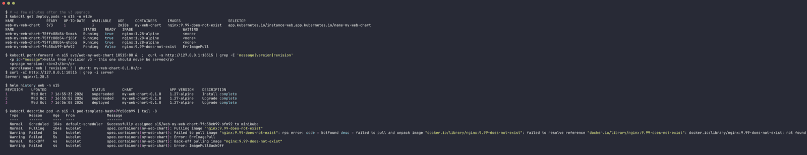

Things I noticed here:

- The rolling update protected me: the new pod can't start, so the 3 old v2 pods are never killed (`maxUnavailable` 25%) and the site stays up.
- But look at the curl - **the old nginx 1.28 pods are serving the v3 page**. The ConfigMap is a separate object that Helm updated in place, and kubelet syncs ConfigMap volumes into running pods after a short delay. Right after the upgrade (45 s in) curl still showed v2; a couple of minutes later it showed v3. So a "broken" release half-leaked: new content, old image. The checksum annotation only helps when the new pods can actually start. Fix would be to name the ConfigMap per content hash (immutable configmaps) - noted, not done.
- `helm history` happily says revision 3 is `deployed`. Helm status != app health.

### Stage 4 - rollback to revision 2

[outputs/23-rollback-stage4-rollback-to-2.txt](outputs/23-rollback-stage4-rollback-to-2.txt)

```bash
$ helm rollback web 2 -n s15 --wait --timeout 300s
Rollback was a success! Happy Helming!

$ kubectl get deploy,pods -n s15 -o wide
NAME               READY   UP-TO-DATE   AVAILABLE   AGE     CONTAINERS     IMAGES              SELECTOR
web-my-web-chart   3/3     3            3           2m42s   my-web-chart   nginx:1.28-alpine   ...
NAME                                STATUS    READY   IMAGE               WAITING
web-my-web-chart-75ffc88b54-5cmz6   Running   true    nginx:1.28-alpine   <none>
web-my-web-chart-75ffc88b54-fj85f   Running   true    nginx:1.28-alpine   <none>
web-my-web-chart-75ffc88b54-ghpbq   Running   true    nginx:1.28-alpine   <none>

$ curl -s http://127.0.0.1:18515 | grep -E 'message|version|revision'
  <p id="message">Hello from revision v2 - upgraded with helm upgrade</p>
  <p>page version: <b>v2</b></p>
  <p>release: web | revision: 2 | chart: my-web-chart-0.1.0</p>
$ curl -sI http://127.0.0.1:18515 | grep -i server
Server: nginx/1.28.3

$ helm history web -n s15
REVISION	UPDATED                 	STATUS    	CHART             	APP VERSION	DESCRIPTION
1       	Wed Oct  7 16:55:33 2026	superseded	my-web-chart-0.1.0	1.27-alpine	Install complete
2       	Wed Oct  7 16:55:52 2026	superseded	my-web-chart-0.1.0	1.27-alpine	Upgrade complete
3       	Wed Oct  7 16:56:08 2026	superseded	my-web-chart-0.1.0	1.27-alpine	Upgrade complete
4       	Wed Oct  7 16:58:00 2026	deployed  	my-web-chart-0.1.0	1.27-alpine	Rollback to 2

$ helm get values web -n s15
USER-SUPPLIED VALUES:
image:
  tag: 1.28-alpine
page:
  color: '#2f855a'
  ...
  message: Hello from revision v2 - upgraded with helm upgrade
  version: v2
replicaCount: 3

$ helm get manifest web -n s15 --revision 4 | grep image:
          image: "nginx:1.28-alpine"
```

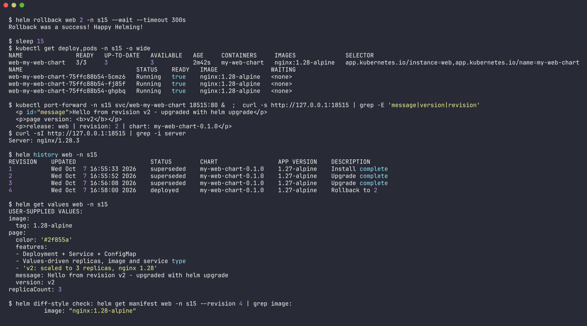

Observations:

- The broken pod is gone and the same three `75ffc88b54` pods (the revision-2 ReplicaSet) are still serving - Kubernetes just scaled the bad ReplicaSet back to 0.
- Rollback = **new revision 4**, which is a copy of revision 2. History is never rewritten.
- The page says `revision: 2` even though the release is now at revision 4. Rollback re-applies the *stored manifest* of rev 2, it doesn't re-render the templates - so `.Release.Revision` is frozen at 2 inside it. Nice proof of how rollback works.

### Bonus - automatic rollback (`--rollback-on-failure`)

The class notes use `--atomic`. In Helm 4 that flag is deprecated and renamed ([outputs/24-rollback-on-failure.txt](outputs/24-rollback-on-failure.txt)):

```bash
$ helm upgrade web ./my-web-chart -n s15 -f values-v2.yaml -f values-v3-broken.yaml --atomic --timeout 60s
Flag --atomic has been deprecated, use --rollback-on-failure instead
level=WARN msg="upgrade failed" name=web error="resource Deployment/s15/web-my-web-chart not ready. status: InProgress, message: Updated: 1/3\ncontext deadline exceeded"
Error: UPGRADE FAILED: release web failed, and has been rolled back due to rollback-on-failure being set: resource Deployment/s15/web-my-web-chart not ready. status: InProgress, message: Updated: 1/3
context deadline exceeded

$ helm upgrade web ./my-web-chart -n s15 -f values-v2.yaml -f values-v3-broken.yaml --rollback-on-failure --timeout 60s
level=WARN msg="upgrade failed" name=web error="resource Deployment/s15/web-my-web-chart not ready. status: InProgress, message: Updated: 1/3\ncontext deadline exceeded"
Error: UPGRADE FAILED: release web failed, and has been rolled back due to rollback-on-failure being set: resource Deployment/s15/web-my-web-chart not ready. status: InProgress, message: Updated: 1/3
context deadline exceeded

$ helm history web -n s15
REVISION	UPDATED                 	STATUS    	CHART             	APP VERSION	DESCRIPTION
...
4       	Wed Oct  7 16:58:00 2026	superseded	my-web-chart-0.1.0	1.27-alpine	Rollback to 2
5       	Wed Oct  7 16:58:28 2026	failed    	my-web-chart-0.1.0	1.27-alpine	Upgrade "web" failed: resource Deployment/s15/web-my-web-chart not ready. status: InProgress, message: Updated: ...
6       	Wed Oct  7 16:59:28 2026	superseded	my-web-chart-0.1.0	1.27-alpine	Rollback to 4
7       	Wed Oct  7 16:59:28 2026	failed    	my-web-chart-0.1.0	1.27-alpine	Upgrade "web" failed: resource Deployment/s15/web-my-web-chart not ready. status: InProgress, message: Updated: ...
8       	Wed Oct  7 17:00:28 2026	deployed  	my-web-chart-0.1.0	1.27-alpine	Rollback to 6
```

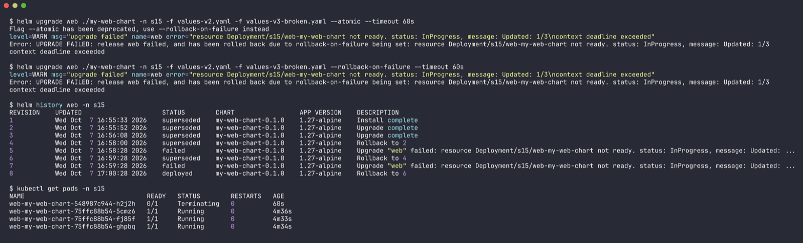

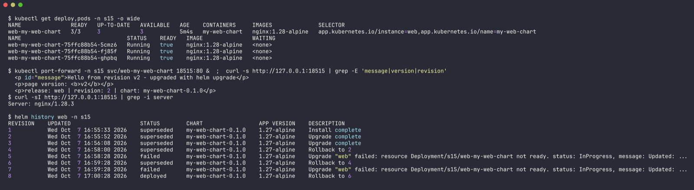

Each failed upgrade costs two revisions (the failed one + the automatic "Rollback to N"). After this the site was still on v2 ([outputs/24b-after-rollback-on-failure-verify.txt](outputs/24b-after-rollback-on-failure-verify.txt)). This is what I'd use in CI - nobody has to notice the broken release by hand.

Cleanup: `helm uninstall web -n s15 --wait` ([outputs/25-final-cleanup.txt](outputs/25-final-cleanup.txt)).

---

## Task 3 - Mini project (notes-chart)

Full write-up is in [mini-project/README.md](mini-project/README.md). Short version: I took the reference `notes-chart`, completed it with a `_helpers.tpl`, `NOTES.txt`, `.helmignore`, an HTML page ConfigMap with a `range` over notes, a checksum annotation and a configurable service type, then ran the whole lint -> template -> install -> upgrade to prod -> bad upgrade -> rollback -> uninstall flow on the cluster.

---

## How a chart is put together

(ties to the instructor notes 03-chart-structure, 04-chart-yaml, 05-values-yaml, 06-templates)

### Chart.yaml - who is this chart

```yaml
apiVersion: v2              # v2 = Helm 3+ chart format
name: my-web-chart
description: Small nginx web app whose HTML page comes from a ConfigMap (Session 15 - Helm, Ridaa Mirza)
type: application           # or "library" (only helpers, not installable)
version: 0.1.0              # version of the CHART - bump when templates change
appVersion: "1.27-alpine"   # version of the APP inside - just a label, also my default image tag
```

`version` vs `appVersion` confused me at first: `version` is the packaging (shows up as `my-web-chart-0.1.0` in `helm list`), `appVersion` is informational (the `APP VERSION` column). As seen in Task 2, overriding `image.tag` does not change `APP VERSION`.

### values.yaml - the defaults

Everything a user might want to change. Precedence, lowest to highest:

```
values.yaml in the chart  <  -f file1.yaml  <  -f file2.yaml  <  --set key=value
```

That's why `-f values-v2.yaml -f values-v3-broken.yaml` worked: v3 only overrides `image.tag` and the page text, everything else (3 replicas, colour...) still comes from v2.

### templates/ - what gets created

Every file in here is rendered with Go templates and sent to Kubernetes. Files starting with `_` (like `_helpers.tpl`) are not rendered as objects, and `NOTES.txt` is printed to the user instead of applied. `templates/tests/` holds hook pods for `helm test`.

### _helpers.tpl - reusable snippets

`define` creates a named template, `include` calls it. From my chart:

```yaml
{{- define "my-web-chart.fullname" -}}
...
{{- printf "%s-%s" .Release.Name $name | trunc 63 | trimSuffix "-" }}
...
{{- end }}

{{- define "my-web-chart.selectorLabels" -}}
app.kubernetes.io/name: {{ include "my-web-chart.name" . }}
app.kubernetes.io/instance: {{ .Release.Name }}
{{- end }}
```

Used as `name: {{ include "my-web-chart.fullname" . }}` and `{{- include "my-web-chart.labels" . | nindent 4 }}`. One definition, used by every object, so the Service selector and the Deployment labels can never drift apart. `include` (unlike `template`) returns a string, which is why it can be piped into `nindent`.

### NOTES.txt - message after install

Also a template, so it can branch on values. Mine prints a port-forward hint for ClusterIP, a NodePort URL for NodePort, ingress hosts when ingress is on:

```
{{- if .Values.ingress.enabled }}
  ...
{{- else if contains "NodePort" .Values.service.type }}
  export NODE_PORT=$(kubectl get ... services {{ include "my-web-chart.fullname" . }})
  ...
{{- else }}
  kubectl --namespace {{ .Release.Namespace }} port-forward svc/{{ include "my-web-chart.fullname" . }} 8080:{{ .Values.service.port }}
{{- end }}
```

### Templating cheat sheet (what I actually used)

| Syntax | Example in my charts | What it does |
|---|---|---|
| `{{ .Values.x }}` | `replicas: {{ .Values.replicaCount }}` | read a value |
| built-in objects | `.Release.Name`, `.Release.Namespace`, `.Release.Revision`, `.Chart.Name`, `.Chart.AppVersion` | info about the release/chart |
| `default` | `{{ .Values.image.tag \| default .Chart.AppVersion }}` | fallback if empty |
| `quote` | `APP_NAME: {{ .Values.app.name \| quote }}` | wrap in quotes (strings stay strings) |
| `include` + `nindent` | `{{- include "my-web-chart.labels" . \| nindent 4 }}` | call a helper and indent it |
| `if / else if / end` | `{{- if .Values.ingress.enabled -}}` | whole Ingress only if enabled |
| `and`, `eq` | `{{- if and (eq .Values.service.type "NodePort") .Values.service.nodePort }}` | combine conditions |
| `range` | `{{- range .Values.page.features }}<li>{{ . }}</li>{{- end }}` | loop over a list; `.` becomes the item |
| `range $i, $x` | `{{- range $i, $note := .Values.notes }}` (mini project) | loop with index |
| `with` | `{{- with .Values.nodeSelector }}` | only render if set, and change scope |
| `$` | `{{ include "my-web-chart.fullname" $ }}` inside a `range` | root context when `.` was rebound |
| `toYaml` | `{{- toYaml . \| nindent 12 }}` | dump a map from values as YAML |
| `sha256sum` | `checksum/config: {{ include (print $.Template.BasePath "/configmap.yaml") . \| sha256sum }}` | restart pods when config changes |
| `{{-` / `-}}` | everywhere | trim whitespace/newlines around the tag |

---

## Helm 3 (class notes) vs Helm 4 (what I ran) - differences I hit

| Thing | Class notes (Helm 3) | Helm 4.3.0 |
|---|---|---|
| auto rollback on failed upgrade | `--atomic` | `--rollback-on-failure` (`--atomic` still works but prints "deprecated") |
| dry run | `--dry-run` | `--dry-run=client` or `--dry-run=server` |
| `--wait` | boolean | strategy: `--wait` = `watcher` (kstatus-based), or `hookOnly` (default), `legacy` |
| apply method | client-side 3-way merge | server-side apply by default (`APPLY_METHOD: server-side apply` in `helm get metadata`) |
| `helm status --show-resources` | flag needed | flag removed, resources always shown |
| `helm list --all` | flag exists | `unknown flag: --all`; `helm list` showed my `--keep-history` uninstalled release by default |
| `helm create` | no httproute | also scaffolds `templates/httproute.yaml` |
| wait errors | "timed out waiting for the condition" | `resource Deployment/... not ready. status: InProgress, message: Available: 0/2` |

## Cleanup

```bash
helm uninstall web -n s15 --wait
helm uninstall notes-dev -n s15-notes --wait
helm repo remove podinfo
kubectl delete ns s15 s15-cmd s15-notes
```

```bash
$ helm list -A
NAME	NAMESPACE	REVISION	UPDATED	STATUS	CHART	APP VERSION

$ helm repo list
no repositories to show
```

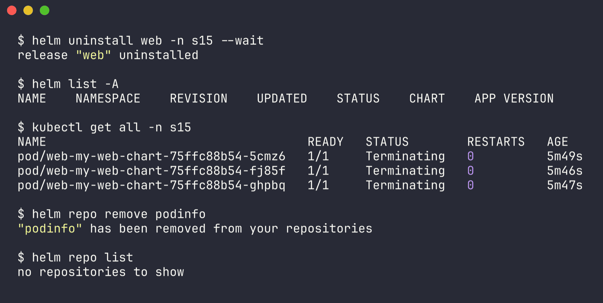

## What I learned

- Helm's value is not templating alone - it's the **release history**. Every revision is a Secret, so rollback is one command and audit is `helm history`.
- `deployed` means "the API server accepted it", not "the app works". Use `--wait` / `--rollback-on-failure` in anything automated.
- Rollback replays a stored manifest; it does not re-render. Proved by `.Release.Revision` staying at 2 after rolling back to 2.
- ConfigMaps updated in place leak into running pods even when the new pods never start. The checksum annotation handles restarts, but it doesn't make a failed rollout atomic.
- `helm template` + `helm lint` catch most mistakes before touching a cluster.
