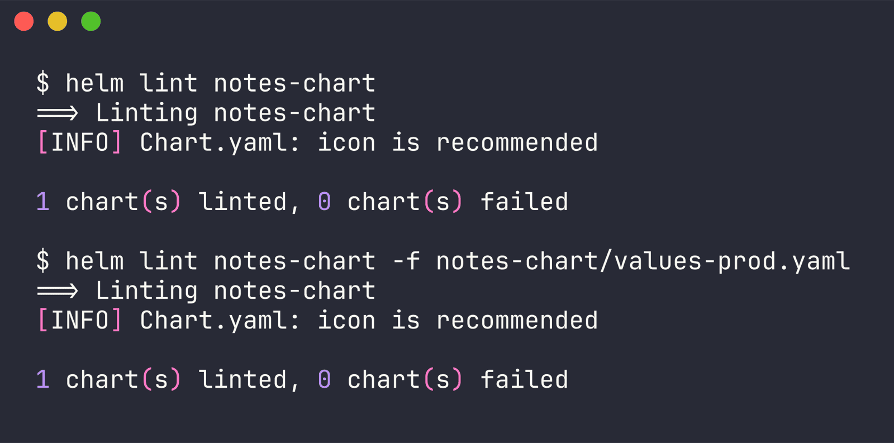
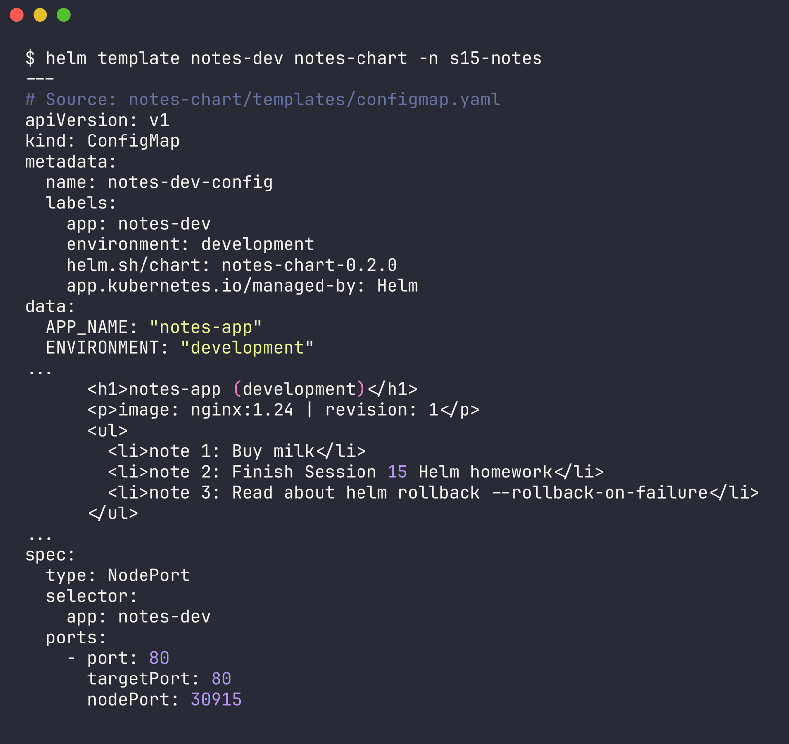
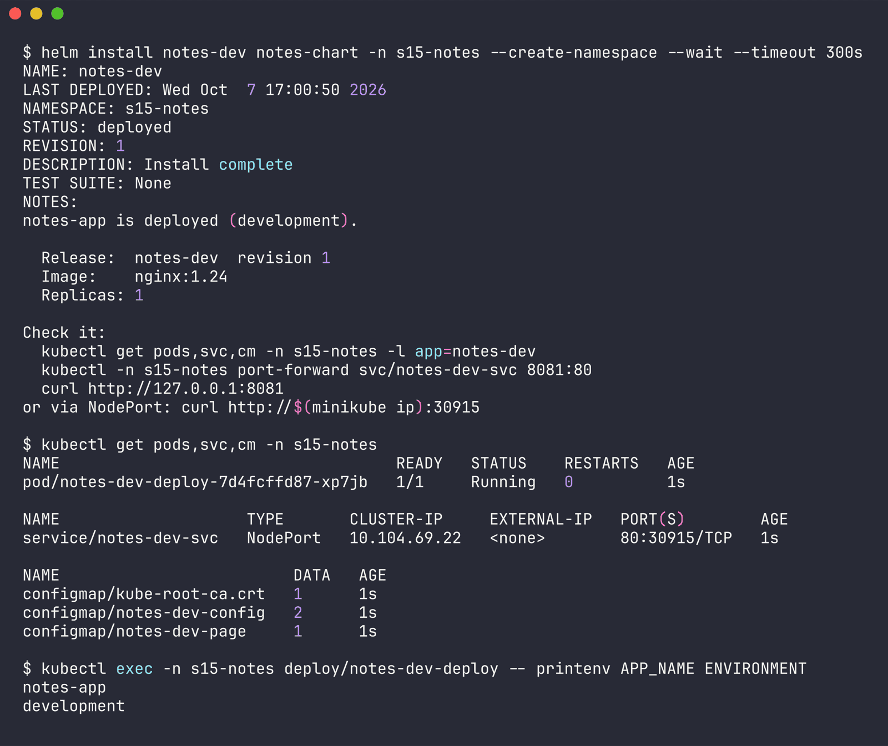
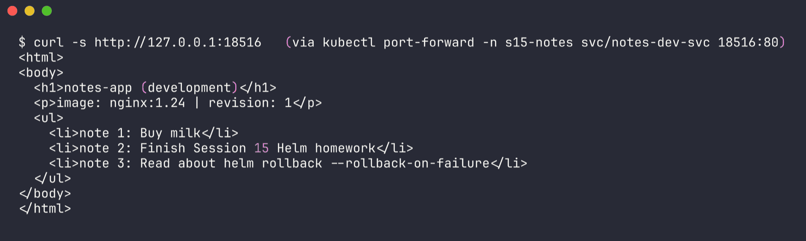
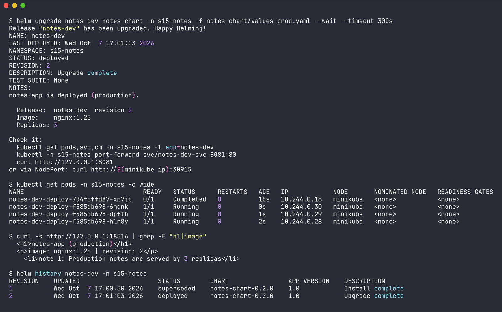
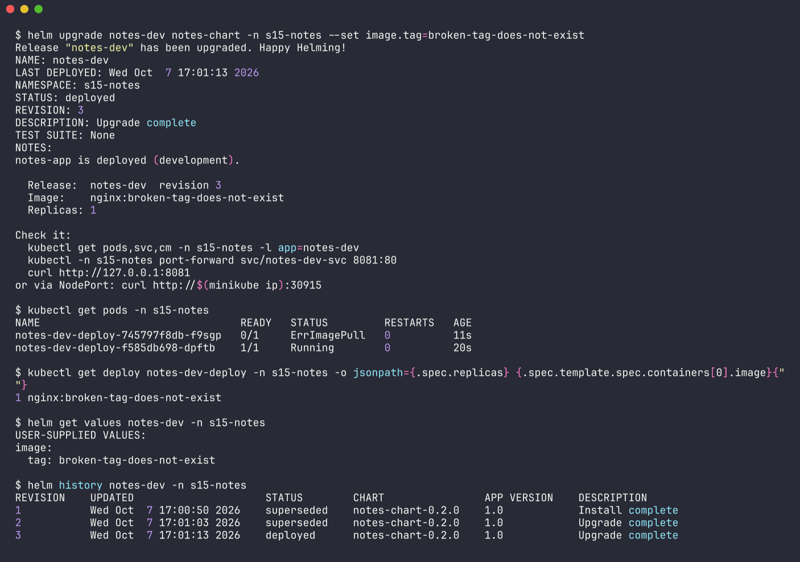
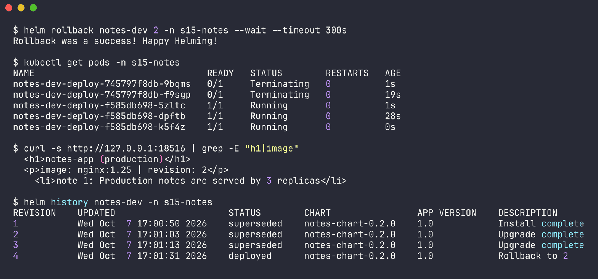
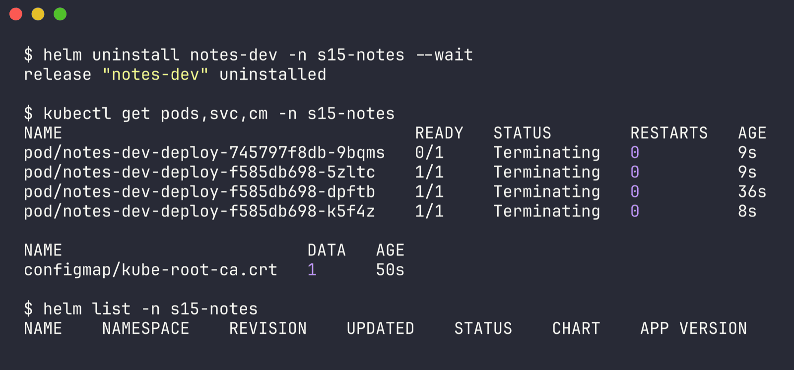

# Session 15 - Mini Project: Notes App with Helm

Name: Ridaa Mirza
Enrollment No: 24BCS10394

Goal (from the instructor's `session-15-helm/mini-project`): package a "Notes app" (nginx standing in for the real app) as a Helm chart with dev and prod values, install it, upgrade it to prod, break it on purpose, roll it back, clean up.

Everything ran on the shared minikube cluster in my own namespace `s15-notes`, Helm v4.3.0. Raw outputs are in [`outputs/`](outputs/).

## What I built

```
notes-chart/
  Chart.yaml
  values.yaml           <- development defaults
  values-prod.yaml      <- production overrides
  .helmignore           <- added
  templates/
    _helpers.tpl        <- added: fullname + labels in one place
    configmap.yaml      <- APP_NAME/ENVIRONMENT + (added) an HTML page ConfigMap
    deployment.yaml
    service.yaml
    NOTES.txt           <- added
```

### What I changed / completed compared to the reference

The reference chart works, but it's the bare minimum. I kept the same resource names (`<release>-deploy`, `<release>-svc`, `<release>-config`) and added:

1. **`_helpers.tpl`** - the reference wrote `{{ .Release.Name }}` by hand in every file. Now there's `notes-chart.fullname`, `notes-chart.selectorLabels` and `notes-chart.labels`, and every template uses `include`.
2. **`NOTES.txt`** - after install/upgrade it prints environment, image, replicas and how to reach the app.
3. **A real landing page.** A second ConfigMap `<release>-page` renders `index.html` from values, mounted into nginx with `subPath`. It loops over a `notes:` list with `range` and has an `if/else` for "No notes yet". This way you can see with curl whether you're on dev or prod. (I first put `index.html` in the same ConfigMap as the env vars, but `envFrom` would then try to turn `index.html` into an environment variable, so I split it.)
4. **`checksum/config` annotation** on the pod template, so a values change that only touches the ConfigMaps still rolls the pods.
5. **`service.type` is configurable** (defaults to NodePort like the reference) and `nodePort` is only rendered for NodePort.
6. **nodePort 30090 -> 30915.** The cluster is shared with other people's labs and NodePorts are cluster-wide, so I moved it somewhere less likely to collide.
7. Chart `version` bumped to 0.2.0 since the templates changed.

values.yaml:

```yaml
replicaCount: 1

image:
  repository: nginx
  tag: "1.24"

service:
  type: NodePort
  port: 80
  # 30090 in the reference; moved to 30915 because the minikube cluster is shared
  nodePort: 30915

app:
  name: notes-app
  environment: development

# rendered as a list on the landing page (range demo)
notes:
  - "Buy milk"
  - "Finish Session 15 Helm homework"
  - "Read about helm rollback --rollback-on-failure"
```

values-prod.yaml overrides `replicaCount: 3`, `image.tag: "1.25"`, `app.environment: production` and the notes list.

_helpers.tpl:

```yaml
{{- define "notes-chart.fullname" -}}
{{- .Release.Name | trunc 50 | trimSuffix "-" }}
{{- end }}

{{- define "notes-chart.selectorLabels" -}}
app: {{ include "notes-chart.fullname" . }}
{{- end }}

{{- define "notes-chart.labels" -}}
{{ include "notes-chart.selectorLabels" . }}
environment: {{ .Values.app.environment }}
helm.sh/chart: {{ printf "%s-%s" .Chart.Name .Chart.Version }}
app.kubernetes.io/managed-by: {{ .Release.Service }}
{{- end }}
```

Note that `environment` is in the common labels but **not** in the selector labels - a Deployment's selector is immutable, so if `environment` were in it, the dev -> prod upgrade would fail.

The page template (values + `if` + `range` with index):

```yaml
  index.html: |
    <html>
    <body>
      <h1>{{ .Values.app.name }} ({{ .Values.app.environment }})</h1>
      <p>image: {{ .Values.image.repository }}:{{ .Values.image.tag }} | revision: {{ .Release.Revision }}</p>
      {{- if .Values.notes }}
      <ul>
      {{- range $i, $note := .Values.notes }}
        <li>note {{ add1 $i }}: {{ $note }}</li>
      {{- end }}
      </ul>
      {{- else }}
      <p>No notes yet.</p>
      {{- end }}
    </body>
    </html>
```

## Step 1 - lint

```bash
$ helm lint notes-chart
==> Linting notes-chart
[INFO] Chart.yaml: icon is recommended

1 chart(s) linted, 0 chart(s) failed

$ helm lint notes-chart -f notes-chart/values-prod.yaml
==> Linting notes-chart
[INFO] Chart.yaml: icon is recommended

1 chart(s) linted, 0 chart(s) failed
```



## Step 2 - render locally

```bash
$ helm template notes-dev notes-chart -n s15-notes
---
# Source: notes-chart/templates/configmap.yaml
apiVersion: v1
kind: ConfigMap
metadata:
  name: notes-dev-config
  labels:
    app: notes-dev
    environment: development
    helm.sh/chart: notes-chart-0.2.0
    app.kubernetes.io/managed-by: Helm
data:
  APP_NAME: "notes-app"
  ENVIRONMENT: "development"
...
      <h1>notes-app (development)</h1>
      <p>image: nginx:1.24 | revision: 1</p>
      <ul>
        <li>note 1: Buy milk</li>
        <li>note 2: Finish Session 15 Helm homework</li>
        <li>note 3: Read about helm rollback --rollback-on-failure</li>
      </ul>
...
spec:
  type: NodePort
  selector:
    app: notes-dev
  ports:
    - port: 80
      targetPort: 80
      nodePort: 30915
```



No `{{ }}` left anywhere - full render in [outputs/02-template.txt](outputs/02-template.txt).

## Step 3 - install (development)

[outputs/03-install-dev.txt](outputs/03-install-dev.txt)

```bash
$ helm install notes-dev notes-chart -n s15-notes --create-namespace --wait --timeout 300s
NAME: notes-dev
LAST DEPLOYED: Wed Oct  7 17:00:50 2026
NAMESPACE: s15-notes
STATUS: deployed
REVISION: 1
DESCRIPTION: Install complete
TEST SUITE: None
NOTES:
notes-app is deployed (development).

  Release:  notes-dev  revision 1
  Image:    nginx:1.24
  Replicas: 1

Check it:
  kubectl get pods,svc,cm -n s15-notes -l app=notes-dev
  kubectl -n s15-notes port-forward svc/notes-dev-svc 8081:80
  curl http://127.0.0.1:8081
or via NodePort: curl http://$(minikube ip):30915

$ kubectl get pods,svc,cm -n s15-notes
NAME                                    READY   STATUS    RESTARTS   AGE
pod/notes-dev-deploy-7d4fcffd87-xp7jb   1/1     Running   0          1s

NAME                    TYPE       CLUSTER-IP     EXTERNAL-IP   PORT(S)        AGE
service/notes-dev-svc   NodePort   10.104.69.22   <none>        80:30915/TCP   1s

NAME                         DATA   AGE
configmap/kube-root-ca.crt   1      1s
configmap/notes-dev-config   2      1s
configmap/notes-dev-page     1      1s

$ kubectl exec -n s15-notes deploy/notes-dev-deploy -- printenv APP_NAME ENVIRONMENT
notes-app
development
```



The ConfigMap values made it into the container as env vars. And the page (through port-forward):

```bash
$ curl -s http://127.0.0.1:18516   (via kubectl port-forward -n s15-notes svc/notes-dev-svc 18516:80)
<html>
<body>
  <h1>notes-app (development)</h1>
  <p>image: nginx:1.24 | revision: 1</p>
  <ul>
    <li>note 1: Buy milk</li>
    <li>note 2: Finish Session 15 Helm homework</li>
    <li>note 3: Read about helm rollback --rollback-on-failure</li>
  </ul>
</body>
</html>
```



I also tried the NodePort directly, `curl http://$(minikube ip):30915` (`192.168.49.2`), and got nothing back - expected on macOS with the docker driver, because the minikube node IP lives inside Docker Desktop's VM and isn't routable from the Mac. Port-forward (or `minikube service notes-dev-svc -n s15-notes --url`, which keeps a tunnel open) is the way to reach it there.

## Step 4 - upgrade to production values

[outputs/04-upgrade-prod.txt](outputs/04-upgrade-prod.txt)

```bash
$ helm upgrade notes-dev notes-chart -n s15-notes -f notes-chart/values-prod.yaml --wait --timeout 300s
Release "notes-dev" has been upgraded. Happy Helming!
NAME: notes-dev
LAST DEPLOYED: Wed Oct  7 17:01:03 2026
NAMESPACE: s15-notes
STATUS: deployed
REVISION: 2
DESCRIPTION: Upgrade complete
TEST SUITE: None
NOTES:
notes-app is deployed (production).

  Release:  notes-dev  revision 2
  Image:    nginx:1.25
  Replicas: 3
...
$ kubectl get pods -n s15-notes -o wide
NAME                                READY   STATUS      RESTARTS   AGE   IP            NODE       NOMINATED NODE   READINESS GATES
notes-dev-deploy-7d4fcffd87-xp7jb   0/1     Completed   0          15s   10.244.0.18   minikube   <none>           <none>
notes-dev-deploy-f585db698-6mqnk    1/1     Running     0          0s    10.244.0.30   minikube   <none>           <none>
notes-dev-deploy-f585db698-dpftb    1/1     Running     0          1s    10.244.0.29   minikube   <none>           <none>
notes-dev-deploy-f585db698-hln8v    1/1     Running     0          2s    10.244.0.28   minikube   <none>           <none>

$ curl -s http://127.0.0.1:18516 | grep -E "h1|image"
  <h1>notes-app (production)</h1>
  <p>image: nginx:1.25 | revision: 2</p>
    <li>note 1: Production notes are served by 3 replicas</li>

$ helm history notes-dev -n s15-notes
REVISION	UPDATED                 	STATUS    	CHART            	APP VERSION	DESCRIPTION
1       	Wed Oct  7 17:00:50 2026	superseded	notes-chart-0.2.0	1.0        	Install complete
2       	Wed Oct  7 17:01:03 2026	deployed  	notes-chart-0.2.0	1.0        	Upgrade complete
```



3 new pods on nginx 1.25, old dev pod on its way out (`Completed`).

## Step 5 - simulate a bad upgrade

Exactly the command from the reference README ([outputs/05-bad-upgrade.txt](outputs/05-bad-upgrade.txt)):

```bash
$ helm upgrade notes-dev notes-chart -n s15-notes --set image.tag=broken-tag-does-not-exist
Release "notes-dev" has been upgraded. Happy Helming!
NAME: notes-dev
...
REVISION: 3
DESCRIPTION: Upgrade complete
TEST SUITE: None
NOTES:
notes-app is deployed (development).

  Release:  notes-dev  revision 3
  Image:    nginx:broken-tag-does-not-exist
  Replicas: 1
...
$ kubectl get pods -n s15-notes
NAME                                READY   STATUS         RESTARTS   AGE
notes-dev-deploy-745797f8db-f9sgp   0/1     ErrImagePull   0          11s
notes-dev-deploy-f585db698-dpftb    1/1     Running        0          20s

$ kubectl get deploy notes-dev-deploy -n s15-notes -o jsonpath='{.spec.replicas} {.spec.template.spec.containers[0].image}'
1 nginx:broken-tag-does-not-exist

$ helm get values notes-dev -n s15-notes
USER-SUPPLIED VALUES:
image:
  tag: broken-tag-does-not-exist
```



Two problems in one, and the NOTES output gives the second one away - it says **development** and **1 replica**:

1. The image tag doesn't exist -> `ErrImagePull`. One old prod pod keeps serving because the rolling update can't finish.
2. The reference command forgets `-f values-prod.yaml`. A plain `helm upgrade` (no `--reuse-values`) starts from the chart's `values.yaml` again, so this "image only" change also quietly scaled prod from 3 to 1 and flipped the environment back to development. `helm get values` shows only the `--set` survived. In real life you'd pass the same `-f values-prod.yaml` on every upgrade (or `--reuse-values`).

## Step 6 - rollback to revision 2

[outputs/06-rollback.txt](outputs/06-rollback.txt)

```bash
$ helm rollback notes-dev 2 -n s15-notes --wait --timeout 300s
Rollback was a success! Happy Helming!

$ kubectl get pods -n s15-notes
NAME                                READY   STATUS        RESTARTS   AGE
notes-dev-deploy-745797f8db-9bqms   0/1     Terminating   0          1s
notes-dev-deploy-745797f8db-f9sgp   0/1     Terminating   0          19s
notes-dev-deploy-f585db698-5zltc    1/1     Running       0          1s
notes-dev-deploy-f585db698-dpftb    1/1     Running       0          28s
notes-dev-deploy-f585db698-k5f4z    1/1     Running       0          0s

$ curl -s http://127.0.0.1:18516 | grep -E "h1|image"
  <h1>notes-app (production)</h1>
  <p>image: nginx:1.25 | revision: 2</p>
    <li>note 1: Production notes are served by 3 replicas</li>

$ helm history notes-dev -n s15-notes
REVISION	UPDATED                 	STATUS    	CHART            	APP VERSION	DESCRIPTION
1       	Wed Oct  7 17:00:50 2026	superseded	notes-chart-0.2.0	1.0        	Install complete
2       	Wed Oct  7 17:01:03 2026	superseded	notes-chart-0.2.0	1.0        	Upgrade complete
3       	Wed Oct  7 17:01:13 2026	superseded	notes-chart-0.2.0	1.0        	Upgrade complete
4       	Wed Oct  7 17:01:31 2026	deployed  	notes-chart-0.2.0	1.0        	Rollback to 2
```



Back to 3 healthy prod pods on nginx 1.25 - the rollback fixed both the image *and* the replica count / environment, because it restores revision 2's whole manifest, not just the field that broke. The ReplicaSet hash `f585db698` is the same one from step 4, so Kubernetes just scaled the old ReplicaSet back up. Rollback became revision 4.

## Step 7 - clean up

[outputs/07-cleanup.txt](outputs/07-cleanup.txt)

```bash
$ helm uninstall notes-dev -n s15-notes --wait
release "notes-dev" uninstalled

$ kubectl get pods,svc,cm -n s15-notes
NAME                                    READY   STATUS        RESTARTS   AGE
pod/notes-dev-deploy-745797f8db-9bqms   0/1     Terminating   0          9s
pod/notes-dev-deploy-f585db698-5zltc    1/1     Terminating   0          9s
pod/notes-dev-deploy-f585db698-dpftb    1/1     Terminating   0          36s
pod/notes-dev-deploy-f585db698-k5f4z    1/1     Terminating   0          8s

NAME                         DATA   AGE
configmap/kube-root-ca.crt   1      50s

$ helm list -n s15-notes
NAME	NAMESPACE	REVISION	UPDATED	STATUS	CHART	APP VERSION
```



Service and both ConfigMaps gone immediately, pods terminating, release gone. Then I deleted the `s15-notes` namespace.

## Chart structure, in my words

| File | Role | In this chart |
|---|---|---|
| `Chart.yaml` | identity of the chart: `apiVersion: v2`, name, `version` (chart) and `appVersion` (app) | `notes-chart` 0.2.0, app 1.0 |
| `values.yaml` | defaults for every `{{ .Values.* }}` | dev: 1 replica, nginx 1.24 |
| `values-prod.yaml` | an override file passed with `-f` | prod: 3 replicas, nginx 1.25 |
| `templates/*.yaml` | Kubernetes manifests with Go template placeholders | Deployment, Service, 2 ConfigMaps |
| `templates/_helpers.tpl` | named snippets (`define`), called with `include`, not rendered as objects | name + labels |
| `templates/NOTES.txt` | rendered and printed after install/upgrade, not applied | status + how to reach the app |
| `.helmignore` | files left out of `helm package` | editor/OS junk |

Templating features used (from instructor notes 03-06):

- **values** - `{{ .Values.replicaCount }}`, nested `{{ .Values.image.tag }}`, override precedence `values.yaml < -f < --set`
- **built-ins** - `.Release.Name`, `.Release.Namespace`, `.Release.Revision`, `.Release.Service`, `.Chart.Name`, `.Chart.Version`, `$.Template.BasePath`
- **functions / pipes** - `quote`, `default`, `trunc 50 | trimSuffix "-"`, `printf`, `nindent`, `sha256sum`, `add1`
- **include** - `{{- include "notes-chart.labels" . | nindent 4 }}`
- **if / else** - nodePort only for NodePort, "No notes yet" when the list is empty
- **range** - `{{- range $i, $note := .Values.notes }}`

## Checklist

```text
[PASS] Created / completed the Helm chart (helpers, NOTES, page ConfigMap)
[PASS] values.yaml and values-prod.yaml
[PASS] helm lint + helm template
[PASS] helm install (dev) - verified pods, svc, configmaps, env vars, page
[PASS] helm upgrade with prod values - 3 replicas on nginx 1.25, page says production
[PASS] simulated bad upgrade - ErrImagePull (and found the missing -f gotcha)
[PASS] helm rollback 2 - healthy prod again, history shows "Rollback to 2"
[PASS] helm uninstall
```
