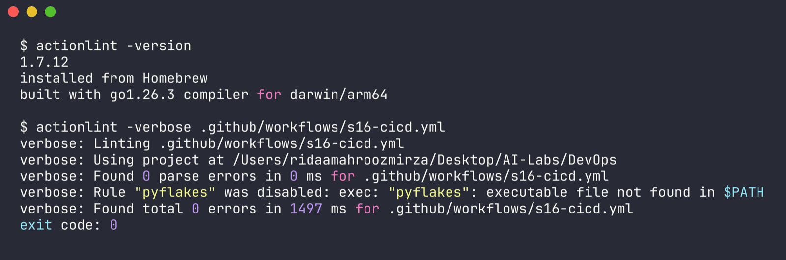
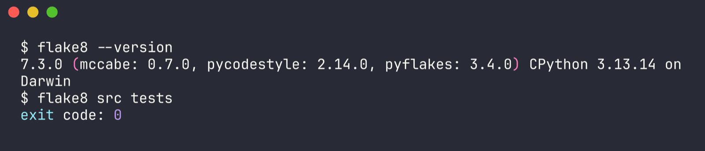
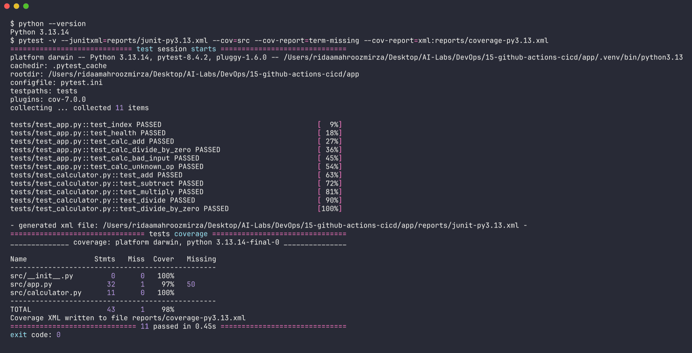
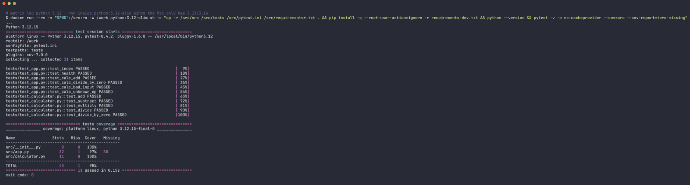
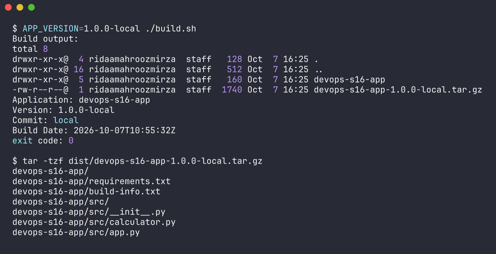
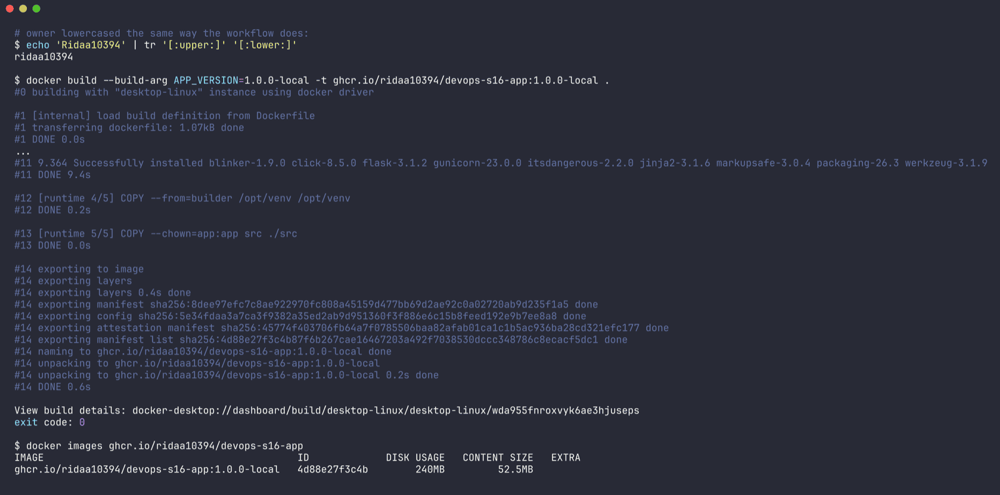
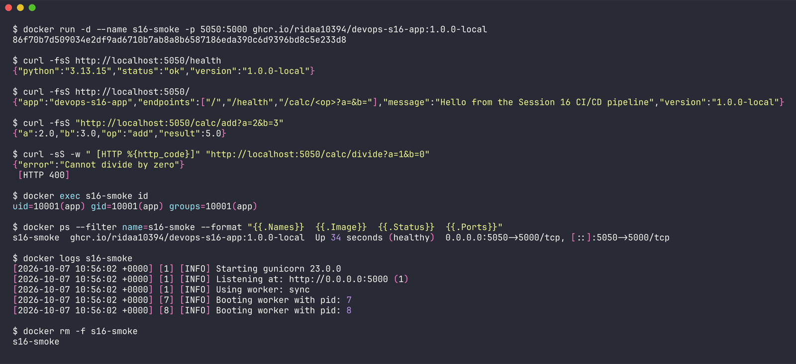
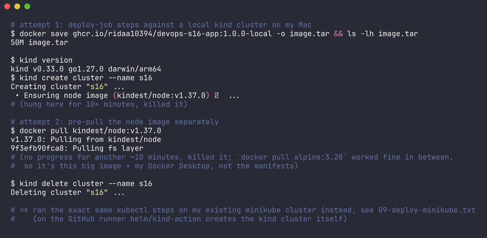
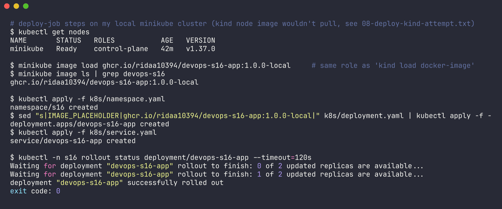
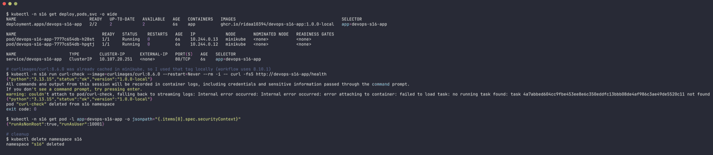

# Session 16 - CI/CD & GitHub Actions

Name: Ridaa Mirza
Enrollment No: 24BCS10394

For this session I built a small end-to-end CI/CD project: a Flask API (with a `/health` endpoint and unit tests), a multi-stage non-root Dockerfile, Kubernetes manifests, and a GitHub Actions workflow that goes lint -> test (matrix) -> build (artifact) -> docker (smoke test + push to GHCR) -> deploy (kind cluster). The class demo (`10-final-cicd-pipeline`) used a Python calculator with pytest, so I kept Python and the same calculator functions, and wrapped them in a Flask app so there is actually something to containerise and deploy.

## Folder layout

```
15-github-actions-cicd/
├── app/
│   ├── src/
│   │   ├── app.py            # Flask app: /, /health, /calc/<op>?a=&b=
│   │   └── calculator.py     # add / subtract / multiply / divide
│   ├── tests/
│   │   ├── test_app.py       # endpoint tests via Flask test client
│   │   └── test_calculator.py
│   ├── Dockerfile            # multi-stage, runs as uid 10001
│   ├── build.sh              # packages src into dist/ (the build artifact)
│   ├── requirements.txt      # runtime deps (flask, gunicorn)
│   ├── requirements-dev.txt  # + pytest, pytest-cov, flake8
│   ├── .flake8, pytest.ini, .dockerignore
├── k8s/
│   ├── namespace.yaml
│   ├── deployment.yaml       # 2 replicas, readiness/liveness on /health
│   └── service.yaml
├── outputs/                  # real terminal output from running every stage locally
└── README.md

.github/workflows/s16-cicd.yml   # the pipeline (lives at the repo root, GitHub only reads it from there)
```

---

## Part 1 - Theory

### CI vs CD

**Continuous Integration (CI)** - every time someone pushes or opens a PR, the code is automatically built and tested. The goal is to catch broken code within minutes of it being written instead of finding out on release day. In my pipeline that is the `lint`, `test` and `build` jobs.

**Continuous Delivery** - every change that passes CI is automatically packaged into something releasable (artifact, Docker image) and is *ready* to go to production, but the actual release still needs a human to press a button / approve.

**Continuous Deployment** - one step further: if everything is green, the change goes to production automatically with no human in the loop.

| | Continuous Integration | Continuous Delivery | Continuous Deployment |
|---|---|---|---|
| What's automated | build + test | build + test + package + release-ready | everything up to production |
| Prod release | - | manual approval | automatic |
| Output | pass / fail | artifact / image always deployable | running new version |

My workflow can act as either. The `deploy` job uses `environment: production`. With no protection rules on that environment it runs straight away (continuous **deployment**). If I add "Required reviewers" on the `production` environment in repo settings, the job pauses and waits for approval (continuous **delivery**). Same YAML, the difference is just one setting.

### CI/CD pipeline stages

```
 developer                      GitHub Actions (ubuntu-latest runners)
 ---------                      ---------------------------------------------------------------
 git push / PR  --->  [ lint ] ---> [ test 3.12 ] --+--> [ build ] ---> [ docker ] ---> [ deploy ]
                       flake8       [ test 3.13 ] --+     build.sh       build image     kind cluster
                                    pytest + cov          upload         run + curl      kubectl apply
                                    upload reports        artifact       /health         rollout status
                                                          (outputs:      push to GHCR    curl /health
                                                           version)      (main only)     (environment:
                                                                                          production)
 |<----------------------- CI --------------------->|<-- delivery -->|<---- deployment ---->|
```

Generic stages: **source** (push/PR) -> **build** -> **test** -> **package/release** (artifact, image in a registry) -> **deploy** -> **verify/monitor**. If any stage fails, everything after it is skipped, which is the main safety net.

### GitHub Actions concepts

- **Workflow** - a YAML file in `.github/workflows/`. Mine is `s16-cicd.yml`. A repo can have many; each shows up separately in the Actions tab.
- **Events (triggers)** - what starts the workflow (`on:`). I use:
  - `push` to `main` - normal CI + deploy
  - `pull_request` to `main` - CI only (no push to GHCR, no deploy)
  - `workflow_dispatch` - a "Run workflow" button in the Actions tab, with a `deploy` boolean input
  - all with `paths:` filters on `15-github-actions-cicd/**` and the workflow file, so commits to other session folders don't trigger this pipeline.
- **Jobs** - groups of steps. Each job gets a *fresh* runner VM, so jobs don't share files unless you pass them via artifacts. Jobs run in parallel by default; `needs:` makes them sequential and also means "only run if the previous job succeeded".
- **Steps** - individual commands (`run:`) or reusable actions (`uses: actions/checkout@v4`) executed in order inside a job, sharing the same filesystem.
- **Runners** - the machine that executes a job.
  - *GitHub-hosted* (`runs-on: ubuntu-latest`) - GitHub spins up a clean VM per job, pre-installed with Docker, Python, kubectl, etc. Free minutes for public repos, zero maintenance, but you don't control the hardware and it can't reach private networks.
  - *Self-hosted* (`runs-on: [self-hosted, linux]`) - your own machine/VM running the runner agent (Settings > Actions > Runners > New self-hosted runner). Useful for special hardware (GPU, ARM), private network access, or avoiding minute limits, but you have to patch and secure it yourself, and it's risky on public repos because anyone's PR could run code on your box.
- **Secrets** - encrypted values (`${{ secrets.NAME }}`) that are masked as `***` in logs. `GITHUB_TOKEN` is created automatically for every run; I use it to log in to GHCR. I also use a custom secret `DEMO_API_KEY` to show how your own secrets work (see below).
- **Artifacts** - files uploaded from a job (`actions/upload-artifact`) that later jobs can download (`actions/download-artifact`) and that you can download from the run page. I upload test/coverage reports per Python version, the built package, and the Docker image tarball.
- **Environments** - named deployment targets (`environment: production`) that can have protection rules (required reviewers, wait timer, branch restrictions) and their own secrets. Each deploy also gets recorded under the repo's "Deployments" section.
- **Matrix** - `strategy.matrix` runs the same job for each combination of values; here tests run on Python 3.12 and 3.13 in parallel.
- **Caching** - `actions/setup-python` with `cache: pip` caches the pip download cache keyed on `requirements-dev.txt`, and the Docker build uses the GitHub Actions cache backend (`cache-from/cache-to: type=gha`) for layers.
- **Outputs** - a step writes `key=value` to `$GITHUB_OUTPUT`, the job exposes it under `outputs:`, and later jobs read it with `needs.<job>.outputs.<key>`. I compute the version once in `build` and reuse it in `docker` and `deploy`.

---

## Part 2 - The app

`src/app.py` is a tiny Flask app:

| Endpoint | Response |
|---|---|
| `GET /` | app name, message, version, endpoint list |
| `GET /health` | `{"status": "ok", "version": ..., "python": ...}` - used by the smoke test, Docker HEALTHCHECK and k8s probes |
| `GET /calc/<add\|subtract\|multiply\|divide>?a=&b=` | result, 400 on bad input / divide by zero, 404 on unknown op |

There are 11 tests: 5 for the calculator functions (same as the class demo) and 6 hitting the endpoints with Flask's test client.

### Dockerfile

Two stages:
1. `builder` (`python:3.13-slim`) - creates a virtualenv at `/opt/venv` and pip installs `requirements.txt` into it.
2. `runtime` (`python:3.13-slim`) - creates a system user `app` with uid/gid `10001`, copies only the venv and `src/`, switches to `USER 10001`, has a `HEALTHCHECK` that hits `/health` with Python's urllib (no curl in slim images), and runs `gunicorn` with 2 workers on port 5000.

Tests, dev requirements and build files are excluded by `.dockerignore` so they never end up in the image.

### Kubernetes manifests

`k8s/deployment.yaml` runs 2 replicas with `runAsNonRoot` / `runAsUser: 10001`, readiness and liveness probes on `/health`, and small requests/limits. The image is `IMAGE_PLACEHOLDER` in the file - the deploy job `sed`s in the exact image tag it just built. `service.yaml` is a ClusterIP service on port 80 -> 5000.

---

## Part 3 - How the pipeline works, job by job

File: `.github/workflows/s16-cicd.yml`. All `run:` steps default to `working-directory: 15-github-actions-cicd/app`. The top-level token permission is `contents: read`; only the `docker` job asks for `packages: write`. There is also a `concurrency` group so a new push to the same branch cancels the older still-running run.

### 1. `lint`
Checkout -> setup Python 3.13 (with pip cache) -> `pip install -r requirements-dev.txt` -> `flake8 src tests`. Cheapest job, so it runs first and fails fast on style errors / unused imports.

### 2. `test` (needs: lint)
Matrix over `python-version: ["3.12", "3.13"]` with `fail-fast: false` so one version failing doesn't cancel the other. Runs

```bash
pytest -v --junitxml=reports/junit-py<ver>.xml --cov=src --cov-report=term-missing --cov-report=xml:reports/coverage-py<ver>.xml
```

and uploads `reports/` as `test-reports-py3.12` / `test-reports-py3.13` with `if: always()` so I still get the reports when a test fails.

### 3. `build` (needs: test)
- `Compute version` step writes `version=1.0.<run_number>-<short sha>` and `artifact=devops-s16-app-<version>` to `$GITHUB_OUTPUT`; the job exposes both as `outputs`.
- `./build.sh` copies `src/` + `requirements.txt` into `dist/devops-s16-app/`, writes `build-info.txt` (version, commit, date) and makes a `.tar.gz`.
- Uploads `dist/` as the build artifact.
- Custom secret demo: `DEMO_API_KEY` is passed in via `env:`. If it's not set the step prints a message and carries on (so forks / fresh clones don't break). If it is set, the step prints its length and tries to echo it - GitHub replaces the value with `***` in the log, which is the point of the demo.

### 4. `docker` (needs: build)
- Lowercases `github.repository_owner` with `tr` (GHCR image names must be lowercase and my username is `Ridaa10394`) -> `ghcr.io/ridaa10394/devops-s16-app`. This is exposed as a job output `image`.
- `docker/setup-buildx-action` + `docker/build-push-action` with `load: true` builds the image into the runner's local Docker, tagged with the version from `needs.build.outputs.version` and `latest`, using the GHA layer cache.
- Smoke test: `docker run -d -p 5000:5000`, then retry `curl -fsS localhost:5000/health` up to 15 times, hit `/calc/add`, check `id` inside the container shows uid 10001, then remove the container. Any failure exits non-zero and stops the pipeline.
- `docker/login-action` to `ghcr.io` with `username: ${{ github.actor }}` and `password: ${{ secrets.GITHUB_TOKEN }}`, then `docker push` both tags. Both steps have `if: github.event_name == 'push' && github.ref == 'refs/heads/main'`, so PRs build and test the image but never publish it.
- `docker save` the image and upload it as the `docker-image` artifact so the deploy job can load the exact same image without needing registry credentials.

### 5. `deploy` (needs: [build, docker])
Only runs on push to main, or on a manual run with `deploy: true`. Uses `environment: production`.
- Downloads the build artifact (by the name from `needs.build.outputs.artifact`) and prints `build-info.txt` - that's the "release" being deployed.
- Downloads and `docker load`s the image tarball.
- `helm/kind-action` creates a throwaway Kubernetes-in-Docker cluster called `s16` on the runner.
- `kind load docker-image` pushes the image into the kind node (so no pull from GHCR is needed - the GHCR package is private by default).
- `kubectl apply` the namespace, the deployment (with the image swapped in via `sed`) and the service.
- `kubectl rollout status --timeout=120s` - fails the job if the pods don't become Ready (readiness probe on `/health`).
- Verifies with `kubectl get deploy,pods,svc` and a one-off `curlimages/curl` pod calling `http://devops-s16-app/health` through the Service.

The kind cluster is destroyed when the runner VM goes away, so this is a realistic but free "production". For a real target you'd swap the kind steps for a kubeconfig stored as an environment secret.

### Adding the custom secret

1. Repo -> **Settings** -> **Secrets and variables** -> **Actions** -> **New repository secret**
2. Name: `DEMO_API_KEY`, Value: anything (e.g. `s16-demo-key-123`) -> **Add secret**
3. Re-run the workflow; the `build` job's "Use a custom secret (masked)" step prints `DEMO_API_KEY is set (16 chars). Printing it shows: ***`.

(Optional) To get the approval gate: **Settings** -> **Environments** -> `production` (it's auto-created on the first run) -> tick **Required reviewers** and add yourself.

`GITHUB_TOKEN` doesn't need to be added - it's automatic. GHCR push just needs the `packages: write` permission, which the `docker` job declares. After the first push the package appears under my profile -> **Packages**.

---

## Part 4 - Running every stage locally

The workflow can't run on GitHub until I push, so I ran each job's commands on my Mac for real. All outputs are saved in `outputs/`.

### 0. Validate the workflow (actionlint)

```bash
brew install actionlint
actionlint -verbose .github/workflows/s16-cicd.yml
```

```
verbose: Found 0 parse errors in 0 ms for .github/workflows/s16-cicd.yml
verbose: Found total 0 errors in 1497 ms for .github/workflows/s16-cicd.yml
exit code: 0
```



Full output: `outputs/01-actionlint.txt`. actionlint also type-checks `${{ }}` expressions, `needs.*.outputs`, matrix values and shellchecks the `run:` scripts, so 0 errors here gives me decent confidence the YAML is right.

### 1. Lint

```bash
cd 15-github-actions-cicd/app
python3.13 -m venv .venv && source .venv/bin/activate
pip install -r requirements-dev.txt
flake8 src tests
```



No output, exit code 0 (`outputs/02-lint.txt`).

### 2. Test - matrix leg 3.13 (native) and 3.12 (in a container)

```bash
mkdir -p reports
pytest -v --junitxml=reports/junit-py3.13.xml --cov=src --cov-report=term-missing \
  --cov-report=xml:reports/coverage-py3.13.xml
```

```
collected 11 items
tests/test_app.py::test_index PASSED                                     [  9%]
tests/test_app.py::test_health PASSED                                    [ 18%]
...
tests/test_calculator.py::test_divide_by_zero PASSED                     [100%]

Name                Stmts   Miss  Cover   Missing
-------------------------------------------------
src/__init__.py         0      0   100%
src/app.py             32      1    97%   50
src/calculator.py      11      0   100%
-------------------------------------------------
TOTAL                  43      1    98%
============================== 11 passed in 0.45s ==============================
```



My Mac only has Python 3.13/3.14, so for the 3.12 leg of the matrix I ran the same tests inside `python:3.12-slim`:

```bash
docker run --rm -v "$PWD":/src:ro -w /work python:3.12-slim sh -c \
  "cp -r /src/src /src/tests /src/pytest.ini /src/requirements*.txt . && \
   pip install -q --root-user-action=ignore -r requirements-dev.txt && \
   python --version && pytest -v -p no:cacheprovider --cov=src --cov-report=term-missing"
```

```
Python 3.12.15
...
TOTAL                  43      1    98%
============================== 11 passed in 0.15s ==============================
```



Same 11/11 on both versions. The only uncovered line is `app.run(...)` under `if __name__ == "__main__"`, which is expected since gunicorn starts the app in the container. (`outputs/03-test-py3.13.txt`, `outputs/04-test-py3.12.txt`)

### 3. Build

```bash
APP_VERSION=1.0.0-local ./build.sh
tar -tzf dist/devops-s16-app-1.0.0-local.tar.gz
```

```
Application: devops-s16-app
Version: 1.0.0-local
Commit: local
Build Date: 2026-10-07T10:55:32Z

devops-s16-app/
devops-s16-app/requirements.txt
devops-s16-app/build-info.txt
devops-s16-app/src/
devops-s16-app/src/__init__.py
devops-s16-app/src/calculator.py
devops-s16-app/src/app.py
```



On GitHub `Commit:` will be the real `GITHUB_SHA` and the version will be `1.0.<run_number>-<sha7>`. (`outputs/05-build.txt`)

### 4. Docker build + smoke test

```bash
echo 'Ridaa10394' | tr '[:upper:]' '[:lower:]'     # ridaa10394 - same as the workflow step
docker build --build-arg APP_VERSION=1.0.0-local -t ghcr.io/ridaa10394/devops-s16-app:1.0.0-local .
docker images ghcr.io/ridaa10394/devops-s16-app
```

```
IMAGE                                           ID             DISK USAGE   CONTENT SIZE
ghcr.io/ridaa10394/devops-s16-app:1.0.0-local   4d88e27f3c4b        240MB         52.5MB
```



```bash
docker run -d --name s16-smoke -p 5050:5000 ghcr.io/ridaa10394/devops-s16-app:1.0.0-local
curl -fsS http://localhost:5050/health
curl -fsS "http://localhost:5050/calc/add?a=2&b=3"
curl -sS -w " [HTTP %{http_code}]" "http://localhost:5050/calc/divide?a=1&b=0"
docker exec s16-smoke id
docker ps --filter name=s16-smoke
```

```
{"python":"3.13.15","status":"ok","version":"1.0.0-local"}
{"a":2.0,"b":3.0,"op":"add","result":5.0}
{"error":"Cannot divide by zero"}
 [HTTP 400]
uid=10001(app) gid=10001(app) groups=10001(app)
s16-smoke  ghcr.io/ridaa10394/devops-s16-app:1.0.0-local  Up 34 seconds (healthy)  0.0.0.0:5050->5000/tcp
```



(I used host port 5050 locally because 5000 is taken by AirPlay Receiver on macOS; the runner uses 5000.) The version baked in via `--build-arg` shows up in `/health`, the process runs as uid 10001 not root, and Docker's own HEALTHCHECK marks it `(healthy)`. (`outputs/06-docker-build.txt`, `outputs/07-docker-smoke-test.txt`)

I did not push to GHCR from my laptop - that only happens from the pipeline with `GITHUB_TOKEN`.

### 5. Deploy to kind

The deploy job is: load the image tarball -> create a kind cluster -> load the image into it -> `kubectl apply` -> `rollout status` -> curl `/health` through the Service.

I installed kind (`brew install kind`) and tried to do exactly this, but `kind create cluster` hung on "Ensuring node image (kindest/node:v1.37.0)" and a separate `docker pull kindest/node:v1.37.0` never got past "Pulling fs layer", while small images like `alpine` pulled fine. So it's a Docker Desktop / big-image problem on my machine, not the manifests (`outputs/08-deploy-kind-attempt.txt`). On the GitHub runner `helm/kind-action` handles the cluster.



Since I already had minikube running, I ran the same kubectl steps there - the only difference is `minikube image load` instead of `kind load docker-image`:

```bash
minikube image load ghcr.io/ridaa10394/devops-s16-app:1.0.0-local
kubectl apply -f k8s/namespace.yaml
sed "s|IMAGE_PLACEHOLDER|ghcr.io/ridaa10394/devops-s16-app:1.0.0-local|" k8s/deployment.yaml | kubectl apply -f -
kubectl apply -f k8s/service.yaml
kubectl -n s16 rollout status deployment/devops-s16-app --timeout=120s
kubectl -n s16 get deploy,pods,svc -o wide
kubectl -n s16 run curl-check --image=curlimages/curl:8.6.0 --restart=Never --rm -i -- curl -fsS http://devops-s16-app/health
```

```
namespace/s16 created
deployment.apps/devops-s16-app created
service/devops-s16-app created

Waiting for deployment "devops-s16-app" rollout to finish: 0 of 2 updated replicas are available...
Waiting for deployment "devops-s16-app" rollout to finish: 1 of 2 updated replicas are available...
deployment "devops-s16-app" successfully rolled out

NAME                             READY   UP-TO-DATE   AVAILABLE   AGE   CONTAINERS   IMAGES
deployment.apps/devops-s16-app   2/2     2            2           6s    app          ghcr.io/ridaa10394/devops-s16-app:1.0.0-local

NAME                                  READY   STATUS    RESTARTS   AGE   IP            NODE
pod/devops-s16-app-7777c654db-h28st   1/1     Running   0          6s    10.244.0.13   minikube
pod/devops-s16-app-7777c654db-hpgtj   1/1     Running   0          6s    10.244.0.12   minikube

NAME                     TYPE        CLUSTER-IP      EXTERNAL-IP   PORT(S)   AGE
service/devops-s16-app   ClusterIP   10.107.20.251   <none>        80/TCP    6s

{"python":"3.13.15","status":"ok","version":"1.0.0-local"}
pod "curl-check" deleted from s16 namespace
```





Both replicas went Ready (so the readiness probe on `/health` passed), the pod spec shows `{"runAsNonRoot":true,"runAsUser":10001}`, and the Service answers from inside the cluster. I used `curlimages/curl:8.6.0` locally because that tag was already cached in minikube; the workflow uses 8.10.1. Afterwards I deleted the `s16` namespace. (`outputs/09-deploy-minikube.txt`)

---

## Part 5 - Pipeline execution on GitHub

The workflow only exists on GitHub after pushing, so these are placeholders for screenshots to take from the real runs.

> TODO (after you push): Actions tab -> "S16 CI/CD Pipeline" -> the run for the push to main. Screenshot the **run summary graph** showing `lint -> test (3.12) / test (3.13) -> build -> docker -> deploy` all green.

> TODO (after you push): Open the **test (Python 3.12)** job and expand "Run pytest with coverage". Screenshot the 11 passed lines + coverage table.

> TODO (after you push): Open the **docker** job, expand "Run container and smoke-test /health" (screenshot the `{"status":"ok"...}` + `smoke test passed` lines) and "Push image to GHCR" (screenshot the pushed digest).

> TODO (after you push): Open the **deploy** job, expand "Wait for rollout" and "Verify deployment". Screenshot `successfully rolled out` and the `kubectl get deploy,pods,svc` table.

> TODO (after you push): Scroll to the bottom of the run summary page -> **Artifacts** section. Screenshot the list (`test-reports-py3.12`, `test-reports-py3.13`, `devops-s16-app-1.0.N-xxxxxxx`, `docker-image`).

> TODO (after you push): Your GitHub profile -> **Packages** -> `devops-s16-app`. Screenshot the GHCR package page showing the `latest` and `1.0.N-xxxxxxx` tags.

> TODO (after you push): Add the `DEMO_API_KEY` secret, re-run, and screenshot the build job's "Use a custom secret (masked)" step showing `***`.

> TODO (after you push): Open a PR that touches `15-github-actions-cicd/` and screenshot the checks: lint/test/build/docker run, but "Log in to GHCR" / "Push image to GHCR" are skipped and `deploy` is skipped.

### Failure scenario (to try after pushing)

Same idea as the class demo: break `add()` in `src/calculator.py` (`return a + b + 1`) and push. `lint` passes, both `test` legs fail, and `build`, `docker`, `deploy` show as skipped because of `needs:` - nothing broken reaches the registry or the cluster. Revert and push again to go green.

> TODO (after you push): Screenshot the failed run graph (test red, everything after it grey/skipped).

---

## Observations

- `needs:` is doing two jobs at once: ordering and gating. The deploy can never run on code that failed lint or tests.
- Jobs don't share disks. The only ways to pass things forward are artifacts (files) and job outputs (small strings). I used both: version string via outputs, package + image tarball via artifacts.
- GHCR is picky about lowercase names, and `github.repository_owner` keeps the original case (`Ridaa10394`), so the lowercase step is not optional.
- The `paths:` filter matters in a repo with many sessions - without it every commit to any folder would rebuild and redeploy this app.
- Running the 3.12 tests in a container was a nice reminder that the matrix is basically "same tests, different interpreter", which is exactly what a container gives you locally.
- The smoke test inside CI catches things unit tests can't: a wrong `CMD`, a missing dependency in the runtime stage, or a file permission problem from switching to the non-root user.
