# Session 17 - Complete CI/CD & DevSecOps

Name: Ridaa Mirza
Enrollment No: 24BCS10394

## Overview

Goal: take the Flask "DevSecOps Dashboard" app from the session demo and put it behind a full CI/CD pipeline where every security check runs before the image is published or deployed, and one gate decides whether the release is allowed through.

Pipeline file: [`.github/workflows/s17-devsecops.yml`](../.github/workflows/s17-devsecops.yml)

```
  Code (git push / PR touching 16-devsecops/**)
    |
    v
  1. Build ............ pip install pinned deps, compileall, pip check
    |
    v
  2. Unit Test ........ pytest + coverage (fails under 80%)
    |
    v
  3. SAST ............. bandit            -> bandit.json   (+ SARIF to code scanning)
    |
    v
  4. SCA .............. pip-audit         -> pip-audit.json
    |                   trivy fs          (deps + Dockerfile/k8s misconfig)
    v
  5. Secret Scan ...... gitleaks          -> gitleaks.json
    |
    v
  6. Docker Build ..... built ONCE, saved as an artifact
    |
    v
  7. Image Scan ....... trivy image       -> trivy-image.json (+ SARIF)
    |
    v
  8. SECURITY GATE .... security/gate.py + gate-policy.toml over all 4 reports
    |        \
    | PASS    \ FAIL --> pipeline stops, nothing is pushed or deployed
    v
  9. Push Image ....... GHCR: ghcr.io/<owner>/s17-devsecops:<sha> + :latest   (main only)
    |
    v
 10. Deploy to K8s .... kind cluster in the runner: apply, rollout status, smoke test
```

Every job is chained with `needs:` so a failure anywhere stops everything after it. The scanners themselves run in "report mode" (they always produce a report and don't fail the job); the Security Gate job is the single place that decides pass/fail, using one policy file. I did it this way so the rules are in one file I can read, instead of scattered `--exit-code` flags in 4 different jobs.

Folder layout:

```
16-devsecops/
├── app/                      Flask app (from the session demo, SAST findings fixed)
├── tests/test_app.py         13 pytest tests
├── requirements.txt          pinned runtime deps (Flask, Werkzeug, gunicorn)
├── requirements-dev.txt      + pytest, pytest-cov
├── Dockerfile                multi-stage, non-root UID 10001, gunicorn, no pip in runtime
├── k8s/
│   ├── namespace.yaml        s17, Pod Security "restricted" enforced
│   ├── deployment.yaml       non-root, read-only rootfs, drop ALL caps, probes, resources
│   └── service.yaml          ClusterIP
├── security/
│   ├── bandit.yaml           SAST config
│   ├── .gitleaks.toml        secret scan config (default rules + 1 custom rule)
│   ├── trivy.yaml            trivy config (fs + image)
│   ├── .trivyignore          accepted risks (empty, rules for adding entries)
│   ├── gate-policy.toml      gate thresholds
│   ├── gate.py               the gate itself (stdlib only)
│   └── demo/known-bad-deps.txt   vulnerable pins, used ONLY to prove the gate fails
├── scripts/local-pipeline.sh run stages 1-8 (+ deploy) on a laptop
└── outputs/                  real output from every stage, run locally
```

The pipeline only triggers when something in `16-devsecops/**` or the workflow file changes (`paths:` filter), and every `run:` step defaults to `working-directory: 16-devsecops`.

## How to run locally

Tools I used: Python 3.14 (venv), Docker Desktop, trivy 0.75.0, gitleaks 8.30.1, minikube (k8s v1.37.0), actionlint 1.7.12.

```bash
cd 16-devsecops

# whole pipeline, stages 1-8
./scripts/local-pipeline.sh

# same + minikube image load + deploy into namespace s17
DEPLOY=1 ./scripts/local-pipeline.sh

# validate the workflow file
actionlint ../.github/workflows/s17-devsecops.yml
```

Full end-to-end run: [`outputs/00-local-pipeline-run.txt`](outputs/00-local-pipeline-run.txt). actionlint (with shellcheck installed, so it also lints every `run:` block) came back clean: [`outputs/00-actionlint.txt`](outputs/00-actionlint.txt).

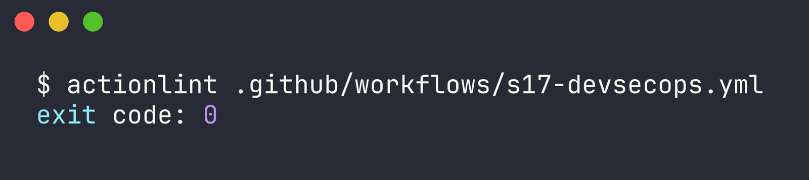

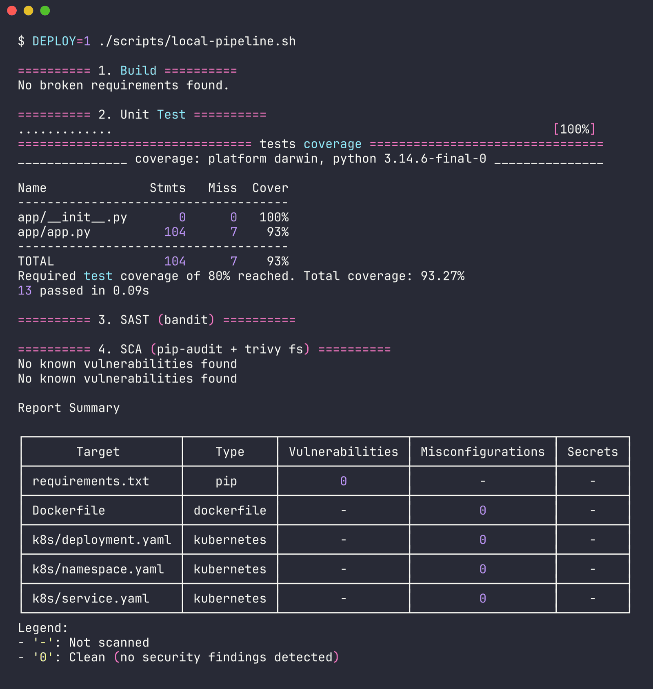

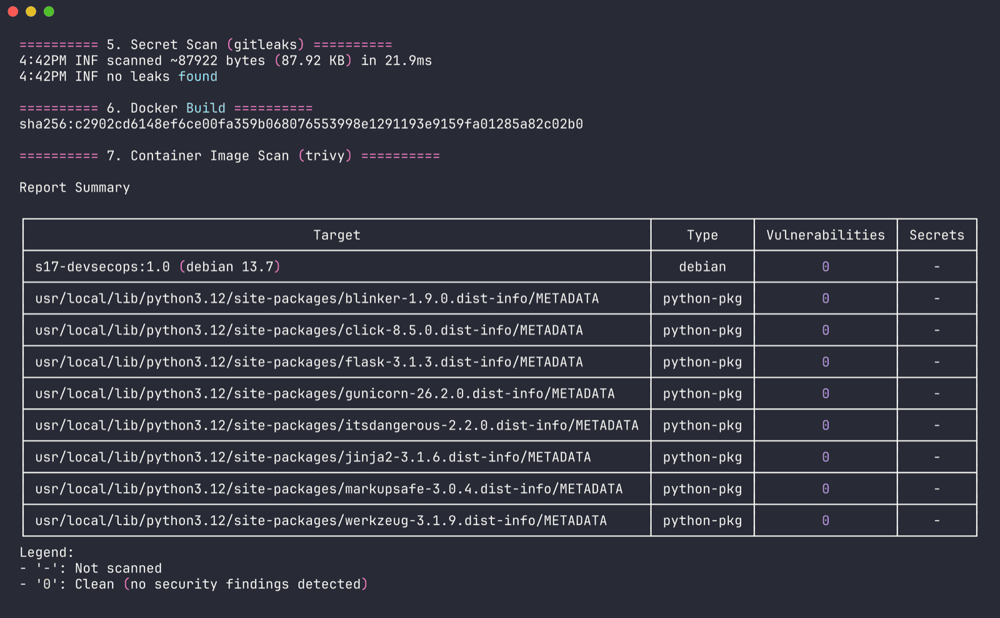

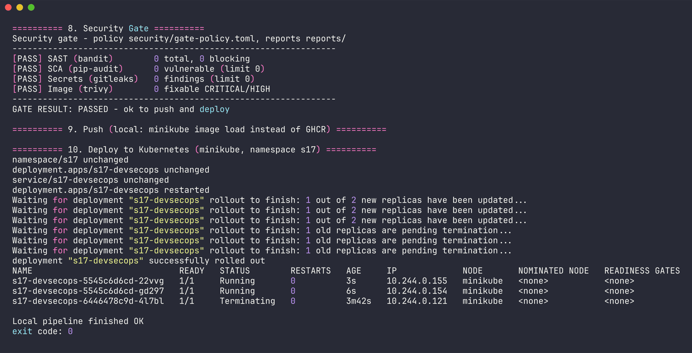

The individual stages below were run one at a time with their full output saved.

## Stage 1 - Build

```bash
python -m venv .venv
pip install -r requirements-dev.txt
pip check
python -m compileall -q app && echo "build ok"
```

```
Successfully installed Flask-3.1.3 Werkzeug-3.1.9 blinker-1.9.0 click-8.5.0 coverage-7.16.2 gunicorn-26.2.0 ...
No broken requirements found.
build ok
```

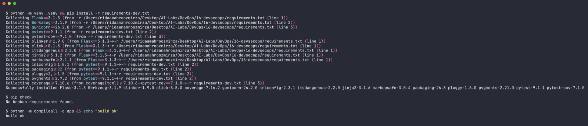

Observations:
- Python doesn't really "build", so this stage is: can the pinned deps install together (`pip check`), and does every file at least compile. It catches typos and dependency conflicts before anything else wastes time.
- I pinned Werkzeug explicitly in `requirements.txt` (the demo only pinned Flask). Werkzeug is where most of Flask's CVEs actually live, so I want its version to be a deliberate choice, not whatever Flask happens to pull.
- Added gunicorn so the container doesn't run the Flask dev server.

Output: [`outputs/01-build.txt`](outputs/01-build.txt)

## Stage 2 - Unit Test

```bash
pytest -v --cov=app --cov-report=term-missing --cov-fail-under=80
```

```
tests/test_app.py::test_home PASSED
tests/test_app.py::test_health PASSED
...
tests/test_app.py::test_pipeline_fail_skips_rest PASSED
tests/test_app.py::test_not_found PASSED

Name              Stmts   Miss  Cover   Missing
-----------------------------------------------
app/app.py          104      7    93%   103, 113-114, 130, 137, 239, 246
TOTAL               104      7    93%
Required test coverage of 80% reached. Total coverage: 93.27%
============================== 13 passed in 0.39s ==============================
```

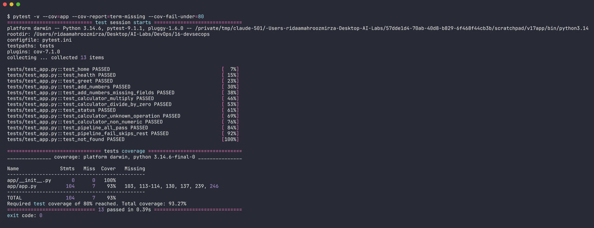

Observations:
- The demo had 8 tests. I added 5: unknown calculator operation, non-numeric input, pipeline simulator with `fail_chance: 0` (all pass) and `fail_chance: 1` (first stage fails, rest skipped), and the JSON 404 handler. The two pipeline tests make the random simulator deterministic by forcing the probability to 0 or 1.
- `--cov-fail-under=80` turns coverage into a gate of its own - if someone adds code without tests and coverage drops, the job fails.
- In CI it also writes `junit.xml` and `coverage.xml` as an artifact.

Output: [`outputs/02-unit-tests.txt`](outputs/02-unit-tests.txt)

## Stage 3 - SAST (bandit)

Tool: **bandit** - reads Python source and flags insecure patterns (debug mode, `eval`, shell injection, weak crypto, hardcoded passwords, binding to all interfaces, ...). Config: `security/bandit.yaml` (excludes `tests/` because pytest's `assert` triggers B101 everywhere; nothing else is skipped).

The instructor CodeQL job is good too, but bandit runs the same locally and in CI, so I could actually show the output here. In CI bandit also uploads SARIF, so findings show up under the repo's Security -> Code scanning tab.

First run, on the demo `app.py` exactly as given:

```bash
bandit -c security/bandit.yaml -r app
```

```
>> Issue: [B201:flask_debug_true] A Flask app appears to be run with debug=True, which exposes the Werkzeug debugger and allows the execution of arbitrary code.
   Severity: High   Confidence: Medium
   Location: app/app.py:234:4
233	if __name__ == "__main__":
234	    app.run(host="0.0.0.0", port=5001, debug=True)

>> Issue: [B104:hardcoded_bind_all_interfaces] Possible binding to all interfaces.
   Severity: Medium   Confidence: Medium
   Location: app/app.py:234:17

>> Issue: [B311:blacklist] Standard pseudo-random generators are not suitable for security/cryptographic purposes.
   Severity: Low   Confidence: High        (x5 - random.choice / random.random / random.uniform / random.randint)

	Total issues (by severity):
		Low: 5
		Medium: 1
		High: 1
exit code: 1
```

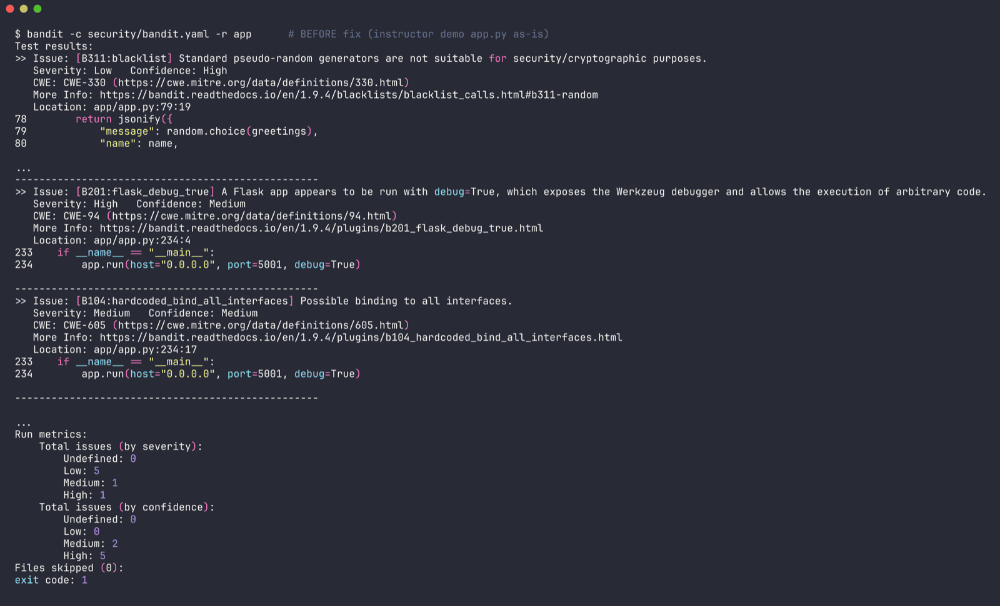

What I fixed in `app/app.py`:
- **B201 (High)** - `debug=True` exposes the Werkzeug interactive debugger, which is literally a Python shell in the browser. Now `debug` only turns on when `FLASK_DEBUG=1` is set, default off. In the container the `__main__` block isn't even used - gunicorn imports `app.app:app`.
- **B104 (Medium)** - host now comes from `APP_HOST`, default `127.0.0.1`. Inside the container gunicorn binds `0.0.0.0` because it has to, but that's a deliberate setting in the Dockerfile, not a hardcoded default in the code.
- **B311 (Low)** - switched `random` to `secrets.SystemRandom()`. Honestly nothing here is security sensitive (it's random greetings and a fake pipeline), but it costs nothing and keeps the report at zero so a real finding later doesn't get lost in noise.
- Also replaced the deprecated `datetime.utcnow()` while I was there.

After the fix:

```
Test results:
	No issues identified.
exit code: 0
```

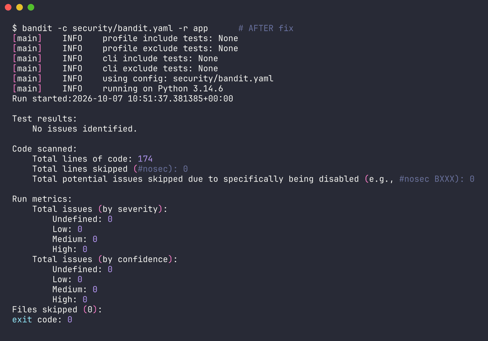

Output: [`outputs/03-sast-bandit-before-fix.txt`](outputs/03-sast-bandit-before-fix.txt), [`outputs/03-sast-bandit-after-fix.txt`](outputs/03-sast-bandit-after-fix.txt)

## Stage 4 - SCA (pip-audit + trivy fs)

SAST looks at *my* code, SCA looks at *other people's* code I depend on.

- **pip-audit** - checks every pinned package (and the transitive ones it resolves) against the PyPI / OSV advisory database.
- **trivy fs** - same idea for dependency files, plus it scans the Dockerfile and the k8s YAML for misconfigurations (running as root, no resource limits, privilege escalation, ...).

```bash
pip-audit -r requirements.txt --strict --desc
trivy fs --config security/trivy.yaml --severity HIGH,CRITICAL .
```

```
No known vulnerabilities found
exit code: 0
```

```
┌─────────────────────┬────────────┬─────────────────┬───────────────────┬─────────┐
│       Target        │    Type    │ Vulnerabilities │ Misconfigurations │ Secrets │
├─────────────────────┼────────────┼─────────────────┼───────────────────┼─────────┤
│ requirements.txt    │    pip     │        0        │         -         │    -    │
│ Dockerfile          │ dockerfile │        -        │         0         │    -    │
│ k8s/deployment.yaml │ kubernetes │        -        │         0         │    -    │
│ k8s/namespace.yaml  │ kubernetes │        -        │         0         │    -    │
│ k8s/service.yaml    │ kubernetes │        -        │         0         │    -    │
└─────────────────────┴────────────┴─────────────────┴───────────────────┴─────────┘
```

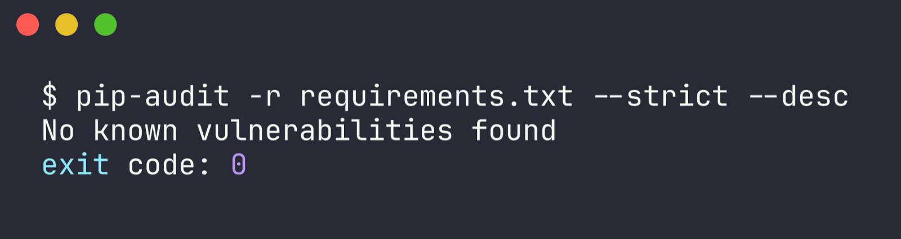

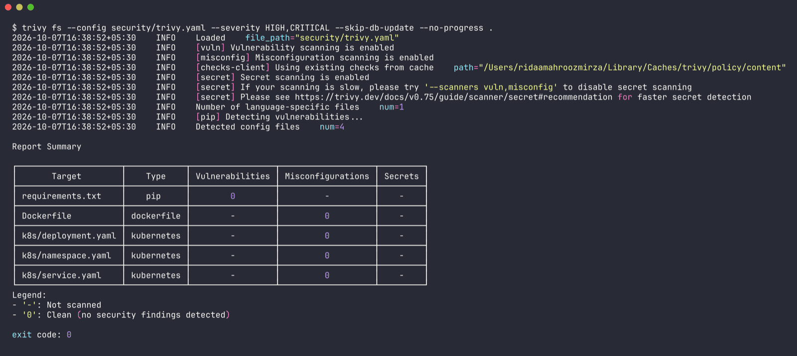

Observations:
- Clean because everything is pinned to current versions (Flask 3.1.3, Werkzeug 3.1.9, gunicorn 26.2.0). The failing side of this is shown in the security gate section, with deliberately old pins.
- 0 misconfigurations on the k8s manifests is the nice one - trivy checks things like `runAsNonRoot`, `readOnlyRootFilesystem`, capabilities and limits, and the deployment passes all of them.

Output: [`outputs/04-sca-pip-audit.txt`](outputs/04-sca-pip-audit.txt), [`outputs/04-sca-trivy-fs.txt`](outputs/04-sca-trivy-fs.txt)

## Stage 5 - Secret Scan (gitleaks)

Tool: **gitleaks** - regex + entropy rules for ~200 credential formats (AWS keys, GitHub tokens, Slack tokens, private keys, generic API keys). Config `security/.gitleaks.toml` extends the default rules and adds one custom rule (`s17-app-api-key`) for an `S17_API_KEY=...` format, just to show how a team adds rules for their own internal tokens.

```bash
gitleaks detect --no-git --source . --config security/.gitleaks.toml --redact -v
```

```
INF scanned ~87933 bytes (87.93 KB) in 22.1ms
INF no leaks found
exit code: 0
```

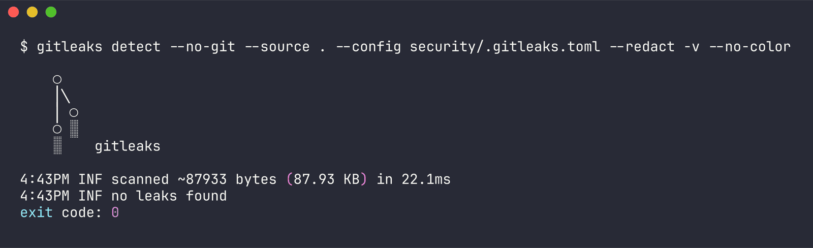

To prove it actually catches things, I did **not** put a fake secret in the repo. I generated a random fake GitHub-token-shaped string and a fake `S17_API_KEY` into a scratch file in `/tmp`, scanned it with the same config, and deleted the file:

```
Finding:     REDACTED
Secret:      REDACTED
RuleID:      github-pat
File:        /tmp/secret-demo/config_leak_demo.py
Line:        3

Finding:     REDACTED
Secret:      REDACTED
RuleID:      s17-app-api-key
File:        /tmp/secret-demo/config_leak_demo.py
Line:        4

WRN leaks found: 2
exit code: 1
```

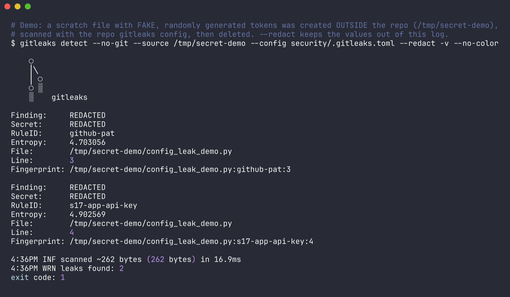

Observations:
- Both the built-in rule and my custom rule fired.
- `--redact` matters: without it gitleaks prints the secret into the CI log, which is a leak of its own.
- `outputs/` and `reports/` are allowlisted in the config since they're generated scanner output, not source.

Output: [`outputs/05-secret-scan-gitleaks-clean.txt`](outputs/05-secret-scan-gitleaks-clean.txt), [`outputs/05-secret-scan-gitleaks-demo-leak.txt`](outputs/05-secret-scan-gitleaks-demo-leak.txt)

## Stage 6 - Docker Build

```bash
docker build -t s17-devsecops:1.0 .
docker inspect s17-devsecops:1.0 --format "User={{.Config.User}} Cmd={{.Config.Cmd}}"
```

```
s17-devsecops:1.0   ceac20d74508        213MB         45.8MB
User=10001:10001 Cmd=[gunicorn --bind 0.0.0.0:5000 --workers 2 --worker-tmp-dir /tmp --no-control-socket --access-logfile - app.app:app]
```

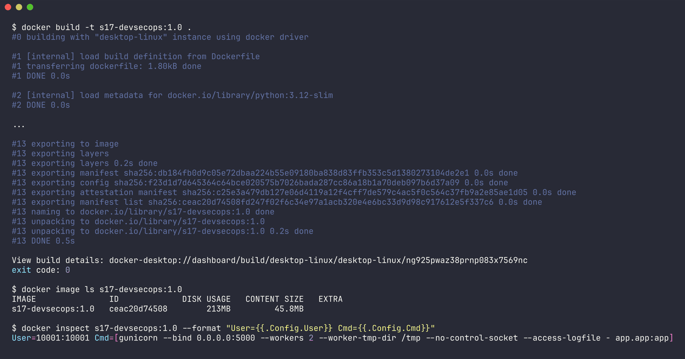

What changed vs the demo Dockerfile:
- **Multi-stage** - deps install in a builder stage, only `/install` is copied over.
- **Non-root** - fixed UID/GID 10001, the same number the k8s `securityContext` enforces.
- **`apt-get upgrade`** at build time, so any Debian fix that exists gets picked up.
- **pip removed from the runtime image** - the first trivy image scan found 6 CVEs (5 MEDIUM, 1 LOW) in the pip 25.0.1 that ships with `python:3.12-slim`. The app never runs pip at runtime, so I just uninstalled it. 6 findings gone, smaller attack surface.
- **gunicorn** instead of `python app/app.py` (the dev server).
- App code owned by root, so the app user can read it but can't change it.
- In CI the image is built **once**, saved as an artifact, and that same tarball is scanned, pushed and deployed. The demo workflow rebuilt the image in each job, which means the image you scanned isn't strictly the one you pushed.

Output: [`outputs/06-docker-build.txt`](outputs/06-docker-build.txt)

## Stage 7 - Container Image Scan (trivy image)

Source can be clean and the image can still be full of vulnerable OS packages from the base image. trivy scans everything installed in the final image: Debian packages and Python site-packages.

```bash
trivy image --config security/trivy.yaml s17-devsecops:1.0          # full report
trivy image --severity HIGH,CRITICAL --ignore-unfixed --exit-code 1 \
  --ignorefile security/.trivyignore s17-devsecops:1.0              # gate threshold
```

Full report:

```
s17-devsecops:1.0 (debian 13.7)
===============================
Total: 165 (UNKNOWN: 2, LOW: 61, MEDIUM: 58, HIGH: 44, CRITICAL: 0)

│ bsdutils │ CVE-2026-76642 │ HIGH │ 1:2.41.5-0+deb13u1 │ (no fix) │ util-linux: failed external mount helper ...
...
Python packages: 0 vulnerabilities (flask, werkzeug, gunicorn, jinja2, ...)
```

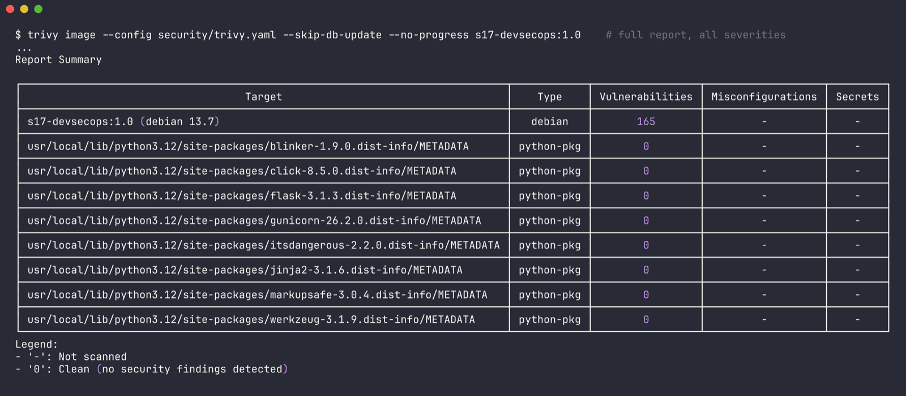

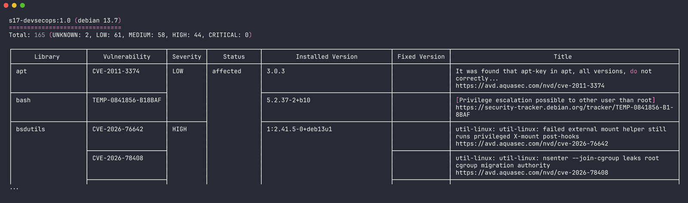

At the gate threshold (HIGH/CRITICAL that actually have a fix):

```
│ s17-devsecops:1.0 (debian 13.7)        │   debian   │        0        │
│ ...flask-3.1.3.dist-info/METADATA      │ python-pkg │        0        │
│ ...werkzeug-3.1.9.dist-info/METADATA   │ python-pkg │        0        │
exit code: 0
```

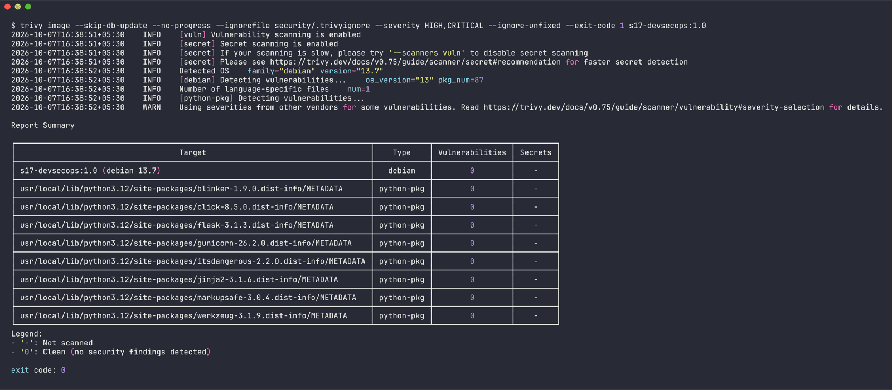

Observations:
- 44 HIGH sounds bad, but I checked the JSON: 43 are status `affected` with no fixed version, and 1 is `fix_deferred` (perl-base). Debian hasn't shipped fixes for any of them yet, and `apt-get upgrade` already pulled every fix that exists. So there's nothing I can do about them today except watch for a fix.
- That's why the gate uses `ignore_unfixed = true`: block on what's fixable (that's a real "you forgot to update" problem), report the rest. If I blocked on unfixed CVEs the pipeline would just be permanently red and people would learn to ignore it.
- I left `.trivyignore` empty on purpose, with rules for how an entry has to be justified. Ignoring things just to make the gate green defeats the point.
- A distroless or Chainguard Python base would cut most of these 165 down. I stayed on `python:3.12-slim` because it's what the session uses, but it's the obvious next step.

Output: [`outputs/07-image-scan-trivy.txt`](outputs/07-image-scan-trivy.txt), [`outputs/07-image-scan-trivy-gate-threshold.txt`](outputs/07-image-scan-trivy-gate-threshold.txt)

## Stage 8 - Security Gate

A scan finds problems; the gate decides what happens. `security/gate.py` reads the 4 JSON reports and applies `security/gate-policy.toml`:

| Check | Report | Blocks when | Why this threshold |
|---|---|---|---|
| SAST | `bandit.json` | any finding with severity >= MEDIUM **and** confidence >= MEDIUM | LOW findings (like B311) are mostly noise in this app; MEDIUM+ are things like debug mode and bind-all |
| SCA | `pip-audit.json` | any known vuln not in the `allow` list (limit 0) | pip-audit has no severity, and the fix is usually just bumping a pin |
| Secrets | `gitleaks.json` | any finding (limit 0) | no such thing as an acceptable leaked secret |
| Image | `trivy-image.json` | HIGH/CRITICAL **with a fixed version**, minus `.trivyignore` | block what we can fix, report what we can't |

A missing report also counts as a FAIL - if a scan silently didn't run, that must not look like a pass.

### Gate FAILING (known-bad case)

To show it actually blocks, I generated a report set from a deliberately bad state:
- `bandit.json` from the original demo `app.py` (before my fix)
- `pip-audit.json` from `security/demo/known-bad-deps.txt` (Flask 2.2.4 / Werkzeug 2.2.3)
- `gitleaks.json` from the fake-token scratch file
- `trivy-image.json` from an image built with the same Dockerfile but those old pins (`s17-devsecops:known-bad`)

The SCA and image scans on their own already fail:

```
$ pip-audit -r security/demo/known-bad-deps.txt
Found 19 known vulnerabilities in 2 packages
flask    2.2.4   PYSEC-2023-62   2.2.5,2.3.2
werkzeug 2.2.3   PYSEC-2023-221  2.3.8,3.0.1
werkzeug 2.2.3   CVE-2026-102598 3.1.9
...
exit code: 1

$ trivy image --severity HIGH,CRITICAL --ignore-unfixed --exit-code 1 s17-devsecops:known-bad
│ Flask (METADATA)    │ CVE-2023-30861 │ HIGH │ fixed │ 2.2.4 │ 2.3.2, 2.2.5 │ flask: Possible disclosure of permanent session cookie ...
│ Werkzeug (METADATA) │ CVE-2024-34069 │ HIGH │ fixed │ 2.2.3 │ 3.0.3        │ python-werkzeug: user may execute code on a developer's machine
exit code: 1
```

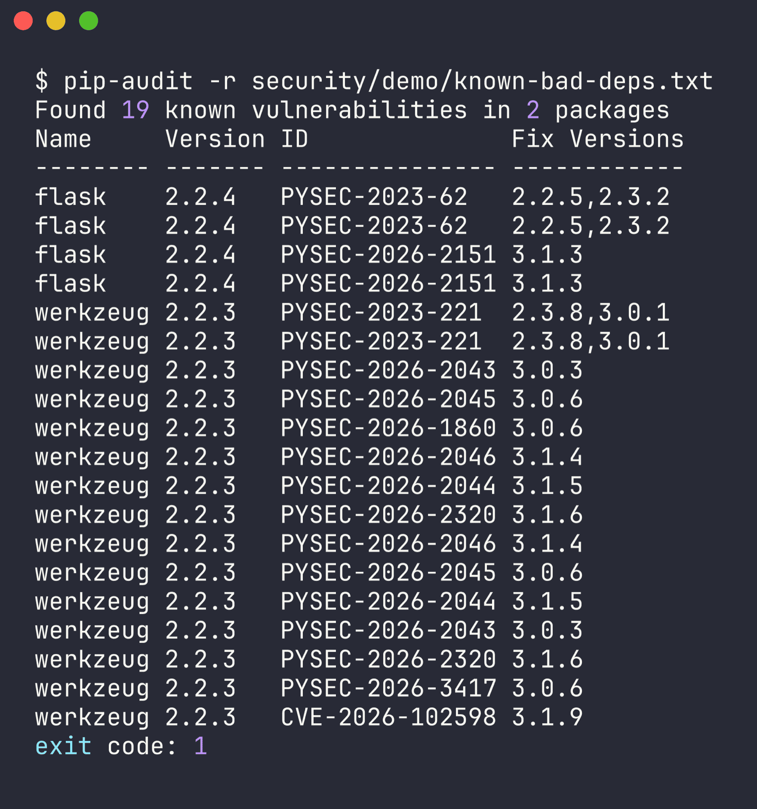

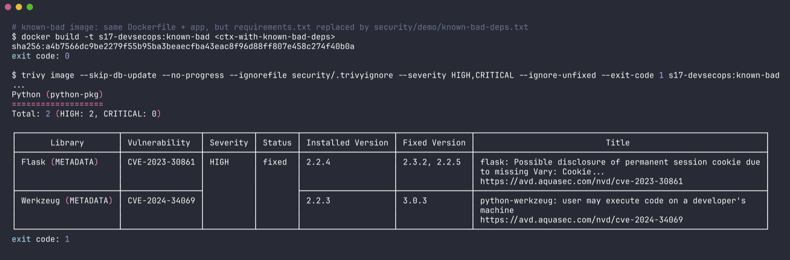

And the gate over all of it:

```
$ python3 security/gate.py --reports reports-bad
Security gate - policy security/gate-policy.toml, reports reports-bad/
----------------------------------------------------------------
[FAIL] SAST (bandit)        7 total, 2 blocking
         - B201 HIGH/MEDIUM app/app.py:234 A Flask app appears to be run with debug=True, ...
         - B104 MEDIUM/MEDIUM app/app.py:234 Possible binding to all interfaces.
[FAIL] SCA (pip-audit)      11 vulnerable (limit 0)
         - flask==2.2.4 PYSEC-2023-62 (fix: 2.2.5,2.3.2)
         - werkzeug==2.2.3 PYSEC-2023-221 (fix: 2.3.8,3.0.1)
         ...
[FAIL] Secrets (gitleaks)   2 findings (limit 0)
         - github-pat /tmp/secret-demo/config_leak_demo.py:3
         - s17-app-api-key /tmp/secret-demo/config_leak_demo.py:4
[FAIL] Image (trivy)        2 fixable CRITICAL/HIGH
         - HIGH CVE-2023-30861 Flask 2.2.4 -> 2.3.2, 2.2.5 (Python)
         - HIGH CVE-2024-34069 Werkzeug 2.2.3 -> 3.0.3 (Python)
----------------------------------------------------------------
GATE RESULT: FAILED - release blocked
exit code: 1
```

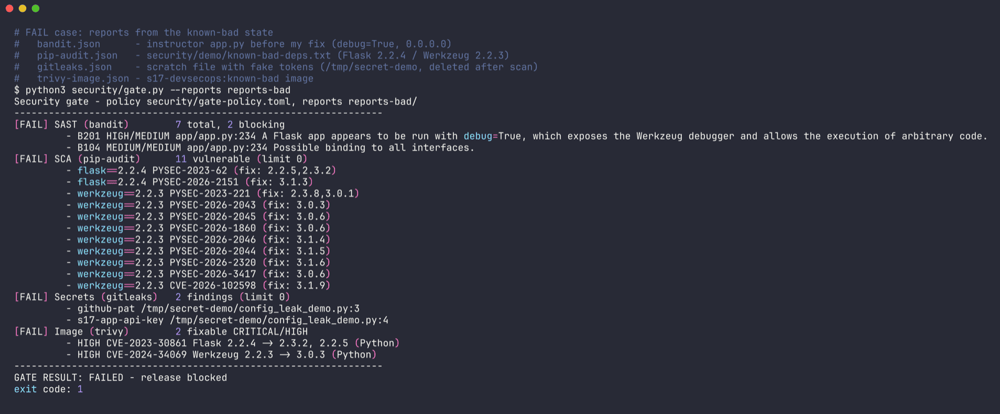

(pip-audit printed 19 rows but some are the same advisory listed twice; the gate de-duplicates by package + ID, so 11 unique.)

Note that bandit found 7 issues but only 2 block - the 5 B311 LOW findings are below the policy threshold. That's the policy doing its job.

### Gate PASSING (after fix)

Fix = the `app.py` changes from stage 3, current pins in `requirements.txt`, no secrets, the hardened image:

```
$ python3 security/gate.py --reports reports
Security gate - policy security/gate-policy.toml, reports reports/
----------------------------------------------------------------
[PASS] SAST (bandit)        0 total, 0 blocking
[PASS] SCA (pip-audit)      0 vulnerable (limit 0)
[PASS] Secrets (gitleaks)   0 findings (limit 0)
[PASS] Image (trivy)        0 fixable CRITICAL/HIGH
----------------------------------------------------------------
GATE RESULT: PASSED - ok to push and deploy
exit code: 0
```

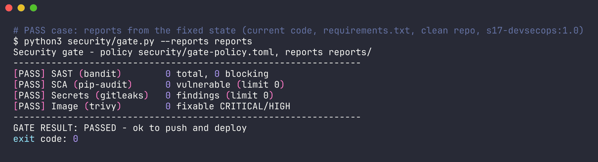

In CI the gate output is also written to the job summary (`$GITHUB_STEP_SUMMARY`), so it shows up on the run page without opening logs.

Output: [`outputs/08-security-gate-FAIL.txt`](outputs/08-security-gate-FAIL.txt), [`outputs/08-security-gate-PASS.txt`](outputs/08-security-gate-PASS.txt), [`outputs/08-gate-demo-sca-known-bad.txt`](outputs/08-gate-demo-sca-known-bad.txt), [`outputs/08-gate-demo-image-known-bad.txt`](outputs/08-gate-demo-image-known-bad.txt)

## Stage 9 - Push Image (GHCR)

Only runs when the gate passed **and** it's a push to `main` (PRs stop after the gate - you don't want every PR publishing images).

```yaml
permissions:
  contents: read
  packages: write          # push to GHCR with GITHUB_TOKEN
  security-events: write   # upload SARIF to code scanning
```

- Logs in with `docker/login-action` using `secrets.GITHUB_TOKEN` - no personal token needed.
- Image name is `ghcr.io/<owner>/s17-devsecops:<git-sha>` plus `:latest`. GHCR rejects uppercase, and my username is `Ridaa10394`, so the owner is lowercased with bash `${GITHUB_REPOSITORY_OWNER,,}` -> `ridaa10394`.
- It pushes the **exact tarball that was scanned** in stage 7 (loaded from the artifact), not a fresh build.

Locally the equivalent step is `minikube image load s17-devsecops:1.0` (that's what `DEPLOY=1 ./scripts/local-pipeline.sh` does).

> TODO (after you push): run the pipeline on `main`, then open the repo -> Packages -> `s17-devsecops` and screenshot the package page showing the tag that matches the commit SHA, and the "Push Image (GHCR)" job log line `Pushed: ghcr.io/ridaa10394/s17-devsecops:<sha>`. Save as `outputs/screenshots/ghcr-package.png`.

## Stage 10 - Deploy to Kubernetes

### The manifests

`k8s/namespace.yaml` - namespace `s17` with Pod Security Admission set to `enforce: restricted`. The API server itself will reject any pod in this namespace that isn't locked down, so this is a gate at the cluster level too.

`k8s/deployment.yaml`:
- 2 replicas, rolling update with `maxUnavailable: 0` (never drop below 2 during a deploy)
- pod: `runAsNonRoot: true`, `runAsUser/runAsGroup: 10001`, `seccompProfile: RuntimeDefault`, `automountServiceAccountToken: false` (the app never talks to the k8s API, so it gets no token to steal)
- container: `readOnlyRootFilesystem: true`, `allowPrivilegeEscalation: false`, `capabilities.drop: [ALL]`, `privileged: false`
- `/tmp` is an in-memory `emptyDir` (16Mi) - the only writable path, for gunicorn's worker heartbeat files
- requests 50m / 64Mi, limits 250m / 192Mi
- startup, readiness and liveness probes all on `/health`

`k8s/service.yaml` - ClusterIP on port 80 -> 5000. I didn't use NodePort because the minikube cluster is shared and fixed node ports can clash.

### Deploying to minikube (local evidence)

```bash
kubectl config current-context        # minikube
minikube image load s17-devsecops:1.0
kubectl apply -f k8s/namespace.yaml
kubectl apply -f k8s/deployment.yaml -f k8s/service.yaml
kubectl -n s17 rollout status deployment/s17-devsecops --timeout=180s
kubectl -n s17 get deploy,rs,pods,svc -o wide
```

```
deployment "s17-devsecops" successfully rolled out

NAME                            READY   UP-TO-DATE   AVAILABLE   AGE   CONTAINERS   IMAGES
deployment.apps/s17-devsecops   2/2     2            2           3s    app          s17-devsecops:1.0

NAME                                 READY   STATUS    RESTARTS   AGE   IP
pod/s17-devsecops-6446478c9d-4l7bl   1/1     Running   0          3s    10.244.0.121
pod/s17-devsecops-6446478c9d-dn7qn   1/1     Running   0          3s    10.244.0.122

NAME                    TYPE        CLUSTER-IP     PORT(S)
service/s17-devsecops   ClusterIP   10.106.209.237   80/TCP
```

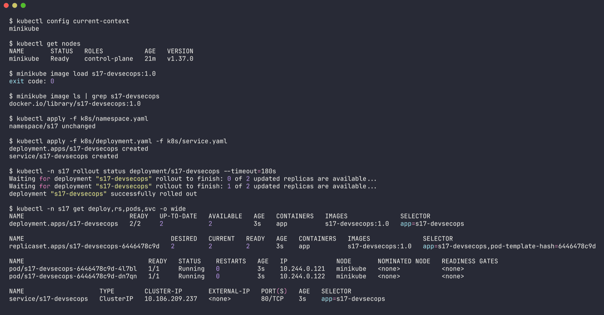

Checking the security context is really applied inside a running pod:

```
$ kubectl -n s17 exec <pod> -- id
uid=10001(app) gid=10001(app) groups=10001(app)

$ kubectl -n s17 exec <pod> -- sh -c 'touch /app/x || echo read-only-root-ok'
touch: cannot touch '/app/x': Read-only file system
read-only-root-ok

$ kubectl -n s17 exec <pod> -- sh -c 'touch /tmp/x && echo tmp-writable-ok'
tmp-writable-ok
```

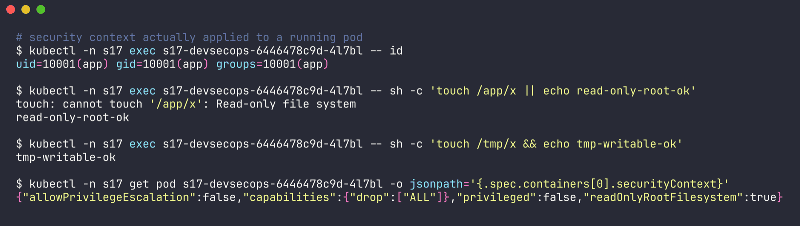

Smoke test through the Service:

```
$ kubectl -n s17 port-forward svc/s17-devsecops 18017:80 &
$ curl -s http://localhost:18017/health
{"status":"healthy","timestamp":"2026-10-07T11:09:18.407801Z","uptime_seconds":4.86}
$ curl -s http://localhost:18017/api/status
{"app":"DevSecOps Dashboard","platform":"Linux","python_version":"3.12.15","status":"running",...}
$ curl -s -X POST -H "Content-Type: application/json" -d '{"a":6,"b":7,"operation":"multiply"}' http://localhost:18017/api/calculate
{"a":6.0,"b":7.0,"expression":"6.0 × 7.0 = 42.0","operation":"multiply","result":42.0,"symbol":"×"}
$ curl -s -o /dev/null -w "%{http_code}\n" http://localhost:18017/
200
```

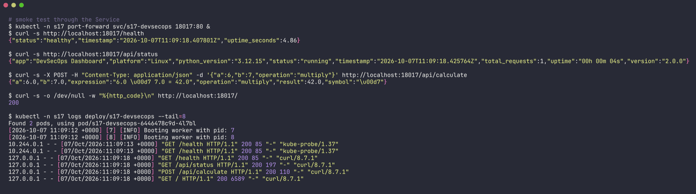

Observations:
- The pods were admitted by the `restricted` Pod Security policy, which confirms the securityContext is complete (it rejects a pod if even one field like seccomp or `drop: ALL` is missing).
- The first deploy actually surfaced a real issue: with a read-only root filesystem, gunicorn 26 logged `Control server error: [Errno 30] Read-only file system: '/home/app'` on startup - it tries to create a control socket in the home directory. The app still worked, but I don't want errors in the logs that everyone learns to ignore. Fixed with `--no-control-socket` in the Dockerfile, rebuilt, redeployed - logs are clean now. Good example of why `readOnlyRootFilesystem` should be tested for real and not just added to the YAML.

Output: [`outputs/10-deploy-minikube.txt`](outputs/10-deploy-minikube.txt) (plus the deploy part of [`outputs/00-local-pipeline-run.txt`](outputs/00-local-pipeline-run.txt), which does a `rollout restart` and shows the rolling update replacing pods one at a time)

### Deploying from GitHub Actions

A GitHub-hosted runner can't reach minikube on my laptop. So the deploy job uses `helm/kind-action` to create a throwaway kind cluster inside the runner, then:

1. logs in to GHCR and pulls the image that stage 9 just pushed
2. `kind load docker-image` (GHCR packages are private by default, so this avoids needing an imagePullSecret in kind)
3. `sed` replaces `image: s17-devsecops:1.0` with `ghcr.io/ridaa10394/s17-devsecops:<sha>`
4. `kubectl apply` the namespace, deployment and service
5. `kubectl rollout status --timeout=180s` - a failed rollout fails the job
6. smoke test: port-forward + `curl -sf /health`, `/api/status`, and `/` must return 200
7. on failure: dumps `describe`, events and logs so the run is debuggable

**Targeting a real cluster instead:** replace the kind and image-load steps with a kubeconfig from a secret:

```yaml
- name: Configure kubeconfig
  run: |
    mkdir -p ~/.kube
    echo "${{ secrets.KUBECONFIG_B64 }}" | base64 -d > ~/.kube/config
    chmod 600 ~/.kube/config
```

`KUBECONFIG_B64` would be a base64 kubeconfig for a ServiceAccount with a Role that can only manage the `s17` namespace (not cluster-admin), stored as an environment secret. Adding `environment: production` to the deploy job makes GitHub require a manual approval before it runs. The cluster then pulls from GHCR with an imagePullSecret (or the package is made public). The rest of the job (apply, rollout status, smoke test) stays the same. This is also written as a comment in the workflow file.

## Pipeline screenshots

> TODO (after you push): push to `main` (any change under `16-devsecops/` triggers it) and screenshot the Actions run graph showing all 10 jobs green in order: Build -> Unit Test -> SAST -> SCA -> Secret Scan -> Docker Build -> Image Scan -> Security Gate -> Push Image -> Deploy. Save as `outputs/screenshots/pipeline-green.png`.

> TODO (after you push): open the "8. Security Gate" job and screenshot the gate table (it's also in the run Summary page). Save as `outputs/screenshots/gate-pass.png`.

> TODO (after you push): to capture a red gate in CI, open a PR that changes `Werkzeug==3.1.9` to `Werkzeug==2.2.3` in `requirements.txt` (do NOT merge it). Screenshot the run stopping at "8. Security Gate" with `GATE RESULT: FAILED`, and Push/Deploy skipped. Save as `outputs/screenshots/gate-fail.png`, then close the PR.

> TODO (after you push): screenshot the "10. Deploy to Kubernetes (kind)" job log showing `deployment "s17-devsecops" successfully rolled out` and the `/health` JSON from the smoke test. Save as `outputs/screenshots/deploy-kind.png`.

> TODO (after you push): if code scanning is enabled for the repo, screenshot Security -> Code scanning showing the `bandit` and `trivy-image` tools. (If it's not enabled, the SARIF upload steps are `continue-on-error` and won't break the run.)

## Security notes

- **No real secrets anywhere.** The secret-scan demo used randomly generated fake tokens in a `/tmp` file that was deleted right after the scan, and the saved output is redacted. The only credential the pipeline uses is the built-in `GITHUB_TOKEN`.
- **Least-privilege token.** Workflow permissions are only `contents: read`, `packages: write`, `security-events: write`.
- **Pinned and verified scanners.** trivy and gitleaks are downloaded at fixed versions and checked against their published SHA-256 before running. I avoided third-party wrapper actions for the security tools, because a compromised scanner action would run with the pipeline's token.
- **Scan what you ship.** One image build, passed as an artifact through scan -> gate -> push -> deploy.
- **The gate fails closed.** A missing report = FAIL.
- **Accepted risk is explicit.** `.trivyignore` and the SCA `allow` list need an ID + reason; both are empty right now.
- **Known residual risk:** 44 HIGH Debian CVEs in `python:3.12-slim` with no fix available yet (reported, not blocking). Plan: rebuild regularly so fixes are picked up as soon as Debian ships them, and move to a distroless/minimal Python base.
- **Runtime hardening:** non-root UID 10001, read-only root filesystem, no capabilities, no privilege escalation, seccomp RuntimeDefault, no service account token, resource limits, `restricted` Pod Security on the namespace.
- **If a real secret ever leaks:** deleting the line is not enough - revoke/rotate it first, then clean history if needed and check for misuse.
- `security/demo/known-bad-deps.txt` is intentionally vulnerable and only exists for the gate demo. Nothing builds from it. It's named without "requirements" in it so Dependabot doesn't treat it as a real manifest.

## What I learned

- A scan without a gate is just a log nobody reads. Putting every threshold in one policy file made it obvious what actually blocks and why.
- "Block on HIGH" has to be qualified with "that has a fix", otherwise the pipeline is red forever because of the base image and people stop caring.
- `readOnlyRootFilesystem` is easy to add and easy to get subtly wrong - gunicorn's control socket only showed up when I actually ran it in the cluster.
- The instructor demo code had a real HIGH finding (`debug=True`) - running bandit on it was a good reminder that demo code ends up in production more often than it should.
