# Session 18 - Terraform S3 Demo

Name: Ridaa Mirza
Enrollment No: 24BCS10394

## Task 1 - Create an S3 bucket with Terraform

Goal: write a small Terraform project that creates a properly locked-down S3 bucket, and go through the whole Terraform workflow: `init -> fmt -> validate -> plan -> apply -> show -> output -> destroy`.

The bucket gets:

- a **random suffix** in its name (S3 names are global, so `ridaa-tf-demo` alone would probably clash)
- **versioning** enabled
- **server-side encryption** (SSE-S3, AES256, with bucket key)
- **public access block** - all four settings on
- **tags** (Name, Environment, Owner, Project + ManagedBy/Session from provider `default_tags`)

I based it on the instructor's `session18-terraform-iac/terraform-s3-demo`, but that one only had the bare bucket, so I added the extra resources. One thing I noticed there: their `outputs.tf` has `type = string` inside `output` blocks, which isn't a valid argument for outputs - `terraform validate` would complain - so I left it out.

### Project structure

```
terraform-s3-demo/
|-- provider.tf        # terraform block (required providers + versions) and the aws provider
|-- variables.tf       # input variables with types, defaults and a validation rule
|-- main.tf            # random_id + bucket + versioning + encryption + public access block
|-- outputs.tf         # values printed after apply
|-- terraform.tfvars   # my values for the variables (non-secret only)
`-- README.md
```

`.gitignore` sits one level up in `17-terraform-iac/` and ignores `.terraform/`, `*.tfstate*` and `crash.log`.

### How the files connect

```
terraform.tfvars ---> variables.tf ---> provider.tf  (region)
                           |
                           v
                        main.tf
                           |
   random_id.suffix ---> local.bucket_name = "<prefix>-<6 hex chars>"
                           |
                           v
                   aws_s3_bucket.demo
                     |       |        \
                     v       v         v
             versioning  encryption  public_access_block
                           |
                           v
                       outputs.tf
```

In AWS provider v4+ the versioning/encryption/public-access settings are separate resources that point at the bucket with `bucket = aws_s3_bucket.demo.id`. That reference is also how Terraform knows to create the bucket first.

### The code

`provider.tf`

```hcl
terraform {
  required_version = ">= 1.6.0"

  required_providers {
    aws = {
      source  = "hashicorp/aws"
      version = "~> 6.0"
    }
    random = {
      source  = "hashicorp/random"
      version = "~> 3.6"
    }
  }
}

provider "aws" {
  region = var.aws_region

  default_tags {
    tags = {
      ManagedBy = "Terraform"
      Session   = "18-terraform-iac"
    }
  }
}
```

`main.tf` (the important bits)

```hcl
resource "random_id" "suffix" {
  byte_length = 3
}

locals {
  bucket_name = "${var.bucket_prefix}-${random_id.suffix.hex}"
}

resource "aws_s3_bucket" "demo" {
  bucket        = local.bucket_name
  force_destroy = var.force_destroy
  tags          = local.common_tags
}

resource "aws_s3_bucket_versioning" "demo" {
  bucket = aws_s3_bucket.demo.id
  versioning_configuration {
    status = var.enable_versioning ? "Enabled" : "Suspended"
  }
}

resource "aws_s3_bucket_server_side_encryption_configuration" "demo" {
  bucket = aws_s3_bucket.demo.id
  rule {
    apply_server_side_encryption_by_default {
      sse_algorithm = "AES256"
    }
    bucket_key_enabled = true
  }
}

resource "aws_s3_bucket_public_access_block" "demo" {
  bucket                  = aws_s3_bucket.demo.id
  block_public_acls       = true
  block_public_policy     = true
  ignore_public_acls      = true
  restrict_public_buckets = true
}
```

`terraform.tfvars`

```hcl
aws_region        = "ap-south-1"
bucket_prefix     = "ridaa-tf-demo"
environment       = "dev"
owner             = "Ridaa Mirza"
enable_versioning = true
force_destroy     = true
```

No access keys anywhere in the code. The AWS provider picks up credentials from `aws configure` / env vars / SSO, so nothing secret ends up in git.

`force_destroy = true` is only because this is a lab - it lets `terraform destroy` delete the bucket even if there are objects (and old versions) inside. For anything real I'd set it to false.

---

## Prerequisites

```bash
terraform version
aws --version
```

My versions (from [outputs/00-terraform-version.txt](../outputs/00-terraform-version.txt) and [outputs/01-aws-identity.txt](../outputs/01-aws-identity.txt)):

```
Terraform v1.16.4
on darwin_arm64

aws-cli/2.35.8 Python/3.14.6 Darwin/25.5.0 source/arm64
```

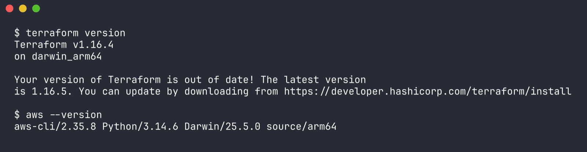

Checking AWS credentials on my laptop:

```bash
aws sts get-caller-identity
```

```
aws: [ERROR]: An error occurred (NoCredentials): Unable to locate credentials. You can configure credentials by running "aws login".
exit code: 253
```

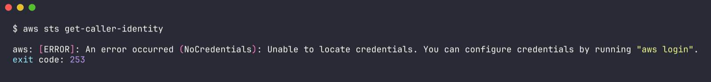

So no AWS account is set up on this machine. Steps 1-3 below don't need one, steps 4+ do.

---

## Step 1 - terraform init

Downloads the providers listed in `required_providers` into `.terraform/` and writes `.terraform.lock.hcl` (pins the exact provider versions - this file is meant to be committed).

```bash
cd 17-terraform-iac/terraform-s3-demo
terraform init
```

Output ([outputs/02-terraform-init.txt](../outputs/02-terraform-init.txt)):

```
Initializing the backend...

Initializing provider plugins...
- Finding hashicorp/aws versions matching "~> 6.0"...
- Finding hashicorp/random versions matching "~> 3.6"...
- Installing hashicorp/random v3.9.1...
- Installed hashicorp/random v3.9.1 (signed by HashiCorp)
- Installing hashicorp/aws v6.67.0...
- Installed hashicorp/aws v6.67.0 (signed by HashiCorp)

Terraform has created a lock file .terraform.lock.hcl to record the provider
selections it made above. ...

Terraform has been successfully initialized!
```

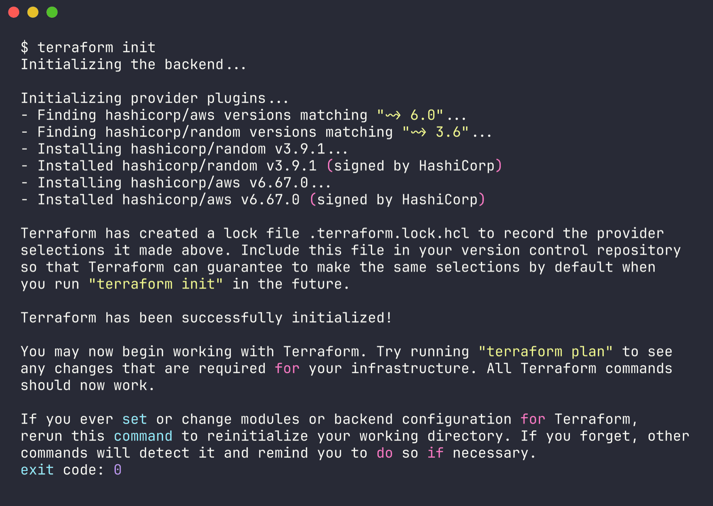

(The AWS provider is a big download - this took a good few minutes on my connection.)

```bash
terraform providers
```

```
Providers required by configuration:
.
├── provider[registry.terraform.io/hashicorp/aws] ~> 6.0
└── provider[registry.terraform.io/hashicorp/random] ~> 3.6
```

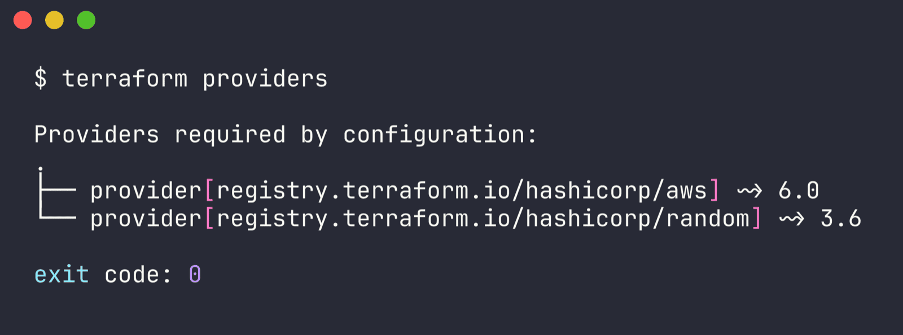

## Step 2 - terraform fmt

Rewrites `.tf` files into the standard style (indentation, aligned `=`). `-check -diff` only reports without changing anything - that's what you'd put in CI.

```bash
terraform fmt -check -diff
terraform fmt
```

Output ([outputs/03-terraform-fmt.txt](../outputs/03-terraform-fmt.txt)):

```
$ terraform fmt -check -diff
exit code: 0

$ terraform fmt
exit code: 0
```

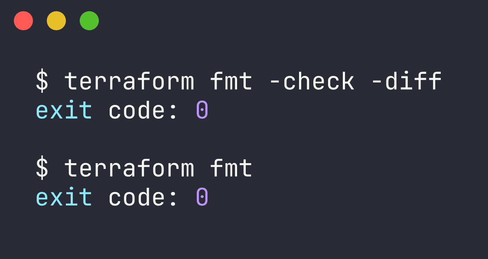

No output and exit 0 = everything was already formatted, nothing to change.

## Step 3 - terraform validate

Checks syntax, references, argument names and types. Doesn't talk to AWS.

```bash
terraform validate
```

Output ([outputs/04-terraform-validate.txt](../outputs/04-terraform-validate.txt)):

```
Success! The configuration is valid.
```


I also tested the validation rule on `bucket_prefix` by passing an invalid name (uppercase + underscore). Variable validation runs during plan ([outputs/07-variable-validation-check.txt](../outputs/07-variable-validation-check.txt)):

```bash
terraform plan -var "bucket_prefix=My_Bucket"
```

```
Error: Invalid value for variable

  on variables.tf line 7:
   7: variable "bucket_prefix" {
    ├────────────────
    │ var.bucket_prefix is "My_Bucket"

bucket_prefix must be 3-41 chars, lowercase letters, numbers and hyphens
only.
```

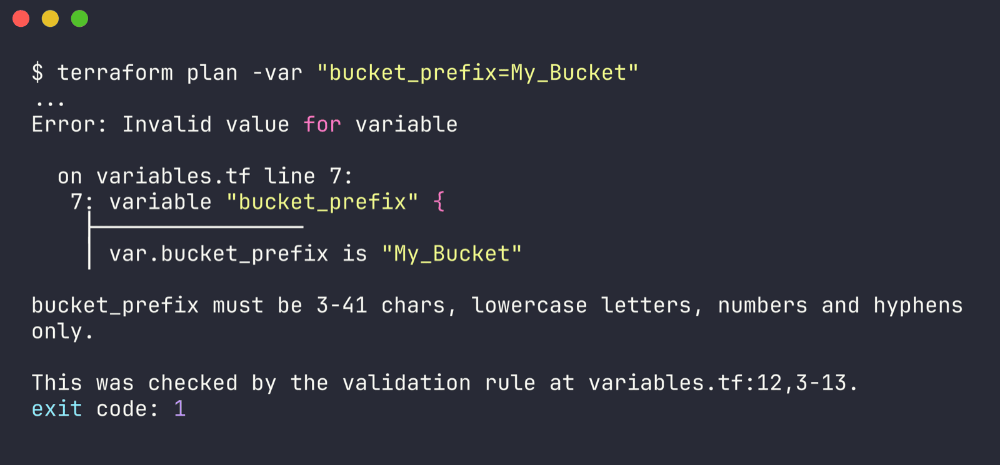

So a bad bucket name gets caught before anything reaches AWS.

## Step 4 - terraform plan

Plan compares the code with the state + real infrastructure and shows what it would create/change/destroy. It needs to call AWS, so it needs credentials.

### What happened on my machine (no credentials)

```bash
terraform plan
```

Output ([outputs/05-terraform-plan-no-creds.txt](../outputs/05-terraform-plan-no-creds.txt)):

```
Terraform planned the following actions, but then encountered a problem:

  # random_id.suffix will be created
  + resource "random_id" "suffix" {
      + byte_length = 3
      + hex         = (known after apply)
      ...
    }

Plan: 1 to add, 0 to change, 0 to destroy.

Error: No valid credential sources found

  with provider["registry.terraform.io/hashicorp/aws"],
  on provider.tf line 16, in provider "aws":
  16: provider "aws" {

Error: failed to refresh cached credentials, no EC2 IMDS role found,
operation error ec2imds: GetMetadata, exceeded maximum number of attempts, 3,
request send failed, Get
"http://169.254.169.254/latest/meta-data/iam/security-credentials/": dial tcp
169.254.169.254:80: connect: host is down
```

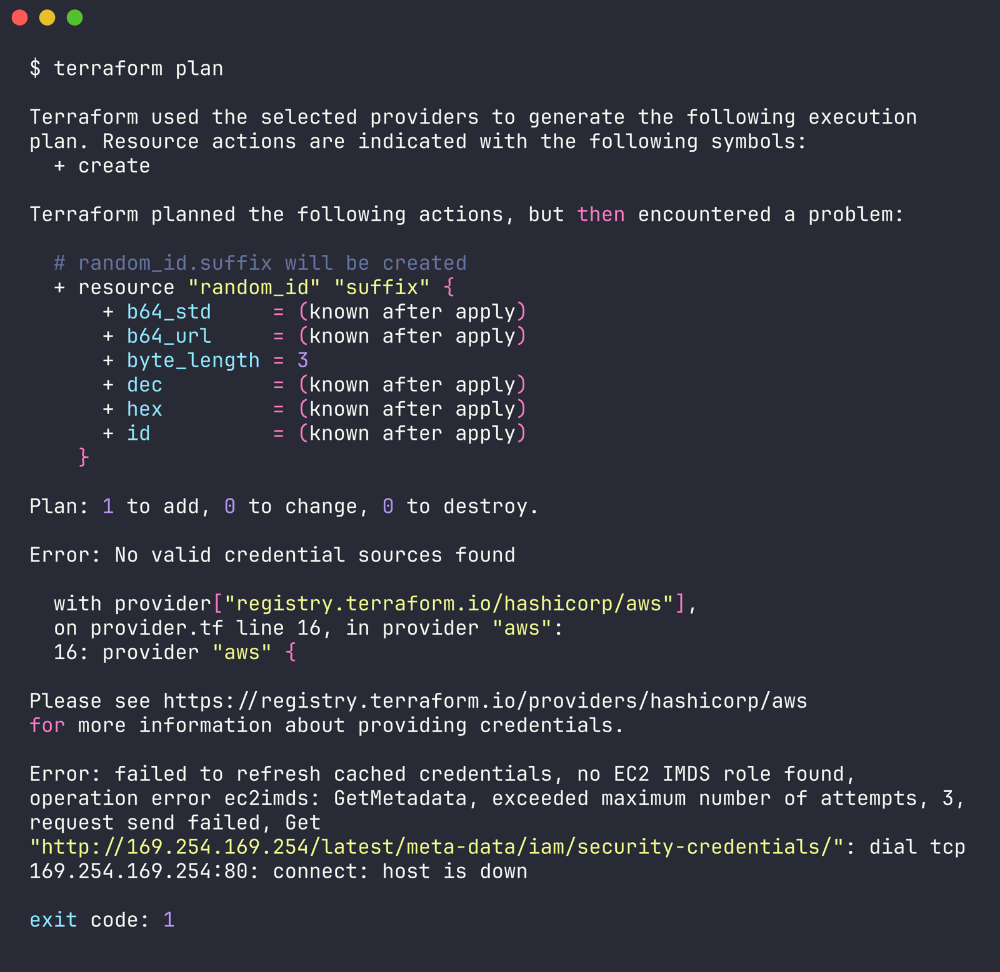

Makes sense - the `random` provider works offline, but the AWS provider goes through its credential chain (env vars -> `~/.aws/credentials` -> SSO -> EC2 instance metadata at 169.254.169.254) and finds nothing. The last attempt is the EC2 metadata endpoint, which obviously doesn't exist on a laptop. It also took a while to fail because of those IMDS retries.

### Offline plan with dummy credentials

Just to see the full plan, I ran it once in a throwaway copy of this folder (in a temp directory, not in the repo) with an extra `override.tf` that sets `skip_credentials_validation`, `skip_requesting_account_id` and `skip_metadata_api_check` to `true`, and fake keys `AWS_ACCESS_KEY_ID=dummy AWS_SECRET_ACCESS_KEY=dummy`. For brand new resources Terraform doesn't need to read anything from AWS, so it can build the plan. Full output in [outputs/09-terraform-plan-offline-dummy-creds.txt](../outputs/09-terraform-plan-offline-dummy-creds.txt):

```
  # aws_s3_bucket.demo will be created
  + resource "aws_s3_bucket" "demo" {
      + bucket                      = (known after apply)
      + force_destroy               = true
      + region                      = "ap-south-1"
      ...
    }

  # aws_s3_bucket_public_access_block.demo will be created
  + resource "aws_s3_bucket_public_access_block" "demo" {
      + block_public_acls       = true
      + block_public_policy     = true
      + ignore_public_acls      = true
      + restrict_public_buckets = true
      ...
    }

  # aws_s3_bucket_server_side_encryption_configuration.demo will be created
      ...
          + bucket_key_enabled       = true
          + apply_server_side_encryption_by_default {
              + sse_algorithm     = "AES256"
            }

  # aws_s3_bucket_versioning.demo will be created
      ...
          + status     = "Enabled"

  # random_id.suffix will be created

Plan: 5 to add, 0 to change, 0 to destroy.

Changes to Outputs:
  + bucket_arn         = (known after apply)
  + bucket_domain_name = (known after apply)
  + bucket_name        = (known after apply)
  + bucket_region      = "ap-south-1"
  + versioning_status  = "Enabled"
```

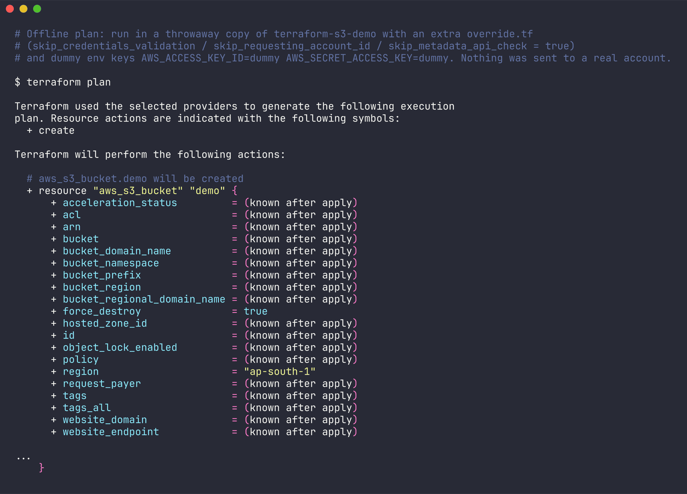

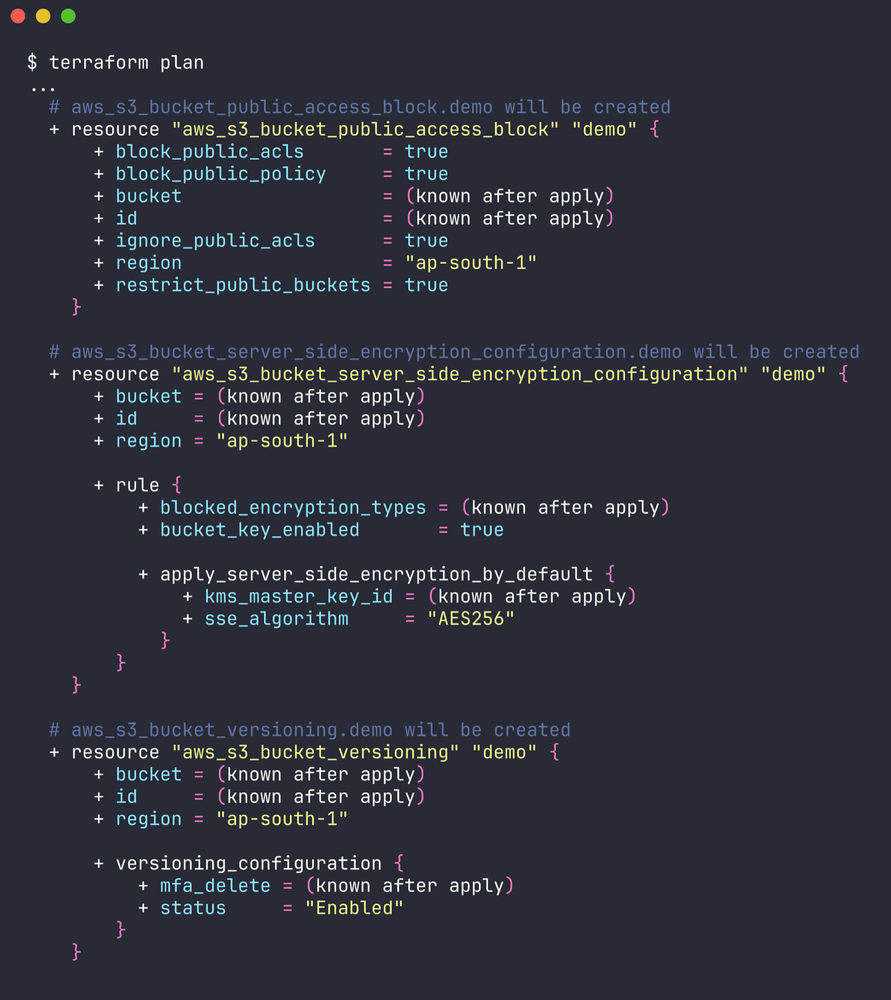

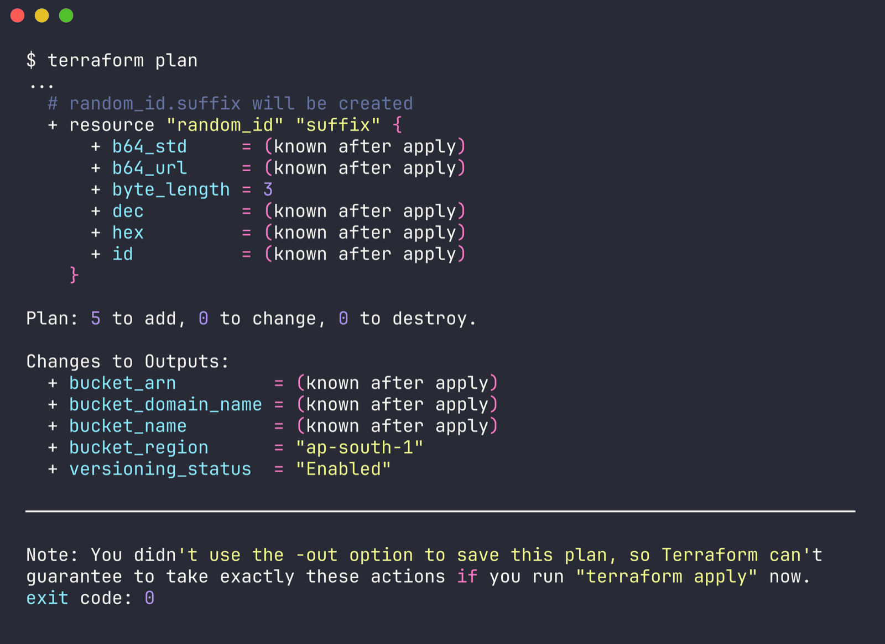

`bucket` shows as `(known after apply)` because the random suffix doesn't exist until apply. This trick is only for looking at the plan - `apply` with fake keys would fail at the first real API call.

> TODO (run on your machine): configure real AWS credentials, then run the real plan
> ```bash
> aws configure            # or: aws configure sso / aws login
> aws sts get-caller-identity
> cd 17-terraform-iac/terraform-s3-demo
> terraform plan -out=tfplan
> ```
> Expected: same 5 resources as above, ending in `Plan: 5 to add, 0 to change, 0 to destroy.` Save the output to `../outputs/10-terraform-plan.txt` and paste the last lines here.

`-out=tfplan` saves the plan so `apply` does exactly that plan and nothing else (`tfplan` is gitignored).

## Step 5 - terraform apply

Actually creates the resources and writes `terraform.tfstate`. Without a saved plan it shows the plan again and waits for `yes`.

> TODO (run on your machine):
> ```bash
> terraform apply tfplan
> # or, without a saved plan:
> terraform apply        # type: yes
> ```
> Expected: resources created in dependency order - `random_id.suffix` first, then `aws_s3_bucket.demo`, then versioning / encryption / public access block in parallel - ending with
> `Apply complete! Resources: 5 added, 0 changed, 0 destroyed.` and the outputs block (`bucket_name = "ridaa-tf-demo-xxxxxx"`, `bucket_region = "ap-south-1"`, `versioning_status = "Enabled"` ...). Save to `../outputs/11-terraform-apply.txt`.

## Step 6 - terraform show / state

`terraform show` prints everything in the state in readable form - every attribute AWS returned. `state list` / `state show` look at one resource at a time.

> TODO (run on your machine):
> ```bash
> terraform show
> terraform state list
> terraform state show aws_s3_bucket.demo
> ```
> Expected `state list`:
> ```
> aws_s3_bucket.demo
> aws_s3_bucket_public_access_block.demo
> aws_s3_bucket_server_side_encryption_configuration.demo
> aws_s3_bucket_versioning.demo
> random_id.suffix
> ```

Right now, before any apply, there's no state at all ([outputs/08-terraform-state-list-empty.txt](../outputs/08-terraform-state-list-empty.txt)):

```
$ terraform state list
No state file was found!
```

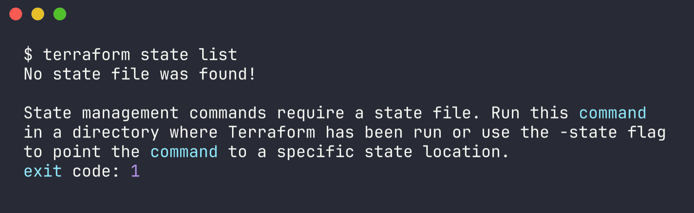

## Step 7 - terraform output

Prints the values from `outputs.tf` out of the state, without touching AWS. `-raw` is handy in scripts.

> TODO (run on your machine):
> ```bash
> terraform output
> terraform output bucket_name
> terraform output -raw bucket_name
> terraform output -json
> ```

### Double check with the AWS CLI

> TODO (run on your machine):
> ```bash
> BUCKET=$(terraform output -raw bucket_name)
> aws s3 ls | grep "$BUCKET"
> aws s3api get-bucket-versioning        --bucket "$BUCKET"   # {"Status": "Enabled"}
> aws s3api get-bucket-encryption        --bucket "$BUCKET"   # SSEAlgorithm AES256, BucketKeyEnabled true
> aws s3api get-public-access-block      --bucket "$BUCKET"   # all four true
> aws s3api get-bucket-tagging           --bucket "$BUCKET"   # Name/Environment/Owner/Project/ManagedBy/Session
>
> # versioning test: upload the same key twice, expect 2 versions
> echo v1 > test.txt && aws s3 cp test.txt "s3://$BUCKET/test.txt"
> echo v2 > test.txt && aws s3 cp test.txt "s3://$BUCKET/test.txt"
> aws s3api list-object-versions --bucket "$BUCKET" --prefix test.txt --query 'Versions[*].[VersionId,IsLatest]'
> ```

### Drift check

If someone changes the bucket by hand in the console (say turns versioning off), the next `terraform plan` shows it as a change to put back. A plan right after apply should say `No changes. Your infrastructure matches the configuration.`

> TODO (run on your machine):
> ```bash
> terraform plan     # expect: No changes. Your infrastructure matches the configuration.
> ```

## Step 8 - terraform destroy

Deletes everything this config created (reverse dependency order). `plan -destroy` previews it first. Because of `force_destroy = true` the bucket goes away even with the test objects/versions still inside.

> TODO (run on your machine):
> ```bash
> terraform plan -destroy
> terraform destroy          # type: yes
> aws s3 ls | grep ridaa-tf-demo || echo "bucket gone"
> ```
> Expected: `Destroy complete! Resources: 5 destroyed.` Save to `../outputs/12-terraform-destroy.txt`. Don't skip this - leftover resources can cost money.

---

## Full workflow in one go

```bash
aws sts get-caller-identity       # make sure creds work
terraform init                    # ran - ok
terraform fmt -check -diff        # ran - ok
terraform validate                # ran - ok
terraform plan -out=tfplan        # TODO - needs AWS creds
terraform apply tfplan            # TODO
terraform show                    # TODO
terraform output                  # TODO
terraform destroy                 # TODO
```

```
 .tf files
    |
    v
 init  --> downloads providers, creates .terraform/ + lock file
    |
    v
 fmt   --> tidy formatting
    |
    v
 validate --> syntax + references OK?
    |
    v
 plan  --> diff between code and real world   (needs creds)
    |
    v
 apply --> create/update in AWS, write terraform.tfstate
    |
    v
 show / output --> read the state
    |
    v
 destroy --> delete everything, state becomes empty
```

## What I took away from this

- `init`, `fmt` and `validate` are fully offline - good for CI to run on every PR without any cloud access.
- `plan` is the first command that needs real credentials, even when everything is brand new, because the provider validates credentials and looks up the account ID up front.
- Splitting versioning/encryption/public-access into their own resources is how the AWS provider wants it now; the old inline `versioning {}` blocks on `aws_s3_bucket` are deprecated.
- `random_id` is a neat way to deal with globally unique names, and it stays the same between applies because it's saved in state.
- State files and `.terraform/` should never be committed - state can hold secrets and `.terraform/` is hundreds of MB of provider binaries.
