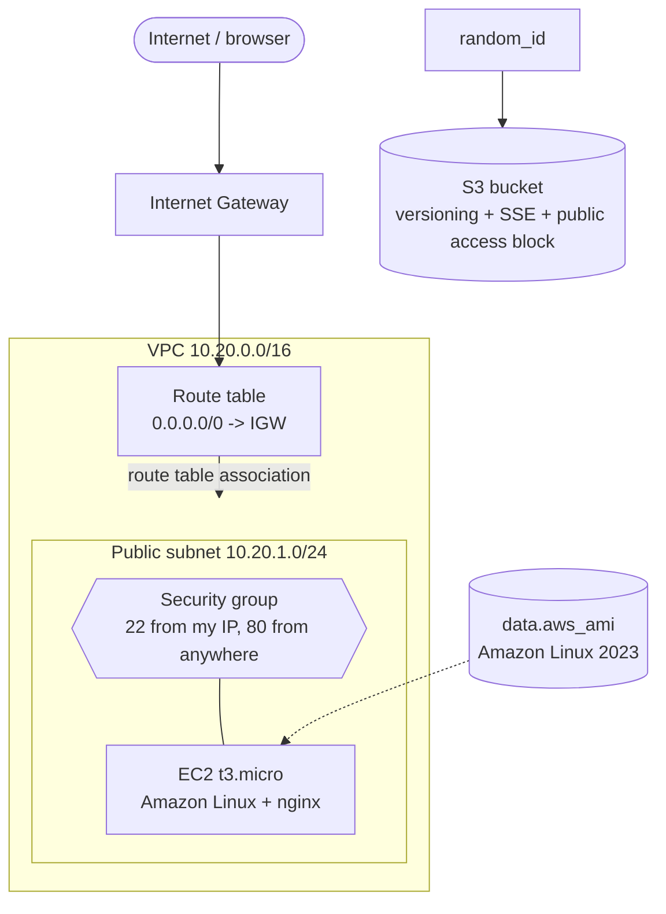
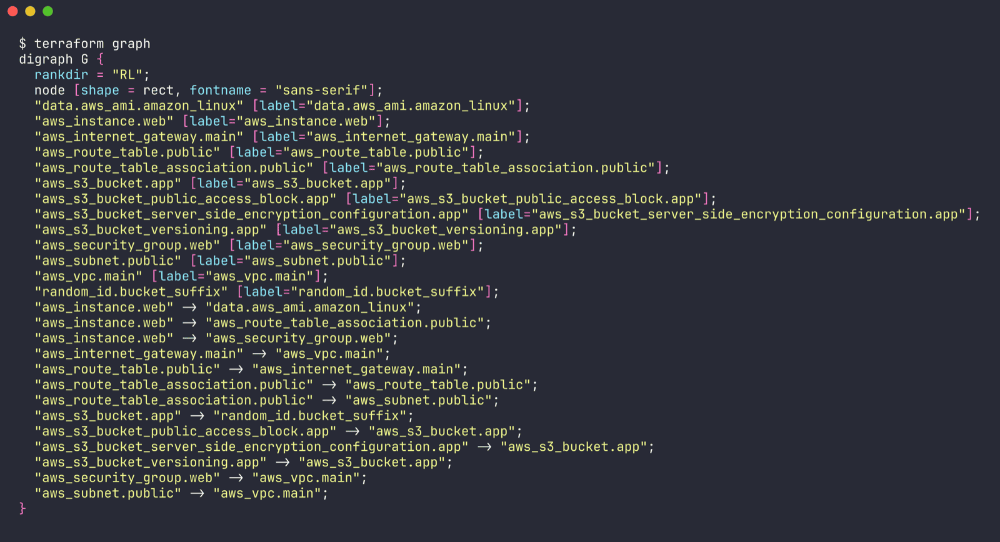
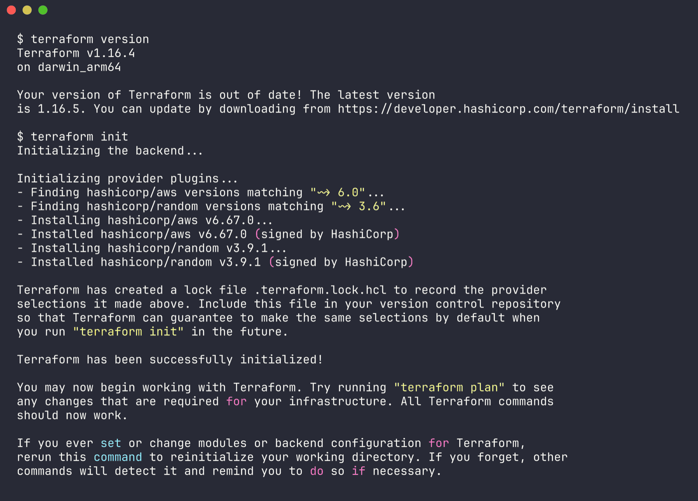
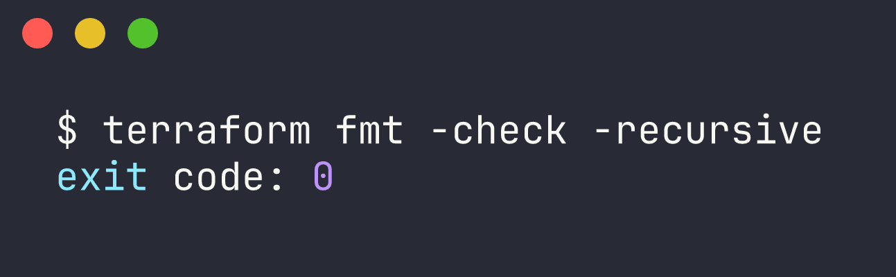
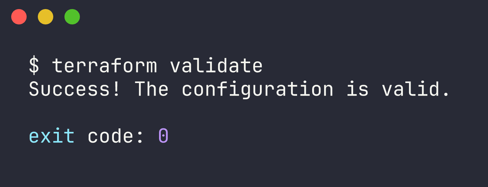
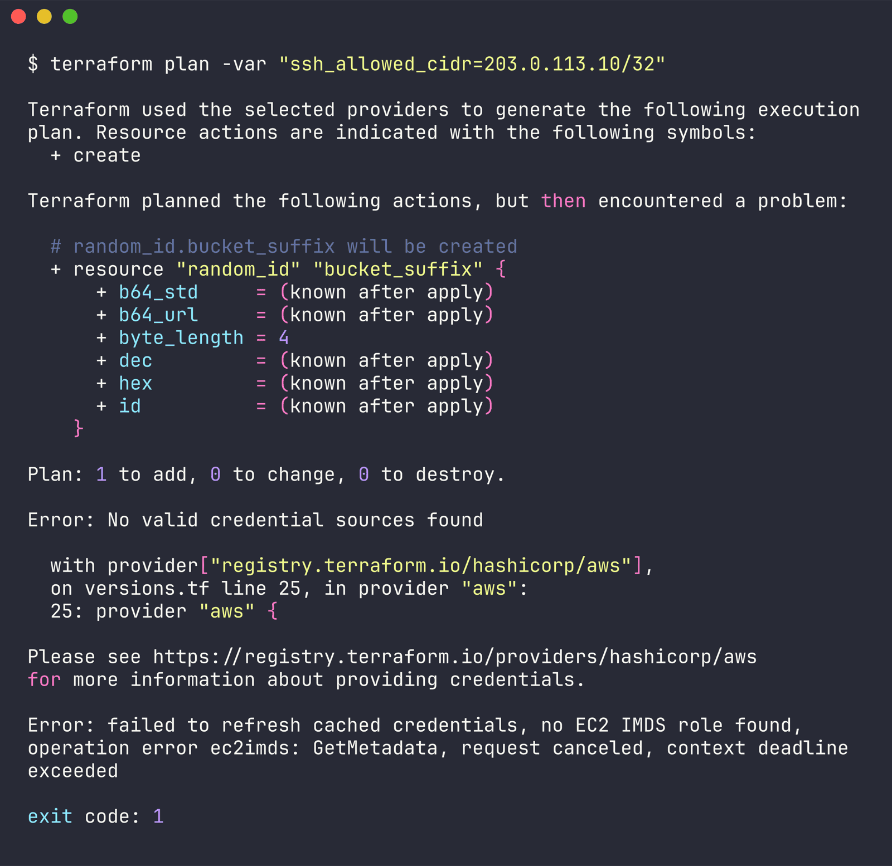

# Session 19 - Cloud & Terraform in Action

Name: Ridaa Mirza
Enrollment No: 24BCS10394

## Overview

For this one I built a small but complete AWS setup with Terraform, end to end: a VPC with a public subnet, an internet gateway and route table, a security group, an EC2 instance that serves a hello page through nginx, and an S3 bucket that's locked down (versioning, encryption, no public access). I started from the instructor's `08-mini-project` and `06-terraform-vpc` and extended them with the EC2 + S3 parts that were left as the "optional extension".

The point is to touch every core Terraform idea in one project: providers, variables, resources, data sources, outputs, implicit and explicit dependencies, state, and the plan / apply / destroy loop.

### Files

```
18-cloud-terraform/
|-- versions.tf                # terraform + provider requirements, provider "aws" block
|-- variables.tf               # all inputs (region, CIDRs, instance type, SSH CIDR, key)
|-- vpc.tf                     # VPC, subnet, IGW, route table, association, security group
|-- ec2.tf                     # AMI data source + EC2 instance with user_data
|-- s3.tf                      # random suffix + bucket, versioning, encryption, public access block
|-- outputs.tf                 # vpc_id, subnet_id, instance IP/URL, bucket name, ...
|-- terraform.tfvars.example   # copy to terraform.tfvars and fill in
|-- .terraform.lock.hcl        # provider version lock (this one IS meant to be committed)
|-- .gitignore                 # .terraform/, *.tfstate*, real tfvars
`-- outputs/                   # raw output of every command I actually ran
```

## Task 1 - Architecture

### ASCII

```
                          Internet
                             |
                             v
                  +---------------------+
                  |  Internet Gateway   |
                  +----------+----------+
                             |
  +--------------------------+------------------------------+
  |  VPC  10.20.0.0/16                                      |
  |                                                         |
  |   Route table: 0.0.0.0/0 -> IGW                         |
  |        |  (route table association)                     |
  |        v                                                |
  |   +--------------------------------------------------+  |
  |   |  Public subnet 10.20.1.0/24  (ap-south-1a)       |  |
  |   |                                                  |  |
  |   |   Security group: 22 from var.ssh_allowed_cidr   |  |
  |   |                   80 from 0.0.0.0/0              |  |
  |   |        +-------------------------------+         |  |
  |   |        | EC2 t3.micro, Amazon Linux    |         |  |
  |   |        | user_data -> nginx hello page |         |  |
  |   |        +-------------------------------+         |  |
  |   +--------------------------------------------------+  |
  +---------------------------------------------------------+

  S3 bucket  session19-ridaa-bucket-<random hex>   (regional, outside the VPC)
     - versioning enabled
     - SSE AES256 encryption
     - public access block (all 4 on)
```

### Mermaid



## Task 2 - The concepts, and where they are in the code

### Provider

A provider is the plugin that actually talks to an API. `versions.tf` pins two of them:

```hcl
required_providers {
  aws    = { source = "hashicorp/aws",    version = "~> 6.0" }
  random = { source = "hashicorp/random", version = "~> 3.6" }
}

provider "aws" {
  region = var.aws_region
  default_tags { tags = { Project = var.project_name, Session = "19", ManagedBy = "Terraform", ... } }
}
```

`terraform init` downloads them into `.terraform/` and writes `.terraform.lock.hcl` so everyone gets the same versions. `default_tags` means I don't have to repeat the common tags on every resource. The provider never gets keys in the code - it reads them from `aws configure` / env vars.

### Variables

Everything that changes between environments is in `variables.tf`: region, project name, VPC/subnet CIDRs, instance type, SSH CIDR and an optional key pair name. Two have validation blocks:

- `instance_type` only allows `t2.micro` / `t3.micro` so I can't accidentally launch something expensive.
- `ssh_allowed_cidr` has no default and must be a valid CIDR - so you're forced to think about it instead of opening SSH to the world.

Values go into `terraform.tfvars` (gitignored), with `terraform.tfvars.example` as the template.

### Resources

Each `resource` block is one real thing in AWS. This project has 12 managed resources + 1 data source:

| File | Resources |
|---|---|
| vpc.tf | `aws_vpc.main`, `aws_subnet.public`, `aws_internet_gateway.main`, `aws_route_table.public`, `aws_route_table_association.public`, `aws_security_group.web` |
| ec2.tf | `data.aws_ami.amazon_linux` (data source, read-only), `aws_instance.web` |
| s3.tf | `random_id.bucket_suffix`, `aws_s3_bucket.app`, `aws_s3_bucket_versioning.app`, `aws_s3_bucket_server_side_encryption_configuration.app`, `aws_s3_bucket_public_access_block.app` |

The data source looks up the newest Amazon Linux 2023 AMI at plan time, so I don't hardcode an AMI ID (they're different per region and change constantly). The EC2 `user_data` installs nginx with `dnf` and writes a hello page with my name, then `systemctl enable --now nginx`.

The bucket name gets a random hex suffix because S3 names are globally unique - `session19-ridaa-bucket` alone would probably clash with someone. `force_destroy = true` is there so `terraform destroy` doesn't get stuck on a non-empty versioned bucket.

### Outputs

`outputs.tf` prints the useful values after apply: `vpc_id`, `subnet_id`, `security_group_id`, `ami_id`, `instance_id`, `instance_public_ip`, `website_url` and `bucket_name`. You can read them again any time with `terraform output` or `terraform output -raw website_url` (handy in scripts).

### Dependencies

Terraform works out the order itself from references - that's an **implicit** dependency. For example `aws_subnet.public` uses `vpc_id = aws_vpc.main.id`, so the VPC has to exist first. Same for the IGW, route table, SG, and all the S3 sub-resources pointing at `aws_s3_bucket.app.id`.

There's one **explicit** `depends_on` in `ec2.tf`:

```hcl
depends_on = [aws_route_table_association.public]
```

The instance never references the route table, so without this Terraform could launch it in parallel with the routing. Then user_data would run before the subnet has a route to the IGW, `dnf install nginx` would fail, and the page would never come up. `depends_on` makes Terraform wait for the association first.

`terraform graph` dumps the dependency graph in DOT format. I ran it (full output in [outputs/04-graph.dot.txt](outputs/04-graph.dot.txt)) - these are the edges, and you can see the explicit one sitting next to the implicit ones:

```
"aws_instance.web" -> "data.aws_ami.amazon_linux";
"aws_instance.web" -> "aws_route_table_association.public";      <- the depends_on
"aws_instance.web" -> "aws_security_group.web";
"aws_internet_gateway.main" -> "aws_vpc.main";
"aws_route_table.public" -> "aws_internet_gateway.main";
"aws_route_table_association.public" -> "aws_route_table.public";
"aws_route_table_association.public" -> "aws_subnet.public";
"aws_s3_bucket.app" -> "random_id.bucket_suffix";
"aws_s3_bucket_public_access_block.app" -> "aws_s3_bucket.app";
"aws_s3_bucket_server_side_encryption_configuration.app" -> "aws_s3_bucket.app";
"aws_s3_bucket_versioning.app" -> "aws_s3_bucket.app";
"aws_security_group.web" -> "aws_vpc.main";
"aws_subnet.public" -> "aws_vpc.main";
```



(`aws_instance.web -> aws_subnet.public` isn't listed because the graph is reduced - it's already implied through the route table association.) If you have graphviz you can render it with `terraform graph | dot -Tpng > graph.png`. The VPC chain and the S3 chain don't touch each other at all, so Terraform builds them in parallel.

### State

After apply, Terraform writes `terraform.tfstate` - a JSON map of "resource in my code" -> "real ID in AWS" plus every attribute. That's how the next `plan` knows what exists and what needs to change, and how `destroy` knows what to delete.

Why it's NOT committed (it's in `.gitignore`):

- it can contain sensitive values in plain text (passwords, keys, IPs)
- if two people commit/merge state files you get conflicts and Terraform can lose track of or duplicate real resources
- it's generated data, not source

What *is* committed is `.terraform.lock.hcl` - that's just provider versions.

**Remote state:** on a team you put state in a shared backend instead of a local file. For AWS that's an S3 bucket (versioned + encrypted) with locking, so two `apply`s can't run at once. There's a commented-out example in `versions.tf`:

```hcl
# backend "s3" {
#   bucket       = "ridaa-tfstate-bucket"
#   key          = "session19/terraform.tfstate"
#   region       = "ap-south-1"
#   use_lockfile = true
#   encrypt      = true
# }
```

The state bucket has to exist before `terraform init` can use it (chicken-and-egg), so it's usually created once separately. I left it local for this lab.

## Task 3 - Commands

```bash
cd 18-cloud-terraform
cp terraform.tfvars.example terraform.tfvars
# edit terraform.tfvars -> set ssh_allowed_cidr to "$(curl -s https://checkip.amazonaws.com)/32"

terraform init                 # download providers, set up backend
terraform fmt -recursive       # format all .tf files (use -check in CI)
terraform validate             # syntax + type checks, no AWS calls
terraform plan -out=tfplan     # preview the changes
terraform apply tfplan         # create everything
terraform output               # print outputs
terraform state list           # list what's tracked in state
terraform show                 # full human-readable state
curl "$(terraform output -raw website_url)"
terraform plan -destroy        # preview the teardown
terraform destroy              # delete everything
```

### Actually ran this

There are no AWS credentials on the machine I did this on, so I ran everything that doesn't need an account. Raw logs are in [outputs/](outputs/).

**init** ([outputs/01-init.txt](outputs/01-init.txt))

```
$ terraform init
Initializing the backend...

Initializing provider plugins...
- Finding hashicorp/aws versions matching "~> 6.0"...
- Finding hashicorp/random versions matching "~> 3.6"...
- Installing hashicorp/aws v6.67.0...
- Installed hashicorp/aws v6.67.0 (signed by HashiCorp)
- Installing hashicorp/random v3.9.1...
- Installed hashicorp/random v3.9.1 (signed by HashiCorp)

Terraform has created a lock file .terraform.lock.hcl to record the provider
selections it made above. ...

Terraform has been successfully initialized!
```



**fmt** ([outputs/02-fmt.txt](outputs/02-fmt.txt)) - nothing printed means nothing needed reformatting:

```
$ terraform fmt -check -recursive
exit code: 0
```



**validate** ([outputs/03-validate.txt](outputs/03-validate.txt))

```
$ terraform validate
Success! The configuration is valid.
```



**graph** - see the Dependencies section above ([outputs/04-graph.dot.txt](outputs/04-graph.dot.txt)).

**plan without credentials** ([outputs/05-plan-no-creds.txt](outputs/05-plan-no-creds.txt)) - interesting bit: the `random_id` got planned fine because the random provider doesn't need AWS, but the AWS provider failed as soon as it tried to find credentials:

```
$ terraform plan -var "ssh_allowed_cidr=203.0.113.10/32"
...
  # random_id.bucket_suffix will be created
  + resource "random_id" "bucket_suffix" {
      + byte_length = 4
      ...
    }

Plan: 1 to add, 0 to change, 0 to destroy.

Error: No valid credential sources found

  with provider["registry.terraform.io/hashicorp/aws"],
  on versions.tf line 25, in provider "aws":
  25: provider "aws" {

Please see https://registry.terraform.io/providers/hashicorp/aws
for more information about providing credentials.

Error: failed to refresh cached credentials, no EC2 IMDS role found,
operation error ec2imds: GetMetadata, request canceled, context deadline
exceeded
```



And the AWS CLI agrees ([outputs/06-aws-sts.txt](outputs/06-aws-sts.txt)):

```
$ aws sts get-caller-identity
aws: [ERROR]: An error occurred (NoCredentials): Unable to locate credentials. You can configure credentials by running "aws login".
```


So the config itself is valid; the only thing missing is an AWS account login.

### Still to run with AWS credentials

> TODO (run on your machine): configure credentials and do a real plan + apply
> ```bash
> aws configure            # or: aws login / export AWS_PROFILE=...
> aws sts get-caller-identity
> cd 18-cloud-terraform
> cp terraform.tfvars.example terraform.tfvars
> # set ssh_allowed_cidr in terraform.tfvars to your IP: curl -s https://checkip.amazonaws.com
> terraform plan -out=tfplan 2>&1 | tee outputs/07-plan.txt          # expect: Plan: 12 to add, 0 to change, 0 to destroy.
> terraform apply tfplan 2>&1 | tee outputs/08-apply.txt             # expect: Apply complete! Resources: 12 added
> ```
> Paste the "Plan: ..." and "Apply complete!" lines here.

> TODO (run on your machine): outputs, state and the web page
> ```bash
> terraform output 2>&1 | tee outputs/09-output.txt
> terraform state list 2>&1 | tee outputs/10-state-list.txt
> terraform show 2>&1 | tee outputs/11-show.txt
> # give user_data 1-2 minutes to install nginx, then:
> curl -s "$(terraform output -raw website_url)" | tee outputs/12-curl.txt
> aws s3api get-bucket-versioning --bucket "$(terraform output -raw bucket_name)"
> aws s3api get-public-access-block --bucket "$(terraform output -raw bucket_name)"
> ```
> Expected `terraform state list` (13 lines: 12 resources + the data source):
> ```
> data.aws_ami.amazon_linux
> aws_instance.web
> aws_internet_gateway.main
> aws_route_table.public
> aws_route_table_association.public
> aws_s3_bucket.app
> aws_s3_bucket_public_access_block.app
> aws_s3_bucket_server_side_encryption_configuration.app
> aws_s3_bucket_versioning.app
> aws_security_group.web
> aws_subnet.public
> aws_vpc.main
> random_id.bucket_suffix
> ```
> The curl should return the `<h1>Hello from Terraform - Session 19</h1>` page.

> TODO (run on your machine): console screenshots into `screenshots/`
> - VPC console showing `session19-ridaa-vpc`, its subnet, IGW and route table
> - EC2 console showing `session19-ridaa-web` running + its security group rules
> - Browser on the `website_url` showing the hello page
> - S3 console showing the bucket with versioning, encryption and "Block all public access: On"

> TODO (run on your machine): destroy
> ```bash
> terraform plan -destroy 2>&1 | tee outputs/13-plan-destroy.txt
> terraform destroy 2>&1 | tee outputs/14-destroy.txt              # expect: Destroy complete! Resources: 12 destroyed.
> terraform state list                                             # should print nothing
> ```

## Cost and cleanup warning

- `t2.micro` / `t3.micro` is free-tier eligible (750 hrs/month for the first 12 months on older accounts, or covered by credits on newer ones) - outside that it's a few cents per hour.
- The public IPv4 address on the instance is billed by AWS (~$0.005/hr) even inside the free tier on many accounts.
- VPC, subnet, IGW, route table and security group are free. The S3 bucket is basically free when empty.
- **Run `terraform destroy` as soon as you're done** and check the EC2 console that the instance is actually terminated. Forgetting a running instance is the classic way to get a surprise bill.
- Never open SSH to `0.0.0.0/0` - that's why `ssh_allowed_cidr` has no default.
- Don't commit `terraform.tfvars` or any `*.tfstate` file - the `.gitignore` here covers both.
