# Session 20 - Monitoring, Observability & GitOps

Name: Ridaa Mirza
Enrollment No: 24BCS10394

## Overview

Three parts this time:

1. **Monitoring** - deploy an app that exposes Prometheus metrics, scrape it, query CPU / memory / request rate / health with PromQL, look at logs, and make two alerts actually fire (one from CPU load, one from the app going down). Plus a Grafana dashboard.
2. **Observability** - the theory: metrics vs logs vs traces, why observability matters, the tools, and how it all fits in Kubernetes. That's in its own file: [observability/README.md](observability/README.md).
3. **GitOps** - what GitOps is, then ArgoCD syncing an app from a real Git repo, undoing manual changes (self-heal), detecting drift, and rolling forward when the Git revision changes.

Everything ran on my local minikube (docker driver, 4 CPU / 6 GB, macOS arm64), which other homework namespaces were sharing at the same time, so I kept the stack small and only used my own namespaces: `s20-monitoring`, `s20-app` and `argocd`. Every command output below is copied from the raw files in [`outputs/`](outputs/), and in [`screenshots/`](screenshots/) the PNGs 01-05 are real browser captures of the port-forwarded UIs, while 06 onwards are terminal screenshots of the command outputs.

I based this on the instructor's `session20-monitoring-observability-gitops/01..08` folders. They use docker-compose for Prometheus/Grafana. I used the in-cluster version (kube-prometheus-stack + the Prometheus Operator), so scrape config and alert rules are Kubernetes YAML too.

### Files

```
19-monitoring-gitops/
|-- README.md                               # this file (Task 1 + Task 3)
|-- observability/README.md                 # Task 2 - observability theory
|-- monitoring/
|   |-- kps-values.yaml                     # lean kube-prometheus-stack helm values
|   |-- app.yaml                            # podinfo app (namespace, deployment w/ probes, service)
|   |-- servicemonitor.yaml                 # tells Prometheus to scrape podinfo /metrics
|   |-- prometheusrule.yaml                 # PodinfoDown / PodinfoHighCPU / PodinfoHighMemory alerts
|   |-- load-generator.yaml                 # curl pod used to push traffic at podinfo
|   `-- grafana-dashboard-podinfo.json      # custom dashboard, imported via the Grafana API
|-- gitops/
|   |-- app/deployment.yaml, service.yaml   # MY GitOps app (what ArgoCD should sync after I push)
|   |-- argocd-application.yaml             # Application -> Ridaa10394/DevOps, path 19-monitoring-gitops/gitops/app
|   |-- argocd-application-instructor.yaml  # Application used for the live self-heal / drift demo
|   |-- argocd-application-commit-demo.yaml # Application used for the "Git revision changes" demo
|   `-- argocd-values.yaml                  # lean Argo CD helm values
|-- outputs/                                # raw command outputs (00 ... 18)
`-- screenshots/                            # Grafana, Prometheus and ArgoCD UI captures
```

---

## Task 1 - Monitoring

The six things this task asks for, and where each one shows up:

| Requirement | How I showed it | Output |
|---|---|---|
| Metrics | podinfo `/metrics` -> ServiceMonitor -> Prometheus, PromQL over the HTTP API | 02, 03, 04 |
| Logs | `kubectl logs` (JSON request logs), `kubectl get events` | 06 |
| Alerts | PrometheusRule with 3 alerts; `PodinfoHighCPU` and `PodinfoDown` actually went pending -> firing -> resolved | 08, 09b, 09c |
| CPU utilization | `container_cpu_usage_seconds_total`, `kubectl top`, node-exporter | 04, 05, 09b |
| Memory utilization | `container_memory_working_set_bytes`, % of limit via kube-state-metrics | 04, 05 |
| Application health | liveness/readiness probes, `up` metric, `kube_deployment_status_replicas_available` | 04, 07, 09c |

### Step 1 - install kube-prometheus-stack (lean)

`kube-prometheus-stack` gives you Prometheus, the Prometheus Operator, Alertmanager, Grafana, kube-state-metrics and node-exporter in one chart. The defaults are a bit heavy for a shared minikube, so [`monitoring/kps-values.yaml`](monitoring/kps-values.yaml) trims it down:

- Prometheus: `retention: 6h`, 400Mi request / 900Mi limit, scrape every 15s
- Alertmanager: no persistence, 2h retention, 64Mi limit
- Grafana: no persistence, plugin preinstall turned off
- etcd / controller-manager / scheduler / kube-proxy scraping turned off (minikube doesn't expose them, so they'd just sit at `up=0` and fire noise)
- `serviceMonitorSelectorNilUsesHelmValues: false` (and the same for rules), so Prometheus picks up *my* ServiceMonitor and PrometheusRule from `s20-app`, not only ones carrying the helm release label

```bash
helm repo add prometheus-community https://prometheus-community.github.io/helm-charts
helm repo update

helm install kps prometheus-community/kube-prometheus-stack \
  -n s20-monitoring --create-namespace -f monitoring/kps-values.yaml
```

```
NAME: kps
LAST DEPLOYED: Wed Oct  7 17:10:16 2026
NAMESPACE: s20-monitoring
STATUS: deployed
REVISION: 1
DESCRIPTION: Install complete
```

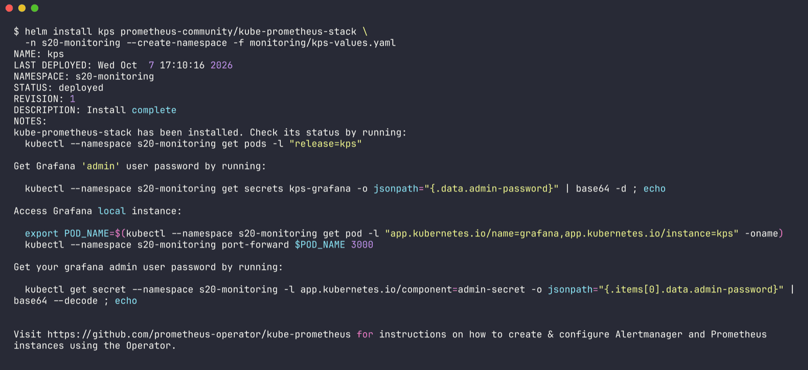

```
$ kubectl get pods -n s20-monitoring
NAME                                                    READY   STATUS    RESTARTS      AGE
alertmanager-kps-kube-prometheus-stack-alertmanager-0   2/2     Running   0             38m
kps-grafana-7c7559fff4-fhtdn                            3/3     Running   0             9m46s
kps-kube-prometheus-stack-operator-5f74d68d6c-q2jgj     1/1     Running   0             40m
kps-kube-state-metrics-785f74f8db-hcpbc                 1/1     Running   2 (13m ago)   40m
kps-prometheus-node-exporter-vrrx7                      1/1     Running   0             40m
prometheus-kps-kube-prometheus-stack-prometheus-0       2/2     Running   0             38m
```

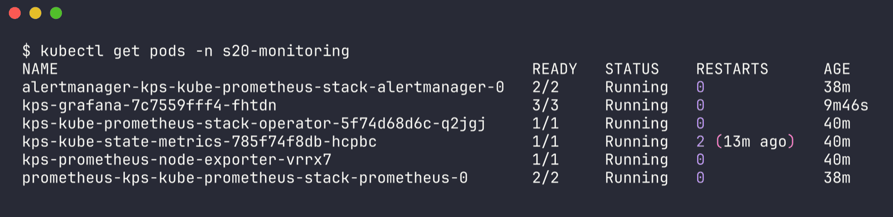

Two problems I hit on the way (both fixed in the values file, outputs `01b` / `01c`):

- **Grafana kept restarting (exit 137).** Events said `Container grafana failed liveness probe, will be restarted`. Grafana 13 runs a lot of migrations on first boot, and on a busy node that took longer than the default liveness window, so the kubelet killed it mid-startup. I gave the liveness probe a 300s initial delay.
- **Grafana dashboards hung on "loading" forever.** `kubectl top` showed the Grafana pod at **2411m CPU and 513Mi** (limit was 512Mi). It was downloading a bunch of "drilldown" app plugins on boot and thrashing at its memory limit. Even the API server timed out once. I set `plugins.preinstall_disabled: true` and raised the limit to 768Mi, and it settled at ~40m CPU / ~410Mi.

### Step 2 - deploy an app that exposes metrics

I used **podinfo** (`ghcr.io/stefanprodan/podinfo:6.9.2`). It's a tiny Go web app made for exactly this kind of demo: Prometheus metrics on `/metrics`, `/healthz` and `/readyz` for probes, and endpoints like `/status/500` to fake errors. [`monitoring/app.yaml`](monitoring/app.yaml) has 2 replicas, a liveness probe on `/healthz`, a readiness probe on `/readyz`, CPU limit 500m, memory limit 128Mi, and `--level=debug` so every request gets logged.

```bash
kubectl apply -f monitoring/app.yaml
kubectl apply -f monitoring/servicemonitor.yaml -f monitoring/prometheusrule.yaml
```

```
namespace/s20-app created
deployment.apps/podinfo created
service/podinfo created
servicemonitor.monitoring.coreos.com/podinfo created
prometheusrule.monitoring.coreos.com/podinfo-alerts created
```

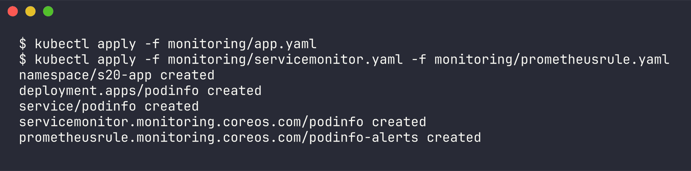

What the app exposes (a `counter` and a `histogram`, via `kubectl port-forward svc/podinfo 9898` after some curl traffic):

```
# HELP http_requests_total The total number of HTTP requests.
# TYPE http_requests_total counter
http_requests_total{status="200"} 530
http_requests_total{status="500"} 200
# TYPE http_request_duration_seconds histogram
http_request_duration_seconds_bucket{method="GET",path="root",status="200",le="0.005"} 200
http_request_duration_seconds_count{method="GET",path="status",status="500"} 200
process_resident_memory_bytes 2.7099136e+07
```

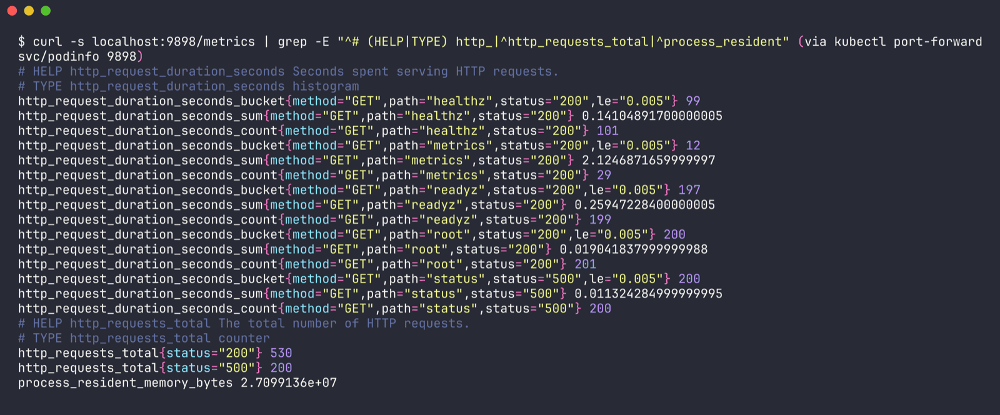

### Step 3 - ServiceMonitor -> Prometheus scrapes it

The [`ServiceMonitor`](monitoring/servicemonitor.yaml) selects Services labelled `app=podinfo` in `s20-app` and scrapes their `http` port at `/metrics` every 15s. The operator turns that into Prometheus scrape config for me. Prometheus found both pods straight away:

```
$ curl -s localhost:9090/api/v1/targets (filtered to s20-app)
serviceMonitor/s20-app/podinfo/0 http://10.244.0.74:9898/metrics health=up lastScrape=2026-10-07T11:59:42 err=''
serviceMonitor/s20-app/podinfo/0 http://10.244.0.75:9898/metrics health=up lastScrape=2026-10-07T11:59:41 err=''
```

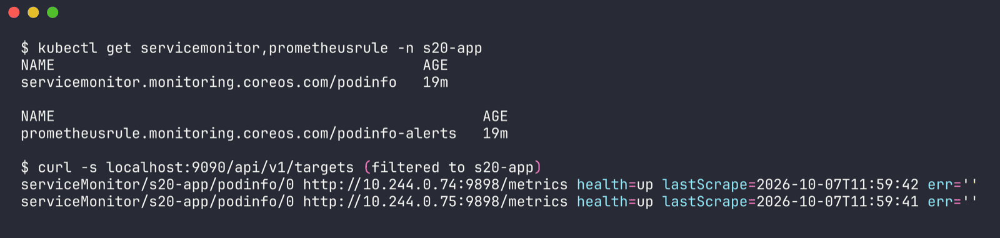

### Step 4 - PromQL: health, CPU, memory, request rate

I ran these against the Prometheus HTTP API (`kubectl port-forward svc/kps-kube-prometheus-stack-prometheus 9090`) while a curl loop from my Mac was sending `/`, `/status/500` and `/api/info` traffic. Full output in [`outputs/04-promql-queries.txt`](outputs/04-promql-queries.txt).

```bash
curl -s -G localhost:9090/api/v1/query --data-urlencode 'query=<PromQL>'
```

**Application health: `up`** (1 = Prometheus scraped the target successfully)

```
up{namespace="s20-app"}
{'pod': 'podinfo-fb64fdd86-c6tt5', 'job': 'podinfo', 'instance': '10.244.0.75:9898'} => 1
{'pod': 'podinfo-fb64fdd86-gktvs', 'job': 'podinfo', 'instance': '10.244.0.74:9898'} => 1
```

**CPU utilization per pod** (cAdvisor counter -> per-second rate = cores used)

```
sum by (pod) (rate(container_cpu_usage_seconds_total{namespace="s20-app", container="podinfo"}[1m]))
{'pod': 'podinfo-fb64fdd86-gktvs'} => 0.00028910000000000047
{'pod': 'podinfo-fb64fdd86-c6tt5'} => 0.03962932519778207

... / 0.5 * 100        # as % of the 500m limit
{'pod': 'podinfo-fb64fdd86-gktvs'} => 0.057820000000000094
{'pod': 'podinfo-fb64fdd86-c6tt5'} => 7.9224726146963285
```

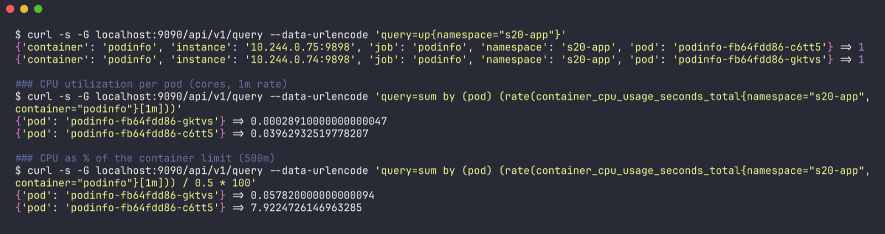

**Memory utilization per pod** (working set is what the OOM killer looks at)

```
sum by (pod) (container_memory_working_set_bytes{namespace="s20-app", container="podinfo"}) / 1024 / 1024
{'pod': 'podinfo-fb64fdd86-gktvs'} => 17.1015625
{'pod': 'podinfo-fb64fdd86-c6tt5'} => 31.7890625

... / kube_pod_container_resource_limits{resource="memory"} * 100     # % of the 128Mi limit
{'pod': 'podinfo-fb64fdd86-gktvs'} => 13.360595703125
{'pod': 'podinfo-fb64fdd86-c6tt5'} => 24.835205078125
```

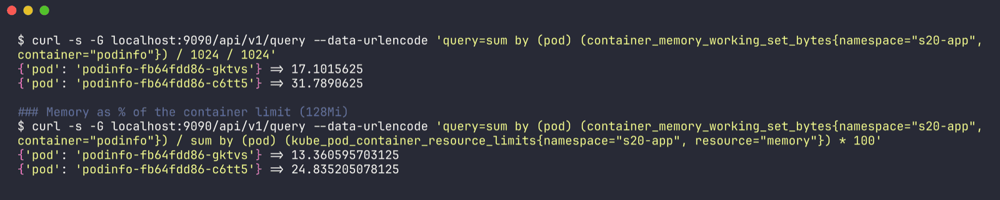

**Request rate, error ratio, latency** (from the app's own metrics)

```
sum by (pod, status) (rate(http_requests_total{namespace="s20-app"}[1m]))
{'pod': 'podinfo-fb64fdd86-c6tt5', 'status': '200'} => 74.66832596279917
{'pod': 'podinfo-fb64fdd86-gktvs', 'status': '200'} => 0.37779456864749544
{'pod': 'podinfo-fb64fdd86-c6tt5', 'status': '500'} => 37.134158536856376

sum(rate(http_requests_total{namespace="s20-app", status=~"5.."}[1m])) / sum(rate(http_requests_total{namespace="s20-app"}[1m]))
{} => 0.33102216223090825

histogram_quantile(0.95, sum by (le, path) (rate(http_request_duration_seconds_bucket{namespace="s20-app"}[1m])))
{'path': 'root'} => 0.004749999999999999
{'path': 'metrics'} => 0.00924999166629628
```

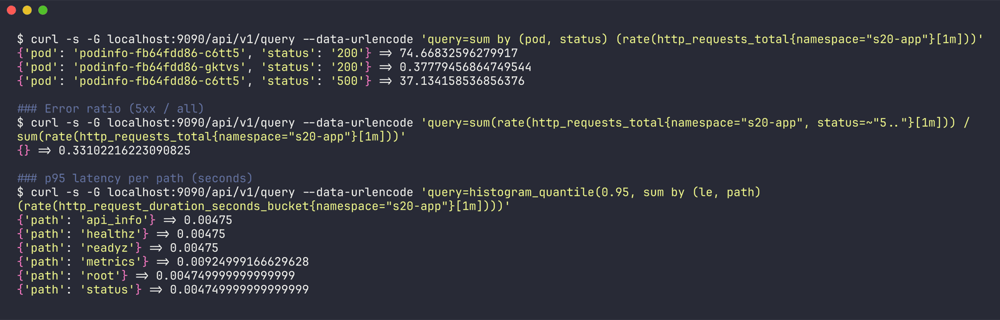

**Cluster-level** (kube-state-metrics + node-exporter)

```
kube_deployment_status_replicas_available{namespace="s20-app"}         => 2
kube_pod_container_status_restarts_total{namespace="s20-app"}          => 0, 0
100 * (1 - avg(rate(node_cpu_seconds_total{mode="idle"}[1m])))         => 10.508615197712567
100 * (1 - node_memory_MemAvailable_bytes / node_memory_MemTotal_bytes) => 76.75994895045122
```

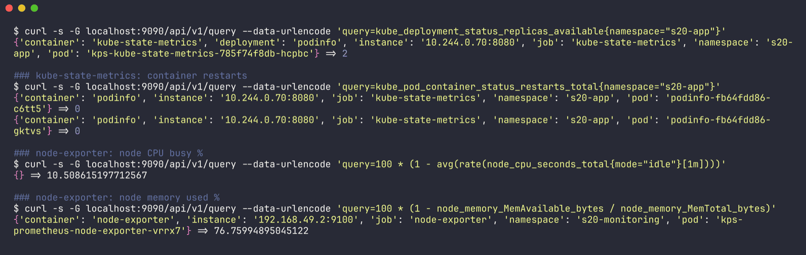

Observations:

- Almost all the traffic went to **one** pod (`c6tt5`). That's not a load-balancing bug: `kubectl port-forward svc/...` picks a single pod and tunnels to it, so it never goes through the Service's load balancing. The other pod only got kubelet probe and Prometheus scrape traffic (~0.38 req/s).
- Error ratio came out at **0.33**, which is right: my loop sent 3 requests per round and one of them was `/status/500`.
- The node memory looks high (76%) because node-exporter sees the whole minikube container, which had the other homework namespaces running on it too.

### Step 5 - kubectl top (metrics-server)

```
$ kubectl top pods -n s20-app
NAME                      CPU(cores)   MEMORY(bytes)
podinfo-fb64fdd86-c6tt5   54m          31Mi
podinfo-fb64fdd86-gktvs   1m           17Mi

$ kubectl top node
NAME       CPU(cores)   CPU(%)   MEMORY(bytes)   MEMORY(%)
minikube   749m         4%       3474Mi          43%
```

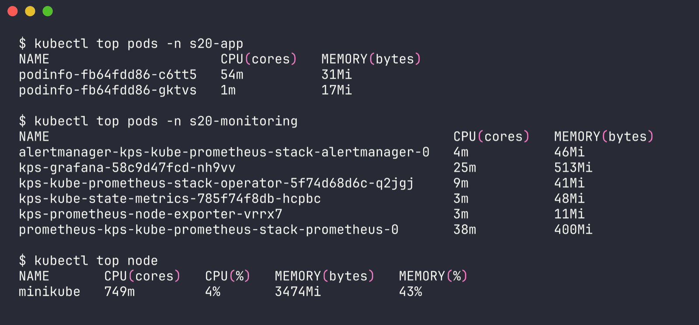

Same numbers as the PromQL above (31Mi vs 31.8MiB, both reading cAdvisor), but `kubectl top` is only "right now". metrics-server keeps no history, so there's nothing to graph or alert on. That's what Prometheus is for.

### Step 6 - logs

podinfo logs JSON to stdout, which the container runtime writes to files on the node, and `kubectl logs` reads them back. With `--level=debug` every request is a line:

```
$ kubectl logs -n s20-app -l app=podinfo --prefix --tail=200 | grep -v -E "healthz|readyz|/metrics" | tail -8
[pod/podinfo-75684b76c7-j4rmb/podinfo] {"level":"info","ts":"2026-10-07T12:01:23.977Z","caller":"podinfo/main.go:153","msg":"Starting podinfo","version":"6.9.2",...,"port":"9898"}
[pod/podinfo-75684b76c7-j4rmb/podinfo] {"level":"debug","ts":"2026-10-07T12:01:42.459Z","caller":"http/logging.go:35","msg":"request started","proto":"HTTP/1.1","uri":"/","method":"GET","remote":"127.0.0.1:36132","user-agent":"curl/8.7.1"}
[pod/podinfo-75684b76c7-j4rmb/podinfo] {"level":"debug","ts":"2026-10-07T12:01:42.483Z","caller":"http/logging.go:35","msg":"request started","proto":"HTTP/1.1","uri":"/status/500","method":"GET","remote":"127.0.0.1:36154","user-agent":"curl/8.7.1"}
[pod/podinfo-75684b76c7-j4rmb/podinfo] {"level":"debug","ts":"2026-10-07T12:01:42.492Z","caller":"http/logging.go:35","msg":"request started","proto":"HTTP/1.1","uri":"/status/404","method":"GET","remote":"127.0.0.1:36166","user-agent":"curl/8.7.1"}

$ kubectl logs -n s20-app -l app=podinfo --prefix --tail=200 | grep readyz | tail -2   # kubelet probes show up too
[pod/podinfo-75684b76c7-j4rmb/podinfo] {"level":"debug",...,"uri":"/readyz","method":"GET","remote":"10.244.0.1:58916","user-agent":"kube-probe/1.37"}
```

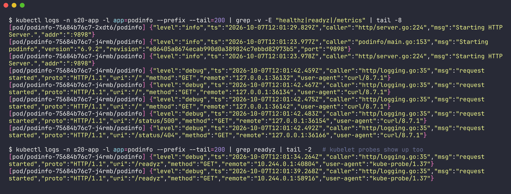

Events are the other "log" Kubernetes gives you. This was the rollout when I switched on debug logging. You can see the readiness probe pulling the old pod out of the Service before it got killed:

```
$ kubectl get events -n s20-app --sort-by=.lastTimestamp | tail
13s   Normal    ScalingReplicaSet   deployment/podinfo           Scaled up replica set podinfo-75684b76c7 from 1 to 2
7s    Warning   Unhealthy           pod/podinfo-fb64fdd86-c6tt5  Readiness probe failed: HTTP probe failed with statuscode: 503
7s    Normal    Killing             pod/podinfo-fb64fdd86-c6tt5  Stopping container podinfo
7s    Normal    ScalingReplicaSet   deployment/podinfo           Scaled down replica set podinfo-fb64fdd86 from 1 to 0
```

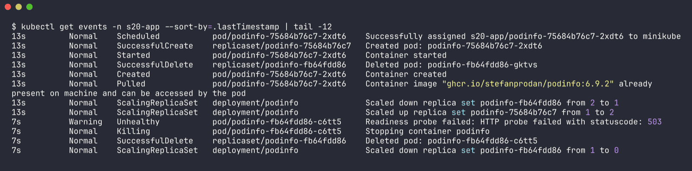

**Why no Loki:** a Loki + Alloy/Promtail DaemonSet is another few hundred MB on a cluster that was already shared with other workloads (and Grafana alone had just eaten 2 cores). `kubectl logs` reads the same node files a log agent would ship. The difference is that once a pod is gone, so are its logs, which is exactly why you run a log pipeline in production. More on that in [observability/README.md](observability/README.md#what-i-didnt-deploy-and-why).

> TODO (run on your machine, optional): `helm install loki grafana/loki` (single-binary mode) + `helm install alloy grafana/alloy`, add Loki as a Grafana data source and run `{namespace="s20-app"} |= "status/500"` in Explore.

### Step 7 - application health (probes + `up`)

```
$ kubectl describe pod -n s20-app -l app=podinfo | grep -E "^Name:|Liveness|Readiness|Ready|Restart Count"
Name:             podinfo-fb64fdd86-c6tt5
    Ready:          True
    Restart Count:  0
    Liveness:     http-get http://:http/healthz delay=3s timeout=1s period=10s successThreshold=1 failureThreshold=3
    Readiness:    http-get http://:http/readyz delay=2s timeout=1s period=5s successThreshold=1 failureThreshold=3

$ kubectl get endpointslices -n s20-app
NAME            ADDRESSTYPE   PORTS   ENDPOINTS                 AGE
podinfo-9km8m   IPv4          9898    10.244.0.75,10.244.0.74   20m
```

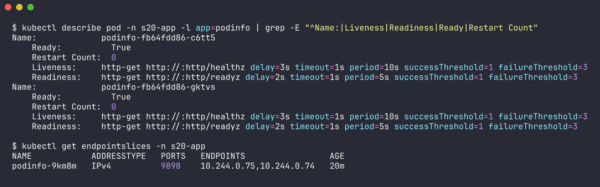

So health is covered at three levels:

- **liveness** - the kubelet restarts the container if `/healthz` stops answering
- **readiness** - the pod is removed from the Service endpoints if `/readyz` fails (seen in the event above)
- **`up` + kube-state-metrics** - Prometheus can alert when nothing healthy is left (the `PodinfoDown` alert below)

### Step 8 - alerts that actually fire

[`monitoring/prometheusrule.yaml`](monitoring/prometheusrule.yaml) has three rules. The operator loaded them into Prometheus as their own rule file:

```
$ curl -s localhost:9090/api/v1/rules  (group podinfo.rules only)
group: podinfo.rules file: /etc/prometheus/rules/prometheus-kps-kube-prometheus-stack-prometheus-rulefiles-0/s20-app-podinfo-alerts-....yaml
  - PodinfoDown | state=inactive | health=ok | for=60
    expr: sum(up{job="podinfo",namespace="s20-app"}) == 0 or absent(up{job="podinfo",namespace="s20-app"})
  - PodinfoHighCPU | state=inactive | health=ok | for=60
    expr: sum by (pod) (rate(container_cpu_usage_seconds_total{container="podinfo",namespace="s20-app"}[1m])) > 0.35
  - PodinfoHighMemory | state=inactive | health=ok | for=120
    expr: max by (pod) (container_memory_working_set_bytes{container="podinfo",namespace="s20-app"}) > 100 * 1024 * 1024

31 rule groups, 223 rules total     # the chart's default rules are loaded too
```

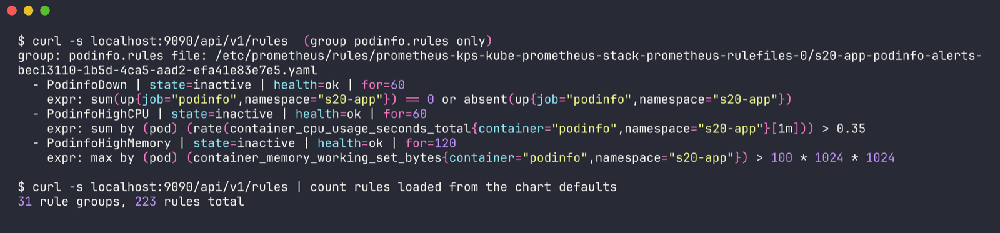

#### Alert 1 - PodinfoHighCPU (load it)

First I tried plain traffic. [`monitoring/load-generator.yaml`](monitoring/load-generator.yaml) runs 8 parallel curl loops inside the cluster. My first version started a new curl process for every request and only managed about 150 req/s. Using curl's URL globbing (`?n=[1-100000]`) keeps one connection open per loop and got it to ~3500 req/s:

```
$ total request rate: sum(rate(http_requests_total{namespace="s20-app"}[1m]))
{} => 3475.619681243129
$ CPU per pod
{'pod': 'podinfo-75684b76c7-2xdt6'} => 0.11973718975666249
{'pod': 'podinfo-75684b76c7-j4rmb'} => 0.12809228654824084
$ /api/v1/alerts (Podinfo*)
(no Podinfo* alerts active)
```

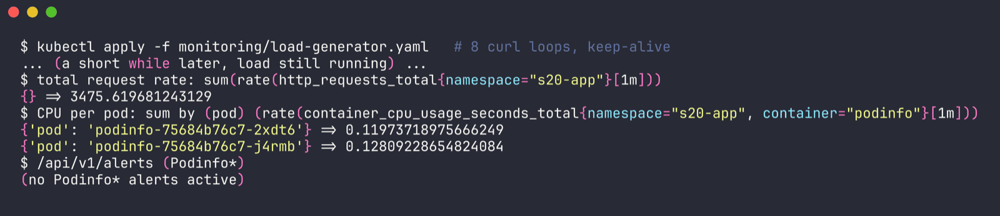

3.5k requests a second and podinfo only used ~0.12 cores per pod. Go is cheap per request, and the load generator (1 CPU limit) would run out before podinfo did. So I used podinfo's built-in `--stress-cpu` flag, which burns CPU on purpose, to simulate a CPU-bound bug:

```bash
kubectl patch deploy podinfo -n s20-app --type=json \
  -p '[{"op":"add","path":"/spec/template/spec/containers/0/command/-","value":"--stress-cpu=1"}]'
```

About 1 minute in - **pending** (the condition is true, but it has to stay true for `for: 1m`):

```
$ kubectl top pods -n s20-app
NAME                       CPU(cores)   MEMORY(bytes)
podinfo-65897dcf9b-mf7hf   501m         16Mi
podinfo-65897dcf9b-vpl7v   501m         15Mi

$ curl -s localhost:9090/api/v1/alerts (Podinfo*)
PodinfoHighCPU | state=pending | activeAt=2026-10-07T12:03:52 | severity=warning | pod=podinfo-65897dcf9b-vpl7v | value=4.121977189631177e-01
PodinfoHighCPU | state=pending | activeAt=2026-10-07T12:03:52 | severity=warning | pod=podinfo-65897dcf9b-mf7hf | value=3.630196052736632e-01
```

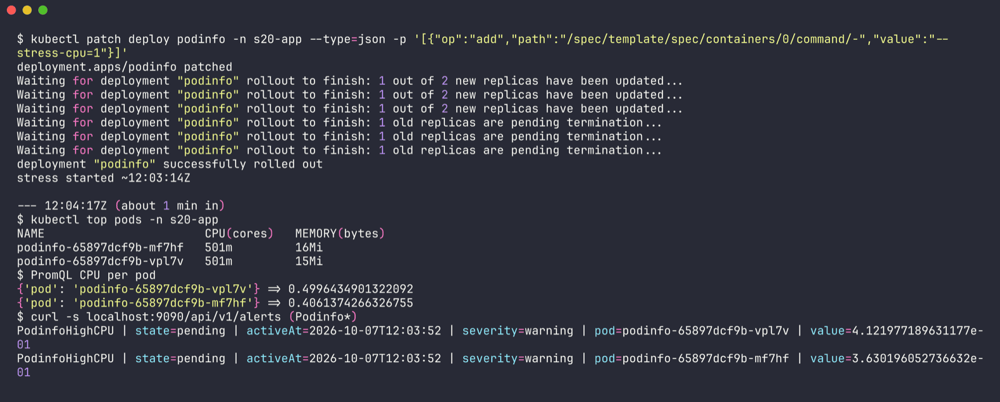

After the `for` window - **firing**, and handed to Alertmanager:

```
--- 12:05:07Z
$ curl -s localhost:9090/api/v1/alerts (Podinfo*)
PodinfoHighCPU | state=firing | activeAt=2026-10-07T12:03:52 | severity=warning | pod=podinfo-65897dcf9b-vpl7v | value=4.9924445702638426e-01
PodinfoHighCPU | state=firing | activeAt=2026-10-07T12:03:52 | severity=warning | pod=podinfo-65897dcf9b-mf7hf | value=4.9719747612551163e-01

$ throttled CFS periods / all CFS periods
{'pod': 'podinfo-65897dcf9b-vpl7v'} => 0.953125
{'pod': 'podinfo-65897dcf9b-mf7hf'} => 1

$ curl -s localhost:9093/api/v2/alerts (Alertmanager, Podinfo*)
PodinfoHighCPU | status=active | startsAt=2026-10-07T12:04:52 | pod=podinfo-65897dcf9b-mf7hf | receivers=null
PodinfoHighCPU | status=active | startsAt=2026-10-07T12:04:52 | pod=podinfo-65897dcf9b-vpl7v | receivers=null
```

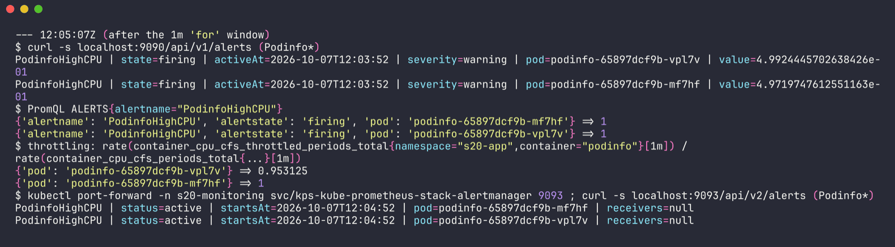

Then `kubectl apply -f monitoring/app.yaml` to put the normal command back, and a few minutes later:

```
--- 12:12:57Z
$ curl -s localhost:9090/api/v1/alerts (Podinfo*)
(no Podinfo* alerts active)
{'pod': 'podinfo-75684b76c7-v5lfm'} => 0.0019791376255168347
```

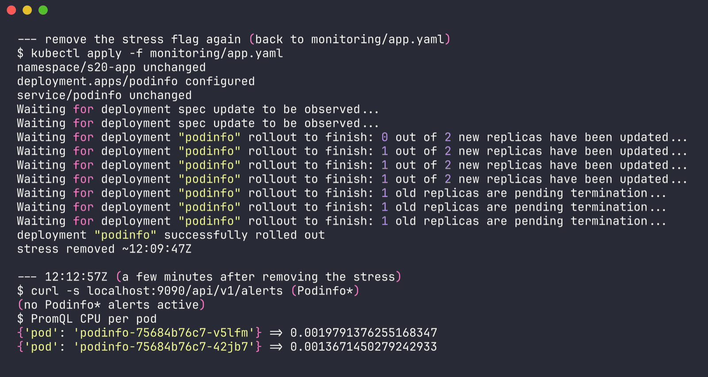

Observations:

- CPU flattened at exactly **0.5 cores** even though the stress asked for a full core. That's the 500m limit, and the throttling query shows 95-100% of CFS periods being throttled. A container pinned at its CPU limit is a classic "the app is slow but nothing is crashing" situation.
- Alertmanager's `receivers=null` is because the chart's default config routes everything to a receiver literally called `null`. A real setup would add a Slack/email/PagerDuty receiver there.

#### Alert 2 - PodinfoDown (scale to 0)

```
$ kubectl scale deploy podinfo -n s20-app --replicas=0
deployment.apps/podinfo scaled
scaled to 0 at 12:12:57Z

--- 12:13:35Z
$ PromQL up{namespace="s20-app"}
(empty result)
$ PromQL absent(up{namespace="s20-app", job="podinfo"})
{'job': 'podinfo', 'namespace': 's20-app'} => 1
$ curl -s localhost:9090/api/v1/alerts (Podinfo*)
PodinfoDown | state=pending | activeAt=2026-10-07T12:13:22 | severity=critical | pod=- | value=0e+00

--- 12:14:38Z
$ curl -s localhost:9090/api/v1/alerts (Podinfo*)
PodinfoDown | state=firing | activeAt=2026-10-07T12:13:37 | severity=critical | pod=- | value=1e+00
$ curl -s localhost:9093/api/v2/alerts (Alertmanager, Podinfo*)
PodinfoDown | status=active | startsAt=2026-10-07T12:14:37 | summary=podinfo has no healthy targets
$ PromQL kube_deployment_spec_replicas{namespace="s20-app"}
{... 'deployment': 'podinfo' ...} => 0
```

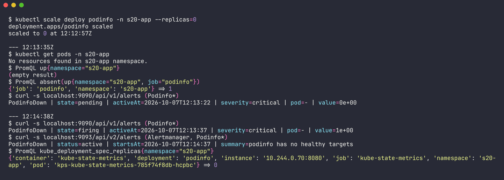

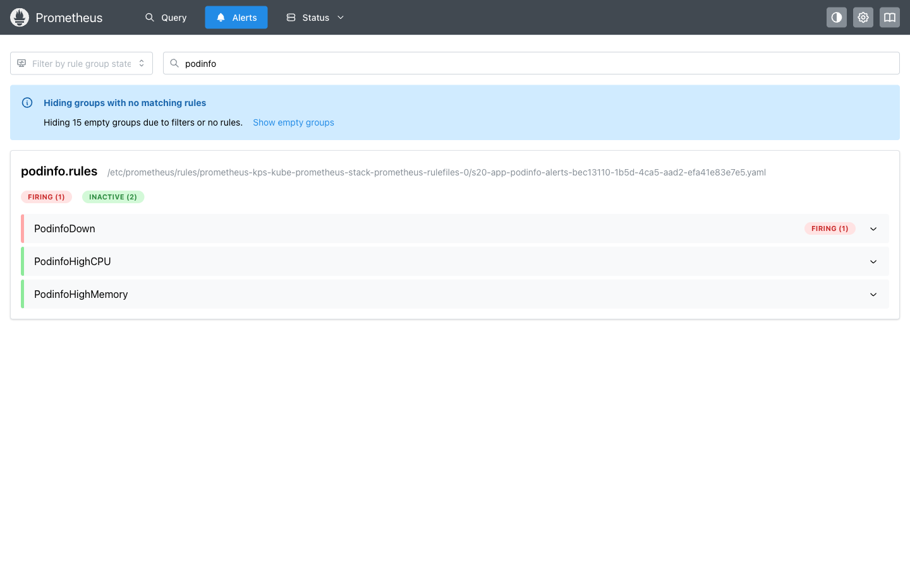

Scaled back to 2 and it cleared:

```
--- 12:15:39Z
$ PromQL up{namespace="s20-app"}
{'pod': 'podinfo-75684b76c7-qxqfk', ...} => 1
{'pod': 'podinfo-75684b76c7-fr577', ...} => 1
$ curl -s localhost:9090/api/v1/alerts (Podinfo*)
(no Podinfo* alerts active)
```

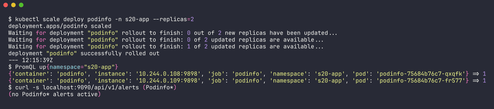

The interesting bit is **why the rule needs `absent()`**. When pods are scaled to 0, the ServiceMonitor has no endpoints, so there's no target and the `up` series doesn't exist at all. It doesn't go to 0, it just disappears. `sum(up) == 0` returns nothing on an empty set, so without `absent()` the "app is completely down" case would never alert. You can see it in the output: the first pending (`activeAt 12:13:22`, value 0) came from the `== 0` branch while the dying targets still reported `up=0`. Then the targets vanished, `absent()` took over (value 1), and the timer restarted at 12:13:37.

### Step 9 - Grafana

The chart provisions Prometheus and Alertmanager as data sources plus 25 dashboards. I checked all of it through the Grafana HTTP API, then imported my own dashboard from [`monitoring/grafana-dashboard-podinfo.json`](monitoring/grafana-dashboard-podinfo.json):

```
$ curl -s localhost:3000/api/health
{ "database": "ok", "version": "13.2.3", "commit": "90ffed056f0884267356c12a0eeb72a022af53f1" }

$ curl -s -u admin:*** localhost:3000/api/datasources
Alertmanager | alertmanager | http://kps-kube-prometheus-stack-alertmanager.s20-monitoring:9093/ | default=False
Prometheus | prometheus | http://kps-kube-prometheus-stack-prometheus.s20-monitoring:9090/ | default=True

$ curl -s -u admin:*** -X POST -H "Content-Type: application/json" localhost:3000/api/dashboards/db -d @monitoring/grafana-dashboard-podinfo.json
{"folderUid":"","id":119968838168576,"slug":"session-20-podinfo","status":"success","uid":"s20-podinfo","url":"/d/s20-podinfo/session-20-podinfo","version":1}

$ curl -s -u admin:*** "localhost:3000/api/search?type=dash-db"
...
efa86fd1d0c121a26444b636a3f509a8 | Kubernetes / Compute Resources / Cluster
85a562078cdf77779eaa1add43ccec1e | Kubernetes / Compute Resources / Namespace (Pods)
6581e46e4e5c7ba40a07646395ef7b23 | Kubernetes / Compute Resources / Pod
7d57716318ee0dddbac5a7f451fb7753 | Node Exporter / Nodes
9fa0d141-d019-4ad7-8bc5-42196ee308bd | Prometheus / Overview
s20-podinfo | Session 20 / podinfo

$ query Prometheus THROUGH Grafana: POST /api/ds/query  expr=sum(up{namespace="s20-app"})
status=200, executed: Expr: sum(up{namespace="s20-app"}) / Step: 15s | value: [2]
```

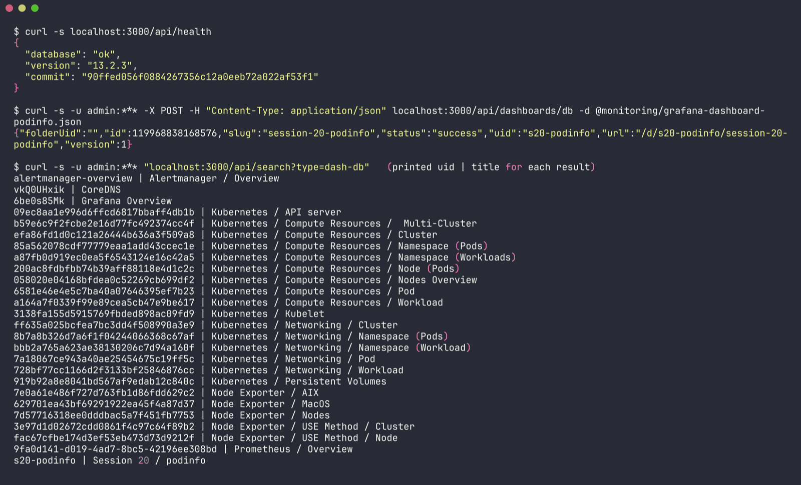

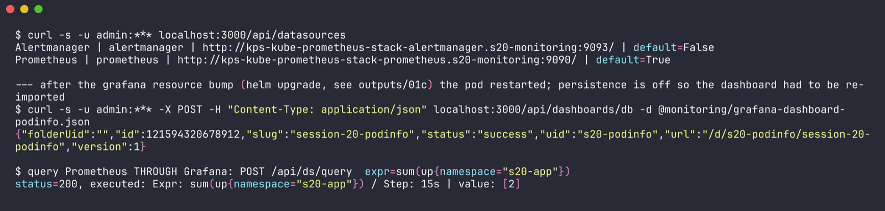

The dashboard after all the experiments above (times are IST). You can read the whole story off it: the traffic spike around 17:33, the CPU stress pinned at 0.5 around 17:35, and the pod names changing every time I rolled the deployment:

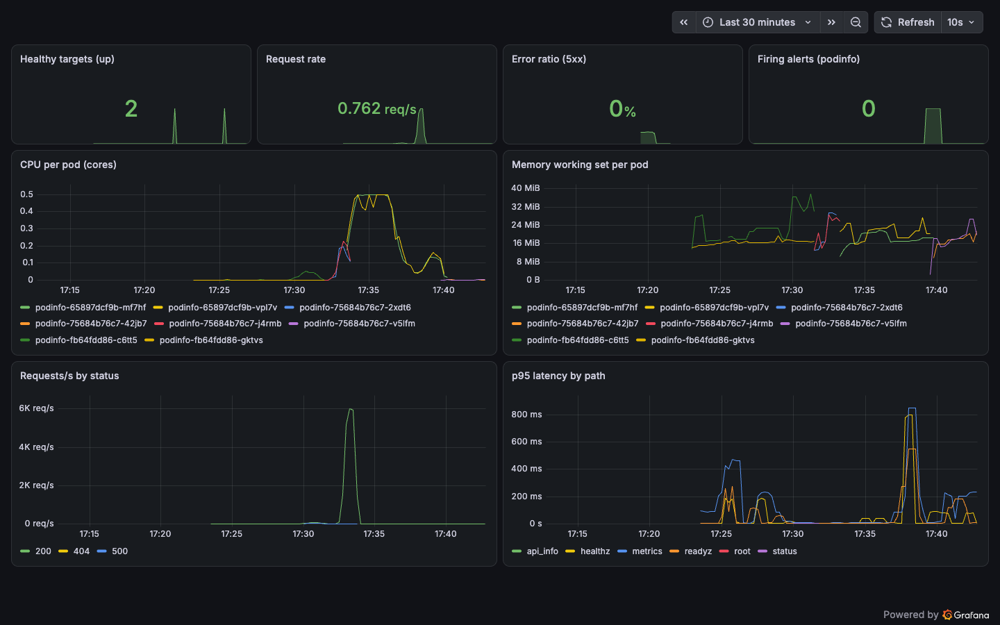

Grafana has no persistence in my values, so when the pod restarted after the resource change the imported dashboard was gone and I had to POST it again (`outputs/11`). In a real setup you'd put the JSON in a ConfigMap labelled `grafana_dashboard: "1"` and the sidecar loads it automatically, which is also the GitOps way to do it.

---

## Task 2 - Observability

Written up separately in **[observability/README.md](observability/README.md)**:

- monitoring vs observability, and why observability is needed
- the three pillars (metrics, logs, traces), what each is good and bad at, and how they connect
- common tools (Prometheus, Grafana, Alertmanager, Loki, ELK/EFK, Jaeger, Tempo, OpenTelemetry, Datadog / New Relic / cloud-native options)
- Kubernetes observability: cAdvisor, metrics-server, kube-state-metrics, node-exporter, probes, events, the logs pipeline, the Prometheus Operator CRDs

Everything in Task 1 maps onto that doc: cAdvisor gave the CPU/memory series, kube-state-metrics gave replicas/restarts/limits, node-exporter the node numbers, metrics-server `kubectl top`, the app's own `/metrics` the RED metrics, and `kubectl logs` / events the logs.

---

## Task 3 - GitOps

### What GitOps is

GitOps means running your infrastructure and deployments **from a Git repo**. The repo holds the desired state of the cluster as declarative files, and an agent *inside* the cluster keeps making the cluster match it.

The four ideas it's built on (OpenGitOps principles):

1. **Declarative** - you describe *what* you want (a Deployment with 2 replicas of `nginx:1.27-alpine`), not the steps to get there. That's just Kubernetes YAML.
2. **Versioned and immutable** - that description lives in Git, so every change is a commit with an author, a message, a diff and a way to revert.
3. **Pulled automatically** - an agent in the cluster (ArgoCD, Flux) pulls from Git. CI doesn't push into the cluster with `kubectl apply`, so CI doesn't need cluster credentials.
4. **Continuously reconciled** - the agent keeps comparing live state with Git and fixes any difference. Not just once at deploy time, all the time.

### Git as the single source of truth

If it's not in Git, it doesn't exist. A manual `kubectl edit` at 2am isn't a fix, it's **drift**: the cluster no longer matches what the repo says, and the next sync will throw it away. The proper fix is a commit (or a revert), which gives you:

- an audit trail for free (`git log` is the deploy history)
- review before deploy (pull requests)
- rollback = `git revert`
- disaster recovery: point a fresh cluster at the repo and it rebuilds itself

### Push-based CD vs GitOps (pull-based)

```
Push (classic CI/CD)                         Pull (GitOps)

 dev --push--> Git --> CI pipeline            dev --push--> Git (app code) --> CI: test, build, push image
                         |                                                       |
                         | kubectl apply        commit new image tag / replicas  v
                         | (CI holds cluster    -----------------------------> Git (config repo)
                         |  credentials)                                          ^
                         v                                                        | watch / pull every ~3 min
                     Kubernetes                                    ArgoCD (runs IN the cluster)
                                                                                  |
   nothing notices if someone kubectl-edits                                       | compare desired vs live
   the cluster afterwards                                                         v
                                                                     Kubernetes  <-- sync / self-heal on drift
```

### The GitOps workflow

```
  1. change YAML        2. pull request       3. merge to main        4. ArgoCD detects
  (replicas: 2 -> 5) --> review + CI checks --> new commit on main --> new revision
                                                                             |
  8. rollback = git revert  <-- 7. history shows   <-- 6. health check  <-- 5. sync: apply the diff
     (same loop again)          commit -> deploy        (Healthy?)           to the cluster
                                                                             ^
                       someone runs kubectl edit / scale / delete -----------+
                       -> live != Git -> OutOfSync -> selfHeal puts Git state back
```

### Kubernetes + GitOps

Kubernetes is basically built for this. It's already declarative (you submit desired state and controllers reconcile it), and ArgoCD just adds one more reconcile loop on top whose source of truth is Git instead of etcd. ArgoCD runs as a set of controllers in the `argocd` namespace:

- **repo-server** - clones the repo and renders manifests (plain YAML, Kustomize, Helm)
- **application-controller** - compares rendered vs live state, syncs, self-heals
- **server** - the UI / API
- **Application** CRD - one object = "this repo + path + revision goes to this cluster + namespace"

### Step 1 - install ArgoCD (lean)

```bash
helm repo add argo https://argoproj.github.io/argo-helm
helm install argocd argo/argo-cd -n argocd --create-namespace -f gitops/argocd-values.yaml --timeout 15m
```

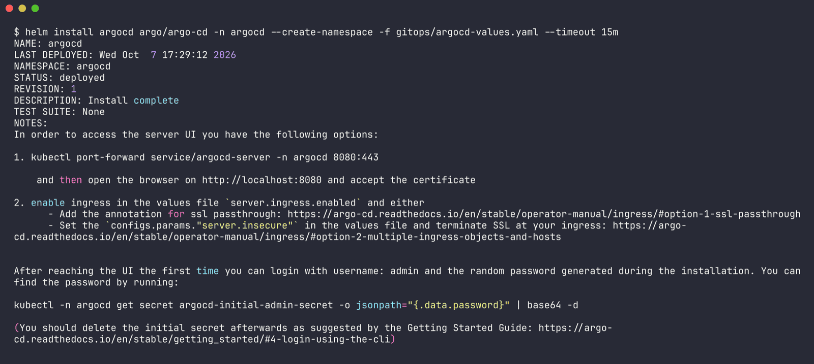

[`gitops/argocd-values.yaml`](gitops/argocd-values.yaml) turns off dex (SSO), notifications and the ApplicationSet controller, sets small requests, and sets `timeout.reconciliation: 60s` so ArgoCD polls Git every minute instead of every 3.

My first install failed with `failed pre-install: resource Job/argocd/argocd-redis-secret-init not ready ... context deadline exceeded`. Image pulls on the shared node were queued behind the monitoring images, so the pre-install hook didn't finish within helm's 5-minute default. Once the images were on the node, `helm uninstall` + reinstall with `--timeout 15m` went through:

```
$ kubectl get pods -n argocd
NAME                                 READY   STATUS    RESTARTS   AGE
argocd-application-controller-0      1/1     Running   0          16m
argocd-redis-57f7c59db7-w5rf5        1/1     Running   0          16m
argocd-repo-server-79688f9fb-p8542   1/1     Running   0          16m
argocd-server-cd478b94f-8rkss        1/1     Running   0          16m
```

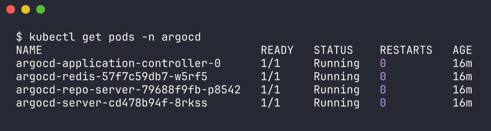

### Step 2 - which Git repo?

ArgoCD needs a repo it can read, and this folder wasn't pushed to my GitHub yet while I was doing the demo (shown in Step 7). So for the live demo I pointed ArgoCD at the instructor's **public** repo, which has the same deployment + service manifests as the session's `06-git-as-source-of-truth/gitops-repo/app`:

[`gitops/argocd-application-instructor.yaml`](gitops/argocd-application-instructor.yaml)

```yaml
spec:
  source:
    repoURL: https://github.com/Nency-Ravaliya/devops-heros.git
    targetRevision: main
    path: session20-monitoring-observability-gitops/06-git-as-source-of-truth/gitops-repo/app
  destination:
    server: https://kubernetes.default.svc
    namespace: s20-app
  syncPolicy:
    automated:
      prune: true      # delete what was removed from Git
      selfHeal: true   # undo manual changes
```

### Step 3 - initial sync

```
$ kubectl apply -f gitops/argocd-application-instructor.yaml
application.argoproj.io/s20-gitops-demo created

$ kubectl get applications -n argocd -o wide
NAME              SYNC STATUS   HEALTH STATUS   REVISION                                   PROJECT
s20-gitops-demo   Synced        Healthy         8376590a668ac8d6f2700d181c0739d0ed3fc5ea   default

$ kubectl get deploy session20-gitops-app -n s20-app ; kubectl get svc session20-gitops-app -n s20-app
NAME                   READY   UP-TO-DATE   AVAILABLE   AGE
session20-gitops-app   2/2     2            2           25s
NAME                   TYPE        CLUSTER-IP     EXTERNAL-IP   PORT(S)   AGE
session20-gitops-app   ClusterIP   10.109.1.183   <none>        80/TCP    25s

source:    https://github.com/Nency-Ravaliya/devops-heros.git @ main path: session20-.../06-git-as-source-of-truth/gitops-repo/app
sync:      Synced revision 8376590a668ac8d6f2700d181c0739d0ed3fc5ea
health:    Healthy
resource:  Service s20-app/session20-gitops-app Synced
resource:  Deployment s20-app/session20-gitops-app Synced
last op:   Succeeded | successfully synced (all tasks run) | startedAt 2026-10-07T12:15:52Z
```

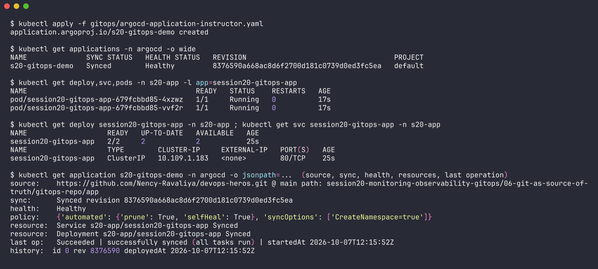

The revision ArgoCD reports, `8376590...`, is the same commit `git ls-remote https://github.com/Nency-Ravaliya/devops-heros.git HEAD` returned, so it really is reading Git. I never applied the Deployment myself.

### Step 4 - self-heal #1: someone scales it by hand

Git says `replicas: 2`.

```
$ kubectl scale deploy session20-gitops-app -n s20-app --replicas=5
deployment.apps/session20-gitops-app scaled
12:16:30Z
NAME                   READY   UP-TO-DATE   AVAILABLE   AGE
session20-gitops-app   2/5     2            2           38s
--- 12:16:32Z
NAME                   READY   UP-TO-DATE   AVAILABLE   AGE
session20-gitops-app   2/2     2            2           40s

last op: Succeeded | successfully synced (all tasks run) | initiatedBy: {'automated': True} | startedAt 2026-10-07T12:16:30Z
   Deployment session20-gitops-app Synced - deployment.apps/session20-gitops-app configured

$ kubectl get events -n s20-app --field-selector involvedObject.name=session20-gitops-app
13s  Normal  ScalingReplicaSet  deployment/session20-gitops-app  Scaled up replica set session20-gitops-app-679fcbbd85 from 2 to 5
12s  Normal  ScalingReplicaSet  deployment/session20-gitops-app  Scaled down replica set session20-gitops-app-679fcbbd85 from 5 to 2
```

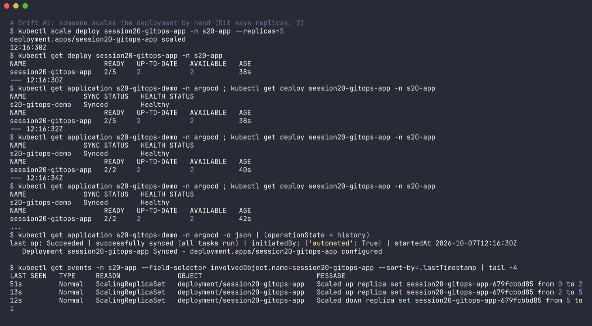

Reverted in about **2 seconds**, before the 3 extra pods were even ready. The sync was `initiatedBy: automated`, so nobody clicked anything. ArgoCD doesn't wait for the 60s poll for this: it watches the live objects, so a change to a managed resource triggers a comparison straight away.

### Step 5 - self-heal #2: someone deletes the Service

```
$ kubectl get svc session20-gitops-app -n s20-app -o jsonpath={.metadata.uid}
5f4cc483-7569-42c4-94fa-cb452e9c6e5a
$ kubectl delete svc session20-gitops-app -n s20-app
service "session20-gitops-app" deleted from s20-app namespace
12:16:52Z
--- 12:16:57Z
$ kubectl get svc session20-gitops-app -n s20-app
NAME                   TYPE        CLUSTER-IP      EXTERNAL-IP   PORT(S)   AGE
session20-gitops-app   ClusterIP   10.101.159.40   <none>        80/TCP    4s
$ kubectl get svc session20-gitops-app -n s20-app -o jsonpath={.metadata.uid}   # new UID = recreated object
960e0fca-15a2-4358-9885-044eee1be63b

last op: Succeeded | successfully synced (all tasks run) | initiatedBy: {'automated': True} | startedAt 2026-10-07T12:16:53Z
   Service session20-gitops-app Synced - service/session20-gitops-app created
```

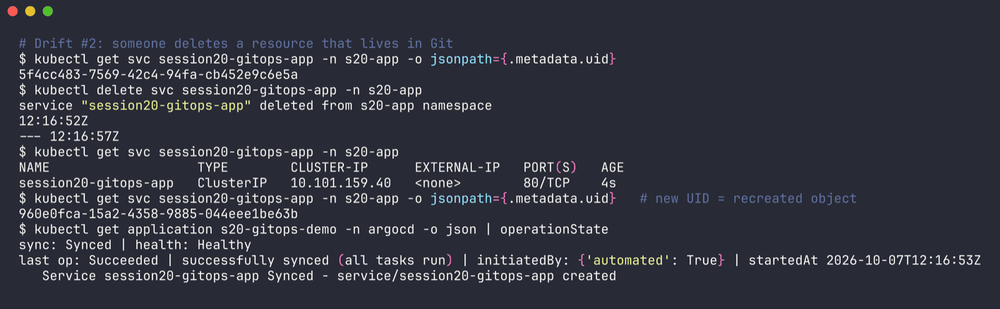

The Service was back within a second (`AGE 4s` when I checked 5s after deleting it). It's a brand new object with a new UID and a new ClusterIP, because ArgoCD re-created it from Git.

### Step 6 - drift detection (selfHeal off)

To *see* the drift instead of having it fixed instantly, I turned selfHeal off, then made a "hotfix" by hand: a new image plus a different replica count.

```
$ kubectl patch application s20-gitops-demo -n argocd --type merge -p '{"spec":{"syncPolicy":{"automated":{"prune":true,"selfHeal":false}}}}'
$ kubectl set image deploy/session20-gitops-app -n s20-app app=nginx:1.28-alpine   # manual hotfix, not in Git
$ kubectl scale deploy session20-gitops-app -n s20-app --replicas=3

--- 12:17:27Z
$ kubectl get applications -n argocd -o wide
NAME              SYNC STATUS   HEALTH STATUS   REVISION                                   PROJECT
s20-gitops-demo   OutOfSync     Healthy         8376590a668ac8d6f2700d181c0739d0ed3fc5ea   default

   Service session20-gitops-app -> Synced
   Deployment session20-gitops-app -> OutOfSync

$ desired (Git) vs live (cluster)
Git:   replicas: 2  image: nginx:1.27-alpine
Live: replicas: 3 image: nginx:1.28-alpine
```

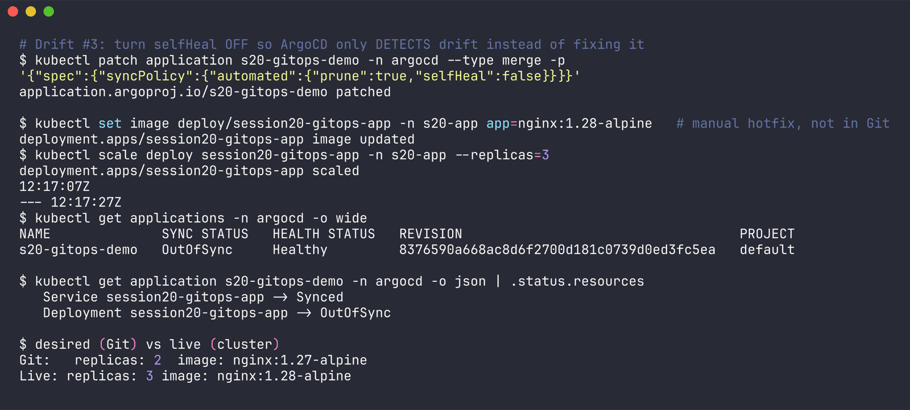

**OutOfSync** but still **Healthy**. Those are two separate questions: "does it match Git?" vs "is it working?". ArgoCD's UI shows exactly which fields drifted:

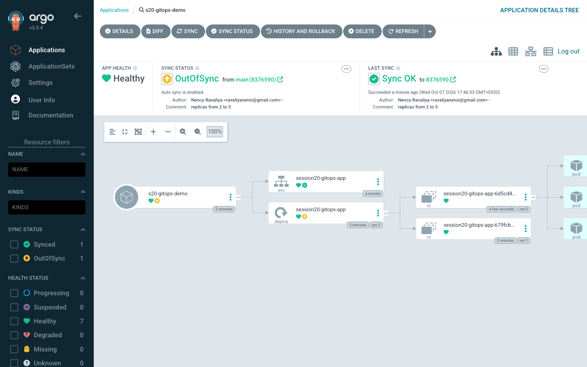

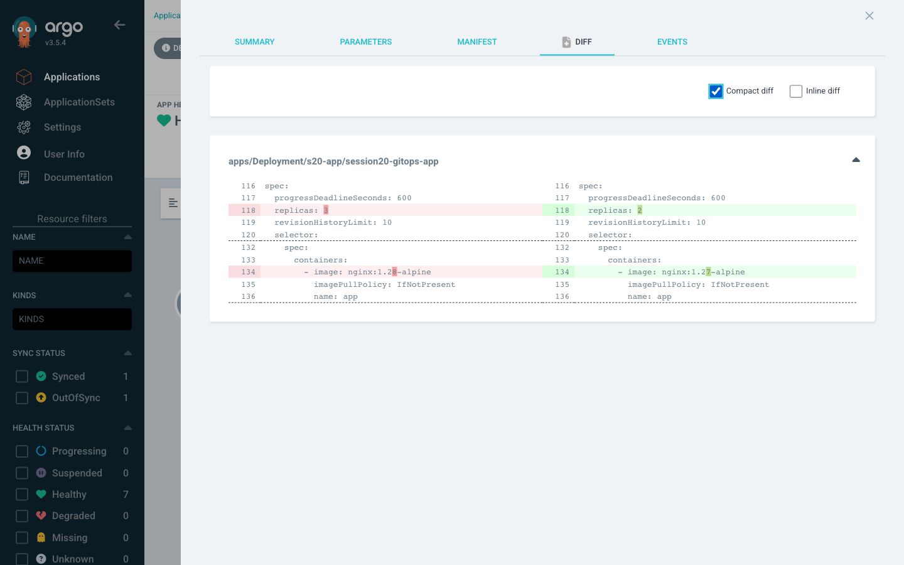

Turning selfHeal back on put Git's version back:

```
$ kubectl patch application s20-gitops-demo -n argocd --type merge -p '{"spec":{"syncPolicy":{"automated":{"prune":true,"selfHeal":true}}}}'
12:18:24Z
--- 12:18:44Z
s20-gitops-demo   Synced        Healthy         8376590a668ac8d6f2700d181c0739d0ed3fc5ea   default
Live: replicas: 2 image: nginx:1.27-alpine
last op: Succeeded | successfully synced (all tasks run) | initiatedBy: {'automated': True} | startedAt 2026-10-07T12:18:25Z
```

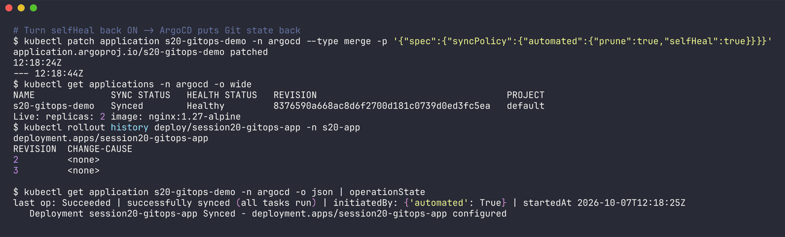

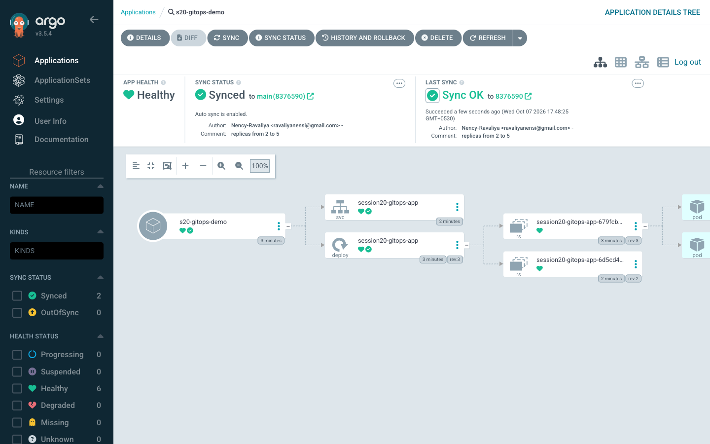

The takeaway: with GitOps the 1.28 "hotfix" would just get wiped out, so the only way to keep it is to commit it.

### Step 7 - a Git commit drives the change

The real GitOps loop is "commit -> cluster changes". I can't push to the instructor's repo, but their demo repo `Nency-Ravaliya/gitops-demo` has a real commit history for exactly this:

```
$ git log --format="%h %ad %s" --date=short -- app/deployment.yaml
5c2c67f 2026-10-05 replcias from 2 to 5
cf39cca 2026-10-03 Scale down to 2 replicas
f1f9aa9 2026-10-03 2 to 5 pods
...
$ git diff cf39cca 5c2c67f -- app/deployment.yaml
-  replicas: 2
+  replicas: 5
```

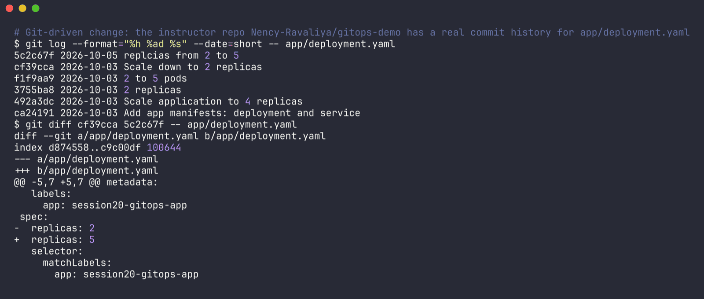

So I pinned an Application ([`gitops/argocd-application-commit-demo.yaml`](gitops/argocd-application-commit-demo.yaml)) to the **older** commit, then moved `targetRevision` to the newer one. That's the same thing ArgoCD sees when a new commit lands on a branch it tracks. That folder also contains an `Application` yaml, so I used `directory.exclude` to stop ArgoCD from creating a nested app. I also deleted the first demo app first (with the resources finalizer, so its Deployment went too), because both apps manage a Deployment with the same name.

```
$ kubectl apply -f gitops/argocd-application-commit-demo.yaml
--- 12:20:11Z
NAME              SYNC STATUS   HEALTH STATUS   REVISION   PROJECT
s20-commit-demo   Synced        Healthy         cf39cca    default
session20-gitops-app   2/2     2            2           22s

$ kubectl patch application s20-commit-demo -n argocd --type merge -p '{"spec":{"source":{"targetRevision":"5c2c67f"}}}'
--- 12:20:27Z
s20-commit-demo   Synced        Healthy         5c2c67f    default
session20-gitops-app   5/5     5            5           38s

$ kubectl get application s20-commit-demo -n argocd -o json | .status.history
id 0 | revision cf39cca4cced2874b960dd1a9b6f0be88fa53fef | deployedAt 2026-10-07T12:19:49Z | initiatedBy {'automated': True}
id 1 | revision 5c2c67fae0acccbb1233f56d3377cca402de8666 | deployedAt 2026-10-07T12:20:20Z | initiatedBy {'automated': True}
```

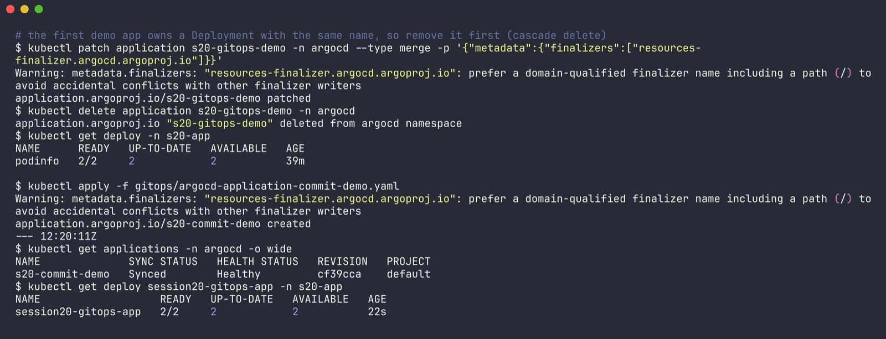

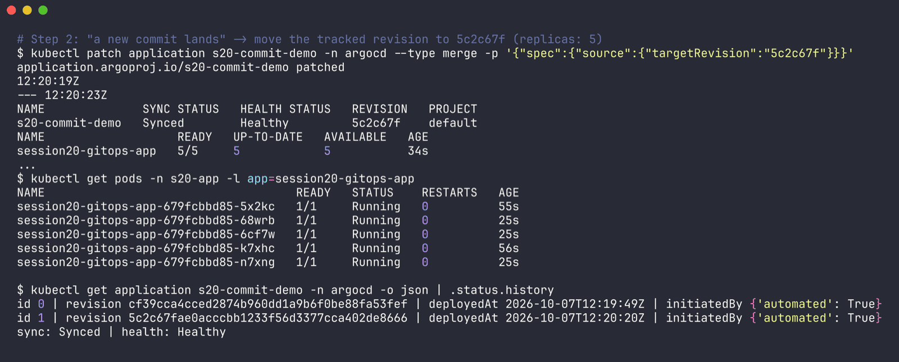

ArgoCD's history is now a list of **Git commits**, each with the time it was deployed. Rolling back is the same move in reverse (point at `cf39cca`, or `git revert` on a branch).

### Step 8 - my own GitOps repo setup

The manifests I want ArgoCD to manage from *my* repo are in [`gitops/app/`](gitops/app/): an nginx Deployment (2 replicas, readiness probe, requests/limits) and a Service. The Application is [`gitops/argocd-application.yaml`](gitops/argocd-application.yaml):

```yaml
spec:
  source:
    repoURL: https://github.com/Ridaa10394/DevOps.git
    targetRevision: main
    path: 19-monitoring-gitops/gitops/app
  destination:
    server: https://kubernetes.default.svc
    namespace: s20-app
  syncPolicy:
    automated: { prune: true, selfHeal: true }
    syncOptions: [CreateNamespace=true]
```

The Application yaml is deliberately **outside** `gitops/app/`. Otherwise ArgoCD would end up managing its own Application object.

I applied it before pushing, and ArgoCD said exactly what you'd expect:

```
$ kubectl get applications -n argocd s20-student-app
NAME              SYNC STATUS   HEALTH STATUS
s20-student-app   Unknown       Healthy
ComparisonError | Failed to load target state: failed to generate manifest for source 1 of 1: rpc error: code = Unknown desc = 19-monitoring-gitops/gitops/app: app path does not exist
```

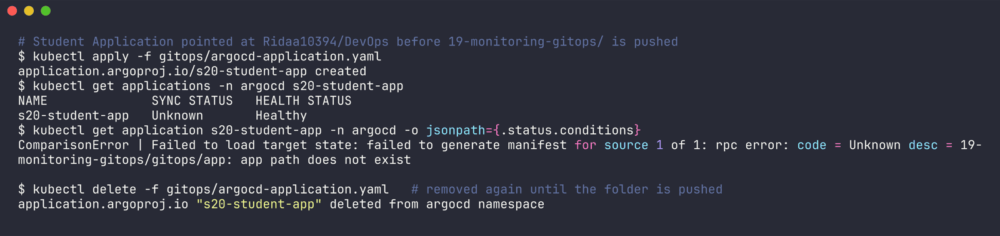

The repo itself was reachable (public, `git ls-remote` worked). It's only the folder that isn't on `main` yet. I deleted that Application again.

> TODO (run on your machine): push this folder, then do the full commit-driven loop against your own repo:
>
> ```bash
> git add 19-monitoring-gitops && git commit -m "session 20: monitoring + gitops" && git push
>
> # install argocd if it's not there (lean values from this folder)
> helm repo add argo https://argoproj.github.io/argo-helm
> helm install argocd argo/argo-cd -n argocd --create-namespace -f 19-monitoring-gitops/gitops/argocd-values.yaml
>
> kubectl apply -f 19-monitoring-gitops/gitops/argocd-application.yaml
> kubectl get applications -n argocd -o wide           # expect Synced / Healthy, REVISION = your commit sha
> kubectl get deploy s20-gitops-web -n s20-app         # 2/2
>
> # the GitOps change: edit Git, not the cluster
> sed -i '' 's/replicas: 2 /replicas: 4 /' 19-monitoring-gitops/gitops/app/deployment.yaml
> git commit -am "scale s20-gitops-web to 4" && git push
> # within ~60s (timeout.reconciliation) ArgoCD picks up the new commit:
> kubectl get applications -n argocd -o wide           # REVISION changes to the new sha
> kubectl get deploy s20-gitops-web -n s20-app         # 4/4
>
> # rollback the GitOps way
> git revert HEAD && git push                          # back to 2 replicas
>
> # UI: kubectl port-forward -n argocd svc/argocd-server 8080:80
> #     password: kubectl get secret -n argocd argocd-initial-admin-secret -o jsonpath='{.data.password}' | base64 -d
> ```

---

## Cleanup

Everything was uninstalled at the end so the shared cluster got its resources back (`outputs/18-teardown.txt`):

```
$ kubectl delete application s20-commit-demo -n argocd   # finalizer -> also deletes its Deployment/Service
$ helm uninstall argocd -n argocd
These resources were kept due to the resource policy:
[CustomResourceDefinition] applications.argoproj.io ...
$ helm uninstall kps -n s20-monitoring
$ kubectl delete ns s20-app s20-monitoring argocd
$ kubectl get crd -o name | grep -E 'argoproj.io|monitoring.coreos.com' | xargs kubectl delete
$ kubectl delete svc -n kube-system kps-kube-prometheus-stack-kubelet
$ helm list -A
NAME	NAMESPACE	REVISION	UPDATED	STATUS	CHART	APP VERSION
```

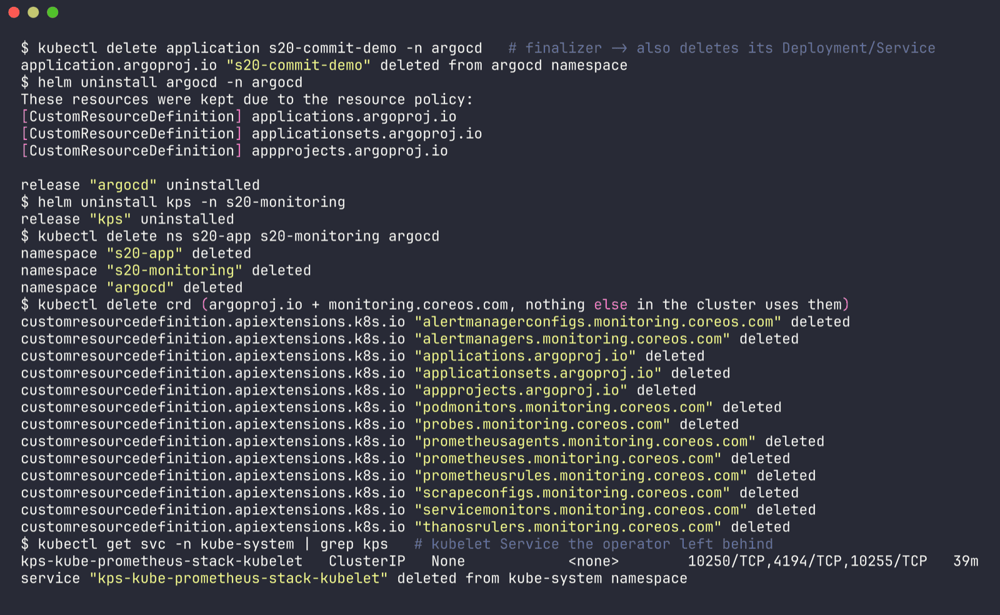

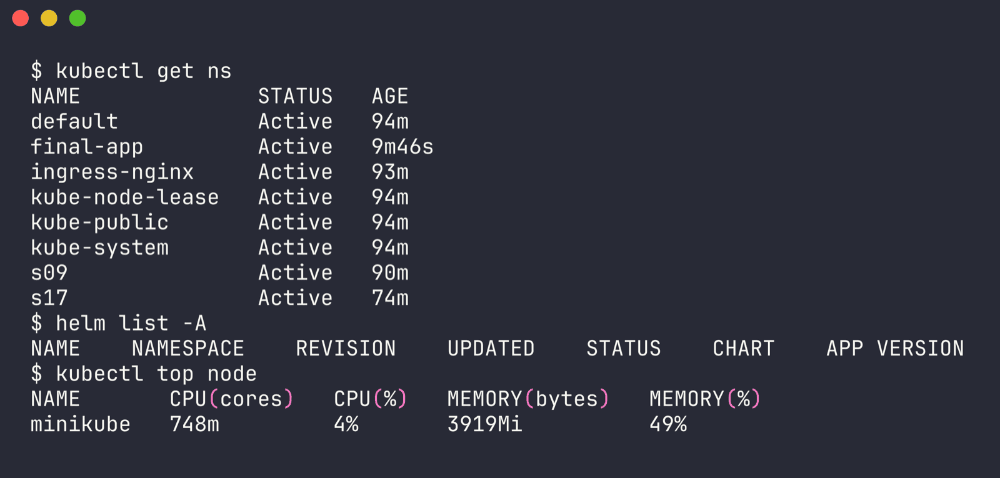

Two things helm leaves behind that you have to remove by hand: the **CRDs** (both charts keep them on uninstall so your custom resources don't vanish by accident), and the `kps-kube-prometheus-stack-kubelet` Service that the Prometheus Operator creates in `kube-system`.

## What I learned

- `up` going to 0 and `up` **disappearing** are different things, and an alert that doesn't cover both (`absent()`) will miss the worst case, which is the app being completely gone.
- CPU limits hide CPU problems: the stressed pod never went above 0.5 cores. The throttling ratio is the metric that shows the app is starving.
- Load testing a Go app with curl mostly tests curl. 3.5k req/s barely moved podinfo's CPU.
- The monitoring stack has to be monitored too. Grafana was the heaviest thing in my namespace until I trimmed its plugins.
- Synced and Healthy are two separate questions in ArgoCD, and drift can look perfectly healthy.
- With selfHeal on, a manual `kubectl` change lasts about 2 seconds, so the only change that sticks is a Git commit.
